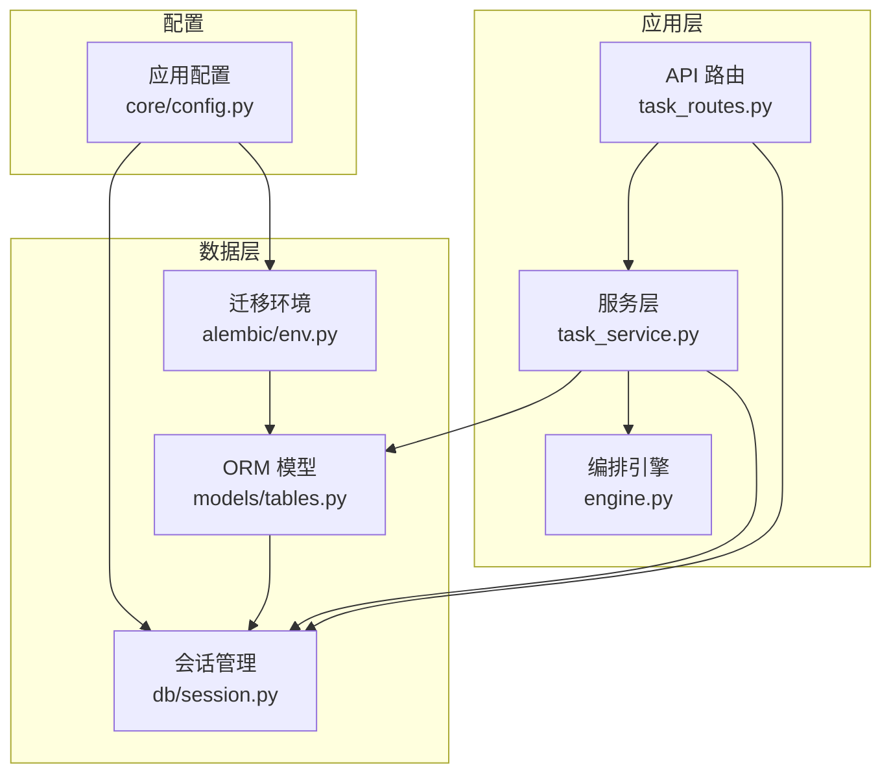
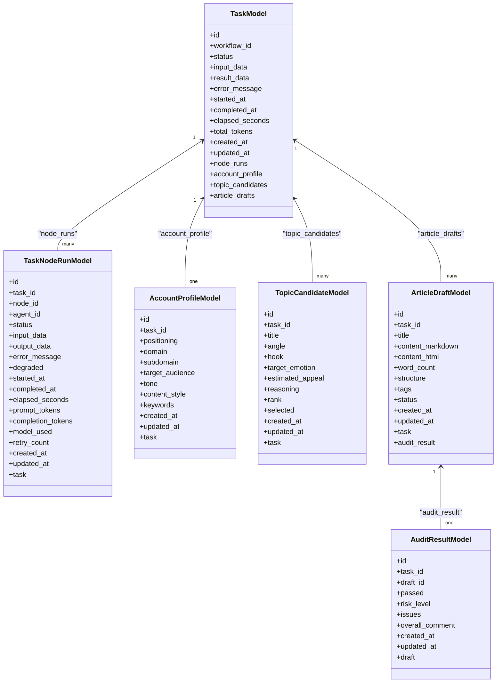
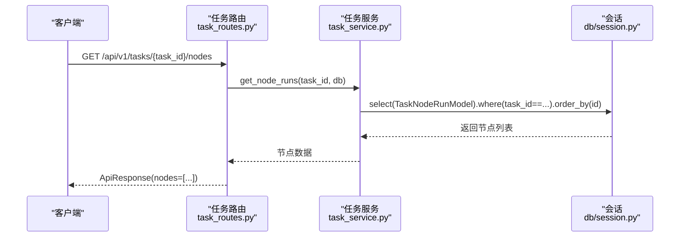
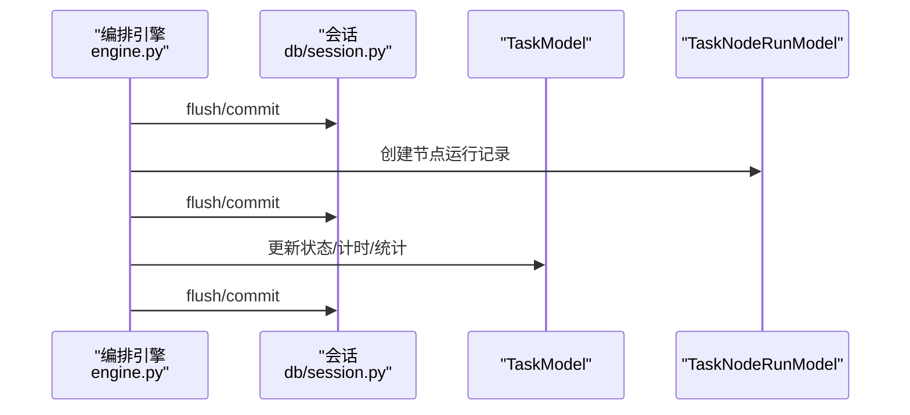
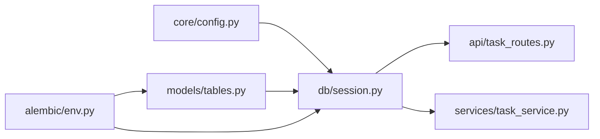

# 关系映射配置

<cite>
**本文引用的文件**
- [backend/app/models/tables.py](file://backend/app/models/tables.py)
- [backend/app/models/__init__.py](file://backend/app/models/__init__.py)
- [backend/app/db/session.py](file://backend/app/db/session.py)
- [backend/app/services/task_service.py](file://backend/app/services/task_service.py)
- [backend/app/api/task_routes.py](file://backend/app/api/task_routes.py)
- [backend/app/orchestrator/engine.py](file://backend/app/orchestrator/engine.py)
- [backend/alembic/env.py](file://backend/alembic/env.py)
- [backend/app/core/config.py](file://backend/app/core/config.py)
</cite>

## 目录
1. [简介](#简介)
2. [项目结构](#项目结构)
3. [核心组件](#核心组件)
4. [架构总览](#架构总览)
5. [详细组件分析](#详细组件分析)
6. [依赖分析](#依赖分析)
7. [性能考量](#性能考量)
8. [故障排查指南](#故障排查指南)
9. [结论](#结论)
10. [附录](#附录)

## 简介
本技术文档围绕 HotClaw 的 SQLAlchemy 关系映射配置展开，系统性阐述 relationship() 函数的使用方式、参数配置与双向关系维护机制；详解一对一、一对多、多对多关系在本项目中的设计与实现；结合外键约束、引用完整性和级联行为，给出关系查询最佳实践与性能优化策略，并通过实际代码路径示例展示如何正确使用关系映射进行数据查询与操作。

## 项目结构
本项目采用分层架构，数据库层以 DeclarativeBase 为基础，定义了任务生命周期相关的实体模型；服务层负责业务逻辑与查询优化；API 层负责请求响应与会话管理；迁移工具使用 Alembic 配合异步引擎。

图表来源
- [backend/app/api/task_routes.py:1-179](file://backend/app/api/task_routes.py#L1-L179)
- [backend/app/services/task_service.py:1-126](file://backend/app/services/task_service.py#L1-L126)
- [backend/app/orchestrator/engine.py:1-285](file://backend/app/orchestrator/engine.py#L1-L285)
- [backend/app/models/tables.py:1-319](file://backend/app/models/tables.py#L1-L319)
- [backend/app/db/session.py:1-50](file://backend/app/db/session.py#L1-L50)
- [backend/alembic/env.py:1-53](file://backend/alembic/env.py#L1-L53)
- [backend/app/core/config.py:1-99](file://backend/app/core/config.py#L1-L99)

章节来源
- [backend/app/models/tables.py:1-319](file://backend/app/models/tables.py#L1-L319)
- [backend/app/models/__init__.py:1-28](file://backend/app/models/__init__.py#L1-L28)
- [backend/app/db/session.py:1-50](file://backend/app/db/session.py#L1-L50)
- [backend/app/services/task_service.py:1-126](file://backend/app/services/task_service.py#L1-L126)
- [backend/app/api/task_routes.py:1-179](file://backend/app/api/task_routes.py#L1-L179)
- [backend/app/orchestrator/engine.py:1-285](file://backend/app/orchestrator/engine.py#L1-L285)
- [backend/alembic/env.py:1-53](file://backend/alembic/env.py#L1-L53)
- [backend/app/core/config.py:1-99](file://backend/app/core/config.py#L1-L99)

## 核心组件
- 基类与模型：基于 DeclarativeBase 定义的 TaskModel、TaskNodeRunModel、AccountProfileModel、TopicCandidateModel、ArticleDraftModel、AuditResultModel 等。
- 关系映射：通过 relationship(back_populates=...) 建立双向关系；使用 ForeignKey 定义外键；部分关系通过 cascade 控制级联行为。
- 查询优化：服务层使用 selectinload 进行急加载，避免 N+1 查询；API 层按需批量查询以减少往返。
- 异步会话：使用 async_session_factory 提供的 AsyncSession，配合上下文管理器确保事务与连接正确释放。

章节来源
- [backend/app/models/tables.py:23-158](file://backend/app/models/tables.py#L23-L158)
- [backend/app/services/task_service.py:68-78](file://backend/app/services/task_service.py#L68-L78)
- [backend/app/db/session.py:16-36](file://backend/app/db/session.py#L16-L36)

## 架构总览
下图展示了任务与其子资源之间的关系映射与调用链路，体现一对多与一对一关系的双向维护与查询模式。

图表来源
- [backend/app/models/tables.py:23-158](file://backend/app/models/tables.py#L23-L158)

## 详细组件分析

### 关系映射设计与参数配置
- relationship(back_populates=...)：用于建立双向关系，确保父对象与子对象相互引用一致，便于读写与一致性维护。
- uselist 参数：当值为 False 时表示一对一关系；为 True 表示一对多关系。
- cascade 参数：在 TaskModel 中对 node_runs 使用 cascade="all, delete-orphan"，表示删除父记录时自动删除子记录，且孤儿子项也会被清理。
- 外键字段：通过 mapped_column(ForeignKey(...)) 定义，如 TaskNodeRunModel.task_id 引用 tasks.id；AccountProfileModel.task_id 引用 tasks.id 并设置 unique=True 实现一对一约束。

章节来源
- [backend/app/models/tables.py:42-43](file://backend/app/models/tables.py#L42-L43)
- [backend/app/models/tables.py:53-73](file://backend/app/models/tables.py#L53-L73)
- [backend/app/models/tables.py:81-94](file://backend/app/models/tables.py#L81-L94)
- [backend/app/models/tables.py:102-116](file://backend/app/models/tables.py#L102-L116)
- [backend/app/models/tables.py:124-137](file://backend/app/models/tables.py#L124-L137)
- [backend/app/models/tables.py:146-157](file://backend/app/models/tables.py#L146-L157)

### 关系类型与实现要点
- 一对一关系（uselist=False）
  - 示例：TaskModel.account_profile ↔ AccountProfileModel.task
  - 特点：AccountProfileModel.task_id 设置唯一索引，确保一对一映射。
- 一对多关系（uselist=True）
  - 示例：TaskModel.node_runs ↔ TaskNodeRunModel.task
  - 示例：TaskModel.topic_candidates ↔ TopicCandidateModel.task
  - 示例：TaskModel.article_drafts ↔ ArticleDraftModel.task
  - 特点：通过外键指向父表主键，子集合可为空列表。
- 多对多关系
  - 本项目未直接出现显式多对多中间表；如需扩展，可在两个实体间添加中间表并通过 secondary 或双侧 back_populates 建模。

章节来源
- [backend/app/models/tables.py:42-43](file://backend/app/models/tables.py#L42-L43)
- [backend/app/models/tables.py:53-73](file://backend/app/models/tables.py#L53-L73)
- [backend/app/models/tables.py:81-94](file://backend/app/models/tables.py#L81-L94)
- [backend/app/models/tables.py:102-116](file://backend/app/models/tables.py#L102-L116)
- [backend/app/models/tables.py:124-137](file://backend/app/models/tables.py#L124-L137)
- [backend/app/models/tables.py:146-157](file://backend/app/models/tables.py#L146-L157)

### 双向关系维护机制（back_populates）
- 在父模型中定义 relationship(back_populates="子属性名")，在子模型中定义 relationship(back_populates="父属性名")，即可实现双向引用。
- 维护建议：
  - 写入时同时更新父子双方，避免状态不一致。
  - 删除父对象时，若使用 cascade="all, delete-orphan"，子对象将被自动清理。
  - 查询时优先使用 selectinload 等急加载策略，避免 N+1 查询。

章节来源
- [backend/app/models/tables.py:42-43](file://backend/app/models/tables.py#L42-L43)
- [backend/app/models/tables.py](file://backend/app/models/tables.py#L73)
- [backend/app/models/tables.py](file://backend/app/models/tables.py#L94)
- [backend/app/models/tables.py](file://backend/app/models/tables.py#L116)
- [backend/app/models/tables.py:137-138](file://backend/app/models/tables.py#L137-L138)
- [backend/app/models/tables.py](file://backend/app/models/tables.py#L157)

### 外键约束与引用完整性
- 外键字段定义：使用 mapped_column(ForeignKey("父表.列"))，如 TaskNodeRunModel.task_id → tasks.id。
- 唯一性约束：AccountProfileModel.task_id 设置唯一索引，确保一对一关系。
- 引用完整性：通过外键约束保证子记录的父键存在；删除父记录时，若未配置级联，将触发完整性异常。
- 级联操作：TaskModel.node_runs 使用 cascade="all, delete-orphan"，实现父删子随删与孤儿清理。

章节来源
- [backend/app/models/tables.py](file://backend/app/models/tables.py#L53)
- [backend/app/models/tables.py](file://backend/app/models/tables.py#L81)
- [backend/app/models/tables.py](file://backend/app/models/tables.py#L42)

### 关系查询最佳实践
- 懒加载（默认）：访问属性时才发起查询，适合只读场景；但可能导致 N+1 查询。
- 急加载（selectinload）：服务层在 TaskService.get_task_with_nodes 中使用 selectinload(TaskModel.node_runs)，一次性加载所有子记录，避免 N+1。
- 批量查询：API 层在查询代理配置时，先收集 ID 列表，再一次性查询数据库，减少往返次数。
- 条件过滤：在查询节点执行记录时，按 task_id 过滤并排序，确保结果有序可控。

图表来源
- [backend/app/api/task_routes.py:126-149](file://backend/app/api/task_routes.py#L126-L149)
- [backend/app/services/task_service.py:104-114](file://backend/app/services/task_service.py#L104-L114)
- [backend/app/db/session.py:23-36](file://backend/app/db/session.py#L23-L36)

章节来源
- [backend/app/services/task_service.py:68-78](file://backend/app/services/task_service.py#L68-L78)
- [backend/app/services/task_service.py:104-114](file://backend/app/services/task_service.py#L104-L114)
- [backend/app/api/task_routes.py:126-149](file://backend/app/api/task_routes.py#L126-L149)

### 编排流程中的关系使用
- 编排引擎在执行每个节点前，会创建 TaskNodeRunModel 记录并关联到 TaskModel，完成后更新状态与耗时。
- 该过程体现了关系映射在写入阶段的一致性维护与持久化。

图表来源
- [backend/app/orchestrator/engine.py:114-122](file://backend/app/orchestrator/engine.py#L114-L122)
- [backend/app/orchestrator/engine.py:102-105](file://backend/app/orchestrator/engine.py#L102-L105)
- [backend/app/orchestrator/engine.py:265-271](file://backend/app/orchestrator/engine.py#L265-L271)

章节来源
- [backend/app/orchestrator/engine.py:92-234](file://backend/app/orchestrator/engine.py#L92-L234)

## 依赖分析
- 模型依赖：各模型均继承自同一 Base 类，统一元数据与表名约定。
- 会话依赖：API 与服务层通过依赖注入获取 AsyncSession，确保事务边界清晰。
- 迁移依赖：Alembic 从配置读取数据库 URL，扫描 Base.metadata，完成版本化迁移。
- 配置依赖：数据库 URL 与调试开关来自 Settings，影响引擎与会话行为。

图表来源
- [backend/app/core/config.py:52-99](file://backend/app/core/config.py#L52-L99)
- [backend/app/db/session.py:9-20](file://backend/app/db/session.py#L9-L20)
- [backend/app/api/task_routes.py:1-179](file://backend/app/api/task_routes.py#L1-L179)
- [backend/app/services/task_service.py:1-126](file://backend/app/services/task_service.py#L1-L126)
- [backend/app/models/tables.py:18-21](file://backend/app/models/tables.py#L18-L21)
- [backend/alembic/env.py:9-18](file://backend/alembic/env.py#L9-L18)

章节来源
- [backend/app/core/config.py:52-99](file://backend/app/core/config.py#L52-L99)
- [backend/app/db/session.py:9-20](file://backend/app/db/session.py#L9-L20)
- [backend/alembic/env.py:9-18](file://backend/alembic/env.py#L9-L18)

## 性能考量
- 避免 N+1 查询：使用 selectinload 急加载子集合；API 层批量查询代理提示词与技能配置。
- 选择合适的懒/急加载策略：仅在需要时加载子集合，减少网络与数据库压力。
- 外键与索引：为常用过滤字段（如 task_id）建立索引，提升查询效率。
- 事务粒度：合理拆分事务，避免长时间持有锁；必要时使用回滚保护。
- 连接池与预检：根据数据库类型启用 pool_pre_ping，提升连接稳定性（非 SQLite）。

章节来源
- [backend/app/services/task_service.py:68-78](file://backend/app/services/task_service.py#L68-L78)
- [backend/app/api/agent_routes.py:22-28](file://backend/app/api/agent_routes.py#L22-L28)
- [backend/app/db/session.py:7-14](file://backend/app/db/session.py#L7-L14)

## 故障排查指南
- 关系不一致：检查 back_populates 是否成对配置；写入时同步更新父子双方。
- 外键冲突：确认父记录存在后再插入子记录；检查唯一性约束是否被违反。
- 级联行为异常：核对 cascade 配置；明确“删除父即删除子”与“孤儿清理”的预期。
- N+1 查询：使用 selectinload 或批量查询替代逐条访问；在 API 层合并多次查询。
- 事务未提交：确保在路由或服务层显式 commit；使用上下文管理器确保关闭与回滚。

章节来源
- [backend/app/models/tables.py:42-43](file://backend/app/models/tables.py#L42-L43)
- [backend/app/services/task_service.py:68-78](file://backend/app/services/task_service.py#L68-L78)
- [backend/app/api/agent_routes.py:22-28](file://backend/app/api/agent_routes.py#L22-L28)
- [backend/app/db/session.py:23-36](file://backend/app/db/session.py#L23-L36)

## 结论
本项目通过清晰的关系映射设计与双向维护机制，实现了任务生命周期内多层级数据的稳定关联。借助异步会话、急加载与批量查询策略，有效规避了 N+1 问题并提升了整体性能。建议在扩展新关系时遵循现有模式：明确外键与唯一性约束、成对配置 back_populates、合理设置 cascade，并在查询端采用 selectinload 与批量查询以获得最佳性能与可维护性。

## 附录
- 代码路径示例（仅路径，不含具体代码内容）：
  - 任务模型与关系定义：[backend/app/models/tables.py:23-158](file://backend/app/models/tables.py#L23-L158)
  - 会话工厂与依赖注入：[backend/app/db/session.py:16-36](file://backend/app/db/session.py#L16-L36)
  - 急加载查询示例：[backend/app/services/task_service.py:68-78](file://backend/app/services/task_service.py#L68-L78)
  - 批量查询示例（代理配置）：[backend/app/api/agent_routes.py:22-28](file://backend/app/api/agent_routes.py#L22-L28)
  - 编排引擎中的关系使用：[backend/app/orchestrator/engine.py:114-122](file://backend/app/orchestrator/engine.py#L114-L122)
  - 迁移环境与元数据扫描：[backend/alembic/env.py:9-18](file://backend/alembic/env.py#L9-L18)
  - 应用配置与数据库 URL：[backend/app/core/config.py:52-57](file://backend/app/core/config.py#L52-L57)