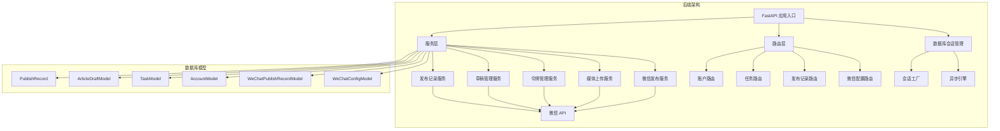
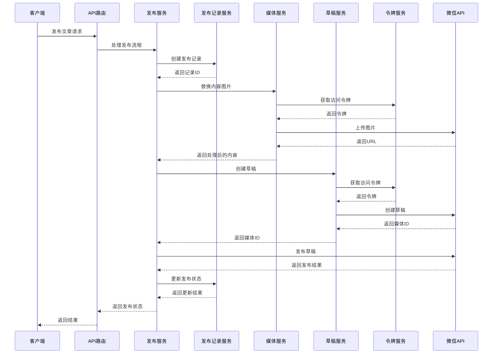
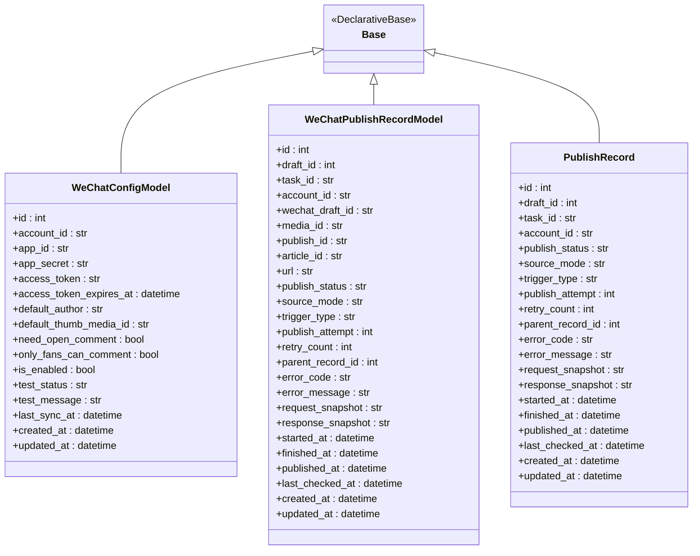
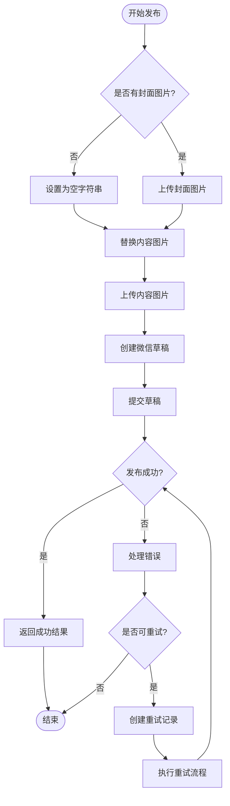
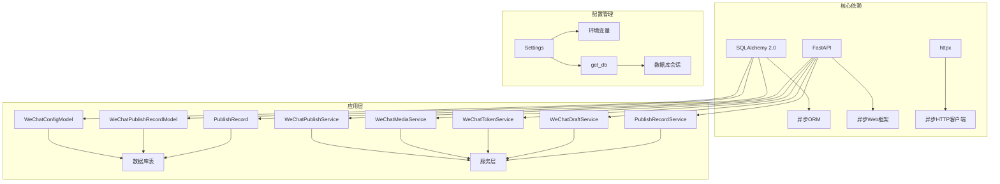

# 微信数据库模型

<cite>
**本文档引用的文件**
- [backend/app/models/wechat_config.py](file://backend/app/models/wechat_config.py)
- [backend/app/models/tables.py](file://backend/app/models/tables.py)
- [backend/app/schemas/wechat.py](file://backend/app/schemas/wechat.py)
- [backend/app/services/wechat_publish_service.py](file://backend/app/services/wechat_publish_service.py)
- [backend/app/services/wechat_media_service.py](file://backend/app/services/wechat_media_service.py)
- [backend/app/services/wechat_token_service.py](file://backend/app/services/wechat_token_service.py)
- [backend/app/services/wechat_draft_service.py](file://backend/app/services/wechat_draft_service.py)
- [backend/app/services/publish_record_service.py](file://backend/app/services/publish_record_service.py)
- [backend/app/api/wechat_routes.py](file://backend/app/api/wechat_routes.py)
- [backend/app/db/session.py](file://backend/app/db/session.py)
- [backend/app/main.py](file://backend/app/main.py)
- [backend/app/core/config.py](file://backend/app/core/config.py)
</cite>

## 更新摘要
**变更内容**
- WeChatPublishRecordModel从简单跟踪表升级为完整的审计跟踪系统
- 新增source_mode、trigger_type、publish_attempt、retry_count、parent_record_id等字段
- 支持六种发布状态：pending、publishing、published、failed、unknown
- 实现完整的重试机制和审计功能
- 增强时间戳跟踪和错误处理能力

## 目录
1. [简介](#简介)
2. [项目结构](#项目结构)
3. [核心组件](#核心组件)
4. [架构概览](#架构概览)
5. [详细组件分析](#详细组件分析)
6. [依赖关系分析](#依赖关系分析)
7. [性能考虑](#性能考虑)
8. [故障排除指南](#故障排除指南)
9. [结论](#结论)

## 简介

HotClaw 是一个基于多智能体架构的微信公众号内容创作平台。本文档专注于微信数据库模型的设计与实现，涵盖了从账号配置到文章发布的完整数据流程。

该系统采用 SQLAlchemy 2.0 异步 ORM，支持 SQLite（开发环境）和 MySQL（生产环境），实现了完整的微信公众号内容发布自动化流程。**最新版本**将 WeChatPublishRecordModel 升级为完整的审计跟踪系统，提供全面的发布状态管理和重试机制。

## 项目结构



**图表来源**
- [backend/app/main.py:112-222](file://backend/app/main.py#L112-L222)
- [backend/app/db/session.py:28-44](file://backend/app/db/session.py#L28-L44)

**章节来源**
- [backend/app/main.py:1-222](file://backend/app/main.py#L1-L222)
- [backend/app/db/session.py:1-114](file://backend/app/db/session.py#L1-L114)

## 核心组件

### 数据库模型层

系统包含三个主要的微信相关数据模型：

#### WeChatConfigModel（微信配置模型）
- 存储每个微信公众号的配置信息
- 包含 App ID、App Secret、默认作者等关键配置
- 支持评论设置和启用状态管理

#### WeChatPublishRecordModel（微信发布记录模型）
- **全新升级**：完整的审计跟踪系统
- 跟踪真实的发布状态和生命周期
- 记录草稿 ID、媒体 ID、发布 ID 等关键标识
- **新增字段**：source_mode、trigger_type、publish_attempt、retry_count、parent_record_id
- **支持六种状态**：pending、publishing、published、failed、unknown
- **详细时间戳**：started_at、finished_at、published_at、last_checked_at
- 支持发布状态查询和错误处理

#### PublishRecord（发布记录模型）
- **新增**：独立的发布记录实体
- 支持重试机制和状态同步
- 提供完整的发布历史追踪

### 服务层组件

#### WeChatPublishService（微信发布服务）
- 处理完整的发布流程：图片替换 → 草稿创建 → 文章发布
- 集成多个子服务进行协作
- 提供统一的发布接口

#### PublishRecordService（发布记录服务）
- **全新**：统一管理发布记录生命周期
- 职责：创建发布记录、更新发布状态、记录错误、状态回查同步
- 支持重试机制和审计功能

#### WeChatMediaService（微信媒体服务）
- 处理图片上传和替换
- 支持内容图片和封面图片上传
- 自动下载外部图片并上传到微信 CDN

#### WeChatTokenService（微信令牌服务）
- 管理 access_token 的获取和缓存
- 支持自动刷新和过期处理
- 提供连接测试功能

#### WeChatDraftService（微信草稿服务）
- 管理微信草稿的创建、更新、删除
- 支持草稿状态查询
- 提供完整的草稿生命周期管理

**章节来源**
- [backend/app/models/wechat_config.py:10-100](file://backend/app/models/wechat_config.py#L10-L100)
- [backend/app/services/wechat_publish_service.py:23-345](file://backend/app/services/wechat_publish_service.py#L23-L345)
- [backend/app/services/publish_record_service.py:30-433](file://backend/app/services/publish_record_service.py#L30-L433)
- [backend/app/services/wechat_media_service.py:25-257](file://backend/app/services/wechat_media_service.py#L25-L257)
- [backend/app/services/wechat_token_service.py:26-163](file://backend/app/services/wechat_token_service.py#L26-L163)
- [backend/app/services/wechat_draft_service.py:23-335](file://backend/app/services/wechat_draft_service.py#L23-L335)

## 架构概览



**图表来源**
- [backend/app/services/wechat_publish_service.py:36-143](file://backend/app/services/wechat_publish_service.py#L36-L143)
- [backend/app/services/publish_record_service.py:56-107](file://backend/app/services/publish_record_service.py#L56-L107)
- [backend/app/services/wechat_media_service.py:173-248](file://backend/app/services/wechat_media_service.py#L173-L248)
- [backend/app/services/wechat_draft_service.py:32-121](file://backend/app/services/wechat_draft_service.py#L32-L121)

## 详细组件分析

### 数据模型设计



**图表来源**
- [backend/app/models/wechat_config.py:10-100](file://backend/app/models/wechat_config.py#L10-L100)

### 发布流程实现



**图表来源**
- [backend/app/services/wechat_publish_service.py:75-143](file://backend/app/services/wechat_publish_service.py#L75-L143)
- [backend/app/services/publish_record_service.py:265-317](file://backend/app/services/publish_record_service.py#L265-L317)

### API 路由设计

```mermaid
graph LR
subgraph "微信配置API"
A[GET /config/{account_id}] --> B[获取配置]
C[POST /config] --> D[创建配置]
E[PUT /config/{account_id}] --> F[更新配置]
G[POST /test-connection] --> H[测试连接]
end
subgraph "发布记录API"
I[GET /publish-records/{record_id}] --> J[获取发布记录]
K[POST /publish-records/{record_id}/refresh-status] --> L[刷新发布状态]
end
subgraph "数据模型"
M[WeChatConfigModel]
N[WeChatPublishRecordModel]
O[PublishRecord]
end
subgraph "服务层"
P[WeChatTokenService]
Q[WeChatMediaService]
R[WeChatDraftService]
S[WeChatPublishService]
T[PublishRecordService]
end
B --> M
D --> M
F --> M
H --> P
J --> N
L --> S
S --> Q
S --> R
S --> P
T --> N
```

**图表来源**
- [backend/app/api/wechat_routes.py:32-349](file://backend/app/api/wechat_routes.py#L32-L349)

**章节来源**
- [backend/app/models/wechat_config.py:1-100](file://backend/app/models/wechat_config.py#L1-L100)
- [backend/app/api/wechat_routes.py:1-349](file://backend/app/api/wechat_routes.py#L1-L349)

## 依赖关系分析



**图表来源**
- [backend/app/core/config.py:89-166](file://backend/app/core/config.py#L89-L166)
- [backend/app/db/session.py:16-44](file://backend/app/db/session.py#L16-L44)

### 数据库连接管理

系统采用异步数据库连接管理，支持多种数据库类型：

- **SQLite**：开发环境默认，使用 `sqlite+aiosqlite` 驱动
- **MySQL**：生产环境推荐，支持连接池和预ping机制
- **连接池配置**：支持 `pool_pre_ping` 参数优化连接有效性检测

**章节来源**
- [backend/app/db/session.py:28-44](file://backend/app/db/session.py#L28-L44)
- [backend/app/core/config.py:106-109](file://backend/app/core/config.py#L106-L109)

## 性能考虑

### 缓存策略
- **令牌缓存**：access_token 缓存 2 小时，提前 5 分钟刷新
- **连接复用**：httpx 异步客户端自动管理连接池
- **数据库连接池**：SQLAlchemy 异步连接池优化数据库访问

### 异步处理
- 所有网络请求采用异步模式，避免阻塞
- 数据库操作使用异步 Session，提高并发性能
- 图片上传和下载采用流式处理，减少内存占用

### 错误处理
- 网络超时统一设置为 30-60 秒
- 重试机制避免临时性网络故障
- 详细的日志记录便于性能监控和问题诊断

### 审计跟踪优化
- **索引优化**：为 draft_id、account_id、task_id 添加索引
- **批量操作**：支持批量状态查询和更新
- **缓存策略**：热门发布记录缓存减少数据库压力

## 故障排除指南

### 常见问题及解决方案

#### 微信 API 连接问题
- **症状**：令牌获取失败，返回 `WeChatTokenError`
- **原因**：App ID 或 App Secret 错误
- **解决**：检查配置信息，使用 `/test-connection` 接口验证

#### 图片上传失败
- **症状**：媒体服务抛出 `WeChatMediaError`
- **原因**：网络超时或图片格式不支持
- **解决**：检查网络连接，确认图片格式为支持的类型

#### 草稿创建失败
- **症状**：草稿服务抛出 `WeChatDraftError`
- **原因**：内容格式不符合微信要求
- **解决**：检查 HTML 内容格式，确保符合微信规范

#### 发布记录异常
- **症状**：发布记录状态不一致或重试失败
- **原因**：数据库事务冲突或并发访问
- **解决**：检查数据库连接，确认事务正确提交

#### 数据库连接问题
- **症状**：数据库操作超时或连接失败
- **原因**：连接池耗尽或数据库服务不可用
- **解决**：检查数据库配置，增加连接池大小

**章节来源**
- [backend/app/services/wechat_token_service.py:21-23](file://backend/app/services/wechat_token_service.py#L21-L23)
- [backend/app/services/wechat_media_service.py:20-22](file://backend/app/services/wechat_media_service.py#L20-L22)
- [backend/app/services/wechat_draft_service.py:18-20](file://backend/app/services/wechat_draft_service.py#L18-L20)

## 结论

HotClaw 的微信数据库模型设计体现了现代 Web 应用的最佳实践：

1. **模块化设计**：清晰的服务层分离，每个服务职责单一
2. **异步架构**：全面采用异步编程模型，提升系统性能
3. **错误处理**：完善的异常处理机制，确保系统稳定性
4. **配置管理**：灵活的配置系统，支持多环境部署
5. **数据安全**：敏感信息加密存储，令牌自动管理
6. **审计跟踪**：完整的发布记录系统，支持重试和状态同步
7. **扩展性**：支持手动、半自动和全自动发布模式

**最新版本**的 WeChatPublishRecordModel 升级为完整的审计跟踪系统，为微信公众号内容自动化发布提供了坚实的数据基础。该系统支持从简单的手动发布到复杂的全自动化运营模式，通过合理的架构设计和完善的错误处理机制，能够在各种环境下稳定运行，满足不同规模企业的需求。

系统现已支持：
- 六种发布状态管理
- 完整的重试机制
- 详细的审计跟踪
- 多种触发类型
- 溯源和历史追踪
- 实时状态同步

这使得 HotClaw 成为了一个功能完备、可扩展性强的微信公众号内容发布平台。