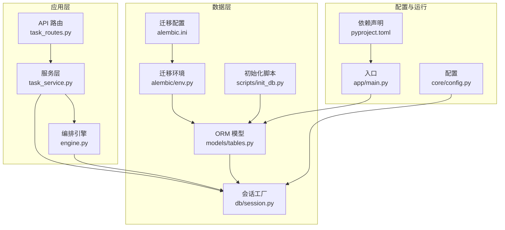
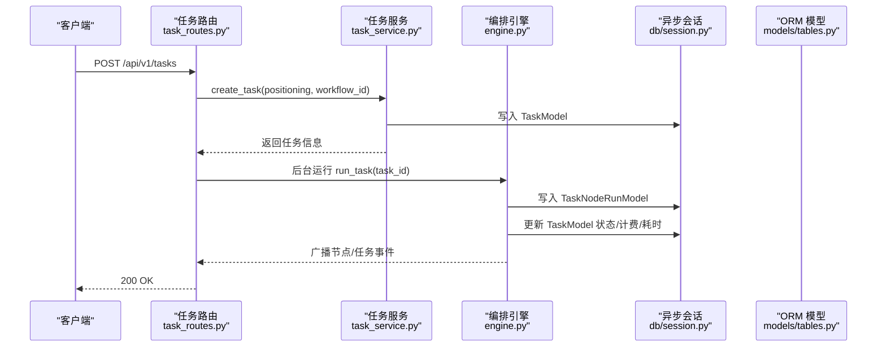
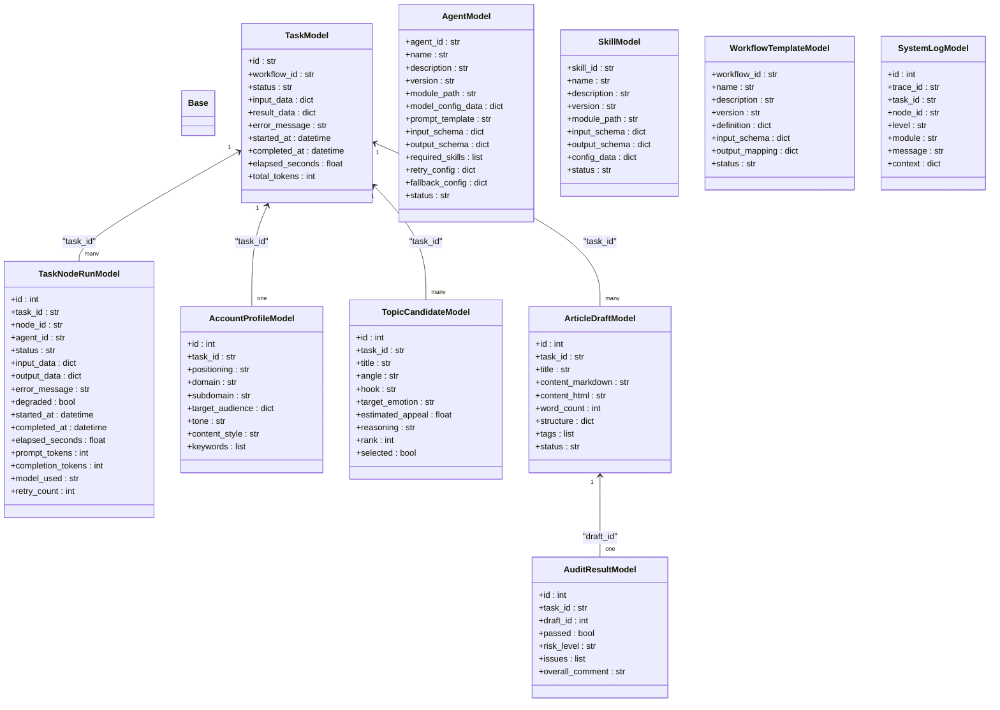
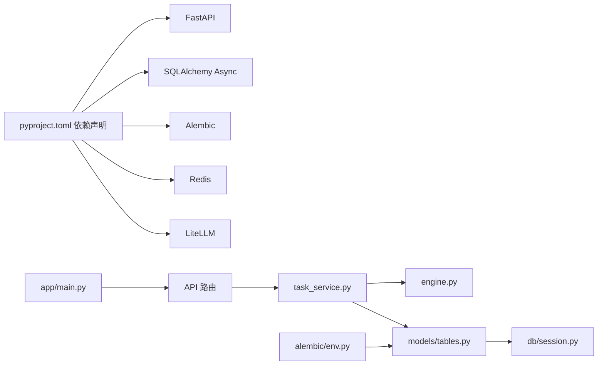

# 数据库设计

<cite>
**本文引用的文件**
- [backend/app/models/tables.py](file://backend/app/models/tables.py)
- [backend/app/db/session.py](file://backend/app/db/session.py)
- [backend/alembic/env.py](file://backend/alembic/env.py)
- [backend/alembic.ini](file://backend/alembic.ini)
- [scripts/init_db.py](file://scripts/init_db.py)
- [backend/app/core/config.py](file://backend/app/core/config.py)
- [backend/app/schemas/task.py](file://backend/app/schemas/task.py)
- [backend/app/api/task_routes.py](file://backend/app/api/task_routes.py)
- [backend/app/services/task_service.py](file://backend/app/services/task_service.py)
- [backend/app/orchestrator/engine.py](file://backend/app/orchestrator/engine.py)
- [backend/pyproject.toml](file://backend/pyproject.toml)
- [backend/app/main.py](file://backend/app/main.py)
- [backend/app/core/exceptions.py](file://backend/app/core/exceptions.py)
- [backend/app/core/logger.py](file://backend/app/core/logger.py)
</cite>

## 目录
1. [简介](#简介)
2. [项目结构](#项目结构)
3. [核心组件](#核心组件)
4. [架构总览](#架构总览)
5. [详细组件分析](#详细组件分析)
6. [依赖分析](#依赖分析)
7. [性能考虑](#性能考虑)
8. [故障排查指南](#故障排查指南)
9. [结论](#结论)
10. [附录](#附录)

## 简介
本文件面向数据库开发者与架构师，系统化阐述 HotClaw 平台的数据模型设计与实现，覆盖 ORM 模型定义、数据库表结构、关系映射、外键约束与索引策略；同时给出数据迁移（Alembic）管理、数据访问模式、缓存策略与性能优化建议，并补充数据安全、隐私保护与访问控制的设计要点。内容基于后端代码库的实际实现进行归纳总结。

## 项目结构
后端采用 FastAPI + SQLAlchemy Async 的技术栈，数据库层通过异步会话工厂提供连接与事务管理，Alembic 负责迁移版本控制。核心数据模型集中在 models 层，迁移脚本由 Alembic 统一管理，初始化脚本与应用启动时自动建表。

图表来源
- [backend/app/api/task_routes.py:1-163](file://backend/app/api/task_routes.py#L1-L163)
- [backend/app/services/task_service.py:1-126](file://backend/app/services/task_service.py#L1-L126)
- [backend/app/orchestrator/engine.py:1-285](file://backend/app/orchestrator/engine.py#L1-L285)
- [backend/app/models/tables.py:1-233](file://backend/app/models/tables.py#L1-L233)
- [backend/app/db/session.py:1-33](file://backend/app/db/session.py#L1-L33)
- [backend/alembic/env.py:1-53](file://backend/alembic/env.py#L1-L53)
- [backend/alembic.ini:1-39](file://backend/alembic.ini#L1-L39)
- [scripts/init_db.py:1-16](file://scripts/init_db.py#L1-L16)
- [backend/app/core/config.py:1-51](file://backend/app/core/config.py#L1-L51)
- [backend/app/main.py:1-142](file://backend/app/main.py#L1-L142)
- [backend/pyproject.toml:1-41](file://backend/pyproject.toml#L1-L41)

章节来源
- [backend/app/models/tables.py:1-233](file://backend/app/models/tables.py#L1-L233)
- [backend/app/db/session.py:1-33](file://backend/app/db/session.py#L1-L33)
- [backend/alembic/env.py:1-53](file://backend/alembic/env.py#L1-L53)
- [backend/alembic.ini:1-39](file://backend/alembic.ini#L1-L39)
- [scripts/init_db.py:1-16](file://scripts/init_db.py#L1-L16)
- [backend/app/core/config.py:1-51](file://backend/app/core/config.py#L1-L51)
- [backend/app/main.py:1-142](file://backend/app/main.py#L1-L142)
- [backend/pyproject.toml:1-41](file://backend/pyproject.toml#L1-L41)

## 核心组件
- ORM 基类与模型：统一基类、任务、节点执行记录、账号画像、话题候选、文章草稿、审核结果、代理与技能、工作流模板、系统日志等。
- 异步会话工厂：基于 SQLAlchemy Async 创建连接与会话，支持自动回滚与提交。
- 迁移环境与配置：Alembic 异步迁移环境，读取配置中的数据库 URL，注册元数据。
- 初始化脚本：在开发环境一键创建所有表。
- 配置中心：数据库 URL、Redis URL、超时参数等。
- 服务与编排：任务生命周期管理、节点执行记录持久化、令牌统计与广播通知。

章节来源
- [backend/app/models/tables.py:18-233](file://backend/app/models/tables.py#L18-L233)
- [backend/app/db/session.py:8-33](file://backend/app/db/session.py#L8-L33)
- [backend/alembic/env.py:9-52](file://backend/alembic/env.py#L9-L52)
- [scripts/init_db.py:8-16](file://scripts/init_db.py#L8-L16)
- [backend/app/core/config.py:7-51](file://backend/app/core/config.py#L7-L51)
- [backend/app/services/task_service.py:20-126](file://backend/app/services/task_service.py#L20-L126)
- [backend/app/orchestrator/engine.py:89-285](file://backend/app/orchestrator/engine.py#L89-L285)

## 架构总览
下图展示从 API 到服务、编排、数据库的调用链路，以及模型与迁移环境的关系。

图表来源
- [backend/app/api/task_routes.py:19-51](file://backend/app/api/task_routes.py#L19-L51)
- [backend/app/services/task_service.py:22-63](file://backend/app/services/task_service.py#L22-L63)
- [backend/app/orchestrator/engine.py:92-234](file://backend/app/orchestrator/engine.py#L92-L234)
- [backend/app/db/session.py:22-33](file://backend/app/db/session.py#L22-L33)
- [backend/app/models/tables.py:23-158](file://backend/app/models/tables.py#L23-L158)

## 详细组件分析

### 数据模型与表结构
- 任务表（tasks）
  - 主键：字符串 ID（长度上限 64）
  - 字段：工作流 ID、状态、输入/输出 JSON、错误信息、时间戳、耗时、总 token 数
  - 关系：一对多到节点执行记录、一对一到账号画像、一对多到话题候选、一对多到文章草稿
- 节点执行记录表（task_node_runs）
  - 主键：自增整数
  - 外键：task_id 指向 tasks.id
  - 字段：节点 ID、代理 ID、状态、输入/输出 JSON、错误信息、降级标记、时间戳、耗时、prompt/completion token、模型名、重试次数
  - 关系：多对一到任务
- 账号画像表（account_profiles）
  - 主键：自增整数，唯一外键 task_id 指向 tasks.id
  - 字段：定位文本、领域/子域、目标受众 JSON、语调、内容风格、关键词列表
  - 关系：一对一到任务
- 话题候选表（topic_candidates）
  - 主键：自增整数
  - 外键：task_id 指向 tasks.id
  - 字段：标题、角度、钩子、目标情绪、吸引力评分、推理、排序、是否选中
  - 关系：多对一到任务
- 文章草稿表（article_drafts）
  - 主键：自增整数
  - 外键：task_id 指向 tasks.id
  - 字段：标题、Markdown/HTML 内容、字数、结构 JSON、标签列表、状态
  - 关系：多对一到任务，一对一到审核结果
- 审核结果表（audit_results）
  - 主键：自增整数
  - 外键：task_id 指向 tasks.id，draft_id 指向 article_drafts.id
  - 字段：是否通过、风险等级、问题列表、总体评论
  - 关系：多对一到草稿
- 代理配置表（agents）、技能配置表（skills）、工作流模板表（workflow_templates）、系统日志表（system_logs）
  - 代理与技能：主键为字符串 ID，包含描述、版本、模块路径、Schema、状态、JSON 配置等
  - 工作流模板：主键为字符串 ID，包含模板定义、输入输出 Schema、状态
  - 系统日志：包含 trace_id、task_id 等字段，trace_id、task_id 建有索引

章节来源
- [backend/app/models/tables.py:23-233](file://backend/app/models/tables.py#L23-L233)

### 类关系图（模型）

图表来源
- [backend/app/models/tables.py:23-233](file://backend/app/models/tables.py#L23-L233)

### 关系设计、外键与索引
- 外键约束
  - task_node_runs.task_id → tasks.id（级联删除或孤儿删除由关系配置决定）
  - account_profiles.task_id → tasks.id（唯一外键）
  - topic_candidates.task_id → tasks.id
  - article_drafts.task_id → tasks.id
  - audit_results.task_id → tasks.id
  - audit_results.draft_id → article_drafts.id
- 索引策略
  - system_logs.trace_id、system_logs.task_id 建有索引，便于按追踪与任务检索
- 级联与删除
  - 任务删除时，节点执行记录、草稿、话题候选等通过“级联删除或孤儿删除”策略处理，避免悬挂数据

章节来源
- [backend/app/models/tables.py:48-233](file://backend/app/models/tables.py#L48-L233)

### 数据迁移管理（Alembic）
- 异步迁移环境
  - 读取配置 settings.database_url，设置 Alembic 配置项
  - 注册 Base.metadata，支持在线/离线迁移
- 迁移脚本位置
  - alembic/versions 下存放版本化迁移脚本
- 开发与生产差异
  - 开发默认使用 SQLite，生产使用 PostgreSQL
  - alembic.ini 中提供默认 PostgreSQL 连接串，可按需替换

章节来源
- [backend/alembic/env.py:1-53](file://backend/alembic/env.py#L1-L53)
- [backend/alembic.ini:1-39](file://backend/alembic.ini#L1-L39)
- [backend/app/core/config.py:11-14](file://backend/app/core/config.py#L11-L14)

### 数据访问模式与缓存策略
- 数据访问模式
  - 使用异步会话工厂创建会话，请求期间注入依赖，异常时回滚，结束时关闭
  - 服务层封装查询与写入，避免在 API 层直接操作数据库
- 缓存策略建议
  - 对高频查询（如任务列表、节点详情）引入 Redis 缓存
  - 对只读配置（代理/技能/工作流模板）采用本地内存缓存 + 版本号校验
  - 对审计结果与草稿状态变更使用发布订阅（当前已通过广播器推送）减少轮询

章节来源
- [backend/app/db/session.py:22-33](file://backend/app/db/session.py#L22-L33)
- [backend/app/services/task_service.py:68-114](file://backend/app/services/task_service.py#L68-L114)
- [backend/app/core/config.py:16-20](file://backend/app/core/config.py#L16-L20)

### 性能优化建议
- 查询优化
  - 在任务列表与节点查询中使用分页与条件过滤，避免一次性加载全量数据
  - 对常用过滤字段（如 status、created_at）建立索引
- 写入优化
  - 批量写入节点执行记录时合并 flush，减少往返
  - 控制 JSON 字段大小，必要时拆分为独立表或压缩存储
- 连接池与预热
  - 生产环境启用 pool_pre_ping，确保连接可用性
  - 应用启动时预热数据库连接，避免首次请求抖动

章节来源
- [backend/app/services/task_service.py:80-102](file://backend/app/services/task_service.py#L80-L102)
- [backend/app/db/session.py:8-19](file://backend/app/db/session.py#L8-L19)
- [backend/app/core/config.py:43-45](file://backend/app/core/config.py#L43-L45)

### 数据安全、隐私与访问控制
- 数据安全
  - 敏感配置通过环境变量注入，避免硬编码
  - 日志输出结构化，避免敏感字段直接打印
- 隐私保护
  - 输入/输出 JSON 中可能包含用户隐私，应限制其存储周期与访问范围
  - 审核结果与草稿仅授权人员可见
- 访问控制
  - API 层统一异常处理与状态码映射，避免泄露内部细节
  - 对外部接口增加速率限制与鉴权（当前示例未包含鉴权中间件）

章节来源
- [backend/app/core/config.py:11-14](file://backend/app/core/config.py#L11-L14)
- [backend/app/core/logger.py:8-36](file://backend/app/core/logger.py#L8-L36)
- [backend/app/main.py:88-129](file://backend/app/main.py#L88-L129)

## 依赖分析
- 组件耦合
  - 服务层依赖模型与编排引擎，不直接依赖数据库连接
  - API 路由仅负责请求响应与依赖注入，业务逻辑在服务层
- 外部依赖
  - SQLAlchemy Async、Alembic、structlog、FastAPI、Redis、LiteLLM 等
- 循环依赖
  - 当前结构清晰，未见循环导入

图表来源
- [backend/pyproject.toml:6-22](file://backend/pyproject.toml#L6-L22)
- [backend/app/main.py:14-27](file://backend/app/main.py#L14-L27)
- [backend/app/api/task_routes.py:16-163](file://backend/app/api/task_routes.py#L16-L163)
- [backend/app/services/task_service.py:13-14](file://backend/app/services/task_service.py#L13-L14)
- [backend/app/orchestrator/engine.py:24-26](file://backend/app/orchestrator/engine.py#L24-L26)
- [backend/app/models/tables.py:15](file://backend/app/models/tables.py#L15)
- [backend/app/db/session.py:3](file://backend/app/db/session.py#L3)
- [backend/alembic/env.py:9-18](file://backend/alembic/env.py#L9-L18)

章节来源
- [backend/pyproject.toml:1-41](file://backend/pyproject.toml#L1-L41)
- [backend/app/main.py:14-27](file://backend/app/main.py#L14-L27)

## 性能考虑
- 异步 I/O：使用 SQLAlchemy Async 与 FastAPI，提升并发吞吐
- 会话生命周期：请求开始创建会话，异常回滚，结束关闭，避免长事务
- 查询优化：分页、条件过滤、索引、选择性加载（selectinload）
- 缓存与广播：Redis 缓存 + SSE 广播，降低数据库压力
- 连接池：生产环境启用预检与连接复用

章节来源
- [backend/app/db/session.py:8-19](file://backend/app/db/session.py#L8-L19)
- [backend/app/services/task_service.py:68-114](file://backend/app/services/task_service.py#L68-L114)
- [backend/app/orchestrator/engine.py:236-243](file://backend/app/orchestrator/engine.py#L236-L243)

## 故障排查指南
- 常见异常与处理
  - 任务不存在：返回 404，消息包含任务 ID
  - 代理/技能不存在：返回 404
  - 任务已在运行：返回 409
  - 代理执行超时：返回 504
  - 其他未捕获异常：返回 500
- 日志与追踪
  - 结构化日志输出，包含 trace_id、task_id、模块、级别与上下文
  - API 中间件生成 trace_id 并注入响应头
- 数据一致性
  - 会话异常自动回滚，确保失败不污染数据库
  - 节点执行记录在失败时保留错误信息，便于定位

章节来源
- [backend/app/core/exceptions.py:24-125](file://backend/app/core/exceptions.py#L24-L125)
- [backend/app/main.py:88-129](file://backend/app/main.py#L88-L129)
- [backend/app/core/logger.py:8-36](file://backend/app/core/logger.py#L8-L36)
- [backend/app/db/session.py:22-33](file://backend/app/db/session.py#L22-L33)
- [backend/app/orchestrator/engine.py:164-196](file://backend/app/orchestrator/engine.py#L164-L196)

## 结论
本设计以 SQLAlchemy Async 为核心，结合 Alembic 迁移与结构化日志，构建了高并发、可观测、可扩展的数据层。模型关系清晰、外键与索引策略合理，配合服务层与编排引擎实现了任务全生命周期管理。建议在生产环境中进一步完善鉴权、缓存与监控体系，并持续演进工作流模板与代理/技能配置的版本化管理。

## 附录
- 初始化与迁移
  - 开发环境：应用启动自动建表
  - 命令行：也可使用初始化脚本创建表
  - 迁移：通过 Alembic 在线/离线执行版本升级
- 配置要点
  - 数据库 URL 支持 SQLite（开发）与 PostgreSQL（生产）
  - Redis URL 用于缓存与广播
  - 超时参数可按场景调整

章节来源
- [backend/app/main.py:48-53](file://backend/app/main.py#L48-L53)
- [scripts/init_db.py:8-16](file://scripts/init_db.py#L8-L16)
- [backend/alembic/env.py:21-52](file://backend/alembic/env.py#L21-L52)
- [backend/app/core/config.py:11-20](file://backend/app/core/config.py#L11-L20)