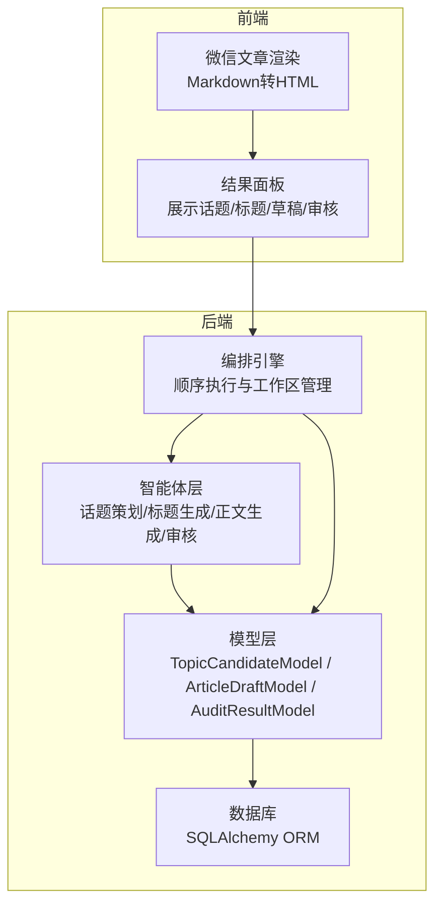
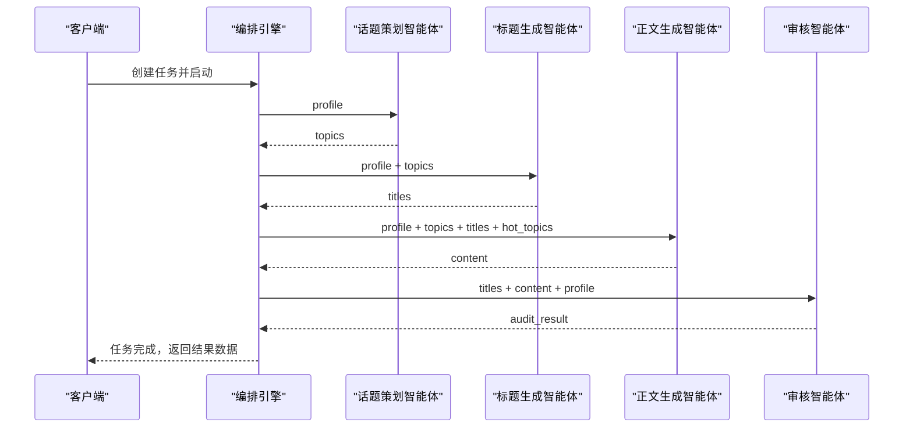
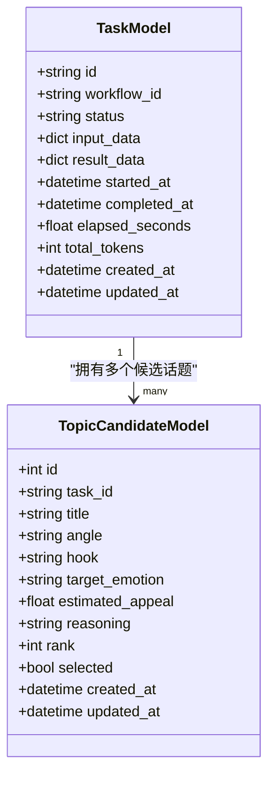
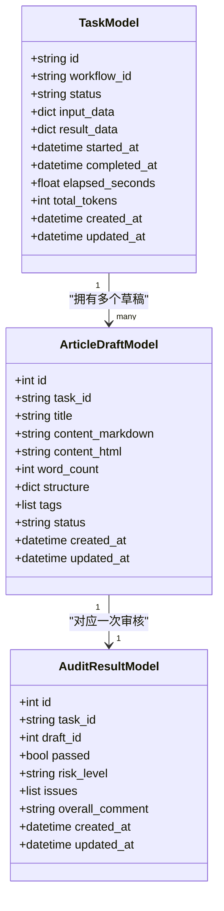
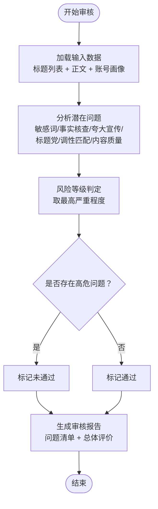
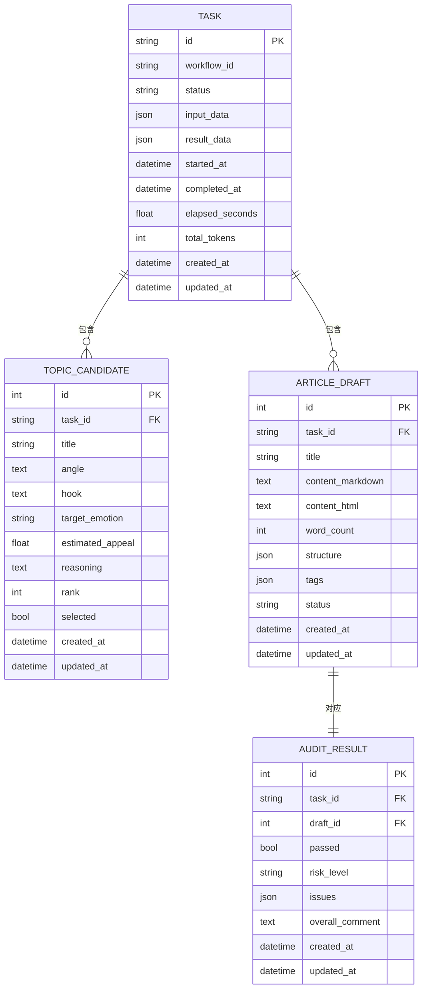

# 内容创作模型

<cite>
**本文档引用的文件**
- [tables.py](file://backend/app/models/tables.py)
- [topic_planner_agent.py](file://backend/app/agents/topic_planner_agent.py)
- [title_generator_agent.py](file://backend/app/agents/title_generator_agent.py)
- [content_writer_agent.py](file://backend/app/agents/content_writer_agent.py)
- [audit_agent.py](file://backend/app/agents/audit_agent.py)
- [engine.py](file://backend/app/orchestrator/engine.py)
- [ResultPanel.tsx](file://frontend/components/office/ResultPanel.tsx)
- [WeChatArticle.tsx](file://frontend/components/WeChatArticle.tsx)
- [task.py](file://backend/app/schemas/task.py)
- [common.py](file://backend/app/schemas/common.py)
</cite>

## 目录
1. [简介](#简介)
2. [项目结构](#项目结构)
3. [核心组件](#核心组件)
4. [架构概览](#架构概览)
5. [详细组件分析](#详细组件分析)
6. [依赖关系分析](#依赖关系分析)
7. [性能考虑](#性能考虑)
8. [故障排除指南](#故障排除指南)
9. [结论](#结论)
10. [附录](#附录)

## 简介
本技术文档聚焦于HotClaw内容创作流水线中的三个核心模型：TopicCandidateModel（话题候选）、ArticleDraftModel（文章草稿）与AuditResultModel（审核结果）。文档深入解释各模型的设计理念、数据结构、处理逻辑以及在完整工作流中的协作方式，涵盖话题生成算法输出、情感分析与吸引力评分机制、文章草稿的Markdown存储与HTML转换、以及审核流程的集成与风险评估体系。同时提供模型使用示例与最佳实践，帮助开发者与运营人员高效理解并应用这些模型。

## 项目结构
HotClaw采用前后端分离架构，后端使用Python/SQLAlchemy定义数据库模型，前端使用React展示内容创作结果。内容创作模型位于后端models层，配合agents层的智能体完成话题策划、标题生成、正文撰写与审核评估；orchestrator层编排整个工作流；前端组件负责结果可视化与交互。

**图表来源**
- [tables.py:97-158](file://backend/app/models/tables.py#L97-L158)
- [engine.py:31-86](file://backend/app/orchestrator/engine.py#L31-L86)
- [ResultPanel.tsx:11-125](file://frontend/components/office/ResultPanel.tsx#L11-L125)
- [WeChatArticle.tsx:115-227](file://frontend/components/WeChatArticle.tsx#L115-L227)

**章节来源**
- [tables.py:1-319](file://backend/app/models/tables.py#L1-L319)
- [engine.py:1-285](file://backend/app/orchestrator/engine.py#L1-L285)

## 核心组件
本节概述三个核心模型及其职责边界：
- TopicCandidateModel：存储由话题策划智能体生成的候选话题，包含标题、切入角度、钩子类型、目标情感、吸引力评分与排序等字段，用于后续标题生成与选择。
- ArticleDraftModel：存储正文草稿，包含Markdown原文、HTML转换结果、字数统计、结构化章节与标签等元数据，支撑内容审阅与发布。
- AuditResultModel：存储审核结果，包含通过状态、风险等级、问题清单与总体评价，作为内容发布的质量门控。

关键字段与关系：
- TopicCandidateModel与TaskModel为一对多关系，一个任务可产生多个候选话题。
- ArticleDraftModel与TaskModel为一对多关系，一个任务可生成多个草稿（通常为一个）。
- ArticleDraftModel与AuditResultModel为一对一关系，每个草稿对应一次审核结果。

**章节来源**
- [tables.py:97-158](file://backend/app/models/tables.py#L97-L158)

## 架构概览
内容创作工作流由编排引擎驱动，按固定顺序依次执行账号画像解析、热点分析、话题策划、标题生成、正文生成与审核评估。每个节点将输出写入工作区，供下游节点消费；若节点失败且为必需步骤，则中断流程并记录错误；否则尝试降级回退策略。

**图表来源**
- [engine.py:31-86](file://backend/app/orchestrator/engine.py#L31-L86)
- [topic_planner_agent.py:44-76](file://backend/app/agents/topic_planner_agent.py#L44-L76)
- [title_generator_agent.py:44-77](file://backend/app/agents/title_generator_agent.py#L44-L77)
- [content_writer_agent.py:12-38](file://backend/app/agents/content_writer_agent.py#L12-L38)
- [audit_agent.py:53-86](file://backend/app/agents/audit_agent.py#L53-L86)

**章节来源**
- [engine.py:89-235](file://backend/app/orchestrator/engine.py#L89-L235)

## 详细组件分析

### TopicCandidateModel（话题候选）设计
TopicCandidateModel承载话题策划阶段的产物，其设计围绕以下关键要素：
- 话题生成算法输出：包含标题、切入角度、钩子类型与理由，确保内容策略可解释。
- 情感分析与吸引力评分：目标触发情感与预估吸引力评分，用于后续标题生成与选择。
- 排序与选择：rank字段用于排序，selected字段用于最终选择。

数据结构要点：
- 标题与角度：用于明确文章主题与切入视角。
- 钩子类型：如“恐惧+自检”、“案例+希望”等，体现读者心理抓取策略。
- 目标情感：如焦虑感、希望感、好奇心，指导标题风格与正文基调。
- 吸引力评分：0-1范围的数值，作为标题生成阶段的输入依据。
- 排序与选择：rank用于排序，selected用于标记最终采纳的选题。

**图表来源**
- [tables.py:97-117](file://backend/app/models/tables.py#L97-L117)
- [tables.py:23-46](file://backend/app/models/tables.py#L23-L46)

话题生成算法与评分机制：
- 话题策划智能体基于账号画像与热点话题，生成3-5个候选选题，每个包含标题、切入角度、钩子类型、目标情感、吸引力评分与理由。
- 标题生成智能体从候选话题中选择吸引力最高的选题，生成4-6个风格各异的候选标题，并给出评分与理由。
- 评分标准综合考虑：好奇心激发度、与内容匹配度、情绪驱动力、可信度等维度。

**章节来源**
- [topic_planner_agent.py:17-42](file://backend/app/agents/topic_planner_agent.py#L17-L42)
- [topic_planner_agent.py:77-113](file://backend/app/agents/topic_planner_agent.py#L77-L113)
- [title_generator_agent.py:17-42](file://backend/app/agents/title_generator_agent.py#L17-L42)
- [title_generator_agent.py:78-105](file://backend/app/agents/title_generator_agent.py#L78-L105)

### ArticleDraftModel（文章草稿）结构设计
ArticleDraftModel负责存储与管理文章草稿，其设计强调可读性、可编辑性与可审计性：
- Markdown内容存储：content_markdown字段保存原始Markdown，便于编辑与版本管理。
- HTML转换：content_html字段保存转换后的HTML，用于前端渲染与预览。
- 结构化元数据：structure字段包含章节标题与摘要，tags字段包含文章标签，word_count统计字数。
- 状态管理：status字段标识草稿状态（如draft），便于流程控制。

**图表来源**
- [tables.py:119-139](file://backend/app/models/tables.py#L119-L139)
- [tables.py:141-158](file://backend/app/models/tables.py#L141-L158)
- [tables.py:23-46](file://backend/app/models/tables.py#L23-L46)

正文生成与结构化输出：
- 正文生成智能体根据选题、标题与热点素材生成完整文章，输出Markdown正文、字数统计、章节结构与标签。
- 前端组件WeChatArticle提供Markdown到HTML的转换与渲染，支持复制Markdown与HTML格式，便于导出与二次编辑。

**章节来源**
- [content_writer_agent.py:17-38](file://backend/app/agents/content_writer_agent.py#L17-L38)
- [WeChatArticle.tsx:21-113](file://frontend/components/WeChatArticle.tsx#L21-L113)

### AuditResultModel（审核结果）审核流程集成
AuditResultModel承载审核阶段的产出，确保内容合规与质量达标：
- 通过状态与风险等级：passed字段表示是否可通过，risk_level字段表示风险等级（low/medium/high）。
- 问题清单：issues数组包含发现的问题类型、描述、严重程度与位置，支持精准定位与修复。
- 总体评价：overall_comment提供简要总结，便于快速决策。

**图表来源**
- [audit_agent.py:17-51](file://backend/app/agents/audit_agent.py#L17-L51)
- [audit_agent.py:87-121](file://backend/app/agents/audit_agent.py#L87-L121)
- [tables.py:141-158](file://backend/app/models/tables.py#L141-L158)

审核流程与降级策略：
- 审核智能体基于账号画像、标题列表与正文内容进行合规性审核，输出通过状态、风险等级、问题清单与总体评价。
- 若审核服务异常，采用降级策略：标记未知风险并提示人工复核，确保流程可控。

**章节来源**
- [audit_agent.py:17-51](file://backend/app/agents/audit_agent.py#L17-L51)
- [audit_agent.py:134-140](file://backend/app/agents/audit_agent.py#L134-L140)

## 依赖关系分析
内容创作模型之间的依赖关系清晰，遵循单向数据流与弱耦合原则：
- TopicCandidateModel与ArticleDraftModel通过TaskModel关联，形成“任务-话题-草稿”的层次结构。
- ArticleDraftModel与AuditResultModel通过外键关联，实现“草稿-审核”的闭环。
- 前端组件依赖后端模型的字段与结构，进行结果展示与交互。

**图表来源**
- [tables.py:23-158](file://backend/app/models/tables.py#L23-L158)

**章节来源**
- [tables.py:23-158](file://backend/app/models/tables.py#L23-L158)

## 性能考虑
- Token消耗与成本控制：编排引擎累计prompt_tokens与completion_tokens，便于成本监控与优化。建议在审核阶段对正文内容进行长度限制，避免超出token上限。
- 并发与超时：编排引擎为每个节点设置超时时间，防止长时间阻塞；必要时可调整超时阈值以平衡稳定性与响应速度。
- 数据库写入：模型采用批量flush策略，减少频繁IO；建议在高并发场景下使用连接池与索引优化。
- 前端渲染：Markdown到HTML转换在前端完成，建议对大文档进行分页或懒加载，提升交互体验。

## 故障排除指南
常见问题与排查步骤：
- 话题生成失败：检查账号画像与热点数据是否完整；确认智能体系统提示词与模型配置正确。
- 标题生成异常：验证话题列表是否包含estimated_appeal字段；检查模型返回格式是否符合JSON规范。
- 正文生成超长：对正文内容进行截断或分段处理，避免token溢出；检查结构化输出字段是否缺失。
- 审核服务异常：启用降级策略，人工复核后发布；检查API密钥与网络连通性。
- 前端渲染异常：确认content_markdown格式正确；检查HTML转换逻辑与样式兼容性。

**章节来源**
- [engine.py:176-197](file://backend/app/orchestrator/engine.py#L176-L197)
- [audit_agent.py:134-140](file://backend/app/agents/audit_agent.py#L134-L140)
- [WeChatArticle.tsx:21-113](file://frontend/components/WeChatArticle.tsx#L21-L113)

## 结论
TopicCandidateModel、ArticleDraftModel与AuditResultModel共同构成了HotClaw内容创作流水线的核心数据骨架。通过明确的字段设计、严格的审核流程与前后端协同，系统实现了从话题策划到草稿生成再到合规审核的全链路自动化。建议在实际部署中关注性能指标、错误处理与用户体验，持续优化提示词与工作流配置，以获得更稳定、高效的创作体验。

## 附录
- API统一响应模型：后端提供ApiResponse与ApiErrorResponse，便于前端统一处理请求结果与错误信息。
- 任务状态与进度：TaskDetailResponse与TaskStatusResponse提供任务生命周期的关键信息，支持实时监控与追踪。

**章节来源**
- [common.py:7-27](file://backend/app/schemas/common.py#L7-L27)
- [task.py:27-83](file://backend/app/schemas/task.py#L27-L83)