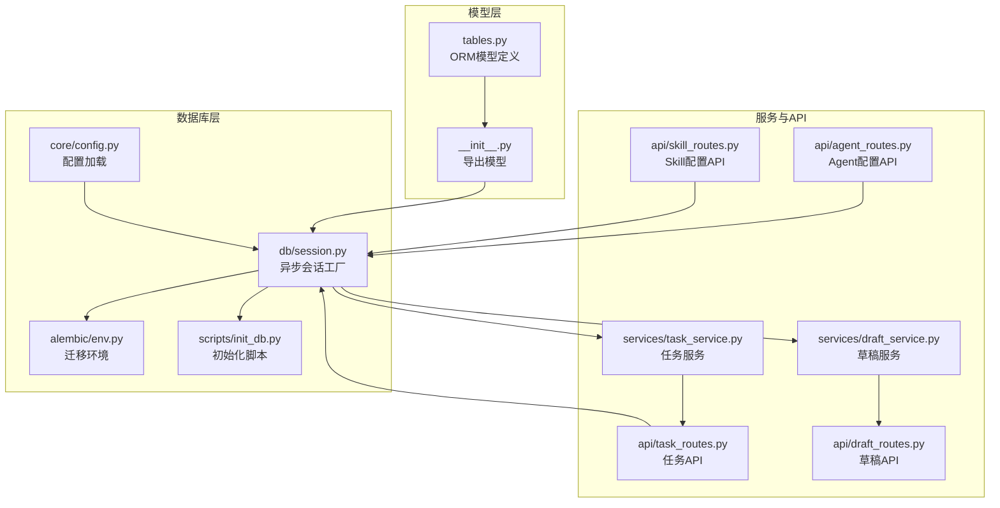
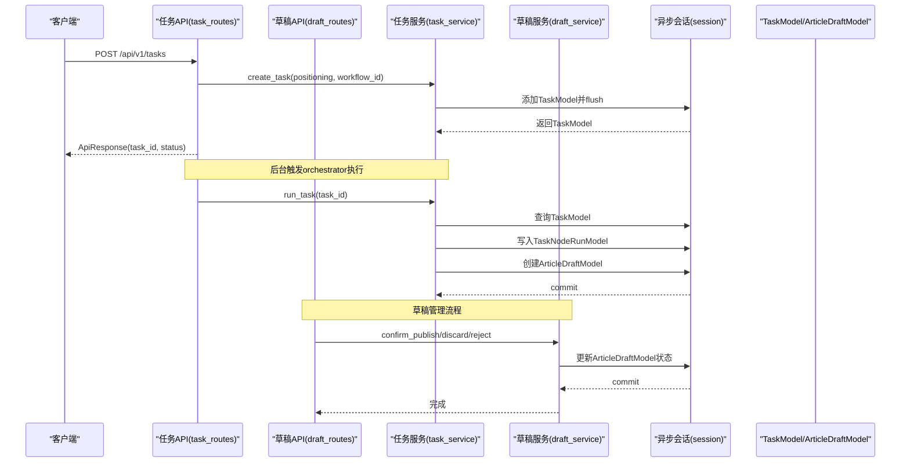
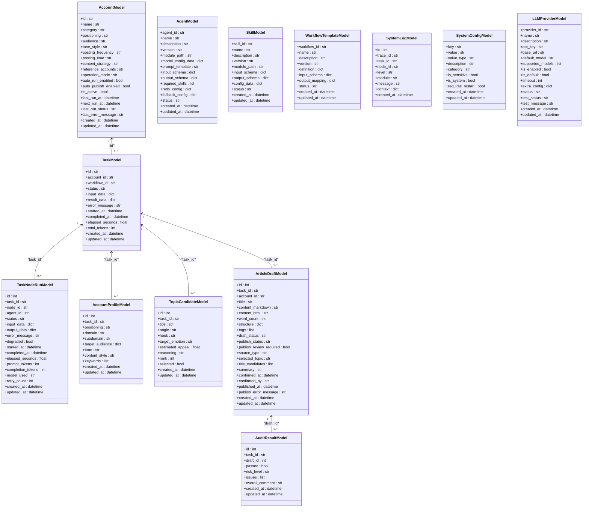
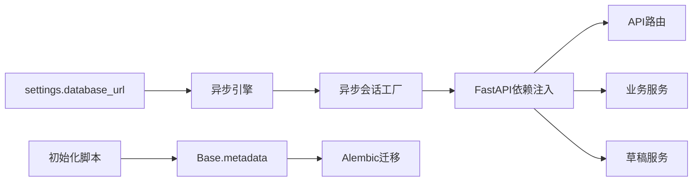

# 数据模型定义

<cite>
**本文引用的文件**
- [backend/app/models/tables.py](file://backend/app/models/tables.py)
- [backend/app/models/__init__.py](file://backend/app/models/__init__.py)
- [backend/app/db/session.py](file://backend/app/db/session.py)
- [backend/app/core/config.py](file://backend/app/core/config.py)
- [scripts/init_db.py](file://scripts/init_db.py)
- [backend/alembic/env.py](file://backend/alembic/env.py)
- [backend/app/services/task_service.py](file://backend/app/services/task_service.py)
- [backend/app/api/task_routes.py](file://backend/app/api/task_routes.py)
- [backend/app/api/agent_routes.py](file://backend/app/api/agent_routes.py)
- [backend/app/api/skill_routes.py](file://backend/app/api/skill_routes.py)
- [backend/app/api/draft_routes.py](file://backend/app/api/draft_routes.py)
- [backend/app/services/draft_service.py](file://backend/app/services/draft_service.py)
- [backend/app/schemas/draft.py](file://backend/app/schemas/draft.py)
- [backend/app/schemas/account.py](file://backend/app/schemas/account.py)
- [ARCHITECTURE.md](file://ARCHITECTURE.md)
</cite>

## 目录
1. [简介](#简介)
2. [项目结构](#项目结构)
3. [核心组件](#核心组件)
4. [架构总览](#架构总览)
5. [详细组件分析](#详细组件分析)
6. [依赖分析](#依赖分析)
7. [性能考量](#性能考量)
8. [故障排查指南](#故障排查指南)
9. [结论](#结论)
10. [附录](#附录)

## 简介
本文件面向HotClaw后端的数据模型定义，系统性阐述基于SQLAlchemy 2.0的ORM模型设计，重点覆盖以下方面：
- Base基类的继承关系与元数据配置
- 核心数据模型的字段定义、数据类型、约束与默认值
- 模型间的一对一、一对多与外键关系映射
- 新增的草稿管理系统和增强的账户模型功能
- 模型在服务与API中的使用方式与最佳实践
- 初始化与迁移流程，以及与异步会话的集成

## 项目结构
HotClaw后端采用"模块分层"组织，数据模型集中于models层，配合异步数据库会话与迁移工具，形成完整的数据持久化方案。新增的草稿管理系统进一步完善了内容创作和发布的完整生命周期管理。

**图表来源**
- [backend/app/models/tables.py:1-385](file://backend/app/models/tables.py#L1-L385)
- [backend/app/models/__init__.py:1-28](file://backend/app/models/__init__.py#L1-L28)
- [backend/app/db/session.py:1-33](file://backend/app/db/session.py#L1-L33)
- [backend/app/core/config.py:1-51](file://backend/app/core/config.py#L1-L51)
- [scripts/init_db.py:1-16](file://scripts/init_db.py#L1-L16)
- [backend/alembic/env.py:1-53](file://backend/alembic/env.py#L1-L53)
- [backend/app/services/task_service.py:1-126](file://backend/app/services/task_service.py#L1-L126)
- [backend/app/services/draft_service.py:1-425](file://backend/app/services/draft_service.py#L1-L425)
- [backend/app/api/task_routes.py:1-163](file://backend/app/api/task_routes.py#L1-L163)
- [backend/app/api/draft_routes.py:1-236](file://backend/app/api/draft_routes.py#L1-L236)
- [backend/app/api/agent_routes.py:1-115](file://backend/app/api/agent_routes.py#L1-L115)
- [backend/app/api/skill_routes.py:1-61](file://backend/app/api/skill_routes.py#L1-L61)

**章节来源**
- [backend/app/models/tables.py:1-385](file://backend/app/models/tables.py#L1-L385)
- [backend/app/models/__init__.py:1-28](file://backend/app/models/__init__.py#L1-L28)
- [backend/app/db/session.py:1-33](file://backend/app/db/session.py#L1-L33)
- [backend/app/core/config.py:1-51](file://backend/app/core/config.py#L1-L51)
- [scripts/init_db.py:1-16](file://scripts/init_db.py#L1-L16)
- [backend/alembic/env.py:1-53](file://backend/alembic/env.py#L1-L53)

## 核心组件
本节概述所有核心ORM模型及其职责边界，便于快速建立整体认知。

- Base：DeclarativeBase子类，作为所有模型的基类，承载公共元数据与行为约定
- AccountModel：微信公众号管理模型，增强的账户配置和运行策略
- TaskModel：任务生命周期的根实体，聚合节点执行记录、账号画像、候选话题、文章草稿
- TaskNodeRunModel：任务内节点级别的执行记录，记录Agent执行状态、耗时、Token用量等
- AccountProfileModel：从用户输入解析得到的账号画像，一对一关联Task
- TopicCandidateModel：由选题策划Agent生成的候选主题集合，一对多关联Task
- ArticleDraftModel：生成的文章草稿，包含完整的草稿生命周期管理和发布状态
- AuditResultModel：文章草稿的审核结果，一对一关联ArticleDraft
- AgentModel：Agent配置，持久化自manifest，主键为agent_id
- SkillModel：Skill配置，持久化自manifest，主键为skill_id
- WorkflowTemplateModel：工作流模板，主键为workflow_id
- SystemLogModel：结构化系统日志，支持trace_id与task_id索引
- SystemConfigModel：系统配置键值存储，替代.env文件用于运行时设置
- LLMProviderModel：LLM提供商配置，用户定义的API密钥和设置

**章节来源**
- [backend/app/models/tables.py:28-385](file://backend/app/models/tables.py#L28-L385)
- [backend/app/models/__init__.py:1-28](file://backend/app/models/__init__.py#L1-L28)

## 架构总览
下图展示数据模型与服务/API层的交互关系，体现"任务驱动"的内容创作和"草稿管理"的完整流程。

**图表来源**
- [backend/app/api/task_routes.py:19-51](file://backend/app/api/task_routes.py#L19-L51)
- [backend/app/api/draft_routes.py:101-132](file://backend/app/api/draft_routes.py#L101-L132)
- [backend/app/services/task_service.py:22-58](file://backend/app/services/task_service.py#L22-L58)
- [backend/app/services/draft_service.py:243-286](file://backend/app/services/draft_service.py#L243-L286)
- [backend/app/db/session.py:22-32](file://backend/app/db/session.py#L22-L32)
- [backend/app/models/tables.py:63-206](file://backend/app/models/tables.py#L63-L206)

**章节来源**
- [backend/app/api/task_routes.py:1-163](file://backend/app/api/task_routes.py#L1-L163)
- [backend/app/api/draft_routes.py:1-236](file://backend/app/api/draft_routes.py#L1-L236)
- [backend/app/services/task_service.py:1-126](file://backend/app/services/task_service.py#L1-L126)
- [backend/app/services/draft_service.py:1-425](file://backend/app/services/draft_service.py#L1-L425)
- [backend/app/db/session.py:1-33](file://backend/app/db/session.py#L1-L33)

## 详细组件分析

### Base基类与元数据配置
- 继承关系：所有模型均继承自DeclarativeBase，确保统一的元数据注册与反射能力
- 元数据：通过Base.metadata参与Alembic迁移与初始化脚本的表创建
- 导出：__init__.py集中导出所有模型，便于上层模块统一引用

**章节来源**
- [backend/app/models/tables.py:18-21](file://backend/app/models/tables.py#L18-L21)
- [backend/app/models/__init__.py:1-28](file://backend/app/models/__init__.py#L1-L28)

### AccountModel（增强的微信公众号管理模型）
- 表名：accounts
- 主键：id（字符串，长度64）
- 字段要点：
  - name：账号名称（长度100）
  - category：账号类别（长度50，可为空）
  - positioning：账号定位（Text，必填）
  - audience：目标读者（Text，可为空）
  - tone_style：风格调性（长度100，可为空）
  - posting_frequency：发布频率（长度20，可为空）
  - posting_time：发布时间（长度10，可为空）
  - content_strategy：内容策略（Text，可为空）
  - reference_accounts：参考账号（Text，可为空）
  - operation_mode：运营模式（默认"manual"，枚举：manual/semi_auto/full_auto）
  - auto_run_enabled/auto_publish_enabled：自动运行和自动发布开关（默认False）
  - is_active：账号状态（默认True）
  - last_run_at/next_run_at：最后运行时间和下次运行时间
  - last_run_status/last_error_message：运行状态和错误信息
  - 服务器默认：created_at/updated_at（server_default/onupdate）
- 关系：
  - 一对多：tasks（TaskModel）

**更新** 新增了完整的账号配置字段，包括运营模式、发布策略、运行状态监控等

**章节来源**
- [backend/app/models/tables.py:28-56](file://backend/app/models/tables.py#L28-L56)

### TaskModel（任务模型）
- 表名：tasks
- 主键：id（字符串，长度64）
- 外键：account_id → accounts.id（可为空，建立索引）
- 字段要点：
  - workflow_id：工作流标识
  - status：任务状态，默认"pending"
  - input_data/result_data：JSON结构，分别保存输入与结果
  - 时间戳：started_at/completed_at/elapsed_seconds
  - 统计：total_tokens
  - 服务器默认：created_at/updated_at
- 关系：
  - 一对多：node_runs（TaskNodeRunModel）
  - 一对一：account_profile（AccountProfileModel）
  - 一对多：topic_candidates（TopicCandidateModel）
  - 一对多：article_drafts（ArticleDraftModel）
  - 反向：account（AccountModel）

**章节来源**
- [backend/app/models/tables.py:63-92](file://backend/app/models/tables.py#L63-L92)

### TaskNodeRunModel（节点执行记录）
- 表名：task_node_runs
- 主键：id（自增整数）
- 外键：task_id → tasks.id
- 字段要点：
  - node_id/agent_id：节点与Agent标识
  - status：默认"pending"，记录执行状态
  - input_data/output_data：JSON结构
  - 时间戳：started_at/completed_at/elapsed_seconds
  - Token统计：prompt_tokens/completion_tokens（默认0）
  - 模型名：model_used
  - 重试：retry_count（默认0）
  - 降级：degraded（默认False）
  - 服务器默认：created_at/updated_at
- 关系：
  - 反向：task（TaskModel）

**章节来源**
- [backend/app/models/tables.py:94-120](file://backend/app/models/tables.py#L94-L120)

### AccountProfileModel（账号画像）
- 表名：account_profiles
- 主键：id（自增整数）
- 外键：task_id → tasks.id（唯一约束）
- 字段要点：
  - positioning：账号定位文本
  - domain/subdomain/target_audience/tone/content_style/keywords：JSON结构
  - 服务器默认：created_at/updated_at
- 关系：
  - 反向：task（TaskModel，uselist=False）

**章节来源**
- [backend/app/models/tables.py:122-141](file://backend/app/models/tables.py#L122-L141)

### TopicCandidateModel（话题候选）
- 表名：topic_candidates
- 主键：id（自增整数）
- 外键：task_id → tasks.id
- 字段要点：
  - title/angle/hook/target_emotion/reasoning：文本字段
  - estimated_appeal：浮点评分
  - rank：整数排序（默认0）
  - selected：布尔选择标记（默认False）
  - 服务器默认：created_at/updated_at
- 关系：
  - 反向：task（TaskModel）

**章节来源**
- [backend/app/models/tables.py:143-163](file://backend/app/models/tables.py#L143-L163)

### ArticleDraftModel（增强的文章草稿模型）
- 表名：article_drafts
- 主键：id（自增整数）
- 外键：task_id → tasks.id；account_id → accounts.id（可为空）
- 字段要点：
  - title/content_markdown/content_html：标题与正文（Markdown/HTML）
  - word_count：默认0
  - structure/tags：JSON结构
  - draft_status：草稿状态（默认"draft"，枚举：draft/pending_review/approved/rejected/discarded）
  - publish_status：发布状态（默认"not_published"，枚举：not_published/pending/published/failed）
  - publish_review_required：发布前是否需要人工审核（默认True）
  - source_type：来源类型（默认"manual_task"，枚举：manual_task/semi_auto_task）
  - selected_topic/title_candidates/summary：选题、标题候选和摘要
  - confirmed_at/confirmed_by：确认发布时间和确认人
  - published_at/publish_error_message：发布时间和发布错误信息
  - 服务器默认：created_at/updated_at
- 关系：
  - 反向：task（TaskModel）
  - 反向：account（AccountModel）
  - 注意：审核结果通过查询获取，避免循环导入

**更新** 新增了完整的草稿生命周期管理，包括状态机、审核流程、发布管理等功能

**章节来源**
- [backend/app/models/tables.py:165-206](file://backend/app/models/tables.py#L165-L206)

### AuditResultModel（审核结果）
- 表名：audit_results
- 主键：id（自增整数）
- 外键：task_id → tasks.id；draft_id → article_drafts.id
- 字段要点：
  - passed：是否通过（默认False）
  - risk_level：风险等级（默认"low"）
  - issues：问题列表（JSON）
  - overall_comment：总体意见
  - 服务器默认：created_at/updated_at
- 关系：
  - 反向：draft（ArticleDraftModel）

**章节来源**
- [backend/app/models/tables.py:208-224](file://backend/app/models/tables.py#L208-L224)

### AgentModel（Agent配置）
- 表名：agents
- 主键：agent_id（字符串，长度64）
- 字段要点：
  - name/description/version/module_path：基础元信息
  - model_config_data/prompt_template/input_schema/output_schema：JSON结构
  - required_skills/retry_config/fallback_config：JSON结构
  - status：默认"active"
  - 服务器默认：created_at/updated_at

**章节来源**
- [backend/app/models/tables.py:226-247](file://backend/app/models/tables.py#L226-L247)

### SkillModel（技能配置）
- 表名：skills
- 主键：skill_id（字符串，长度64）
- 字段要点：
  - name/description/version/module_path：基础元信息
  - input_schema/output_schema/config_data：JSON结构
  - status：默认"active"
  - 服务器默认：created_at/updated_at

**章节来源**
- [backend/app/models/tables.py:249-266](file://backend/app/models/tables.py#L249-L266)

### WorkflowTemplateModel（工作流模板）
- 表名：workflow_templates
- 主键：workflow_id（字符串，长度64）
- 字段要点：
  - name/description/version：基础元信息
  - definition/input_schema/output_mapping：JSON结构
  - status：默认"active"
  - 服务器默认：created_at/updated_at

**章节来源**
- [backend/app/models/tables.py:268-284](file://backend/app/models/tables.py#L268-L284)

### SystemLogModel（系统日志）
- 表名：system_logs
- 主键：id（自增整数）
- 字段要点：
  - trace_id/task_id：带索引的可选任务追踪字段
  - node_id/level/module/message：日志要素
  - context：JSON上下文
  - 服务器默认：created_at

**章节来源**
- [backend/app/models/tables.py:286-299](file://backend/app/models/tables.py#L286-L299)

### SystemConfigModel（系统配置）
- 表名：system_configs
- 主键：key（字符串，长度100）
- 字段要点：
  - value：配置值（Text，可为空）
  - value_type：值类型（默认"string"，枚举：string/number/boolean/json）
  - description：配置说明（可为空）
  - category：分类（默认"general"）
  - is_sensitive：是否为敏感配置（默认False）
  - is_system：是否为系统级配置（默认False）
  - requires_restart：修改后是否需要重启（默认False）
  - 服务器默认：created_at/updated_at

**更新** 新增了系统配置管理模型，替代.env文件用于运行时设置

**章节来源**
- [backend/app/models/tables.py:301-333](file://backend/app/models/tables.py#L301-L333)

### LLMProviderModel（LLM提供商配置）
- 表名：llm_providers
- 主键：provider_id（字符串，长度32）
- 字段要点：
  - name/description：显示名称和描述
  - api_key/base_url：API配置
  - default_model：默认模型
  - supported_models：支持的模型列表（JSON）
  - is_enabled/is_default：启用状态和默认状态
  - timeout：超时时间（默认60）
  - extra_config：额外配置（JSON）
  - status：状态（默认"active"）
  - test_status/test_message：测试状态和消息
  - 服务器默认：created_at/updated_at

**更新** 新增了LLM提供商配置模型，支持多种大模型提供商的统一管理

**章节来源**
- [backend/app/models/tables.py:335-385](file://backend/app/models/tables.py#L335-L385)

### 模型关系映射与约束
- 一对一/一对多：
  - AccountModel ↔ TaskModel（一对多）
  - TaskModel ↔ AccountProfileModel（一对一）
  - TaskModel ↔ ArticleDraftModel（一对多）
  - ArticleDraftModel ↔ AuditResultModel（一对一）
  - TaskModel ↔ TaskNodeRunModel（一对多）
  - TaskModel ↔ TopicCandidateModel（一对多）
- 外键约束：
  - TaskModel.account_id → accounts.id
  - TaskNodeRunModel.task_id → tasks.id
  - AccountProfileModel.task_id → tasks.id（唯一）
  - ArticleDraftModel.task_id → tasks.id
  - ArticleDraftModel.account_id → accounts.id
  - AuditResultModel.task_id → tasks.id；draft_id → article_drafts.id
- 约束与默认值：
  - 字符串长度限制（如String(64)/String(200)等）
  - JSON字段用于结构化数据存储
  - server_default/onupdate用于时间戳自动维护
  - 多数数值字段提供默认值（如0或False）

**图表来源**
- [backend/app/models/tables.py:28-385](file://backend/app/models/tables.py#L28-L385)

**章节来源**
- [backend/app/models/tables.py:28-385](file://backend/app/models/tables.py#L28-L385)

## 依赖分析
- 数据库连接与会话：
  - 引擎与会话工厂由异步SQLAlchemy创建，支持SQLite与PostgreSQL
  - 会话在FastAPI依赖注入中提供，自动提交/回滚/关闭
- 配置来源：
  - settings.database_url决定连接URL，支持开发（SQLite）与生产（PostgreSQL）
- 迁移与初始化：
  - Alembic环境读取settings.database_url并绑定Base.metadata
  - 初始化脚本通过异步引擎创建所有表
- 草稿管理：
  - 新增的草稿服务独立管理文章草稿的完整生命周期
  - 支持状态转换、审核流程、发布管理等功能

**图表来源**
- [backend/app/core/config.py:11-14](file://backend/app/core/config.py#L11-L14)
- [backend/app/db/session.py:8-19](file://backend/app/db/session.py#L8-L19)
- [backend/alembic/env.py:13-18](file://backend/alembic/env.py#L13-L18)
- [scripts/init_db.py:8-11](file://scripts/init_db.py#L8-L11)

**章节来源**
- [backend/app/core/config.py:1-51](file://backend/app/core/config.py#L1-L51)
- [backend/app/db/session.py:1-33](file://backend/app/db/session.py#L1-L33)
- [backend/alembic/env.py:1-53](file://backend/alembic/env.py#L1-L53)
- [scripts/init_db.py:1-16](file://scripts/init_db.py#L1-L16)

## 性能考量
- 异步I/O：使用异步SQLAlchemy与FastAPI，降低并发等待开销
- 会话生命周期：expire_on_commit=False减少对象过期带来的额外查询
- 索引策略：SystemLogModel对trace_id/task_id建立索引，提升查询效率
- JSON字段：结构化数据以JSON存储，便于扩展但需注意查询限制
- 时间戳：server_default/onupdate减少应用层时间计算，保证一致性
- 草稿状态索引：ArticleDraftModel的draft_status和publish_status字段建立索引，优化查询性能

## 故障排查指南
- 会话事务：
  - get_db在异常时自动回滚并抛出，确保数据一致性
  - 如出现"未提交/未回滚"问题，检查调用方是否正确await commit/rollback
- 迁移与初始化：
  - 确认settings.database_url与Alembic配置一致
  - 使用init_db.py验证表创建成功
- 模型关系：
  - 外键约束导致插入失败时，优先检查关联实体是否存在
  - 唯一约束（如AccountProfileModel.task_id）冲突需先清理旧记录
- 草稿状态管理：
  - 状态转换错误时，检查VALID_TRANSITIONS字典中的状态转换规则
  - 发布状态检查，确保草稿处于正确的状态才能执行相应操作
- 日志与追踪：
  - SystemLogModel提供trace_id/task_id字段，便于定位问题

**章节来源**
- [backend/app/db/session.py:22-32](file://backend/app/db/session.py#L22-L32)
- [scripts/init_db.py:8-11](file://scripts/init_db.py#L8-L11)
- [backend/alembic/env.py:13-18](file://backend/alembic/env.py#L13-L18)
- [backend/app/services/draft_service.py:22-31](file://backend/app/services/draft_service.py#L22-L31)
- [backend/app/models/tables.py:127](file://backend/app/models/tables.py#L127)

## 结论
HotClaw的数据模型以SQLAlchemy 2.0为核心，围绕任务生命周期构建了清晰的实体关系与持久化策略。通过异步会话、结构化日志与迁移工具，系统在开发与生产环境中均具备良好的可维护性与扩展性。新增的草稿管理系统进一步完善了内容创作和发布的完整生命周期管理，增强了账户模型的功能性和灵活性。开发者在使用时应遵循：
- 明确字段类型与约束，合理使用JSON结构化存储
- 正确设置外键与唯一约束，避免关系断裂
- 利用server_default/onupdate简化时间戳管理
- 在API与服务层保持一致的事务语义与错误处理
- 严格遵守草稿状态转换规则，确保数据一致性

## 附录

### 模型使用示例与最佳实践
- 创建任务并持久化：
  - 通过TaskService.create_task生成TaskModel并flush，随后在后台运行orchestrator
  - 参考：[backend/app/services/task_service.py:22-37](file://backend/app/services/task_service.py#L22-L37)
- 查询任务与节点：
  - 使用selectinload加载TaskModel.node_runs，减少N+1查询
  - 参考：[backend/app/services/task_service.py:68-78](file://backend/app/services/task_service.py#L68-L78)
- Agent/Skill配置读写：
  - 通过AgentModel/SkillModel与注册中心结合，支持动态配置
  - 参考：[backend/app/api/agent_routes.py:74-114](file://backend/app/api/agent_routes.py#L74-L114)，[backend/app/api/skill_routes.py:34-60](file://backend/app/api/skill_routes.py#L34-L60)
- 草稿管理：
  - 使用DraftService管理草稿的完整生命周期，包括创建、审核、发布、废弃等操作
  - 参考：[backend/app/services/draft_service.py:35-128](file://backend/app/services/draft_service.py#L35-L128)
- API集成：
  - FastAPI路由依赖get_db提供AsyncSession，确保事务安全
  - 参考：[backend/app/api/task_routes.py:19-51](file://backend/app/api/task_routes.py#L19-L51)，[backend/app/api/draft_routes.py:31-78](file://backend/app/api/draft_routes.py#L31-L78)
- 账号管理：
  - 通过AccountModel管理微信公众号的完整配置和运行策略
  - 参考：[backend/app/schemas/account.py:29-36](file://backend/app/schemas/account.py#L29-L36)

**章节来源**
- [backend/app/services/task_service.py:22-78](file://backend/app/services/task_service.py#L22-L78)
- [backend/app/services/draft_service.py:35-128](file://backend/app/services/draft_service.py#L35-L128)
- [backend/app/api/agent_routes.py:74-114](file://backend/app/api/agent_routes.py#L74-L114)
- [backend/app/api/skill_routes.py:34-60](file://backend/app/api/skill_routes.py#L34-L60)
- [backend/app/api/task_routes.py:19-51](file://backend/app/api/task_routes.py#L19-L51)
- [backend/app/api/draft_routes.py:31-78](file://backend/app/api/draft_routes.py#L31-L78)
- [backend/app/schemas/account.py:29-36](file://backend/app/schemas/account.py#L29-L36)

### 架构背景与术语
- 任务驱动：从账号定位到文章草稿的全链路由工作流驱动
- 可审计可回放：节点输入输出、耗时、Token消耗、错误信息全部持久化
- 可视化：前端通过SSE接收节点状态，实时展示流水线
- 草稿生命周期：从创建到审核、发布、废弃的完整状态管理
- 账号运营模式：手动、半自动、全自动三种运营模式支持

**章节来源**
- [ARCHITECTURE.md:138-176](file://ARCHITECTURE.md#L138-L176)