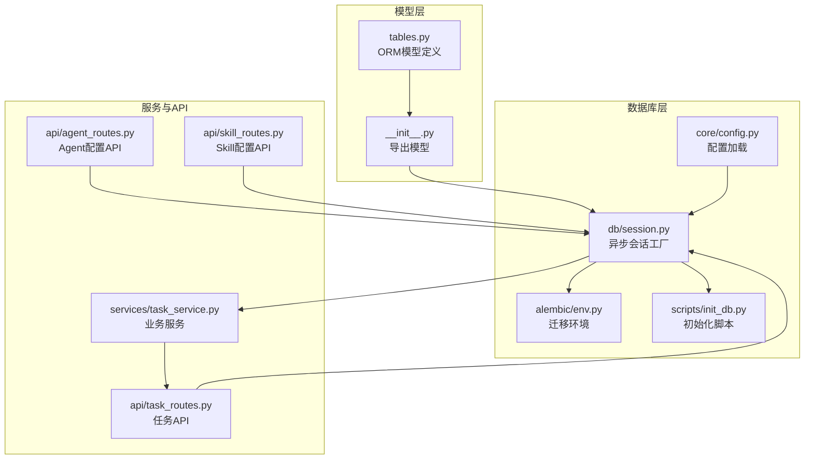
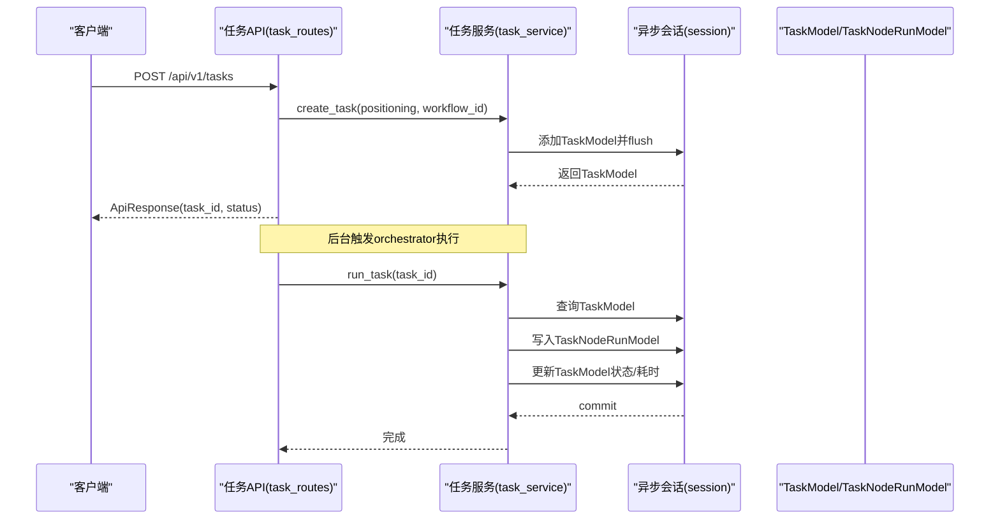
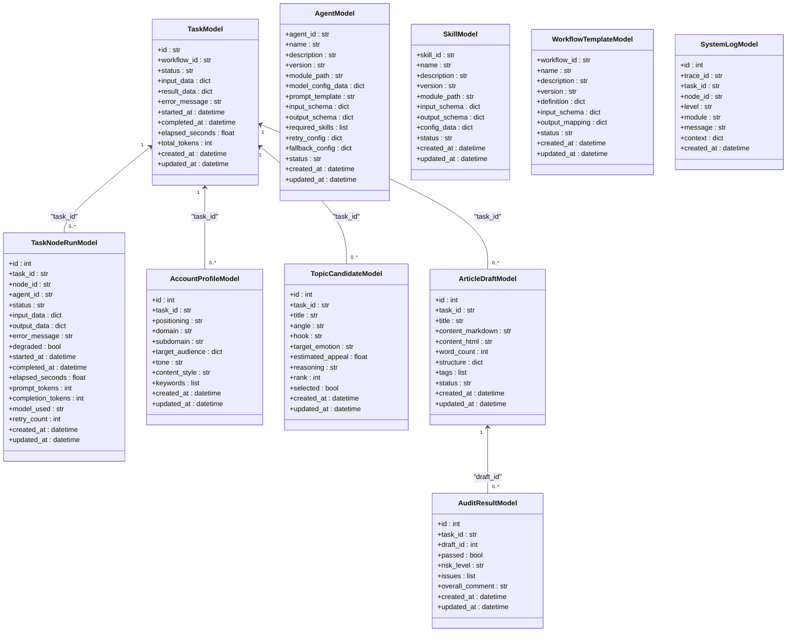
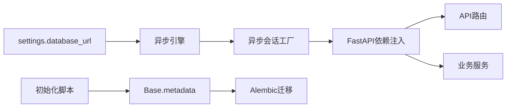

# 数据模型定义

<cite>
**本文引用的文件**
- [backend/app/models/tables.py](file://backend/app/models/tables.py)
- [backend/app/models/__init__.py](file://backend/app/models/__init__.py)
- [backend/app/db/session.py](file://backend/app/db/session.py)
- [backend/app/core/config.py](file://backend/app/core/config.py)
- [scripts/init_db.py](file://scripts/init_db.py)
- [backend/alembic/env.py](file://backend/alembic/env.py)
- [backend/app/services/task_service.py](file://backend/app/services/task_service.py)
- [backend/app/api/task_routes.py](file://backend/app/api/task_routes.py)
- [backend/app/api/agent_routes.py](file://backend/app/api/agent_routes.py)
- [backend/app/api/skill_routes.py](file://backend/app/api/skill_routes.py)
- [ARCHITECTURE.md](file://ARCHITECTURE.md)
</cite>

## 目录
1. [简介](#简介)
2. [项目结构](#项目结构)
3. [核心组件](#核心组件)
4. [架构总览](#架构总览)
5. [详细组件分析](#详细组件分析)
6. [依赖分析](#依赖分析)
7. [性能考量](#性能考量)
8. [故障排查指南](#故障排查指南)
9. [结论](#结论)
10. [附录](#附录)

## 简介
本文件面向HotClaw后端的数据模型定义，系统性阐述基于SQLAlchemy 2.0的ORM模型设计，重点覆盖以下方面：
- Base基类的继承关系与元数据配置
- 核心数据模型的字段定义、数据类型、约束与默认值
- 模型间的一对一、一对多与外键关系映射
- 模型在服务与API中的使用方式与最佳实践
- 初始化与迁移流程，以及与异步会话的集成

## 项目结构
HotClaw后端采用“模块分层”组织，数据模型集中于models层，配合异步数据库会话与迁移工具，形成完整的数据持久化方案。

**图表来源**
- [backend/app/models/tables.py:1-233](file://backend/app/models/tables.py#L1-L233)
- [backend/app/models/__init__.py:1-28](file://backend/app/models/__init__.py#L1-L28)
- [backend/app/db/session.py:1-33](file://backend/app/db/session.py#L1-L33)
- [backend/app/core/config.py:1-51](file://backend/app/core/config.py#L1-L51)
- [scripts/init_db.py:1-16](file://scripts/init_db.py#L1-L16)
- [backend/alembic/env.py:1-53](file://backend/alembic/env.py#L1-L53)
- [backend/app/services/task_service.py:1-126](file://backend/app/services/task_service.py#L1-L126)
- [backend/app/api/task_routes.py:1-163](file://backend/app/api/task_routes.py#L1-L163)
- [backend/app/api/agent_routes.py:1-115](file://backend/app/api/agent_routes.py#L1-L115)
- [backend/app/api/skill_routes.py:1-61](file://backend/app/api/skill_routes.py#L1-L61)

**章节来源**
- [backend/app/models/tables.py:1-233](file://backend/app/models/tables.py#L1-L233)
- [backend/app/models/__init__.py:1-28](file://backend/app/models/__init__.py#L1-L28)
- [backend/app/db/session.py:1-33](file://backend/app/db/session.py#L1-L33)
- [backend/app/core/config.py:1-51](file://backend/app/core/config.py#L1-L51)
- [scripts/init_db.py:1-16](file://scripts/init_db.py#L1-L16)
- [backend/alembic/env.py:1-53](file://backend/alembic/env.py#L1-L53)

## 核心组件
本节概述所有核心ORM模型及其职责边界，便于快速建立整体认知。

- Base：DeclarativeBase子类，作为所有模型的基类，承载公共元数据与行为约定
- TaskModel：任务生命周期的根实体，聚合节点执行记录、账号画像、候选话题、文章草稿
- TaskNodeRunModel：任务内节点级别的执行记录，记录Agent执行状态、耗时、Token用量等
- AccountProfileModel：从用户输入解析得到的账号画像，一对一关联Task
- TopicCandidateModel：由选题策划Agent生成的候选主题集合，一对多关联Task
- ArticleDraftModel：生成的文章草稿，一对多关联Task，并一对一关联AuditResult
- AuditResultModel：文章草稿的审核结果，一对一关联ArticleDraft
- AgentModel：Agent配置，持久化自manifest，主键为agent_id
- SkillModel：Skill配置，持久化自manifest，主键为skill_id
- WorkflowTemplateModel：工作流模板，主键为workflow_id
- SystemLogModel：结构化系统日志，支持trace_id与task_id索引

**章节来源**
- [backend/app/models/tables.py:18-233](file://backend/app/models/tables.py#L18-L233)
- [backend/app/models/__init__.py:1-28](file://backend/app/models/__init__.py#L1-L28)

## 架构总览
下图展示数据模型与服务/API层的交互关系，体现“任务驱动”的数据流转与持久化路径。

**图表来源**
- [backend/app/api/task_routes.py:19-51](file://backend/app/api/task_routes.py#L19-L51)
- [backend/app/services/task_service.py:22-58](file://backend/app/services/task_service.py#L22-L58)
- [backend/app/db/session.py:22-32](file://backend/app/db/session.py#L22-L32)
- [backend/app/models/tables.py:23-73](file://backend/app/models/tables.py#L23-L73)

**章节来源**
- [backend/app/api/task_routes.py:1-163](file://backend/app/api/task_routes.py#L1-L163)
- [backend/app/services/task_service.py:1-126](file://backend/app/services/task_service.py#L1-L126)
- [backend/app/db/session.py:1-33](file://backend/app/db/session.py#L1-L33)

## 详细组件分析

### Base基类与元数据配置
- 继承关系：所有模型均继承自DeclarativeBase，确保统一的元数据注册与反射能力
- 元数据：通过Base.metadata参与Alembic迁移与初始化脚本的表创建
- 导出：__init__.py集中导出所有模型，便于上层模块统一引用

**章节来源**
- [backend/app/models/tables.py:18-20](file://backend/app/models/tables.py#L18-L20)
- [backend/app/models/__init__.py:1-28](file://backend/app/models/__init__.py#L1-L28)

### TaskModel（任务模型）
- 表名：tasks
- 主键：id（字符串，长度64）
- 字段要点：
  - workflow_id：工作流标识
  - status：任务状态，默认“pending”
  - input_data/result_data：JSON结构，分别保存输入与结果
  - 时间戳：started_at/completed_at/elapsed_seconds
  - 统计：total_tokens
  - 服务器默认：created_at/updated_at（server_default/onupdate）
- 关系：
  - 一对多：node_runs（TaskNodeRunModel）
  - 一对一：account_profile（AccountProfileModel）
  - 一对多：topic_candidates（TopicCandidateModel）
  - 一对多：article_drafts（ArticleDraftModel）

**章节来源**
- [backend/app/models/tables.py:23-46](file://backend/app/models/tables.py#L23-L46)

### TaskNodeRunModel（节点执行记录）
- 表名：task_node_runs
- 主键：id（自增整数）
- 外键：task_id → tasks.id
- 字段要点：
  - node_id/agent_id：节点与Agent标识
  - status：默认“pending”，记录执行状态
  - input_data/output_data：JSON结构
  - 时间戳：started_at/completed_at/elapsed_seconds
  - Token统计：prompt_tokens/completion_tokens（默认0）
  - 模型名：model_used
  - 重试：retry_count（默认0）
  - 降级：degraded（默认False）
  - 服务器默认：created_at/updated_at
- 关系：
  - 反向：task（TaskModel）

**章节来源**
- [backend/app/models/tables.py:48-73](file://backend/app/models/tables.py#L48-L73)

### AccountProfileModel（账号画像）
- 表名：account_profiles
- 主键：id（自增整数）
- 外键：task_id → tasks.id（唯一约束）
- 字段要点：
  - positioning：账号定位文本
  - domain/subdomain/target_audience/tone/content_style/keywords：JSON结构
  - 服务器默认：created_at/updated_at
- 关系：
  - 反向：task（TaskModel，uselist=False）

**章节来源**
- [backend/app/models/tables.py:76-94](file://backend/app/models/tables.py#L76-L94)

### TopicCandidateModel（话题候选）
- 表名：topic_candidates
- 主键：id（自增整数）
- 外键：task_id → tasks.id
- 字段要点：
  - title/angle/hook/target_emotion/reasoning：文本字段
  - estimated_appeal：浮点评分
  - rank：整数排序（默认0）
  - selected：布尔选择标记（默认False）
  - 服务器默认：created_at/updated_at
- 关系：
  - 反向：task（TaskModel）

**章节来源**
- [backend/app/models/tables.py:97-116](file://backend/app/models/tables.py#L97-L116)

### ArticleDraftModel（文章草稿）
- 表名：article_drafts
- 主键：id（自增整数）
- 外键：task_id → tasks.id
- 字段要点：
  - title/content_markdown/content_html：标题与正文（Markdown/HTML）
  - word_count：默认0
  - structure/tags：JSON结构
  - status：默认“draft”
  - 服务器默认：created_at/updated_at
- 关系：
  - 反向：task（TaskModel）
  - 一对一：audit_result（AuditResultModel，uselist=False）

**章节来源**
- [backend/app/models/tables.py:119-137](file://backend/app/models/tables.py#L119-L137)

### AuditResultModel（审核结果）
- 表名：audit_results
- 主键：id（自增整数）
- 外键：task_id → tasks.id；draft_id → article_drafts.id
- 字段要点：
  - passed：是否通过（默认False）
  - risk_level：风险等级（默认“low”）
  - issues：问题列表（JSON）
  - overall_comment：总体意见
  - 服务器默认：created_at/updated_at
- 关系：
  - 反向：draft（ArticleDraftModel）

**章节来源**
- [backend/app/models/tables.py:141-157](file://backend/app/models/tables.py#L141-L157)

### AgentModel（Agent配置）
- 表名：agents
- 主键：agent_id（字符串，长度64）
- 字段要点：
  - name/description/version/module_path：基础元信息
  - model_config_data/prompt_template/input_schema/output_schema：JSON结构
  - required_skills/retry_config/fallback_config：JSON结构
  - status：默认“active”
  - 服务器默认：created_at/updated_at

**章节来源**
- [backend/app/models/tables.py:160-180](file://backend/app/models/tables.py#L160-L180)

### SkillModel（技能配置）
- 表名：skills
- 主键：skill_id（字符串，长度64）
- 字段要点：
  - name/description/version/module_path：基础元信息
  - input_schema/output_schema/config_data：JSON结构
  - status：默认“active”
  - 服务器默认：created_at/updated_at

**章节来源**
- [backend/app/models/tables.py:183-199](file://backend/app/models/tables.py#L183-L199)

### WorkflowTemplateModel（工作流模板）
- 表名：workflow_templates
- 主键：workflow_id（字符串，长度64）
- 字段要点：
  - name/description/version：基础元信息
  - definition/input_schema/output_mapping：JSON结构
  - status：默认“active”
  - 服务器默认：created_at/updated_at

**章节来源**
- [backend/app/models/tables.py:202-217](file://backend/app/models/tables.py#L202-L217)

### SystemLogModel（系统日志）
- 表名：system_logs
- 主键：id（自增整数）
- 字段要点：
  - trace_id/task_id：带索引的可选任务追踪字段
  - node_id/level/module/message：日志要素
  - context：JSON上下文
  - 服务器默认：created_at

**章节来源**
- [backend/app/models/tables.py:220-233](file://backend/app/models/tables.py#L220-L233)

### 模型关系映射与约束
- 一对一/一对多：
  - TaskModel ↔ AccountProfileModel（一对一）
  - TaskModel ↔ ArticleDraftModel（一对多）
  - ArticleDraftModel ↔ AuditResultModel（一对一）
  - TaskModel ↔ TaskNodeRunModel（一对多）
  - TaskModel ↔ TopicCandidateModel（一对多）
- 外键约束：
  - TaskNodeRunModel.task_id → tasks.id
  - AccountProfileModel.task_id → tasks.id（唯一）
  - ArticleDraftModel.task_id → tasks.id
  - AuditResultModel.task_id → tasks.id；draft_id → article_drafts.id
- 约束与默认值：
  - 字符串长度限制（如String(64)/String(200)等）
  - JSON字段用于结构化数据存储
  - server_default/onupdate用于时间戳自动维护
  - 多数数值字段提供默认值（如0或False）

**图表来源**
- [backend/app/models/tables.py:23-233](file://backend/app/models/tables.py#L23-L233)

**章节来源**
- [backend/app/models/tables.py:23-233](file://backend/app/models/tables.py#L23-L233)

## 依赖分析
- 数据库连接与会话：
  - 引擎与会话工厂由异步SQLAlchemy创建，支持SQLite与PostgreSQL
  - 会话在FastAPI依赖注入中提供，自动提交/回滚/关闭
- 配置来源：
  - settings.database_url决定连接URL，支持开发（SQLite）与生产（PostgreSQL）
- 迁移与初始化：
  - Alembic环境读取settings.database_url并绑定Base.metadata
  - 初始化脚本通过异步引擎创建所有表

**图表来源**
- [backend/app/core/config.py:11-14](file://backend/app/core/config.py#L11-L14)
- [backend/app/db/session.py:8-19](file://backend/app/db/session.py#L8-L19)
- [backend/alembic/env.py:13-18](file://backend/alembic/env.py#L13-L18)
- [scripts/init_db.py:8-11](file://scripts/init_db.py#L8-L11)

**章节来源**
- [backend/app/core/config.py:1-51](file://backend/app/core/config.py#L1-L51)
- [backend/app/db/session.py:1-33](file://backend/app/db/session.py#L1-L33)
- [backend/alembic/env.py:1-53](file://backend/alembic/env.py#L1-L53)
- [scripts/init_db.py:1-16](file://scripts/init_db.py#L1-L16)

## 性能考量
- 异步I/O：使用异步SQLAlchemy与FastAPI，降低并发等待开销
- 会话生命周期：expire_on_commit=False减少对象过期带来的额外查询
- 索引策略：SystemLogModel对trace_id/task_id建立索引，提升查询效率
- JSON字段：结构化数据以JSON存储，便于扩展但需注意查询限制
- 时间戳：server_default/onupdate减少应用层时间计算，保证一致性

[本节为通用建议，无需特定文件引用]

## 故障排查指南
- 会话事务：
  - get_db在异常时自动回滚并抛出，确保数据一致性
  - 如出现“未提交/未回滚”问题，检查调用方是否正确await commit/rollback
- 迁移与初始化：
  - 确认settings.database_url与Alembic配置一致
  - 使用init_db.py验证表创建成功
- 模型关系：
  - 外键约束导致插入失败时，优先检查关联实体是否存在
  - 唯一约束（如AccountProfileModel.task_id）冲突需先清理旧记录
- 日志与追踪：
  - SystemLogModel提供trace_id/task_id字段，便于定位问题

**章节来源**
- [backend/app/db/session.py:22-32](file://backend/app/db/session.py#L22-L32)
- [scripts/init_db.py:8-11](file://scripts/init_db.py#L8-L11)
- [backend/alembic/env.py:13-18](file://backend/alembic/env.py#L13-L18)
- [backend/app/models/tables.py:80-81](file://backend/app/models/tables.py#L80-L81)

## 结论
HotClaw的数据模型以SQLAlchemy 2.0为核心，围绕任务生命周期构建了清晰的实体关系与持久化策略。通过异步会话、结构化日志与迁移工具，系统在开发与生产环境中均具备良好的可维护性与扩展性。开发者在使用时应遵循：
- 明确字段类型与约束，合理使用JSON结构化存储
- 正确设置外键与唯一约束，避免关系断裂
- 利用server_default/onupdate简化时间戳管理
- 在API与服务层保持一致的事务语义与错误处理

[本节为总结性内容，无需特定文件引用]

## 附录

### 模型使用示例与最佳实践
- 创建任务并持久化：
  - 通过TaskService.create_task生成TaskModel并flush，随后在后台运行orchestrator
  - 参考：[backend/app/services/task_service.py:22-37](file://backend/app/services/task_service.py#L22-L37)
- 查询任务与节点：
  - 使用selectinload加载TaskModel.node_runs，减少N+1查询
  - 参考：[backend/app/services/task_service.py:68-78](file://backend/app/services/task_service.py#L68-L78)
- Agent/Skill配置读写：
  - 通过AgentModel/SkillModel与注册中心结合，支持动态配置
  - 参考：[backend/app/api/agent_routes.py:74-114](file://backend/app/api/agent_routes.py#L74-L114)，[backend/app/api/skill_routes.py:34-60](file://backend/app/api/skill_routes.py#L34-L60)
- API集成：
  - FastAPI路由依赖get_db提供AsyncSession，确保事务安全
  - 参考：[backend/app/api/task_routes.py:19-51](file://backend/app/api/task_routes.py#L19-L51)

**章节来源**
- [backend/app/services/task_service.py:22-78](file://backend/app/services/task_service.py#L22-L78)
- [backend/app/api/agent_routes.py:74-114](file://backend/app/api/agent_routes.py#L74-L114)
- [backend/app/api/skill_routes.py:34-60](file://backend/app/api/skill_routes.py#L34-L60)
- [backend/app/api/task_routes.py:19-51](file://backend/app/api/task_routes.py#L19-L51)

### 架构背景与术语
- 任务驱动：从账号定位到文章草稿的全链路由工作流驱动
- 可审计可回放：节点输入输出、耗时、Token消耗、错误信息全部持久化
- 可视化：前端通过SSE接收节点状态，实时展示流水线

**章节来源**
- [ARCHITECTURE.md:138-176](file://ARCHITECTURE.md#L138-L176)