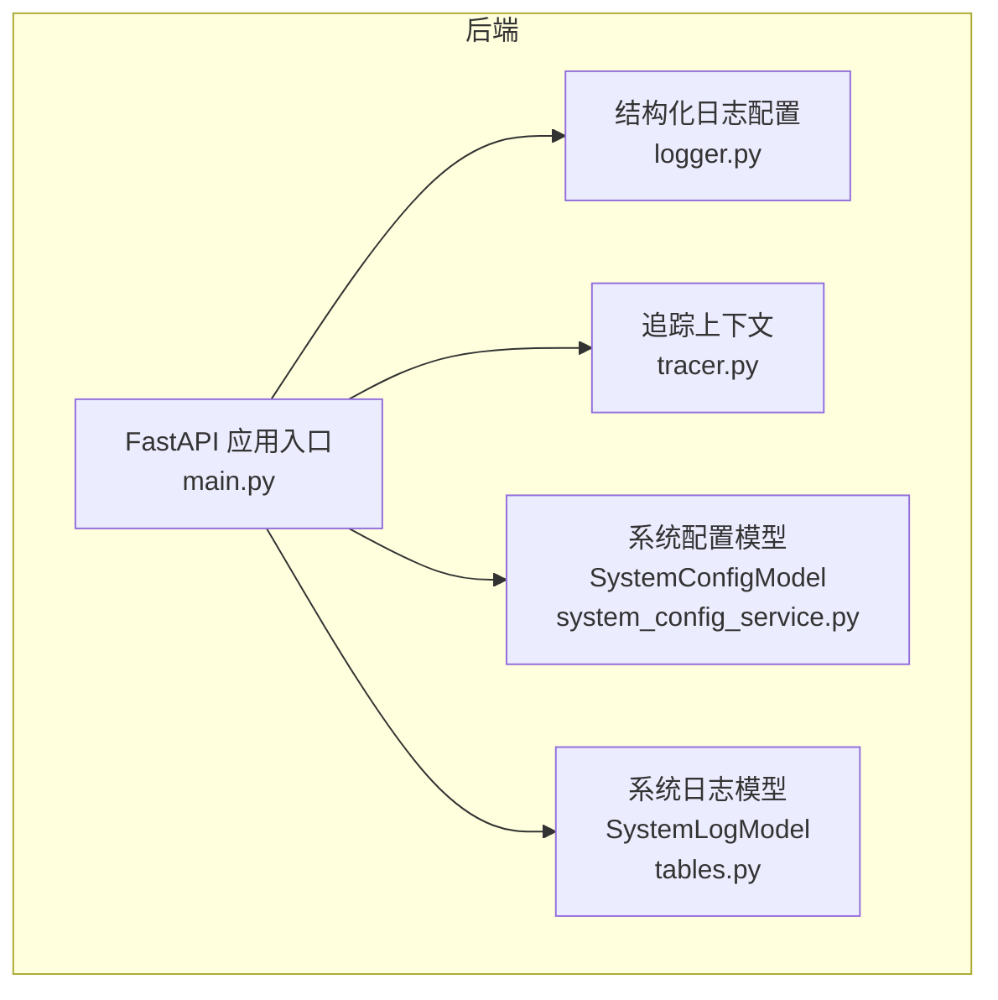
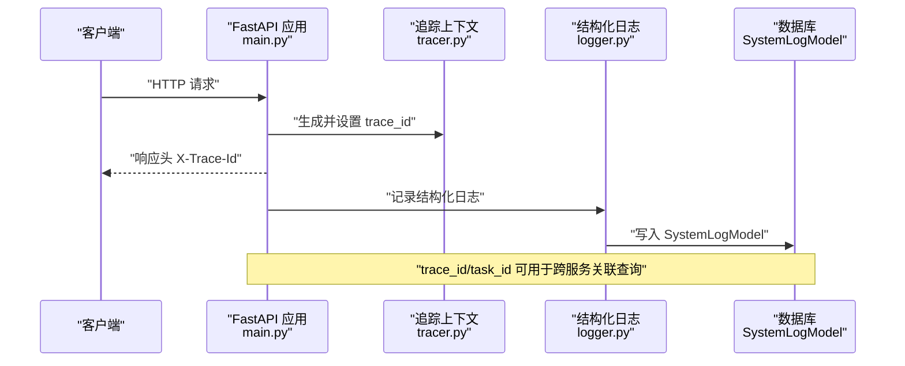
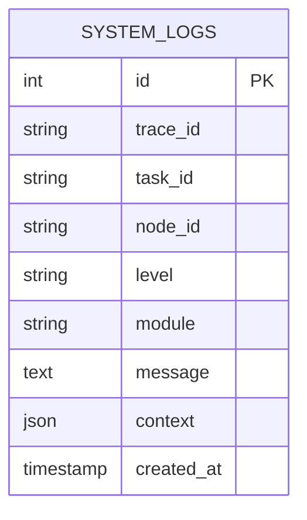
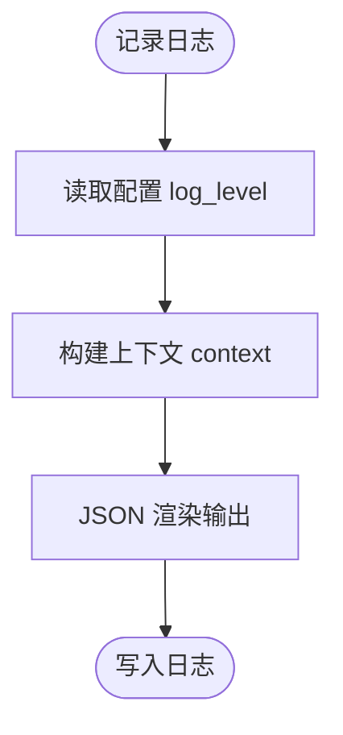
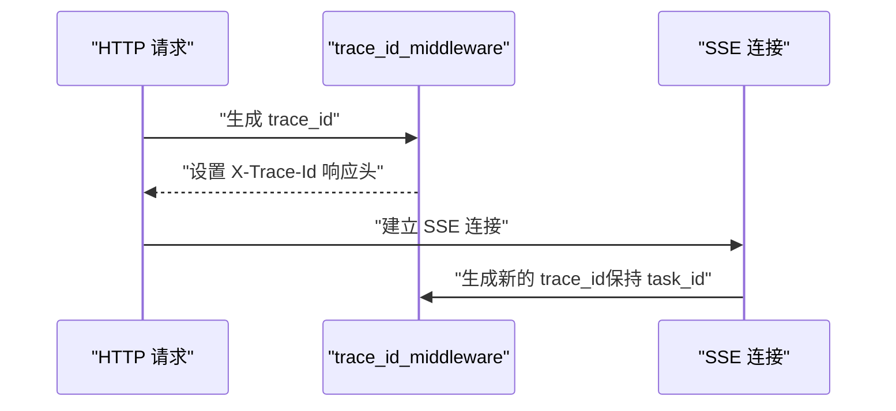
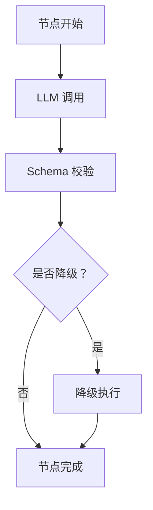
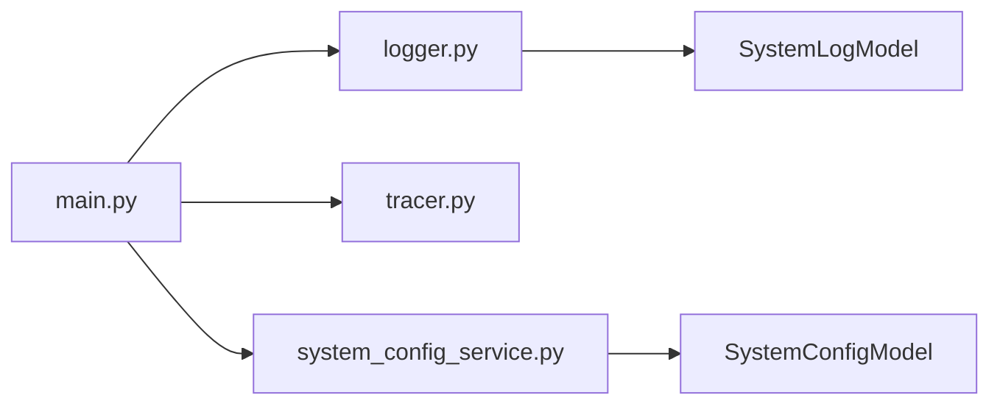

# 日志与监控模型

<cite>
**本文引用的文件**
- [backend/app/models/tables.py](file://backend/app/models/tables.py)
- [backend/app/core/logger.py](file://backend/app/core/logger.py)
- [backend/app/core/tracer.py](file://backend/app/core/tracer.py)
- [backend/app/main.py](file://backend/app/main.py)
- [backend/app/services/system_config_service.py](file://backend/app/services/system_config_service.py)
- [backend/app/api/system_config_routes.py](file://backend/app/api/system_config_routes.py)
- [ARCHITECTURE.md](file://ARCHITECTURE.md)
</cite>

## 目录
1. [引言](#引言)
2. [项目结构](#项目结构)
3. [核心组件](#核心组件)
4. [架构总览](#架构总览)
5. [详细组件分析](#详细组件分析)
6. [依赖分析](#依赖分析)
7. [性能考虑](#性能考虑)
8. [故障排查指南](#故障排查指南)
9. [结论](#结论)
10. [附录](#附录)

## 引言
本文件面向HotClaw日志与监控相关模型，重点围绕SystemLogModel（系统日志）进行深入技术说明，涵盖结构化日志格式、分布式追踪集成、性能监控指标、日志级别管理、上下文信息记录与查询优化策略，并结合前端监控界面与后端配置体系，给出在系统监控、故障排查与性能分析中的应用方法与运维最佳实践。

## 项目结构
日志与监控相关能力由以下模块协同实现：
- 后端模型层：SystemLogModel用于持久化结构化日志
- 核心日志库：基于structlog的结构化日志配置与获取
- 分布式追踪：trace_id/task_id生成与传播
- 应用入口：FastAPI中间件注入trace_id并设置响应头
- 配置中心：SystemConfigModel/SystemConfigService提供运行时配置（含日志级别）
- 架构文档：明确结构化日志字段与追踪机制

**图表来源**
- [backend/app/main.py:86-94](file://backend/app/main.py#L86-L94)
- [backend/app/core/logger.py:8-31](file://backend/app/core/logger.py#L8-L31)
- [backend/app/core/tracer.py:10-33](file://backend/app/core/tracer.py#L10-L33)
- [backend/app/models/tables.py:220-233](file://backend/app/models/tables.py#L220-L233)
- [backend/app/services/system_config_service.py:119-223](file://backend/app/services/system_config_service.py#L119-L223)

**章节来源**
- [backend/app/main.py:86-94](file://backend/app/main.py#L86-L94)
- [backend/app/core/logger.py:8-31](file://backend/app/core/logger.py#L8-L31)
- [backend/app/core/tracer.py:10-33](file://backend/app/core/tracer.py#L10-L33)
- [backend/app/models/tables.py:220-233](file://backend/app/models/tables.py#L220-L233)
- [backend/app/services/system_config_service.py:119-223](file://backend/app/services/system_config_service.py#L119-L223)

## 核心组件
- SystemLogModel：结构化系统日志表，包含trace_id、task_id、node_id、level、module、message、context、created_at等字段，便于跨服务、跨任务的统一检索与关联分析。
- Structured Logger：通过structlog将日志输出为JSON格式，统一包含时间戳、级别、模块、消息与上下文，便于下游日志平台解析与聚合。
- Tracer：提供trace_id/task_id的生成与上下文变量存取，贯穿HTTP请求到SSE流的全生命周期。
- SystemConfigService：提供运行时配置读取与类型转换，支持日志级别动态调整与敏感信息脱敏导出。

**章节来源**
- [backend/app/models/tables.py:220-233](file://backend/app/models/tables.py#L220-L233)
- [backend/app/core/logger.py:8-31](file://backend/app/core/logger.py#L8-L31)
- [backend/app/core/tracer.py:10-33](file://backend/app/core/tracer.py#L10-L33)
- [backend/app/services/system_config_service.py:142-163](file://backend/app/services/system_config_service.py#L142-L163)

## 架构总览
下图展示了从请求进入、日志记录、追踪传播到配置生效的整体流程：

**图表来源**
- [backend/app/main.py:86-94](file://backend/app/main.py#L86-L94)
- [backend/app/core/tracer.py:10-33](file://backend/app/core/tracer.py#L10-L33)
- [backend/app/core/logger.py:8-31](file://backend/app/core/logger.py#L8-L31)
- [backend/app/models/tables.py:220-233](file://backend/app/models/tables.py#L220-L233)

## 详细组件分析

### SystemLogModel 设计与数据模型
- 表结构要点
  - 主键自增id
  - trace_id与task_id建立索引，支持高频过滤
  - level字段默认INFO，便于按级别筛选
  - module记录模块路径，便于定位来源
  - message为文本消息体
  - context为JSON对象，承载上下文键值对（如输入摘要、模型参数、耗时等）
  - created_at默认当前时间，便于排序与时序分析
- 字段与索引
  - 索引字段：trace_id、task_id，提升跨服务与任务级查询效率
  - 关键字段：level、module、context，支撑日志级别管理与上下文检索
- 查询优化建议
  - 在高频查询中优先使用trace_id或task_id过滤
  - 使用level与module组合过滤，缩小扫描范围
  - 对context中的常用键（如node_id、agent_id）建立二级索引或物化列可进一步优化

**图表来源**
- [backend/app/models/tables.py:220-233](file://backend/app/models/tables.py#L220-L233)

**章节来源**
- [backend/app/models/tables.py:220-233](file://backend/app/models/tables.py#L220-L233)

### 结构化日志格式与级别管理
- 输出格式
  - 采用structlog的JSONRenderer，输出包含时间戳、级别、模块、消息与上下文的结构化JSON
  - 日志级别由配置中心的log_level控制，支持运行时调整
- 级别管理
  - 支持DEBUG/INFO/WARNING/ERROR等常见级别
  - 通过SystemConfigService的get_typed_value按需转换为布尔/数值/JSON类型
- 上下文记录
  - context字段用于承载事件相关信息（如输入摘要、模型参数、耗时、错误详情等），便于后续分析与告警

**图表来源**
- [backend/app/core/logger.py:8-31](file://backend/app/core/logger.py#L8-L31)
- [backend/app/services/system_config_service.py:142-163](file://backend/app/services/system_config_service.py#L142-L163)

**章节来源**
- [backend/app/core/logger.py:8-31](file://backend/app/core/logger.py#L8-L31)
- [backend/app/services/system_config_service.py:142-163](file://backend/app/services/system_config_service.py#L142-L163)

### 分布式追踪集成（trace_id/task_id）
- 生成与传播
  - 每个HTTP请求生成唯一trace_id并注入响应头X-Trace-Id
  - 任务生命周期内共享task_id，SSE流每次连接独立trace_id但沿用task_id
- 关系与格式
  - trace_id：tr_{nanoid(12)}
  - task_id：task_{日期}_{nanoid(8)} 或 task_{nanoid(12)}
- 关联分析
  - 通过trace_id快速定位单次请求的全链路日志
  - 通过task_id聚合任务全生命周期内的节点级日志

**图表来源**
- [backend/app/main.py:86-94](file://backend/app/main.py#L86-L94)
- [backend/app/core/tracer.py:10-33](file://backend/app/core/tracer.py#L10-L33)
- [ARCHITECTURE.md:1570-1583](file://ARCHITECTURE.md#L1570-L1583)

**章节来源**
- [backend/app/main.py:86-94](file://backend/app/main.py#L86-L94)
- [backend/app/core/tracer.py:10-33](file://backend/app/core/tracer.py#L10-L33)
- [ARCHITECTURE.md:1570-1583](file://ARCHITECTURE.md#L1570-L1583)

### 性能监控指标与节点级日志
- 节点级运行日志
  - 节点开始/结束、LLM调用、Schema校验、降级触发等关键节点均记录
  - 日志中包含耗时、token用量、错误详情等，便于性能分析与成本控制
- 指标提取建议
  - 从context中提取duration_ms、prompt_tokens、completion_tokens等字段
  - 按node_id/module/level统计成功率、平均耗时、P95/P99耗时
- 与SystemLogModel的映射
  - 将节点级事件作为message，将输入/输出摘要、模型参数、耗时等放入context
  - 利用trace_id/task_id实现端到端关联

**图表来源**
- [ARCHITECTURE.md:1585-1597](file://ARCHITECTURE.md#L1585-L1597)

**章节来源**
- [ARCHITECTURE.md:1546-1597](file://ARCHITECTURE.md#L1546-L1597)

### 日志级别管理、上下文记录与查询优化
- 级别管理
  - 通过SystemConfigService.get_typed_value读取log_level，支持运行时调整
  - 结构化日志处理器按级别过滤，避免低价值日志污染
- 上下文记录
  - 在关键节点将输入摘要、模型参数、错误详情写入context
  - 建议对敏感字段进行脱敏（如API Key仅保留尾部片段）
- 查询优化
  - 优先使用trace_id/task_id过滤
  - 对高频查询字段（如level、module、node_id）建立索引
  - 将热点字段物化为单独列可进一步提升查询性能

**章节来源**
- [backend/app/services/system_config_service.py:142-163](file://backend/app/services/system_config_service.py#L142-L163)
- [backend/app/models/tables.py:220-233](file://backend/app/models/tables.py#L220-L233)

### 日志在监控、故障排查与性能分析中的应用
- 系统监控
  - 通过level分布与异常日志聚合，识别系统健康度与热点问题
  - 结合module维度定位问题模块，辅助容量规划
- 故障排查
  - 使用trace_id快速回溯一次请求的全链路日志
  - 结合context中的输入/输出摘要与错误详情，快速定位根因
- 性能分析
  - 以node_id/module为维度统计平均耗时与成功率
  - 基于context中的token用量与耗时计算成本与吞吐

**章节来源**
- [backend/app/models/tables.py:220-233](file://backend/app/models/tables.py#L220-L233)
- [ARCHITECTURE.md:1585-1597](file://ARCHITECTURE.md#L1585-L1597)

### 使用示例与运维最佳实践
- 使用示例
  - 获取结构化logger并记录日志：参考[logger.py:33-35](file://backend/app/core/logger.py#L33-L35)
  - 在中间件中注入trace_id并设置响应头：参考[main.py:86-94](file://backend/app/main.py#L86-L94)
  - 通过API读取/更新系统配置（含日志级别）：参考[system_config_routes.py:48-94](file://backend/app/api/system_config_routes.py#L48-L94)与[system_config_service.py:125-163](file://backend/app/services/system_config_service.py#L125-L163)
- 运维最佳实践
  - 将log_level设为INFO或WARNING以平衡可观测性与性能
  - 对敏感配置（如API Key）启用脱敏导出
  - 定期清理过期日志，控制表规模
  - 为高频查询字段建立索引，必要时物化热点字段

**章节来源**
- [backend/app/core/logger.py:33-35](file://backend/app/core/logger.py#L33-L35)
- [backend/app/main.py:86-94](file://backend/app/main.py#L86-L94)
- [backend/app/api/system_config_routes.py:48-94](file://backend/app/api/system_config_routes.py#L48-L94)
- [backend/app/services/system_config_service.py:125-163](file://backend/app/services/system_config_service.py#L125-L163)

## 依赖分析
- 组件耦合
  - main.py依赖logger.py与tracer.py，负责应用生命周期与中间件注册
  - SystemLogModel与SystemConfigModel分别服务于日志存储与配置中心
  - system_config_service.py提供配置读取与类型转换能力
- 外部依赖
  - structlog用于结构化日志渲染
  - nanoid用于trace_id/task_id生成
  - SQLAlchemy用于ORM与数据库访问

**图表来源**
- [backend/app/main.py:86-94](file://backend/app/main.py#L86-L94)
- [backend/app/core/logger.py:8-31](file://backend/app/core/logger.py#L8-L31)
- [backend/app/core/tracer.py:10-33](file://backend/app/core/tracer.py#L10-L33)
- [backend/app/services/system_config_service.py:119-223](file://backend/app/services/system_config_service.py#L119-L223)
- [backend/app/models/tables.py:220-233](file://backend/app/models/tables.py#L220-L233)

**章节来源**
- [backend/app/main.py:86-94](file://backend/app/main.py#L86-L94)
- [backend/app/core/logger.py:8-31](file://backend/app/core/logger.py#L8-L31)
- [backend/app/core/tracer.py:10-33](file://backend/app/core/tracer.py#L10-L33)
- [backend/app/services/system_config_service.py:119-223](file://backend/app/services/system_config_service.py#L119-L223)
- [backend/app/models/tables.py:220-233](file://backend/app/models/tables.py#L220-L233)

## 性能考虑
- 日志写入
  - JSON渲染与数据库写入为I/O瓶颈，建议批量写入或异步队列
- 查询性能
  - 为trace_id、task_id、level、module建立索引
  - 对context字段建立GIN索引（若使用PostgreSQL JSONB）以加速键值查询
- 存储与归档
  - 设置日志保留周期，定期归档冷数据
  - 对高基数字段（如message全文）谨慎建索引

## 故障排查指南
- 无法获取trace_id
  - 检查中间件是否正确注入与响应头是否返回
  - 参考[main.py:86-94](file://backend/app/main.py#L86-L94)
- 日志级别不生效
  - 确认log_level配置已加载且类型转换正确
  - 参考[system_config_service.py:142-163](file://backend/app/services/system_config_service.py#L142-L163)
- 日志量过大影响性能
  - 降低日志级别或增加过滤规则
  - 对高频模块减少细粒度日志
- 查询缓慢
  - 为高频过滤字段添加索引
  - 限制查询时间窗口与层级深度

**章节来源**
- [backend/app/main.py:86-94](file://backend/app/main.py#L86-L94)
- [backend/app/services/system_config_service.py:142-163](file://backend/app/services/system_config_service.py#L142-L163)

## 结论
SystemLogModel配合structlog与trace_id/task_id机制，提供了跨服务、跨任务的一致化日志视图；通过SystemConfigService实现运行时配置管理，使日志级别与敏感信息处理具备灵活性。结合节点级事件日志与上下文字段，可在监控、故障排查与性能分析中发挥重要作用。建议在生产环境中完善索引、批量写入与归档策略，确保可观测性与性能的平衡。

## 附录
- 关键字段说明
  - trace_id：请求级追踪标识
  - task_id：任务级追踪标识
  - node_id：节点标识
  - level：日志级别
  - module：模块路径
  - message：日志消息
  - context：上下文键值对
  - created_at：创建时间
- 参考架构文档
  - 结构化日志字段与追踪机制详见[ARCHITECTURE.md:1546-1597](file://ARCHITECTURE.md#L1546-L1597)

**章节来源**
- [backend/app/models/tables.py:220-233](file://backend/app/models/tables.py#L220-L233)
- [ARCHITECTURE.md:1546-1597](file://ARCHITECTURE.md#L1546-L1597)