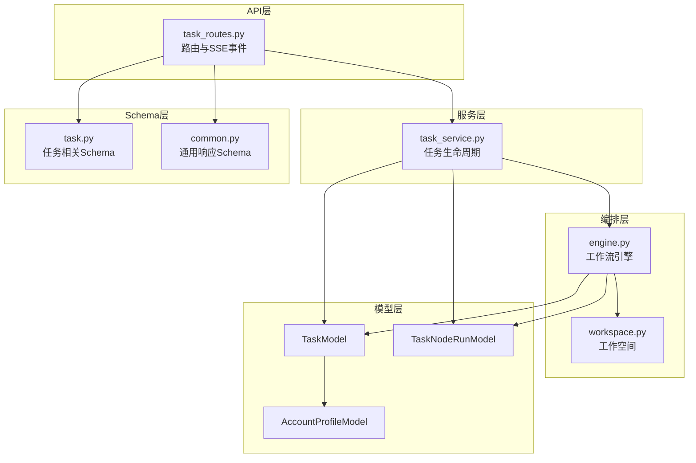
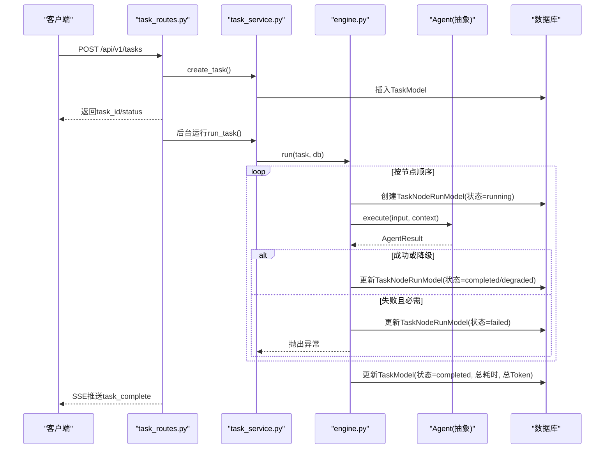
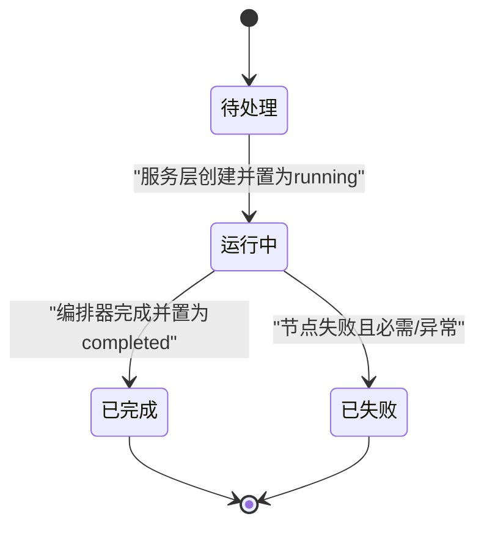
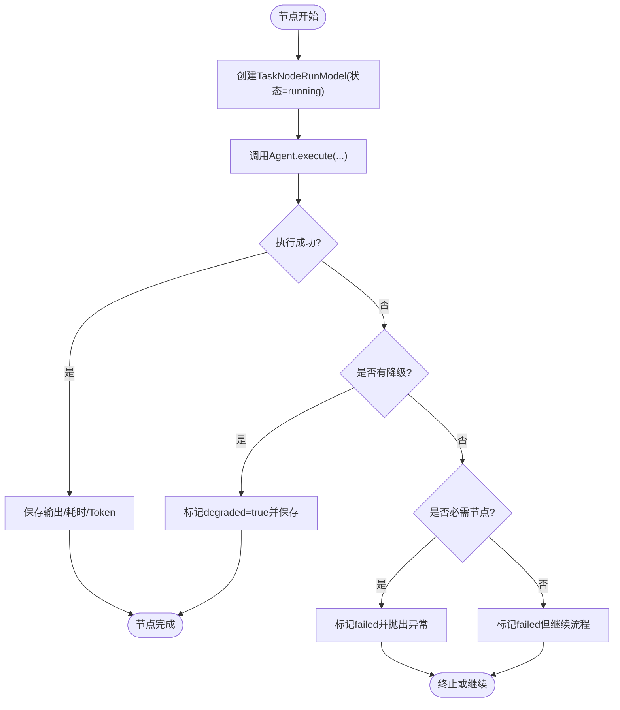
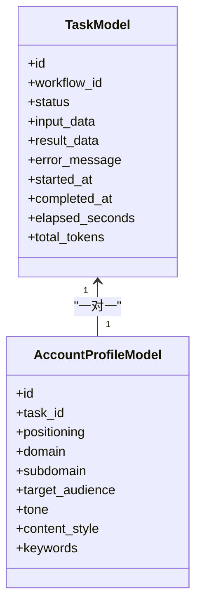
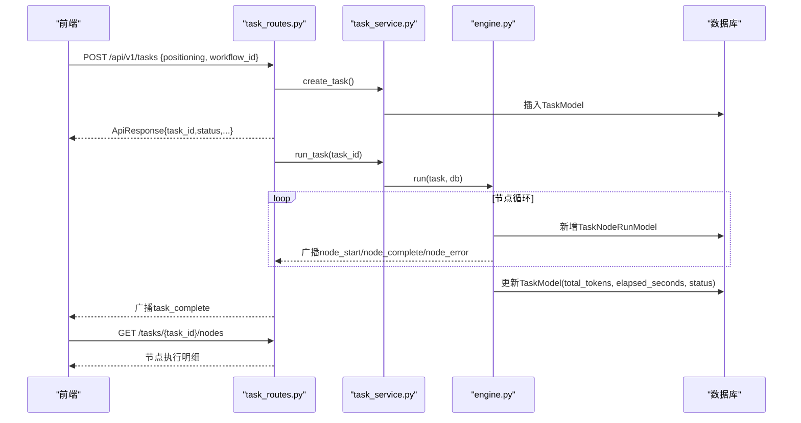
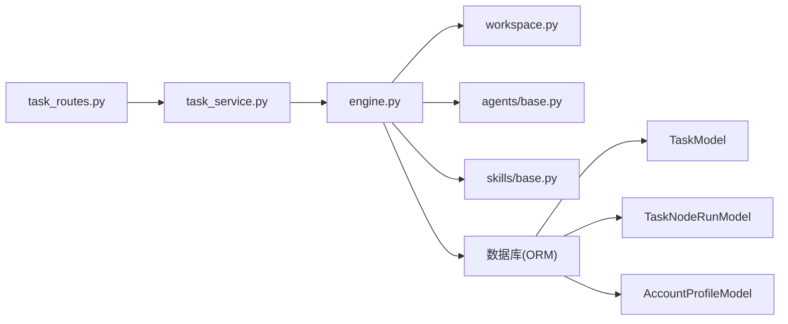

# 核心业务模型

<cite>
**本文引用的文件**
- [backend/app/models/tables.py](file://backend/app/models/tables.py)
- [backend/app/schemas/task.py](file://backend/app/schemas/task.py)
- [backend/app/schemas/common.py](file://backend/app/schemas/common.py)
- [backend/app/orchestrator/engine.py](file://backend/app/orchestrator/engine.py)
- [backend/app/services/task_service.py](file://backend/app/services/task_service.py)
- [backend/app/api/task_routes.py](file://backend/app/api/task_routes.py)
- [backend/app/agents/base.py](file://backend/app/agents/base.py)
- [backend/app/skills/base.py](file://backend/app/skills/base.py)
- [backend/app/orchestrator/workspace.py](file://backend/app/orchestrator/workspace.py)
- [ARCHITECTURE.md](file://ARCHITECTURE.md)
</cite>

## 目录
1. [引言](#引言)
2. [项目结构](#项目结构)
3. [核心组件](#核心组件)
4. [架构总览](#架构总览)
5. [详细组件分析](#详细组件分析)
6. [依赖分析](#依赖分析)
7. [性能考量](#性能考量)
8. [故障排查指南](#故障排查指南)
9. [结论](#结论)
10. [附录](#附录)

## 引言
本文件聚焦HotClaw的核心业务模型，围绕三大关键模型展开：TaskModel（任务模型）、TaskNodeRunModel（节点执行记录）与AccountProfileModel（账号画像）。文档深入解释任务生命周期管理、状态流转机制、性能指标记录，以及节点执行的Agent跟踪、Token消耗统计与重试/降级策略。同时提供模型使用示例，展示如何通过这些核心模型实现完整的任务执行流程与状态跟踪。

## 项目结构
后端采用分层架构：API路由层负责请求接入与参数校验，服务层承载业务逻辑，编排器驱动工作流，模型层提供ORM映射，Schema层定义输入输出结构。核心模型位于models层，业务流程由orchestrator驱动，API层通过服务层协调数据库与编排器。

图表来源
- [backend/app/api/task_routes.py:1-179](file://backend/app/api/task_routes.py#L1-L179)
- [backend/app/services/task_service.py:1-126](file://backend/app/services/task_service.py#L1-L126)
- [backend/app/orchestrator/engine.py:1-285](file://backend/app/orchestrator/engine.py#L1-L285)
- [backend/app/orchestrator/workspace.py:1-53](file://backend/app/orchestrator/workspace.py#L1-L53)
- [backend/app/models/tables.py:1-319](file://backend/app/models/tables.py#L1-L319)
- [backend/app/schemas/task.py:1-83](file://backend/app/schemas/task.py#L1-L83)
- [backend/app/schemas/common.py:1-27](file://backend/app/schemas/common.py#L1-L27)

章节来源
- [backend/app/api/task_routes.py:1-179](file://backend/app/api/task_routes.py#L1-L179)
- [backend/app/services/task_service.py:1-126](file://backend/app/services/task_service.py#L1-L126)
- [backend/app/orchestrator/engine.py:1-285](file://backend/app/orchestrator/engine.py#L1-L285)
- [backend/app/orchestrator/workspace.py:1-53](file://backend/app/orchestrator/workspace.py#L1-L53)
- [backend/app/models/tables.py:1-319](file://backend/app/models/tables.py#L1-L319)
- [backend/app/schemas/task.py:1-83](file://backend/app/schemas/task.py#L1-L83)
- [backend/app/schemas/common.py:1-27](file://backend/app/schemas/common.py#L1-L27)

## 核心组件
- TaskModel：任务实体，记录任务生命周期、状态、输入输出、错误信息、耗时与Token汇总等。
- TaskNodeRunModel：节点执行记录，记录每个Agent节点的输入输出、状态、耗时、Token消耗、模型与重试次数等。
- AccountProfileModel：账号画像，解析用户“账号定位”输入，形成领域、子域、受众、调性、内容风格、关键词等结构化数据。

章节来源
- [backend/app/models/tables.py:23-94](file://backend/app/models/tables.py#L23-L94)

## 架构总览
HotClaw采用“控制平面与执行平面分离”的设计：API层负责路由与SSE事件推送；服务层负责任务生命周期与数据访问；编排器按线性工作流顺序调度Agent；模型层提供ORM映射；Schema层统一输入输出结构。任务从创建到完成，全程记录节点执行快照，支持可视化与回放。

图表来源
- [backend/app/api/task_routes.py:39-67](file://backend/app/api/task_routes.py#L39-L67)
- [backend/app/services/task_service.py:22-64](file://backend/app/services/task_service.py#L22-L64)
- [backend/app/orchestrator/engine.py:92-234](file://backend/app/orchestrator/engine.py#L92-L234)
- [backend/app/agents/base.py:49-99](file://backend/app/agents/base.py#L49-L99)

章节来源
- [ARCHITECTURE.md:496-538](file://ARCHITECTURE.md#L496-L538)
- [backend/app/api/task_routes.py:1-179](file://backend/app/api/task_routes.py#L1-L179)
- [backend/app/services/task_service.py:1-126](file://backend/app/services/task_service.py#L1-L126)
- [backend/app/orchestrator/engine.py:1-285](file://backend/app/orchestrator/engine.py#L1-L285)

## 详细组件分析

### TaskModel（任务模型）
- 设计要点
  - 任务标识、所属工作流、状态、输入/输出、错误信息、起止时间、总耗时、总Token等。
  - 与TaskNodeRunModel一对多关系，与AccountProfileModel一对一关系，便于聚合节点执行与账号画像。
- 生命周期管理
  - 创建：API层接收请求，服务层创建TaskModel并落库。
  - 运行：编排器将任务状态置为“running”，记录started_at。
  - 完成/失败：编排器计算耗时、汇总Token，设置completed_at与最终状态。
- 状态流转机制
  - pending → running → completed 或 failed。
  - 失败时记录error_message，供前端展示与回溯。
- 性能指标记录
  - elapsed_seconds：任务总耗时。
  - total_tokens：节点prompt_tokens与completion_tokens之和。

图表来源
- [backend/app/models/tables.py:23-46](file://backend/app/models/tables.py#L23-L46)
- [backend/app/services/task_service.py:39-64](file://backend/app/services/task_service.py#L39-L64)
- [backend/app/orchestrator/engine.py:92-234](file://backend/app/orchestrator/engine.py#L92-L234)

章节来源
- [backend/app/models/tables.py:23-46](file://backend/app/models/tables.py#L23-L46)
- [backend/app/services/task_service.py:22-64](file://backend/app/services/task_service.py#L22-L64)
- [backend/app/orchestrator/engine.py:92-234](file://backend/app/orchestrator/engine.py#L92-L234)

### TaskNodeRunModel（节点执行记录）
- 设计要点
  - 记录节点级Agent执行：node_id、agent_id、状态、输入/输出、错误信息、降级标志、起止时间、耗时、Token消耗、模型、重试次数。
  - 与TaskModel外键关联，保证节点归属。
- Agent执行跟踪
  - 编排器在节点开始时创建记录并广播node_start；完成后广播node_complete或node_error。
  - 节点完成时持久化output_data与耗时。
- Token消耗统计
  - prompt_tokens与completion_tokens分别记录提示与补全Token，编排器在完成后累加至任务总Token。
- 重试机制
  - 节点自身不维护重试计数，重试策略由上层编排器与Agent降级策略共同决定。
  - 本模型提供retry_count字段，便于后续扩展为节点级重试计数。

图表来源
- [backend/app/orchestrator/engine.py:113-198](file://backend/app/orchestrator/engine.py#L113-L198)
- [backend/app/models/tables.py:48-74](file://backend/app/models/tables.py#L48-L74)

章节来源
- [backend/app/models/tables.py:48-74](file://backend/app/models/tables.py#L48-L74)
- [backend/app/orchestrator/engine.py:113-198](file://backend/app/orchestrator/engine.py#L113-L198)

### AccountProfileModel（账号画像）
- 设计要点
  - 解析用户输入的“账号定位”，抽取领域(domain)、子域(subdomain)、目标受众(target_audience)、调性(tone)、内容风格(content_style)、关键词(keywords)等。
  - 与TaskModel一对一关系，确保每任务仅有一份画像。
- 数据结构设计
  - positioning：原始定位字符串。
  - domain/subdomain：领域与子域。
  - target_audience：受众结构化对象（年龄区间、职业、兴趣等）。
  - tone/content_style：调性与内容风格。
  - keywords：关键词列表。
- 与工作流的关系
  - ProfileAgent负责生成AccountProfileModel，后续节点（热点分析、选题策划、标题生成、正文生成）均依赖该画像。

图表来源
- [backend/app/models/tables.py:76-94](file://backend/app/models/tables.py#L76-L94)
- [backend/app/models/tables.py:23-46](file://backend/app/models/tables.py#L23-L46)

章节来源
- [backend/app/models/tables.py:76-94](file://backend/app/models/tables.py#L76-L94)

### 模型使用示例（完整任务执行流程与状态跟踪）
- 创建任务
  - 客户端调用POST /api/v1/tasks，传入positioning与workflow_id。
  - 服务层创建TaskModel并持久化，随后异步启动编排器执行。
- 节点执行与状态广播
  - 编排器逐节点运行：创建TaskNodeRunModel，广播node_start；执行Agent；根据结果广播node_complete或node_error；最终持久化节点记录。
- 任务完成与回放
  - 编排器汇总节点耗时与Token，更新TaskModel状态为completed；前端通过SSE接收task_complete事件。
  - 前端可调用GET /api/v1/tasks/{task_id}/nodes获取节点执行明细，实现可视化与回放。

图表来源
- [backend/app/api/task_routes.py:39-103](file://backend/app/api/task_routes.py#L39-L103)
- [backend/app/services/task_service.py:22-64](file://backend/app/services/task_service.py#L22-L64)
- [backend/app/orchestrator/engine.py:92-234](file://backend/app/orchestrator/engine.py#L92-L234)

章节来源
- [backend/app/api/task_routes.py:39-103](file://backend/app/api/task_routes.py#L39-L103)
- [backend/app/services/task_service.py:22-64](file://backend/app/services/task_service.py#L22-L64)
- [backend/app/orchestrator/engine.py:92-234](file://backend/app/orchestrator/engine.py#L92-L234)

## 依赖分析
- 模型层
  - TaskModel与TaskNodeRunModel、AccountProfileModel存在外键关系，形成任务-节点-画像的完整数据视图。
- 编排层
  - OrchestratorEngine依赖AgentRegistry获取Agent实例，依赖Workspace进行上下文提取与写入，依赖Broadcaster推送SSE事件。
- 服务层
  - TaskService封装任务生命周期，协调数据库事务与编排器执行。
- API层
  - task_routes.py负责请求参数校验与SSE事件触发，调用TaskService与TaskService.run_task。

图表来源
- [backend/app/api/task_routes.py:1-179](file://backend/app/api/task_routes.py#L1-L179)
- [backend/app/services/task_service.py:1-126](file://backend/app/services/task_service.py#L1-L126)
- [backend/app/orchestrator/engine.py:1-285](file://backend/app/orchestrator/engine.py#L1-L285)
- [backend/app/orchestrator/workspace.py:1-53](file://backend/app/orchestrator/workspace.py#L1-L53)
- [backend/app/agents/base.py:1-99](file://backend/app/agents/base.py#L1-L99)
- [backend/app/skills/base.py:1-37](file://backend/app/skills/base.py#L1-L37)
- [backend/app/models/tables.py:1-319](file://backend/app/models/tables.py#L1-L319)

章节来源
- [backend/app/models/tables.py:1-319](file://backend/app/models/tables.py#L1-L319)
- [backend/app/orchestrator/engine.py:1-285](file://backend/app/orchestrator/engine.py#L1-L285)
- [backend/app/services/task_service.py:1-126](file://backend/app/services/task_service.py#L1-L126)
- [backend/app/api/task_routes.py:1-179](file://backend/app/api/task_routes.py#L1-L179)

## 性能考量
- Token统计
  - 编排器在节点完成后累加prompt_tokens与completion_tokens，最终汇总到TaskModel.total_tokens，便于成本与性能分析。
- 耗时统计
  - 节点与任务均记录started_at/completed_at，计算elapsed_seconds，支撑性能监控与瓶颈定位。
- 并发与SSE
  - API层通过后台任务运行编排器，避免阻塞请求；SSE事件推送实时状态，降低轮询开销。
- 降级与容错
  - 必需节点失败时终止流程；非必需节点失败时继续，保障整体吞吐。

章节来源
- [backend/app/orchestrator/engine.py:211-226](file://backend/app/orchestrator/engine.py#L211-L226)
- [backend/app/api/task_routes.py:22-37](file://backend/app/api/task_routes.py#L22-L37)

## 故障排查指南
- 任务状态异常
  - 若任务长时间处于“running”，检查编排器是否正确广播节点事件，确认节点执行是否超时或抛出异常。
- 节点失败
  - 查看TaskNodeRunModel.error_message与degraded标志；必要时启用Agent降级策略或调整节点配置。
- Token与耗时异常
  - 核对节点prompt_tokens与completion_tokens是否正确写入；若为空，检查Agent输出结构与编排器统计逻辑。
- API响应
  - 使用统一响应包装ApiResponse/ApiErrorResponse，便于前端一致处理错误与详情。

章节来源
- [backend/app/orchestrator/engine.py:164-196](file://backend/app/orchestrator/engine.py#L164-L196)
- [backend/app/schemas/common.py:7-27](file://backend/app/schemas/common.py#L7-L27)

## 结论
HotClaw通过TaskModel、TaskNodeRunModel与AccountProfileModel构建了清晰的任务生命周期与节点执行跟踪体系。编排器驱动的线性工作流确保可控与可观测，配合SSE与Schema层的统一响应，实现了从创建到完成的全链路可视化与可审计。模型设计兼顾性能指标统计与降级容错，为后续扩展（如DAG工作流、重试机制）提供了良好基础。

## 附录
- Agent与Skill基类
  - AgentResult标准化Agent输出，支持成功/失败与trace_id；BaseAgent定义execute与fallback；BaseSkill定义execute。
- Workspace上下文
  - 以键值对形式在任务内共享数据，支持简单映射提取Agent输入。

章节来源
- [backend/app/agents/base.py:18-99](file://backend/app/agents/base.py#L18-L99)
- [backend/app/skills/base.py:16-37](file://backend/app/skills/base.py#L16-L37)
- [backend/app/orchestrator/workspace.py:12-53](file://backend/app/orchestrator/workspace.py#L12-L53)