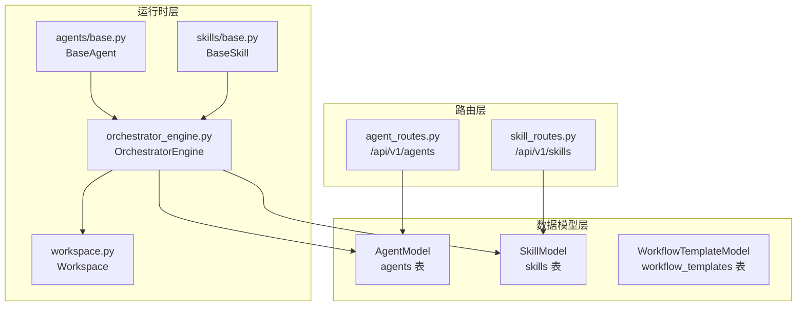
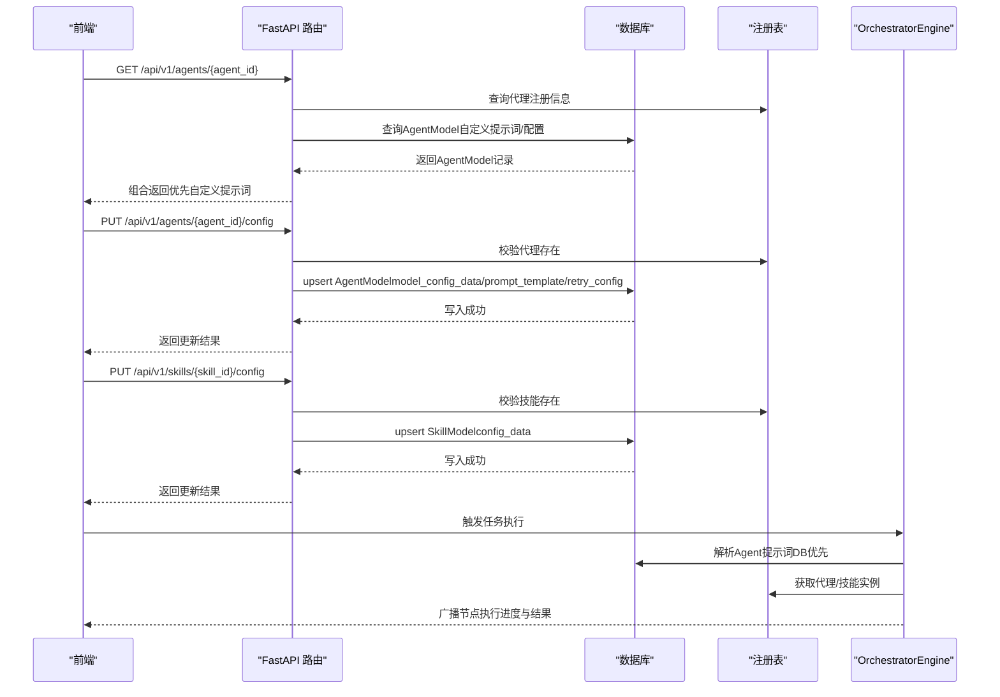
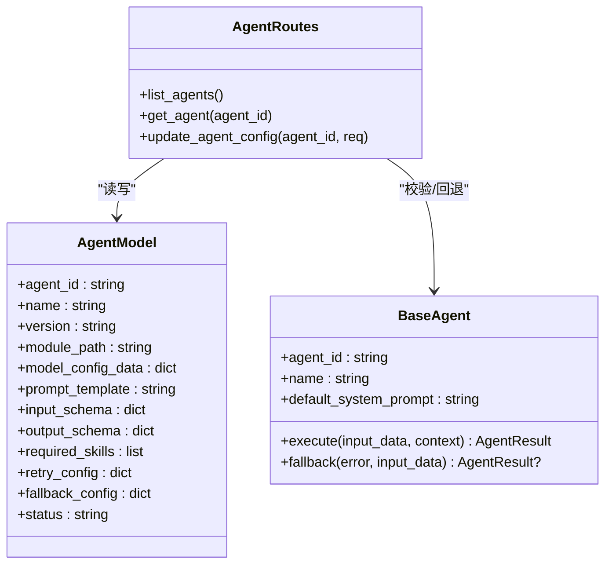
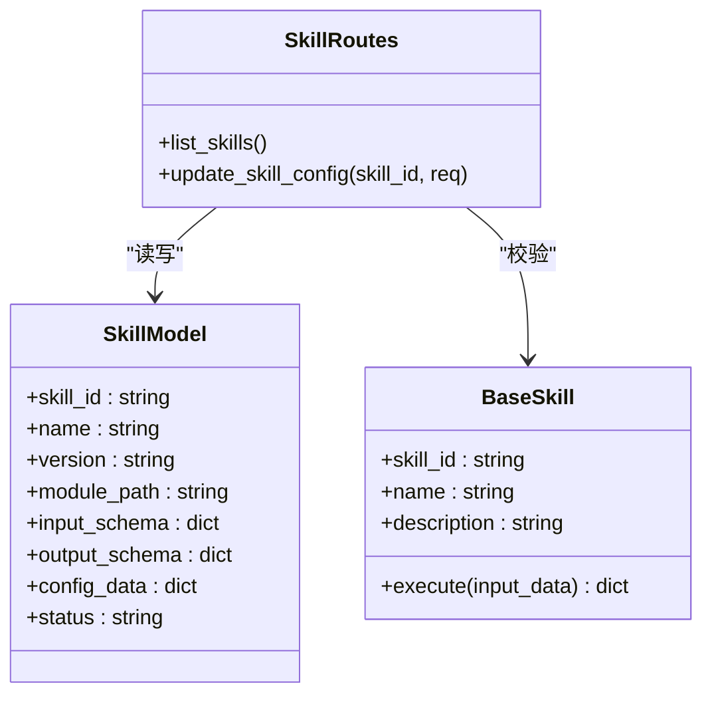
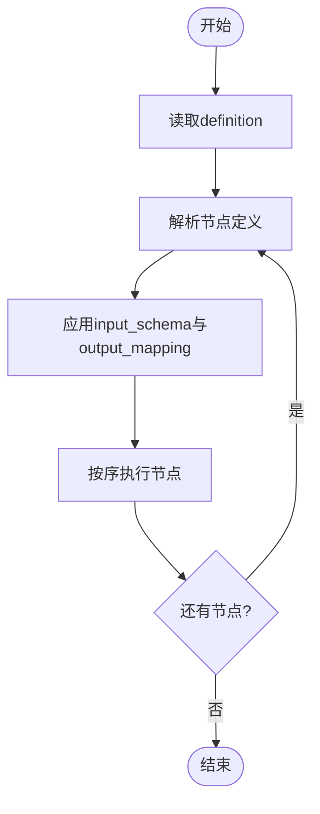
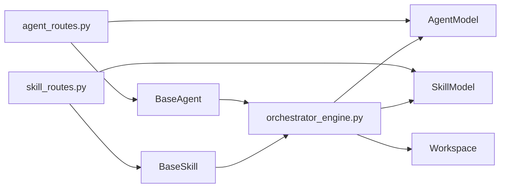

# 配置管理模型

<cite>
**本文引用的文件**
- [backend/app/models/tables.py](file://backend/app/models/tables.py)
- [backend/app/schemas/agent.py](file://backend/app/schemas/agent.py)
- [backend/app/schemas/skill.py](file://backend/app/schemas/skill.py)
- [backend/app/schemas/task.py](file://backend/app/schemas/task.py)
- [backend/app/schemas/common.py](file://backend/app/schemas/common.py)
- [backend/app/api/agent_routes.py](file://backend/app/api/agent_routes.py)
- [backend/app/api/skill_routes.py](file://backend/app/api/skill_routes.py)
- [backend/app/agents/base.py](file://backend/app/agents/base.py)
- [backend/app/agents/registry.py](file://backend/app/agents/registry.py)
- [backend/app/skills/base.py](file://backend/app/skills/base.py)
- [backend/app/skills/registry.py](file://backend/app/skills/registry.py)
- [backend/app/orchestrator/engine.py](file://backend/app/orchestrator/engine.py)
- [backend/app/orchestrator/workspace.py](file://backend/app/orchestrator/workspace.py)
</cite>

## 目录
1. [引言](#引言)
2. [项目结构](#项目结构)
3. [核心组件](#核心组件)
4. [架构总览](#架构总览)
5. [详细组件分析](#详细组件分析)
6. [依赖分析](#依赖分析)
7. [性能考虑](#性能考虑)
8. [故障排查指南](#故障排查指南)
9. [结论](#结论)
10. [附录](#附录)

## 引言
本文件聚焦HotClaw配置管理相关的三类核心模型：AgentModel（代理配置）、SkillModel（技能配置）与WorkflowTemplateModel（工作流模板）。文档从数据模型设计、API交互流程、运行时解析策略、以及最佳实践与扩展方法等方面进行系统性说明，帮助开发者在不直接阅读代码的情况下理解配置如何被持久化、如何被运行时解析、以及如何进行演进与扩展。

## 项目结构
围绕配置管理的关键代码分布在以下层次：
- 数据模型层：定义Agent、Skill、WorkflowTemplate等配置实体及其字段
- 路由层：提供Agent与Skill的查询与更新接口
- 运行时层：在执行工作流时解析Agent提示词、加载Skill配置、组织工作区上下文
- 基类与注册表：抽象出统一的Agent/Skill基类与注册表，便于扩展与发现

图表来源
- [backend/app/models/tables.py:160-218](file://backend/app/models/tables.py#L160-L218)
- [backend/app/api/agent_routes.py:17-115](file://backend/app/api/agent_routes.py#L17-L115)
- [backend/app/api/skill_routes.py:17-61](file://backend/app/api/skill_routes.py#L17-L61)
- [backend/app/orchestrator/engine.py:89-285](file://backend/app/orchestrator/engine.py#L89-L285)
- [backend/app/orchestrator/workspace.py:12-53](file://backend/app/orchestrator/workspace.py#L12-L53)
- [backend/app/agents/base.py:49-99](file://backend/app/agents/base.py#L49-L99)
- [backend/app/skills/base.py:16-37](file://backend/app/skills/base.py#L16-L37)

章节来源
- [backend/app/models/tables.py:160-218](file://backend/app/models/tables.py#L160-L218)
- [backend/app/api/agent_routes.py:17-115](file://backend/app/api/agent_routes.py#L17-L115)
- [backend/app/api/skill_routes.py:17-61](file://backend/app/api/skill_routes.py#L17-L61)
- [backend/app/orchestrator/engine.py:89-285](file://backend/app/orchestrator/engine.py#L89-L285)
- [backend/app/orchestrator/workspace.py:12-53](file://backend/app/orchestrator/workspace.py#L12-L53)
- [backend/app/agents/base.py:49-99](file://backend/app/agents/base.py#L49-L99)
- [backend/app/skills/base.py:16-37](file://backend/app/skills/base.py#L16-L37)

## 核心组件
本节对三类配置模型进行要点梳理，强调字段语义、持久化策略与运行时解析方式。

- AgentModel（代理配置）
  - 关键字段：agent_id、name、description、version、module_path、model_config_data、prompt_template、input_schema、output_schema、required_skills、retry_config、fallback_config、status
  - 持久化位置：数据库表agents
  - 运行时解析：API在读取代理详情时，优先使用DB中的自定义提示词；若不存在则回退到代理默认提示词；同时合并DB中的模型配置与重试/降级配置
  - 用途：承载代理的可定制化能力（提示词、模型参数、重试策略、降级策略），并与技能依赖关联

- SkillModel（技能配置）
  - 关键字段：skill_id、name、description、version、module_path、input_schema、output_schema、config_data、status
  - 持久化位置：数据库表skills
  - 运行时解析：API在更新技能配置时，将请求体写入DB；运行时通过注册表按skill_id查找实例并调用其execute方法
  - 用途：封装工具型处理逻辑，提供稳定的结构化输出

- WorkflowTemplateModel（工作流模板）
  - 关键字段：workflow_id、name、description、version、definition、input_schema、output_mapping、status
  - 持久化位置：数据库表workflow_templates
  - 运行时解析：当前MVP阶段采用硬编码节点序列；未来可替换为definition字段驱动的动态调度
  - 用途：定义工作流的节点顺序、输入输出映射与版本控制

章节来源
- [backend/app/models/tables.py:160-218](file://backend/app/models/tables.py#L160-L218)
- [backend/app/api/agent_routes.py:46-115](file://backend/app/api/agent_routes.py#L46-L115)
- [backend/app/api/skill_routes.py:17-61](file://backend/app/api/skill_routes.py#L17-L61)
- [backend/app/orchestrator/engine.py:32-86](file://backend/app/orchestrator/engine.py#L32-L86)

## 架构总览
下图展示了配置管理在系统中的位置与交互路径：前端通过API查询/更新配置，运行时引擎在执行任务时解析配置并驱动代理与技能。

图表来源
- [backend/app/api/agent_routes.py:46-115](file://backend/app/api/agent_routes.py#L46-L115)
- [backend/app/api/skill_routes.py:34-61](file://backend/app/api/skill_routes.py#L34-L61)
- [backend/app/orchestrator/engine.py:138-176](file://backend/app/orchestrator/engine.py#L138-L176)
- [backend/app/agents/registry.py:23-28](file://backend/app/agents/registry.py#L23-L28)
- [backend/app/skills/registry.py:22-26](file://backend/app/skills/registry.py#L22-L26)

## 详细组件分析

### AgentModel（代理配置）设计原理
- 设计目标
  - 将代理的“可配置项”集中存储，支持运行时覆盖默认行为
  - 支持提示词模板的自定义与回退策略
  - 记录模型参数、重试与降级策略，便于运维与审计
- 字段与职责
  - 标识与元数据：agent_id、name、description、version
  - 执行相关：module_path、model_config_data、prompt_template、required_skills
  - 输入输出约束：input_schema、output_schema
  - 可靠性：retry_config、fallback_config
  - 生命周期：status、created_at、updated_at
- 运行时解析策略
  - 提示词解析：优先使用DB中的自定义提示词，否则回退到代理默认提示词
  - 配置合并：将DB中的model_config_data与代理默认配置合并后传入执行
  - 依赖声明：required_skills用于声明该代理所需的技能集合，便于校验与调度
- API交互
  - 列表与详情：读取注册表中的代理信息，并补充DB中的自定义提示词是否存在标记
  - 更新配置：支持部分字段更新（模型参数、提示词、重试配置），空字符串表示“恢复默认”

图表来源
- [backend/app/models/tables.py:160-181](file://backend/app/models/tables.py#L160-L181)
- [backend/app/api/agent_routes.py:17-115](file://backend/app/api/agent_routes.py#L17-L115)
- [backend/app/agents/base.py:49-99](file://backend/app/agents/base.py#L49-L99)

章节来源
- [backend/app/models/tables.py:160-181](file://backend/app/models/tables.py#L160-L181)
- [backend/app/api/agent_routes.py:46-115](file://backend/app/api/agent_routes.py#L46-L115)
- [backend/app/agents/base.py:49-99](file://backend/app/agents/base.py#L49-L99)

### SkillModel（技能配置）实现
- 设计目标
  - 将工具型能力模块化，屏蔽具体实现细节
  - 以结构化输入输出约定提升复用性与稳定性
- 字段与职责
  - 标识与元数据：skill_id、name、description、version
  - 执行相关：module_path、config_data
  - 输入输出约束：input_schema、output_schema
  - 生命周期：status、created_at、updated_at
- 运行时交互
  - 注册表管理：通过注册表按skill_id获取实例
  - 执行协议：统一的execute方法签名，返回结构化输出
- API交互
  - 列表：读取注册表中的技能清单
  - 更新：将请求体写入DB，供运行时读取

图表来源
- [backend/app/models/tables.py:183-200](file://backend/app/models/tables.py#L183-L200)
- [backend/app/api/skill_routes.py:17-61](file://backend/app/api/skill_routes.py#L17-L61)
- [backend/app/skills/base.py:16-37](file://backend/app/skills/base.py#L16-L37)

章节来源
- [backend/app/models/tables.py:183-200](file://backend/app/models/tables.py#L183-L200)
- [backend/app/api/skill_routes.py:17-61](file://backend/app/api/skill_routes.py#L17-L61)
- [backend/app/skills/base.py:16-37](file://backend/app/skills/base.py#L16-L37)

### WorkflowTemplateModel（工作流模板）的模板化设计
- 设计目标
  - 将工作流定义与执行解耦，支持版本化与可演进
  - 明确输入输出映射，便于跨节点数据传递与验证
- 字段与职责
  - 标识与元数据：workflow_id、name、description、version
  - 定义与约束：definition（工作流节点定义）、input_schema、output_mapping
  - 生命周期：status、created_at、updated_at
- 当前实现与演进
  - MVP阶段：使用硬编码节点序列（线性链式）
  - 后续演进：以definition驱动动态调度，结合output_mapping完成跨节点数据映射
- 版本管理
  - 通过version字段标识模板版本，配合definition变更实现演进

图表来源
- [backend/app/models/tables.py:202-218](file://backend/app/models/tables.py#L202-L218)
- [backend/app/orchestrator/engine.py:32-86](file://backend/app/orchestrator/engine.py#L32-L86)

章节来源
- [backend/app/models/tables.py:202-218](file://backend/app/models/tables.py#L202-L218)
- [backend/app/orchestrator/engine.py:32-86](file://backend/app/orchestrator/engine.py#L32-L86)

## 依赖分析
- 组件耦合
  - 路由层依赖注册表与数据模型，负责对外暴露配置读写能力
  - 运行时引擎依赖注册表与数据模型，负责在执行期解析配置并调度
  - 基类与注册表提供统一抽象，降低具体实现对上层的侵入
- 外部依赖
  - 数据库：SQLAlchemy ORM模型持久化
  - FastAPI：路由与请求/响应模型
  - 日志与追踪：统一日志与trace_id传播

图表来源
- [backend/app/api/agent_routes.py:17-115](file://backend/app/api/agent_routes.py#L17-L115)
- [backend/app/api/skill_routes.py:17-61](file://backend/app/api/skill_routes.py#L17-L61)
- [backend/app/orchestrator/engine.py:89-285](file://backend/app/orchestrator/engine.py#L89-L285)
- [backend/app/models/tables.py:160-218](file://backend/app/models/tables.py#L160-L218)
- [backend/app/agents/base.py:49-99](file://backend/app/agents/base.py#L49-L99)
- [backend/app/skills/base.py:16-37](file://backend/app/skills/base.py#L16-L37)

章节来源
- [backend/app/api/agent_routes.py:17-115](file://backend/app/api/agent_routes.py#L17-L115)
- [backend/app/api/skill_routes.py:17-61](file://backend/app/api/skill_routes.py#L17-L61)
- [backend/app/orchestrator/engine.py:89-285](file://backend/app/orchestrator/engine.py#L89-L285)
- [backend/app/models/tables.py:160-218](file://backend/app/models/tables.py#L160-L218)
- [backend/app/agents/base.py:49-99](file://backend/app/agents/base.py#L49-L99)
- [backend/app/skills/base.py:16-37](file://backend/app/skills/base.py#L16-L37)

## 性能考虑
- 数据访问
  - 批量查询：在列出代理时，先读取注册表，再批量查询DB中的自定义提示词，减少多次往返
  - 写入优化：更新配置时仅更新变更字段，避免全量覆盖
- 运行时解析
  - 提示词解析：DB查询仅在需要时进行，避免不必要的I/O
  - 工作区映射：输入映射采用简单键值映射，减少复杂表达式开销
- 可观测性
  - 节点执行记录包含耗时与Token统计，便于性能分析与成本控制

## 故障排查指南
- 代理未找到
  - 现象：调用代理接口抛出“代理未找到”
  - 排查：确认代理是否已注册；检查agent_id是否正确
- 技能未找到
  - 现象：调用技能接口抛出“技能未找到”
  - 排查：确认技能是否已注册；检查skill_id是否正确
- 提示词解析异常
  - 现象：提示词未生效或回退到默认值
  - 排查：确认DB中是否保存了自定义提示词；空字符串会被视为“恢复默认”
- 节点失败与降级
  - 现象：节点执行失败，出现降级或任务中断
  - 排查：查看节点运行记录中的错误信息；确认代理是否实现了fallback；检查required标志

章节来源
- [backend/app/api/agent_routes.py:81-82](file://backend/app/api/agent_routes.py#L81-L82)
- [backend/app/api/skill_routes.py:41-41](file://backend/app/api/skill_routes.py#L41-L41)
- [backend/app/orchestrator/engine.py:164-171](file://backend/app/orchestrator/engine.py#L164-L171)

## 结论
AgentModel、SkillModel与WorkflowTemplateModel共同构成了HotClaw的配置管理体系：前者承载代理的可定制化能力与依赖声明，后者封装工具型能力，前者支撑工作流的版本化与演进。通过注册表与统一基类，系统实现了良好的扩展性；通过API与运行时解析策略，实现了配置的持久化与即时生效。建议在后续版本中逐步引入基于definition的工作流动态调度与更完善的Schema校验，以进一步增强系统的灵活性与可靠性。

## 附录
- 最佳实践
  - 配置分层：默认配置放在代理/技能基类中，业务定制放在DB中，保持清晰的优先级
  - Schema先行：在定义input_schema与output_schema时明确字段含义与约束，便于前后端协作与校验
  - 版本治理：为Agent、Skill与WorkflowTemplate维护版本号，变更时遵循灰度发布与回滚策略
  - 可观测性：在关键路径记录trace_id与节点耗时，便于问题定位与性能分析
- 扩展方法
  - 新增代理：实现BaseAgent子类并注册，必要时在DB中补充prompt_template与model_config_data
  - 新增技能：实现BaseSkill子类并注册，更新config_data以满足新需求
  - 工作流演进：从硬编码节点迁移到definition驱动，完善output_mapping与输入校验