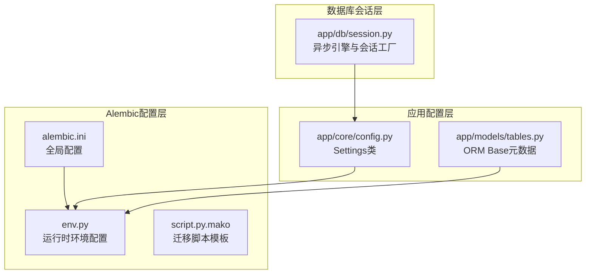
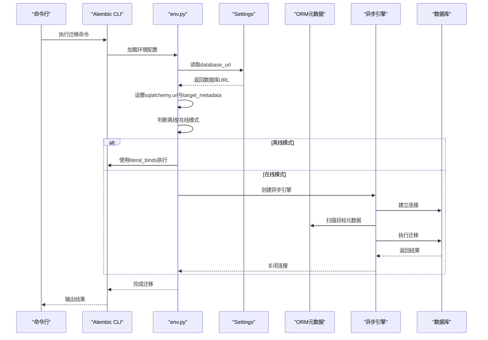
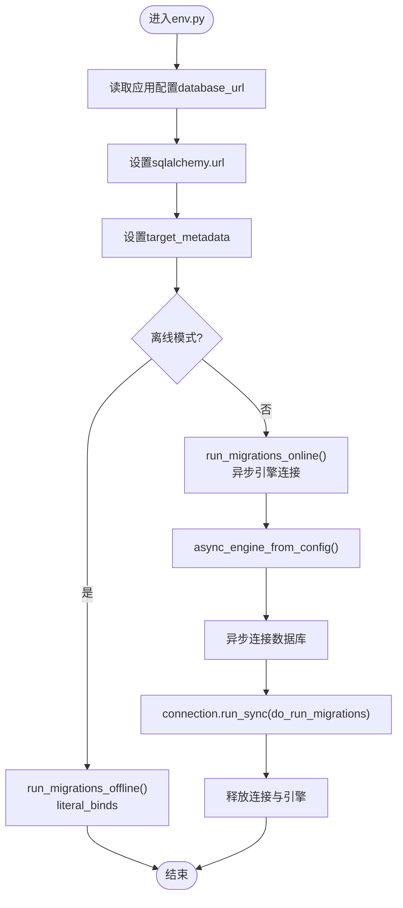
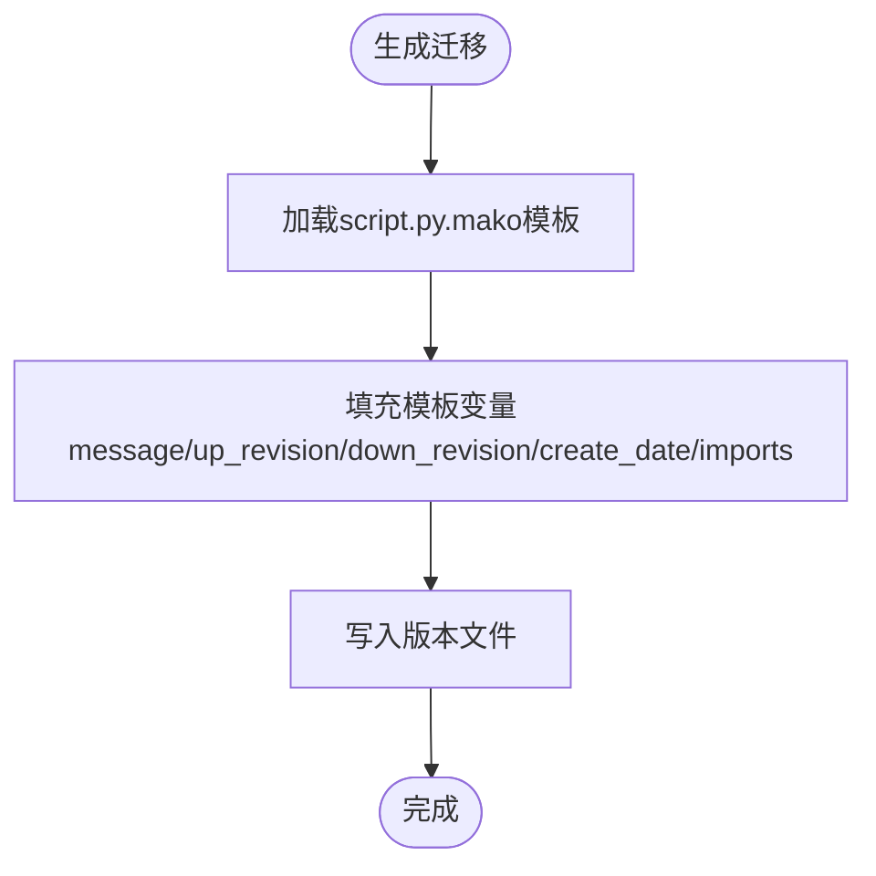
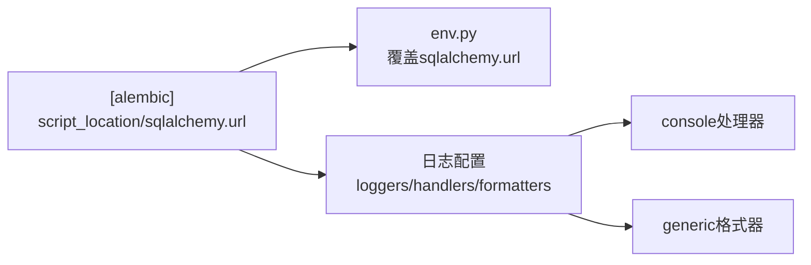
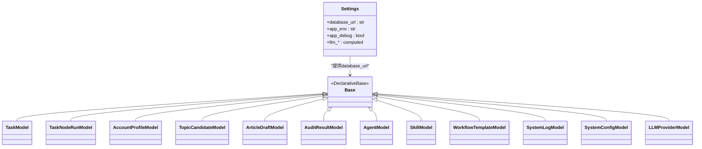
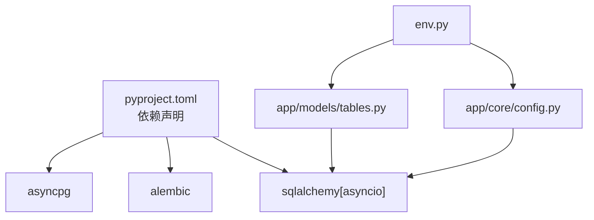

# Alembic配置管理

<cite>
**本文档引用的文件**
- [env.py](file://backend/alembic/env.py)
- [script.py.mako](file://backend/alembic/script.py.mako)
- [alembic.ini](file://backend/alembic.ini)
- [session.py](file://backend/app/db/session.py)
- [tables.py](file://backend/app/models/tables.py)
- [config.py](file://backend/app/core/config.py)
- [pyproject.toml](file://backend/pyproject.toml)
</cite>

## 目录
1. [简介](#简介)
2. [项目结构](#项目结构)
3. [核心组件](#核心组件)
4. [架构总览](#架构总览)
5. [详细组件分析](#详细组件分析)
6. [依赖关系分析](#依赖关系分析)
7. [性能考虑](#性能考虑)
8. [故障排除指南](#故障排除指南)
9. [结论](#结论)

## 简介
本文件面向HotClaw项目的数据库迁移配置管理，深入解析Alembic在异步SQLAlchemy环境下的配置与使用方式。内容涵盖：
- env.py环境配置文件的实现原理，包括异步引擎配置、数据库连接管理、元数据设置
- script.py.mako模板文件的作用与自定义选项，包括迁移脚本生成规则与模板变量
- alembic.ini配置文件的各项参数设置，包括数据库URL、目标元数据、版本表等
- 开发与生产环境的配置策略与最佳实践
- 常见配置问题的排查方法与性能优化建议

## 项目结构
HotClaw后端采用标准的Alembic目录组织，关键文件位于`backend/alembic/`目录下，并通过应用配置加载器统一管理数据库连接字符串。

图表来源
- [alembic.ini:1-39](file://backend/alembic.ini#L1-L39)
- [env.py:1-53](file://backend/alembic/env.py#L1-L53)
- [script.py.mako:1-25](file://backend/alembic/script.py.mako#L1-L25)
- [config.py:52-99](file://backend/app/core/config.py#L52-L99)
- [tables.py:18-21](file://backend/app/models/tables.py#L18-L21)
- [session.py:1-50](file://backend/app/db/session.py#L1-L50)

章节来源
- [alembic.ini:1-39](file://backend/alembic.ini#L1-L39)
- [env.py:1-53](file://backend/alembic/env.py#L1-L53)
- [script.py.mako:1-25](file://backend/alembic/script.py.mako#L1-L25)
- [config.py:52-99](file://backend/app/core/config.py#L52-L99)
- [tables.py:18-21](file://backend/app/models/tables.py#L18-L21)
- [session.py:1-50](file://backend/app/db/session.py#L1-L50)

## 核心组件
- 异步环境配置：env.py负责在运行时从应用配置中读取数据库URL并设置Alembic的target_metadata，支持离线与在线两种迁移模式。
- 迁移脚本模板：script.py.mako提供标准化的迁移脚本骨架，包含版本控制字段与升级/降级函数占位符。
- 全局配置：alembic.ini定义脚本位置、日志级别与数据库URL等基础参数。
- 应用配置：config.py提供Settings类，集中管理数据库URL、调试开关、环境变量等。
- ORM元数据：tables.py中的Base类及其子类构成Alembic扫描的目标元数据。
- 异步会话：session.py展示应用侧如何使用异步引擎，为理解env.py的异步连接提供对照。

章节来源
- [env.py:1-53](file://backend/alembic/env.py#L1-L53)
- [script.py.mako:1-25](file://backend/alembic/script.py.mako#L1-L25)
- [alembic.ini:1-39](file://backend/alembic.ini#L1-L39)
- [config.py:52-99](file://backend/app/core/config.py#L52-L99)
- [tables.py:18-21](file://backend/app/models/tables.py#L18-L21)
- [session.py:1-50](file://backend/app/db/session.py#L1-L50)

## 架构总览
下图展示了Alembic在HotClaw中的整体工作流：应用配置驱动数据库URL，env.py将其注入Alembic上下文，随后根据模式选择离线或在线迁移路径。

图表来源
- [env.py:13-18](file://backend/alembic/env.py#L13-L18)
- [env.py:21-52](file://backend/alembic/env.py#L21-L52)
- [config.py:54-57](file://backend/app/core/config.py#L54-L57)
- [tables.py:18-21](file://backend/app/models/tables.py#L18-L21)

## 详细组件分析

### env.py：异步环境配置
- 数据库URL注入：通过读取应用配置的database_url，设置到Alembic主配置项，确保迁移与应用使用一致的连接字符串。
- 目标元数据：将ORM Base.metadata赋给target_metadata，使Alembic能够扫描所有模型并生成迁移。
- 离线迁移：在离线模式下，使用literal_binds直接将SQL绑定到迁移脚本，适合无数据库访问的CI场景。
- 在线迁移：在在线模式下，使用异步引擎创建连接，通过run_sync回调执行迁移逻辑，适合本地开发与生产环境。
- 异步引擎：通过async_engine_from_config创建异步连接，使用NullPool避免连接池干扰迁移过程。

图表来源
- [env.py:13-18](file://backend/alembic/env.py#L13-L18)
- [env.py:21-52](file://backend/alembic/env.py#L21-L52)
- [env.py:34-42](file://backend/alembic/env.py#L34-L42)

章节来源
- [env.py:1-53](file://backend/alembic/env.py#L1-L53)
- [config.py:54-57](file://backend/app/core/config.py#L54-L57)
- [tables.py:18-21](file://backend/app/models/tables.py#L18-L21)

### script.py.mako：迁移脚本模板
- 模板作用：作为迁移脚本的生成模板，提供标准化的头部注释、版本字段与升级/降级函数框架。
- 模板变量：
  - message：迁移脚本的描述信息
  - up_revision/down_revision：版本依赖关系
  - create_date：创建时间
  - imports：可选导入语句
  - upgrades/downgrades：实际迁移逻辑占位符
  - revision、branch_labels、depends_on：版本标识与分支标签
- 使用方式：Alembic在生成新迁移时，会基于此模板填充变量并写入版本目录。

图表来源
- [script.py.mako:1-25](file://backend/alembic/script.py.mako#L1-L25)

章节来源
- [script.py.mako:1-25](file://backend/alembic/script.py.mako#L1-L25)

### alembic.ini：全局配置
- 脚本位置：script_location指向alembic目录，决定迁移脚本与版本文件的存放位置。
- 数据库URL：sqlalchemy.url提供默认的数据库连接字符串，通常会被env.py覆盖。
- 日志配置：定义了root、sqlalchemy、alembic三类日志器及控制台处理器，便于调试与审计。
- 格式化：generic格式器用于统一输出日志格式与时间戳。

图表来源
- [alembic.ini:3-5](file://backend/alembic.ini#L3-L5)
- [alembic.ini:7-39](file://backend/alembic.ini#L7-L39)
- [env.py](file://backend/alembic/env.py#L13)

章节来源
- [alembic.ini:1-39](file://backend/alembic.ini#L1-L39)
- [env.py](file://backend/alembic/env.py#L13)

### 应用配置与ORM元数据
- 配置来源：Settings类从环境变量与.env文件加载，提供database_url等关键配置。
- ORM基类：Base类作为所有模型的父类，target_metadata即其metadata，供Alembic扫描。
- 异步会话：应用侧使用异步引擎与会话工厂，与env.py的异步迁移保持一致的连接策略。

图表来源
- [config.py:52-99](file://backend/app/core/config.py#L52-L99)
- [tables.py:18-319](file://backend/app/models/tables.py#L18-L319)

章节来源
- [config.py:52-99](file://backend/app/core/config.py#L52-L99)
- [tables.py:18-319](file://backend/app/models/tables.py#L18-L319)
- [session.py:1-50](file://backend/app/db/session.py#L1-L50)

## 依赖关系分析
- 外部依赖：项目使用sqlalchemy[asyncio]与alembic，确保异步迁移能力；asyncpg用于PostgreSQL连接。
- 内部依赖：env.py依赖应用配置与ORM元数据；ORM元数据由tables.py定义；应用会话与env.py共享相同的异步连接策略。

图表来源
- [pyproject.toml:9-11](file://backend/pyproject.toml#L9-L11)
- [env.py:9-10](file://backend/alembic/env.py#L9-L10)
- [config.py:54-57](file://backend/app/core/config.py#L54-L57)
- [tables.py:18-21](file://backend/app/models/tables.py#L18-L21)

章节来源
- [pyproject.toml:1-41](file://backend/pyproject.toml#L1-L41)
- [env.py:9-10](file://backend/alembic/env.py#L9-L10)
- [config.py:54-57](file://backend/app/core/config.py#L54-L57)
- [tables.py:18-21](file://backend/app/models/tables.py#L18-L21)

## 性能考虑
- 连接池策略：env.py使用NullPool避免迁移过程中的连接池竞争；应用侧SQLite不启用pool_pre_ping，其他数据库启用以提升连接稳定性。
- 异步优势：在线迁移使用异步引擎，减少阻塞，提高迁移效率。
- 日志级别：生产环境建议降低sqlalchemy与root日志级别，仅保留alembic为INFO，平衡可观测性与性能。
- 版本扫描：确保ORM元数据完整且无循环依赖，避免扫描开销过大。

## 故障排除指南
- 数据库URL不匹配
  - 现象：迁移失败或连接异常
  - 排查：确认env.py已正确设置sqlalchemy.url；检查Settings.database_url来源（环境变量或.env）
  - 参考
    - [env.py](file://backend/alembic/env.py#L13)
    - [config.py:54-57](file://backend/app/core/config.py#L54-L57)
- 离线模式无法执行
  - 现象：离线迁移报错或SQL绑定失败
  - 排查：确认使用literal_binds的离线模式适用于当前数据库方言；必要时切换到在线模式
  - 参考
    - [env.py:21-25](file://backend/alembic/env.py#L21-L25)
- 在线模式连接失败
  - 现象：异步引擎无法建立连接
  - 排查：检查数据库可达性、凭据与网络；确认asyncpg安装正确；验证数据库URL格式
  - 参考
    - [env.py:34-42](file://backend/alembic/env.py#L34-L42)
    - [pyproject.toml](file://backend/pyproject.toml#L10)
- 元数据未被扫描
  - 现象：迁移生成空脚本或缺少表变更
  - 排查：确保ORM模型均继承Base；检查target_metadata设置；确认所有模型已在导入路径中
  - 参考
    - [env.py](file://backend/alembic/env.py#L18)
    - [tables.py:18-21](file://backend/app/models/tables.py#L18-L21)
- 日志过多影响性能
  - 现象：日志输出过大
  - 排查：调整alembic.ini中的日志级别，生产环境建议降低至INFO
  - 参考
    - [alembic.ini:16-28](file://backend/alembic.ini#L16-L28)

## 结论
HotClaw项目的Alembic配置通过env.py将应用配置与迁移流程解耦，结合script.py.mako与alembic.ini实现了标准化的迁移管理。遵循本文档的配置策略与最佳实践，可在开发与生产环境中稳定地进行数据库演进，同时兼顾性能与可维护性。