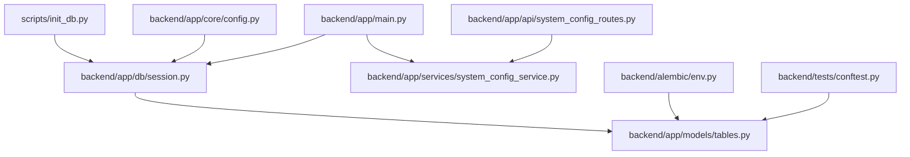
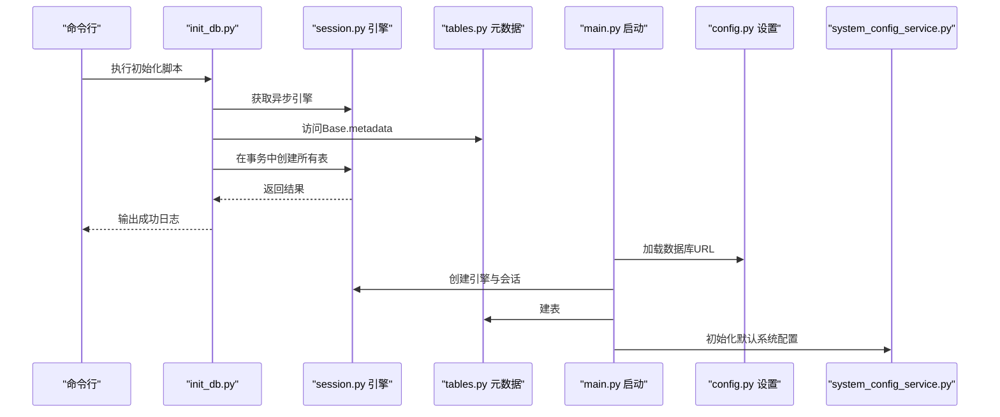
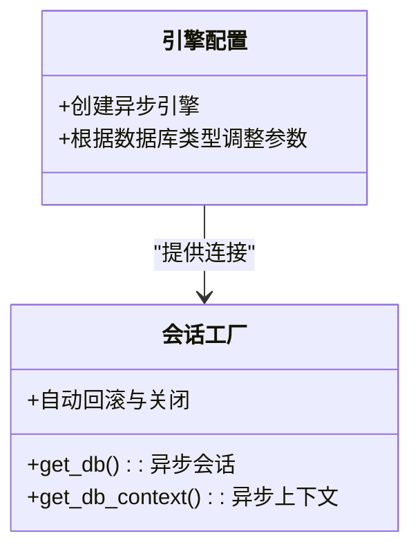
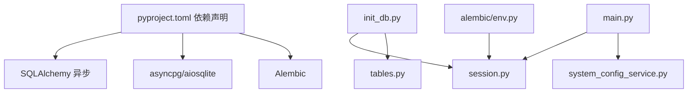

# 数据库初始化

<cite>
**本文引用的文件**
- [scripts/init_db.py](file://scripts/init_db.py)
- [backend/app/db/session.py](file://backend/app/db/session.py)
- [backend/app/models/tables.py](file://backend/app/models/tables.py)
- [backend/app/core/config.py](file://backend/app/core/config.py)
- [backend/app/main.py](file://backend/app/main.py)
- [backend/alembic/env.py](file://backend/alembic/env.py)
- [backend/alembic.ini](file://backend/alembic.ini)
- [backend/pyproject.toml](file://backend/pyproject.toml)
- [backend/tests/conftest.py](file://backend/tests/conftest.py)
- [backend/app/services/system_config_service.py](file://backend/app/services/system_config_service.py)
- [backend/app/api/system_config_routes.py](file://backend/app/api/system_config_routes.py)
- [backend/app/core/exceptions.py](file://backend/app/core/exceptions.py)
</cite>

## 目录
1. [简介](#简介)
2. [项目结构](#项目结构)
3. [核心组件](#核心组件)
4. [架构总览](#架构总览)
5. [详细组件分析](#详细组件分析)
6. [依赖分析](#依赖分析)
7. [性能考量](#性能考量)
8. [故障排查指南](#故障排查指南)
9. [结论](#结论)
10. [附录](#附录)

## 简介
本指南面向HotClaw项目的数据库初始化流程，围绕脚本化初始化、会话管理与连接池、事务与生命周期、以及初始化后的验证与默认配置注入进行系统性说明。文档同时覆盖开发、测试与生产环境的差异与安全注意事项，并提供可操作的步骤与排障建议。

## 项目结构
与数据库初始化直接相关的代码分布在以下位置：
- 初始化脚本：scripts/init_db.py
- 异步数据库会话与引擎：backend/app/db/session.py
- ORM模型定义：backend/app/models/tables.py
- 应用配置加载：backend/app/core/config.py
- 应用启动时的自动建表与默认配置注入：backend/app/main.py
- Alembic迁移环境：backend/alembic/env.py、backend/alembic.ini
- 测试环境的内存数据库与初始化：backend/tests/conftest.py
- 系统配置服务与默认配置：backend/app/services/system_config_service.py、backend/app/api/system_config_routes.py
- 依赖声明：backend/pyproject.toml
- 统一异常体系：backend/app/core/exceptions.py

图表来源
- [scripts/init_db.py:1-16](file://scripts/init_db.py#L1-L16)
- [backend/app/db/session.py:1-50](file://backend/app/db/session.py#L1-L50)
- [backend/app/models/tables.py:1-319](file://backend/app/models/tables.py#L1-L319)
- [backend/app/core/config.py:1-99](file://backend/app/core/config.py#L1-L99)
- [backend/app/main.py:1-153](file://backend/app/main.py#L1-L153)
- [backend/alembic/env.py:1-53](file://backend/alembic/env.py#L1-L53)
- [backend/tests/conftest.py:1-48](file://backend/tests/conftest.py#L1-L48)
- [backend/app/services/system_config_service.py:1-222](file://backend/app/services/system_config_service.py#L1-L222)
- [backend/app/api/system_config_routes.py:1-158](file://backend/app/api/system_config_routes.py#L1-L158)

章节来源
- [scripts/init_db.py:1-16](file://scripts/init_db.py#L1-L16)
- [backend/app/db/session.py:1-50](file://backend/app/db/session.py#L1-L50)
- [backend/app/models/tables.py:1-319](file://backend/app/models/tables.py#L1-L319)
- [backend/app/core/config.py:1-99](file://backend/app/core/config.py#L1-L99)
- [backend/app/main.py:1-153](file://backend/app/main.py#L1-L153)
- [backend/alembic/env.py:1-53](file://backend/alembic/env.py#L1-L53)
- [backend/tests/conftest.py:1-48](file://backend/tests/conftest.py#L1-L48)
- [backend/app/services/system_config_service.py:1-222](file://backend/app/services/system_config_service.py#L1-L222)
- [backend/app/api/system_config_routes.py:1-158](file://backend/app/api/system_config_routes.py#L1-L158)

## 核心组件
- 初始化脚本：scripts/init_db.py
  - 功能：通过异步上下文创建所有ORM表结构；使用应用内共享的异步引擎与元数据。
  - 关键点：使用异步上下文管理器确保连接在事务中执行；完成后打印成功提示。
- 数据库会话与引擎：backend/app/db/session.py
  - 功能：创建异步SQLAlchemy引擎与异步会话工厂；提供FastAPI依赖与上下文管理器版本；自动回滚与关闭会话。
  - 关键点：SQLite与PostgreSQL在连接参数上差异化处理；支持连接预检测（非SQLite）。
- ORM模型：backend/app/models/tables.py
  - 功能：定义所有业务表的ORM模型，作为元数据驱动建表的基础。
- 配置加载：backend/app/core/config.py
  - 功能：从环境变量与.env文件加载配置；提供数据库URL等关键设置。
- 应用启动流程：backend/app/main.py
  - 功能：应用生命周期内自动建表；初始化默认系统配置。
- Alembic迁移：backend/alembic/env.py、backend/alembic.ini
  - 功能：异步迁移环境配置；读取数据库URL；在线/离线迁移执行。
- 测试环境：backend/tests/conftest.py
  - 功能：使用内存SQLite进行测试；在测试夹具中创建与销毁表。
- 系统配置服务：backend/app/services/system_config_service.py、backend/app/api/system_config_routes.py
  - 功能：提供默认配置初始化与查询接口；支持敏感字段脱敏输出。

章节来源
- [scripts/init_db.py:1-16](file://scripts/init_db.py#L1-L16)
- [backend/app/db/session.py:1-50](file://backend/app/db/session.py#L1-L50)
- [backend/app/models/tables.py:1-319](file://backend/app/models/tables.py#L1-L319)
- [backend/app/core/config.py:1-99](file://backend/app/core/config.py#L1-L99)
- [backend/app/main.py:1-153](file://backend/app/main.py#L1-L153)
- [backend/alembic/env.py:1-53](file://backend/alembic/env.py#L1-L53)
- [backend/alembic.ini:1-39](file://backend/alembic.ini#L1-L39)
- [backend/tests/conftest.py:1-48](file://backend/tests/conftest.py#L1-L48)
- [backend/app/services/system_config_service.py:1-222](file://backend/app/services/system_config_service.py#L1-L222)
- [backend/app/api/system_config_routes.py:1-158](file://backend/app/api/system_config_routes.py#L1-L158)

## 架构总览
下图展示数据库初始化在应用中的整体调用链与组件交互：

图表来源
- [scripts/init_db.py:8-16](file://scripts/init_db.py#L8-L16)
- [backend/app/db/session.py:9-20](file://backend/app/db/session.py#L9-L20)
- [backend/app/models/tables.py:18-20](file://backend/app/models/tables.py#L18-L20)
- [backend/app/main.py:50-62](file://backend/app/main.py#L50-L62)
- [backend/app/core/config.py:52-98](file://backend/app/core/config.py#L52-L98)
- [backend/app/services/system_config_service.py:212-222](file://backend/app/services/system_config_service.py#L212-L222)

## 详细组件分析

### 初始化脚本 init_db.py
- 功能概述
  - 使用异步上下文打开数据库连接，在单个事务中创建所有表。
  - 通过共享的引擎与ORM元数据驱动建表。
- 执行步骤
  1) 导入异步引擎与ORM基类
  2) 在异步上下文中开启事务
  3) 调用元数据创建所有表
  4) 打印成功信息
- 错误处理
  - 该脚本未显式捕获异常；若连接失败或权限不足，异常将向上抛出，需由调用方处理。

图表来源
- [scripts/init_db.py:8-16](file://scripts/init_db.py#L8-L16)
- [backend/app/db/session.py:9-20](file://backend/app/db/session.py#L9-L20)
- [backend/app/models/tables.py:18-20](file://backend/app/models/tables.py#L18-L20)

章节来源
- [scripts/init_db.py:1-16](file://scripts/init_db.py#L1-L16)

### 数据库会话与连接池 session.py
- 引擎配置
  - 基于配置模块提供的数据库URL创建异步引擎。
  - SQLite不启用连接预检测；其他数据库启用预检测以保持连接活性。
- 会话工厂
  - 提供FastAPI依赖与上下文管理器两种方式获取会话。
  - 自动回滚与关闭，确保资源释放。
- 生命周期
  - 会话在try-except块中使用，异常时回滚并重新抛出；finally中关闭会话。

图表来源
- [backend/app/db/session.py:9-20](file://backend/app/db/session.py#L9-L20)
- [backend/app/db/session.py:23-49](file://backend/app/db/session.py#L23-L49)
- [backend/app/core/config.py:52-57](file://backend/app/core/config.py#L52-L57)

章节来源
- [backend/app/db/session.py:1-50](file://backend/app/db/session.py#L1-L50)
- [backend/app/core/config.py:1-99](file://backend/app/core/config.py#L1-L99)

### ORM模型 tables.py
- 模型职责
  - 定义所有业务表的ORM模型，作为元数据驱动建表的基础。
- 关系与索引
  - 模型间通过外键与反向关系关联；部分字段带有索引以提升查询效率。
- 复杂度与扩展性
  - 表数量较多且关系复杂，新增表需同步更新元数据以参与建表流程。

章节来源
- [backend/app/models/tables.py:1-319](file://backend/app/models/tables.py#L1-L319)

### 应用启动流程 main.py
- 自动建表
  - 应用启动时在生命周期钩子中自动创建所有表，确保服务启动即可用。
- 默认配置初始化
  - 启动时调用系统配置服务初始化默认配置，避免首次访问缺失配置。

章节来源
- [backend/app/main.py:44-66](file://backend/app/main.py#L44-L66)

### Alembic迁移 env.py 与配置 alembic.ini
- 异步迁移
  - 通过异步引擎执行迁移；支持离线与在线两种模式。
- 配置来源
  - 从配置模块读取数据库URL，确保迁移与应用使用一致的数据源。

章节来源
- [backend/alembic/env.py:1-53](file://backend/alembic/env.py#L1-L53)
- [backend/alembic.ini:1-39](file://backend/alembic.ini#L1-L39)
- [backend/app/core/config.py:52-57](file://backend/app/core/config.py#L52-L57)

### 测试环境 conftest.py
- 内存数据库
  - 使用内存SQLite进行测试，避免对持久化数据库造成影响。
- 初始化与清理
  - 在测试夹具中创建表并在结束后销毁，保证测试隔离。

章节来源
- [backend/tests/conftest.py:13-31](file://backend/tests/conftest.py#L13-L31)

### 系统配置服务与默认配置 system_config_service.py 与 system_config_routes.py
- 默认配置
  - 定义一组系统级默认配置项（如数据库URL、Redis URL、应用环境等），用于首次初始化。
- 初始化逻辑
  - 若某配置不存在则创建，否则跳过；提交事务后完成初始化。
- 接口能力
  - 提供查询、按类别过滤、字典形式输出（敏感值脱敏）等能力。

章节来源
- [backend/app/services/system_config_service.py:9-222](file://backend/app/services/system_config_service.py#L9-L222)
- [backend/app/api/system_config_routes.py:152-158](file://backend/app/api/system_config_routes.py#L152-L158)

## 依赖分析
- 外部依赖
  - 异步SQLAlchemy、asyncpg、aiosqlite、alembic等，详见项目依赖声明。
- 内部耦合
  - 初始化脚本依赖会话模块与模型元数据；应用启动流程同样依赖会话与配置模块；系统配置服务依赖ORM模型与会话。

图表来源
- [backend/pyproject.toml:1-41](file://backend/pyproject.toml#L1-L41)
- [scripts/init_db.py:3-6](file://scripts/init_db.py#L3-L6)
- [backend/app/db/session.py:3-5](file://backend/app/db/session.py#L3-L5)
- [backend/app/models/tables.py:15](file://backend/app/models/tables.py#L15)
- [backend/app/main.py:50-62](file://backend/app/main.py#L50-L62)
- [backend/app/services/system_config_service.py:1-7](file://backend/app/services/system_config_service.py#L1-L7)
- [backend/alembic/env.py:3-10](file://backend/alembic/env.py#L3-L10)

章节来源
- [backend/pyproject.toml:1-41](file://backend/pyproject.toml#L1-L41)
- [scripts/init_db.py:3-6](file://scripts/init_db.py#L3-L6)
- [backend/app/db/session.py:3-5](file://backend/app/db/session.py#L3-L5)
- [backend/app/models/tables.py:15](file://backend/app/models/tables.py#L15)
- [backend/app/main.py:50-62](file://backend/app/main.py#L50-L62)
- [backend/app/services/system_config_service.py:1-7](file://backend/app/services/system_config_service.py#L1-L7)
- [backend/alembic/env.py:3-10](file://backend/alembic/env.py#L3-L10)

## 性能考量
- 连接池与预检测
  - 非SQLite数据库启用连接预检测，有助于维持活跃连接，减少因连接失效导致的重试开销。
- 事务粒度
  - 初始化脚本与应用启动均在单个事务中创建所有表，减少多次往返与锁竞争。
- 异步I/O
  - 使用异步引擎与会话，降低阻塞风险，提升并发场景下的吞吐量。
- 建议
  - 生产环境优先使用PostgreSQL并合理配置连接池大小与超时参数；避免在高并发下一次性创建大量表。

## 故障排查指南
- 连接失败
  - 现象：初始化脚本报错或应用启动失败。
  - 排查：检查数据库URL与凭据；确认网络连通性；核对数据库服务状态。
  - 参考来源
    - [backend/app/core/config.py:52-57](file://backend/app/core/config.py#L52-L57)
    - [backend/app/db/session.py:9-14](file://backend/app/db/session.py#L9-L14)
- 权限不足
  - 现象：建表失败或无法写入系统配置。
  - 排查：确认数据库用户具备DDL与DML权限；检查系统配置表的写入权限。
  - 参考来源
    - [backend/app/services/system_config_service.py:212-222](file://backend/app/services/system_config_service.py#L212-L222)
    - [backend/app/api/system_config_routes.py:102-104](file://backend/app/api/system_config_routes.py#L102-L104)
- 数据冲突
  - 现象：重复初始化或系统配置键冲突。
  - 排查：默认配置初始化为幂等操作；若出现冲突，检查是否存在手动插入的同名键。
  - 参考来源
    - [backend/app/services/system_config_service.py:216-222](file://backend/app/services/system_config_service.py#L216-L222)
- 异常映射与日志
  - 应用全局异常处理器将业务异常映射为合适的HTTP状态码，便于定位问题。
  - 参考来源
    - [backend/app/main.py:96-138](file://backend/app/main.py#L96-L138)
    - [backend/app/core/exceptions.py:1-125](file://backend/app/core/exceptions.py#L1-L125)

## 结论
HotClaw的数据库初始化采用“脚本化建表 + 应用启动自动建表 + 默认配置注入”的组合策略，结合异步引擎与会话管理，确保在开发、测试与生产环境中均可稳定运行。通过明确的错误处理与日志映射，能够快速定位并解决初始化过程中的常见问题。

## 附录

### 初始化流程（从准备到验证）
- 开发环境
  - 准备：确保Python环境满足要求，安装项目依赖。
  - 执行：运行初始化脚本创建表结构。
  - 验证：检查控制台输出与数据库中表的存在情况。
- 测试环境
  - 使用内存SQLite进行初始化与清理，确保测试隔离。
- 生产环境
  - 使用PostgreSQL并配置连接池与预检测；通过应用启动自动建表与默认配置初始化。
- 验证步骤
  - 查询系统配置表确认默认配置已就绪。
  - 尝试访问健康检查端点确认服务正常。

章节来源
- [scripts/init_db.py:14-16](file://scripts/init_db.py#L14-L16)
- [backend/tests/conftest.py:20-31](file://backend/tests/conftest.py#L20-L31)
- [backend/app/main.py:50-62](file://backend/app/main.py#L50-L62)
- [backend/app/api/system_config_routes.py:61-66](file://backend/app/api/system_config_routes.py#L61-L66)