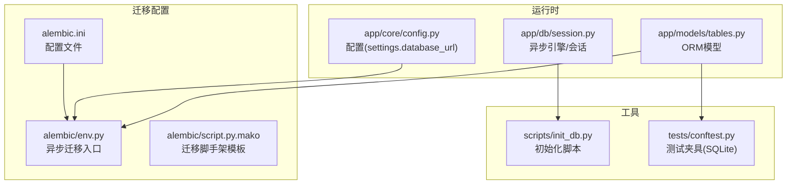
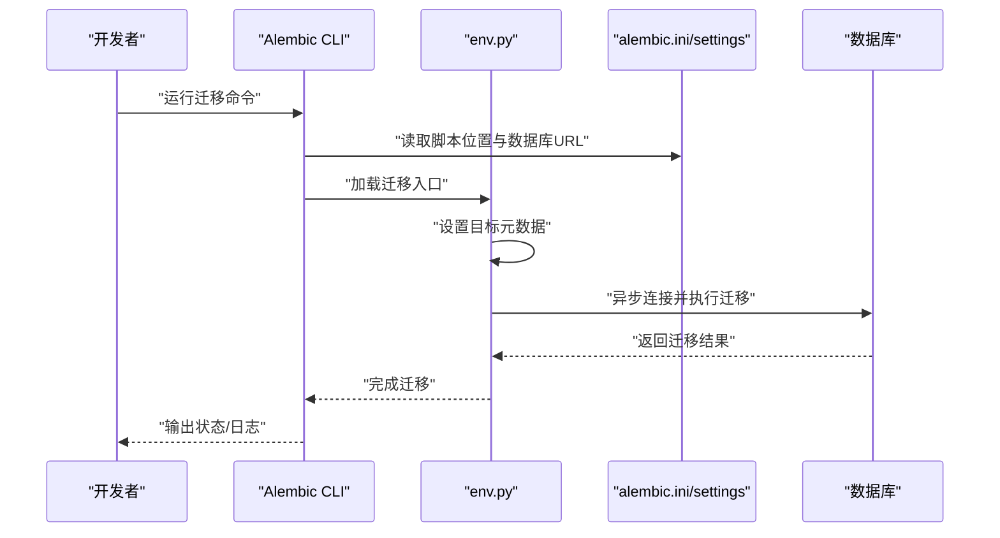
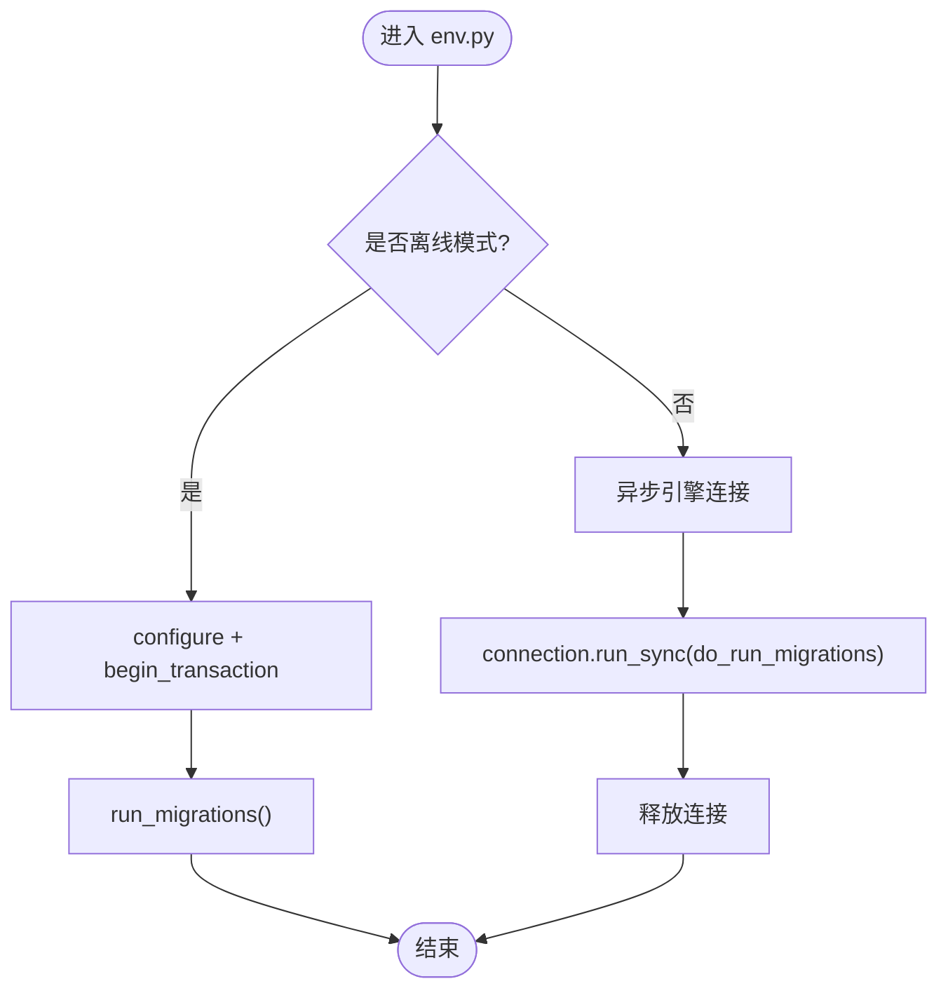
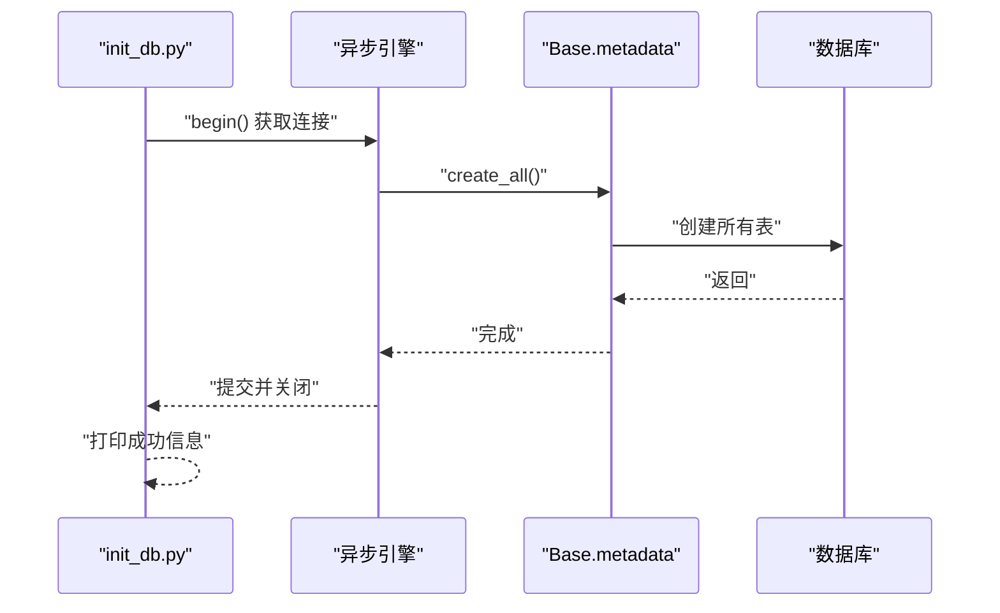
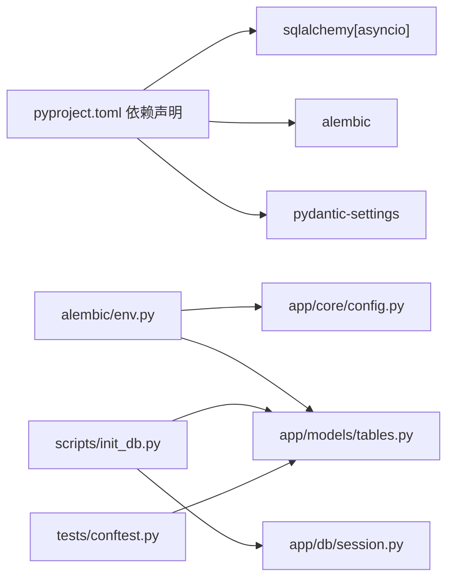

# 数据迁移管理

<cite>
**本文引用的文件**
- [backend/alembic/env.py](file://backend/alembic/env.py)
- [backend/alembic/script.py.mako](file://backend/alembic/script.py.mako)
- [backend/alembic.ini](file://backend/alembic.ini)
- [scripts/init_db.py](file://scripts/init_db.py)
- [backend/app/db/session.py](file://backend/app/db/session.py)
- [backend/app/models/tables.py](file://backend/app/models/tables.py)
- [backend/app/core/config.py](file://backend/app/core/config.py)
- [backend/pyproject.toml](file://backend/pyproject.toml)
- [backend/tests/conftest.py](file://backend/tests/conftest.py)
</cite>

## 目录
1. [简介](#简介)
2. [项目结构](#项目结构)
3. [核心组件](#核心组件)
4. [架构总览](#架构总览)
5. [详细组件分析](#详细组件分析)
6. [依赖分析](#依赖分析)
7. [性能考虑](#性能考虑)
8. [故障排查指南](#故障排查指南)
9. [结论](#结论)
10. [附录](#附录)

## 简介
本文件面向HotClaw项目的“数据迁移管理”，围绕Alembic迁移框架在异步SQLAlchemy环境下的配置与使用进行系统化说明。内容涵盖：
- Alembic环境配置与脚手架模板
- 迁移脚本编写规范与数据类型转换、约束修改要点
- 数据库初始化流程与执行步骤
- 迁移命令操作指南（创建、应用、回滚、状态检查）
- 版本管理策略（分支合并、冲突解决、向后兼容）
- 迁移测试最佳实践与常见问题
- 生产环境迁移安全策略与备份恢复方案

## 项目结构
HotClaw后端采用异步SQLAlchemy与Alembic进行数据库版本治理。迁移相关的核心位置如下：
- 迁移配置与入口：backend/alembic
- 运行时数据库会话与引擎：backend/app/db/session.py
- ORM模型定义：backend/app/models/tables.py
- 应用配置（含数据库URL）：backend/app/core/config.py
- 初始化脚本：scripts/init_db.py
- 测试夹具中使用SQLite进行迁移测试验证：backend/tests/conftest.py

图表来源
- [backend/alembic/env.py:1-53](file://backend/alembic/env.py#L1-L53)
- [backend/alembic/script.py.mako:1-25](file://backend/alembic/script.py.mako#L1-L25)
- [backend/alembic.ini:1-39](file://backend/alembic.ini#L1-L39)
- [backend/app/db/session.py:1-50](file://backend/app/db/session.py#L1-L50)
- [backend/app/models/tables.py:1-319](file://backend/app/models/tables.py#L1-L319)
- [backend/app/core/config.py:1-99](file://backend/app/core/config.py#L1-L99)
- [scripts/init_db.py:1-16](file://scripts/init_db.py#L1-L16)
- [backend/tests/conftest.py:1-48](file://backend/tests/conftest.py#L1-L48)

章节来源
- [backend/alembic/env.py:1-53](file://backend/alembic/env.py#L1-L53)
- [backend/alembic/script.py.mako:1-25](file://backend/alembic/script.py.mako#L1-L25)
- [backend/alembic.ini:1-39](file://backend/alembic.ini#L1-L39)
- [backend/app/db/session.py:1-50](file://backend/app/db/session.py#L1-L50)
- [backend/app/models/tables.py:1-319](file://backend/app/models/tables.py#L1-L319)
- [backend/app/core/config.py:1-99](file://backend/app/core/config.py#L1-L99)
- [scripts/init_db.py:1-16](file://scripts/init_db.py#L1-L16)
- [backend/tests/conftest.py:1-48](file://backend/tests/conftest.py#L1-L48)

## 核心组件
- Alembic环境配置（env.py）
  - 支持离线与在线两种模式，异步连接数据库，注入目标元数据（ORM模型集合），通过上下文驱动迁移执行。
- 脚手架模板（script.py.mako）
  - 提供迁移脚本骨架，自动生成升级/降级函数与版本元信息，便于规范化编写。
- 配置文件（alembic.ini）
  - 指定脚本位置、数据库URL以及日志级别，确保迁移工具与应用配置一致。
- 初始化脚本（init_db.py）
  - 使用异步引擎直接创建所有表，适合首次部署或快速初始化。
- 引擎与会话（session.py）
  - 定义异步引擎与会话工厂，支持调试输出与连接池预检（非SQLite场景）。
- ORM模型（tables.py）
  - 所有业务表的ORM定义，作为迁移的目标元数据。
- 应用配置（config.py）
  - 统一读取环境变量并生成settings.database_url，供Alembic与应用共享。

章节来源
- [backend/alembic/env.py:1-53](file://backend/alembic/env.py#L1-L53)
- [backend/alembic/script.py.mako:1-25](file://backend/alembic/script.py.mako#L1-L25)
- [backend/alembic.ini:1-39](file://backend/alembic.ini#L1-L39)
- [scripts/init_db.py:1-16](file://scripts/init_db.py#L1-L16)
- [backend/app/db/session.py:1-50](file://backend/app/db/session.py#L1-L50)
- [backend/app/models/tables.py:1-319](file://backend/app/models/tables.py#L1-L319)
- [backend/app/core/config.py:1-99](file://backend/app/core/config.py#L1-L99)

## 架构总览
下图展示从应用配置到迁移执行的关键路径，以及初始化脚本与测试夹具的参与方式。

图表来源
- [backend/alembic/env.py:1-53](file://backend/alembic/env.py#L1-L53)
- [backend/alembic.ini:1-39](file://backend/alembic.ini#L1-L39)
- [backend/app/core/config.py:52-99](file://backend/app/core/config.py#L52-L99)

## 详细组件分析

### Alembic环境配置（env.py）
- 关键职责
  - 将应用配置中的数据库URL注入到Alembic配置中，确保迁移与应用使用同一数据源。
  - 声明目标元数据为ORM模型集合，使迁移能够识别新增/变更的表结构。
  - 支持离线与在线两种模式：离线以字面量绑定生成SQL；在线通过异步引擎连接数据库执行。
- 异步迁移流程
  - 在线模式通过异步引擎创建连接，传入上下文后执行迁移，最后释放连接资源。
- 适用场景
  - 开发环境与生产环境均可使用，推荐在生产环境使用在线模式以确保一致性。

图表来源
- [backend/alembic/env.py:21-52](file://backend/alembic/env.py#L21-L52)

章节来源
- [backend/alembic/env.py:1-53](file://backend/alembic/env.py#L1-L53)

### 脚手架模板（script.py.mako）
- 作用
  - 自动生成迁移脚本骨架，包含版本号、上/下游版本、分支标签与依赖项声明。
  - 为upgrade()/downgrade()提供占位符，便于按规范编写升级与降级逻辑。
- 编写规范
  - 升级：添加列、索引、外键约束、枚举类型等；尽量避免破坏性变更。
  - 降级：逆向撤销升级所做的变更；保持幂等性与可重复执行。
  - 数据类型转换：优先使用向后兼容的类型；必要时分步迁移并保留回退路径。
  - 约束修改：先处理非空/唯一等约束，再考虑外键；对大表变更需评估锁与性能影响。

章节来源
- [backend/alembic/script.py.mako:1-25](file://backend/alembic/script.py.mako#L1-L25)

### 配置文件（alembic.ini）
- 关键点
  - 指定脚本位置与数据库URL，确保Alembic与应用在同一数据源上工作。
  - 日志配置可按需调整，便于定位迁移过程中的问题。
- 注意事项
  - 生产环境建议将数据库URL置于安全配置中，避免硬编码。

章节来源
- [backend/alembic.ini:1-39](file://backend/alembic.ini#L1-L39)

### 初始化脚本（init_db.py）
- 功能
  - 使用异步引擎直接创建所有表，适合首次部署或快速初始化。
- 执行步骤
  - 创建异步连接上下文
  - 调用元数据创建所有表
  - 输出成功提示
- 适用场景
  - 开发环境快速建库
  - 新环境首次部署
  - 与测试夹具配合进行迁移验证

图表来源
- [scripts/init_db.py:8-11](file://scripts/init_db.py#L8-L11)
- [backend/app/db/session.py:9-20](file://backend/app/db/session.py#L9-L20)
- [backend/app/models/tables.py:18-20](file://backend/app/models/tables.py#L18-L20)

章节来源
- [scripts/init_db.py:1-16](file://scripts/init_db.py#L1-L16)
- [backend/app/db/session.py:1-50](file://backend/app/db/session.py#L1-L50)
- [backend/app/models/tables.py:1-319](file://backend/app/models/tables.py#L1-L319)

### 引擎与会话（session.py）
- 异步引擎
  - 基于应用配置动态构建，支持调试输出与连接池预检（非SQLite）。
- 会话管理
  - 提供FastAPI依赖注入与上下文管理器两种使用方式，统一事务语义与异常回滚。
- 与迁移的关系
  - 迁移工具通过Alembic的异步连接执行；初始化脚本直接使用该引擎创建表。

章节来源
- [backend/app/db/session.py:1-50](file://backend/app/db/session.py#L1-L50)

### ORM模型（tables.py）
- 作用
  - 定义所有业务表的字段、索引、关系与默认值，作为迁移的目标元数据。
- 影响范围
  - 任何模型变更都会被Alembic检测并生成相应迁移脚本。
- 建议
  - 字段命名与类型设计应兼顾可演进性与查询效率。

章节来源
- [backend/app/models/tables.py:1-319](file://backend/app/models/tables.py#L1-L319)

### 应用配置（config.py）
- 作用
  - 统一读取环境变量并生成settings.database_url，供Alembic与应用共享。
- 重要性
  - 迁移与应用必须使用相同的数据库URL，避免误迁或数据不一致。

章节来源
- [backend/app/core/config.py:1-99](file://backend/app/core/config.py#L1-L99)

### 测试夹具（conftest.py）
- 作用
  - 使用内存型SQLite作为测试数据库，自动在每个测试前后创建/销毁表，验证迁移与业务逻辑。
- 与迁移的关系
  - 通过create_all/drop_all模拟迁移生命周期，确保迁移脚本在测试环境中可重复执行。

章节来源
- [backend/tests/conftest.py:1-48](file://backend/tests/conftest.py#L1-L48)

## 依赖分析
- 外部依赖
  - SQLAlchemy异步、asyncpg、Alembic、Pydantic Settings等。
- 内部耦合
  - Alembic env.py依赖应用配置与ORM模型元数据；初始化脚本依赖会话模块与模型元数据。
- 可能的循环依赖
  - 当前结构清晰，无明显循环导入；若后续扩展，需避免在env.py中引入业务路由或服务层。

图表来源
- [backend/pyproject.toml:6-22](file://backend/pyproject.toml#L6-L22)
- [backend/alembic/env.py:9-10](file://backend/alembic/env.py#L9-L10)
- [backend/app/core/config.py:52-57](file://backend/app/core/config.py#L52-L57)
- [backend/app/models/tables.py:18-20](file://backend/app/models/tables.py#L18-L20)
- [scripts/init_db.py:4-5](file://scripts/init_db.py#L4-L5)
- [backend/app/db/session.py:4-5](file://backend/app/db/session.py#L4-L5)
- [backend/tests/conftest.py:9-17](file://backend/tests/conftest.py#L9-L17)

章节来源
- [backend/pyproject.toml:1-41](file://backend/pyproject.toml#L1-L41)
- [backend/alembic/env.py:1-53](file://backend/alembic/env.py#L1-L53)
- [backend/app/core/config.py:1-99](file://backend/app/core/config.py#L1-L99)
- [backend/app/models/tables.py:1-319](file://backend/app/models/tables.py#L1-L319)
- [scripts/init_db.py:1-16](file://scripts/init_db.py#L1-L16)
- [backend/app/db/session.py:1-50](file://backend/app/db/session.py#L1-L50)
- [backend/tests/conftest.py:1-48](file://backend/tests/conftest.py#L1-L48)

## 性能考虑
- 大表变更
  - 分批处理、分阶段上线，避免长时间锁表。
  - 对索引与唯一约束的变更需评估执行时间与锁竞争。
- 异步连接
  - 利用异步引擎减少阻塞，提升迁移执行效率。
- 日志与调试
  - 合理设置日志级别，避免在生产环境产生过多I/O开销。

## 故障排查指南
- 迁移失败
  - 检查数据库URL是否正确且可达；确认Alembic与应用使用相同配置。
  - 查看日志输出，定位具体SQL错误或权限问题。
- 回滚异常
  - 确认downgrade()实现完整且可逆；必要时补充缺失的逆向逻辑。
- 初始化失败
  - 确保异步引擎可用；检查权限与数据库是否存在。
- 测试失败
  - 使用内存型SQLite进行隔离测试，确保迁移脚本幂等与可重复。

章节来源
- [backend/alembic/env.py:21-52](file://backend/alembic/env.py#L21-L52)
- [backend/alembic.ini:16-28](file://backend/alembic.ini#L16-L28)
- [scripts/init_db.py:8-11](file://scripts/init_db.py#L8-L11)
- [backend/tests/conftest.py:20-31](file://backend/tests/conftest.py#L20-L31)

## 结论
HotClaw项目已建立基于Alembic与异步SQLAlchemy的迁移体系：通过env.py与script.py.mako规范迁移流程，借助init_db.py与测试夹具保障初始化与验证，结合应用配置实现迁移与运行时的一致性。遵循本文的编写规范、版本管理策略与安全实践，可在保证向后兼容的前提下高效推进数据库演进。

## 附录

### 迁移命令使用指南
- 创建迁移
  - 使用Alembic CLI生成新迁移脚本，编辑upgrade()/downgrade()实现。
- 应用迁移
  - 在线模式执行迁移，确保数据库连接可用。
- 回滚迁移
  - 按版本逐步回滚，验证downgrade()的完整性。
- 检查迁移状态
  - 查看当前版本与待应用/回滚的版本列表。

章节来源
- [backend/alembic/script.py.mako:19-24](file://backend/alembic/script.py.mako#L19-L24)
- [backend/alembic/env.py:45-52](file://backend/alembic/env.py#L45-L52)

### 版本管理策略
- 分支合并
  - 优先在主干分支上合并迁移，避免分支间版本冲突。
- 冲突解决
  - 若出现版本号冲突，重排迁移顺序并更新up/down revision链。
- 向后兼容
  - 升级脚本不得破坏旧数据结构；降级脚本必须可逆。

章节来源
- [backend/alembic/script.py.mako:3-6](file://backend/alembic/script.py.mako#L3-L6)

### 迁移测试最佳实践
- 使用内存型SQLite进行单元测试，确保迁移脚本可重复执行。
- 在测试夹具中自动创建/销毁表，隔离不同测试用例。
- 对关键迁移编写集成测试，覆盖真实数据库行为。

章节来源
- [backend/tests/conftest.py:13-31](file://backend/tests/conftest.py#L13-L31)

### 生产环境迁移安全策略
- 备份
  - 迁移前对生产数据库进行全量备份，确保可恢复。
- 预演
  - 在预生产环境复现迁移流程，验证性能与稳定性。
- 限时段
  - 选择业务低峰期执行迁移，缩短窗口期。
- 回滚预案
  - 明确downgrade路径与回滚步骤，准备应急恢复脚本。