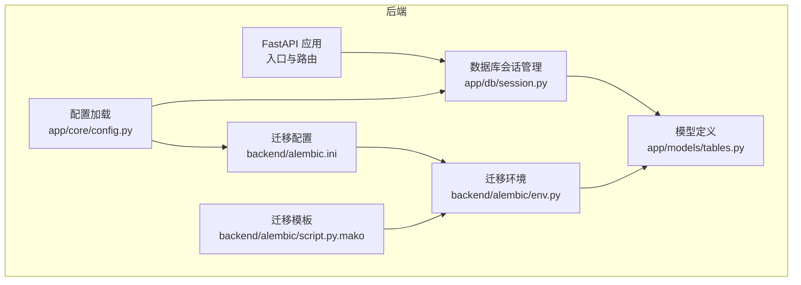
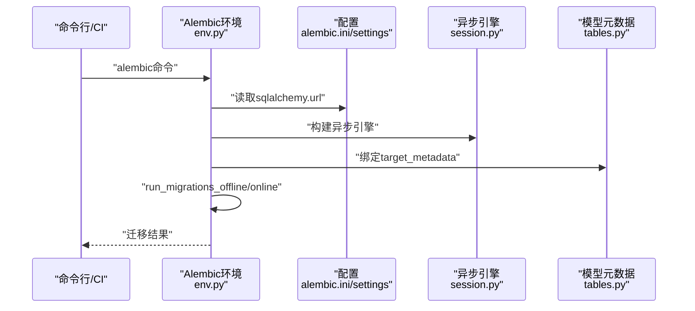
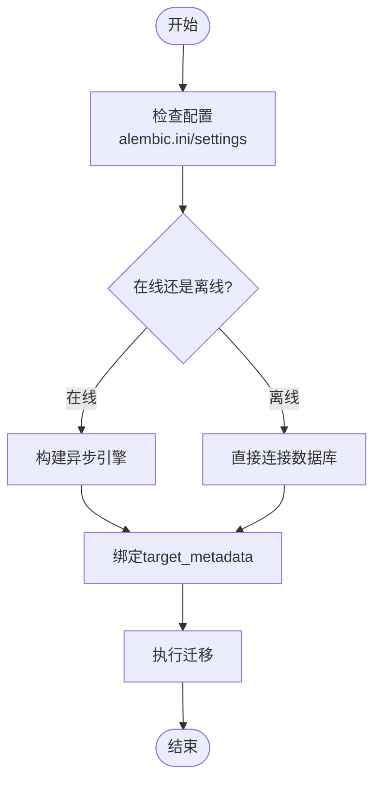
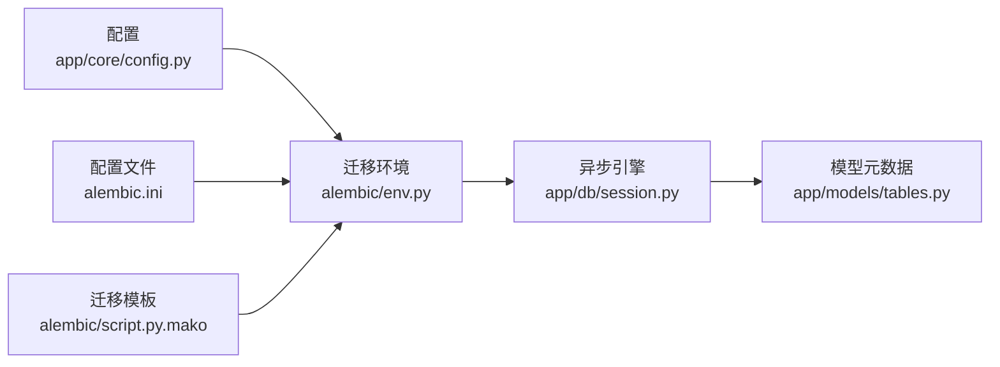

# 迁移操作管理

<cite>
**本文引用的文件**
- [backend/alembic/env.py](file://backend/alembic/env.py)
- [backend/alembic/script.py.mako](file://backend/alembic/script.py.mako)
- [backend/alembic.ini](file://backend/alembic.ini)
- [backend/app/models/tables.py](file://backend/app/models/tables.py)
- [backend/app/db/session.py](file://backend/app/db/session.py)
- [backend/app/core/config.py](file://backend/app/core/config.py)
- [backend/pyproject.toml](file://backend/pyproject.toml)
- [scripts/init_db.py](file://scripts/init_db.py)
- [ARCHITECTURE.md](file://ARCHITECTURE.md)
- [Notice.md](file://Notice.md)
- [OpenClaw-bot-review-main/prd/openbug_migration_plan.md](file://OpenClaw-bot-review-main/prd/openbug_migration_plan.md)
</cite>

## 目录
1. [简介](#简介)
2. [项目结构](#项目结构)
3. [核心组件](#核心组件)
4. [架构总览](#架构总览)
5. [详细组件分析](#详细组件分析)
6. [依赖分析](#依赖分析)
7. [性能考量](#性能考量)
8. [故障排除指南](#故障排除指南)
9. [结论](#结论)
10. [附录](#附录)

## 简介
本操作手册面向HotClaw项目的数据库迁移管理，聚焦于使用Alembic进行异步SQLAlchemy迁移的完整流程，包括创建迁移脚本、在线/离线应用迁移、回滚迁移与状态检查。同时结合项目架构与配置，给出迁移执行流程、停机时间与数据一致性保障策略，以及生产环境安全策略（灰度、回滚预案、监控告警）、自动化脚本与CI/CD集成建议。

## 项目结构
HotClaw后端采用FastAPI + SQLAlchemy 2.0异步ORM + Alembic迁移方案，数据库连接与会话管理集中在app/db目录，迁移配置位于backend/alembic，核心模型定义在app/models/tables.py，配置加载在app/core/config.py，项目依赖在backend/pyproject.toml。

**图表来源**
- [backend/alembic/env.py:1-53](file://backend/alembic/env.py#L1-L53)
- [backend/alembic/script.py.mako:1-25](file://backend/alembic/script.py.mako#L1-L25)
- [backend/alembic.ini:1-39](file://backend/alembic.ini#L1-L39)
- [backend/app/models/tables.py:1-319](file://backend/app/models/tables.py#L1-L319)
- [backend/app/db/session.py:1-50](file://backend/app/db/session.py#L1-L50)
- [backend/app/core/config.py:1-99](file://backend/app/core/config.py#L1-L99)

**章节来源**
- [backend/alembic/env.py:1-53](file://backend/alembic/env.py#L1-L53)
- [backend/alembic/script.py.mako:1-25](file://backend/alembic/script.py.mako#L1-L25)
- [backend/alembic.ini:1-39](file://backend/alembic.ini#L1-L39)
- [backend/app/models/tables.py:1-319](file://backend/app/models/tables.py#L1-L319)
- [backend/app/db/session.py:1-50](file://backend/app/db/session.py#L1-L50)
- [backend/app/core/config.py:1-99](file://backend/app/core/config.py#L1-L99)
- [backend/pyproject.toml:1-41](file://backend/pyproject.toml#L1-L41)

## 核心组件
- 迁移环境与执行
  - 异步迁移环境：backend/alembic/env.py，支持离线与在线两种模式，通过settings.database_url注入连接串，target_metadata指向Base.metadata。
  - 迁移模板：backend/alembic/script.py.mako，定义upgrade()/downgrade()骨架。
  - 配置文件：backend/alembic.ini，定义script_location与sqlalchemy.url等。
- 数据库会话与模型
  - 会话工厂：backend/app/db/session.py，创建异步引擎与会话工厂，提供FastAPI依赖与上下文管理器。
  - 模型定义：backend/app/models/tables.py，所有ORM模型继承Base，构成target_metadata。
- 配置与依赖
  - 配置：backend/app/core/config.py，加载.env并提供database_url等运行时配置。
  - 依赖：backend/pyproject.toml，包含sqlalchemy[asyncio]、asyncpg、alembic等。

**章节来源**
- [backend/alembic/env.py:1-53](file://backend/alembic/env.py#L1-L53)
- [backend/alembic/script.py.mako:1-25](file://backend/alembic/script.py.mako#L1-L25)
- [backend/alembic.ini:1-39](file://backend/alembic.ini#L1-L39)
- [backend/app/models/tables.py:1-319](file://backend/app/models/tables.py#L1-L319)
- [backend/app/db/session.py:1-50](file://backend/app/db/session.py#L1-L50)
- [backend/app/core/config.py:1-99](file://backend/app/core/config.py#L1-L99)
- [backend/pyproject.toml:1-41](file://backend/pyproject.toml#L1-L41)

## 架构总览
迁移执行链路围绕Alembic环境与SQLAlchemy异步引擎展开，配置驱动数据库URL，模型元数据作为迁移目标，最终通过上下文事务应用到数据库。

**图表来源**
- [backend/alembic/env.py:1-53](file://backend/alembic/env.py#L1-L53)
- [backend/alembic.ini:1-39](file://backend/alembic.ini#L1-L39)
- [backend/app/db/session.py:1-50](file://backend/app/db/session.py#L1-L50)
- [backend/app/models/tables.py:1-319](file://backend/app/models/tables.py#L1-L319)
- [backend/app/core/config.py:1-99](file://backend/app/core/config.py#L1-L99)

## 详细组件分析

### 迁移命令与操作步骤
- 创建迁移脚本
  - 使用Alembic命令生成迁移版本文件，模板由backend/alembic/script.py.mako提供upgrade()/downgrade()骨架。
  - 建议在本地开发环境执行，确保模型定义与迁移脚本同步。
  - 参考路径：[backend/alembic/script.py.mako:1-25](file://backend/alembic/script.py.mako#L1-L25)
- 应用迁移
  - 在线模式：当应用运行且数据库URL有效时，Alembic通过异步引擎连接数据库，执行迁移。
  - 离线模式：通过配置文件中的sqlalchemy.url直接连接数据库执行迁移。
  - 参考路径：[backend/alembic/env.py:21-52](file://backend/alembic/env.py#L21-L52)，[backend/alembic.ini:1-39](file://backend/alembic.ini#L1-L39)
- 回滚迁移
  - 通过downgrade()实现逆向迁移，需确保downgrade()逻辑与upgrade()一一对应。
  - 参考路径：[backend/alembic/script.py.mako:23-24](file://backend/alembic/script.py.mako#L23-L24)
- 检查迁移状态
  - 使用Alembic命令查看当前版本与待应用/回滚的版本差异，确认一致性。
  - 参考路径：[backend/alembic/env.py:1-53](file://backend/alembic/env.py#L1-L53)

**图表来源**
- [backend/alembic/env.py:1-53](file://backend/alembic/env.py#L1-L53)
- [backend/alembic/script.py.mako:1-25](file://backend/alembic/script.py.mako#L1-L25)
- [backend/alembic.ini:1-39](file://backend/alembic.ini#L1-L39)

**章节来源**
- [backend/alembic/env.py:1-53](file://backend/alembic/env.py#L1-L53)
- [backend/alembic/script.py.mako:1-25](file://backend/alembic/script.py.mako#L1-L25)
- [backend/alembic.ini:1-39](file://backend/alembic.ini#L1-L39)

### 执行流程与注意事项
- 执行流程
  - 配置加载：读取settings.database_url，注入Alembic配置。
  - 引擎建立：根据URL创建异步引擎，支持SQLite与PostgreSQL。
  - 事务执行：在上下文事务中应用迁移，确保原子性。
- 停机时间
  - 在线迁移通常无需停机，但涉及索引重建或大表重写时可能短暂锁表，建议在低峰时段执行。
- 数据一致性
  - 迁移脚本需保证幂等与可逆，升级/回滚均应满足业务数据一致性。
  - 建议在迁移前备份数据库，迁移后进行抽样校验。

**章节来源**
- [backend/app/core/config.py:1-99](file://backend/app/core/config.py#L1-L99)
- [backend/app/db/session.py:1-50](file://backend/app/db/session.py#L1-L50)
- [backend/alembic/env.py:1-53](file://backend/alembic/env.py#L1-L53)

### 生产环境安全策略
- 灰度发布
  - 先在测试环境验证迁移，再在预生产环境灰度执行，最后在生产环境分批执行。
- 回滚预案
  - 迁移脚本必须包含downgrade()，并定期演练回滚流程。
- 监控告警
  - 监控迁移执行时间、失败率与数据库连接健康度，异常立即告警。
- 备份策略
  - 迁移前全量备份，迁移后校验备份可用性。

**章节来源**
- [ARCHITECTURE.md:1-800](file://ARCHITECTURE.md#L1-L800)
- [Notice.md:250-286](file://Notice.md#L250-L286)

### 自动化脚本与CI/CD集成
- 初始化数据库
  - 提供scripts/init_db.py，异步创建所有表，可用于首次部署或清理测试环境。
  - 参考路径：[scripts/init_db.py:1-16](file://scripts/init_db.py#L1-L16)
- CI/CD建议
  - 在CI中增加迁移检查步骤：生成迁移脚本、执行迁移、运行测试。
  - 使用环境变量覆盖数据库URL，区分开发/测试/生产环境。
  - 参考依赖与配置：[backend/pyproject.toml:1-41](file://backend/pyproject.toml#L1-L41)，[backend/app/core/config.py:1-99](file://backend/app/core/config.py#L1-L99)

**章节来源**
- [scripts/init_db.py:1-16](file://scripts/init_db.py#L1-L16)
- [backend/pyproject.toml:1-41](file://backend/pyproject.toml#L1-L41)
- [backend/app/core/config.py:1-99](file://backend/app/core/config.py#L1-L99)

## 依赖分析
迁移相关模块之间的耦合关系如下：

**图表来源**
- [backend/alembic/env.py:1-53](file://backend/alembic/env.py#L1-L53)
- [backend/alembic/script.py.mako:1-25](file://backend/alembic/script.py.mako#L1-L25)
- [backend/alembic.ini:1-39](file://backend/alembic.ini#L1-L39)
- [backend/app/models/tables.py:1-319](file://backend/app/models/tables.py#L1-L319)
- [backend/app/db/session.py:1-50](file://backend/app/db/session.py#L1-L50)
- [backend/app/core/config.py:1-99](file://backend/app/core/config.py#L1-L99)

**章节来源**
- [backend/alembic/env.py:1-53](file://backend/alembic/env.py#L1-L53)
- [backend/alembic/script.py.mako:1-25](file://backend/alembic/script.py.mako#L1-L25)
- [backend/alembic.ini:1-39](file://backend/alembic.ini#L1-L39)
- [backend/app/models/tables.py:1-319](file://backend/app/models/tables.py#L1-L319)
- [backend/app/db/session.py:1-50](file://backend/app/db/session.py#L1-L50)
- [backend/app/core/config.py:1-99](file://backend/app/core/config.py#L1-L99)

## 性能考量
- 引擎与池化
  - 非SQLite场景启用pool_pre_ping提升连接稳定性。
  - 参考路径：[backend/app/db/session.py:7-14](file://backend/app/db/session.py#L7-L14)
- 迁移性能
  - 避免长事务与大表全量扫描，合理拆分迁移步骤。
  - 使用索引重建策略与并发控制，减少DDL锁表时间。
- 日志与可观测性
  - 通过配置文件调整日志级别，便于问题定位。
  - 参考路径：[backend/alembic.ini:16-38](file://backend/alembic.ini#L16-L38)

**章节来源**
- [backend/app/db/session.py:1-50](file://backend/app/db/session.py#L1-L50)
- [backend/alembic.ini:1-39](file://backend/alembic.ini#L1-L39)

## 故障排除指南
- 常见错误与诊断
  - 数据库连接失败：检查settings.database_url与网络连通性。
  - 迁移版本不一致：使用命令查看当前版本，确保脚本与版本匹配。
  - 权限不足：确认数据库用户具备DDL权限。
  - 回滚失败：检查downgrade()逻辑是否完备，必要时手工修复。
- 解决方案
  - 使用离线模式快速定位问题，再切换在线模式执行。
  - 在测试环境复现问题，验证修复后再推广至生产。
  - 参考项目架构与配置约束，确保迁移符合Notice.md与ARCHITECTURE.md的要求。

**章节来源**
- [backend/app/core/config.py:1-99](file://backend/app/core/config.py#L1-L99)
- [backend/alembic/env.py:1-53](file://backend/alembic/env.py#L1-L53)
- [Notice.md:316-340](file://Notice.md#L316-L340)
- [ARCHITECTURE.md:1-800](file://ARCHITECTURE.md#L1-L800)

## 结论
HotClaw的迁移体系以Alembic为核心，结合异步SQLAlchemy与集中式配置，形成可逆、可观测、可自动化执行的迁移流程。遵循本文的操作步骤与安全策略，可在保证数据一致性的同时，高效推进数据库演进。

## 附录
- 相关PRD与迁移参考
  - OpenBug迁移至OpenClaw-bot-review的设计方案，体现迁移策略与灰度发布思路，可借鉴到数据库迁移实践中。
  - 参考路径：[OpenClaw-bot-review-main/prd/openbug_migration_plan.md:1-252](file://OpenClaw-bot-review-main/prd/openbug_migration_plan.md#L1-L252)

**章节来源**
- [OpenClaw-bot-review-main/prd/openbug_migration_plan.md:1-252](file://OpenClaw-bot-review-main/prd/openbug_migration_plan.md#L1-L252)