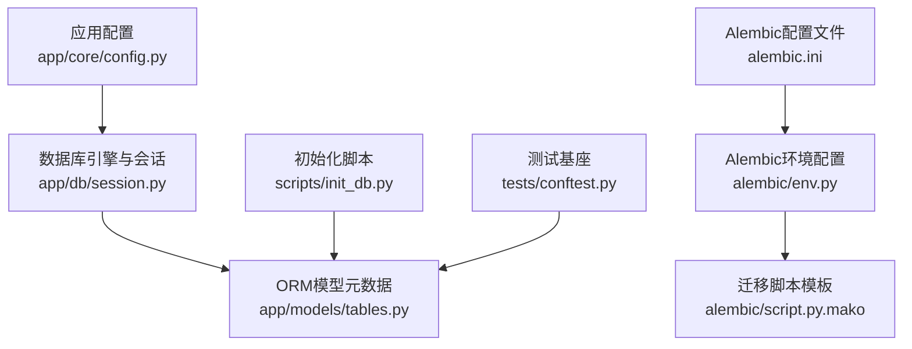
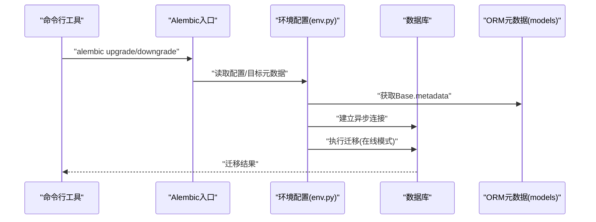
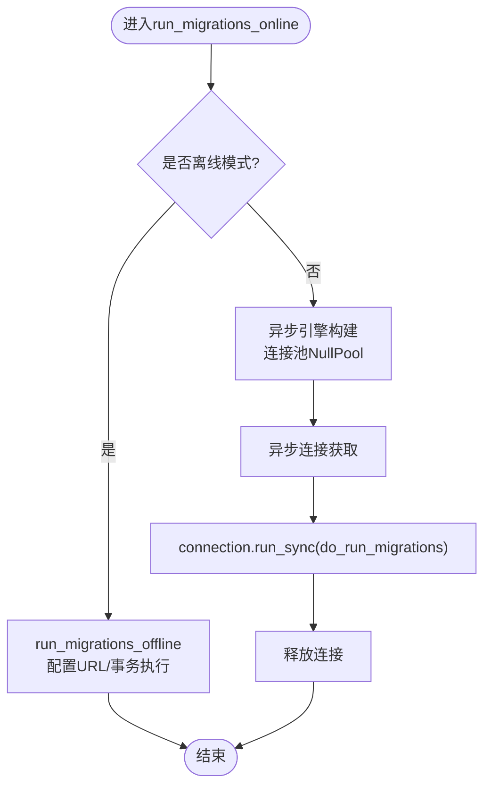
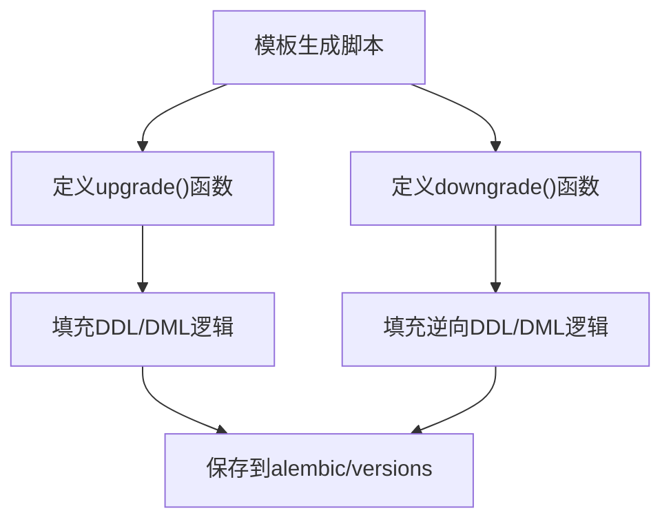
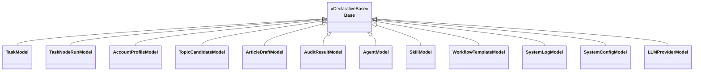
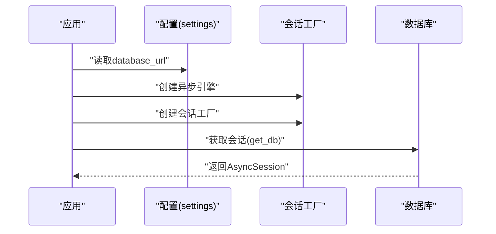
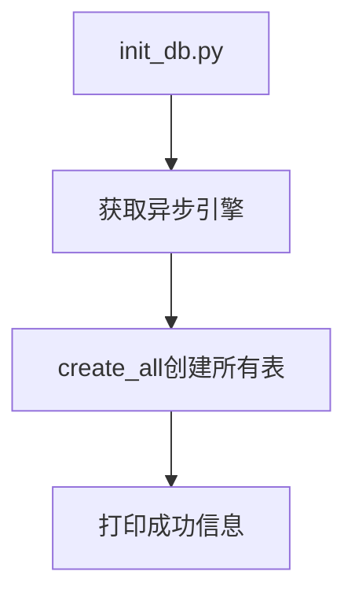
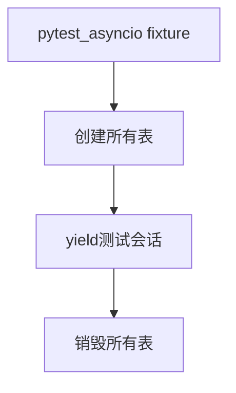
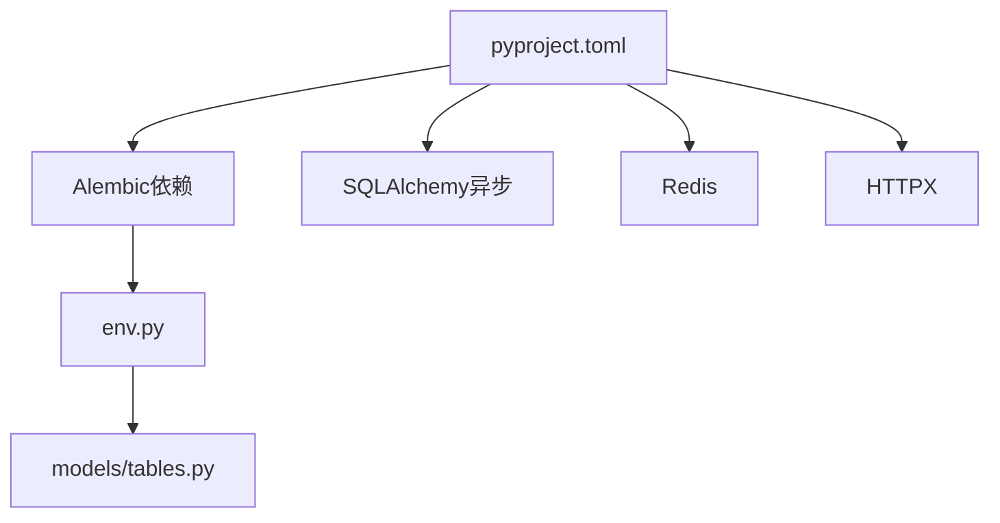

# 迁移脚本开发

<cite>
**本文档引用的文件**
- [env.py](file://backend/alembic/env.py)
- [script.py.mako](file://backend/alembic/script.py.mako)
- [alembic.ini](file://backend/alembic.ini)
- [tables.py](file://backend/app/models/tables.py)
- [config.py](file://backend/app/core/config.py)
- [session.py](file://backend/app/db/session.py)
- [init_db.py](file://scripts/init_db.py)
- [conftest.py](file://backend/tests/conftest.py)
- [pyproject.toml](file://backend/pyproject.toml)
</cite>

## 目录
1. [简介](#简介)
2. [项目结构](#项目结构)
3. [核心组件](#核心组件)
4. [架构总览](#架构总览)
5. [详细组件分析](#详细组件分析)
6. [依赖关系分析](#依赖关系分析)
7. [性能考虑](#性能考虑)
8. [故障排除指南](#故障排除指南)
9. [结论](#结论)
10. [附录](#附录)

## 简介
本指南面向HotClaw项目的数据库迁移脚本开发，围绕Alembic异步迁移框架，系统阐述迁移脚本的结构、编写规范、版本化命名与组织、常见场景实现、测试与调试方法，以及版本控制与团队协作规范。文档以实际代码为依据，确保可操作性与一致性。

## 项目结构
HotClaw后端采用异步SQLAlchemy + Alembic进行数据库迁移管理，核心位置如下：
- Alembic配置与模板：backend/alembic/
- ORM模型定义：backend/app/models/tables.py
- 应用配置与数据库连接：backend/app/core/config.py、backend/app/db/session.py
- 初始化脚本：scripts/init_db.py
- 测试基座：backend/tests/conftest.py
- 项目构建与依赖：backend/pyproject.toml

**图表来源**
- [config.py:52-99](file://backend/app/core/config.py#L52-L99)
- [session.py:9-20](file://backend/app/db/session.py#L9-L20)
- [tables.py:18-319](file://backend/app/models/tables.py#L18-L319)
- [env.py:9-18](file://backend/alembic/env.py#L9-L18)
- [script.py.mako:1-25](file://backend/alembic/script.py.mako#L1-L25)
- [alembic.ini:1-39](file://backend/alembic.ini#L1-L39)
- [init_db.py:8-11](file://scripts/init_db.py#L8-L11)
- [conftest.py:16-30](file://backend/tests/conftest.py#L16-L30)

**章节来源**
- [config.py:52-99](file://backend/app/core/config.py#L52-L99)
- [session.py:9-20](file://backend/app/db/session.py#L9-L20)
- [tables.py:18-319](file://backend/app/models/tables.py#L18-L319)
- [env.py:9-18](file://backend/alembic/env.py#L9-L18)
- [script.py.mako:1-25](file://backend/alembic/script.py.mako#L1-L25)
- [alembic.ini:1-39](file://backend/alembic.ini#L1-L39)
- [init_db.py:8-11](file://scripts/init_db.py#L8-L11)
- [conftest.py:16-30](file://backend/tests/conftest.py#L16-L30)

## 核心组件
- Alembic环境配置：负责加载数据库URL、设置目标元数据、在线/离线迁移执行路径。
- 迁移脚本模板：生成标准升级/降级函数骨架，便于扩展具体DDL/DML。
- ORM模型元数据：所有表结构定义，作为迁移目标元数据。
- 数据库引擎与会话：统一的异步连接与事务管理。
- 初始化脚本：一次性创建所有表，用于快速部署或本地开发。
- 测试基座：基于内存SQLite的测试环境，便于迁移脚本的集成测试。

**章节来源**
- [env.py:21-52](file://backend/alembic/env.py#L21-L52)
- [script.py.mako:19-24](file://backend/alembic/script.py.mako#L19-L24)
- [tables.py:18-319](file://backend/app/models/tables.py#L18-L319)
- [session.py:9-20](file://backend/app/db/session.py#L9-L20)
- [init_db.py:8-11](file://scripts/init_db.py#L8-L11)
- [conftest.py:16-30](file://backend/tests/conftest.py#L16-L30)

## 架构总览
下图展示迁移生命周期中各组件的交互关系：

**图表来源**
- [env.py:34-52](file://backend/alembic/env.py#L34-L52)
- [alembic.ini:3-5](file://backend/alembic.ini#L3-L5)
- [tables.py:18-319](file://backend/app/models/tables.py#L18-L319)

## 详细组件分析

### Alembic环境配置（env.py）
- 异步引擎创建与连接管理：通过异_async_engine_from_config构建连接，使用NullPool避免连接池问题。
- 在线迁移流程：异步连接后委托给do_run_migrations执行事务内迁移。
- 离线迁移流程：直接使用配置中的URL，以literal_binds方式生成SQL。
- 目标元数据：从ORM Base.metadata获取，确保与模型定义保持一致。

**图表来源**
- [env.py:34-52](file://backend/alembic/env.py#L34-L52)

**章节来源**
- [env.py:34-52](file://backend/alembic/env.py#L34-L52)

### 迁移脚本模板（script.py.mako）
- 升级/降级函数：提供标准函数签名，便于在具体迁移中实现DDL/DML。
- 版本元信息：revision、down_revision、branch_labels、depends_on等由模板注入。
- 导入与扩展：支持自定义导入与升级/降级逻辑。

**图表来源**
- [script.py.mako:19-24](file://backend/alembic/script.py.mako#L19-L24)

**章节来源**
- [script.py.mako:1-25](file://backend/alembic/script.py.mako#L1-L25)

### ORM模型与迁移目标（tables.py）
- 模型基类：DeclarativeBase派生，统一元数据收集。
- 表结构：涵盖任务、节点运行、账号画像、话题候选、文章草稿、审核结果、代理、技能、工作流模板、系统日志、系统配置、LLM提供商等。
- 外键与索引：如系统日志中的trace_id、task_id索引，体现查询优化需求。
- JSON字段：广泛用于配置、输入输出、结构化上下文，迁移时需注意兼容性与序列化。

**图表来源**
- [tables.py:18-319](file://backend/app/models/tables.py#L18-L319)

**章节来源**
- [tables.py:18-319](file://backend/app/models/tables.py#L18-L319)

### 数据库配置与连接（config.py、session.py）
- 配置项：database_url、redis_url、LLM相关参数等，其中database_url决定迁移目标。
- 引擎特性：根据数据库类型选择pool_pre_ping；SQLite不支持pool_pre_ping。
- 会话管理：提供FastAPI依赖注入与上下文管理器两种使用方式。

**图表来源**
- [config.py:52-99](file://backend/app/core/config.py#L52-L99)
- [session.py:9-20](file://backend/app/db/session.py#L9-L20)

**章节来源**
- [config.py:52-99](file://backend/app/core/config.py#L52-L99)
- [session.py:9-20](file://backend/app/db/session.py#L9-L20)

### 初始化脚本（init_db.py）
- 功能：一次性创建所有表，适合首次部署或本地开发环境。
- 实现：通过异步连接调用Base.metadata.create_all。

**图表来源**
- [init_db.py:8-11](file://scripts/init_db.py#L8-L11)

**章节来源**
- [init_db.py:8-11](file://scripts/init_db.py#L8-L11)

### 测试基座（conftest.py）
- 内存数据库：使用sqlite+aiosqlite:///:memory:，避免外部依赖。
- 表生命周期：在fixture中创建与销毁所有表，保证测试隔离。
- HTTP客户端：通过依赖覆盖提供测试专用数据库会话。

**图表来源**
- [conftest.py:20-31](file://backend/tests/conftest.py#L20-L31)

**章节来源**
- [conftest.py:20-31](file://backend/tests/conftest.py#L20-L31)

## 依赖关系分析
- Alembic依赖：异步SQLAlchemy、asyncpg（通过sqlalchemy.url配置），日志配置。
- 应用依赖：FastAPI、Pydantic、Redis、HTTPX、structlog、YAML、LiteLLM、aiosqlite等。
- 迁移脚本与模型：env.py通过target_metadata绑定到ORM模型元数据，确保迁移目标与模型一致。

**图表来源**
- [pyproject.toml:6-22](file://backend/pyproject.toml#L6-L22)
- [env.py:9-18](file://backend/alembic/env.py#L9-L18)
- [tables.py:18-319](file://backend/app/models/tables.py#L18-L319)

**章节来源**
- [pyproject.toml:6-22](file://backend/pyproject.toml#L6-L22)
- [env.py:9-18](file://backend/alembic/env.py#L9-L18)
- [tables.py:18-319](file://backend/app/models/tables.py#L18-L319)

## 性能考虑
- 异步连接：使用异步引擎与连接池NullPool，减少阻塞。
- 连接预检：非SQLite数据库启用pool_pre_ping提升连接稳定性。
- 迁移事务：在单个事务中执行迁移，失败自动回滚，保证原子性。
- 日志级别：Alembic与SQLAlchemy日志级别按需调整，避免过度输出影响性能。

[本节为通用指导，无需特定文件引用]

## 故障排除指南
- 迁移失败回滚：会话管理器在异常时自动回滚，确保数据库一致性。
- 在线/离线模式：确认Alembic配置与运行模式匹配，避免URL不一致导致的连接问题。
- 元数据不一致：检查env.py中的target_metadata是否指向正确的ORM Base。
- 测试环境：使用内存SQLite进行迁移测试，确保迁移脚本在无外部依赖的情况下可重复执行。

**章节来源**
- [session.py:23-35](file://backend/app/db/session.py#L23-L35)
- [env.py:21-52](file://backend/alembic/env.py#L21-L52)
- [alembic.ini:3-5](file://backend/alembic.ini#L3-L5)

## 结论
HotClaw的迁移脚本体系以异步SQLAlchemy与Alembic为核心，结合统一的ORM模型元数据与严格的会话管理，提供了可靠的版本化数据库演进能力。遵循本文档的编写规范、命名约定与测试策略，可确保迁移脚本的可维护性与可追溯性。

[本节为总结性内容，无需特定文件引用]

## 附录

### 迁移脚本编写规范
- 函数实现要求
  - upgrade()：实现DDL/DML变更，确保幂等与可逆。
  - downgrade()：实现与upgrade()对应的逆向操作，保证数据一致性。
- 数据类型转换
  - 使用String、Integer、Float、Boolean、DateTime、JSON等类型映射，注意长度与精度。
  - JSON字段迁移时需考虑序列化兼容性与默认值处理。
- 约束修改
  - 外键约束：先创建被参照表，再创建含外键的表，或在迁移中显式添加约束。
  - 唯一约束：使用unique=True或在迁移中添加UniqueConstraint。
  - 索引：对高频查询字段添加索引，如系统日志中的trace_id、task_id。
- 版本化命名与组织
  - 命名规则：采用时间戳前缀（YYYYMMDDHHMMSS）加简要描述，确保顺序可读。
  - 组织结构：按功能域或模块分组，便于团队协作与审查。
- 常见场景示例
  - 表结构变更：新增列、修改列类型、添加默认值。
  - 索引创建：为查询热点字段添加索引。
  - 数据填充：在upgrade()中插入初始配置或种子数据，在downgrade()中清理。
  - 约束添加：添加唯一约束、外键约束、检查约束。
- 测试与调试
  - 单元测试：针对迁移脚本的业务逻辑编写单元测试。
  - 集成测试：使用内存SQLite执行完整迁移流程，验证升级/降级正确性。
  - 调试技巧：开启SQLAlchemy与Alembic日志，定位DDL/DML执行问题。
- 版本控制与协作
  - 提交策略：每个迁移脚本独立提交，描述清晰、可追溯。
  - 审查流程：团队成员审查迁移脚本，关注数据安全与性能影响。
  - 回滚预案：确保downgrade()可完整回滚，制定应急恢复方案。

[本节为通用指导，无需特定文件引用]