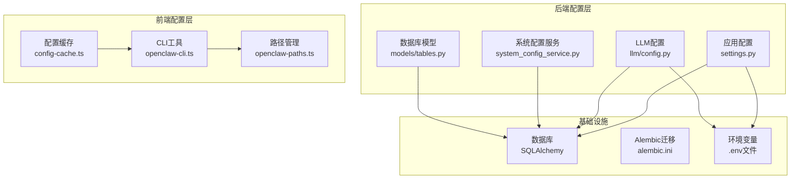
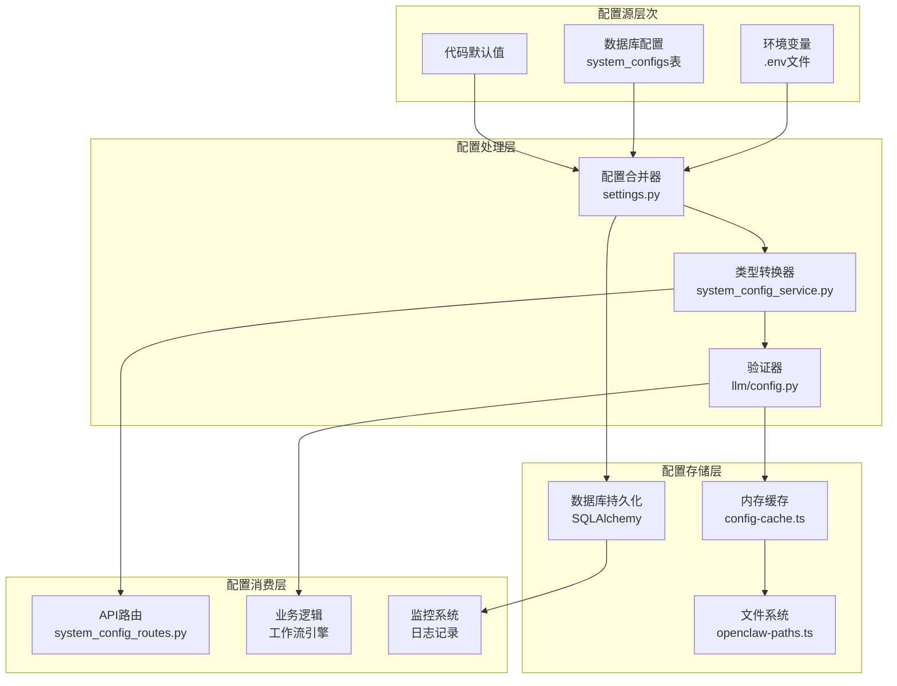
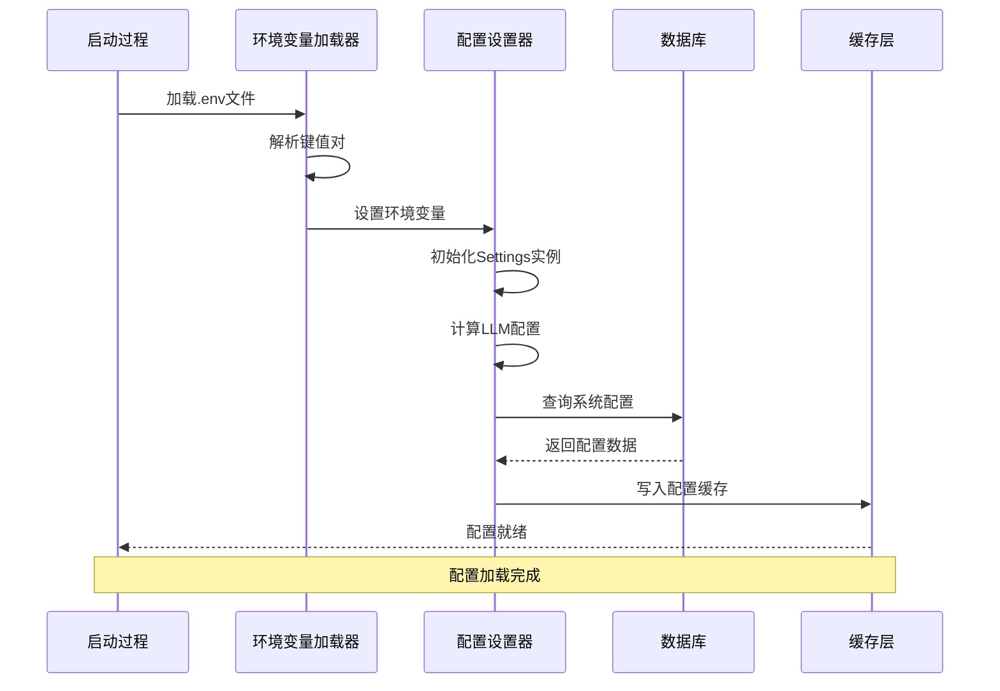
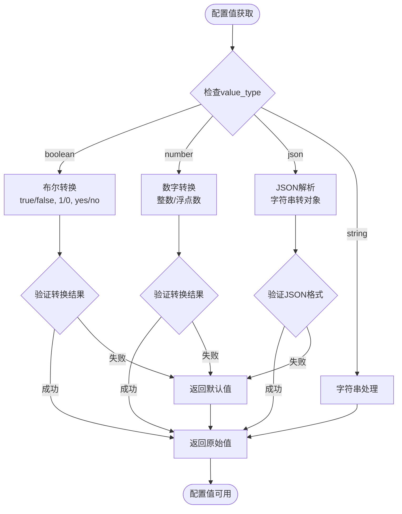
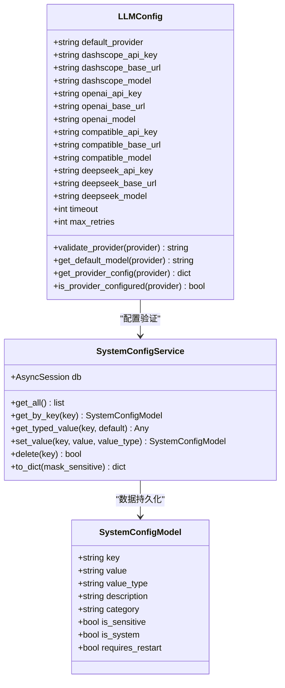
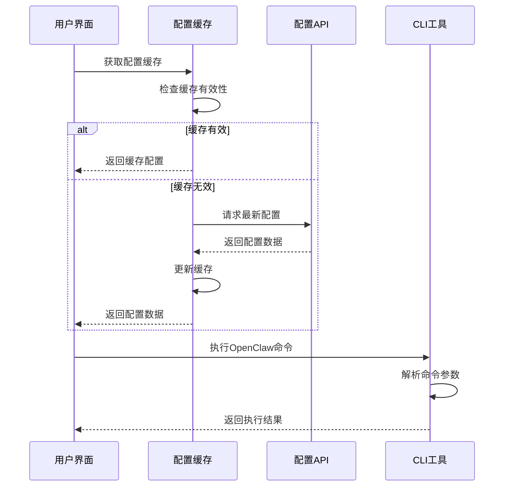
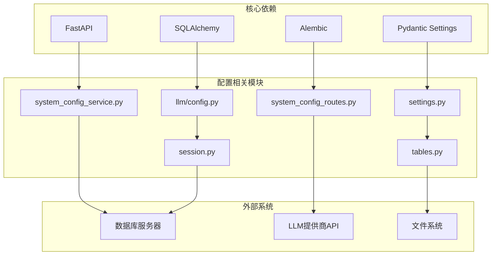

# 系统配置管理

<cite>
**本文档引用的文件**
- [backend/app/core/config.py](file://backend/app/core/config.py)
- [backend/app/llm/config.py](file://backend/app/llm/config.py)
- [backend/app/services/system_config_service.py](file://backend/app/services/system_config_service.py)
- [backend/app/api/system_config_routes.py](file://backend/app/api/system_config_routes.py)
- [backend/app/models/tables.py](file://backend/app/models/tables.py)
- [backend/app/db/session.py](file://backend/app/db/session.py)
- [backend/alembic.ini](file://backend/alembic.ini)
- [OpenClaw-bot-review-main/lib/config-cache.ts](file://OpenClaw-bot-review-main/lib/config-cache.ts)
- [OpenClaw-bot-review-main/lib/openclaw-cli.ts](file://OpenClaw-bot-review-main/lib/openclaw-cli.ts)
- [OpenClaw-bot-review-main/lib/openclaw-paths.ts](file://OpenClaw-bot-review-main/lib/openclaw-paths.ts)
</cite>

## 目录
1. [简介](#简介)
2. [项目结构](#项目结构)
3. [核心组件](#核心组件)
4. [架构概览](#架构概览)
5. [详细组件分析](#详细组件分析)
6. [依赖关系分析](#依赖关系分析)
7. [性能考虑](#性能考虑)
8. [故障排除指南](#故障排除指南)
9. [结论](#结论)

## 简介

HotClaw系统配置管理是一个多层次、分布式的配置管理系统，旨在为智能体工作流平台提供灵活、可扩展的配置管理能力。该系统通过多种配置源和层次结构，实现了从环境变量到数据库持久化的完整配置生命周期管理。

系统的核心设计理念包括：
- **多源配置优先级**：数据库自定义配置 > .env 文件 > 代码默认值
- **分层配置管理**：应用配置、LLM提供商配置、系统配置的分离管理
- **运行时动态配置**：支持在线修改配置而无需重启服务
- **安全性考虑**：敏感配置的脱敏处理和访问控制

## 项目结构

系统配置管理涉及前后端多个组件的协同工作：

**图表来源**
- [backend/app/core/config.py:1-166](file://backend/app/core/config.py#L1-L166)
- [backend/app/llm/config.py:1-185](file://backend/app/llm/config.py#L1-L185)
- [backend/app/services/system_config_service.py:1-223](file://backend/app/services/system_config_service.py#L1-L223)

**章节来源**
- [backend/app/core/config.py:1-166](file://backend/app/core/config.py#L1-L166)
- [backend/app/llm/config.py:1-185](file://backend/app/llm/config.py#L1-L185)
- [backend/app/services/system_config_service.py:1-223](file://backend/app/services/system_config_service.py#L1-L223)

## 核心组件

### 应用配置管理

应用配置采用Pydantic Settings实现，支持从环境变量自动加载配置。配置具有明确的优先级顺序：

1. **数据库自定义配置**：运行时从system_configs表读取
2. **.env文件配置**：启动时预加载到环境变量
3. **代码默认值**：硬编码的默认配置

### LLM提供商配置

系统支持四种主流LLM提供商的统一配置管理：
- **DashScope**：阿里云通义千问/Qwen
- **OpenAI**：GPT系列模型
- **DeepSeek**：DeepSeek聊天模型
- **Compatible**：兼容OpenAI接口的本地模型

每种提供商都有独立的API密钥、基础URL和默认模型配置。

### 系统配置服务

提供完整的CRUD操作和类型转换功能：
- **配置查询**：按键名、分类查询
- **类型转换**：字符串、数字、布尔值、JSON的自动转换
- **权限控制**：系统级配置不可删除
- **脱敏处理**：敏感配置的显示脱敏

**章节来源**
- [backend/app/core/config.py:89-166](file://backend/app/core/config.py#L89-L166)
- [backend/app/llm/config.py:11-185](file://backend/app/llm/config.py#L11-L185)
- [backend/app/services/system_config_service.py:119-223](file://backend/app/services/system_config_service.py#L119-L223)

## 架构概览

系统配置管理采用分层架构设计，确保配置的灵活性和安全性：

**图表来源**
- [backend/app/core/config.py:18-31](file://backend/app/core/config.py#L18-L31)
- [backend/app/services/system_config_service.py:142-162](file://backend/app/services/system_config_service.py#L142-L162)
- [OpenClaw-bot-review-main/lib/config-cache.ts:1-19](file://OpenClaw-bot-review-main/lib/config-cache.ts#L1-L19)

## 详细组件分析

### 配置加载流程

系统采用"预加载+延迟初始化"的策略，确保配置的正确性和性能：

**图表来源**
- [backend/app/core/config.py:18-31](file://backend/app/core/config.py#L18-L31)
- [backend/app/core/config.py:148-161](file://backend/app/core/config.py#L148-L161)

### 配置类型转换机制

系统实现了智能的类型转换，支持多种数据类型的自动识别和转换：

**图表来源**
- [backend/app/services/system_config_service.py:142-162](file://backend/app/services/system_config_service.py#L142-L162)

**章节来源**
- [backend/app/services/system_config_service.py:142-162](file://backend/app/services/system_config_service.py#L142-L162)

### LLM配置管理

系统提供了统一的LLM提供商配置管理接口：

**图表来源**
- [backend/app/llm/config.py:11-185](file://backend/app/llm/config.py#L11-L185)
- [backend/app/services/system_config_service.py:119-223](file://backend/app/services/system_config_service.py#L119-L223)
- [backend/app/models/tables.py:235-267](file://backend/app/models/tables.py#L235-L267)

**章节来源**
- [backend/app/llm/config.py:11-185](file://backend/app/llm/config.py#L11-L185)
- [backend/app/models/tables.py:235-267](file://backend/app/models/tables.py#L235-L267)

### 前端配置缓存机制

前端提供了轻量级的配置缓存机制，支持配置的快速访问：

**图表来源**
- [OpenClaw-bot-review-main/lib/config-cache.ts:1-19](file://OpenClaw-bot-review-main/lib/config-cache.ts#L1-L19)
- [OpenClaw-bot-review-main/lib/openclaw-cli.ts:13-109](file://OpenClaw-bot-review-main/lib/openclaw-cli.ts#L13-L109)

**章节来源**
- [OpenClaw-bot-review-main/lib/config-cache.ts:1-19](file://OpenClaw-bot-review-main/lib/config-cache.ts#L1-L19)
- [OpenClaw-bot-review-main/lib/openclaw-cli.ts:13-109](file://OpenClaw-bot-review-main/lib/openclaw-cli.ts#L13-L109)

## 依赖关系分析

系统配置管理的依赖关系呈现清晰的分层结构：

**图表来源**
- [backend/app/core/config.py:32-33](file://backend/app/core/config.py#L32-L33)
- [backend/app/db/session.py:16-17](file://backend/app/db/session.py#L16-L17)

**章节来源**
- [backend/app/core/config.py:32-33](file://backend/app/core/config.py#L32-L33)
- [backend/app/db/session.py:16-17](file://backend/app/db/session.py#L16-L17)

## 性能考虑

系统配置管理在性能方面采用了多项优化策略：

### 缓存策略
- **配置缓存**：前端配置缓存减少重复请求
- **LLM配置缓存**：使用LRU缓存避免重复解析
- **数据库连接池**：异步连接池提高并发性能

### 内存管理
- **惰性加载**：配置仅在需要时加载
- **资源清理**：及时释放数据库连接和缓存资源
- **内存限制**：合理设置缓冲区大小防止内存泄漏

### 网络优化
- **批量操作**：支持批量配置查询和更新
- **连接复用**：重用数据库连接减少开销
- **超时控制**：合理的超时设置避免阻塞

## 故障排除指南

### 常见配置问题

**数据库连接问题**
- 检查database_url格式是否正确
- 验证数据库服务是否正常运行
- 确认连接凭据的正确性

**LLM配置问题**
- 验证API密钥的有效性
- 检查网络连通性和代理设置
- 确认模型名称和基础URL的正确性

**配置加载问题**
- 检查.env文件的语法格式
- 验证配置键名的拼写
- 确认配置值的数据类型

### 调试方法

**启用调试模式**
- 设置app_debug为True获取详细日志
- 检查SQLAlchemy的SQL语句输出
- 使用FastAPI的调试工具进行问题定位

**配置验证**
- 使用系统配置API验证配置有效性
- 检查配置的类型转换结果
- 验证敏感配置的脱敏处理

**章节来源**
- [backend/app/db/session.py:47-80](file://backend/app/db/session.py#L47-L80)
- [backend/app/services/system_config_service.py:142-162](file://backend/app/services/system_config_service.py#L142-L162)

## 结论

HotClaw系统配置管理通过多层次的设计实现了配置的灵活性、安全性和可维护性。系统采用的配置优先级机制、类型转换功能和缓存策略，为智能体工作流平台提供了稳定可靠的配置管理基础。

主要优势包括：
- **多源配置支持**：灵活的配置来源和优先级管理
- **类型安全**：强类型检查和自动转换机制
- **运行时修改**：支持在线配置更新无需重启
- **安全性保障**：敏感配置的脱敏处理和访问控制
- **性能优化**：缓存策略和连接池管理

未来可以考虑的改进方向：
- 增加配置版本管理和回滚功能
- 实现配置模板和继承机制
- 添加配置变更通知和审计日志
- 支持配置的批量导入导出功能