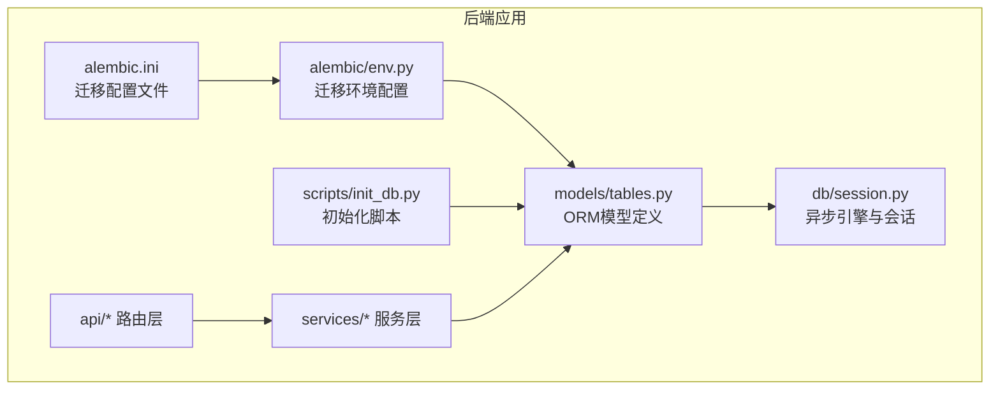
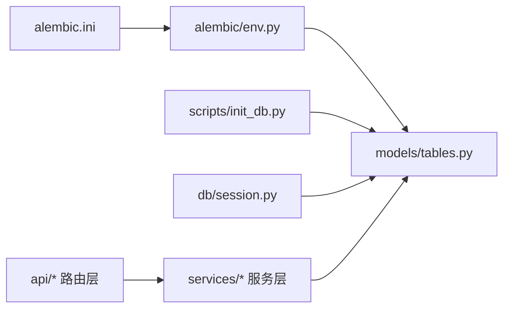
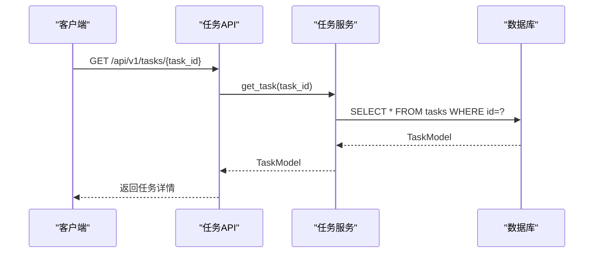

# 表结构设计

<cite>
**本文引用的文件**
- [backend/app/models/tables.py](file://backend/app/models/tables.py)
- [backend/app/db/session.py](file://backend/app/db/session.py)
- [backend/alembic/env.py](file://backend/alembic/env.py)
- [backend/alembic.ini](file://backend/alembic.ini)
- [scripts/init_db.py](file://scripts/init_db.py)
- [backend/backend/app/api/task_routes.py](file://backend/app/api/task_routes.py)
- [backend/backend/app/services/task_service.py](file://backend/app/services/task_service.py)
- [backend/backend/app/schemas/task.py](file://backend/app/schemas/task.py)
- [backend/backend/app/api/agent_routes.py](file://backend/app/api/agent_routes.py)
- [backend/backend/app/api/skill_routes.py](file://backend/app/api/skill_routes.py)
</cite>

## 目录
1. [简介](#简介)
2. [项目结构](#项目结构)
3. [核心组件](#核心组件)
4. [架构总览](#架构总览)
5. [详细组件分析](#详细组件分析)
6. [依赖分析](#依赖分析)
7. [性能考量](#性能考量)
8. [故障排查指南](#故障排查指南)
9. [结论](#结论)
10. [附录](#附录)

## 简介
本文件面向HotClaw平台的数据库表结构设计，聚焦于以下核心表：tasks（任务表）、task_node_runs（节点执行记录表）、account_profiles（账号画像表）、topic_candidates（话题候选表）、article_drafts（文章草稿表）、audit_results（审核结果表）、agents（Agent配置表）、skills（技能配置表）、workflow_templates（工作流模板表）以及system_logs（系统日志表）。文档从设计目标、字段设计原则、索引策略、数据完整性约束、触发器与存储过程考虑等方面进行系统化说明，并通过ER图与关系图帮助理解表间关联。

## 项目结构
HotClaw采用异步SQLAlchemy与Alembic进行数据库建模与迁移管理，ORM模型集中定义在models层，数据库连接由独立的session模块提供，Alembic配置位于alembic目录中，初始化脚本用于一次性创建所有表。



图表来源
- [backend/app/models/tables.py:1-319](file://backend/app/models/tables.py#L1-L319)
- [backend/app/db/session.py:1-50](file://backend/app/db/session.py#L1-L50)
- [backend/alembic/env.py:1-53](file://backend/alembic/env.py#L1-L53)
- [backend/alembic.ini:1-38](file://backend/alembic.ini#L1-L38)
- [scripts/init_db.py:1-16](file://scripts/init_db.py#L1-L16)

章节来源
- [backend/app/models/tables.py:1-319](file://backend/app/models/tables.py#L1-L319)
- [backend/app/db/session.py:1-50](file://backend/app/db/session.py#L1-L50)
- [backend/alembic/env.py:1-53](file://backend/alembic/env.py#L1-L53)
- [backend/alembic.ini:1-38](file://backend/alembic.ini#L1-L38)
- [scripts/init_db.py:1-16](file://scripts/init_db.py#L1-L16)

## 核心组件
本节概述各核心表的设计目标与业务用途，以及它们在系统中的角色定位。

- tasks（任务表）
  - 设计目标：承载一次内容生产的完整生命周期，记录任务状态、输入输出、耗时与计费指标等。
  - 关联关系：一对多关联到task_node_runs、account_profiles、topic_candidates、article_drafts。
- task_node_runs（节点执行记录表）
  - 设计目标：记录任务内每个Agent节点的执行详情，包括输入输出、耗时、Token用量、重试次数等。
  - 关联关系：多对一回溯到tasks。
- account_profiles（账号画像表）
  - 设计目标：解析用户定位输入，抽取账号域、受众、语调、风格等画像要素，唯一绑定到一个任务。
  - 关联关系：多对一回溯到tasks。
- topic_candidates（话题候选表）
  - 设计目标：保存由规划Agent生成的候选主题及其吸引力评分、选中状态等。
  - 关联关系：多对一回溯到tasks。
- article_drafts（文章草稿表）
  - 设计目标：保存生成的文章草稿，含标题、Markdown/HTML内容、字数、结构标签、状态等。
  - 关联关系：多对一回溯到tasks；一对一关联到audit_results。
- audit_results（审核结果表）
  - 设计目标：记录对草稿的审核结果，包括是否通过、风险等级、问题清单与总体评论。
  - 关联关系：多对一回溯到tasks；多对一回溯到article_drafts。
- agents（Agent配置表）
  - 设计目标：持久化Agent清单与配置，支持运行时覆盖提示词、模型参数、重试策略等。
  - 关联关系：与API层交互，支撑动态配置下发。
- skills（技能配置表）
  - 设计目标：持久化技能清单与配置，支持运行时覆盖输入/输出模式与通用配置。
  - 关联关系：与API层交互，支撑动态配置下发。
- workflow_templates（工作流模板表）
  - 设计目标：保存可复用的工作流定义、输入输出映射与状态。
  - 关联关系：任务创建时作为workflow_id来源。
- system_logs（系统日志表）
  - 设计目标：结构化存储系统日志，便于按trace_id、task_id检索与审计。
  - 关联关系：无外键，仅用于查询与归档。

章节来源
- [backend/app/models/tables.py:23-233](file://backend/app/models/tables.py#L23-L233)

## 架构总览
下图展示HotClaw数据库层的表结构与关系，突出主键、外键与典型查询路径。

```mermaid
erDiagram
TASKS {
string id PK
string workflow_id
string status
json input_data
json result_data
text error_message
datetime started_at
datetime completed_at
float elapsed_seconds
int total_tokens
datetime created_at
datetime updated_at
}
TASK_NODE_RUNS {
int id PK
string task_id FK
string node_id
string agent_id
string status
json input_data
json output_data
text error_message
boolean degraded
datetime started_at
datetime completed_at
float elapsed_seconds
int prompt_tokens
int completion_tokens
string model_used
int retry_count
datetime created_at
datetime updated_at
}
ACCOUNT_PROFILES {
int id PK
string task_id FK UK
text positioning
string domain
string subdomain
json target_audience
string tone
string content_style
json keywords
datetime created_at
datetime updated_at
}
TOPIC_CANDIDATES {
int id PK
string task_id FK
string title
text angle
text hook
string target_emotion
float estimated_appeal
text reasoning
int rank
boolean selected
datetime created_at
datetime updated_at
}
ARTICLE_DRAFTS {
int id PK
string task_id FK
string title
text content_markdown
text content_html
int word_count
json structure
json tags
string status
datetime created_at
datetime updated_at
}
AUDIT_RESULTS {
int id PK
string task_id FK
int draft_id FK
boolean passed
string risk_level
json issues
text overall_comment
datetime created_at
datetime updated_at
}
AGENTS {
string agent_id PK
string name
text description
string version
string module_path
json model_config_data
text prompt_template
json input_schema
json output_schema
json required_skills
json retry_config
json fallback_config
string status
datetime created_at
datetime updated_at
}
SKILLS {
string skill_id PK
string name
text description
string version
string module_path
json input_schema
json output_schema
json config_data
string status
datetime created_at
datetime updated_at
}
WORKFLOW_TEMPLATES {
string workflow_id PK
string name
text description
string version
json definition
json input_schema
json output_mapping
string status
datetime created_at
datetime updated_at
}
SYSTEM_LOGS {
int id PK
string trace_id
string task_id
string node_id
string level
string module
text message
json context
datetime created_at
}
TASKS ||--o{ TASK_NODE_RUNS : "拥有"
TASKS ||--|| ACCOUNT_PROFILES : "拥有"
TASKS ||--o{ TOPIC_CANDIDATES : "拥有"
TASKS ||--o{ ARTICLE_DRAFTS : "拥有"
TASKS ||--o{ AUDIT_RESULTS : "拥有"
ARTICLE_DRAFTS ||--|| AUDIT_RESULTS : "产生"
```

图表来源
- [backend/app/models/tables.py:23-233](file://backend/app/models/tables.py#L23-L233)

## 详细组件分析

### tasks（任务表）
- 设计目标
  - 记录任务全生命周期关键信息，支持进度查询、统计分析与成本追踪。
- 字段设计原则
  - 主键：字符串型任务ID，长度上限64字符，确保全局唯一性与可读性。
  - 状态：固定枚举式字符串，便于前端与监控系统统一处理。
  - 输入输出：JSON类型，灵活承载不同工作流的多样化数据结构。
  - 时间戳：created_at/updated_at使用服务器默认值与更新回调，保证审计一致性。
- 索引策略
  - 建议在status、workflow_id、created_at上建立复合索引，优化分页与筛选。
- 数据完整性
  - 通过关系映射将多个子表与任务关联，避免悬挂数据。
- 触发器与存储过程
  - 当前实现未见显式触发器/存储过程，可通过ORM事件或数据库函数扩展。

章节来源
- [backend/app/models/tables.py:23-46](file://backend/app/models/tables.py#L23-L46)

### task_node_runs（节点执行记录表）
- 设计目标
  - 细粒度记录每个Agent节点的执行轨迹，支撑可观测性与性能分析。
- 字段设计原则
  - 主键自增整数，外键指向tasks.id；节点标识node_id与agent_id便于定位。
  - Token用量与耗时字段用于成本与性能评估。
- 索引策略
  - 建议在task_id、node_id、status组合索引，加速按任务与节点维度查询。
- 数据完整性
  - 通过外键约束保证记录归属正确性；deleted-orphan级联清理无效记录。

章节来源
- [backend/app/models/tables.py:48-74](file://backend/app/models/tables.py#L48-L74)

### account_profiles（账号画像表）
- 设计目标
  - 将用户输入的账号定位转化为结构化画像，唯一绑定到单个任务。
- 字段设计原则
  - 唯一键约束确保任务仅对应一份画像；JSON字段承载复杂结构。
- 索引策略
  - 建议在task_id上建立唯一索引（已通过unique约束实现），并考虑domain/subdomain组合索引以支持画像检索。

章节来源
- [backend/app/models/tables.py:76-95](file://backend/app/models/tables.py#L76-L95)

### topic_candidates（话题候选表）
- 设计目标
  - 存储候选主题及其吸引力评分、选中状态，支撑后续决策与排序。
- 字段设计原则
  - rank与selected字段用于排序与筛选；estimated_appeal支持量化评估。
- 索引策略
  - 建议在task_id、rank、selected组合索引，提升候选筛选与排序效率。

章节来源
- [backend/app/models/tables.py:97-117](file://backend/app/models/tables.py#L97-L117)

### article_drafts（文章草稿表）
- 设计目标
  - 保存生成的草稿，支持后续编辑、审核与发布流程。
- 字段设计原则
  - status字段控制草稿生命周期；word_count与结构化tags便于内容管理。
- 索引策略
  - 建议在task_id、status、created_at组合索引，优化草稿列表与状态筛选。

章节来源
- [backend/app/models/tables.py:119-138](file://backend/app/models/tables.py#L119-L138)

### audit_results（审核结果表）
- 设计目标
  - 记录对草稿的审核结论与风险等级，支撑合规与质量控制。
- 字段设计原则
  - issues与overall_comment为JSON/文本，便于灵活记录审核意见。
- 索引策略
  - 建议在task_id、draft_id、risk_level组合索引，加速审核查询。

章节来源
- [backend/app/models/tables.py:141-158](file://backend/app/models/tables.py#L141-L158)

### agents（Agent配置表）
- 设计目标
  - 持久化Agent清单与可运行时覆盖的配置项，支持动态调整。
- 字段设计原则
  - 主键agent_id；JSON字段承载复杂配置；status控制启停。
- 索引策略
  - 建议在status、name组合索引，便于筛选与搜索。

章节来源
- [backend/app/models/tables.py:160-181](file://backend/app/models/tables.py#L160-L181)

### skills（技能配置表）
- 设计目标
  - 持久化技能清单与可运行时覆盖的配置项，支持动态调整。
- 字段设计原则
  - 主键skill_id；JSON字段承载复杂配置；status控制启停。
- 索引策略
  - 建议在status、name组合索引，便于筛选与搜索。

章节来源
- [backend/app/models/tables.py:183-200](file://backend/app/models/tables.py#L183-L200)

### workflow_templates（工作流模板表）
- 设计目标
  - 定义可复用的工作流结构、输入输出映射与状态，支撑任务快速创建。
- 字段设计原则
  - 主键workflow_id；definition为JSON，承载完整流程定义。
- 索引策略
  - 建议在status、name组合索引，便于模板检索。

章节来源
- [backend/app/models/tables.py:202-218](file://backend/app/models/tables.py#L202-L218)

### system_logs（系统日志表）
- 设计目标
  - 结构化存储系统日志，支持按trace_id、task_id检索与审计。
- 字段设计原则
  - trace_id与task_id建立索引，提升检索效率；level字段便于分级过滤。
- 索引策略
  - 已在模型中对trace_id、task_id建立索引；建议在level、module、created_at上建立复合索引以优化查询。

章节来源
- [backend/app/models/tables.py:220-233](file://backend/app/models/tables.py#L220-L233)

## 依赖分析
- ORM与数据库连接
  - models/tables.py中的Base元类被Alembic环境加载，用于生成迁移与建表。
  - db/session.py提供异步引擎与会话工厂，供API与服务层使用。
- 迁移与初始化
  - alembic/env.py与alembic.ini共同决定迁移行为与连接串。
  - scripts/init_db.py用于一次性创建所有表，适用于开发与测试环境。
- API与服务层
  - API路由层负责请求响应与调度后台任务；服务层封装业务逻辑并访问数据库。
  - 服务层通过TaskService等类操作ORM模型，完成任务生命周期管理。



图表来源
- [backend/alembic/env.py:1-53](file://backend/alembic/env.py#L1-L53)
- [backend/alembic.ini:1-38](file://backend/alembic.ini#L1-L38)
- [scripts/init_db.py:1-16](file://scripts/init_db.py#L1-L16)
- [backend/app/db/session.py:1-50](file://backend/app/db/session.py#L1-L50)
- [backend/app/api/task_routes.py:1-179](file://backend/app/api/task_routes.py#L1-L179)
- [backend/app/services/task_service.py:1-126](file://backend/app/services/task_service.py#L1-L126)

章节来源
- [backend/alembic/env.py:1-53](file://backend/alembic/env.py#L1-L53)
- [backend/alembic.ini:1-38](file://backend/alembic.ini#L1-L38)
- [scripts/init_db.py:1-16](file://scripts/init_db.py#L1-L16)
- [backend/app/db/session.py:1-50](file://backend/app/db/session.py#L1-L50)
- [backend/app/api/task_routes.py:1-179](file://backend/app/api/task_routes.py#L1-L179)
- [backend/app/services/task_service.py:1-126](file://backend/app/services/task_service.py#L1-L126)

## 性能考量
- 查询热点
  - tasks与task_node_runs是高频查询对象，建议在status、workflow_id、task_id等列建立复合索引。
  - system_logs按trace_id、task_id检索频繁，建议在level、module、created_at上建立索引以优化筛选与排序。
- 写入吞吐
  - article_drafts与audit_results写入量大，建议在task_id、status上建立索引以平衡写入与查询。
- 异步与连接池
  - 使用异步引擎与连接池预热，减少连接开销；SQLite不支持pool_pre_ping，需注意连接稳定性。
- 分页与排序
  - 列表接口按created_at倒序分页，建议在created_at上建立索引以提升排序性能。

## 故障排查指南
- 表创建失败
  - 检查数据库URL与权限；确认Alembic配置与环境变量一致。
  - 参考初始化脚本与迁移环境配置，确保元数据正确加载。
- 外键约束错误
  - 确认父表记录先于子表插入；检查task_id与draft_id等外键是否匹配。
- 查询性能差
  - 检查是否缺少必要索引；确认查询条件是否命中索引。
- 日志检索困难
  - 确认trace_id与task_id是否正确传入；检查level与module过滤条件。

章节来源
- [backend/alembic/env.py:1-53](file://backend/alembic/env.py#L1-L53)
- [backend/alembic.ini:1-38](file://backend/alembic.ini#L1-L38)
- [scripts/init_db.py:1-16](file://scripts/init_db.py#L1-L16)
- [backend/app/db/session.py:1-50](file://backend/app/db/session.py#L1-L50)

## 结论
HotClaw的表结构围绕“任务-节点-产出”的内容生产链路展开，通过清晰的主外键关系与合理的索引策略，支撑了高并发下的可观测性与可维护性。建议在现有基础上进一步完善索引覆盖与查询优化，并结合实际业务增长持续演进。

## 附录
- API与服务层交互示意（任务查询流程）



图表来源
- [backend/app/api/task_routes.py:106-124](file://backend/app/api/task_routes.py#L106-L124)
- [backend/app/services/task_service.py:65-78](file://backend/app/services/task_service.py#L65-L78)