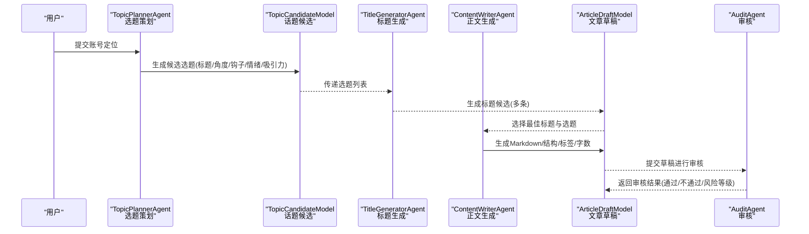
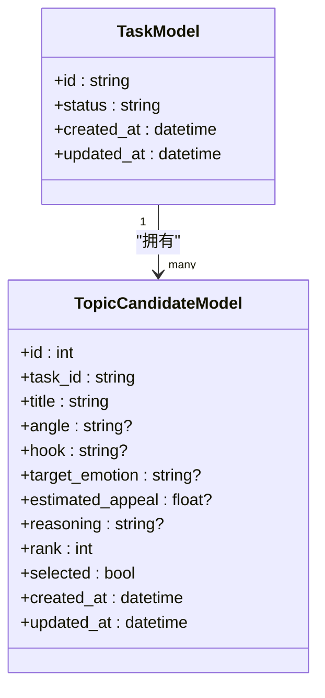
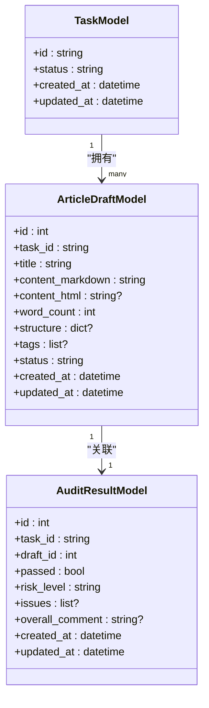
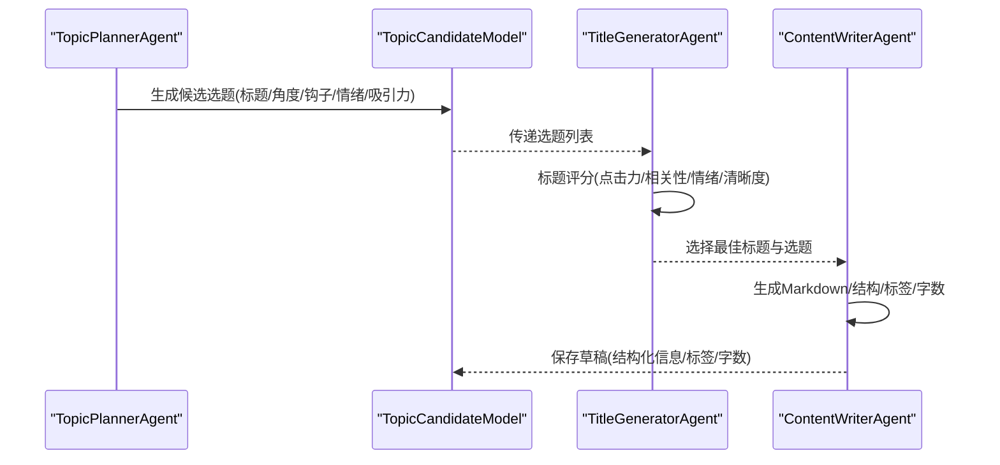
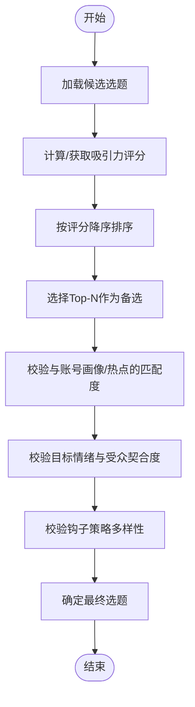
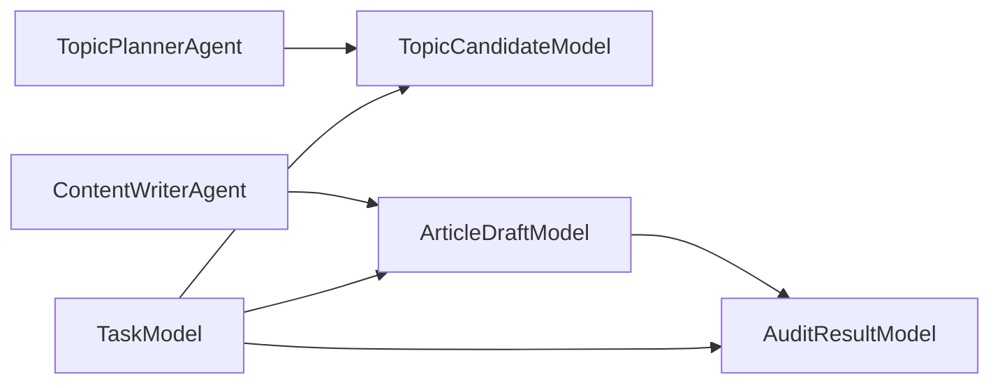
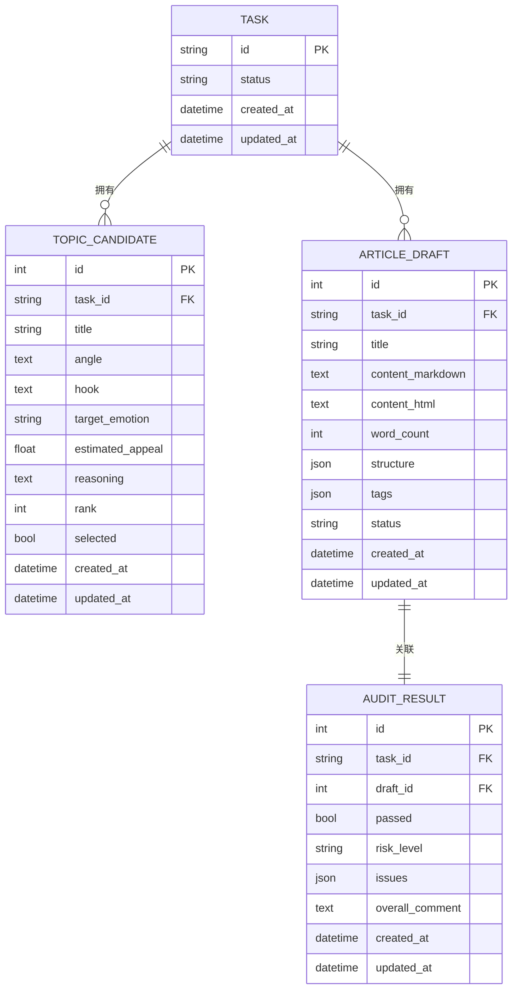

# 内容生成模型

<cite>
**本文引用的文件**
- [backend/app/models/tables.py](file://backend/app/models/tables.py)
- [backend/app/models/__init__.py](file://backend/app/models/__init__.py)
- [backend/app/schemas/task.py](file://backend/app/schemas/task.py)
- [backend/app/agents/topic_planner_agent.py](file://backend/app/agents/topic_planner_agent.py)
- [backend/app/agents/content_writer_agent.py](file://backend/app/agents/content_writer_agent.py)
- [ARCHITECTURE.md](file://ARCHITECTURE.md)
</cite>

## 目录
1. [简介](#简介)
2. [项目结构](#项目结构)
3. [核心组件](#核心组件)
4. [架构总览](#架构总览)
5. [详细组件分析](#详细组件分析)
6. [依赖分析](#依赖分析)
7. [性能考虑](#性能考虑)
8. [故障排查指南](#故障排查指南)
9. [结论](#结论)
10. [附录](#附录)

## 简介
本文聚焦于HotClaw内容生成流水线中的两个关键数据模型：TopicCandidateModel（话题候选）与ArticleDraftModel（文章草稿）。围绕这两个模型，我们将系统阐述其设计理念、字段含义、数据流转与处理逻辑，并结合工作流与代理行为，给出选题生成与评估机制、草稿状态管理与结构化存储方式，以及内容生成流程的最佳实践。

## 项目结构
与内容生成模型直接相关的核心位置如下：
- 后端模型定义位于 backend/app/models/tables.py，包含 TopicCandidateModel 与 ArticleDraftModel 的表结构与关系。
- 模型导出入口位于 backend/app/models/__init__.py，统一暴露给应用其他模块。
- 任务相关Schema位于 backend/app/schemas/task.py，用于任务生命周期与结果数据的结构化描述。
- 代理实现位于 backend/app/agents/，其中 TopicPlannerAgent 与 ContentWriterAgent 分别负责选题生成与正文生成。
- 架构文档 ARCHITECTURE.md 提供了工作流节点、代理职责与输出结构的权威说明。

```mermaid
graph TB
subgraph "后端模型"
T["TaskModel<br/>任务表"]
TC["TopicCandidateModel<br/>话题候选"]
AD["ArticleDraftModel<br/>文章草稿"]
AR["AuditResultModel<br/>审核结果"]
end
subgraph "代理"
TP["TopicPlannerAgent<br/>选题策划"]
CW["ContentWriterAgent<br/>正文生成"]
end
subgraph "架构"
WF["默认流水线节点<br/>profile → hot_topic → topic_planning → title_generation → content_writing → audit"]
end
TP --> TC
TC --> CW
CW --> AD
AD --> AR
T <-- TC
T <-- AD
T <-- AR
```

图表来源
- [backend/app/models/tables.py:23-46](file://backend/app/models/tables.py#L23-L46)
- [backend/app/models/tables.py:97-117](file://backend/app/models/tables.py#L97-L117)
- [backend/app/models/tables.py:119-138](file://backend/app/models/tables.py#L119-L138)
- [backend/app/models/tables.py:141-158](file://backend/app/models/tables.py#L141-L158)
- [backend/app/agents/topic_planner_agent.py:39-70](file://backend/app/agents/topic_planner_agent.py#L39-L70)
- [backend/app/agents/content_writer_agent.py:46-122](file://backend/app/agents/content_writer_agent.py#L46-L122)
- [ARCHITECTURE.md:765-799](file://ARCHITECTURE.md#L765-L799)

章节来源
- [backend/app/models/tables.py:1-233](file://backend/app/models/tables.py#L1-L233)
- [backend/app/models/__init__.py:1-28](file://backend/app/models/__init__.py#L1-L28)
- [backend/app/schemas/task.py:1-83](file://backend/app/schemas/task.py#L1-L83)
- [backend/app/agents/topic_planner_agent.py:1-88](file://backend/app/agents/topic_planner_agent.py#L1-L88)
- [backend/app/agents/content_writer_agent.py:1-131](file://backend/app/agents/content_writer_agent.py#L1-L131)
- [ARCHITECTURE.md:600-799](file://ARCHITECTURE.md#L600-L799)

## 核心组件
本节对 TopicCandidateModel 与 ArticleDraftModel 的字段、关系与职责进行逐项说明，并结合代理输出与架构文档，解释它们在内容生成流水线中的作用。

- TopicCandidateModel（话题候选）
  - 用途：记录“选题策划”阶段产出的候选主题，包含标题、切入角度、钩子策略、目标情绪、预估吸引力与排序等信息。
  - 关键字段与语义
    - 标题：选题主题方向，字符串，长度限制。
    - 角度：切入角度说明，文本，可为空。
    - 钩子：吸引读者的钩子类型（如“恐惧+自检”、“案例+希望”、“时效+实用”），文本，可为空。
    - 目标情绪：目标触发情绪（如“焦虑感”、“希望感”、“好奇心”），字符串，可为空。
    - 预估吸引力：0-1之间的浮点数，表示预估传播潜力。
    - 排名：整数，用于排序与选择。
    - 选中：布尔值，标记是否被选中作为最终标题或进入正文生成。
    - 时间戳：创建与更新时间，便于审计与追踪。
  - 关系：属于某任务（task_id 外键），与 TaskModel 一对多。
  - 选题选择与排序逻辑
    - 代理输出包含多个候选及预估吸引力评分，按吸引力降序排列。
    - 选择策略：通常选择吸引力最高且与账号画像匹配的选题；若存在多个备选，可按排名字段进行二次筛选。
  - 评估机制
    - 评估维度：点击力、相关性、情绪、清晰度等（依据架构文档中标题评分Skill的维度说明）。
    - 评分来源：代理提示词中要求输出评分与理由，便于后续排序与人工复核。

- ArticleDraftModel（文章草稿）
  - 用途：记录“正文生成”阶段产出的草稿，包含标题、Markdown正文、HTML转换、字数统计、结构化信息与标签系统等。
  - 关键字段与语义
    - 标题：文章标题，字符串，长度限制。
    - Markdown内容：正文内容，Markdown格式，必填。
    - HTML内容：可选，由Markdown转换而来，便于前端展示。
    - 字数统计：整数，正文字数统计，用于质量与合规控制。
    - 结构化信息：JSON对象，包含文章结构（如章节标题与摘要），便于生成目录与摘要。
    - 标签：字符串数组，4-6个，用于分类与检索。
    - 状态：草稿状态枚举，默认“draft”，支持后续发布/退回/重审等状态演进。
    - 时间戳：创建与更新时间，便于审计与追踪。
  - 关系：属于某任务（task_id 外键），与 TaskModel 一对多；一对一关联审核结果（AuditResultModel）。
  - 草稿状态管理
    - 初始状态为“草稿”，经审核后可能变为“通过/不通过/高风险”等状态，审核结果与风险等级记录在 AuditResultModel。
  - 结构化存储方式
    - 结构信息以JSON存储，便于查询与渲染；标签以数组存储，便于过滤与聚合。

章节来源
- [backend/app/models/tables.py:97-117](file://backend/app/models/tables.py#L97-L117)
- [backend/app/models/tables.py:119-138](file://backend/app/models/tables.py#L119-L138)
- [backend/app/agents/topic_planner_agent.py:22-37](file://backend/app/agents/topic_planner_agent.py#L22-L37)
- [backend/app/agents/content_writer_agent.py:24-44](file://backend/app/agents/content_writer_agent.py#L24-L44)
- [ARCHITECTURE.md:600-632](file://ARCHITECTURE.md#L600-L632)

## 架构总览
内容生成流水线由多个节点组成，TopicCandidateModel 与 ArticleDraftModel 分别承载“选题”与“正文”的中间产物与最终产物。下图展示了从账号画像到文章草稿的关键数据流转：



图表来源
- [ARCHITECTURE.md:765-799](file://ARCHITECTURE.md#L765-L799)
- [backend/app/agents/topic_planner_agent.py:39-70](file://backend/app/agents/topic_planner_agent.py#L39-L70)
- [backend/app/agents/content_writer_agent.py:46-122](file://backend/app/agents/content_writer_agent.py#L46-L122)
- [backend/app/models/tables.py:97-117](file://backend/app/models/tables.py#L97-L117)
- [backend/app/models/tables.py:119-138](file://backend/app/models/tables.py#L119-L138)

## 详细组件分析

### TopicCandidateModel（话题候选）分析
- 设计理念
  - 以“可评估、可排序、可选择”为核心目标，为后续标题生成与正文生成提供高质量输入。
  - 字段覆盖选题的“标题、角度、钩子、情绪、吸引力”等关键要素，便于多维评估与人工复核。
- 评估与排序机制
  - 代理输出包含预估吸引力评分与理由，结合账号画像与热点趋势，形成可解释的排序依据。
  - 排名字段可用于二次筛选与A/B对比实验。
- 与ArticleDraftModel的关系
  - 选题经标题生成后，进入正文生成阶段，最终沉淀为文章草稿。



图表来源
- [backend/app/models/tables.py:23-46](file://backend/app/models/tables.py#L23-L46)
- [backend/app/models/tables.py:97-117](file://backend/app/models/tables.py#L97-L117)

章节来源
- [backend/app/models/tables.py:97-117](file://backend/app/models/tables.py#L97-L117)
- [backend/app/agents/topic_planner_agent.py:22-37](file://backend/app/agents/topic_planner_agent.py#L22-L37)

### ArticleDraftModel（文章草稿）分析
- 设计理念
  - 以“结构化、可审计、可扩展”为目标，支持从草稿到发布的全生命周期管理。
  - 结构化信息与标签系统便于内容检索与运营自动化。
- 字段与职责
  - 标题与Markdown内容：保证内容可读性与可编辑性。
  - HTML转换：便于前端即时渲染与预览。
  - 字数统计：用于内容长度控制与合规检查。
  - 结构化信息：章节标题与摘要，支撑目录生成与摘要提取。
  - 标签系统：4-6个标签，兼顾检索与人工标注。
  - 状态管理：草稿/发布/退回/重审等状态演进，配合审核结果模型。
- 与审核流程的关系
  - 草稿与审核结果模型建立一对一关系，确保每次审核都有据可查。



图表来源
- [backend/app/models/tables.py:119-138](file://backend/app/models/tables.py#L119-L138)
- [backend/app/models/tables.py:141-158](file://backend/app/models/tables.py#L141-L158)

章节来源
- [backend/app/models/tables.py:119-138](file://backend/app/models/tables.py#L119-L138)
- [backend/app/models/tables.py:141-158](file://backend/app/models/tables.py#L141-L158)
- [backend/app/agents/content_writer_agent.py:24-44](file://backend/app/agents/content_writer_agent.py#L24-L44)

### 选题生成与评估流程（序列图）


图表来源
- [backend/app/agents/topic_planner_agent.py:39-70](file://backend/app/agents/topic_planner_agent.py#L39-L70)
- [backend/app/agents/content_writer_agent.py:46-122](file://backend/app/agents/content_writer_agent.py#L46-L122)
- [ARCHITECTURE.md:600-632](file://ARCHITECTURE.md#L600-L632)

章节来源
- [backend/app/agents/topic_planner_agent.py:1-88](file://backend/app/agents/topic_planner_agent.py#L1-L88)
- [backend/app/agents/content_writer_agent.py:1-131](file://backend/app/agents/content_writer_agent.py#L1-L131)
- [ARCHITECTURE.md:600-632](file://ARCHITECTURE.md#L600-L632)

### 选题选择与排序逻辑（流程图）


图表来源
- [backend/app/agents/topic_planner_agent.py:22-37](file://backend/app/agents/topic_planner_agent.py#L22-L37)

章节来源
- [backend/app/agents/topic_planner_agent.py:22-37](file://backend/app/agents/topic_planner_agent.py#L22-L37)

## 依赖分析
- 模型依赖
  - TopicCandidateModel 与 ArticleDraftModel 均依赖 TaskModel，通过外键 task_id 关联，形成“任务-候选/草稿”的层次关系。
  - ArticleDraftModel 与 AuditResultModel 建立一对一关系，用于记录审核结果。
- 代理与模型交互
  - TopicPlannerAgent 生成 TopicCandidateModel 记录；ContentWriterAgent 生成 ArticleDraftModel 记录。
- 架构约束
  - 架构文档明确了各节点的输入输出与依赖Skill，为模型字段设计提供了依据（如标题评分维度、正文结构与标签规范）。



图表来源
- [backend/app/models/tables.py:23-46](file://backend/app/models/tables.py#L23-L46)
- [backend/app/models/tables.py:97-117](file://backend/app/models/tables.py#L97-L117)
- [backend/app/models/tables.py:119-138](file://backend/app/models/tables.py#L119-L138)
- [backend/app/models/tables.py:141-158](file://backend/app/models/tables.py#L141-L158)

章节来源
- [backend/app/models/tables.py:23-46](file://backend/app/models/tables.py#L23-L46)
- [backend/app/models/tables.py:97-117](file://backend/app/models/tables.py#L97-L117)
- [backend/app/models/tables.py:119-138](file://backend/app/models/tables.py#L119-L138)
- [backend/app/models/tables.py:141-158](file://backend/app/models/tables.py#L141-L158)

## 性能考虑
- 数据库层面
  - 为 task_id 建立索引，加速按任务查询候选与草稿。
  - 对 estimated_appeal、rank、selected 等字段建立索引，优化排序与筛选。
- 代理执行
  - 代理内部存在异步延迟模拟，实际部署中应替换为真实LLM调用与Skill执行，注意超时与重试策略。
- 存储与传输
  - Markdown与HTML内容较大时，建议在前端按需加载与懒渲染，减少首屏压力。
  - 结构化信息与标签采用JSON/数组存储，查询时尽量使用投影字段，避免全量读取。

## 故障排查指南
- 选题缺失或为空
  - 检查 TopicPlannerAgent 的降级策略是否生效，确认热点数据与账号画像输入是否正确。
  - 核对 TopicCandidateModel 是否成功写入，关注 estimated_appeal/rank/selected 字段是否异常。
- 正文生成失败
  - 检查 ContentWriterAgent 的降级返回是否被触发，确认输入的标题与选题是否有效。
  - 校验 ArticleDraftModel 的 Markdown/结构/标签是否为空，必要时回退至上一版本草稿。
- 审核不通过
  - 查看 AuditResultModel 的 issues 与 risk_level，结合整体评论定位问题。
  - 若审核结果缺失，确认审核节点是否正常执行与数据回写。

章节来源
- [backend/app/agents/topic_planner_agent.py:72-87](file://backend/app/agents/topic_planner_agent.py#L72-L87)
- [backend/app/agents/content_writer_agent.py:124-130](file://backend/app/agents/content_writer_agent.py#L124-L130)
- [backend/app/models/tables.py:141-158](file://backend/app/models/tables.py#L141-L158)

## 结论
TopicCandidateModel 与 ArticleDraftModel 在HotClaw内容生成流水线中分别承担“选题候选”与“文章草稿”的核心角色。前者通过多维度评估与排序，为标题与正文生成提供高质量输入；后者以结构化方式承载正文、结构、标签与状态，支撑审核与发布流程。二者与TaskModel、AuditResultModel共同构成内容生产的完整数据闭环。遵循本文提供的字段设计、状态管理与流程最佳实践，可显著提升内容生成的稳定性与可维护性。

## 附录
- 数据模型ER图（概览）


图表来源
- [backend/app/models/tables.py:23-46](file://backend/app/models/tables.py#L23-L46)
- [backend/app/models/tables.py:97-117](file://backend/app/models/tables.py#L97-L117)
- [backend/app/models/tables.py:119-138](file://backend/app/models/tables.py#L119-L138)
- [backend/app/models/tables.py:141-158](file://backend/app/models/tables.py#L141-L158)