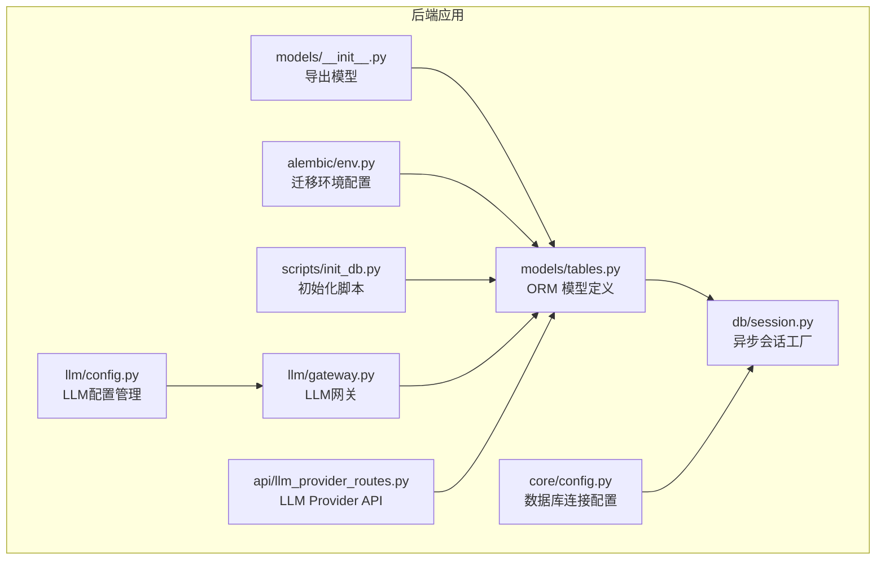
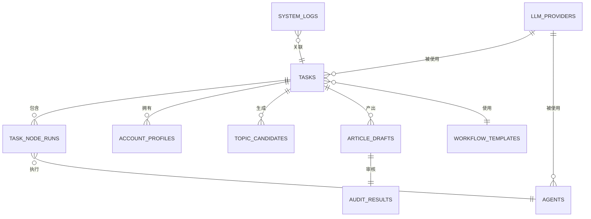
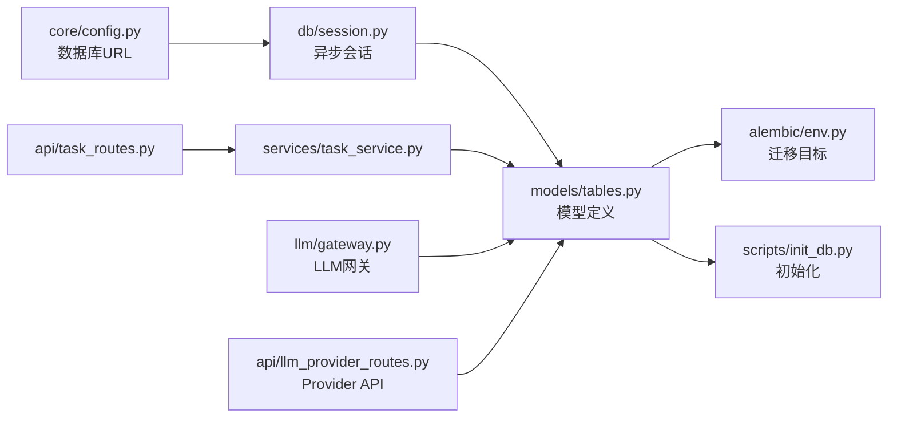

# 数据库模型设计

<cite>
**本文引用的文件**
- [tables.py](file://backend/app/models/tables.py)
- [session.py](file://backend/app/db/session.py)
- [__init__.py](file://backend/app/models/__init__.py)
- [init_db.py](file://scripts/init_db.py)
- [env.py](file://backend/alembic/env.py)
- [config.py](file://backend/app/core/config.py)
- [task_routes.py](file://backend/app/api/task_routes.py)
- [task_service.py](file://backend/app/services/task_service.py)
- [llm_provider_routes.py](file://backend/app/api/llm_provider_routes.py)
- [gateway.py](file://backend/app/llm/gateway.py)
- [config.py](file://backend/app/llm/config.py)
- [page.tsx](file://frontend/app/settings/llm-providers/page.tsx)
- [api.ts](file://frontend/lib/api.ts)
- [ARCHITECTURE.md](file://ARCHITECTURE.md)
</cite>

## 更新摘要
**变更内容**
- 新增LLMProviderModel数据库表，支持用户配置的LLM提供商持久化存储
- 新增LLM Provider管理API，包括CRUD操作和连接测试功能
- 新增前端LLM Provider配置界面，支持多种主流LLM提供商
- 更新数据库架构以支持动态LLM Provider配置

## 目录
1. [简介](#简介)
2. [项目结构](#项目结构)
3. [核心组件](#核心组件)
4. [架构总览](#架构总览)
5. [详细组件分析](#详细组件分析)
6. [依赖分析](#依赖分析)
7. [性能考量](#性能考量)
8. [故障排查指南](#故障排查指南)
9. [结论](#结论)
10. [附录](#附录)

## 简介
本文件系统化梳理 HotClaw 的数据库模型设计，围绕核心数据模型 TaskModel、TaskNodeRunModel、AccountProfileModel、TopicCandidateModel、ArticleDraftModel、AuditResultModel、AgentModel、SkillModel、WorkflowTemplateModel、SystemLogModel 和新增的 LLMProviderModel，逐项说明字段定义、数据类型、约束条件、业务含义与模型间关系映射。同时阐述 ORM 配置、主键设计、索引策略，并给出扩展指南与最佳实践建议，帮助开发者在现有架构上安全地演进与扩展。

## 项目结构
数据库模型集中于后端应用的 models 子模块，采用 SQLAlchemy 2.0 声明式 ORM，配合 Alembic 进行异步迁移。数据库会话通过 async SQLAlchemy 管理，支持 SQLite（开发）与 PostgreSQL（生产）两种模式。新增的 LLMProviderModel 为系统提供了灵活的LLM提供商配置能力。

**图表来源**
- [tables.py:1-285](file://backend/app/models/tables.py#L1-L285)
- [session.py:1-33](file://backend/app/db/session.py#L1-L33)
- [__init__.py:1-28](file://backend/app/models/__init__.py#L1-L28)
- [env.py:1-53](file://backend/alembic/env.py#L1-L53)
- [config.py:1-51](file://backend/app/core/config.py#L1-L51)
- [init_db.py:1-15](file://scripts/init_db.py#L1-L15)
- [gateway.py:1-440](file://backend/app/llm/gateway.py#L1-L440)
- [config.py:1-185](file://backend/app/llm/config.py#L1-L185)
- [llm_provider_routes.py:1-326](file://backend/app/api/llm_provider_routes.py#L1-L326)

**章节来源**
- [tables.py:1-285](file://backend/app/models/tables.py#L1-L285)
- [session.py:1-33](file://backend/app/db/session.py#L1-L33)
- [__init__.py:1-28](file://backend/app/models/__init__.py#L1-L28)
- [env.py:1-53](file://backend/alembic/env.py#L1-L53)
- [config.py:1-51](file://backend/app/core/config.py#L1-L51)
- [init_db.py:1-15](file://scripts/init_db.py#L1-L15)

## 核心组件
本节概述所有核心数据模型的职责与关键字段，便于快速建立整体认知。

- TaskModel：任务生命周期的根实体，承载任务状态、输入输出、计时与计费统计，以及与子实体的一对多关系。
- TaskNodeRunModel：节点级执行记录，记录每个 Agent 在任务中的执行状态、输入输出、耗时与 Token 消耗。
- AccountProfileModel：从用户输入解析得到的账号画像，一对一绑定到任务。
- TopicCandidateModel：由主题策划 Agent 生成的候选主题集合，一对多绑定到任务。
- ArticleDraftModel：生成的文章草稿，包含标题、Markdown 内容、HTML 预览、标签与状态。
- AuditResultModel：文章草稿的审核结果，一对一绑定到草稿。
- AgentModel：Agent 的持久化配置，主键为 agent_id，保存模型配置、Schema、技能依赖等。
- SkillModel：Skill 的持久化配置，主键为 skill_id，保存输入输出 Schema 与配置数据。
- WorkflowTemplateModel：工作流模板定义，主键为 workflow_id，保存模板定义、输入输出映射与状态。
- SystemLogModel：结构化系统日志，支持按 trace_id、task_id 查询与审计。
- **LLMProviderModel：LLM 提供商配置，主键为 provider_id，保存用户自定义的API密钥、基础URL、默认模型等配置信息**。

**章节来源**
- [tables.py:23-285](file://backend/app/models/tables.py#L23-L285)

## 架构总览
数据库模型与运行时服务的交互关系如下，新增了LLM Provider相关的组件：

**图表来源**
- [tables.py:23-285](file://backend/app/models/tables.py#L23-L285)
- [gateway.py:24-440](file://backend/app/llm/gateway.py#L24-L440)

**章节来源**
- [tables.py:23-285](file://backend/app/models/tables.py#L23-L285)
- [ARCHITECTURE.md:1500-1507](file://ARCHITECTURE.md#L1500-L1507)

## 详细组件分析

### TaskModel（任务模型）
- 字段与类型
  - id：字符串，主键，长度限制 64。
  - workflow_id：字符串，非空，长度限制 64，关联工作流模板。
  - status：字符串，非空，长度限制 20，默认 pending。
  - input_data：JSON，可空，存储任务输入。
  - result_data：JSON，可空，存储任务结果。
  - error_message：文本，可空，错误信息。
  - started_at/completed_at：时间戳，可空。
  - elapsed_seconds：浮点数，可空，总耗时秒。
  - total_tokens：整数，可空，默认 0，总 Token 消耗。
  - created_at/updated_at：时间戳，非空，服务器默认值与更新触发。
- 业务含义
  - 描述一次内容生产的完整生命周期，包含状态推进、计时与计费统计。
- 关系映射
  - 一对多：node_runs（节点执行记录）、topic_candidates（候选主题）、article_drafts（文章草稿）。
  - 一对一：account_profile（账号画像）。
- 约束与索引
  - 无显式索引，建议按 workflow_id、status、created_at 建立复合索引以优化查询。
- 性能与扩展
  - 建议对高频过滤字段（workflow_id、status）建立索引。
  - 对 input_data/result_data 建立 GIN 索引（PostgreSQL）以加速 JSON 查询。

**章节来源**
- [tables.py:23-46](file://backend/app/models/tables.py#L23-L46)
- [task_routes.py:19-163](file://backend/app/api/task_routes.py#L19-L163)
- [task_service.py:20-126](file://backend/app/services/task_service.py#L20-L126)

### TaskNodeRunModel（节点执行记录）
- 字段与类型
  - id：整数，主键，自增。
  - task_id：字符串，外键指向 tasks.id，非空。
  - node_id：字符串，长度限制 64，节点标识。
  - agent_id：字符串，长度限制 64，执行的 Agent。
  - status：字符串，长度限制 20，默认 pending。
  - input_data/output_data：JSON，可空。
  - error_message：文本，可空。
  - degraded：布尔，默认 false，是否降级执行。
  - started_at/completed_at/elapsed_seconds：时间戳与耗时，可空。
  - prompt_tokens/completion_tokens：整数，可空，默认 0。
  - model_used：字符串，长度限制 64，可空。
  - retry_count：整数，非空，默认 0。
  - created_at/updated_at：时间戳，服务器默认值与更新触发。
- 业务含义
  - 记录每个 Agent 节点的执行详情，支持回放与审计。
- 关系映射
  - 多对一：task（所属任务）。
- 约束与索引
  - 建议对 task_id、agent_id、status 建立索引，提升节点查询与聚合统计性能。
- 性能与扩展
  - 建议对 JSON 字段建立 GIN 索引（PostgreSQL）。
  - 对频繁排序字段（id、created_at）建立索引。

**章节来源**
- [tables.py:48-74](file://backend/app/models/tables.py#L48-L74)
- [task_routes.py:110-134](file://backend/app/api/task_routes.py#L110-L134)
- [task_service.py:104-122](file://backend/app/services/task_service.py#L104-L122)

### AccountProfileModel（账号配置）
- 字段与类型
  - id：整数，主键，自增。
  - task_id：字符串，外键指向 tasks.id，唯一约束，非空。
  - positioning：文本，非空，账号定位描述。
  - domain/subdomain：字符串，长度限制 100，可空。
  - target_audience：JSON，可空，目标受众结构化数据。
  - tone/content_style：字符串，长度限制 50，可空。
  - keywords：JSON，可空，关键词列表。
  - created_at/updated_at：时间戳，服务器默认值与更新触发。
- 业务含义
  - 从用户输入解析得到的账号画像，供后续节点使用。
- 关系映射
  - 一对一：task（所属任务）。
- 约束与索引
  - 建议对 task_id 建立唯一索引（已通过唯一约束实现）。
- 性能与扩展
  - target_audience/keywords 建议在 PostgreSQL 上使用 GIN 索引。

**章节来源**
- [tables.py:76-95](file://backend/app/models/tables.py#L76-L95)

### TopicCandidateModel（话题候选）
- 字段与类型
  - id：整数，主键，自增。
  - task_id：字符串，外键指向 tasks.id，非空。
  - title：字符串，长度限制 200，非空。
  - angle/hook/reasoning：文本，可空。
  - target_emotion：字符串，长度限制 50，可空。
  - estimated_appeal：浮点数，可空。
  - rank：整数，非空，默认 0。
  - selected：布尔，默认 false。
  - created_at/updated_at：时间戳，服务器默认值与更新触发。
- 业务含义
  - 候选主题集合，支持排序与选择。
- 关系映射
  - 多对一：task（所属任务）。
- 约束与索引
  - 建议对 task_id、rank、selected 建立索引。
- 性能与扩展
  - 对 title 建议建立全文索引（PostgreSQL）以支持模糊检索。

**章节来源**
- [tables.py:97-117](file://backend/app/models/tables.py#L97-L117)

### ArticleDraftModel（文章草稿）
- 字段与类型
  - id：整数，主键，自增。
  - task_id：字符串，外键指向 tasks.id，非空。
  - title：字符串，长度限制 200，非空。
  - content_markdown：文本，非空。
  - content_html：文本，可空。
  - word_count：整数，非空，默认 0。
  - structure/tags：JSON，可空。
  - status：字符串，长度限制 20，默认 draft。
  - created_at/updated_at：时间戳，服务器默认值与更新触发。
- 业务含义
  - 生成的文章草稿，支持 Markdown 与 HTML 预览。
- 关系映射
  - 多对一：task（所属任务）。
  - 一对一：audit_result（审核结果）。
- 约束与索引
  - 建议对 task_id、status 建立索引。
- 性能与扩展
  - content_markdown 建议建立 GIN 索引（PostgreSQL）以加速全文检索。

**章节来源**
- [tables.py:119-139](file://backend/app/models/tables.py#L119-L139)

### AuditResultModel（审核结果）
- 字段与类型
  - id：整数，主键，自增。
  - task_id：字符串，外键指向 tasks.id，非空。
  - draft_id：整数，外键指向 article_drafts.id，非空。
  - passed：布尔，默认 false。
  - risk_level：字符串，长度限制 20，默认 low。
  - issues：JSON，可空，风险项列表。
  - overall_comment：文本，可空。
  - created_at/updated_at：时间戳，服务器默认值与更新触发。
- 业务含义
  - 文章草稿的审核结果，支持风险等级与问题明细。
- 关系映射
  - 多对一：draft（所属草稿）。
- 约束与索引
  - 建议对 draft_id、risk_level 建立索引。
- 性能与扩展
  - issues 建议在 PostgreSQL 上使用 GIN 索引。

**章节来源**
- [tables.py:141-158](file://backend/app/models/tables.py#L141-L158)

### AgentModel（智能体配置）
- 字段与类型
  - agent_id：字符串，主键，长度限制 64。
  - name/description：字符串/文本，非空/可空。
  - version：字符串，长度限制 20，默认 1.0.0。
  - module_path：字符串，长度限制 200，非空。
  - model_config_data：JSON，可空。
  - prompt_template：文本，可空。
  - input_schema/output_schema：JSON，可空。
  - required_skills：JSON，可空。
  - retry_config/fallback_config：JSON，可空。
  - status：字符串，长度限制 20，默认 active。
  - created_at/updated_at：时间戳，服务器默认值与更新触发。
- 业务含义
  - 智能体的声明式配置，支持版本化与状态管理。
- 关系映射
  - 与 TaskNodeRunModel 通过 agent_id 关联（运行时记录）。
- 约束与索引
  - 建议对 status 建立索引。
- 性能与扩展
  - 配置数据量较大时，建议拆分表或使用 JSONB 索引（PostgreSQL）。

**章节来源**
- [tables.py:160-181](file://backend/app/models/tables.py#L160-L181)

### SkillModel（技能配置）
- 字段与类型
  - skill_id：字符串，主键，长度限制 64。
  - name/description：字符串/文本，非空/可空。
  - version：字符串，长度限制 20，默认 1.0.0。
  - module_path：字符串，长度限制 200，非空。
  - input_schema/output_schema：JSON，可空。
  - config_data：JSON，可空。
  - status：字符串，长度限制 20，默认 active。
  - created_at/updated_at：时间戳，服务器默认值与更新触发。
- 业务含义
  - 技能的声明式配置，支持版本化与状态管理。
- 约束与索引
  - 建议对 status 建立索引。
- 性能与扩展
  - 配置数据量较大时，建议拆分表或使用 JSONB 索引（PostgreSQL）。

**章节来源**
- [tables.py:183-200](file://backend/app/models/tables.py#L183-L200)

### WorkflowTemplateModel（工作流模板）
- 字段与类型
  - workflow_id：字符串，主键，长度限制 64。
  - name/description：字符串/文本，非空/可空。
  - version：字符串，长度限制 20，默认 1.0.0。
  - definition：JSON，非空，模板定义。
  - input_schema/output_mapping：JSON，可空。
  - status：字符串，长度限制 20，默认 active。
  - created_at/updated_at：时间戳，服务器默认值与更新触发。
- 业务含义
  - 工作流模板的声明式定义，支持版本化与状态管理。
- 关系映射
  - 与 TaskModel 通过 workflow_id 关联（运行时绑定）。
- 约束与索引
  - 建议对 status 建立索引。
- 性能与扩展
  - definition 建议在 PostgreSQL 上使用 GIN 索引。

**章节来源**
- [tables.py:202-218](file://backend/app/models/tables.py#L202-L218)

### SystemLogModel（系统日志）
- 字段与类型
  - id：整数，主键，自增。
  - trace_id：字符串，长度限制 64，可空，建立索引。
  - task_id：字符串，长度限制 64，可空，建立索引。
  - node_id：字符串，长度限制 64，可空。
  - level：字符串，长度限制 10，默认 INFO。
  - module：字符串，长度限制 100，可空。
  - message：文本，非空。
  - context：JSON，可空。
  - created_at：时间戳，非空，服务器默认值。
- 业务含义
  - 结构化系统日志，支持按 trace_id、task_id 查询与审计。
- 约束与索引
  - 建议对 trace_id、task_id 建立索引。
- 性能与扩展
  - context 建议在 PostgreSQL 上使用 GIN 索引。
  - 建议按 level、module 建立二级索引以加速筛选。

**章节来源**
- [tables.py:220-233](file://backend/app/models/tables.py#L220-L233)

### LLMProviderModel（LLM提供商配置）
- 字段与类型
  - provider_id：字符串，主键，长度限制 32，如 "openai"、"dashscope"、"deepseek"、"zhipu"、"ollama"、"custom"。
  - name：字符串，非空，长度限制 100，显示名称，如 "OpenAI"、"DeepSeek"、"Qwen"。
  - description：文本，可空，描述信息。
  - api_key：文本，可空，API Key（建议加密存储）。
  - base_url：字符串，长度限制 500，API Base URL。
  - default_model：字符串，长度限制 100，默认模型。
  - supported_models：JSON，可空，支持的模型列表。
  - is_enabled：布尔，默认 false，是否启用。
  - is_default：布尔，默认 false，是否为默认 Provider。
  - timeout：整数，默认 60，超时时间（秒）。
  - extra_config：JSON，可空，额外配置（如 temperature 默认值等）。
  - status：字符串，长度限制 20，默认 "active"，状态：active、inactive。
  - test_status：字符串，长度限制 20，可空，测试状态：untested、success、failed。
  - test_message：文本，可空，测试消息或错误信息。
  - created_at/updated_at：时间戳，服务器默认值与更新触发。
- 业务含义
  - 用户自定义的 LLM Provider 配置，支持多种主流 LLM 平台的 API 密钥和基础 URL 管理。
- 关系映射
  - 与任务系统无直接外键关联，但通过运行时配置影响任务执行。
- 约束与索引
  - 建议对 provider_id（主键）、is_enabled、is_default、status 建立索引。
- 性能与扩展
  - 配置数据量较小，无需复杂索引。
  - 建议在生产环境对 api_key 进行加密存储。

**章节来源**
- [tables.py:235-285](file://backend/app/models/tables.py#L235-L285)
- [llm_provider_routes.py:94-326](file://backend/app/api/llm_provider_routes.py#L94-L326)
- [gateway.py:60-124](file://backend/app/llm/gateway.py#L60-L124)

## 依赖分析
- ORM 与会话
  - models/tables.py 定义模型，db/session.py 提供异步会话工厂，core/config.py 提供数据库 URL。
  - alembic/env.py 将 Base.metadata 作为迁移目标，init_db.py 通过 create_all 初始化表。
- 业务服务
  - services/task_service.py 通过 TaskModel/TaskNodeRunModel 进行任务生命周期管理。
  - api/task_routes.py 通过 TaskService 提供 REST API。
  - **llm/gateway.py 通过 LLMProviderModel 提供动态 LLM Provider 配置管理**。
  - **api/llm_provider_routes.py 通过 LLMProviderModel 提供 LLM Provider CRUD 操作**。
- 运行时关系
  - TaskModel 与 TaskNodeRunModel 为典型的一对多。
  - ArticleDraftModel 与 AuditResultModel 为典型的 一对一。
  - SystemLogModel 与 TaskModel 为可选关联。
  - **LLMProviderModel 与任务系统通过运行时配置间接关联**。

**图表来源**
- [config.py:7-51](file://backend/app/core/config.py#L7-L51)
- [session.py:1-33](file://backend/app/db/session.py#L1-L33)
- [tables.py:1-285](file://backend/app/models/tables.py#L1-L285)
- [env.py:1-53](file://backend/alembic/env.py#L1-L53)
- [init_db.py:1-15](file://scripts/init_db.py#L1-L15)
- [task_service.py:1-126](file://backend/app/services/task_service.py#L1-L126)
- [task_routes.py:1-163](file://backend/app/api/task_routes.py#L1-L163)
- [gateway.py:1-440](file://backend/app/llm/gateway.py#L1-L440)
- [llm_provider_routes.py:1-326](file://backend/app/api/llm_provider_routes.py#L1-L326)

**章节来源**
- [config.py:7-51](file://backend/app/core/config.py#L7-L51)
- [session.py:1-33](file://backend/app/db/session.py#L1-L33)
- [tables.py:1-285](file://backend/app/models/tables.py#L1-L285)
- [env.py:1-53](file://backend/alembic/env.py#L1-L53)
- [init_db.py:1-15](file://scripts/init_db.py#L1-L15)
- [task_service.py:1-126](file://backend/app/services/task_service.py#L1-L126)
- [task_routes.py:1-163](file://backend/app/api/task_routes.py#L1-L163)
- [gateway.py:1-440](file://backend/app/llm/gateway.py#L1-L440)
- [llm_provider_routes.py:1-326](file://backend/app/api/llm_provider_routes.py#L1-L326)

## 性能考量
- 索引策略
  - 高频过滤字段：task_id（TaskNodeRunModel、TopicCandidateModel、ArticleDraftModel）、workflow_id（TaskModel）、draft_id（AuditResultModel）、trace_id、task_id（SystemLogModel）。
  - 状态字段：status（TaskModel、AgentModel、SkillModel、WorkflowTemplateModel、SystemLogModel、LLMProviderModel）。
  - JSON 字段：input_data、result_data、target_audience、keywords、issues、structure、tags 建议 GIN 索引（PostgreSQL）。
  - **LLM Provider 字段：provider_id（主键）、is_enabled、is_default 建议建立索引**。
- 查询模式
  - 任务列表：按 created_at 倒序分页，建议对 created_at 建立索引。
  - 节点执行：按 task_id 查询，建议对 task_id 建立索引。
  - 审核结果：按 draft_id 查询，建议对 draft_id 建立索引。
  - **LLM Provider：按 is_enabled、is_default 查询，建议对这些字段建立索引**。
- 写入优化
  - 批量插入：使用 bulk_insert_mappings 减少往返。
  - 事务粒度：长事务拆分为短事务，避免长时间锁持有。
  - **LLM Provider：配置变更频繁，建议使用乐观锁或批量更新优化**。
- 存储与归档
  - 历史任务与日志可定期归档到冷存储，减少热表大小。
  - **LLM Provider：API Key 建议加密存储，避免明文泄露**。

## 故障排查指南
- 数据库连接
  - 确认 DATABASE_URL 配置正确（SQLite/PostgreSQL），开发环境默认 SQLite。
  - 检查会话工厂是否正确注入，异常时会自动回滚并关闭。
- 迁移与初始化
  - 使用 Alembic 在线迁移或 init_db.py 初始化表结构。
  - 确保 Base.metadata 与迁移目标一致。
  - **LLM Provider：首次使用前需初始化 llm_providers 表**。
- 日志与追踪
  - SystemLogModel 记录 trace_id、task_id、node_id，便于端到端追踪。
  - 结构化日志通过 structlog 输出，支持 JSON 渲染与级别筛选。
  - **LLM Provider：测试连接时的日志记录，便于排查配置问题**。
- 常见问题
  - 外键约束错误：检查关联字段类型与长度是否匹配。
  - JSON 字段查询慢：为 JSON 字段建立 GIN 索引。
  - 任务状态不更新：确认 TaskService 的状态推进逻辑与异常处理。
  - **LLM Provider：API Key 无效或过期，检查数据库中的配置和测试结果**。
  - **LLM Provider：默认 Provider 未设置，检查 is_default 字段和测试状态**。

**章节来源**
- [config.py:7-51](file://backend/app/core/config.py#L7-L51)
- [session.py:1-33](file://backend/app/db/session.py#L1-L33)
- [env.py:1-53](file://backend/alembic/env.py#L1-L53)
- [init_db.py:1-15](file://scripts/init_db.py#L1-L15)
- [logger.py:1-36](file://backend/app/core/logger.py#L1-L36)
- [tracer.py:1-34](file://backend/app/core/tracer.py#L1-L34)
- [llm_provider_routes.py:183-284](file://backend/app/api/llm_provider_routes.py#L183-L284)

## 结论
HotClaw 的数据库模型以任务为中心，围绕任务生命周期与节点执行记录构建了清晰的数据结构。新增的 LLMProviderModel 为系统提供了灵活的 LLM 提供商配置能力，支持用户自定义 API Key 和基础 URL，实现了可审计、可回放与可扩展的系统能力。通过声明式配置（Agent/Skill/Workflow）与结构化日志，以及动态 LLM Provider 管理，系统能够适应不同的 LLM 平台需求。建议在生产环境中完善索引策略、优化 JSON 查询性能，并结合归档与冷存储降低热表压力，同时确保 LLM Provider 配置的安全性。

## 附录
- 扩展指南
  - 新增模型：遵循现有命名与字段风格，定义主键与外键，补充关系映射与索引建议。
  - 字段变更：使用 Alembic 生成迁移脚本，确保向后兼容与数据完整性。
  - 性能优化：根据查询模式与数据分布调整索引，必要时拆分表或引入物化视图。
  - **LLM Provider 扩展：新增支持的 LLM 平台时，需在前端模板中添加对应配置，并在后端 Provider 类中实现相应支持**。
- 最佳实践
  - 使用 JSON/JSONB 存储半结构化数据，配合 GIN 索引提升查询效率。
  - 保持字段长度与业务语义一致，避免过长或过短导致的存储浪费。
  - 对高频更新字段（updated_at）与时间戳字段建立索引，支持排序与范围查询。
  - 对外键字段进行一致性校验，避免孤儿记录与悬挂引用。
  - **LLM Provider 配置：API Key 建议加密存储，定期轮换；提供连接测试功能，确保配置有效性**。
  - **LLM Provider 管理：支持多 Provider 并存，通过 is_default 字段控制默认选择，提供启用/禁用机制**。