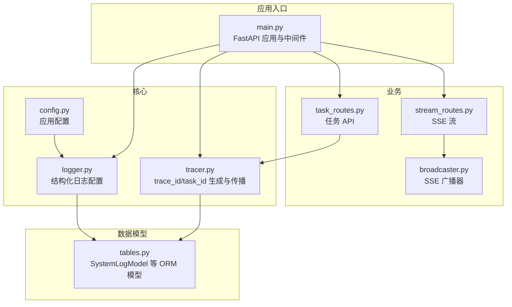
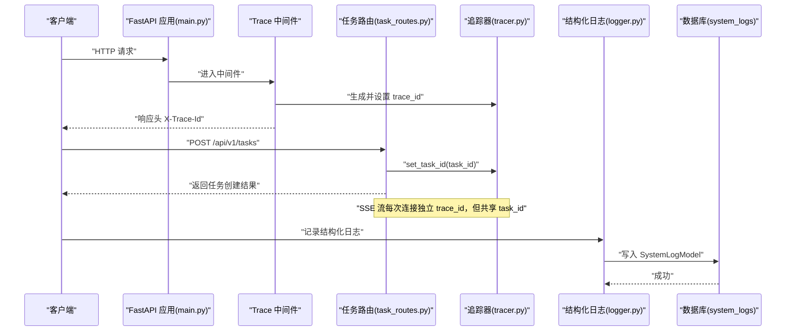
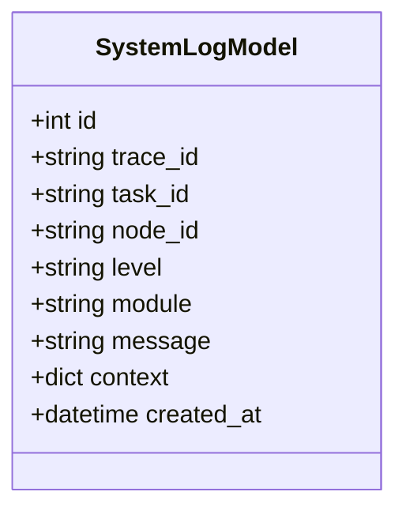
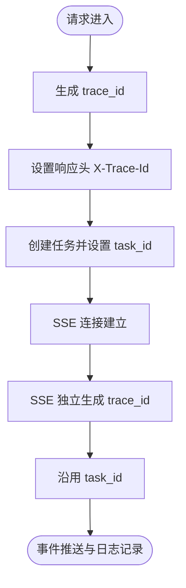
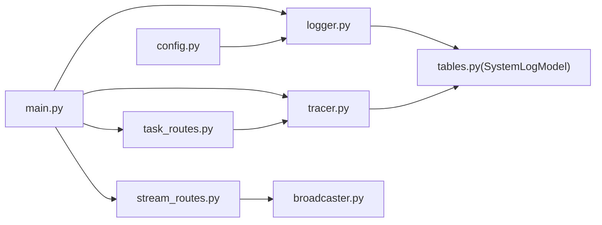

# 日志系统模型

<cite>
**本文引用的文件**
- [backend/app/models/tables.py](file://backend/app/models/tables.py)
- [backend/app/core/logger.py](file://backend/app/core/logger.py)
- [backend/app/core/tracer.py](file://backend/app/core/tracer.py)
- [backend/app/main.py](file://backend/app/main.py)
- [backend/app/orchestrator/broadcaster.py](file://backend/app/orchestrator/broadcaster.py)
- [backend/app/api/stream_routes.py](file://backend/app/api/stream_routes.py)
- [backend/app/api/task_routes.py](file://backend/app/api/task_routes.py)
- [backend/app/core/config.py](file://backend/app/core/config.py)
- [ARCHITECTURE.md](file://ARCHITECTURE.md)
</cite>

## 目录
1. [简介](#简介)
2. [项目结构](#项目结构)
3. [核心组件](#核心组件)
4. [架构总览](#架构总览)
5. [详细组件分析](#详细组件分析)
6. [依赖分析](#依赖分析)
7. [性能考虑](#性能考虑)
8. [故障排查指南](#故障排查指南)
9. [结论](#结论)
10. [附录](#附录)

## 简介
本技术文档围绕 HotClaw 日志系统数据模型展开，重点阐释 SystemLogModel（系统日志）的设计理念与实现细节，并结合追踪 ID 传播机制与性能监控集成，给出日志级别的分类标准、上下文数据的结构化存储方式、查询与分析最佳实践，以及日志在系统监控与故障排查中的关键作用。

## 项目结构
后端采用 FastAPI + SQLAlchemy 架构，日志系统由结构化日志库、追踪 ID 生成与传播、以及 API 层中间件共同组成；日志数据持久化到数据库表 system_logs，便于后续检索与分析。

图表来源
- [backend/app/main.py:77-84](file://backend/app/main.py#L77-L84)
- [backend/app/core/logger.py:8-30](file://backend/app/core/logger.py#L8-L30)
- [backend/app/core/tracer.py:10-33](file://backend/app/core/tracer.py#L10-L33)
- [backend/app/api/task_routes.py:19-43](file://backend/app/api/task_routes.py#L19-L43)
- [backend/app/api/stream_routes.py:14-42](file://backend/app/api/stream_routes.py#L14-L42)
- [backend/app/orchestrator/broadcaster.py:11-67](file://backend/app/orchestrator/broadcaster.py#L11-L67)
- [backend/app/models/tables.py:220-232](file://backend/app/models/tables.py#L220-L232)
- [backend/app/core/config.py:39-45](file://backend/app/core/config.py#L39-L45)

章节来源
- [backend/app/main.py:1-142](file://backend/app/main.py#L1-L142)
- [backend/app/core/logger.py:1-36](file://backend/app/core/logger.py#L1-L36)
- [backend/app/core/tracer.py:1-34](file://backend/app/core/tracer.py#L1-L34)
- [backend/app/models/tables.py:220-232](file://backend/app/models/tables.py#L220-L232)
- [backend/app/core/config.py:1-51](file://backend/app/core/config.py#L1-L51)

## 核心组件
- SystemLogModel：系统结构化日志的 ORM 映射，字段覆盖 trace_id、task_id、node_id、level、module、message、context、created_at 等，便于跨请求与任务维度的关联与检索。
- 结构化日志：通过结构化日志库统一渲染为 JSON，便于机器解析与日志平台采集。
- 追踪 ID 传播：HTTP 中间件生成 trace_id，API 路由中设置 task_id，二者贯穿请求生命周期与任务执行链路。
- SSE 广播：SSE 流独立拥有 trace_id，但共享 task_id，确保事件流可与任务关联。

章节来源
- [backend/app/models/tables.py:220-232](file://backend/app/models/tables.py#L220-L232)
- [backend/app/core/logger.py:8-30](file://backend/app/core/logger.py#L8-L30)
- [backend/app/core/tracer.py:10-33](file://backend/app/core/tracer.py#L10-L33)
- [backend/app/main.py:77-84](file://backend/app/main.py#L77-L84)
- [backend/app/api/task_routes.py:36-43](file://backend/app/api/task_routes.py#L36-L43)
- [backend/app/api/stream_routes.py:14-42](file://backend/app/api/stream_routes.py#L14-L42)
- [backend/app/orchestrator/broadcaster.py:30-45](file://backend/app/orchestrator/broadcaster.py#L30-L45)

## 架构总览
下图展示从 HTTP 请求到日志落库的关键路径，以及追踪 ID 在中间件与业务层的传递。

图表来源
- [backend/app/main.py:77-84](file://backend/app/main.py#L77-L84)
- [backend/app/api/task_routes.py:36-43](file://backend/app/api/task_routes.py#L36-L43)
- [backend/app/core/tracer.py:20-33](file://backend/app/core/tracer.py#L20-L33)
- [backend/app/core/logger.py:33-35](file://backend/app/core/logger.py#L33-L35)
- [backend/app/models/tables.py:220-232](file://backend/app/models/tables.py#L220-L232)

## 详细组件分析

### SystemLogModel 数据模型
SystemLogModel 定义了结构化日志的核心字段，具备良好的可查询性与扩展性，适合在日志平台进行聚合与分析。

图表来源
- [backend/app/models/tables.py:220-232](file://backend/app/models/tables.py#L220-L232)

字段说明与设计要点
- id：自增主键，唯一标识每条日志。
- trace_id：请求级追踪标识，格式为 tr_{nanoid(12)}，用于跨服务/进程关联一次 HTTP 请求的全链路行为。
- task_id：任务级追踪标识，格式为 task_{nanoid(12)}，用于关联一次完整任务的所有节点与事件。
- node_id：节点标识，记录具体执行的节点或 Agent 名称，便于按节点维度分析。
- level：日志级别，如 INFO/WARNING/ERROR 等，便于按严重程度筛选。
- module：模块名，定位日志来源模块，利于分模块统计与告警。
- message：人类可读的消息正文，描述事件摘要。
- context：结构化上下文数据，JSON 存储任意键值对，支持复杂对象与数组，便于扩展指标与诊断信息。
- created_at：日志时间戳，默认服务器写入时间。

索引与查询建议
- 对 trace_id、task_id 建立索引，提升按请求/任务检索效率。
- 对 level、module 建立二级索引，支持快速过滤与聚合。
- 对 created_at 建立索引，满足时间序列查询与排序。

章节来源
- [backend/app/models/tables.py:220-232](file://backend/app/models/tables.py#L220-L232)
- [ARCHITECTURE.md:1546-1568](file://ARCHITECTURE.md#L1546-L1568)

### 结构化日志与日志级别
- 结构化日志：通过结构化日志库统一渲染为 JSON，包含时间戳、级别、模块、消息、上下文等字段，便于机器解析与日志平台采集。
- 日志级别：遵循常见分级（如 INFO、WARNING、ERROR），用于区分事件严重程度与自动化处理策略。
- 上下文数据：以 JSON 字段存储，支持任意结构，便于在不改动表结构的前提下扩展字段。

章节来源
- [backend/app/core/logger.py:8-30](file://backend/app/core/logger.py#L8-L30)
- [ARCHITECTURE.md:1546-1568](file://ARCHITECTURE.md#L1546-L1568)

### 追踪 ID 传播机制
- HTTP 中间件：在请求进入时生成 trace_id 并注入响应头，保证前端与下游可观测性。
- 任务路由：在后台运行任务时设置 task_id，使后续节点日志与该任务关联。
- SSE 流：每次连接独立生成 trace_id，但沿用 task_id，确保事件流与任务的强关联。

图表来源
- [backend/app/main.py:77-84](file://backend/app/main.py#L77-L84)
- [backend/app/api/task_routes.py:36-43](file://backend/app/api/task_routes.py#L36-L43)
- [backend/app/api/stream_routes.py:14-42](file://backend/app/api/stream_routes.py#L14-L42)
- [backend/app/core/tracer.py:10-33](file://backend/app/core/tracer.py#L10-L33)

章节来源
- [backend/app/main.py:77-84](file://backend/app/main.py#L77-L84)
- [backend/app/api/task_routes.py:36-43](file://backend/app/api/task_routes.py#L36-L43)
- [backend/app/api/stream_routes.py:14-42](file://backend/app/api/stream_routes.py#L14-L42)
- [ARCHITECTURE.md:1570-1583](file://ARCHITECTURE.md#L1570-L1583)

### 日志写入与持久化
- 写入路径：业务代码通过结构化日志接口记录日志，最终落库到 system_logs 表。
- 性能建议：批量写入、异步写入、压缩 JSON 上下文、合理拆分大字段。

章节来源
- [backend/app/core/logger.py:33-35](file://backend/app/core/logger.py#L33-L35)
- [backend/app/models/tables.py:220-232](file://backend/app/models/tables.py#L220-L232)

## 依赖分析
- 应用入口依赖：main.py 注册中间件、异常处理器与路由，依赖 logger 与 tracer 初始化。
- 日志依赖：logger 依赖配置读取；tracer 提供 trace_id/task_id 的上下文变量。
- 业务依赖：task_routes 与 stream_routes 使用 tracer 设置 task_id/trace_id；broadcaster 在订阅/广播过程中记录日志。

图表来源
- [backend/app/main.py:1-142](file://backend/app/main.py#L1-L142)
- [backend/app/core/logger.py:1-36](file://backend/app/core/logger.py#L1-L36)
- [backend/app/core/tracer.py:1-34](file://backend/app/core/tracer.py#L1-L34)
- [backend/app/api/task_routes.py:1-43](file://backend/app/api/task_routes.py#L1-L43)
- [backend/app/api/stream_routes.py:1-42](file://backend/app/api/stream_routes.py#L1-L42)
- [backend/app/orchestrator/broadcaster.py:1-67](file://backend/app/orchestrator/broadcaster.py#L1-L67)
- [backend/app/models/tables.py:220-232](file://backend/app/models/tables.py#L220-L232)
- [backend/app/core/config.py:1-51](file://backend/app/core/config.py#L1-L51)

章节来源
- [backend/app/main.py:1-142](file://backend/app/main.py#L1-L142)
- [backend/app/core/logger.py:1-36](file://backend/app/core/logger.py#L1-L36)
- [backend/app/core/tracer.py:1-34](file://backend/app/core/tracer.py#L1-L34)
- [backend/app/models/tables.py:220-232](file://backend/app/models/tables.py#L220-L232)
- [backend/app/core/config.py:1-51](file://backend/app/core/config.py#L1-L51)

## 性能考虑
- 查询性能
  - 建议对 trace_id、task_id、level、module、created_at 建立索引，满足高频检索场景。
  - 对 context 字段避免全量扫描，必要时仅在聚合查询中投影所需键。
- 写入性能
  - 批量写入：合并多条日志一次性提交，降低事务开销。
  - 异步写入：在不影响业务正确性的前提下，将日志写入与主流程解耦。
  - JSON 压缩：对 context 中的大对象进行压缩或分表存储。
- 存储成本
  - 分表分桶：按时间（如天/周）分表，定期归档历史数据。
  - 清理策略：基于保留期清理过期日志，控制存储增长。
- 可观测性
  - 将 trace_id、task_id 作为日志平台的标签，便于跨系统关联。
  - 结合 SSE 事件流，实时观察任务执行状态与错误。

[本节为通用性能建议，无需特定文件来源]

## 故障排查指南
- 快速定位
  - 使用 trace_id 在系统内全局检索，串联一次请求的全链路行为。
  - 使用 task_id 关联一次任务的所有节点与事件，复盘完整执行链。
- 常见问题
  - 日志缺失：检查结构化日志是否正确初始化，确认日志级别过滤与输出目标。
  - 上下文过大：将超大对象拆分为独立指标或外部存储，避免影响查询性能。
  - SSE 未收到事件：确认 task_id 是否正确传递，检查广播器订阅队列与断线重连逻辑。
- 建议流程
  - 发现异常 -> 获取 trace_id -> 搜索 trace_id 下的日志 -> 定位错误节点 -> 复核 task_id 下的节点执行情况 -> 核查上下文与指标 -> 修复并回归测试。

章节来源
- [backend/app/core/logger.py:8-30](file://backend/app/core/logger.py#L8-L30)
- [backend/app/orchestrator/broadcaster.py:30-45](file://backend/app/orchestrator/broadcaster.py#L30-L45)
- [ARCHITECTURE.md:1599-1606](file://ARCHITECTURE.md#L1599-L1606)

## 结论
SystemLogModel 以结构化方式承载 trace_id、task_id、node_id、level、module、message、context 等关键字段，配合 trace_id/task_id 的传播机制与 SSE 事件流，形成从请求到任务再到节点的完整可观测闭环。通过合理的索引策略与写入优化，日志系统既能满足高并发写入需求，又能在海量数据中高效检索与分析，为系统监控与故障排查提供坚实支撑。

[本节为总结性内容，无需特定文件来源]

## 附录

### 日志字段定义与示例
- 字段清单：timestamp、level、trace_id、task_id、node_id、agent_id、module、event、message、context、duration_ms、error
- 示例参考：见架构文档中的结构化日志设计示例。

章节来源
- [ARCHITECTURE.md:1546-1568](file://ARCHITECTURE.md#L1546-L1568)