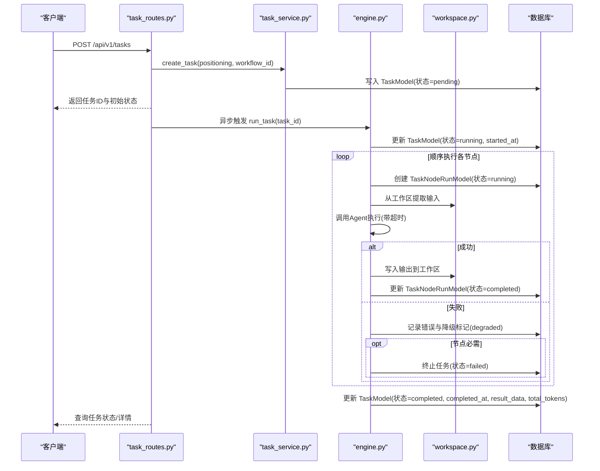
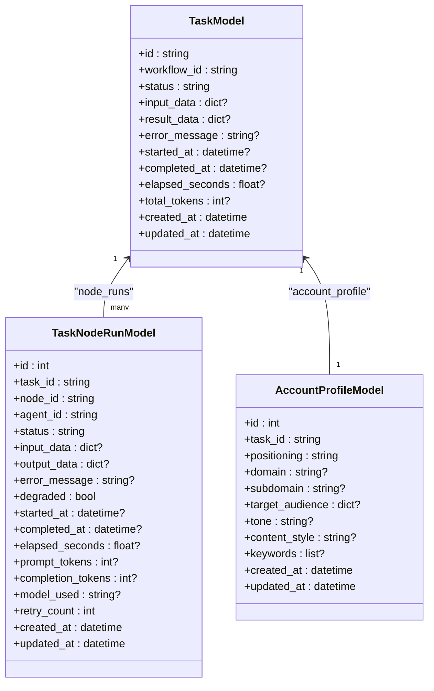
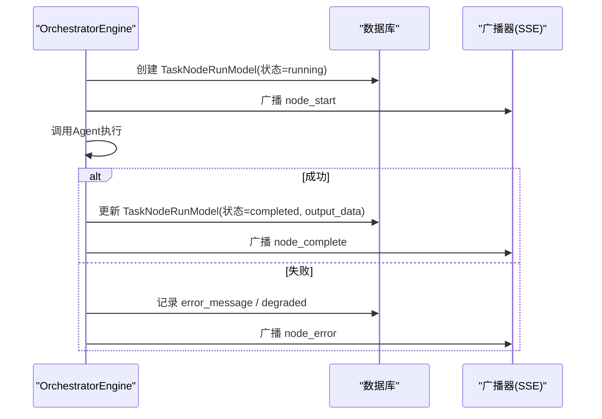
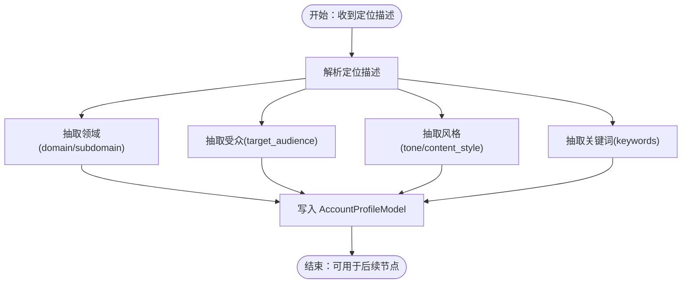
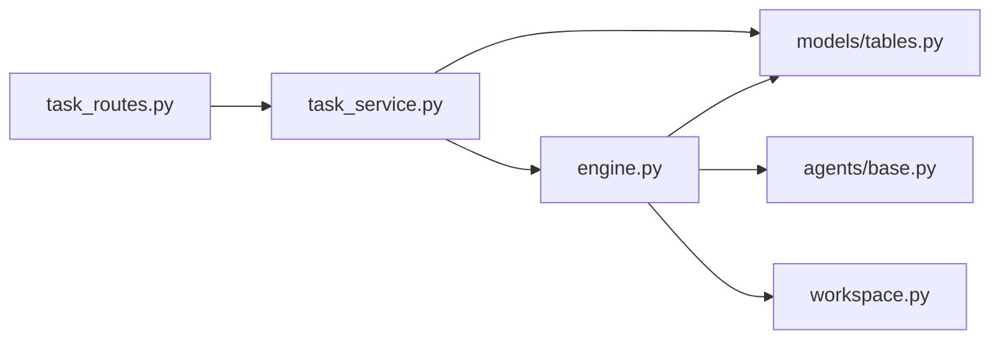

# 核心数据模型

<cite>
**本文引用的文件**
- [models/__init__.py](file://backend/app/models/__init__.py)
- [models/tables.py](file://backend/app/models/tables.py)
- [schemas/task.py](file://backend/app/schemas/task.py)
- [api/task_routes.py](file://backend/app/api/task_routes.py)
- [services/task_service.py](file://backend/app/services/task_service.py)
- [orchestrator/engine.py](file://backend/app/orchestrator/engine.py)
- [orchestrator/workspace.py](file://backend/app/orchestrator/workspace.py)
- [agents/base.py](file://backend/app/agents/base.py)
</cite>

## 目录
1. [简介](#简介)
2. [项目结构](#项目结构)
3. [核心组件](#核心组件)
4. [架构总览](#架构总览)
5. [详细组件分析](#详细组件分析)
6. [依赖分析](#依赖分析)
7. [性能考虑](#性能考虑)
8. [故障排查指南](#故障排查指南)
9. [结论](#结论)

## 简介
本文件聚焦HotClaw的核心数据模型，系统性阐述以下三类模型的设计理念与实现细节：
- TaskModel（任务模型）：任务全生命周期的状态、输入输出、性能指标与时间线管理
- TaskNodeRunModel（节点执行记录）：节点级执行轨迹，包含agent_id关联、执行状态、token消耗统计与降级标记
- AccountProfileModel（账号配置）：从用户“定位描述”解析出的账号画像，涵盖领域、受众、风格等配置项

同时，文档给出模型间的关系图、关键流程时序图、复杂逻辑流程图，并提供可操作的使用示例与最佳实践建议。

## 项目结构
围绕核心数据模型，后端采用分层设计：
- 模型层：SQLAlchemy ORM 定义，位于 models/tables.py；通过 models/__init__.py统一导出
- 接口层：FastAPI 路由，位于 api/task_routes.py
- 业务层：TaskService 封装任务生命周期与查询聚合
- 执行层：OrchestratorEngine 驱动工作流，逐节点调度Agent并记录节点执行
- 工具层：Workspace 提供任务级上下文容器；Agent 基类定义标准化结果结构

```mermaid
graph TB
subgraph "接口层"
R["task_routes.py<br/>任务API路由"]
end
subgraph "业务层"
S["task_service.py<br/>TaskService"]
end
subgraph "执行层"
E["engine.py<br/>OrchestratorEngine"]
W["workspace.py<br/>Workspace"]
end
subgraph "模型层"
T["TaskModel<br/>tasks 表"]
N["TaskNodeRunModel<br/>task_node_runs 表"]
A["AccountProfileModel<br/>account_profiles 表"]
M["models/__init__.py<br/>统一导出"]
end
R --> S --> E
E --> W
E --> T
E --> N
S --> T
S --> N
T <-- N
T <-- A
M --> T
M --> N
M --> A
```

图表来源
- [api/task_routes.py:1-163](file://backend/app/api/task_routes.py#L1-L163)
- [services/task_service.py:1-126](file://backend/app/services/task_service.py#L1-L126)
- [orchestrator/engine.py:1-285](file://backend/app/orchestrator/engine.py#L1-L285)
- [orchestrator/workspace.py:1-53](file://backend/app/orchestrator/workspace.py#L1-L53)
- [models/tables.py:1-233](file://backend/app/models/tables.py#L1-L233)
- [models/__init__.py:1-28](file://backend/app/models/__init__.py#L1-L28)

章节来源
- [models/__init__.py:1-28](file://backend/app/models/__init__.py#L1-L28)
- [models/tables.py:1-233](file://backend/app/models/tables.py#L1-L233)
- [api/task_routes.py:1-163](file://backend/app/api/task_routes.py#L1-L163)
- [services/task_service.py:1-126](file://backend/app/services/task_service.py#L1-L126)
- [orchestrator/engine.py:1-285](file://backend/app/orchestrator/engine.py#L1-L285)
- [orchestrator/workspace.py:1-53](file://backend/app/orchestrator/workspace.py#L1-L53)

## 核心组件
本节对三大核心模型进行要点梳理，便于快速建立整体认知。

- TaskModel（任务模型）
  - 关键职责：承载任务全生命周期状态、输入输出、错误信息、计时与token统计
  - 主要字段：id、workflow_id、status、input_data、result_data、error_message、started_at、completed_at、elapsed_seconds、total_tokens、created_at、updated_at
  - 关系：一对多关联到TaskNodeRunModel；一对一关联到AccountProfileModel；一对多关联到TopicCandidateModel、ArticleDraftModel

- TaskNodeRunModel（节点执行记录）
  - 关键职责：记录每个节点在任务中的执行详情，含agent_id、状态、输入输出、耗时与token消耗
  - 主要字段：id、task_id、node_id、agent_id、status、input_data、output_data、error_message、degraded、started_at、completed_at、elapsed_seconds、prompt_tokens、completion_tokens、model_used、retry_count、created_at、updated_at
  - 关系：属于某个TaskModel

- AccountProfileModel（账号配置）
  - 关键职责：解析用户“定位描述”，抽取账号画像配置
  - 主要字段：id、task_id、positioning、domain、subdomain、target_audience、tone、content_style、keywords、created_at、updated_at
  - 关系：一对一关联到TaskModel

章节来源
- [models/tables.py:23-94](file://backend/app/models/tables.py#L23-L94)

## 架构总览
下图展示任务从创建到完成的端到端数据流转与模型交互：



图表来源
- [api/task_routes.py:19-51](file://backend/app/api/task_routes.py#L19-L51)
- [services/task_service.py:22-58](file://backend/app/services/task_service.py#L22-L58)
- [orchestrator/engine.py:92-234](file://backend/app/orchestrator/engine.py#L92-L234)
- [orchestrator/workspace.py:12-53](file://backend/app/orchestrator/workspace.py#L12-L53)
- [models/tables.py:23-94](file://backend/app/models/tables.py#L23-L94)

## 详细组件分析

### TaskModel（任务模型）
- 设计理念
  - 以“任务”为中心的全生命周期建模，统一记录任务元数据、状态变迁、输入输出与性能指标
  - 通过JSON字段灵活承载动态输入输出，便于扩展不同工作流模板
  - 时间与token统计用于可观测性与成本控制
- 字段与约束
  - 标识与归属：id（主键）、workflow_id
  - 状态与时间：status、started_at、completed_at、elapsed_seconds、updated_at
  - 数据与错误：input_data、result_data、error_message
  - 成本统计：total_tokens
  - 关系：一对多（node_runs）、一对一（account_profile）、一对多（topic_candidates、article_drafts）
- 生命周期管理
  - pending → running → completed 或 failed
  - 运行中可通过API查询进度与当前节点
- 使用示例
  - 创建任务：调用任务API，传入positioning与workflow_id
  - 查询任务详情：获取input_data、result_data、started_at、completed_at、elapsed_seconds、total_tokens
  - 查询节点列表：获取每个节点的agent_id、status、耗时与token消耗



图表来源
- [models/tables.py:23-94](file://backend/app/models/tables.py#L23-L94)

章节来源
- [models/tables.py:23-94](file://backend/app/models/tables.py#L23-L94)
- [api/task_routes.py:54-107](file://backend/app/api/task_routes.py#L54-L107)
- [services/task_service.py:65-78](file://backend/app/services/task_service.py#L65-L78)

### TaskNodeRunModel（节点执行记录）
- 设计理念
  - 以“节点”为粒度的可观测性记录，确保每个Agent执行可追溯
  - 包含输入输出、错误、耗时与token消耗，支持降级标记与重试计数
- 字段与约束
  - 关联：task_id、node_id、agent_id
  - 状态与时间：status、started_at、completed_at、elapsed_seconds
  - 数据与错误：input_data、output_data、error_message、degraded
  - 成本：prompt_tokens、completion_tokens、model_used
  - 其他：retry_count、created_at、updated_at
- 执行机制
  - OrchestratorEngine在每个节点开始前创建记录，结束后计算耗时并持久化
  - 成功写回output_data，失败记录error_message；必要时标记degraded
- 使用示例
  - 查询节点列表：获取每个节点的agent_id、status、耗时、token消耗与降级标记
  - 结合任务状态API，定位当前运行节点与历史节点完成情况



图表来源
- [orchestrator/engine.py:113-216](file://backend/app/orchestrator/engine.py#L113-L216)
- [models/tables.py:48-74](file://backend/app/models/tables.py#L48-L74)

章节来源
- [models/tables.py:48-74](file://backend/app/models/tables.py#L48-L74)
- [orchestrator/engine.py:113-216](file://backend/app/orchestrator/engine.py#L113-L216)
- [api/task_routes.py:110-133](file://backend/app/api/task_routes.py#L110-L133)

### AccountProfileModel（账号配置）
- 设计理念
  - 将用户输入的“定位描述”解析为结构化账号画像，支撑后续工作流节点的个性化生成
  - 通过JSON字段承载受众与关键词等动态结构
- 字段与约束
  - 关联：task_id（唯一外键，保证一个任务仅有一个账号配置）
  - 解析结果：domain、subdomain、target_audience、tone、content_style、keywords
  - 元数据：positioning、created_at、updated_at
- 生成流程
  - 在默认工作流中，首个节点“profile_parsing”负责解析定位描述并写入该表
  - 后续节点可直接引用profile作为输入
- 使用示例
  - 在任务详情中可看到input_data中的positioning，以及AccountProfileModel中的结构化配置
  - 可据此调整Agent提示词或风格参数



图表来源
- [orchestrator/engine.py:32-86](file://backend/app/orchestrator/engine.py#L32-L86)
- [models/tables.py:76-94](file://backend/app/models/tables.py#L76-L94)

章节来源
- [models/tables.py:76-94](file://backend/app/models/tables.py#L76-L94)
- [orchestrator/engine.py:32-86](file://backend/app/orchestrator/engine.py#L32-L86)

## 依赖分析
- 模型耦合与内聚
  - TaskModel高内聚地封装任务生命周期与结果；与TaskNodeRunModel、AccountProfileModel形成清晰的一对多/一对一关系
  - TaskNodeRunModel与OrchestratorEngine强耦合，但通过标准化字段与关系保持可测试性
- 外部依赖与集成点
  - 数据库：SQLAlchemy ORM，JSON/Text字段用于动态数据存储
  - API层：FastAPI路由负责请求校验与响应包装
  - 广播：SSE广播器用于实时通知节点与任务状态变化
- 循环依赖
  - 未发现循环导入；模型导出通过统一入口集中管理



图表来源
- [api/task_routes.py:1-163](file://backend/app/api/task_routes.py#L1-L163)
- [services/task_service.py:1-126](file://backend/app/services/task_service.py#L1-L126)
- [orchestrator/engine.py:1-285](file://backend/app/orchestrator/engine.py#L1-L285)
- [agents/base.py:1-99](file://backend/app/agents/base.py#L1-L99)
- [orchestrator/workspace.py:1-53](file://backend/app/orchestrator/workspace.py#L1-L53)
- [models/tables.py:1-233](file://backend/app/models/tables.py#L1-L233)

章节来源
- [models/__init__.py:1-28](file://backend/app/models/__init__.py#L1-L28)
- [models/tables.py:1-233](file://backend/app/models/tables.py#L1-L233)
- [api/task_routes.py:1-163](file://backend/app/api/task_routes.py#L1-L163)
- [services/task_service.py:1-126](file://backend/app/services/task_service.py#L1-L126)
- [orchestrator/engine.py:1-285](file://backend/app/orchestrator/engine.py#L1-L285)
- [agents/base.py:1-99](file://backend/app/agents/base.py#L1-L99)
- [orchestrator/workspace.py:1-53](file://backend/app/orchestrator/workspace.py#L1-L53)

## 性能考虑
- 数据存储
  - JSON/Text字段便于扩展，但需注意查询与索引策略；对高频查询字段（如status、task_id）应建立索引
- 执行效率
  - 节点执行采用异步与超时控制，避免阻塞；建议为Agent设置合理超时阈值
  - 令牌统计按节点累加，建议在节点完成后批量更新任务总消耗，减少多次写入
- 观测性
  - 通过TaskModel.elapsed_seconds与TaskNodeRunModel.elapsed_seconds实现端到端与节点级耗时监控
  - total_tokens用于成本归集与趋势分析

## 故障排查指南
- 常见问题
  - 任务长时间处于running：检查节点执行日志与Agent超时设置
  - 节点失败且degraded为true：确认是否触发了降级策略与回退逻辑
  - 任务最终failed：查看TaskModel.error_message与TaskNodeRunModel.error_message
- 定位步骤
  - 通过任务ID查询任务详情与节点列表，核对状态与耗时
  - 检查系统日志与SSE事件，确认广播消息是否到达
- 相关实现参考
  - 任务状态查询与进度计算：[api/task_routes.py:54-87](file://backend/app/api/task_routes.py#L54-L87)
  - 节点执行失败处理与降级标记：[orchestrator/engine.py:164-175](file://backend/app/orchestrator/engine.py#L164-L175)
  - 任务失败回滚与广播：[services/task_service.py:49-63](file://backend/app/services/task_service.py#L49-L63)

章节来源
- [api/task_routes.py:54-87](file://backend/app/api/task_routes.py#L54-L87)
- [services/task_service.py:49-63](file://backend/app/services/task_service.py#L49-L63)
- [orchestrator/engine.py:164-175](file://backend/app/orchestrator/engine.py#L164-L175)

## 结论
本文档从设计理念、字段定义、生命周期管理、执行机制与使用示例五个维度，全面解构了HotClaw的核心数据模型。TaskModel、TaskNodeRunModel与AccountProfileModel三者协同，既满足任务全生命周期的可观测性需求，又为后续工作流扩展提供了稳定的数据基础。建议在生产环境中结合索引策略、超时配置与SSE广播，持续优化任务执行的稳定性与可运维性。