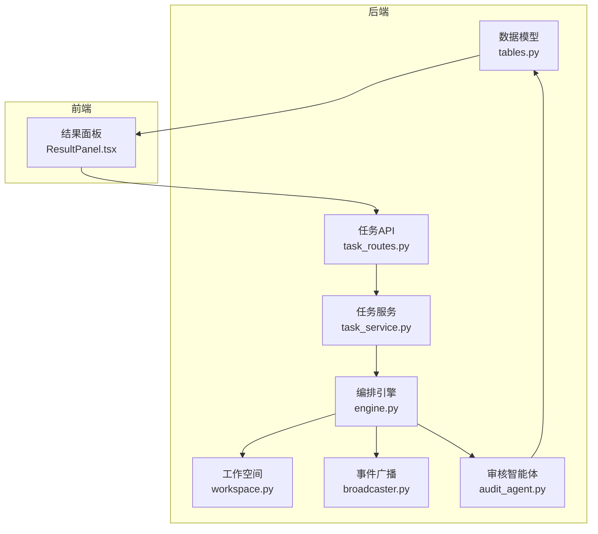
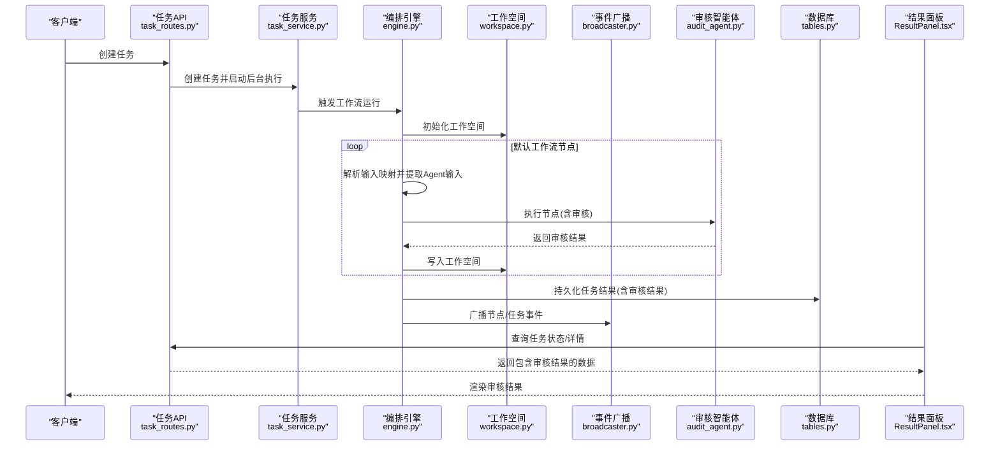
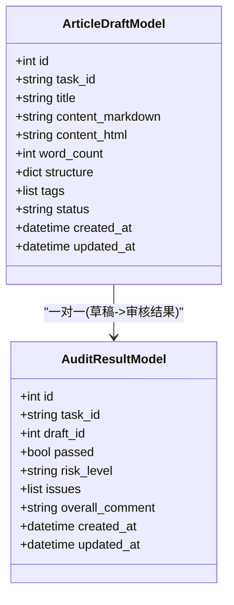
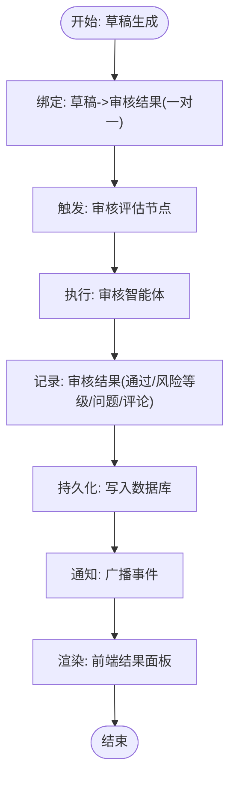
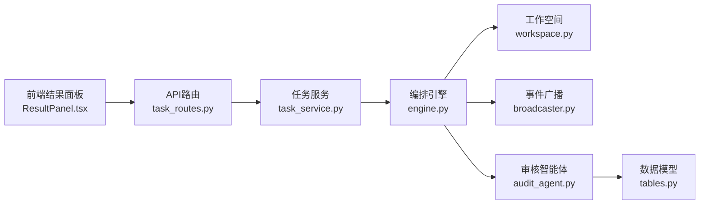

# 质量保障模型

<cite>
**本文引用的文件**
- [tables.py](file://backend/app/models/tables.py)
- [audit_agent.py](file://backend/app/agents/audit_agent.py)
- [engine.py](file://backend/app/orchestrator/engine.py)
- [workspace.py](file://backend/app/orchestrator/workspace.py)
- [broadcaster.py](file://backend/app/orchestrator/broadcaster.py)
- [task_routes.py](file://backend/app/api/task_routes.py)
- [task_service.py](file://backend/app/services/task_service.py)
- [ResultPanel.tsx](file://frontend/components/office/ResultPanel.tsx)
</cite>

## 目录
1. [简介](#简介)
2. [项目结构](#项目结构)
3. [核心组件](#核心组件)
4. [架构总览](#架构总览)
5. [详细组件分析](#详细组件分析)
6. [依赖分析](#依赖分析)
7. [性能考量](#性能考量)
8. [故障排查指南](#故障排查指南)
9. [结论](#结论)
10. [附录](#附录)

## 简介
本文件聚焦HotClaw质量保障体系中的数据模型与流程，系统性阐述AuditResultModel（审核结果）的设计理念、数据结构、与文章草稿的一对一绑定关系、风险评估分级与问题分类体系，并给出从触发到落库再到前端展示的完整数据流转示例。同时说明该模型在质量控制体系中的作用与价值。

## 项目结构
围绕“任务-草稿-审核结果”的主链路，后端采用SQLAlchemy ORM建模，工作流编排通过OrchestratorEngine驱动，前端通过ResultPanel渲染最终结果。关键文件分布如下：
- 数据模型层：backend/app/models/tables.py
- 工作流与编排：backend/app/orchestrator/engine.py、workspace.py、broadcaster.py
- 审核智能体：backend/app/agents/audit_agent.py
- 任务生命周期与API：backend/app/services/task_service.py、backend/app/api/task_routes.py
- 前端结果面板：frontend/components/office/ResultPanel.tsx

图表来源
- [engine.py:31-86](file://backend/app/orchestrator/engine.py#L31-L86)
- [workspace.py:12-53](file://backend/app/orchestrator/workspace.py#L12-L53)
- [broadcaster.py:11-94](file://backend/app/orchestrator/broadcaster.py#L11-L94)
- [audit_agent.py:7-66](file://backend/app/agents/audit_agent.py#L7-L66)
- [tables.py:119-158](file://backend/app/models/tables.py#L119-L158)
- [task_routes.py:19-51](file://backend/app/api/task_routes.py#L19-L51)
- [task_service.py:20-64](file://backend/app/services/task_service.py#L20-L64)
- [ResultPanel.tsx:11-125](file://frontend/components/office/ResultPanel.tsx#L11-L125)

章节来源
- [engine.py:31-86](file://backend/app/orchestrator/engine.py#L31-L86)
- [tables.py:119-158](file://backend/app/models/tables.py#L119-L158)
- [ResultPanel.tsx:11-125](file://frontend/components/office/ResultPanel.tsx#L11-L125)

## 核心组件
- AuditResultModel：持久化存储文章草稿的审核结果，包含通过状态、风险等级、问题列表、总体评论等字段，并与ArticleDraftModel建立一对一关系。
- ArticleDraftModel：文章草稿实体，与AuditResultModel通过uselist=False形成一对一绑定。
- OrchestratorEngine：线性编排默认工作流，其中“审核评估”节点负责调用审核智能体并写入审核结果。
- AuditAgent：模拟审核智能体，按约定输出结构化的审核结果。
- Workspace：任务级上下文容器，负责节点间数据传递与合并。
- SSEBroadcaster：向前端推送节点与任务状态变更事件。
- ResultPanel：前端结果面板，展示审核结果的关键信息。

章节来源
- [tables.py:119-158](file://backend/app/models/tables.py#L119-L158)
- [engine.py:31-86](file://backend/app/orchestrator/engine.py#L31-L86)
- [audit_agent.py:7-66](file://backend/app/agents/audit_agent.py#L7-L66)
- [workspace.py:12-53](file://backend/app/orchestrator/workspace.py#L12-L53)
- [broadcaster.py:11-94](file://backend/app/orchestrator/broadcaster.py#L11-L94)
- [ResultPanel.tsx:11-125](file://frontend/components/office/ResultPanel.tsx#L11-L125)

## 架构总览
下图展示从任务创建到审核结果落库与前端呈现的端到端流程。

图表来源
- [task_routes.py:19-51](file://backend/app/api/task_routes.py#L19-L51)
- [task_service.py:20-64](file://backend/app/services/task_service.py#L20-L64)
- [engine.py:92-234](file://backend/app/orchestrator/engine.py#L92-L234)
- [workspace.py:12-53](file://backend/app/orchestrator/workspace.py#L12-L53)
- [broadcaster.py:57-78](file://backend/app/orchestrator/broadcaster.py#L57-L78)
- [audit_agent.py:48-66](file://backend/app/agents/audit_agent.py#L48-L66)
- [tables.py:119-158](file://backend/app/models/tables.py#L119-L158)
- [ResultPanel.tsx:11-125](file://frontend/components/office/ResultPanel.tsx#L11-L125)

## 详细组件分析

### AuditResultModel 设计与实现
- 表结构与字段
  - 主键与外键：自增id；task_id关联任务表；draft_id关联文章草稿表。
  - 业务字段：passed（是否通过）、risk_level（风险等级）、issues（问题列表）、overall_comment（总体评论）。
  - 时间戳：自动维护创建与更新时间。
- 关系映射
  - 与ArticleDraftModel为一对一关系，由back_populates与uselist=False保证唯一绑定。
- 数据约束与默认值
  - passed默认false，risk_level默认"low"，issues默认null，overall_comment默认null。
- 价值与用途
  - 作为质量门禁的权威记录，支撑发布前置校验、人工复核与审计追溯。

图表来源
- [tables.py:119-158](file://backend/app/models/tables.py#L119-L158)

章节来源
- [tables.py:141-158](file://backend/app/models/tables.py#L141-L158)

### 审核流程与草稿绑定
- 绑定机制
  - ArticleDraftModel与AuditResultModel通过draft_id建立一对一外键约束，确保每篇草稿仅对应一条审核结果。
- 流程要点
  - 工作流中“审核评估”节点将审核结果写入工作空间，最终由编排引擎持久化至数据库。
  - 审核结果随任务结果一起返回，供前端展示与后续处理使用。

图表来源
- [engine.py:78-85](file://backend/app/orchestrator/engine.py#L78-L85)
- [audit_agent.py:48-66](file://backend/app/agents/audit_agent.py#L48-L66)
- [tables.py:141-158](file://backend/app/models/tables.py#L141-L158)
- [broadcaster.py:57-78](file://backend/app/orchestrator/broadcaster.py#L57-L78)
- [ResultPanel.tsx:103-121](file://frontend/components/office/ResultPanel.tsx#L103-L121)

章节来源
- [engine.py:78-85](file://backend/app/orchestrator/engine.py#L78-L85)
- [tables.py:137-138](file://backend/app/models/tables.py#L137-L138)
- [tables.py:147-157](file://backend/app/models/tables.py#L147-L157)

### 风险评估分级与问题分类
- 风险等级
  - 低风险(low)、中风险(medium)、高风险(high)，来源于审核智能体输出约定。
- 问题类型
  - 敏感词(sensitive_word)、政治风险(political_risk)、虚假信息(false_info)、夸大(exaggeration)、标题党(clickbait)、调性不匹配(tone_mismatch)、质量问题(quality)。
- 严重程度
  - 低(low)、中(medium)、高(high)，用于判定是否通过与风险等级取值。
- 判定规则（来自审核智能体约定）
  - issues数组为空时passed为true；
  - 存在任何high severity问题时passed为false；
  - risk_level取issues中最高severity等级；
  - 审核应客观公正，不过度严苛也不放过真正的问题。

章节来源
- [audit_agent.py:23-46](file://backend/app/agents/audit_agent.py#L23-L46)

### 审核触发条件、结果记录与后续处理
- 触发条件
  - 默认工作流中“审核评估”节点固定存在，且标记为非必需(allowed)；当内容生成完成后，编排引擎会顺序执行该节点。
- 结果记录
  - 审核智能体返回结构化结果，编排引擎将其写入工作空间并持久化到数据库。
- 后续处理
  - 任务完成时，结果数据包含审核结果；前端通过API查询任务详情获取并渲染。
  - 若审核失败或服务异常，编排引擎支持降级回退策略，保证流程继续推进。

章节来源
- [engine.py:78-85](file://backend/app/orchestrator/engine.py#L78-L85)
- [engine.py:137-175](file://backend/app/orchestrator/engine.py#L137-L175)
- [audit_agent.py:59-66](file://backend/app/agents/audit_agent.py#L59-L66)
- [task_routes.py:90-107](file://backend/app/api/task_routes.py#L90-L107)
- [ResultPanel.tsx:103-121](file://frontend/components/office/ResultPanel.tsx#L103-L121)

### 审核数据在质量控制体系中的作用与价值
- 质量门禁：通过passed与risk_level快速识别可发布内容与高风险内容。
- 追溯审计：issues与overall_comment提供可追溯的问题清单与结论摘要。
- 人机协同：降级回退与人工复核通道，兼顾效率与安全。
- 可视化治理：前端ResultPanel直观展示审核状态与风险等级，辅助运营决策。

章节来源
- [audit_agent.py:48-66](file://backend/app/agents/audit_agent.py#L48-L66)
- [ResultPanel.tsx:103-121](file://frontend/components/office/ResultPanel.tsx#L103-L121)

## 依赖分析
- 组件耦合
  - OrchestratorEngine依赖AgentRegistry加载审核智能体，依赖Workspace进行数据传递，依赖SSEBroadcaster推送事件。
  - AuditResultModel与ArticleDraftModel通过关系映射强绑定，避免一对多的复杂性。
- 外部集成
  - API层负责请求响应与后台任务调度，服务层封装业务逻辑，模型层承载数据契约。
- 循环依赖
  - 当前模块间为单向依赖，未见循环导入迹象。

图表来源
- [task_routes.py:19-51](file://backend/app/api/task_routes.py#L19-L51)
- [task_service.py:20-64](file://backend/app/services/task_service.py#L20-L64)
- [engine.py:92-234](file://backend/app/orchestrator/engine.py#L92-L234)
- [workspace.py:12-53](file://backend/app/orchestrator/workspace.py#L12-L53)
- [broadcaster.py:57-78](file://backend/app/orchestrator/broadcaster.py#L57-L78)
- [audit_agent.py:48-66](file://backend/app/agents/audit_agent.py#L48-L66)
- [tables.py:119-158](file://backend/app/models/tables.py#L119-L158)
- [ResultPanel.tsx:11-125](file://frontend/components/office/ResultPanel.tsx#L11-L125)

章节来源
- [engine.py:92-234](file://backend/app/orchestrator/engine.py#L92-L234)
- [tables.py:119-158](file://backend/app/models/tables.py#L119-L158)

## 性能考量
- 异步执行与超时控制：编排引擎对Agent执行设置超时，避免阻塞；任务与节点运行记录包含耗时统计，便于优化。
- 事件广播缓冲：SSEBroadcaster对历史事件进行缓冲，减少前端重连丢失，提升可观测性。
- 数据持久化：审核结果与任务结果统一写入数据库，减少跨系统同步成本。
- 建议
  - 对高频审核场景可引入缓存与批量落库策略；
  - 监控节点耗时与错误率，及时调整Agent超时阈值与重试配置。

章节来源
- [engine.py:236-243](file://backend/app/orchestrator/engine.py#L236-L243)
- [broadcaster.py:22-84](file://backend/app/orchestrator/broadcaster.py#L22-L84)

## 故障排查指南
- 审核节点失败
  - 现象：节点状态为failed，记录错误信息。
  - 排查：检查Agent执行日志、超时配置、降级回退是否生效。
- 任务状态异常
  - 现象：任务长时间pending或failed。
  - 排查：通过任务状态接口确认当前节点与进度；查看节点运行记录。
- 前端未显示审核结果
  - 现象：结果面板缺少审核区域。
  - 排查：确认任务已完成且result_data中包含audit_result；检查前端渲染逻辑与数据解构。

章节来源
- [engine.py:164-175](file://backend/app/orchestrator/engine.py#L164-L175)
- [task_routes.py:54-87](file://backend/app/api/task_routes.py#L54-L87)
- [ResultPanel.tsx:103-121](file://frontend/components/office/ResultPanel.tsx#L103-L121)

## 结论
AuditResultModel以简洁明确的数据结构与严格的草稿-审核结果一对一绑定，构建了HotClaw质量保障体系的核心数据基石。配合默认工作流中的审核节点、智能体输出约定与前端可视化面板，实现了从触发、执行、记录到展示的闭环。该设计既满足自动化效率，又保留人工复核与降级容错能力，为内容质量与合规提供了可靠保障。

## 附录
- 字段定义速览
  - AuditResultModel
    - passed：布尔型，是否通过
    - risk_level：字符串，风险等级(low/medium/high)
    - issues：数组，问题清单，包含type、description、severity、location
    - overall_comment：文本，总体评论
  - ArticleDraftModel
    - 与AuditResultModel通过draft_id一对一绑定

章节来源
- [tables.py:141-158](file://backend/app/models/tables.py#L141-L158)
- [audit_agent.py:23-32](file://backend/app/agents/audit_agent.py#L23-L32)