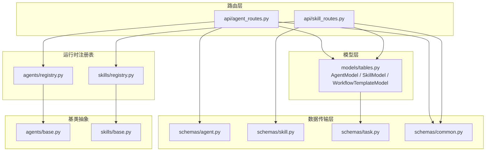
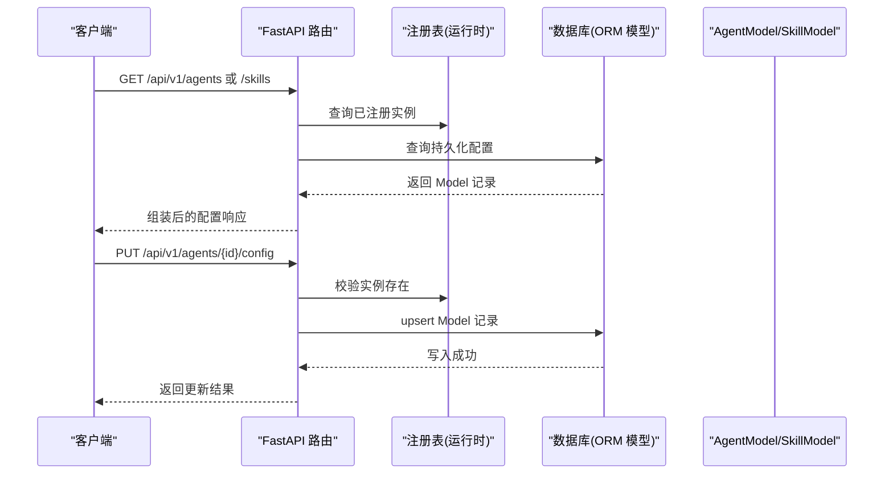
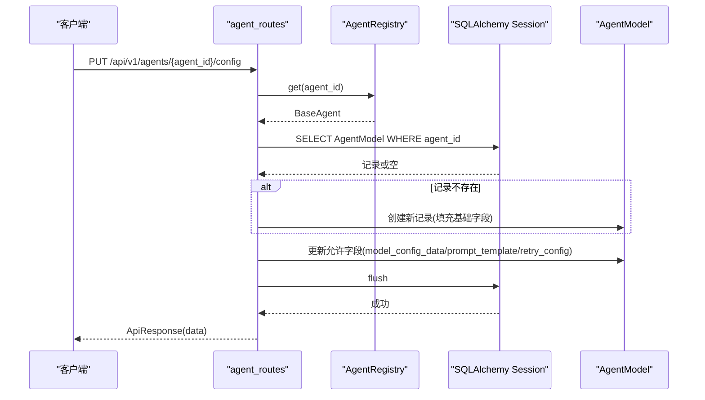
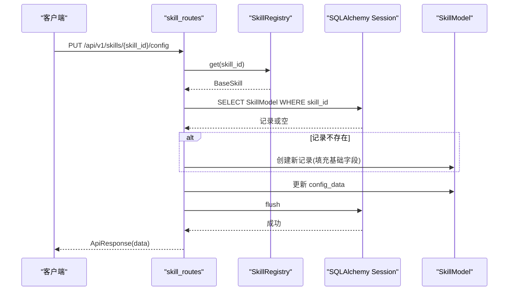
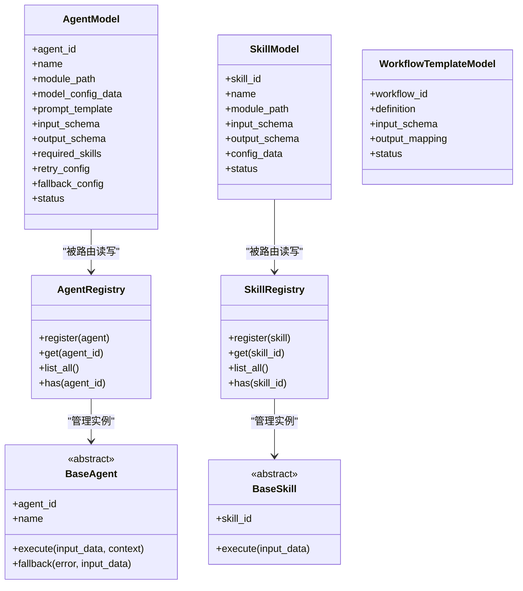
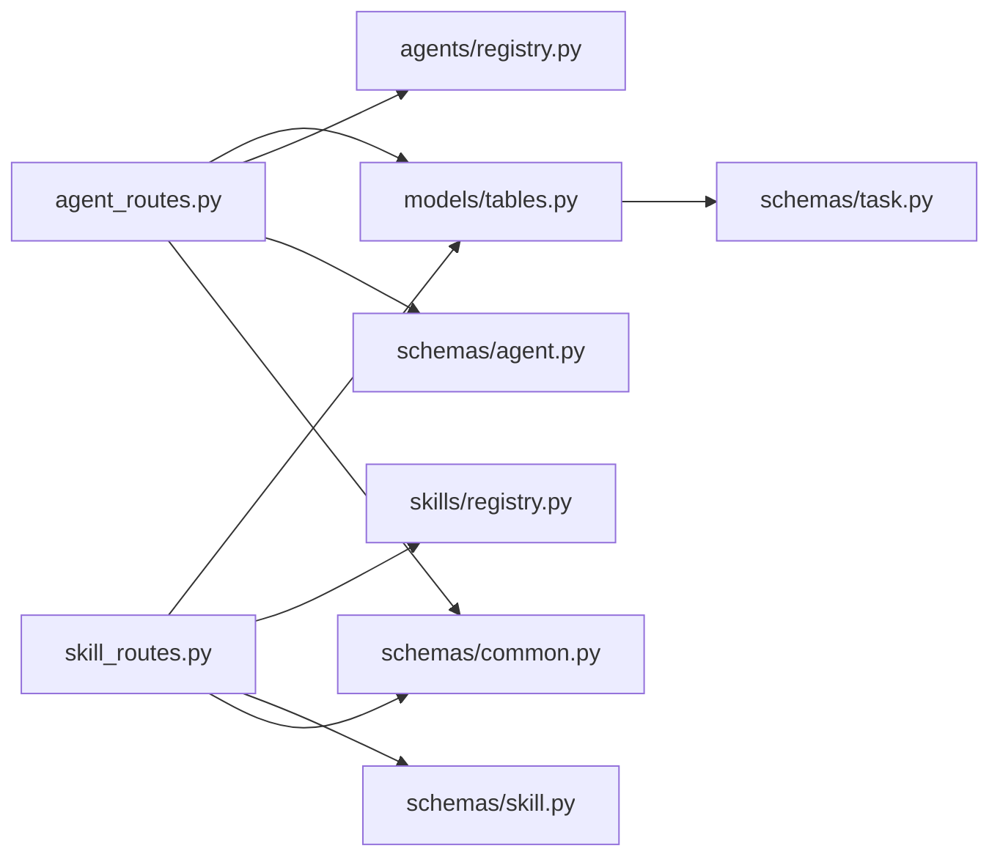

# 配置管理模型

<cite>
**本文引用的文件**
- [backend/app/models/tables.py](file://backend/app/models/tables.py)
- [backend/app/schemas/agent.py](file://backend/app/schemas/agent.py)
- [backend/app/schemas/skill.py](file://backend/app/schemas/skill.py)
- [backend/app/schemas/task.py](file://backend/app/schemas/task.py)
- [backend/app/schemas/common.py](file://backend/app/schemas/common.py)
- [backend/app/api/agent_routes.py](file://backend/app/api/agent_routes.py)
- [backend/app/api/skill_routes.py](file://backend/app/api/skill_routes.py)
- [backend/app/agents/base.py](file://backend/app/agents/base.py)
- [backend/app/agents/registry.py](file://backend/app/agents/registry.py)
- [backend/app/skills/base.py](file://backend/app/skills/base.py)
- [backend/app/skills/registry.py](file://backend/app/skills/registry.py)
</cite>

## 目录
1. [引言](#引言)
2. [项目结构](#项目结构)
3. [核心组件](#核心组件)
4. [架构总览](#架构总览)
5. [详细组件分析](#详细组件分析)
6. [依赖分析](#依赖分析)
7. [性能考虑](#性能考虑)
8. [故障排查指南](#故障排查指南)
9. [结论](#结论)
10. [附录](#附录)

## 引言
本技术文档聚焦 HotClaw 的配置管理相关数据模型，系统性解析以下三类模型的设计理念与实现细节：
- AgentModel（智能体配置）
- SkillModel（技能配置）
- WorkflowTemplateModel（工作流模板）

同时，结合后端 API 路由与注册表机制，阐明配置的持久化、读取、更新流程及最佳实践与扩展建议。

## 项目结构
围绕配置管理的关键代码分布在如下位置：
- 模型层：ORM 定义于 models/tables.py，包含 AgentModel、SkillModel、WorkflowTemplateModel 等
- 路由层：API 路由位于 api/agent_routes.py、api/skill_routes.py，提供配置查询与更新接口
- 数据传输层：schemas 下的 agent.py、skill.py、task.py、common.py 定义请求/响应结构
- 运行时注册表：agents/registry.py、skills/registry.py 提供运行时实例注册与检索
- 基类抽象：agents/base.py、skills/base.py 定义统一的执行接口与能力边界

图表来源
- [backend/app/models/tables.py:160-217](file://backend/app/models/tables.py#L160-L217)
- [backend/app/api/agent_routes.py:1-115](file://backend/app/api/agent_routes.py#L1-L115)
- [backend/app/api/skill_routes.py:1-61](file://backend/app/api/skill_routes.py#L1-L61)
- [backend/app/schemas/agent.py:1-29](file://backend/app/schemas/agent.py#L1-L29)
- [backend/app/schemas/skill.py:1-22](file://backend/app/schemas/skill.py#L1-L22)
- [backend/app/schemas/task.py:1-83](file://backend/app/schemas/task.py#L1-L83)
- [backend/app/schemas/common.py:1-27](file://backend/app/schemas/common.py#L1-L27)
- [backend/app/agents/registry.py:1-40](file://backend/app/agents/registry.py#L1-L40)
- [backend/app/skills/registry.py:1-37](file://backend/app/skills/registry.py#L1-L37)
- [backend/app/agents/base.py:1-99](file://backend/app/agents/base.py#L1-L99)
- [backend/app/skills/base.py:1-37](file://backend/app/skills/base.py#L1-L37)

章节来源
- [backend/app/models/tables.py:160-217](file://backend/app/models/tables.py#L160-L217)
- [backend/app/api/agent_routes.py:1-115](file://backend/app/api/agent_routes.py#L1-L115)
- [backend/app/api/skill_routes.py:1-61](file://backend/app/api/skill_routes.py#L1-L61)
- [backend/app/schemas/agent.py:1-29](file://backend/app/schemas/agent.py#L1-L29)
- [backend/app/schemas/skill.py:1-22](file://backend/app/schemas/skill.py#L1-L22)
- [backend/app/schemas/task.py:1-83](file://backend/app/schemas/task.py#L1-L83)
- [backend/app/schemas/common.py:1-27](file://backend/app/schemas/common.py#L1-L27)
- [backend/app/agents/registry.py:1-40](file://backend/app/agents/registry.py#L1-L40)
- [backend/app/skills/registry.py:1-37](file://backend/app/skills/registry.py#L1-L37)
- [backend/app/agents/base.py:1-99](file://backend/app/agents/base.py#L1-L99)
- [backend/app/skills/base.py:1-37](file://backend/app/skills/base.py#L1-L37)

## 核心组件
本节对三类配置模型进行深入解析，涵盖字段语义、约束与典型用法。

- AgentModel（智能体配置）
  - 作用：持久化智能体的可变配置，支持按需覆盖默认行为（如模型参数、提示词、重试策略等）
  - 关键字段
    - agent_id：主键，唯一标识智能体
    - name/description/version：元信息
    - module_path：动态导入路径前缀，用于运行时加载具体实现
    - model_config_data：模型调用参数（如温度、最大长度、供应商参数等）
    - prompt_template：自定义系统提示模板；空字符串表示“恢复默认”
    - input_schema/output_schema：输入/输出结构约束（JSON Schema）
    - required_skills：该智能体在工作流中所需的技能集合
    - retry_config：重试策略（次数、退避、条件等）
    - fallback_config：降级策略（备用实现或兜底逻辑）
    - status：启用/禁用状态
    - created_at/updated_at：时间戳
  - 使用场景
    - 在线调整模型参数与提示词
    - 为特定任务注入定制化提示
    - 为不稳定外部服务配置重试与降级

- SkillModel（技能配置）
  - 作用：持久化技能的可变配置，便于在不同智能体间复用
  - 关键字段
    - skill_id：主键，唯一标识技能
    - name/description/version：元信息
    - module_path：动态导入路径前缀
    - input_schema/output_schema：输入/输出结构约束
    - config_data：技能内部配置（如 API 凭据、阈值、开关等）
    - status：启用/禁用状态
    - created_at/updated_at：时间戳
  - 使用场景
    - 统一管理工具类能力（如搜索、翻译、图像处理等）
    - 通过 config_data 实现凭据与参数的集中管理

- WorkflowTemplateModel（工作流模板）
  - 作用：持久化工作流定义、输入模式与输出映射
  - 关键字段
    - workflow_id：主键，唯一标识模板
    - name/description/version：元信息
    - definition：完整的工作流定义（节点、连线、并行/串行结构等）
    - input_schema：输入模式约束（JSON Schema）
    - output_mapping：输出字段映射规则（从节点输出到最终结果的映射）
    - status：启用/禁用状态
    - created_at/updated_at：时间戳
  - 使用场景
    - 将业务流程固化为模板，支持多实例复用
    - 通过 input_schema 与 output_mapping 实现强约束与可预测输出

章节来源
- [backend/app/models/tables.py:160-217](file://backend/app/models/tables.py#L160-L217)

## 架构总览
下图展示配置管理在系统中的交互关系：API 路由负责对外暴露配置读写接口；注册表提供运行时实例；模型层负责持久化；Schema 层保证请求/响应一致性。

图表来源
- [backend/app/api/agent_routes.py:17-115](file://backend/app/api/agent_routes.py#L17-L115)
- [backend/app/api/skill_routes.py:17-61](file://backend/app/api/skill_routes.py#L17-L61)
- [backend/app/agents/registry.py:23-28](file://backend/app/agents/registry.py#L23-L28)
- [backend/app/skills/registry.py:22-26](file://backend/app/skills/registry.py#L22-L26)
- [backend/app/models/tables.py:160-217](file://backend/app/models/tables.py#L160-L217)

## 详细组件分析

### AgentModel（智能体配置）
- 设计要点
  - 以 JSON 字段承载灵活配置，便于动态调整模型参数、提示模板、重试与降级策略
  - 与运行时注册表配合，优先应用持久化配置，否则回退至默认值
  - 支持按需覆盖系统提示词，空字符串表示“恢复默认”，避免误存空值
- 典型流程（更新配置）
  - 校验智能体存在
  - 若记录不存在则创建新记录（填充基础元信息与模块路径）
  - 仅更新传入的非空字段
  - flush 提交事务

图表来源
- [backend/app/api/agent_routes.py:74-115](file://backend/app/api/agent_routes.py#L74-L115)
- [backend/app/agents/registry.py:23-28](file://backend/app/agents/registry.py#L23-L28)
- [backend/app/models/tables.py:160-180](file://backend/app/models/tables.py#L160-L180)

章节来源
- [backend/app/api/agent_routes.py:74-115](file://backend/app/api/agent_routes.py#L74-L115)
- [backend/app/schemas/agent.py:24-29](file://backend/app/schemas/agent.py#L24-L29)
- [backend/app/agents/base.py:60-62](file://backend/app/agents/base.py#L60-L62)

### SkillModel（技能配置）
- 设计要点
  - 将技能的可变配置集中存储，便于跨智能体共享与统一管理
  - 通过 module_path 与注册表配合，实现动态加载
- 典型流程（更新配置）
  - 校验技能存在
  - upsert 记录并仅更新传入字段
  - 返回更新成功

图表来源
- [backend/app/api/skill_routes.py:34-61](file://backend/app/api/skill_routes.py#L34-L61)
- [backend/app/skills/registry.py:22-26](file://backend/app/skills/registry.py#L22-L26)
- [backend/app/models/tables.py:183-200](file://backend/app/models/tables.py#L183-L200)

章节来源
- [backend/app/api/skill_routes.py:34-61](file://backend/app/api/skill_routes.py#L34-L61)
- [backend/app/schemas/skill.py:19-22](file://backend/app/schemas/skill.py#L19-L22)
- [backend/app/skills/base.py:26-36](file://backend/app/skills/base.py#L26-L36)

### WorkflowTemplateModel（工作流模板）
- 设计要点
  - definition 存储完整工作流定义，input_schema 与 output_mapping 提供输入约束与输出规范
  - 通过 JSON 字段承载复杂结构，便于版本演进与序列化
- 典型用途
  - 将业务流程固化为模板，支持多实例复用
  - 通过 input_schema 与 output_mapping 实现强约束与可预测输出

章节来源
- [backend/app/models/tables.py:202-217](file://backend/app/models/tables.py#L202-L217)

### 类关系与职责

图表来源
- [backend/app/models/tables.py:160-217](file://backend/app/models/tables.py#L160-L217)
- [backend/app/agents/registry.py:10-36](file://backend/app/agents/registry.py#L10-L36)
- [backend/app/skills/registry.py:10-33](file://backend/app/skills/registry.py#L10-L33)
- [backend/app/agents/base.py:49-99](file://backend/app/agents/base.py#L49-L99)
- [backend/app/skills/base.py:16-37](file://backend/app/skills/base.py#L16-L37)

## 依赖分析
- 组件耦合
  - 路由层依赖注册表与 ORM 模型，确保运行时与持久化的一致性
  - Schema 层作为契约层，约束请求/响应格式，降低前后端耦合
- 外部依赖
  - SQLAlchemy ORM 用于模型持久化
  - FastAPI 用于路由与依赖注入
- 潜在风险
  - JSON 字段缺乏静态类型约束，需通过 input_schema/output_schema 与运行时校验共同保障
  - 注册表与数据库状态不一致可能导致读取异常，应建立同步策略

图表来源
- [backend/app/api/agent_routes.py:1-115](file://backend/app/api/agent_routes.py#L1-L115)
- [backend/app/api/skill_routes.py:1-61](file://backend/app/api/skill_routes.py#L1-L61)
- [backend/app/models/tables.py:160-217](file://backend/app/models/tables.py#L160-L217)
- [backend/app/agents/registry.py:1-40](file://backend/app/agents/registry.py#L1-L40)
- [backend/app/skills/registry.py:1-37](file://backend/app/skills/registry.py#L1-L37)
- [backend/app/schemas/agent.py:1-29](file://backend/app/schemas/agent.py#L1-L29)
- [backend/app/schemas/skill.py:1-22](file://backend/app/schemas/skill.py#L1-L22)
- [backend/app/schemas/common.py:1-27](file://backend/app/schemas/common.py#L1-L27)
- [backend/app/schemas/task.py:1-83](file://backend/app/schemas/task.py#L1-L83)

章节来源
- [backend/app/api/agent_routes.py:1-115](file://backend/app/api/agent_routes.py#L1-L115)
- [backend/app/api/skill_routes.py:1-61](file://backend/app/api/skill_routes.py#L1-L61)
- [backend/app/models/tables.py:160-217](file://backend/app/models/tables.py#L160-L217)

## 性能考虑
- 批量查询优化
  - 列表接口可批量查询自定义提示，减少多次往返
- 写入幂等
  - upsert 逻辑避免重复创建，提升并发安全性
- JSON 字段索引
  - 对常用过滤字段（如 status、agent_id/skill_id）建立索引，加速查询
- 缓存策略
  - 对只读配置（如默认提示、技能配置）引入缓存，降低数据库压力
- 版本控制
  - 通过 version 字段实现灰度与回滚，避免全量变更带来的风险

## 故障排查指南
- 常见问题
  - 无法找到智能体/技能：检查注册表是否已注册，或确认 agent_id/skill_id 是否正确
  - 配置未生效：确认数据库中是否存在对应记录；若为空，检查是否正确传入了需要更新的字段
  - 提示词未恢复默认：当传入空字符串时，路由会将其转换为 None，从而回退到默认提示
- 排查步骤
  - 通过 GET 接口核对当前持久化配置
  - 查看路由日志与数据库变更
  - 对比运行时注册表与数据库状态
- 错误响应
  - 统一使用 ApiResponse/ApiErrorResponse 包裹，便于前端与监控系统识别

章节来源
- [backend/app/api/agent_routes.py:46-71](file://backend/app/api/agent_routes.py#L46-L71)
- [backend/app/api/skill_routes.py:17-31](file://backend/app/api/skill_routes.py#L17-L31)
- [backend/app/schemas/common.py:7-20](file://backend/app/schemas/common.py#L7-L20)

## 结论
AgentModel、SkillModel 与 WorkflowTemplateModel 构成了 HotClaw 配置管理的核心数据层。通过注册表与路由层的协同，系统实现了运行时与持久化的解耦，既保证了灵活性，又提供了可追溯与可审计的能力。建议在生产环境中配套缓存、索引与版本控制策略，持续完善 JSON Schema 的输入输出约束，以进一步提升稳定性与可维护性。

## 附录
- 最佳实践
  - 明确区分“默认配置”与“持久化覆盖配置”，避免混用
  - 使用 input_schema/output_schema 严格约束输入输出，减少运行期错误
  - 对敏感配置（如凭据）采用加密存储与最小权限访问
  - 为每个配置字段提供清晰的注释与示例，便于团队协作
- 扩展指南
  - 新增配置字段时，同步更新 ORM 字段、路由更新逻辑与 Schema 定义
  - 对于复杂配置（如重试/降级），建议拆分为独立子结构，便于测试与演进
  - 引入配置版本与迁移脚本，确保向后兼容