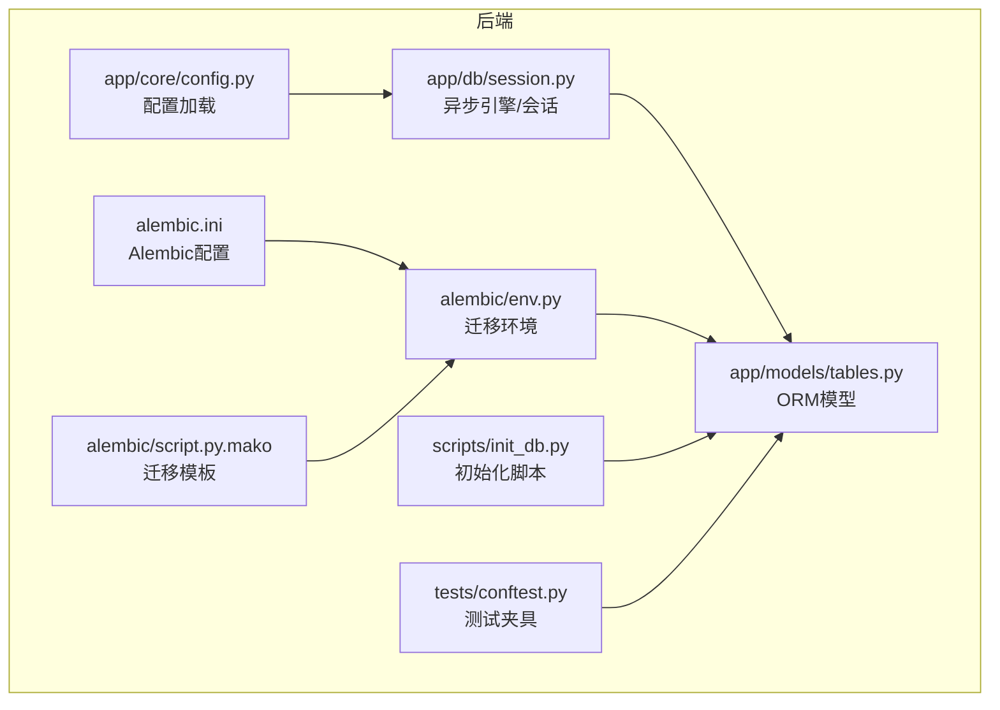
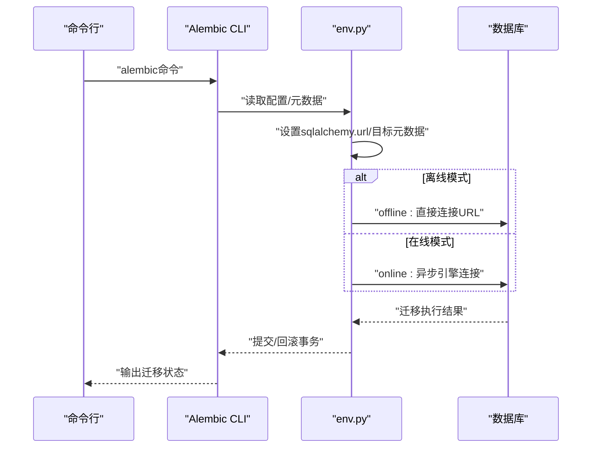
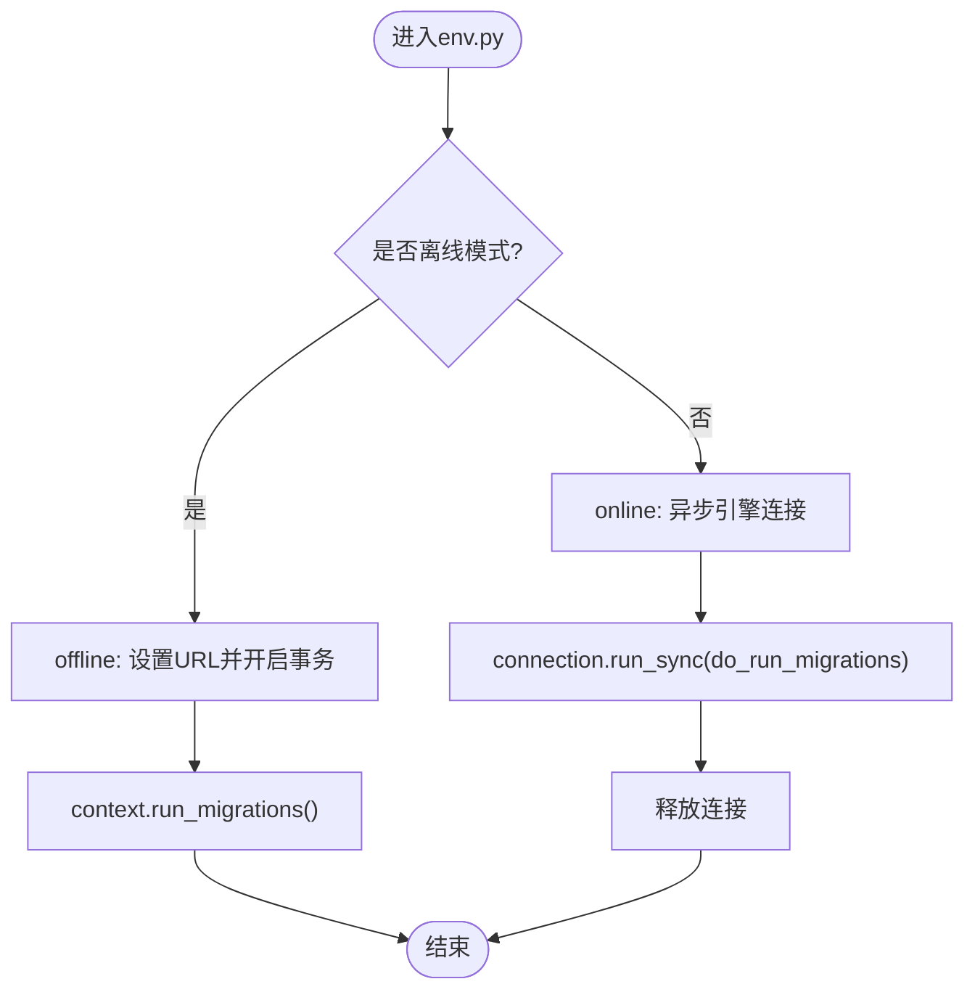
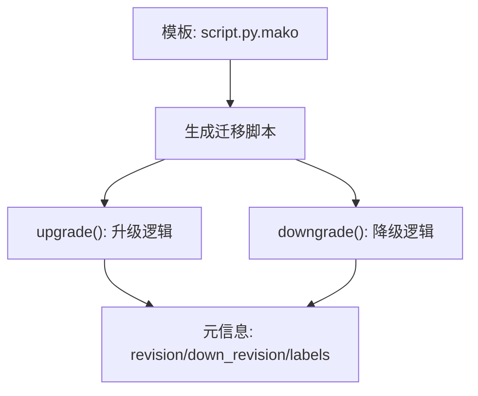
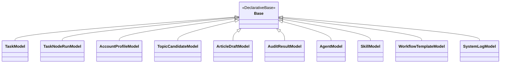
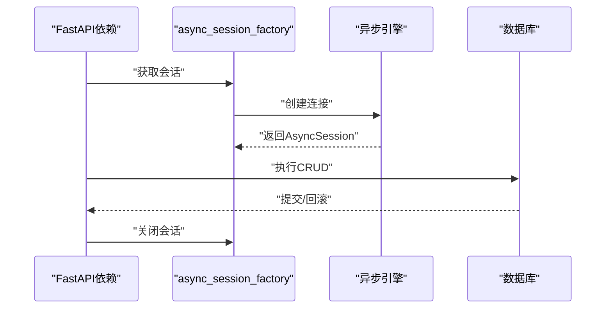
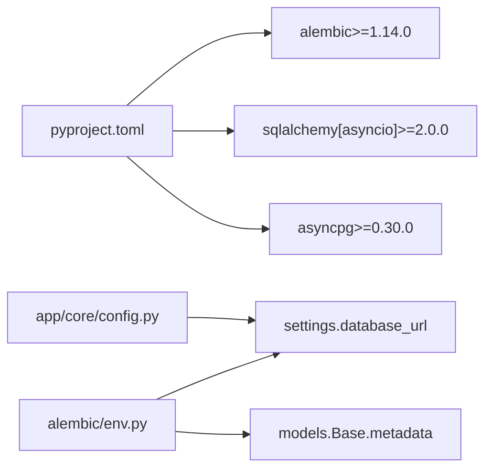

# 数据库迁移系统

<cite>
**本文引用的文件**
- [backend/alembic/env.py](file://backend/alembic/env.py)
- [backend/alembic/script.py.mako](file://backend/alembic/script.py.mako)
- [backend/alembic.ini](file://backend/alembic.ini)
- [backend/pyproject.toml](file://backend/pyproject.toml)
- [backend/app/db/session.py](file://backend/app/db/session.py)
- [backend/app/models/tables.py](file://backend/app/models/tables.py)
- [backend/app/core/config.py](file://backend/app/core/config.py)
- [scripts/init_db.py](file://scripts/init_db.py)
- [backend/tests/conftest.py](file://backend/tests/conftest.py)
- [ARCHITECTURE.md](file://ARCHITECTURE.md)
- [start.sh](file://start.sh)
- [start.bat](file://start.bat)
</cite>

## 目录
1. [简介](#简介)
2. [项目结构](#项目结构)
3. [核心组件](#核心组件)
4. [架构总览](#架构总览)
5. [详细组件分析](#详细组件分析)
6. [依赖分析](#依赖分析)
7. [性能考量](#性能考量)
8. [故障排除指南](#故障排除指南)
9. [结论](#结论)
10. [附录](#附录)

## 简介
本文件为HotClaw数据库迁移系统的技术文档，围绕Alembic迁移框架在异步SQLAlchemy环境下的配置与使用展开，覆盖迁移环境设置、版本控制策略、迁移脚本生成、数据库版本演进管理（表结构变更、索引增删、数据迁移）、迁移命令使用（创建、应用、回滚、版本对比）、数据迁移最佳实践（备份、增量迁移、向后兼容）、以及故障排除与常见问题解决方案。文档同时提供面向DBA与开发者的完整迁移操作手册。

## 项目结构
HotClaw后端采用FastAPI + SQLAlchemy 2.0异步ORM + Alembic迁移的组合。数据库模型集中于ORM层，Alembic迁移配置位于backend/alembic目录，数据库连接与会话管理位于app/db，配置由app/core/config提供，测试与初始化脚本分别位于tests与scripts。

图表来源
- [backend/alembic/env.py:1-53](file://backend/alembic/env.py#L1-L53)
- [backend/alembic/script.py.mako:1-25](file://backend/alembic/script.py.mako#L1-L25)
- [backend/alembic.ini:1-39](file://backend/alembic.ini#L1-L39)
- [backend/app/db/session.py:1-33](file://backend/app/db/session.py#L1-L33)
- [backend/app/models/tables.py:1-233](file://backend/app/models/tables.py#L1-L233)
- [backend/app/core/config.py:1-51](file://backend/app/core/config.py#L1-L51)
- [scripts/init_db.py:1-16](file://scripts/init_db.py#L1-L16)
- [backend/tests/conftest.py:1-48](file://backend/tests/conftest.py#L1-L48)

章节来源
- [backend/alembic/env.py:1-53](file://backend/alembic/env.py#L1-L53)
- [backend/alembic/script.py.mako:1-25](file://backend/alembic/script.py.mako#L1-L25)
- [backend/alembic.ini:1-39](file://backend/alembic.ini#L1-L39)
- [backend/app/db/session.py:1-33](file://backend/app/db/session.py#L1-L33)
- [backend/app/models/tables.py:1-233](file://backend/app/models/tables.py#L1-L233)
- [backend/app/core/config.py:1-51](file://backend/app/core/config.py#L1-L51)
- [scripts/init_db.py:1-16](file://scripts/init_db.py#L1-L16)
- [backend/tests/conftest.py:1-48](file://backend/tests/conftest.py#L1-L48)

## 核心组件
- Alembic迁移环境配置：异步迁移、离线迁移、元数据目标绑定、日志配置。
- 迁移脚本模板：升级/降级入口、分支标签与依赖声明。
- 数据库模型：统一的DeclarativeBase基类与各业务表定义。
- 异步数据库会话：异步引擎、会话工厂与FastAPI依赖注入。
- 配置系统：数据库URL、调试开关、环境变量加载。
- 初始化与测试：一次性创建所有表的脚本与测试夹具。

章节来源
- [backend/alembic/env.py:1-53](file://backend/alembic/env.py#L1-L53)
- [backend/alembic/script.py.mako:1-25](file://backend/alembic/script.py.mako#L1-L25)
- [backend/app/models/tables.py:1-233](file://backend/app/models/tables.py#L1-L233)
- [backend/app/db/session.py:1-33](file://backend/app/db/session.py#L1-L33)
- [backend/app/core/config.py:1-51](file://backend/app/core/config.py#L1-L51)
- [scripts/init_db.py:1-16](file://scripts/init_db.py#L1-L16)
- [backend/tests/conftest.py:1-48](file://backend/tests/conftest.py#L1-L48)

## 架构总览
HotClaw的数据库迁移架构以Alembic为核心，结合异步SQLAlchemy与统一的ORM模型，形成“配置驱动、模板生成、在线/离线迁移”的完整流程。迁移环境根据配置动态设置数据库URL，绑定目标元数据，支持离线与在线两种执行路径。

图表来源
- [backend/alembic/env.py:21-52](file://backend/alembic/env.py#L21-L52)
- [backend/alembic.ini:3-5](file://backend/alembic.ini#L3-L5)

## 详细组件分析

### Alembic迁移环境配置（env.py）
- 异步迁移：通过异步引擎创建连接，使用run_sync执行迁移。
- 离线迁移：直接从配置读取URL，启用literal_binds进行静态迁移。
- 元数据绑定：target_metadata指向ORM Base.metadata，确保迁移覆盖所有模型。
- 日志配置：基于配置文件加载日志器，控制SQLAlchemy与Alembic输出级别。

图表来源
- [backend/alembic/env.py:21-52](file://backend/alembic/env.py#L21-L52)

章节来源
- [backend/alembic/env.py:1-53](file://backend/alembic/env.py#L1-L53)

### 迁移脚本模板（script.py.mako）
- 升级/降级入口：upgrade与downgrade函数作为迁移逻辑的占位符。
- 元信息：revision、down_revision、branch_labels、depends_on用于版本链与分支管理。
- 导入占位：支持在生成的迁移脚本中插入自定义导入与SQL语句。

图表来源
- [backend/alembic/script.py.mako:1-25](file://backend/alembic/script.py.mako#L1-L25)

章节来源
- [backend/alembic/script.py.mako:1-25](file://backend/alembic/script.py.mako#L1-L25)

### 数据库模型（models/tables.py）
- 统一基类：所有ORM模型继承自Base，确保Alembic扫描与迁移覆盖。
- 表结构：涵盖任务、节点运行、账号画像、话题候选、文章草稿、审核结果、智能体、技能、工作流模板、系统日志等。
- 索引与约束：部分模型包含索引列（如trace_id、task_id），便于查询优化。

图表来源
- [backend/app/models/tables.py:18-233](file://backend/app/models/tables.py#L18-L233)

章节来源
- [backend/app/models/tables.py:1-233](file://backend/app/models/tables.py#L1-L233)

### 异步数据库会话（db/session.py）
- 引擎创建：基于配置的数据库URL创建异步引擎，SQLite场景禁用pool_pre_ping。
- 会话工厂：异步会话工厂，expire_on_commit=False以提升性能。
- FastAPI依赖：提供异步会话依赖，自动commit/rollback/关闭，简化事务管理。

图表来源
- [backend/app/db/session.py:22-33](file://backend/app/db/session.py#L22-L33)

章节来源
- [backend/app/db/session.py:1-33](file://backend/app/db/session.py#L1-L33)

### 配置系统（core/config.py）
- 数据库URL：开发默认SQLite，生产默认SQLite（注释提示PostgreSQL），可通过环境变量覆盖。
- Redis、LLM、应用参数、日志级别、超时等配置项。
- 环境文件：默认读取项目根目录.env，UTF-8编码。

章节来源
- [backend/app/core/config.py:1-51](file://backend/app/core/config.py#L1-L51)

### 初始化与测试（scripts/init_db.py、tests/conftest.py）
- 初始化脚本：一次性创建所有表，适用于首次部署或快速初始化。
- 测试夹具：使用内存SQLite，创建/销毁测试表，模拟真实迁移环境。

章节来源
- [scripts/init_db.py:1-16](file://scripts/init_db.py#L1-L16)
- [backend/tests/conftest.py:1-48](file://backend/tests/conftest.py#L1-L48)

## 依赖分析
- Alembic版本：pyproject.toml声明了alembic>=1.14.0，确保异步迁移与模板生成能力。
- SQLAlchemy异步：依赖sqlalchemy[asyncio]与asyncpg，支持异步连接与迁移。
- 配置来源：Alembic env.py从settings.database_url读取URL，settings来自core/config.py。

图表来源
- [backend/pyproject.toml:1-41](file://backend/pyproject.toml#L1-L41)
- [backend/app/core/config.py:11-14](file://backend/app/core/config.py#L11-L14)
- [backend/alembic/env.py:9-18](file://backend/alembic/env.py#L9-L18)

章节来源
- [backend/pyproject.toml:1-41](file://backend/pyproject.toml#L1-L41)
- [backend/alembic/env.py:1-53](file://backend/alembic/env.py#L1-L53)
- [backend/app/core/config.py:1-51](file://backend/app/core/config.py#L1-L51)

## 性能考量
- 异步引擎：使用异步连接池减少I/O阻塞，提升迁移与查询性能。
- 连接预热：SQLite禁用pool_pre_ping，避免不支持的参数；其他数据库启用以保持连接活性。
- 事务粒度：迁移在单事务内执行，失败自动回滚，避免部分迁移导致的数据不一致。
- 日志级别：Alembic日志INFO级别，SQLAlchemy引擎日志WARN级别，平衡可观测性与性能。

## 故障排除指南
- 迁移无法连接数据库
  - 检查数据库URL是否正确（开发默认SQLite，生产建议PostgreSQL）。
  - 确认环境变量已正确加载，Alembic配置文件中的sqlalchemy.url与应用配置一致。
- 迁移执行失败
  - 在离线模式下，确认literal_binds启用且URL有效。
  - 在在线模式下，检查异步引擎连接参数与数据库可达性。
- 元数据未更新
  - 确保ORM模型均继承自Base，且env.py中target_metadata绑定为Base.metadata。
- 测试环境差异
  - 测试使用内存SQLite，若迁移行为与生产不同，需在测试中显式创建表或使用迁移脚本。
- 启动脚本相关
  - start.sh/start.bat会安装依赖并启动前后端，若数据库迁移异常，先确认后端服务已成功启动并监听端口。

章节来源
- [backend/alembic/env.py:21-52](file://backend/alembic/env.py#L21-L52)
- [backend/alembic.ini:3-5](file://backend/alembic.ini#L3-L5)
- [backend/app/core/config.py:11-14](file://backend/app/core/config.py#L11-L14)
- [backend/tests/conftest.py:13-14](file://backend/tests/conftest.py#L13-L14)
- [start.sh:52-65](file://start.sh#L52-L65)
- [start.bat:48-58](file://start.bat#L48-L58)

## 结论
HotClaw的数据库迁移系统以Alembic为核心，结合异步SQLAlchemy与统一的ORM模型，提供了可靠的版本演进管理能力。通过配置驱动的URL管理、模板化的迁移脚本生成、以及在线/离线双通道迁移，系统能够满足开发、测试与生产的多样化需求。遵循本文提供的最佳实践与故障排除指南，DBA与开发者可高效、安全地完成数据库版本演进与维护。

## 附录

### 迁移命令使用手册
- 创建迁移
  - 使用Alembic CLI生成迁移脚本，模板包含upgrade与downgrade占位。
  - 生成后在脚本中编写具体的DDL/DML变更。
- 应用迁移
  - 在线模式：Alembic通过异步引擎连接数据库并执行迁移。
  - 离线模式：直接使用URL执行迁移，适合CI/CD或无应用进程场景。
- 回滚迁移
  - 使用downgrade指定目标版本，确保downgrade逻辑完整且幂等。
- 版本对比
  - 通过compare_model_and_db对比当前模型与数据库实际结构差异，辅助生成迁移脚本。

章节来源
- [backend/alembic/script.py.mako:19-24](file://backend/alembic/script.py.mako#L19-L24)
- [backend/alembic/env.py:21-52](file://backend/alembic/env.py#L21-L52)
- [backend/alembic.ini:3-5](file://backend/alembic.ini#L3-L5)

### 数据迁移最佳实践
- 数据备份
  - 在执行重大变更前，导出数据库快照或使用数据库自带备份工具。
- 增量迁移
  - 将大变更拆分为多个小迁移，降低单次迁移风险与回滚成本。
- 向后兼容
  - 优先保证新增字段与默认值，避免破坏现有查询；必要时提供数据补丁脚本。
- 可观测性
  - 开启Alembic与SQLAlchemy日志，记录迁移过程中的关键事件与错误。

章节来源
- [backend/alembic.ini:25-28](file://backend/alembic.ini#L25-L28)
- [backend/alembic/env.py:15-16](file://backend/alembic/env.py#L15-L16)

### 数据库版本演进管理
- 表结构变更
  - 使用upgrade编写CREATE/ALTER TABLE，downgrade编写DROP/ALTER TABLE。
- 索引增删
  - 在迁移脚本中显式创建/删除索引，避免隐式依赖导致的迁移失败。
- 数据迁移策略
  - 对于需要重算或转换的数据，编写数据迁移步骤，确保幂等与可回滚。

章节来源
- [backend/alembic/script.py.mako:19-24](file://backend/alembic/script.py.mako#L19-L24)
- [backend/app/models/tables.py:220-233](file://backend/app/models/tables.py#L220-L233)