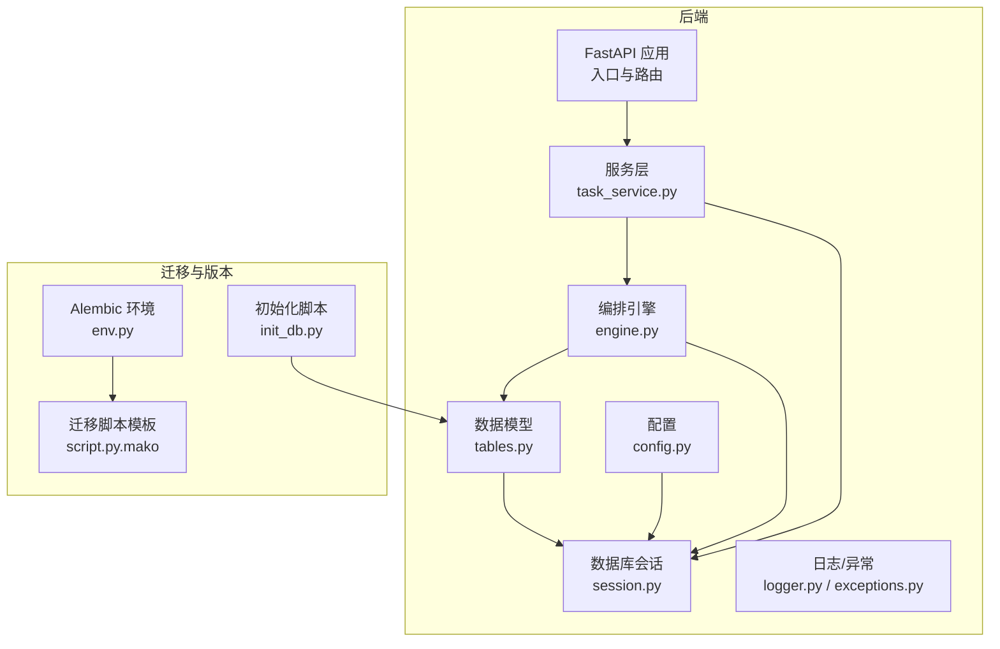
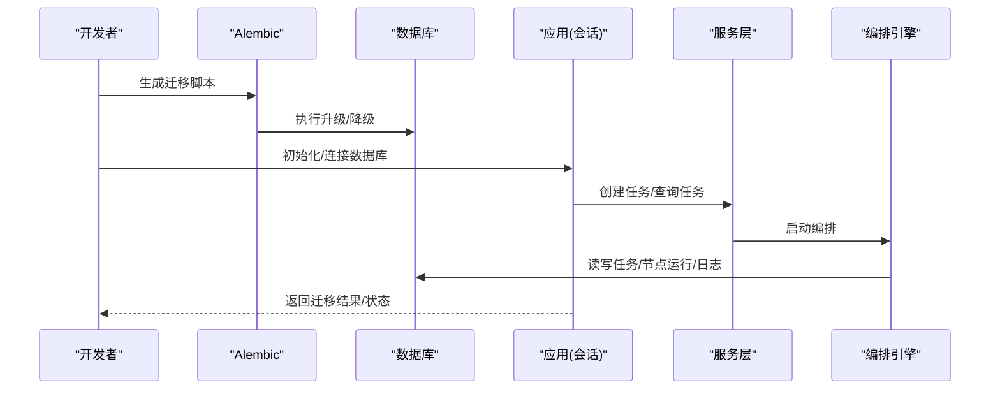
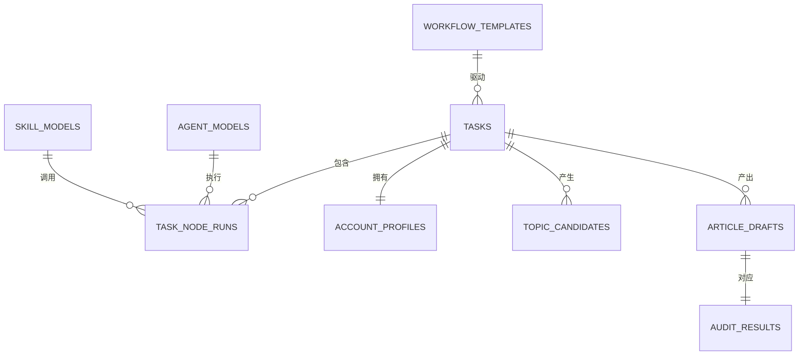
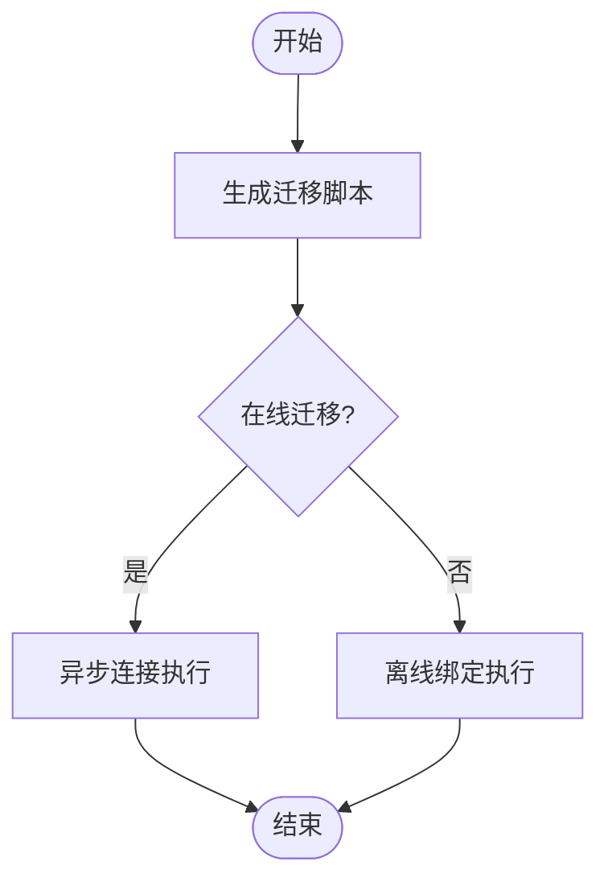
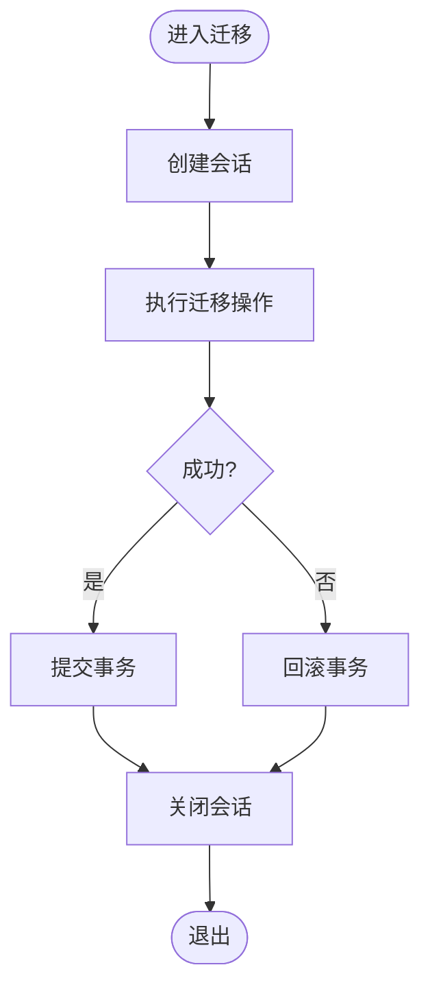
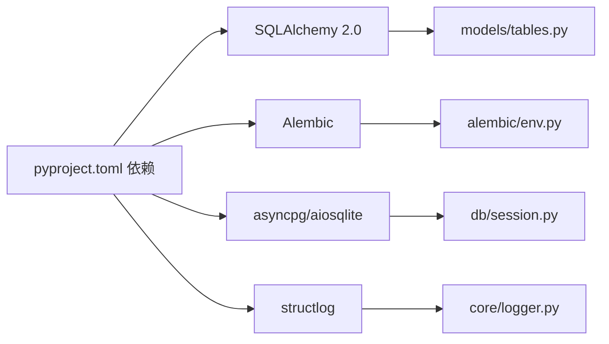

# 数据迁移策略

<cite>
**本文引用的文件**   
- [ARCHITECTURE.md](file://ARCHITECTURE.md)
- [pyproject.toml](file://backend/pyproject.toml)
- [tables.py](file://backend/app/models/tables.py)
- [session.py](file://backend/app/db/session.py)
- [env.py](file://backend/alembic/env.py)
- [script.py.mako](file://backend/alembic/script.py.mako)
- [init_db.py](file://scripts/init_db.py)
- [config.py](file://backend/app/core/config.py)
- [task_service.py](file://backend/app/services/task_service.py)
- [engine.py](file://backend/app/orchestrator/engine.py)
- [logger.py](file://backend/app/core/logger.py)
- [exceptions.py](file://backend/app/core/exceptions.py)
- [test_agent_api.py](file://backend/tests/test_agent_api.py)
</cite>

## 目录
1. [简介](#简介)
2. [项目结构](#项目结构)
3. [核心组件](#核心组件)
4. [架构总览](#架构总览)
5. [详细组件分析](#详细组件分析)
6. [依赖分析](#依赖分析)
7. [性能考量](#性能考量)
8. [故障排查指南](#故障排查指南)
9. [结论](#结论)
10. [附录](#附录)

## 简介
本文件面向数据工程师与DBA，系统化阐述HotClaw平台的数据迁移策略与实践。围绕“结构迁移、数据迁移、混合迁移”的不同场景，给出可落地的实施方案；明确备份与恢复策略（完整、增量、选择性）；解释向后兼容性保障机制（格式转换、默认值、完整性校验）；提供大数据量迁移的性能优化建议（分批、索引重建、事务管理）；并配套测试验证方法与回滚/修复方案。

## 项目结构
HotClaw后端采用FastAPI + SQLAlchemy 2.0异步ORM + Alembic进行数据库版本治理，核心数据模型集中在models层，数据库会话管理在db层，迁移脚本由Alembic提供。整体结构如下：

图表来源
- [engine.py:89-285](file://backend/app/orchestrator/engine.py#L89-L285)
- [task_service.py:20-126](file://backend/app/services/task_service.py#L20-L126)
- [tables.py:23-233](file://backend/app/models/tables.py#L23-L233)
- [session.py:1-33](file://backend/app/db/session.py#L1-L33)
- [env.py:1-53](file://backend/alembic/env.py#L1-L53)
- [script.py.mako:1-25](file://backend/alembic/script.py.mako#L1-L25)
- [init_db.py:1-16](file://scripts/init_db.py#L1-L16)

章节来源
- [ARCHITECTURE.md:401-448](file://ARCHITECTURE.md#L401-L448)
- [pyproject.toml:1-41](file://backend/pyproject.toml#L1-L41)

## 核心组件
- 数据模型层：定义了任务、节点运行、账号画像、选题候选、文章草稿、审核结果、Agent/Skill/工作流模板、系统日志等核心表，具备完整的生命周期字段与JSON结构化存储能力，便于迁移过程中的结构演进与兼容。
- 会话与事务：异步会话工厂与自动提交/回滚逻辑，确保迁移过程中的事务一致性。
- 迁移框架：Alembic异步环境适配，支持在线/离线迁移，配合脚本模板生成版本化迁移。
- 初始化脚本：一键创建所有表，便于新环境快速就绪。
- 配置与日志：集中化的数据库URL、日志级别与结构化日志，为迁移过程可观测性提供基础。

章节来源
- [tables.py:23-233](file://backend/app/models/tables.py#L23-L233)
- [session.py:1-33](file://backend/app/db/session.py#L1-L33)
- [env.py:1-53](file://backend/alembic/env.py#L1-L53)
- [script.py.mako:1-25](file://backend/alembic/script.py.mako#L1-L25)
- [init_db.py:1-16](file://scripts/init_db.py#L1-L16)
- [config.py:7-51](file://backend/app/core/config.py#L7-L51)
- [logger.py:1-36](file://backend/app/core/logger.py#L1-L36)

## 架构总览
下图展示迁移相关的关键组件与交互路径，涵盖结构迁移（Schema）、数据迁移（Record）与混合迁移（Schema+Record）的典型流程。

图表来源
- [env.py:21-52](file://backend/alembic/env.py#L21-L52)
- [session.py:22-33](file://backend/app/db/session.py#L22-L33)
- [task_service.py:22-63](file://backend/app/services/task_service.py#L22-L63)
- [engine.py:92-234](file://backend/app/orchestrator/engine.py#L92-L234)

## 详细组件分析

### 数据模型与迁移基线
- 表结构覆盖任务全生命周期、节点运行明细、账号画像、选题候选、文章草稿、审核结果、Agent/Skill/工作流模板、系统日志等，便于在迁移过程中保持数据完整性与可审计性。
- JSON字段广泛用于结构化存储，利于在不破坏结构的前提下扩展字段与默认值。
- 时间戳字段与状态字段为迁移过程中的筛选、排序与回放提供支撑。

图表来源
- [tables.py:23-233](file://backend/app/models/tables.py#L23-L233)

章节来源
- [tables.py:23-233](file://backend/app/models/tables.py#L23-L233)

### 迁移脚手架与版本治理
- Alembic环境适配异步引擎，支持在线迁移；离线模式下可直接生成迁移脚本。
- 迁移脚本模板提供升级/降级骨架，结合env.py中的metadata与URL配置，确保迁移与当前模型一致。

图表来源
- [env.py:21-52](file://backend/alembic/env.py#L21-L52)
- [script.py.mako:19-24](file://backend/alembic/script.py.mako#L19-L24)

章节来源
- [env.py:1-53](file://backend/alembic/env.py#L1-L53)
- [script.py.mako:1-25](file://backend/alembic/script.py.mako#L1-L25)

### 会话与事务管理
- 异步会话工厂与依赖注入，确保每次请求/迁移在独立事务内执行；异常时自动回滚，最终关闭会话，避免资源泄漏。
- 适用于迁移过程中的批量写入与一致性保障。

图表来源
- [session.py:22-33](file://backend/app/db/session.py#L22-L33)

章节来源
- [session.py:1-33](file://backend/app/db/session.py#L1-L33)

### 初始化与基线构建
- 初始化脚本通过异步引擎创建所有表，适合新环境快速就绪与迁移后验证。
- 建议在迁移前先执行初始化，确保目标环境具备正确的表结构。

章节来源
- [init_db.py:1-16](file://scripts/init_db.py#L1-L16)

### 服务层与编排对迁移的影响
- 任务服务负责任务创建、运行与查询，编排引擎负责节点执行与状态广播。迁移期间应避免并发写入导致的冲突，必要时暂停新任务或采用幂等写入。
- 日志与异常体系为迁移过程提供可观测性与可追溯性。

章节来源
- [task_service.py:20-126](file://backend/app/services/task_service.py#L20-L126)
- [engine.py:89-285](file://backend/app/orchestrator/engine.py#L89-L285)
- [logger.py:1-36](file://backend/app/core/logger.py#L1-L36)
- [exceptions.py:1-125](file://backend/app/core/exceptions.py#L1-L125)

## 依赖分析
- 数据库驱动：PostgreSQL（asyncpg）与SQLite（aiosqlite）均可通过配置切换，迁移时需确保目标数据库类型与驱动一致。
- ORM与迁移：SQLAlchemy 2.0 + Alembic，版本治理与模型同步依赖env.py中的metadata与URL。
- 日志与配置：structlog结构化日志与pydantic-settings配置加载，便于迁移过程的观测与调试。

图表来源
- [pyproject.toml:6-22](file://backend/pyproject.toml#L6-L22)
- [tables.py:1-20](file://backend/app/models/tables.py#L1-L20)
- [env.py:1-18](file://backend/alembic/env.py#L1-L18)
- [session.py:1-19](file://backend/app/db/session.py#L1-L19)
- [logger.py:1-36](file://backend/app/core/logger.py#L1-L36)

章节来源
- [pyproject.toml:1-41](file://backend/pyproject.toml#L1-L41)

## 性能考量
- 分批处理：对大表迁移采用分页/分批写入，降低锁竞争与内存占用；结合事务批量提交提升吞吐。
- 索引策略：迁移前可禁用非必要索引，迁移完成后重建；避免重复计算索引成本。
- 事务管理：长事务拆分为多个短事务，失败时可局部回滚；迁移完成后一次性提交。
- 异步I/O：利用异步会话与异步数据库驱动，提升并发与吞吐。
- 配置优化：根据目标数据库特性调整连接池、预检与超时参数，确保稳定性。

## 故障排查指南
- 迁移失败
  - 检查Alembic配置与数据库URL是否正确；确认env.py中的metadata与当前模型一致。
  - 查看结构化日志，定位异常节点与错误码；必要时启用更详细的日志级别。
  - 使用回滚脚本恢复到上一个稳定版本，再针对性修复问题。
- 数据不一致
  - 对比迁移前后关键表的记录数与关键字段；核对任务状态与节点运行记录。
  - 使用服务层提供的查询接口验证任务与节点数据的完整性。
- 回滚与修复
  - 通过Alembic降级到上一版本；修复后再进行增量升级。
  - 对异常数据进行抽样修复，确保修复后不影响整体一致性。

章节来源
- [env.py:1-53](file://backend/alembic/env.py#L1-L53)
- [logger.py:1-36](file://backend/app/core/logger.py#L1-L36)
- [exceptions.py:1-125](file://backend/app/core/exceptions.py#L1-L125)
- [task_service.py:65-122](file://backend/app/services/task_service.py#L65-L122)

## 结论
HotClaw的数据迁移策略以“结构与数据双轨并行”为核心：结构迁移通过Alembic与模型同步，数据迁移通过分批、事务与索引策略保障性能与一致性。配合完善的日志、异常与初始化脚本，形成可验证、可回滚、可修复的闭环。建议在生产迁移前制定详尽的演练计划与回退预案，确保零失误上线。

## 附录

### 数据迁移策略与实施方案

- 结构迁移
  - 使用Alembic生成迁移脚本，确保目标数据库与当前模型一致；在线迁移时注意连接参数与预检。
  - 升级前冻结新任务写入，升级后验证表结构与索引；降级时保留数据安全。
- 数据迁移
  - 采用分批读取与批量写入，结合事务提交；对大表先迁移主表，再迁移关联表。
  - 迁移完成后重建索引，评估性能并进行压测。
- 混合迁移
  - 先结构迁移，再数据迁移；若涉及字段重命名或类型变更，采用临时列+数据拷贝+替换的方式，减少停机时间。

章节来源
- [env.py:21-52](file://backend/alembic/env.py#L21-L52)
- [script.py.mako:19-24](file://backend/alembic/script.py.mako#L19-L24)
- [session.py:22-33](file://backend/app/db/session.py#L22-L33)

### 备份与恢复策略
- 完整备份：在迁移前对目标数据库执行完整备份，确保可完全回滚。
- 增量备份：迁移期间开启增量备份，缩短RPO；定期校验备份完整性。
- 选择性备份：针对关键表（任务、节点运行、日志）进行选择性备份，兼顾恢复速度与成本。
- 恢复验证：迁移后执行抽样校验与业务逻辑验证，确保数据可用性。

### 向后兼容性保障
- 数据格式转换：通过JSON字段与默认值策略，兼容旧版本字段缺失或格式差异。
- 字段默认值：在模型层设置合理的默认值，避免迁移后出现空值导致的业务异常。
- 数据完整性验证：迁移后执行一致性检查（记录数、关键字段、外键约束），并进行业务逻辑抽样验证。

### 大数据量迁移的性能优化
- 分批处理：按主键范围或分区键分批迁移，降低锁竞争。
- 索引重建：迁移前删除非必要索引，迁移后批量重建，减少重复计算。
- 事务管理：短事务+批量提交，失败可局部回滚；迁移完成后一次性提交。
- 异步I/O：使用异步会话与驱动，提升并发与吞吐。

### 测试验证方法
- 数据一致性检查：对比迁移前后关键表的记录数、关键字段与外键关系。
- 业务逻辑验证：通过服务层接口验证任务创建、运行与查询流程，确保迁移后业务可用。
- 回归测试：在测试环境中模拟生产数据规模，验证迁移脚本与流程的稳定性。

章节来源
- [task_service.py:65-122](file://backend/app/services/task_service.py#L65-L122)
- [test_agent_api.py:7-28](file://backend/tests/test_agent_api.py#L7-L28)