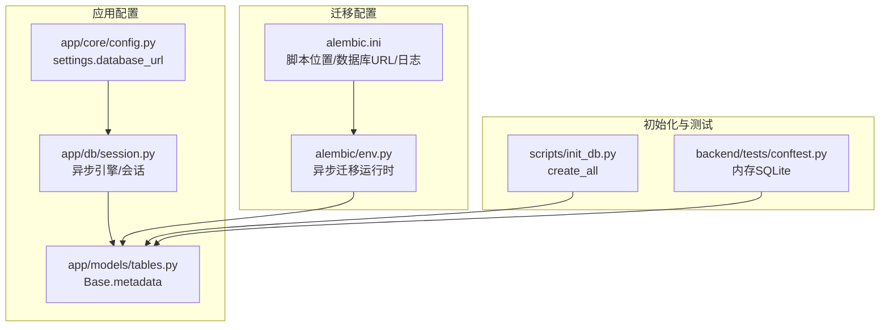
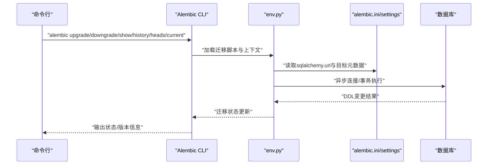
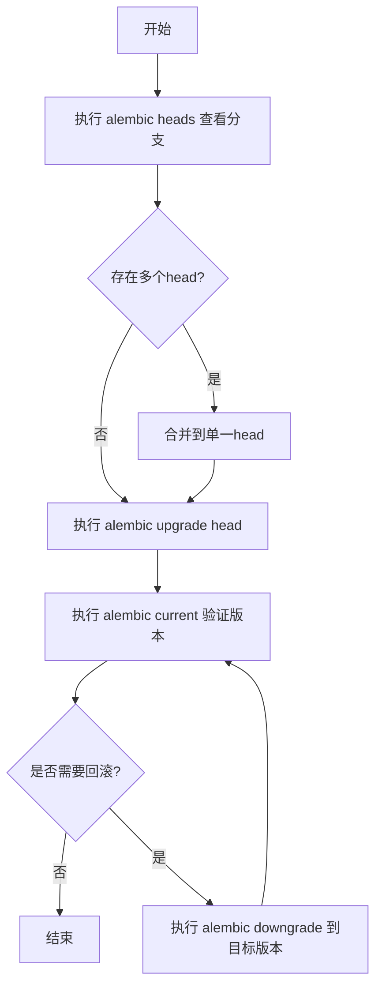
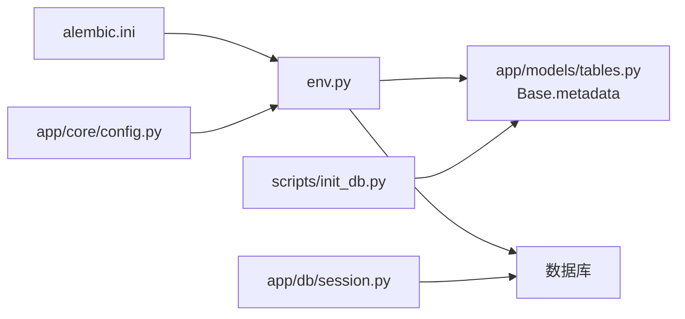

# 迁移命令管理

<cite>
**本文引用的文件**
- [alembic.ini](file://backend/alembic.ini)
- [env.py](file://backend/alembic/env.py)
- [config.py](file://backend/app/core/config.py)
- [tables.py](file://backend/app/models/tables.py)
- [session.py](file://backend/app/db/session.py)
- [init_db.py](file://scripts/init_db.py)
- [conftest.py](file://backend/tests/conftest.py)
- [pyproject.toml](file://backend/pyproject.toml)
</cite>

## 目录
1. [简介](#简介)
2. [项目结构](#项目结构)
3. [核心组件](#核心组件)
4. [架构总览](#架构总览)
5. [详细组件分析](#详细组件分析)
6. [依赖关系分析](#依赖关系分析)
7. [性能考量](#性能考量)
8. [故障排查指南](#故障排查指南)
9. [结论](#结论)
10. [附录](#附录)

## 简介
本文件面向DBA与运维人员，系统化梳理HotClaw后端在异步SQLAlchemy与Alembic环境下的迁移命令管理实践。重点覆盖以下方面：
- Alembic常用命令：revision、upgrade、downgrade、show、current、history、heads
- 迁移状态查询与输出解读
- 批量迁移与条件迁移（版本范围、跳过特定迁移）
- 迁移锁定与并发控制（含多环境协调建议）
- 命令组合模式与复杂场景处理
- 错误处理与恢复策略
- 面向开发与生产的配置衔接（env.py、alembic.ini、settings）

## 项目结构
后端迁移相关的关键位置与职责如下：
- alembic配置与入口
  - alembic.ini：定义脚本位置、数据库URL、日志级别
  - alembic/env.py：异步迁移运行时配置，连接元数据与上下文
- 应用配置与模型
  - app/core/config.py：从环境变量读取数据库URL（开发默认SQLite，生产默认PostgreSQL）
  - app/models/tables.py：ORM模型基类与业务表定义
  - app/db/session.py：异步引擎与会话工厂
- 初始化与测试
  - scripts/init_db.py：一次性初始化所有表（非迁移路径）
  - backend/tests/conftest.py：测试中使用内存SQLite并自动建表/清表
- 依赖声明
  - backend/pyproject.toml：声明Alembic版本与异步依赖

**图表来源**
- [alembic.ini:1-39](file://backend/alembic.ini#L1-L39)
- [env.py:1-53](file://backend/alembic/env.py#L1-L53)
- [config.py:1-51](file://backend/app/core/config.py#L1-L51)
- [session.py:1-33](file://backend/app/db/session.py#L1-L33)
- [tables.py:1-233](file://backend/app/models/tables.py#L1-L233)
- [init_db.py:1-16](file://scripts/init_db.py#L1-L16)
- [conftest.py:1-48](file://backend/tests/conftest.py#L1-L48)

**章节来源**
- [alembic.ini:1-39](file://backend/alembic.ini#L1-L39)
- [env.py:1-53](file://backend/alembic/env.py#L1-L53)
- [config.py:1-51](file://backend/app/core/config.py#L1-L51)
- [session.py:1-33](file://backend/app/db/session.py#L1-L33)
- [tables.py:1-233](file://backend/app/models/tables.py#L1-L233)
- [init_db.py:1-16](file://scripts/init_db.py#L1-L16)
- [conftest.py:1-48](file://backend/tests/conftest.py#L1-L48)
- [pyproject.toml:1-41](file://backend/pyproject.toml#L1-L41)

## 核心组件
- Alembic配置与运行时
  - alembic.ini：定义脚本位置与数据库URL；通过env.py在运行时注入实际连接字符串
  - alembic/env.py：设置目标元数据、离线/在线迁移分支、异步连接与事务边界
- 应用配置与模型
  - app/core/config.py：提供settings.database_url，支持开发（SQLite）与生产（PostgreSQL）双态
  - app/models/tables.py：定义Base.metadata，供Alembic扫描并生成迁移
  - app/db/session.py：异步引擎与会话工厂，用于应用与测试
- 初始化与测试
  - scripts/init_db.py：直接create_all，不经过迁移流程
  - backend/tests/conftest.py：测试使用内存SQLite，自动建表/清表

**章节来源**
- [alembic.ini:1-39](file://backend/alembic.ini#L1-L39)
- [env.py:1-53](file://backend/alembic/env.py#L1-L53)
- [config.py:1-51](file://backend/app/core/config.py#L1-L51)
- [tables.py:1-233](file://backend/app/models/tables.py#L1-L233)
- [session.py:1-33](file://backend/app/db/session.py#L1-L33)
- [init_db.py:1-16](file://scripts/init_db.py#L1-L16)
- [conftest.py:1-48](file://backend/tests/conftest.py#L1-L48)

## 架构总览
下图展示迁移命令在HotClaw中的调用链路与关键交互点。

**图表来源**
- [env.py:1-53](file://backend/alembic/env.py#L1-L53)
- [alembic.ini:1-39](file://backend/alembic.ini#L1-L39)
- [config.py:1-51](file://backend/app/core/config.py#L1-L51)

## 详细组件分析

### Alembic命令速查与实践要点
- revision（创建新迁移）
  - 作用：生成新的迁移脚本，通常由模型变更触发
  - 实践要点：确保env.py已正确绑定Base.metadata；在生产环境建议先在预发布环境验证
  - 参考路径：[env.py](file://backend/alembic/env.py#L18)
- upgrade（向上迁移）
  - 作用：将数据库迁移到指定版本（如head或具体版本号）
  - 版本范围：可使用“基准版本..目标版本”进行批量升级
  - 跳过迁移：可通过“-x skip_stamps=版本号”参数跳过特定迁移（需配合迁移脚本支持）
  - 参考路径：[alembic.ini:3-5](file://backend/alembic.ini#L3-L5)
- downgrade（向下迁移）
  - 作用：回滚到指定版本（如前一版本或基础版本）
  - 版本范围：可使用“基准版本..目标版本”进行批量回滚
  - 注意：downgrade需要迁移脚本具备逆向逻辑
  - 参考路径：[alembic.ini:3-5](file://backend/alembic.ini#L3-L5)
- show（查看迁移详情）
  - 作用：显示指定版本的迁移内容摘要与描述
  - 参考路径：[env.py](file://backend/alembic/env.py#L18)
- current（查看当前版本）
  - 作用：列出当前数据库所处的版本与状态
  - 输出解读：关注“当前版本”、“是否锁定”、“head列表”
- history（查看历史）
  - 作用：按时间顺序列出所有迁移记录
  - 输出解读：关注“版本号/描述/日期/分支/父版本”，用于定位冲突与回滚路径
- heads（查看最新头版本）
  - 作用：显示所有未合并的head（多分支场景）
  - 输出解读：当存在多个head时，需先合并再继续迁移

**章节来源**
- [env.py:1-53](file://backend/alembic/env.py#L1-L53)
- [alembic.ini:1-39](file://backend/alembic.ini#L1-L39)

### 迁移状态查询与输出解读
- current
  - 关注点：当前数据库版本、是否处于锁定状态、head集合
  - 场景：多环境并行迁移时，用于确认各环境一致性
- history
  - 关注点：版本链路、父子关系、分支情况
  - 场景：发现分叉后，结合heads选择正确的head进行合并
- heads
  - 关注点：是否存在多个未合并head
  - 场景：修复分叉或强制合并到单一head

**章节来源**
- [env.py:1-53](file://backend/alembic/env.py#L1-L53)
- [alembic.ini:1-39](file://backend/alembic.ini#L1-L39)

### 批量迁移与条件迁移
- 版本范围指定
  - 升级：使用“基准版本..目标版本”进行批量升级
  - 回滚：使用“基准版本..目标版本”进行批量回滚
- 跳过特定迁移
  - 方法：通过“-x skip_stamps=版本号”跳过某次迁移
  - 注意：仅在迁移脚本支持skip_stamps的前提下生效
- 条件迁移
  - 建议：在迁移脚本中加入条件判断（如仅在特定数据库类型/版本上执行），避免对不兼容环境产生副作用

**章节来源**
- [alembic.ini:3-5](file://backend/alembic.ini#L3-L5)
- [env.py:1-53](file://backend/alembic/env.py#L1-L53)

### 迁移锁定机制与并发控制
- 锁定机制
  - Alembic通过版本表记录迁移状态；若检测到其他进程正在迁移，通常会阻塞或报错
- 并发控制
  - 多环境部署建议：
    - 使用独立的迁移脚本目录与版本表隔离
    - 在CI/CD流水线中串行执行迁移，避免并行写入
    - 对于读多写少的只读副本，避免在副本上执行迁移
- 生产建议
  - 升级/回滚前务必备份数据库
  - 使用“dry-run”或“--sql”模式预演DDL（如可用），评估影响范围

**章节来源**
- [env.py:1-53](file://backend/alembic/env.py#L1-L53)
- [alembic.ini:1-39](file://backend/alembic.ini#L1-L39)

### 命令组合模式与复杂场景
- 模式A：从零到一（首次部署）
  - 步骤：revision → upgrade head
  - 说明：首次部署时，先生成初始迁移，再升级到head
- 模式B：修复分叉（多head）
  - 步骤：heads → 选择head → merge（如有需要）→ upgrade head
  - 说明：当出现多个head时，先合并到单一head，再继续升级
- 模式C：灰度回滚（定向回滚）
  - 步骤：downgrade 到目标版本 → 观察 → 再次upgrade
  - 说明：在问题暴露后快速回滚到稳定版本，再择机修复后升级
- 模式D：跨环境同步
  - 步骤：在主环境执行revision/upgrade → 将迁移脚本同步到其他环境 → 各环境upgrade
  - 说明：确保迁移脚本一致后再执行

**图表来源**
- [env.py:1-53](file://backend/alembic/env.py#L1-L53)
- [alembic.ini:1-39](file://backend/alembic.ini#L1-L39)

**章节来源**
- [env.py:1-53](file://backend/alembic/env.py#L1-L53)
- [alembic.ini:1-39](file://backend/alembic.ini#L1-L39)

### 错误处理与恢复策略
- 常见错误
  - 数据库连接失败：检查settings.database_url与网络连通性
  - 迁移冲突（分叉）：使用heads定位head，必要时合并
  - 权限不足：确保数据库用户具备DDL权限
- 恢复策略
  - 备份优先：每次重大变更前进行全量备份
  - 分阶段回滚：downgrade到最近一次稳定版本，修复后再逐步升级
  - 清理残留：若迁移卡住，检查版本表与锁状态，必要时手动清理（谨慎操作）
- 测试验证
  - 在测试环境复现迁移流程，确保脚本幂等与可逆
  - 参考测试配置：[conftest.py:1-48](file://backend/tests/conftest.py#L1-L48)

**章节来源**
- [config.py:1-51](file://backend/app/core/config.py#L1-L51)
- [conftest.py:1-48](file://backend/tests/conftest.py#L1-L48)

## 依赖关系分析
- 配置耦合
  - alembic.ini提供脚本位置与数据库URL模板
  - env.py在运行时将settings.database_url注入到Alembic配置
- 元数据耦合
  - env.py绑定Base.metadata，确保迁移扫描到所有模型
- 引擎与会话
  - app/db/session.py负责应用层异步连接
  - scripts/init_db.py使用create_all绕过迁移流程

**图表来源**
- [alembic.ini:1-39](file://backend/alembic.ini#L1-L39)
- [env.py:1-53](file://backend/alembic/env.py#L1-L53)
- [config.py:1-51](file://backend/app/core/config.py#L1-L51)
- [tables.py:1-233](file://backend/app/models/tables.py#L1-L233)
- [session.py:1-33](file://backend/app/db/session.py#L1-L33)
- [init_db.py:1-16](file://scripts/init_db.py#L1-L16)

**章节来源**
- [alembic.ini:1-39](file://backend/alembic.ini#L1-L39)
- [env.py:1-53](file://backend/alembic/env.py#L1-L53)
- [config.py:1-51](file://backend/app/core/config.py#L1-L51)
- [tables.py:1-233](file://backend/app/models/tables.py#L1-L233)
- [session.py:1-33](file://backend/app/db/session.py#L1-L33)
- [init_db.py:1-16](file://scripts/init_db.py#L1-L16)

## 性能考量
- 异步迁移优势
  - 使用异步引擎减少I/O阻塞，提升迁移执行效率
- 连接池与预检
  - 非SQLite环境下启用pool_pre_ping，降低连接失效导致的重试成本
- 大表DDL
  - 对大表结构变更，建议在低峰期执行，并评估锁等待时间
- 日志与可观测性
  - 调整日志级别以平衡调试需求与性能开销

**章节来源**
- [session.py:1-33](file://backend/app/db/session.py#L1-L33)
- [env.py:1-53](file://backend/alembic/env.py#L1-L53)

## 故障排查指南
- 连接问题
  - 检查settings.database_url与网络连通性
  - 参考路径：[config.py:1-51](file://backend/app/core/config.py#L1-L51)
- 迁移卡死
  - 使用current/history/heads确认状态与分叉
  - 参考路径：[env.py:1-53](file://backend/alembic/env.py#L1-L53)
- 权限不足
  - 确保数据库用户具备DDL权限
- 回滚验证
  - 在测试环境复现回滚流程，验证数据一致性
  - 参考路径：[conftest.py:1-48](file://backend/tests/conftest.py#L1-L48)

**章节来源**
- [config.py:1-51](file://backend/app/core/config.py#L1-L51)
- [env.py:1-53](file://backend/alembic/env.py#L1-L53)
- [conftest.py:1-48](file://backend/tests/conftest.py#L1-L48)

## 结论
HotClaw的迁移体系基于异步SQLAlchemy与Alembic，通过env.py与settings的解耦设计，实现了开发与生产的灵活切换。建议在生产环境中遵循“先评审、后执行、有备份、可回滚”的原则，并结合heads/current/history进行状态监控与冲突治理。对于多环境部署，应建立严格的迁移脚本同步与审批流程，确保一致性与可追溯性。

## 附录
- 开发环境默认数据库
  - settings.database_url默认为SQLite（便于本地开发）
  - 参考路径：[config.py:1-51](file://backend/app/core/config.py#L1-L51)
- 依赖版本
  - Alembic版本要求与异步依赖声明
  - 参考路径：[pyproject.toml:1-41](file://backend/pyproject.toml#L1-L41)
- 一次性初始化（非迁移路径）
  - scripts/init_db.py使用create_all创建所有表
  - 参考路径：[init_db.py:1-16](file://scripts/init_db.py#L1-L16)

**章节来源**
- [config.py:1-51](file://backend/app/core/config.py#L1-L51)
- [pyproject.toml:1-41](file://backend/pyproject.toml#L1-L41)
- [init_db.py:1-16](file://scripts/init_db.py#L1-L16)