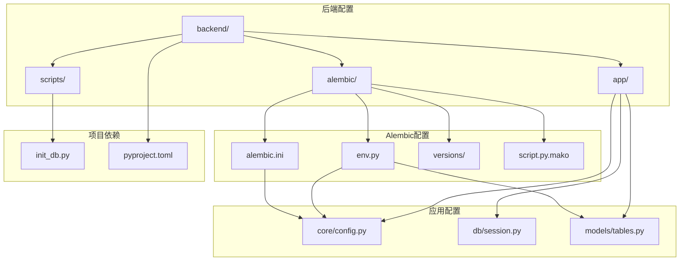
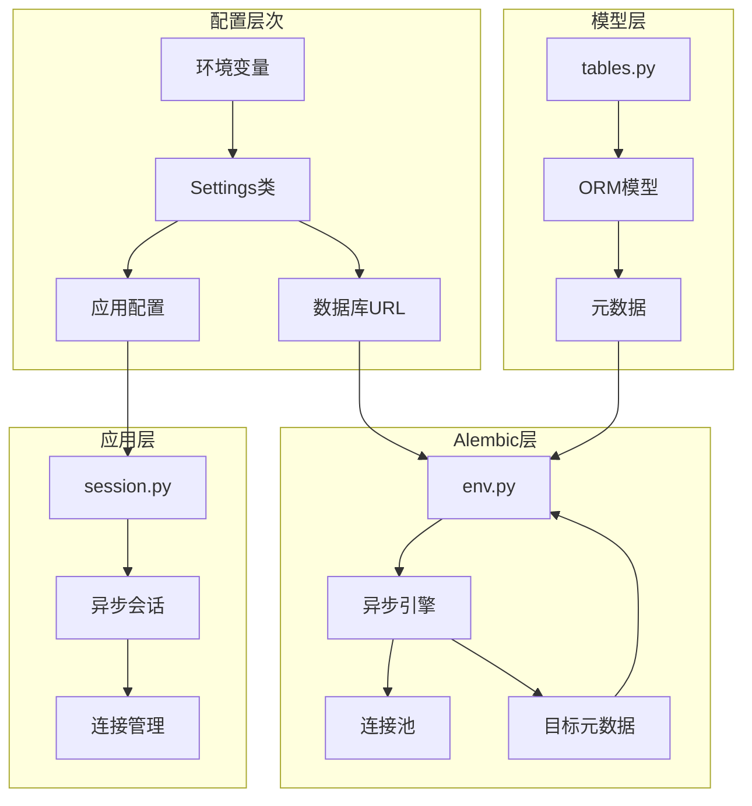
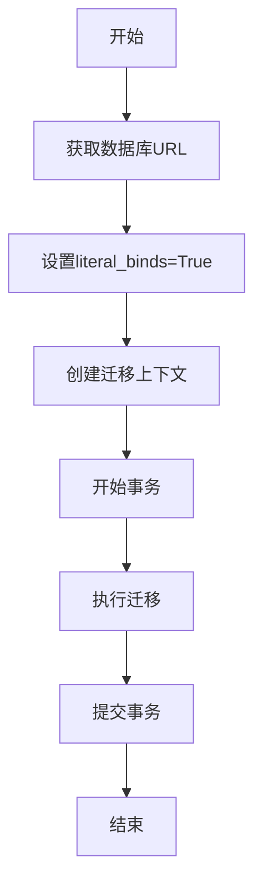
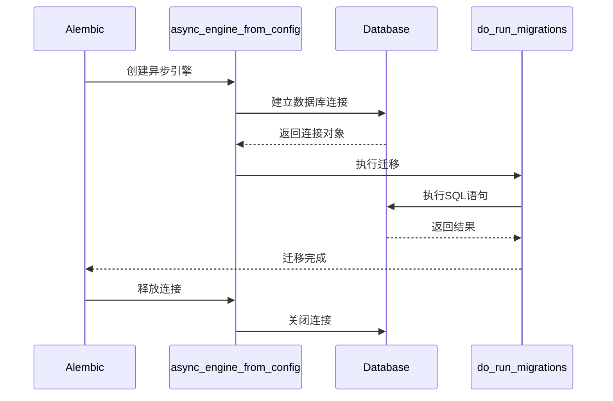

# 迁移环境配置

<cite>
**本文档引用的文件**
- [env.py](file://backend/alembic/env.py)
- [alembic.ini](file://backend/alembic.ini)
- [config.py](file://backend/app/core/config.py)
- [session.py](file://backend/app/db/session.py)
- [tables.py](file://backend/app/models/tables.py)
- [pyproject.toml](file://backend/pyproject.toml)
- [init_db.py](file://scripts/init_db.py)
</cite>

## 目录
1. [简介](#简介)
2. [项目结构](#项目结构)
3. [核心组件](#核心组件)
4. [架构概览](#架构概览)
5. [详细组件分析](#详细组件分析)
6. [依赖关系分析](#依赖关系分析)
7. [性能考虑](#性能考虑)
8. [故障排除指南](#故障排除指南)
9. [结论](#结论)

## 简介

本文档为HotClaw项目的迁移环境配置提供了全面的技术指导。HotClaw是一个基于FastAPI的多智能体内容生产平台，采用了异步SQLAlchemy引擎和Alembic迁移工具来管理数据库模式变更。本文档深入解释了Alembic环境配置的核心组件，包括异步SQLAlchemy引擎设置、数据库连接配置和异步迁移支持。

该配置体系支持开发和生产环境的不同需求，提供了灵活的数据库URL配置、完善的日志配置以及目标元数据的设置方法。文档特别关注了env.py中的配置流程，包括offline模式和online模式的切换机制、连接池配置和元数据设置。

## 项目结构

HotClaw项目的迁移配置主要分布在以下关键位置：



**图表来源**
- [env.py:1-53](file://backend/alembic/env.py#L1-L53)
- [alembic.ini:1-39](file://backend/alembic.ini#L1-L39)
- [config.py:1-51](file://backend/app/core/config.py#L1-L51)

**章节来源**
- [env.py:1-53](file://backend/alembic/env.py#L1-L53)
- [alembic.ini:1-39](file://backend/alembic.ini#L1-L39)
- [config.py:1-51](file://backend/app/core/config.py#L1-L51)

## 核心组件

HotClaw的迁移环境配置包含以下核心组件：

### 1. Alembic环境配置 (env.py)

env.py是Alembic迁移系统的核心配置文件，负责：
- 设置数据库连接URL
- 配置日志系统
- 定义目标元数据
- 实现offline和online模式切换
- 管理异步迁移引擎

### 2. Alembic配置文件 (alembic.ini)

alembic.ini提供了全局配置选项：
- 指定脚本位置
- 设置默认数据库URL
- 配置日志记录器
- 定义处理器和格式化器

### 3. 应用配置 (config.py)

应用配置文件定义了Settings类，包含：
- 数据库URL配置
- Redis连接配置
- 应用环境设置
- 日志级别配置

### 4. 数据库会话管理 (session.py)

数据库会话管理模块提供了：
- 异步引擎创建
- 会话工厂配置
- 连接池参数设置

### 5. 模型定义 (tables.py)

模型定义文件包含了所有ORM模型的基础类：
- DeclarativeBase基类
- 各种业务模型定义
- 关系映射配置

**章节来源**
- [env.py:1-53](file://backend/alembic/env.py#L1-L53)
- [alembic.ini:1-39](file://backend/alembic.ini#L1-L39)
- [config.py:1-51](file://backend/app/core/config.py#L1-L51)
- [session.py:1-33](file://backend/app/db/session.py#L1-L33)
- [tables.py:1-233](file://backend/app/models/tables.py#L1-L233)

## 架构概览

HotClaw的迁移环境配置架构采用了分层设计，确保了开发和生产环境的一致性：



**图表来源**
- [env.py:1-53](file://backend/alembic/env.py#L1-L53)
- [config.py:1-51](file://backend/app/core/config.py#L1-L51)
- [session.py:1-33](file://backend/app/db/session.py#L1-L33)
- [tables.py:1-233](file://backend/app/models/tables.py#L1-L233)

## 详细组件分析

### Alembic环境配置 (env.py)

env.py实现了完整的异步迁移支持，包含以下关键功能：

#### 配置流程

1. **导入依赖**：导入asyncio、logging、sqlalchemy和alembic模块
2. **加载配置**：从Settings类获取数据库URL
3. **设置元数据**：使用Base.metadata作为目标元数据
4. **配置日志**：根据配置文件设置日志系统

#### Offline模式配置

Offline模式适用于生成迁移脚本而不实际连接数据库：



**图表来源**
- [env.py:21-25](file://backend/alembic/env.py#L21-L25)

#### Online模式配置

Online模式用于直接连接数据库执行迁移：



**图表来源**
- [env.py:34-42](file://backend/alembic/env.py#L34-L42)

#### 异步迁移引擎实现

异步迁移引擎的核心实现包括：

1. **async_engine_from_config**：从配置创建异步引擎
2. **连接池配置**：使用NullPool避免重复连接
3. **连接生命周期管理**：确保连接正确关闭
4. **错误处理**：提供完整的异常处理机制

**章节来源**
- [env.py:1-53](file://backend/alembic/env.py#L1-L53)

### Alembic配置文件 (alembic.ini)

alembic.ini提供了详细的日志配置和数据库连接设置：

#### 日志配置结构

| 配置项 | 描述 | 默认值 |
|--------|------|--------|
| `alembic` | 脚本位置 | `alembic` |
| `sqlalchemy.url` | 数据库连接URL | `postgresql+asyncpg://...` |
| `root` | 根日志器级别 | `WARN` |
| `sqlalchemy` | SQLAlchemy引擎日志器 | `WARN` |
| `alembic` | Alembic日志器 | `INFO` |

#### 日志处理器配置

- **console处理器**：控制台输出
- **generic格式化器**：统一日志格式
- **时间戳格式**：`%H:%M:%S`

**章节来源**
- [alembic.ini:1-39](file://backend/alembic.ini#L1-L39)

### 应用配置 (config.py)

Settings类提供了完整的应用配置管理：

#### 数据库配置

| 配置项 | 类型 | 默认值 | 描述 |
|--------|------|--------|------|
| `database_url` | `str` | `sqlite+aiosqlite:///./hotclaw.db` | 数据库连接URL |
| `app_env` | `str` | `"development"` | 应用环境 |
| `app_debug` | `bool` | `False` | 调试模式开关 |

#### 环境变量加载

配置系统支持从`.env`文件加载环境变量，使用UTF-8编码。

**章节来源**
- [config.py:1-51](file://backend/app/core/config.py#L1-L51)

### 数据库会话管理 (session.py)

数据库会话管理模块提供了生产环境的连接管理：

#### 引擎配置

- **异步引擎**：使用`create_async_engine`
- **echo参数**：根据调试设置启用SQL输出
- **pool_pre_ping**：在非SQLite环境下启用连接健康检查

#### 会话工厂配置

- **AsyncSession**：异步会话类
- **expire_on_commit**：提交后过期设置
- **连接池管理**：自动连接生命周期管理

**章节来源**
- [session.py:1-33](file://backend/app/db/session.py#L1-L33)

### 模型定义 (tables.py)

模型定义文件包含了完整的ORM模型层次：

#### 基类设计

Base类继承自DeclarativeBase，为所有模型提供统一的基础功能。

#### 主要模型类别

1. **任务相关模型**：TaskModel、TaskNodeRunModel
2. **内容相关模型**：ArticleDraftModel、AuditResultModel
3. **配置相关模型**：AgentModel、SkillModel、WorkflowTemplateModel
4. **系统日志模型**：SystemLogModel

**章节来源**
- [tables.py:1-233](file://backend/app/models/tables.py#L1-L233)

## 依赖关系分析

HotClaw项目的迁移配置展现了清晰的依赖关系：

```mermaid
graph TB
subgraph "外部依赖"
A[sqlalchemy[asyncio]] --> B[异步SQLAlchemy]
C[alembic] --> D[Alembic迁移工具]
E[asyncpg] --> F[PostgreSQL驱动]
G[aiosqlite] --> H[SQLite驱动]
end
subgraph "内部模块"
I[env.py] --> J[配置管理]
I --> K[迁移执行]
L[config.py] --> M[Settings类]
N[tables.py] --> O[ORM模型]
P[session.py] --> Q[会话管理]
end
subgraph "配置依赖"
R[alembic.ini] --> S[全局配置]
T[config.py] --> U[环境变量]
V[env.py] --> W[数据库URL]
end
X[pyproject.toml] --> Y[项目依赖]
Y --> A
Y --> C
Y --> E
Y --> G
```

**图表来源**
- [pyproject.toml:1-41](file://backend/pyproject.toml#L1-L41)
- [env.py:1-53](file://backend/alembic/env.py#L1-L53)
- [config.py:1-51](file://backend/app/core/config.py#L1-L51)
- [tables.py:1-233](file://backend/app/models/tables.py#L1-L233)
- [session.py:1-33](file://backend/app/db/session.py#L1-L33)

**章节来源**
- [pyproject.toml:1-41](file://backend/pyproject.toml#L1-L41)

## 性能考虑

### 连接池优化

1. **NullPool使用**：Alembic迁移使用NullPool避免不必要的连接复用
2. **连接生命周期**：确保连接在使用后及时释放
3. **异步特性**：利用异步I/O提高并发性能

### 内存管理

1. **元数据缓存**：Base.metadata在内存中缓存，避免重复加载
2. **会话管理**：自动管理会话生命周期
3. **资源清理**：确保引擎正确关闭

### 日志性能

1. **日志级别控制**：合理设置日志级别避免性能影响
2. **格式化器优化**：使用高效的日志格式化器
3. **输出控制**：控制台输出避免过多I/O操作

## 故障排除指南

### 常见配置错误

#### 1. 数据库连接问题

**症状**：迁移执行失败，连接超时
**解决方案**：
- 检查数据库URL格式是否正确
- 验证数据库服务是否正常运行
- 确认网络连接和防火墙设置

#### 2. 异步引擎配置错误

**症状**：异步迁移执行异常
**解决方案**：
- 确认使用正确的驱动程序（asyncpg或aiosqlite）
- 检查Python版本兼容性
- 验证Alembic版本支持异步功能

#### 3. 元数据配置问题

**症状**：迁移无法识别模型
**解决方案**：
- 确保Base.metadata正确导入
- 检查模型定义文件是否被正确引用
- 验证模型继承关系

#### 4. 日志配置问题

**症状**：日志输出异常或缺失
**解决方案**：
- 检查alembic.ini中的日志配置
- 验证日志级别设置
- 确认处理器配置正确

### 配置验证方法

#### 1. 环境变量验证

```bash
# 检查环境变量是否正确加载
python -c "from app.core.config import settings; print(settings.database_url)"
```

#### 2. 数据库连接测试

```bash
# 使用init_db.py测试连接
python scripts/init_db.py
```

#### 3. Alembic配置验证

```bash
# 检查Alembic配置
alembic --raiseerr config
```

#### 4. 迁移执行测试

```bash
# 生成迁移脚本（offline模式）
alembic revision --autogenerate -m "Test migration"

# 执行迁移（online模式）
alembic upgrade head
```

### 调试技巧

1. **启用详细日志**：将日志级别设置为DEBUG
2. **检查SQL输出**：在开发环境中启用SQL输出
3. **验证模型完整性**：确保所有模型都正确继承Base类
4. **测试连接池**：验证连接池配置是否合理

**章节来源**
- [env.py:1-53](file://backend/alembic/env.py#L1-L53)
- [config.py:1-51](file://backend/app/core/config.py#L1-L51)
- [init_db.py:1-16](file://scripts/init_db.py#L1-L16)

## 结论

HotClaw项目的迁移环境配置展现了现代化的数据库管理实践。通过精心设计的配置体系，项目实现了：

1. **异步支持**：完整的异步SQLAlchemy集成
2. **环境灵活性**：支持开发和生产环境的不同需求
3. **配置一致性**：统一的配置管理和验证机制
4. **可维护性**：清晰的模块划分和依赖关系

该配置体系为DBA和开发者提供了可靠的数据库迁移解决方案，支持从简单的SQLite开发环境到复杂的PostgreSQL生产环境的平滑过渡。通过遵循本文档提供的最佳实践和故障排除指南，用户可以有效地管理和维护HotClaw项目的数据库结构。