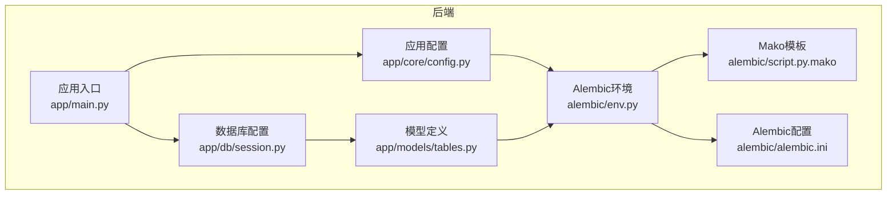
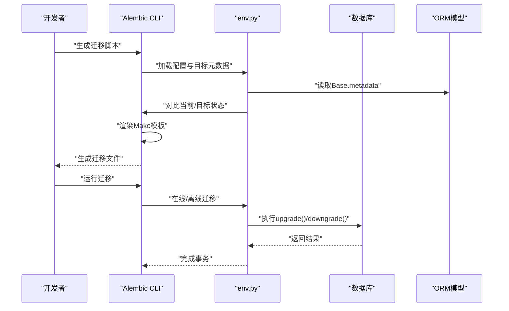
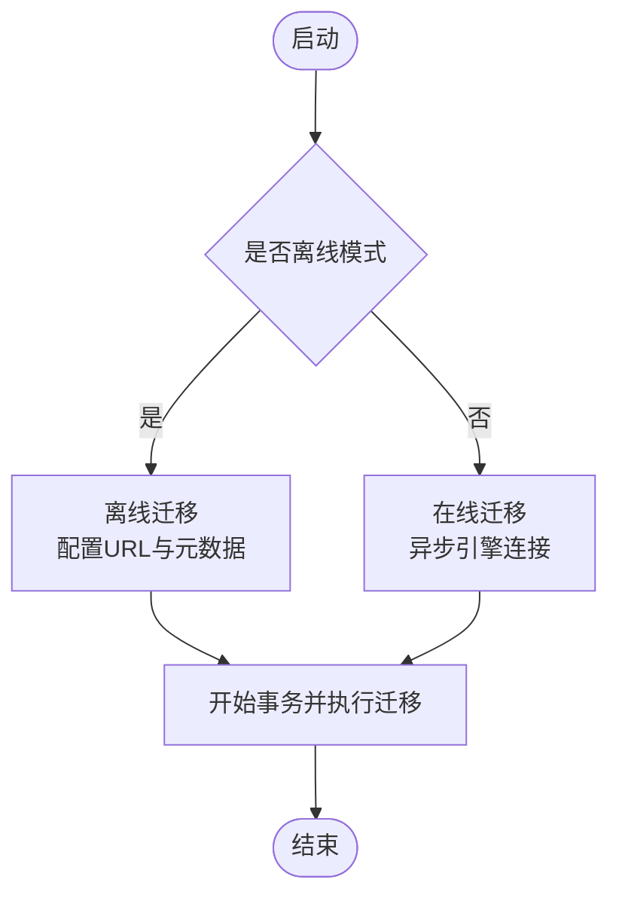
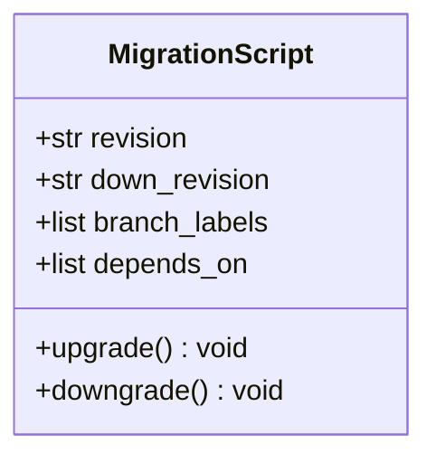
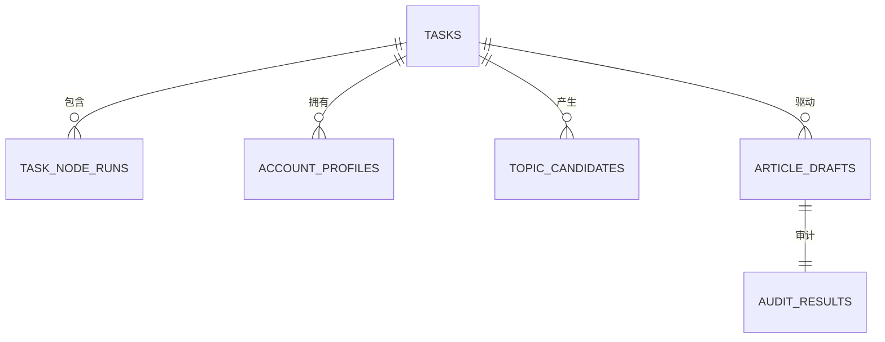
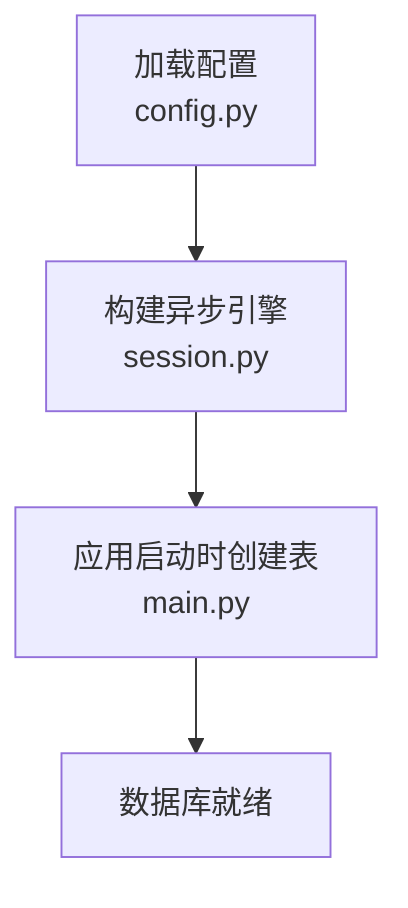
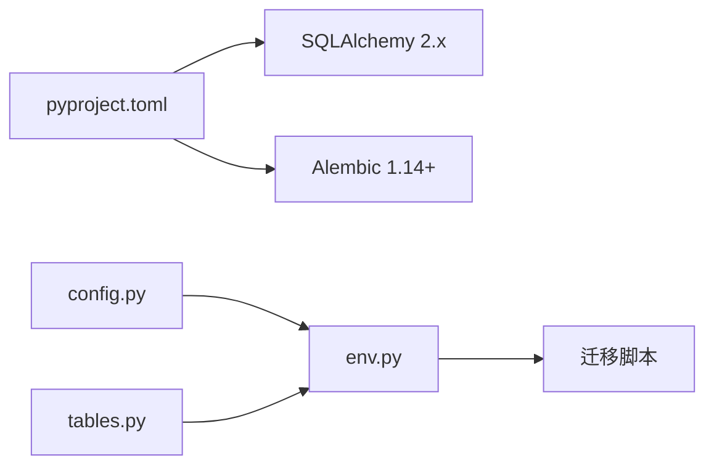

# 迁移脚本生成

<cite>
**本文引用的文件**
- [env.py](file://backend/alembic/env.py)
- [script.py.mako](file://backend/alembic/script.py.mako)
- [alembic.ini](file://backend/alembic.ini)
- [tables.py](file://backend/app/models/tables.py)
- [config.py](file://backend/app/core/config.py)
- [session.py](file://backend/app/db/session.py)
- [main.py](file://backend/app/main.py)
- [init_db.py](file://scripts/init_db.py)
- [pyproject.toml](file://backend/pyproject.toml)
</cite>

## 目录
1. [简介](#简介)
2. [项目结构](#项目结构)
3. [核心组件](#核心组件)
4. [架构总览](#架构总览)
5. [详细组件分析](#详细组件分析)
6. [依赖分析](#依赖分析)
7. [性能考虑](#性能考虑)
8. [故障排查指南](#故障排查指南)
9. [结论](#结论)
10. [附录](#附录)

## 简介
本文件面向HotClaw后端团队，系统性阐述基于Alembic的迁移脚本生成功能与管理流程。内容覆盖：
- Alembic模板系统（Mako）与环境配置
- 模型变更驱动的迁移脚本自动生成机制
- 迁移脚本命名规则、版本号与文件组织
- up() 与 down() 的实现模式与正反向逻辑
- 手动编辑迁移脚本的最佳实践
- 测试验证与质量检查建议
- 面向开发者的完整操作手册

## 项目结构
HotClaw后端采用异步SQLAlchemy + Alembic进行数据库迁移管理。关键位置如下：
- Alembic配置与模板：backend/alembic
- 数据库模型：backend/app/models/tables.py
- 应用配置与数据库连接：backend/app/core/config.py、backend/app/db/session.py
- 应用入口与生命周期：backend/app/main.py
- 初始化脚本：scripts/init_db.py
- 项目依赖与工具链：backend/pyproject.toml

图表来源
- [main.py:42-58](file://backend/app/main.py#L42-L58)
- [session.py:1-33](file://backend/app/db/session.py#L1-L33)
- [config.py:1-51](file://backend/app/core/config.py#L1-L51)
- [tables.py:1-233](file://backend/app/models/tables.py#L1-L233)
- [env.py:1-53](file://backend/alembic/env.py#L1-L53)
- [script.py.mako:1-25](file://backend/alembic/script.py.mako#L1-L25)
- [alembic.ini:1-39](file://backend/alembic/alembic.ini#L1-L39)

章节来源
- [pyproject.toml:1-41](file://backend/pyproject.toml#L1-L41)
- [alembic.ini:1-39](file://backend/alembic/alembic.ini#L1-L39)

## 核心组件
- Alembic环境配置（env.py）
  - 异步引擎初始化与上下文配置
  - 在线/离线迁移模式切换
  - 目标元数据（target_metadata）绑定到ORM基类
- Mako模板（script.py.mako）
  - 自动生成迁移脚本骨架，包含升级/降级函数占位
  - 版本号、分支标签、依赖等元信息注入
- 模型定义（tables.py）
  - 所有业务表的ORM映射，作为迁移对比的“源”
- 配置与连接（config.py、session.py）
  - 数据库URL来源（开发默认SQLite，生产PostgreSQL）
  - 异步引擎与会话工厂
- 应用生命周期（main.py）
  - 启动时自动创建所有表（开发模式）
- 初始化脚本（init_db.py）
  - 显式创建所有表的辅助脚本

章节来源
- [env.py:1-53](file://backend/alembic/env.py#L1-L53)
- [script.py.mako:1-25](file://backend/alembic/script.py.mako#L1-L25)
- [tables.py:1-233](file://backend/app/models/tables.py#L1-L233)
- [config.py:1-51](file://backend/app/core/config.py#L1-L51)
- [session.py:1-33](file://backend/app/db/session.py#L1-L33)
- [main.py:42-58](file://backend/app/main.py#L42-L58)
- [init_db.py:1-16](file://scripts/init_db.py#L1-L16)

## 架构总览
下图展示从模型变更到迁移脚本生成与执行的整体流程。

图表来源
- [env.py:18-52](file://backend/alembic/env.py#L18-L52)
- [script.py.mako:19-24](file://backend/alembic/script.py.mako#L19-L24)
- [alembic.ini:1-39](file://backend/alembic/alembic.ini#L1-L39)

## 详细组件分析

### Alembic环境配置（env.py）
- 异步迁移支持
  - 使用异步引擎创建连接，确保与FastAPI/异步会话一致
  - 在线模式通过异步协程执行迁移
- 目标元数据绑定
  - 将target_metadata指向ORM基类的metadata，用于检测模型变更
- 上下文配置
  - 离线模式直接以URL配置迁移
  - 在线模式通过连接器执行迁移

图表来源
- [env.py:21-52](file://backend/alembic/env.py#L21-L52)

章节来源
- [env.py:1-53](file://backend/alembic/env.py#L1-L53)

### Mako模板（script.py.mako）
- 模板变量
  - revision、down_revision、branch_labels、depends_on
  - upgrades、downgrades、imports、message
- 函数骨架
  - upgrade(): 升级逻辑占位
  - downgrade(): 降级逻辑占位
- 使用方式
  - Alembic在生成迁移时，将上述变量注入模板并写入Python文件

图表来源
- [script.py.mako:1-25](file://backend/alembic/script.py.mako#L1-L25)

章节来源
- [script.py.mako:1-25](file://backend/alembic/script.py.mako#L1-L25)

### 模型定义（tables.py）
- 基类与表映射
  - 统一继承自DeclarativeBase的Base类
  - 每个业务实体对应一张表，包含主键、外键、索引与默认值
- 变更检测
  - Alembic通过比较当前模型与历史迁移记录，识别新增/删除/修改的表与列
- 关系与约束
  - 外键、唯一约束、索引等均纳入迁移对比范围

图表来源
- [tables.py:23-233](file://backend/app/models/tables.py#L23-L233)

章节来源
- [tables.py:1-233](file://backend/app/models/tables.py#L1-L233)

### 配置与连接（config.py、session.py）
- 数据库URL来源
  - 开发默认SQLite，生产默认PostgreSQL（可通过环境变量覆盖）
- 引擎与会话
  - 异步引擎与异步会话工厂，支持池化与预检
- 生命周期集成
  - 应用启动时自动创建所有表（开发模式）

图表来源
- [config.py:7-14](file://backend/app/core/config.py#L7-L14)
- [session.py:8-19](file://backend/app/db/session.py#L8-L19)
- [main.py:48-53](file://backend/app/main.py#L48-L53)

章节来源
- [config.py:1-51](file://backend/app/core/config.py#L1-L51)
- [session.py:1-33](file://backend/app/db/session.py#L1-L33)
- [main.py:42-58](file://backend/app/main.py#L42-L58)

### 初始化脚本（init_db.py）
- 功能
  - 通过异步引擎与ORM基类，一次性创建所有表
- 适用场景
  - 快速初始化本地开发数据库或批量建表

章节来源
- [init_db.py:1-16](file://scripts/init_db.py#L1-L16)

## 依赖分析
- 工具链依赖
  - SQLAlchemy 2.x（异步）、Alembic 1.14+
- 配置依赖
  - 数据库URL由应用配置提供，Alembic通过env.py读取
- 运行时依赖
  - ORM模型作为迁移对比的“源”，env.py将其暴露给Alembic

图表来源
- [pyproject.toml:6-22](file://backend/pyproject.toml#L6-L22)
- [config.py:11-14](file://backend/app/core/config.py#L11-L14)
- [env.py:9-18](file://backend/alembic/env.py#L9-L18)
- [tables.py:18-20](file://backend/app/models/tables.py#L18-L20)

章节来源
- [pyproject.toml:1-41](file://backend/pyproject.toml#L1-L41)
- [env.py:1-53](file://backend/alembic/env.py#L1-L53)

## 性能考虑
- 异步迁移
  - 使用异步引擎可避免阻塞，提升迁移执行效率
- 连接池与预检
  - 生产环境启用池预检，减少连接失效导致的重试
- 迁移粒度
  - 将大变更拆分为多个小迁移，降低锁表时间与失败风险
- 日志级别
  - Alembic日志级别建议保持INFO，便于问题定位

## 故障排查指南
- 迁移无法执行
  - 检查数据库URL与连接权限（开发默认SQLite，生产需PostgreSQL）
  - 确认Alembic配置文件路径与脚本位置一致
- 模型变更未被检测
  - 确保ORM模型已导入并注册到Base.metadata
  - 检查env.py中target_metadata是否正确指向Base.metadata
- 在线/离线模式错误
  - 在线模式需要异步引擎；离线模式使用URL直连
- 回滚失败
  - 检查downgrade()实现是否与upgrade()一一对应
  - 确保字段类型、约束与索引的逆向操作可执行

章节来源
- [env.py:21-52](file://backend/alembic/env.py#L21-L52)
- [alembic.ini:1-39](file://backend/alembic/alembic.ini#L1-L39)

## 结论
HotClaw采用异步SQLAlchemy + Alembic的组合，实现了对模型变更的自动化迁移管理。通过env.py统一配置、Mako模板标准化生成、以及严格的up/down逻辑设计，开发者可以高效地维护数据库演进。建议在团队内建立规范的迁移编写与评审流程，配合测试与质量检查，确保数据库变更的安全与可追溯。

## 附录

### 迁移脚本生成与管理操作手册
- 生成迁移脚本
  - 步骤
    1) 修改模型定义（tables.py）
    2) 运行Alembic命令生成迁移（使用env.py提供的配置）
    3) 检查生成的迁移文件，补充缺失的业务逻辑
  - 注意事项
    - 生成的迁移文件仅提供骨架，必须手动完善upgrade()/downgrade()
    - 确保downgrade()与upgrade()一一对应且可逆
- 运行迁移
  - 在线模式：Alembic通过异步引擎连接数据库执行
  - 离线模式：直接使用URL执行
- 回滚迁移
  - 逐级downgrade，注意数据与约束的逆向一致性
- 命名规则与版本号
  - 使用Alembic默认命名策略生成迁移文件名
  - 版本号由Alembic维护，down_revision与up_revision自动关联
- 文件组织
  - 迁移文件位于alembic/versions目录（按生成顺序组织）
  - 模板与环境配置位于alembic根目录

章节来源
- [env.py:1-53](file://backend/alembic/env.py#L1-L53)
- [script.py.mako:1-25](file://backend/alembic/script.py.mako#L1-L25)
- [alembic.ini:1-39](file://backend/alembic/alembic.ini#L1-L39)

### 最佳实践
- 保持迁移原子性：每个迁移只做一次逻辑变更
- 补充注释与测试：为复杂迁移添加注释与单元测试
- 审查与备份：在生产环境执行前进行代码审查与数据库备份
- 文档化：记录每次迁移的目的、影响范围与回滚步骤

### 质量检查清单
- [ ] 模型变更与迁移描述一致
- [ ] upgrade()与downgrade()逻辑对称
- [ ] 字段类型、长度、非空约束与索引设置合理
- [ ] 外键关系与级联行为明确
- [ ] 迁移执行时间与锁表情况可控
- [ ] 回滚后数据完整性与一致性验证通过