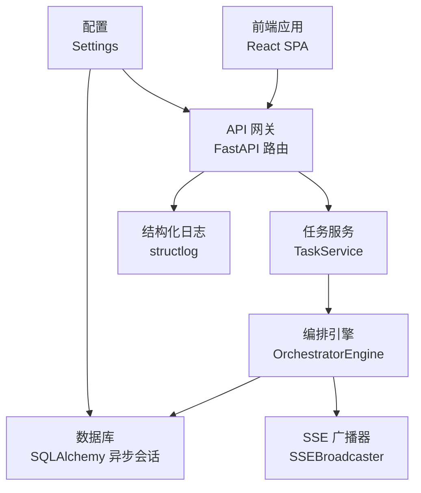
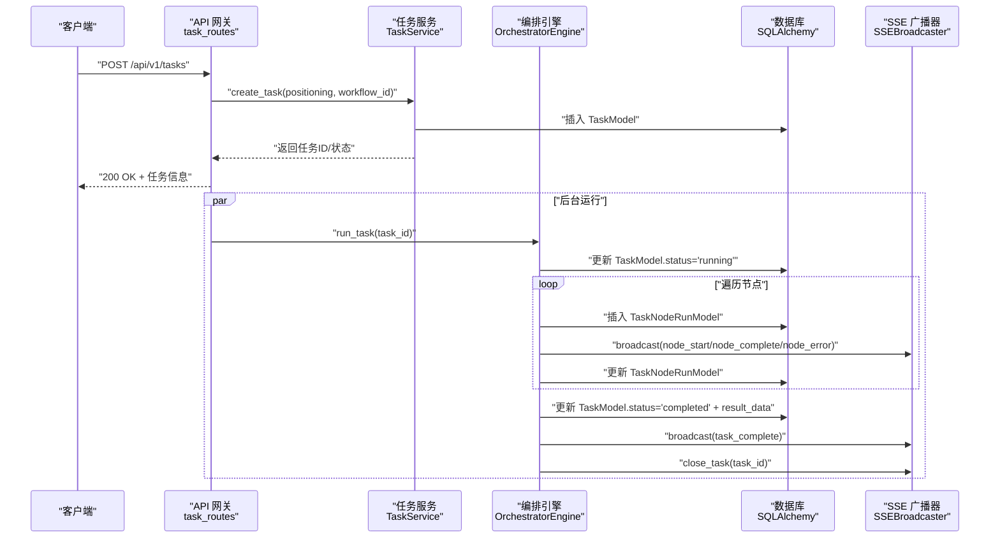
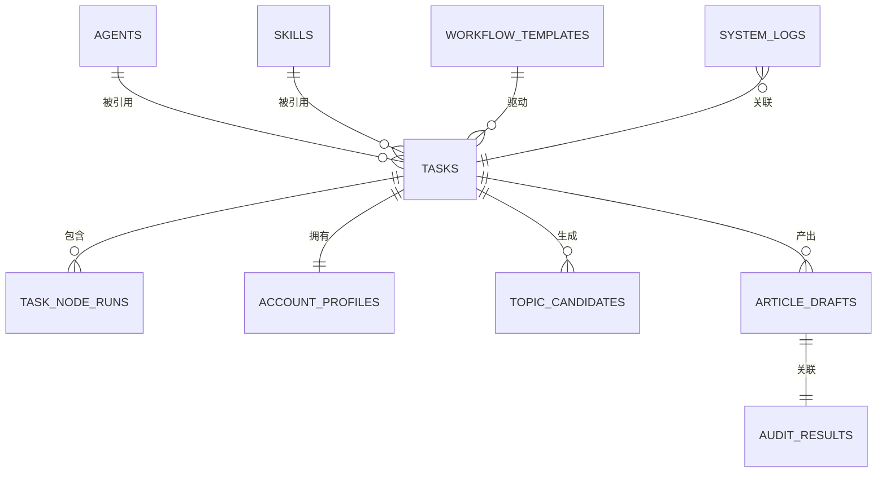
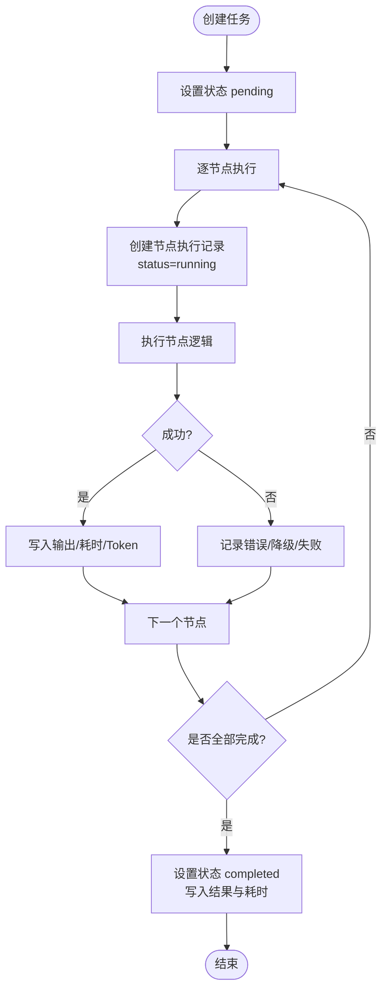
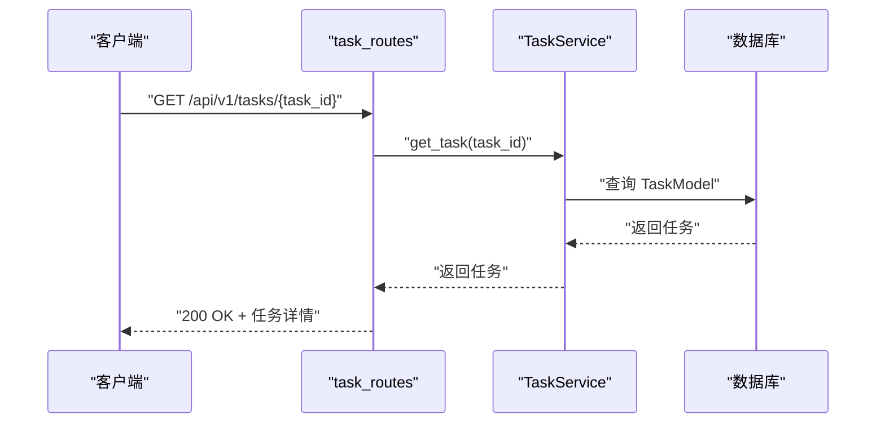
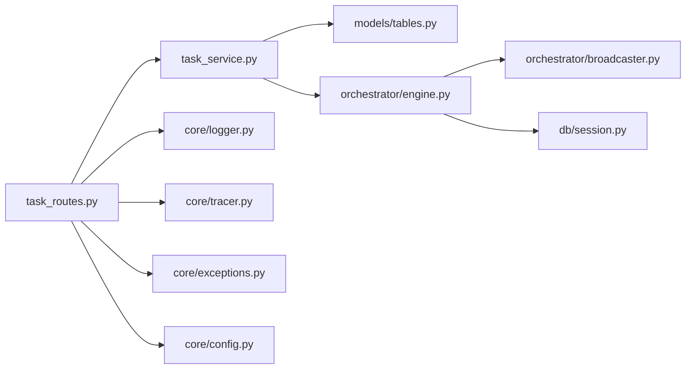

# 数据生命周期管理

<cite>
**本文引用的文件**
- [backend/app/models/tables.py](file://backend/app/models/tables.py)
- [backend/app/db/session.py](file://backend/app/db/session.py)
- [backend/app/core/config.py](file://backend/app/core/config.py)
- [backend/app/main.py](file://backend/app/main.py)
- [backend/alembic/env.py](file://backend/alembic/env.py)
- [backend/scripts/init_db.py](file://backend/scripts/init_db.py)
- [backend/app/services/task_service.py](file://backend/app/services/task_service.py)
- [backend/app/api/task_routes.py](file://backend/app/api/task_routes.py)
- [backend/app/schemas/task.py](file://backend/app/schemas/task.py)
- [backend/app/orchestrator/engine.py](file://backend/app/orchestrator/engine.py)
- [backend/app/orchestrator/broadcaster.py](file://backend/app/orchestrator/broadcaster.py)
- [backend/app/core/logger.py](file://backend/app/core/logger.py)
- [backend/app/core/exceptions.py](file://backend/app/core/exceptions.py)
- [backend/app/core/tracer.py](file://backend/app/core/tracer.py)
- [ARCHITECTURE.md](file://ARCHITECTURE.md)
</cite>

## 目录
1. [引言](#引言)
2. [项目结构](#项目结构)
3. [核心组件](#核心组件)
4. [架构总览](#架构总览)
5. [详细组件分析](#详细组件分析)
6. [依赖分析](#依赖分析)
7. [性能考量](#性能考量)
8. [故障排查指南](#故障排查指南)
9. [结论](#结论)
10. [附录](#附录)

## 引言
本文件围绕 HotClaw 的数据生命周期管理进行系统化技术说明，覆盖从“任务创建”到“数据销毁”的全过程，包括数据创建、更新、查询、归档与清理策略；明确各类数据（任务数据、执行记录、配置信息、日志）的保留期限与清理规则；阐述备份策略、恢复机制与灾难恢复方案；解释数据压缩、归档与冷存储的实现方式；并提供数据安全与隐私保护措施（数据脱敏、访问控制、审计日志）以及面向运维的最佳实践与监控指标。

## 项目结构
后端采用 FastAPI + SQLAlchemy 2.x + Alembic 的异步架构，数据库为 SQLite（开发）或 PostgreSQL（生产），通过 async session 管理事务与连接；工作流编排器负责任务执行与节点状态广播；SSE 广播器维护事件队列与历史缓冲；日志系统采用结构化 JSON 输出；配置通过环境变量注入。

图表来源
- [backend/app/main.py:60-84](file://backend/app/main.py#L60-L84)
- [backend/app/services/task_service.py:20-38](file://backend/app/services/task_service.py#L20-L38)
- [backend/app/orchestrator/engine.py:92-234](file://backend/app/orchestrator/engine.py#L92-L234)
- [backend/app/db/session.py:8-19](file://backend/app/db/session.py#L8-L19)
- [backend/app/orchestrator/broadcaster.py:11-94](file://backend/app/orchestrator/broadcaster.py#L11-L94)
- [backend/app/core/logger.py:8-31](file://backend/app/core/logger.py#L8-L31)
- [backend/app/core/config.py:7-51](file://backend/app/core/config.py#L7-L51)

章节来源
- [backend/app/main.py:1-142](file://backend/app/main.py#L1-L142)
- [backend/app/db/session.py:1-33](file://backend/app/db/session.py#L1-L33)
- [backend/app/core/config.py:1-51](file://backend/app/core/config.py#L1-L51)

## 核心组件
- 数据模型与表结构：涵盖任务、节点执行记录、账号画像、话题候选、文章草稿、审核结果、智能体/技能/工作流模板、系统日志等。
- 数据库会话与迁移：异步引擎、自动建表、Alembic 异步迁移。
- 任务服务：任务创建、运行、查询、分页与节点执行记录查询。
- API 路由：任务创建、状态查询、详情查询、节点明细、任务列表。
- 编排引擎：线性工作流执行、节点状态持久化、事件广播、超时与降级处理。
- SSE 广播器：事件队列、历史缓冲、延迟清理。
- 日志与追踪：结构化日志、Trace ID/Task ID 传播。
- 异常体系：统一错误码分类与映射。

章节来源
- [backend/app/models/tables.py:23-233](file://backend/app/models/tables.py#L23-L233)
- [backend/app/db/session.py:1-33](file://backend/app/db/session.py#L1-L33)
- [backend/alembic/env.py:1-53](file://backend/alembic/env.py#L1-L53)
- [backend/scripts/init_db.py:1-16](file://backend/scripts/init_db.py#L1-L16)
- [backend/app/services/task_service.py:20-126](file://backend/app/services/task_service.py#L20-L126)
- [backend/app/api/task_routes.py:1-163](file://backend/app/api/task_routes.py#L1-L163)
- [backend/app/orchestrator/engine.py:92-285](file://backend/app/orchestrator/engine.py#L92-L285)
- [backend/app/orchestrator/broadcaster.py:11-94](file://backend/app/orchestrator/broadcaster.py#L11-L94)
- [backend/app/core/logger.py:1-36](file://backend/app/core/logger.py#L1-L36)
- [backend/app/core/tracer.py:1-34](file://backend/app/core/tracer.py#L1-L34)
- [backend/app/core/exceptions.py:1-125](file://backend/app/core/exceptions.py#L1-L125)

## 架构总览
下图展示从任务创建到执行完成的端到端数据流与事件流：

图表来源
- [backend/app/api/task_routes.py:19-51](file://backend/app/api/task_routes.py#L19-L51)
- [backend/app/services/task_service.py:39-64](file://backend/app/services/task_service.py#L39-L64)
- [backend/app/orchestrator/engine.py:92-234](file://backend/app/orchestrator/engine.py#L92-L234)
- [backend/app/orchestrator/broadcaster.py:57-84](file://backend/app/orchestrator/broadcaster.py#L57-L84)
- [backend/app/models/tables.py:23-74](file://backend/app/models/tables.py#L23-L74)

## 详细组件分析

### 数据模型与生命周期表
- 任务表（tasks）：记录任务全生命周期状态、输入/输出、耗时与 Token 统计。
- 节点执行记录（task_node_runs）：记录每个节点的执行状态、输入/输出、耗时、Token、模型与错误信息。
- 账号画像（account_profiles）：从用户输入解析得到的结构化画像。
- 话题候选（topic_candidates）：由主题策划生成的候选主题集合。
- 文章草稿（article_drafts）：生成的草稿，包含 Markdown/HTML、标签、状态等。
- 审核结果（audit_results）：对草稿的审核结论与风险等级。
- 配置表（agents/skills/workflow_templates）：智能体/技能/工作流的配置与版本。
- 系统日志（system_logs）：结构化日志，带 trace_id、task_id、级别与上下文。

图表来源
- [backend/app/models/tables.py:23-233](file://backend/app/models/tables.py#L23-L233)

章节来源
- [backend/app/models/tables.py:23-233](file://backend/app/models/tables.py#L23-L233)

### 数据创建与更新
- 任务创建：生成任务 ID，写入任务表，状态 pending。
- 节点执行：为每个节点创建执行记录，状态 running，完成后写入耗时、Token、输出与错误信息。
- 任务完成：计算总耗时与 Token，写入最终结果，状态 completed。

图表来源
- [backend/app/services/task_service.py:22-64](file://backend/app/services/task_service.py#L22-L64)
- [backend/app/orchestrator/engine.py:113-234](file://backend/app/orchestrator/engine.py#L113-L234)
- [backend/app/models/tables.py:23-74](file://backend/app/models/tables.py#L23-L74)

章节来源
- [backend/app/services/task_service.py:20-126](file://backend/app/services/task_service.py#L20-L126)
- [backend/app/orchestrator/engine.py:92-285](file://backend/app/orchestrator/engine.py#L92-L285)

### 数据查询与分页
- 任务列表：支持按状态过滤、分页统计与分页查询。
- 任务详情：返回任务输入、输出、耗时、Token 等。
- 节点明细：返回每个节点的输入、输出、耗时、Token、模型与错误信息。

图表来源
- [backend/app/api/task_routes.py:90-107](file://backend/app/api/task_routes.py#L90-L107)
- [backend/app/services/task_service.py:65-78](file://backend/app/services/task_service.py#L65-L78)

章节来源
- [backend/app/api/task_routes.py:136-163](file://backend/app/api/task_routes.py#L136-L163)
- [backend/app/services/task_service.py:80-122](file://backend/app/services/task_service.py#L80-L122)

### 归档与清理策略
- SSE 历史缓冲与清理：SSE 广播器对每个任务维护事件历史缓冲，任务结束后 60 秒清理，避免内存泄漏。
- 数据库保留：当前代码未定义数据库层面的自动清理策略；建议结合业务需求制定保留期与归档/删除策略。
- 日志保留：结构化日志输出至标准输出，建议配合外部日志系统（如集中式日志平台）进行轮转与归档。

章节来源
- [backend/app/orchestrator/broadcaster.py:78-84](file://backend/app/orchestrator/broadcaster.py#L78-L84)
- [backend/app/core/logger.py:8-31](file://backend/app/core/logger.py#L8-L31)

### 备份策略、恢复机制与灾难恢复
- 数据库备份：建议采用数据库原生命令或第三方工具进行定期全量/增量备份；生产环境推荐 PostgreSQL + WAL 归档。
- 配置备份：配置文件与 Alembic 版本控制纳入版本库；敏感配置通过环境变量注入。
- 恢复流程：先恢复数据库，再执行 Alembic 迁移，最后重启服务；SSE 历史缓冲在服务重启后不会保留，需前端重新订阅。
- 灾难恢复：准备多套环境（开发/测试/生产），建立演练计划；确保备份可验证与快速恢复。

章节来源
- [backend/alembic/env.py:28-46](file://backend/alembic/env.py#L28-L46)
- [backend/scripts/init_db.py:8-11](file://backend/scripts/init_db.py#L8-L11)
- [backend/app/db/session.py:8-19](file://backend/app/db/session.py#L8-L19)

### 数据压缩、归档与冷存储
- 数据库压缩：PostgreSQL 可启用 autovacuum 与 VACUUM/REINDEX；SQLite 在 WAL 模式下具备较好的并发与写入性能。
- 归档与冷存储：建议将历史任务与日志导出到对象存储（如 S3 兼容服务），按日期分区；对低频访问数据进行冷/归档存储。

章节来源
- [backend/app/core/config.py:9-14](file://backend/app/core/config.py#L9-L14)

### 数据安全与隐私保护
- 数据脱敏：对日志中的敏感字段（如输入数据）进行脱敏处理；建议在日志输出前清洗或屏蔽。
- 访问控制：后端未实现鉴权/授权；建议在网关层增加认证与授权策略（如基于令牌的 RBAC）。
- 审计日志：系统日志表已具备结构化能力，建议统一记录关键操作与异常事件，便于审计与追踪。
- 传输安全：建议启用 HTTPS 与 TLS；数据库连接使用加密通道。

章节来源
- [backend/app/models/tables.py:220-233](file://backend/app/models/tables.py#L220-L233)
- [backend/app/core/logger.py:8-31](file://backend/app/core/logger.py#L8-L31)

## 依赖分析
- 模块耦合：API 路由依赖任务服务；任务服务依赖模型与编排引擎；编排引擎依赖数据库与广播器；日志与追踪贯穿各层。
- 外部依赖：数据库（SQLite/PostgreSQL）、结构化日志、异步会话、SSE 广播。

图表来源
- [backend/app/api/task_routes.py:1-163](file://backend/app/api/task_routes.py#L1-L163)
- [backend/app/services/task_service.py:1-126](file://backend/app/services/task_service.py#L1-L126)
- [backend/app/models/tables.py:1-233](file://backend/app/models/tables.py#L1-L233)
- [backend/app/orchestrator/engine.py:1-285](file://backend/app/orchestrator/engine.py#L1-L285)
- [backend/app/orchestrator/broadcaster.py:1-94](file://backend/app/orchestrator/broadcaster.py#L1-L94)
- [backend/app/db/session.py:1-33](file://backend/app/db/session.py#L1-L33)
- [backend/app/core/logger.py:1-36](file://backend/app/core/logger.py#L1-L36)
- [backend/app/core/tracer.py:1-34](file://backend/app/core/tracer.py#L1-L34)
- [backend/app/core/exceptions.py:1-125](file://backend/app/core/exceptions.py#L1-L125)
- [backend/app/core/config.py:1-51](file://backend/app/core/config.py#L1-L51)

## 性能考量
- 异步 I/O：使用 SQLAlchemy 异步引擎与 FastAPI，提升并发处理能力。
- 事件缓冲：SSE 广播器对历史事件进行缓冲，减少前端重连丢失。
- 查询优化：分页查询与条件过滤，避免一次性加载大量数据。
- 超时控制：编排引擎对节点执行设置超时，防止长时间阻塞。

章节来源
- [backend/app/db/session.py:8-19](file://backend/app/db/session.py#L8-L19)
- [backend/app/orchestrator/broadcaster.py:22-45](file://backend/app/orchestrator/broadcaster.py#L22-L45)
- [backend/app/services/task_service.py:80-102](file://backend/app/services/task_service.py#L80-L102)
- [backend/app/orchestrator/engine.py:236-243](file://backend/app/orchestrator/engine.py#L236-L243)

## 故障排查指南
- 统一异常处理：根据错误码映射到合适的 HTTP 状态码，便于前端与监控系统识别。
- 结构化日志：所有关键事件均输出结构化 JSON，便于检索与分析。
- Trace ID：全局传播 trace_id 与 task_id，便于端到端追踪。
- 常见问题：
  - 任务长时间 pending：检查工作流节点与外部依赖（LLM/外部 API）。
  - 节点超时：调整超时阈值或优化节点执行逻辑。
  - SSE 事件丢失：确认前端及时订阅与网络稳定性。

章节来源
- [backend/app/core/exceptions.py:1-125](file://backend/app/core/exceptions.py#L1-L125)
- [backend/app/core/logger.py:8-31](file://backend/app/core/logger.py#L8-L31)
- [backend/app/core/tracer.py:10-34](file://backend/app/core/tracer.py#L10-L34)
- [backend/app/orchestrator/engine.py:176-196](file://backend/app/orchestrator/engine.py#L176-L196)

## 结论
HotClaw 的数据生命周期管理以任务为中心，通过编排引擎与 SSE 广播实现可观测与可回放；数据模型覆盖任务全生命周期与相关配置、日志。当前未内置数据库自动清理策略，建议结合业务制定保留期与归档/删除策略；同时完善访问控制与审计日志，确保数据安全与合规。运维侧应重视备份与灾难恢复演练，保障系统高可用。

## 附录
- 数据保留与清理建议（示例）
  - 任务数据：保留 90 天，到期后归档至对象存储并打上标签；超过 180 天删除。
  - 节点执行记录：保留 30 天，到期后归档；超过 90 天删除。
  - 配置信息：永久保留，变更记录纳入版本库。
  - 日志数据：保留 7 天，到期后压缩归档；超过 30 天删除。
- 备份与恢复
  - 数据库：每日全量 + 每小时增量；备份保留 30 天；支持按天回滚。
  - 配置：版本库同步，支持回滚到任意提交。
- 监控指标（建议）
  - 任务成功率、平均耗时、节点失败率、SSE 连接数、数据库连接池利用率、日志输出速率。