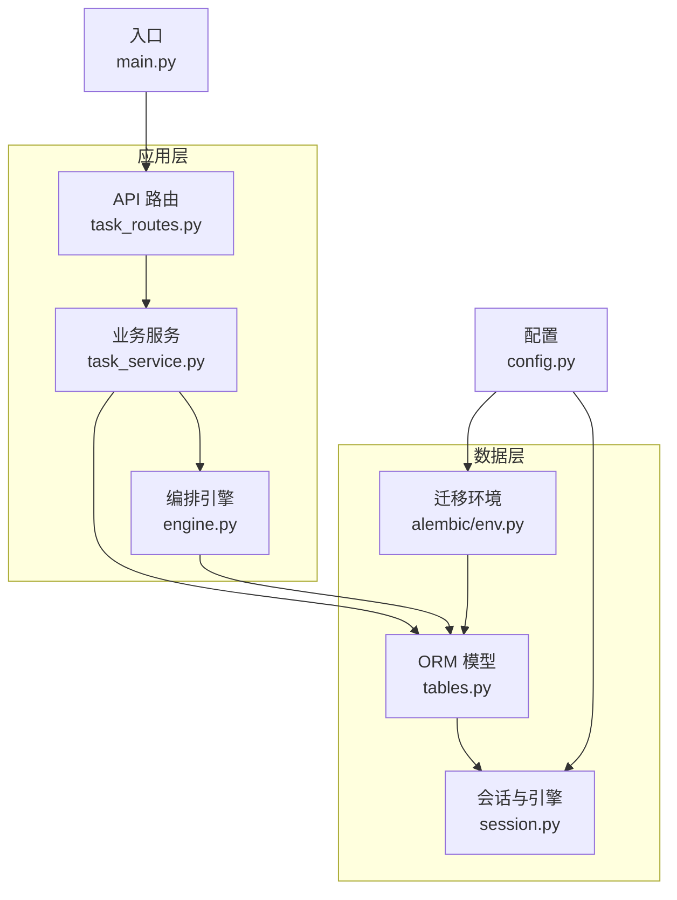
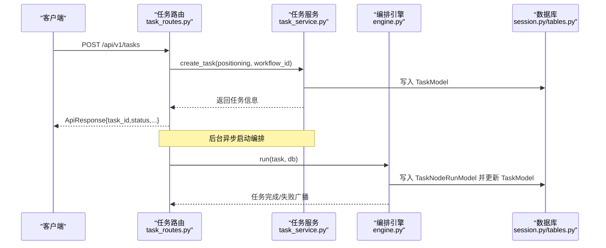
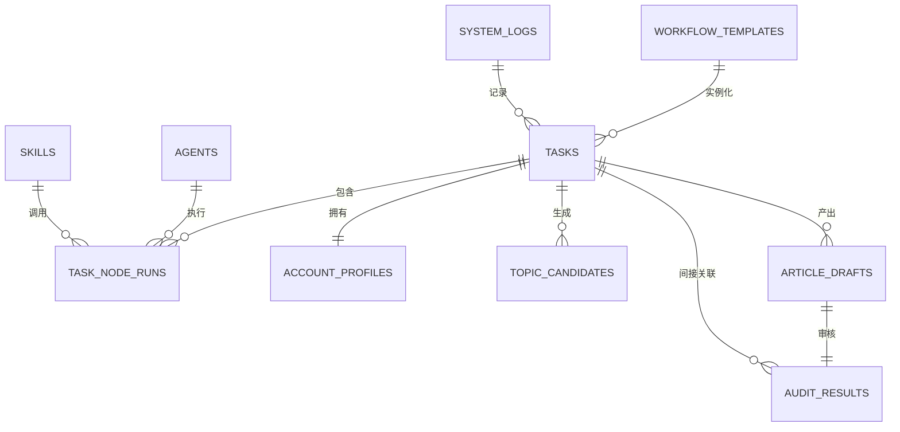
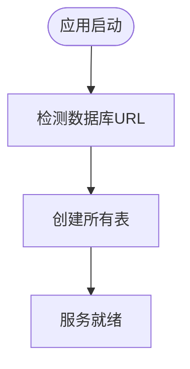
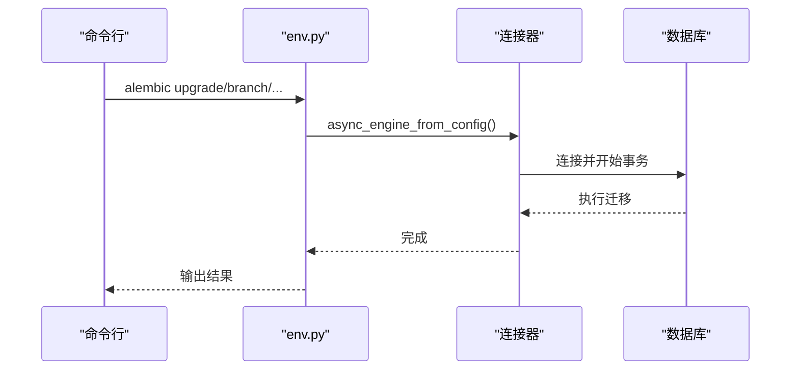
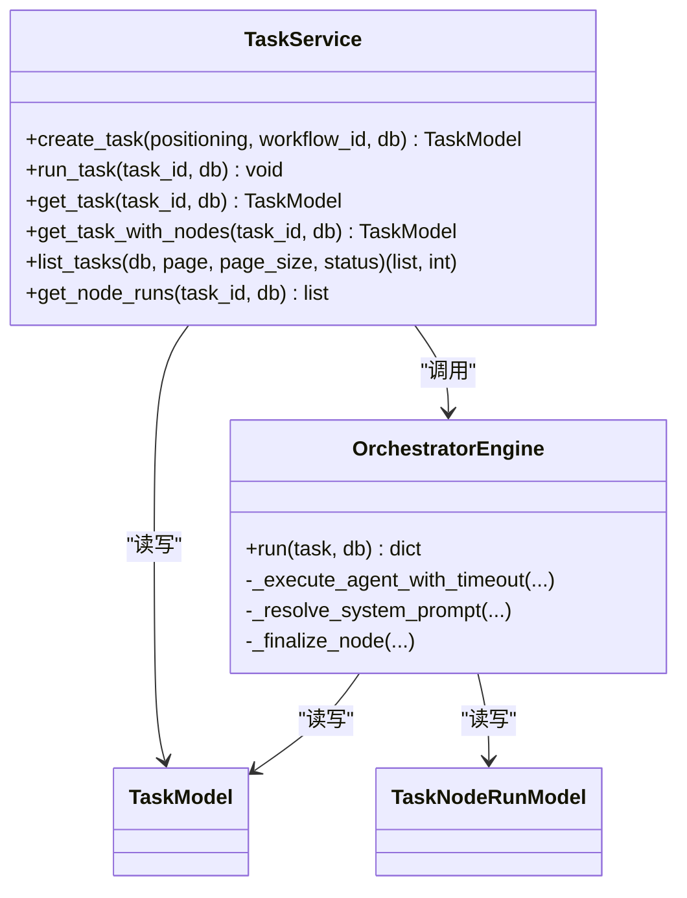
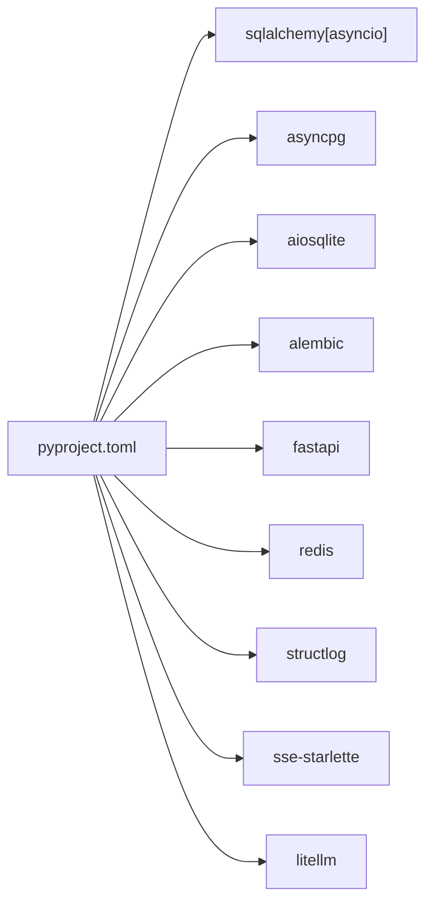

# 数据管理

<cite>
**本文引用的文件**
- [backend/app/models/tables.py](file://backend/app/models/tables.py)
- [backend/app/db/session.py](file://backend/app/db/session.py)
- [backend/alembic/env.py](file://backend/alembic/env.py)
- [backend/alembic.ini](file://backend/alembic.ini)
- [backend/pyproject.toml](file://backend/pyproject.toml)
- [backend/app/main.py](file://backend/app/main.py)
- [backend/app/core/config.py](file://backend/app/core/config.py)
- [backend/app/schemas/task.py](file://backend/app/schemas/task.py)
- [backend/app/services/task_service.py](file://backend/app/services/task_service.py)
- [backend/app/api/task_routes.py](file://backend/app/api/task_routes.py)
- [backend/app/orchestrator/engine.py](file://backend/app/orchestrator/engine.py)
- [backend/scripts/init_db.py](file://backend/scripts/init_db.py)
- [backend/app/core/logger.py](file://backend/app/core/logger.py)
- [backend/app/core/exceptions.py](file://backend/app/core/exceptions.py)
</cite>

## 目录
1. [简介](#简介)
2. [项目结构](#项目结构)
3. [核心组件](#核心组件)
4. [架构总览](#架构总览)
5. [详细组件分析](#详细组件分析)
6. [依赖分析](#依赖分析)
7. [性能考虑](#性能考虑)
8. [故障排查指南](#故障排查指南)
9. [结论](#结论)
10. [附录](#附录)

## 简介
本文件为 HotClaw 数据管理系统提供系统化技术文档，聚焦数据库模型设计、SQLAlchemy ORM 配置、Alembic 迁移体系、数据访问模式、缓存与性能优化、数据生命周期与安全备份、连接池与事务最佳实践，并给出扩展与优化的实用指南。内容以代码为依据，辅以图示帮助不同背景读者理解。

## 项目结构
后端采用 FastAPI + SQLAlchemy Async 的异步架构，数据库层通过独立模块组织，迁移工具使用 Alembic，应用启动时自动创建表并提供任务生命周期管理 API。

图表来源
- [backend/app/api/task_routes.py:1-163](file://backend/app/api/task_routes.py#L1-L163)
- [backend/app/services/task_service.py:1-126](file://backend/app/services/task_service.py#L1-L126)
- [backend/app/orchestrator/engine.py:1-285](file://backend/app/orchestrator/engine.py#L1-L285)
- [backend/app/models/tables.py:1-233](file://backend/app/models/tables.py#L1-L233)
- [backend/app/db/session.py:1-33](file://backend/app/db/session.py#L1-L33)
- [backend/alembic/env.py:1-53](file://backend/alembic/env.py#L1-L53)
- [backend/app/core/config.py:1-51](file://backend/app/core/config.py#L1-L51)
- [backend/app/main.py:1-142](file://backend/app/main.py#L1-L142)

章节来源
- [backend/app/main.py:42-58](file://backend/app/main.py#L42-L58)
- [backend/app/db/session.py:1-33](file://backend/app/db/session.py#L1-L33)
- [backend/app/models/tables.py:1-233](file://backend/app/models/tables.py#L1-L233)

## 核心组件
- 数据库模型：基于 SQLAlchemy DeclarativeBase 的 ORM 定义，涵盖任务、节点执行记录、账号画像、话题候选、文章草稿、审核结果、智能体、技能、工作流模板、系统日志等。
- 异步会话与引擎：使用 SQLAlchemy Async Engine 和 AsyncSession，支持 SQLite（开发）与 PostgreSQL（生产）。
- Alembic 迁移：异步迁移环境配置，支持离线与在线迁移。
- 业务服务：任务生命周期管理、分页查询、节点运行记录获取。
- API 路由：任务创建、状态查询、详情、节点明细、列表。
- 编排引擎：按固定顺序调度智能体，记录节点执行日志，支持降级与失败处理。

章节来源
- [backend/app/models/tables.py:18-233](file://backend/app/models/tables.py#L18-L233)
- [backend/app/db/session.py:8-33](file://backend/app/db/session.py#L8-L33)
- [backend/alembic/env.py:1-53](file://backend/alembic/env.py#L1-L53)
- [backend/app/services/task_service.py:20-126](file://backend/app/services/task_service.py#L20-L126)
- [backend/app/api/task_routes.py:1-163](file://backend/app/api/task_routes.py#L1-L163)
- [backend/app/orchestrator/engine.py:89-285](file://backend/app/orchestrator/engine.py#L89-L285)

## 架构总览
下图展示从 API 到服务、编排、数据库的调用链路及数据流向。

图表来源
- [backend/app/api/task_routes.py:19-51](file://backend/app/api/task_routes.py#L19-L51)
- [backend/app/services/task_service.py:22-58](file://backend/app/services/task_service.py#L22-L58)
- [backend/app/orchestrator/engine.py:92-234](file://backend/app/orchestrator/engine.py#L92-L234)
- [backend/app/db/session.py:22-33](file://backend/app/db/session.py#L22-L33)

## 详细组件分析

### 数据库模型设计与关系映射
- 基类与字段类型：统一继承自 DeclarativeBase；广泛使用 String、Text、Integer、Float、Boolean、DateTime、JSON；默认时间字段通过 server_default/onupdate 设置。
- 主要实体与关系：
  - 任务表：包含输入、结果、错误、计费与耗时统计；一对多关联节点执行记录、账号画像、话题候选、文章草稿。
  - 节点执行记录：记录每个节点在任务中的执行状态、输入输出、耗时与令牌用量；与任务表外键关联。
  - 账号画像：一对一绑定任务，唯一约束确保每任务仅一条画像。
  - 话题候选与文章草稿：多对一回指任务；文章草稿可选关联审核结果。
  - 审核结果：多对一回指文章草稿；与任务间接关联。
  - 智能体、技能、工作流模板：持久化配置与清单定义；用于编排与提示词解析。
  - 系统日志：结构化日志，带 trace_id、task_id 等索引字段便于追踪。

图表来源
- [backend/app/models/tables.py:23-233](file://backend/app/models/tables.py#L23-L233)

章节来源
- [backend/app/models/tables.py:23-233](file://backend/app/models/tables.py#L23-L233)

### SQLAlchemy ORM 配置与表结构
- 引擎与会话：使用 create_async_engine 创建异步引擎，根据数据库类型选择是否启用 pool_pre_ping；通过 async_session_factory 提供 AsyncSession 工厂；get_db 作为 FastAPI 依赖注入，自动提交/回滚/关闭。
- 开发模式自动建表：应用生命周期中在启动阶段创建所有表，便于本地开发。
- 字段默认值与索引：时间戳默认值、trace_id 与 task_id 建有索引，提升查询效率。

图表来源
- [backend/app/main.py:48-53](file://backend/app/main.py#L48-L53)
- [backend/app/db/session.py:8-19](file://backend/app/db/session.py#L8-L19)

章节来源
- [backend/app/db/session.py:1-33](file://backend/app/db/session.py#L1-L33)
- [backend/app/main.py:42-58](file://backend/app/main.py#L42-L58)

### Alembic 迁移系统
- 环境配置：异步迁移环境，支持离线与在线两种模式；通过 env.py 读取 settings.database_url 与 Base.metadata。
- 在线迁移：使用 async_engine_from_config 创建连接，逐个事务执行迁移。
- 配置文件：alembic.ini 中设置脚本位置与默认数据库 URL，日志级别可调。

图表来源
- [backend/alembic/env.py:34-52](file://backend/alembic/env.py#L34-L52)
- [backend/alembic.ini:1-39](file://backend/alembic.ini#L1-L39)

章节来源
- [backend/alembic/env.py:1-53](file://backend/alembic/env.py#L1-L53)
- [backend/alembic.ini:1-39](file://backend/alembic.ini#L1-L39)

### 数据访问模式与服务层
- 任务服务：封装任务创建、运行、查询、分页与节点运行记录获取；使用 selectinload 预加载节点记录，减少 N+1 查询风险。
- API 路由：负责请求响应与参数校验；将业务逻辑委托给服务层；后台任务启动编排，保证接口快速返回。
- 编排引擎：顺序执行节点，记录节点运行日志，聚合令牌用量，失败时广播错误并终止必要节点。

图表来源
- [backend/app/services/task_service.py:20-126](file://backend/app/services/task_service.py#L20-L126)
- [backend/app/orchestrator/engine.py:89-285](file://backend/app/orchestrator/engine.py#L89-L285)
- [backend/app/models/tables.py:23-74](file://backend/app/models/tables.py#L23-L74)

章节来源
- [backend/app/services/task_service.py:1-126](file://backend/app/services/task_service.py#L1-L126)
- [backend/app/api/task_routes.py:1-163](file://backend/app/api/task_routes.py#L1-L163)
- [backend/app/orchestrator/engine.py:1-285](file://backend/app/orchestrator/engine.py#L1-L285)

### 缓存策略与性能优化
- 结构化日志：使用 structlog 输出 JSON 日志，便于集中采集与检索；日志包含 trace_id、task_id 等上下文字段，利于性能分析与问题定位。
- 查询优化：服务层使用 selectinload 预加载节点记录；模型层为 trace_id、task_id 建有索引，加速日志与节点查询。
- 异步 I/O：全链路异步，避免阻塞；后台任务隔离数据库会话，降低主请求延迟。
- 令牌统计：编排引擎汇总 prompt_tokens 与 completion_tokens，便于成本控制与性能监控。

章节来源
- [backend/app/core/logger.py:8-36](file://backend/app/core/logger.py#L8-L36)
- [backend/app/models/tables.py:224-226](file://backend/app/models/tables.py#L224-L226)
- [backend/app/orchestrator/engine.py:211-216](file://backend/app/orchestrator/engine.py#L211-L216)

### 数据生命周期管理、安全与备份恢复
- 生命周期：任务从 pending 到 running/completed/failed，节点记录包含状态、耗时、令牌用量与错误信息；系统日志记录 trace_id、模块、消息与上下文。
- 安全：数据库凭据通过环境变量注入；开发默认 SQLite，生产建议 PostgreSQL；Alembic 配置文件中可调整默认 URL。
- 备份与恢复：建议结合数据库特性进行逻辑或物理备份；迁移前先备份，使用 Alembic 控制结构变更，保持版本可追溯。

章节来源
- [backend/app/core/config.py:7-14](file://backend/app/core/config.py#L7-L14)
- [backend/alembic.ini:5-5](file://backend/alembic.ini#L5-L5)
- [backend/app/models/tables.py:220-233](file://backend/app/models/tables.py#L220-L233)

### 数据库配置、连接池与事务
- 数据库 URL：开发默认 sqlite+aiosqlite，生产使用 postgresql+asyncpg；可通过环境变量覆盖。
- 连接池：异步引擎在非 SQLite 场景启用 pool_pre_ping 以维持连接健康；会话工厂设置 expire_on_commit=False，减少过期对象带来的额外查询。
- 事务：get_db 使用 try/except/finally 自动提交/回滚/关闭；服务层在关键操作 flush/commit，确保一致性。

章节来源
- [backend/app/core/config.py:7-14](file://backend/app/core/config.py#L7-L14)
- [backend/app/db/session.py:6-19](file://backend/app/db/session.py#L6-L19)
- [backend/app/db/session.py:22-33](file://backend/app/db/session.py#L22-L33)

## 依赖分析
- 依赖声明：项目使用 SQLAlchemy Async、asyncpg、aiosqlite、Alembic、FastAPI、structlog 等；测试框架 pytest 与 pytest-asyncio。
- 运行时依赖：FastAPI、SQLAlchemy Async、asyncpg/aiosqlite、Alembic、structlog、pydantic/pydantic-settings、redis、httpx、sse-starlette、nanoid、litellm。

图表来源
- [backend/pyproject.toml:6-22](file://backend/pyproject.toml#L6-L22)

章节来源
- [backend/pyproject.toml:1-41](file://backend/pyproject.toml#L1-L41)

## 性能考虑
- 异步优先：全链路异步 I/O，避免阻塞；后台任务隔离数据库会话，降低主路径延迟。
- 查询优化：预加载关联数据，减少 N+1；为高频查询字段建立索引（如日志表的 trace_id、task_id）。
- 事务边界：合理划分事务范围，批量写入时注意 flush/commit 的时机，避免长事务锁竞争。
- 监控与日志：结构化日志输出 trace_id、模块、耗时与上下文，便于性能分析与问题定位。
- 成本控制：统计 prompt_tokens 与 completion_tokens，结合阈值告警与限流策略。

## 故障排查指南
- 统一异常处理：定义 HotClawError 及子类，覆盖输入验证、任务/智能体/技能不存在、并发冲突、外部调用失败、超时、配置错误与系统内部错误；全局异常处理器将业务错误映射到合适的 HTTP 状态码。
- 日志与追踪：中间件注入 trace_id，系统日志包含 trace_id、task_id、模块与上下文；结合编排广播事件定位节点级错误。
- 数据一致性：get_db 自动回滚异常；服务层在关键点 flush/commit；节点运行记录包含错误信息与降级标记，便于复盘。

章节来源
- [backend/app/core/exceptions.py:4-125](file://backend/app/core/exceptions.py#L4-L125)
- [backend/app/main.py:88-129](file://backend/app/main.py#L88-L129)
- [backend/app/core/logger.py:8-36](file://backend/app/core/logger.py#L8-L36)
- [backend/app/db/session.py:22-33](file://backend/app/db/session.py#L22-L33)
- [backend/app/orchestrator/engine.py:164-196](file://backend/app/orchestrator/engine.py#L164-L196)

## 结论
本系统以 SQLAlchemy Async 为核心，结合 Alembic 迁移与结构化日志，构建了可演进的任务数据模型与编排执行链路。通过异步 I/O、预加载与索引优化、事务边界控制与统一异常处理，兼顾性能与可靠性。建议在生产环境中强化数据库备份、监控告警与容量规划，并持续通过迁移与模型演进支撑业务增长。

## 附录
- 初始化数据库：提供 init_db.py 脚本，可在命令行直接创建所有表。
- 配置项参考：数据库 URL、Redis URL、LLM 参数、应用环境与调试开关、日志级别、超时配置等均来自配置模块。

章节来源
- [backend/scripts/init_db.py:1-16](file://backend/scripts/init_db.py#L1-L16)
- [backend/app/core/config.py:1-51](file://backend/app/core/config.py#L1-L51)