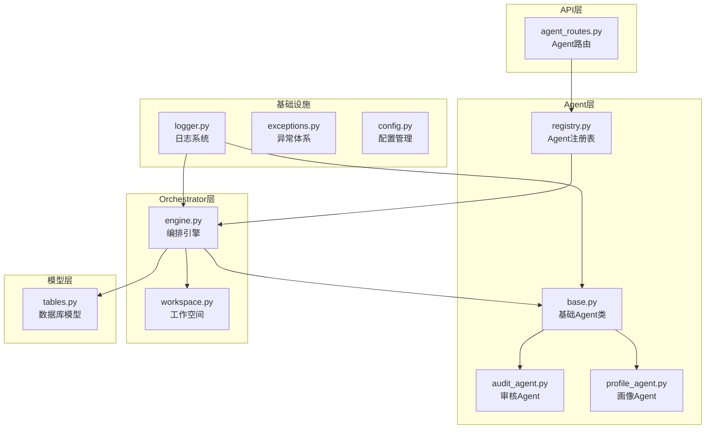
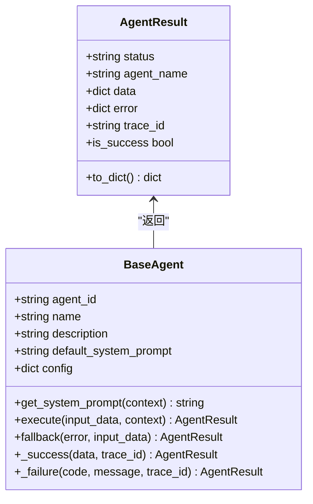
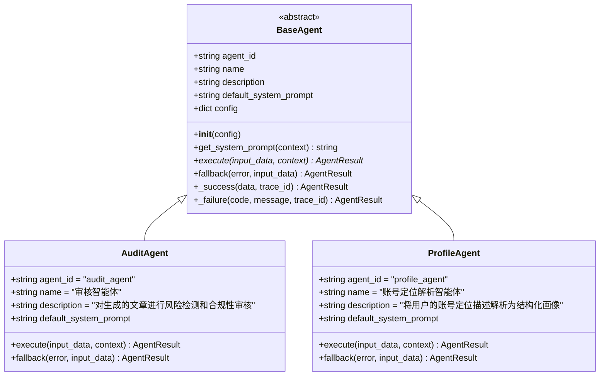
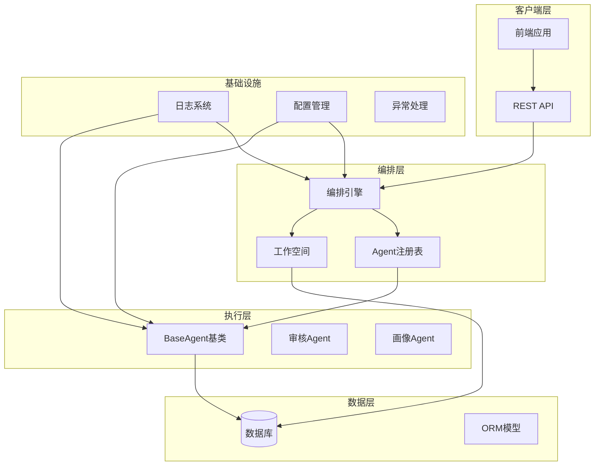
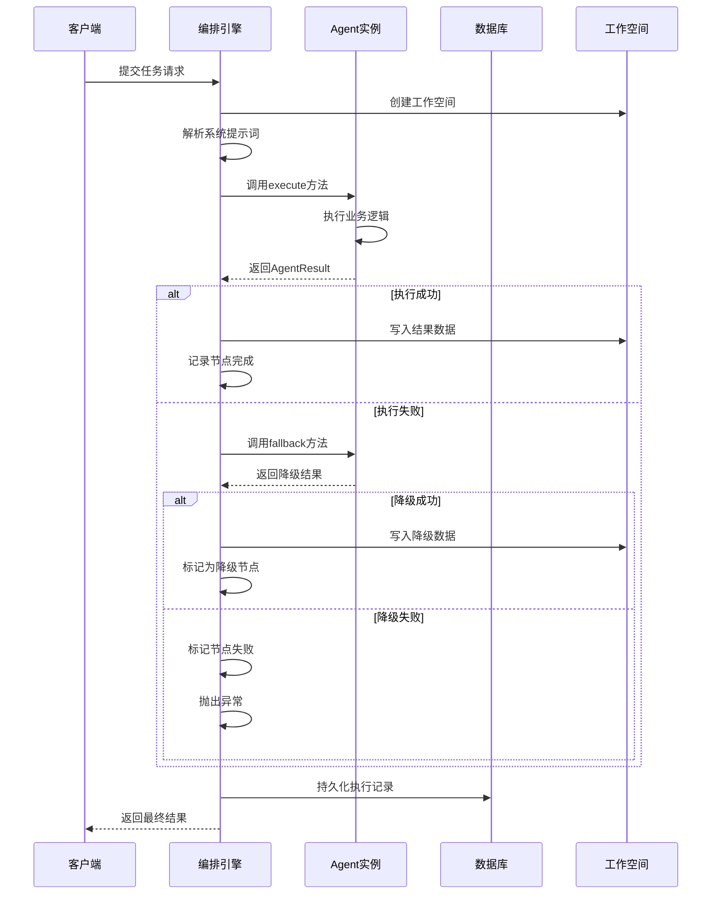
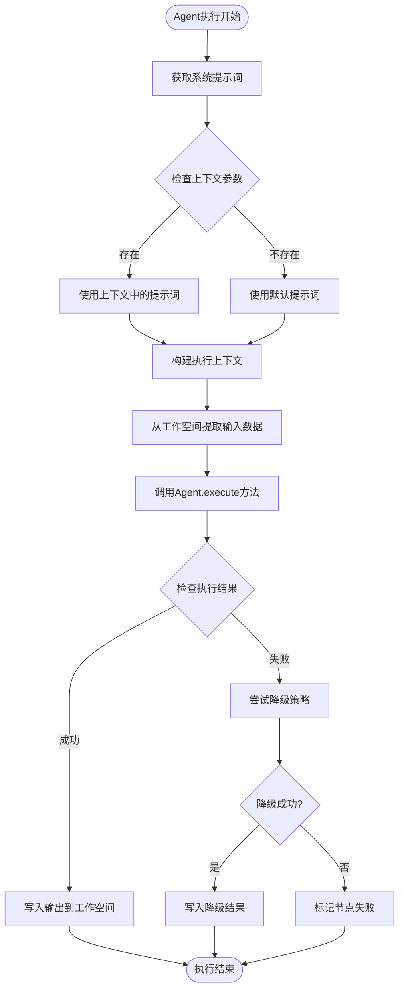
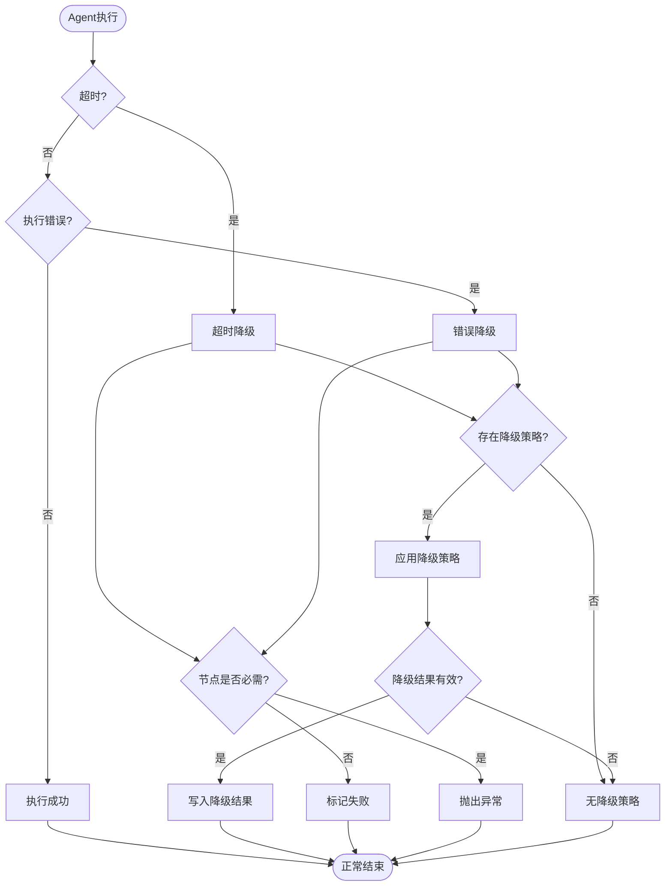
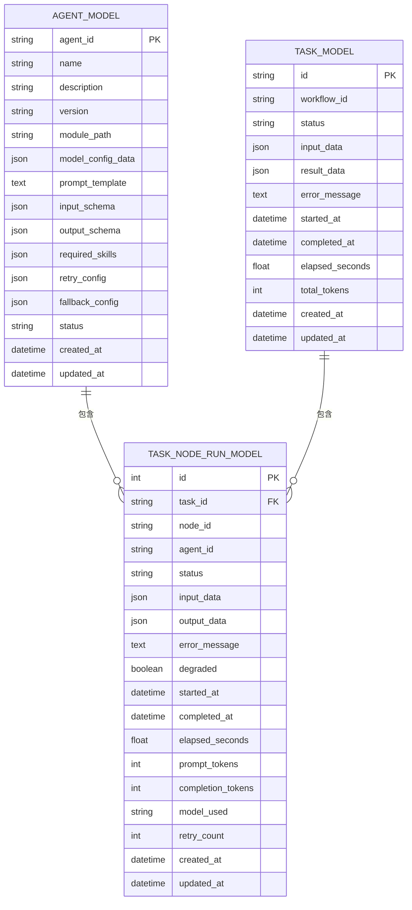
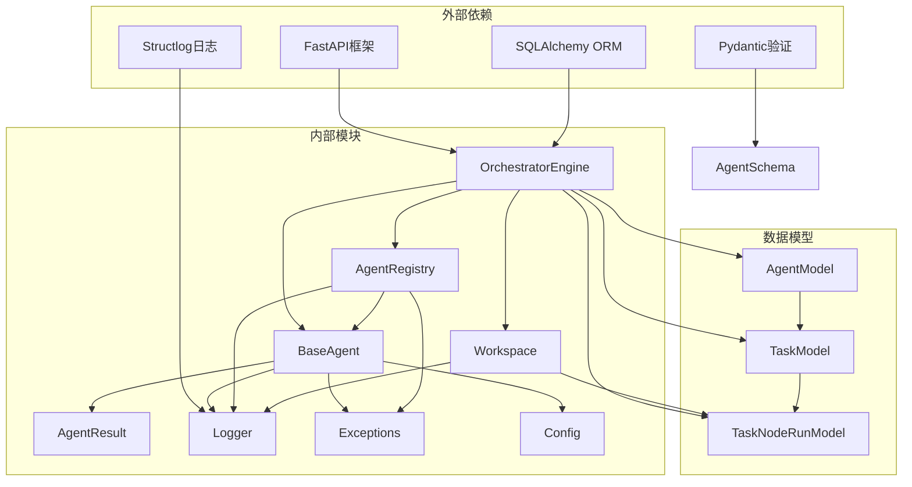
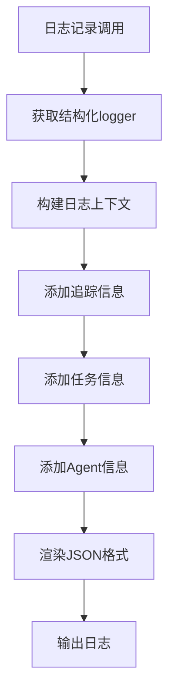

# Agent基类设计

<cite>
**本文档引用的文件**
- [backend/app/agents/base.py](file://backend/app/agents/base.py)
- [backend/app/agents/audit_agent.py](file://backend/app/agents/audit_agent.py)
- [backend/app/agents/profile_agent.py](file://backend/app/agents/profile_agent.py)
- [backend/app/agents/registry.py](file://backend/app/agents/registry.py)
- [backend/app/schemas/agent.py](file://backend/app/schemas/agent.py)
- [backend/app/orchestrator/engine.py](file://backend/app/orchestrator/engine.py)
- [backend/app/orchestrator/workspace.py](file://backend/app/orchestrator/workspace.py)
- [backend/app/api/agent_routes.py](file://backend/app/api/agent_routes.py)
- [backend/app/models/tables.py](file://backend/app/models/tables.py)
- [backend/app/core/logger.py](file://backend/app/core/logger.py)
- [backend/app/core/exceptions.py](file://backend/app/core/exceptions.py)
- [backend/app/core/config.py](file://backend/app/core/config.py)
</cite>

## 目录
1. [简介](#简介)
2. [项目结构](#项目结构)
3. [核心组件](#核心组件)
4. [架构概览](#架构概览)
5. [详细组件分析](#详细组件分析)
6. [依赖关系分析](#依赖关系分析)
7. [性能考虑](#性能考虑)
8. [故障排除指南](#故障排除指南)
9. [结论](#结论)
10. [附录](#附录)

## 简介

HotClaw Agent基类系统是一个高度模块化的智能体框架，专为构建企业级AI工作流而设计。该系统遵循严格的设计原则，确保每个Agent都具备清晰的职责边界、标准化的输入输出接口和可靠的降级机制。

系统的核心设计理念体现在以下几个方面：
- **单一职责原则**：每个Agent只负责一个特定的业务任务
- **标准化接口**：统一的AgentResult返回结构
- **可扩展性**：支持自定义提示词和配置注入
- **可靠性**：内置降级策略和错误处理机制
- **可观测性**：完整的日志记录和追踪功能

## 项目结构

Agent基类系统主要分布在以下目录结构中：

**图表来源**
- [backend/app/agents/base.py:1-99](file://backend/app/agents/base.py#L1-L99)
- [backend/app/orchestrator/engine.py:1-285](file://backend/app/orchestrator/engine.py#L1-L285)
- [backend/app/agents/registry.py:1-40](file://backend/app/agents/registry.py#L1-L40)

**章节来源**
- [backend/app/agents/base.py:1-99](file://backend/app/agents/base.py#L1-L99)
- [backend/app/orchestrator/engine.py:1-285](file://backend/app/orchestrator/engine.py#L1-L285)
- [backend/app/agents/registry.py:1-40](file://backend/app/agents/registry.py#L1-L40)

## 核心组件

### AgentResult标准化返回结构

AgentResult是HotClaw系统中标准化的返回结构，确保所有Agent都遵循统一的数据格式。其设计体现了以下关键特性：

**图表来源**
- [backend/app/agents/base.py:18-99](file://backend/app/agents/base.py#L18-L99)

AgentResult的核心字段定义：
- **status**: 执行状态（success/failed）
- **agent_name**: Agent标识符
- **data**: 成功时返回的结构化数据
- **error**: 失败时返回的错误信息
- **trace_id**: 全局追踪标识符

**章节来源**
- [backend/app/agents/base.py:18-99](file://backend/app/agents/base.py#L18-L99)

### BaseAgent抽象基类

BaseAgent作为所有Agent的抽象基类，定义了统一的接口规范和生命周期管理机制：

**图表来源**
- [backend/app/agents/base.py:49-99](file://backend/app/agents/base.py#L49-L99)
- [backend/app/agents/audit_agent.py:7-66](file://backend/app/agents/audit_agent.py#L7-L66)
- [backend/app/agents/profile_agent.py:10-73](file://backend/app/agents/profile_agent.py#L10-L73)

**章节来源**
- [backend/app/agents/base.py:49-99](file://backend/app/agents/base.py#L49-L99)

## 架构概览

HotClaw Agent基类系统采用分层架构设计，确保各组件职责清晰、耦合度低：

**图表来源**
- [backend/app/orchestrator/engine.py:89-285](file://backend/app/orchestrator/engine.py#L89-L285)
- [backend/app/agents/registry.py:10-40](file://backend/app/agents/registry.py#L10-L40)
- [backend/app/orchestrator/workspace.py:12-53](file://backend/app/orchestrator/workspace.py#L12-L53)

系统的关键架构原则：
- **职责分离**：每个组件都有明确的职责边界
- **依赖倒置**：高层模块不依赖低层模块的具体实现
- **开闭原则**：对扩展开放，对修改关闭
- **单一职责**：每个类只负责一个功能领域

## 详细组件分析

### Agent生命周期管理

Agent的生命周期由编排引擎统一管理，包含初始化、执行、降级和清理等阶段：

**图表来源**
- [backend/app/orchestrator/engine.py:92-235](file://backend/app/orchestrator/engine.py#L92-L235)

**章节来源**
- [backend/app/orchestrator/engine.py:92-235](file://backend/app/orchestrator/engine.py#L92-L235)

### 上下文感知机制

Agent的上下文感知能力通过工作空间和系统提示词机制实现：

**图表来源**
- [backend/app/agents/base.py:60-62](file://backend/app/agents/base.py#L60-L62)
- [backend/app/orchestrator/engine.py:140-147](file://backend/app/orchestrator/engine.py#L140-L147)

**章节来源**
- [backend/app/agents/base.py:60-62](file://backend/app/agents/base.py#L60-L62)
- [backend/app/orchestrator/engine.py:140-147](file://backend/app/orchestrator/engine.py#L140-L147)

### 降级策略机制

降级策略是HotClaw系统的重要可靠性保障机制：

**图表来源**
- [backend/app/orchestrator/engine.py:154-175](file://backend/app/orchestrator/engine.py#L154-L175)
- [backend/app/agents/base.py:77-82](file://backend/app/agents/base.py#L77-L82)

**章节来源**
- [backend/app/orchestrator/engine.py:154-175](file://backend/app/orchestrator/engine.py#L154-L175)
- [backend/app/agents/base.py:77-82](file://backend/app/agents/base.py#L77-L82)

### 配置注入和持久化

Agent配置通过数据库持久化，支持动态更新和版本管理：

**图表来源**
- [backend/app/models/tables.py:160-181](file://backend/app/models/tables.py#L160-L181)
- [backend/app/models/tables.py:48-74](file://backend/app/models/tables.py#L48-L74)
- [backend/app/models/tables.py:23-46](file://backend/app/models/tables.py#L23-L46)

**章节来源**
- [backend/app/models/tables.py:160-181](file://backend/app/models/tables.py#L160-L181)
- [backend/app/models/tables.py:48-74](file://backend/app/models/tables.py#L48-L74)
- [backend/app/models/tables.py:23-46](file://backend/app/models/tables.py#L23-L46)

## 依赖关系分析

Agent基类系统的依赖关系呈现清晰的层次结构：

**图表来源**
- [backend/app/orchestrator/engine.py:18-26](file://backend/app/orchestrator/engine.py#L18-L26)
- [backend/app/agents/base.py:11-15](file://backend/app/agents/base.py#L11-L15)
- [backend/app/agents/registry.py:3-7](file://backend/app/agents/registry.py#L3-L7)

**章节来源**
- [backend/app/orchestrator/engine.py:18-26](file://backend/app/orchestrator/engine.py#L18-L26)
- [backend/app/agents/base.py:11-15](file://backend/app/agents/base.py#L11-L15)
- [backend/app/agents/registry.py:3-7](file://backend/app/agents/registry.py#L3-L7)

## 性能考虑

HotClaw Agent基类系统在设计时充分考虑了性能优化：

### 超时控制
- **Agent执行超时**：默认120秒，可通过配置调整
- **技能调用超时**：默认60秒
- **LLM调用超时**：默认60秒

### 内存管理
- **工作空间隔离**：每个任务拥有独立的工作空间
- **增量数据存储**：只存储必要的中间结果
- **异步执行**：支持并发任务处理

### 缓存策略
- **Agent注册表缓存**：单例模式避免重复实例化
- **日志结构化**：减少字符串拼接开销
- **数据库连接池**：优化数据库访问性能

**章节来源**
- [backend/app/core/config.py:42-45](file://backend/app/core/config.py#L42-L45)
- [backend/app/orchestrator/engine.py:236-243](file://backend/app/orchestrator/engine.py#L236-L243)

## 故障排除指南

### 常见问题诊断

#### Agent执行失败
1. **检查Agent实现**：确认execute方法正确返回AgentResult
2. **验证输入数据**：确保input_data符合预期格式
3. **查看日志信息**：检查结构化日志中的错误详情

#### 降级策略无效
1. **确认fallback方法实现**：检查是否正确实现降级逻辑
2. **验证降级数据格式**：确保返回的降级数据符合AgentResult规范
3. **测试降级场景**：模拟异常情况验证降级机制

#### 配置问题
1. **检查数据库连接**：确认AgentModel表中有正确的配置记录
2. **验证提示词优先级**：确认自定义提示词优先于默认提示词
3. **测试配置更新**：验证配置变更能够正确生效

**章节来源**
- [backend/app/core/exceptions.py:31-36](file://backend/app/core/exceptions.py#L31-36)
- [backend/app/orchestrator/engine.py:154-175](file://backend/app/orchestrator/engine.py#L154-L175)

### 日志记录机制

系统采用结构化日志记录，便于问题排查和性能监控：

**图表来源**
- [backend/app/core/logger.py:33-36](file://backend/app/core/logger.py#L33-L36)

**章节来源**
- [backend/app/core/logger.py:8-36](file://backend/app/core/logger.py#L8-L36)

## 结论

HotClaw Agent基类系统通过精心设计的架构和严格的实现规范，为构建可靠的企业级AI工作流提供了坚实的基础。系统的核心优势包括：

1. **标准化接口**：统一的AgentResult结构确保了系统的可预测性和一致性
2. **强健的降级机制**：完善的fallback策略提高了系统的容错能力
3. **灵活的配置管理**：支持动态配置更新和版本控制
4. **全面的可观测性**：结构化日志和追踪机制便于问题诊断
5. **清晰的职责分离**：分层架构确保了系统的可维护性

对于开发者而言，遵循本文档提供的开发指南和最佳实践，可以快速构建高质量的Agent实现，同时保持与现有系统的兼容性和一致性。

## 附录

### 开发者指南

#### 必需属性定义
- **agent_id**: 唯一标识符，用于注册表查找
- **name**: Agent名称，用于显示和调试
- **description**: 功能描述，便于理解Agent职责
- **default_system_prompt**: 默认系统提示词，定义Agent行为规范

#### 方法实现要求
1. **execute方法**：必须返回AgentResult实例
2. **fallback方法**：可选实现，用于降级策略
3. **get_system_prompt方法**：可重写以支持动态提示词

#### 最佳实践
- 使用结构化数据格式传递参数
- 实现详细的错误处理和日志记录
- 遵循单一职责原则，避免复杂逻辑
- 提供充分的单元测试覆盖
- 使用类型注解提高代码可读性

**章节来源**
- [backend/app/agents/base.py:52-55](file://backend/app/agents/base.py#L52-L55)
- [backend/app/agents/base.py:64-75](file://backend/app/agents/base.py#L64-L75)