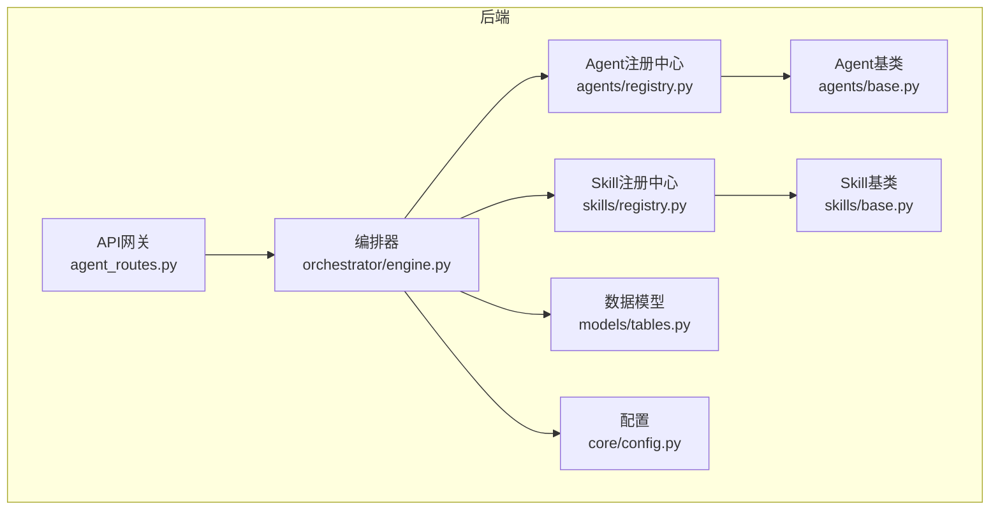
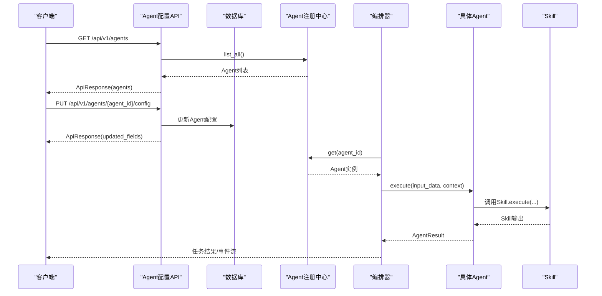
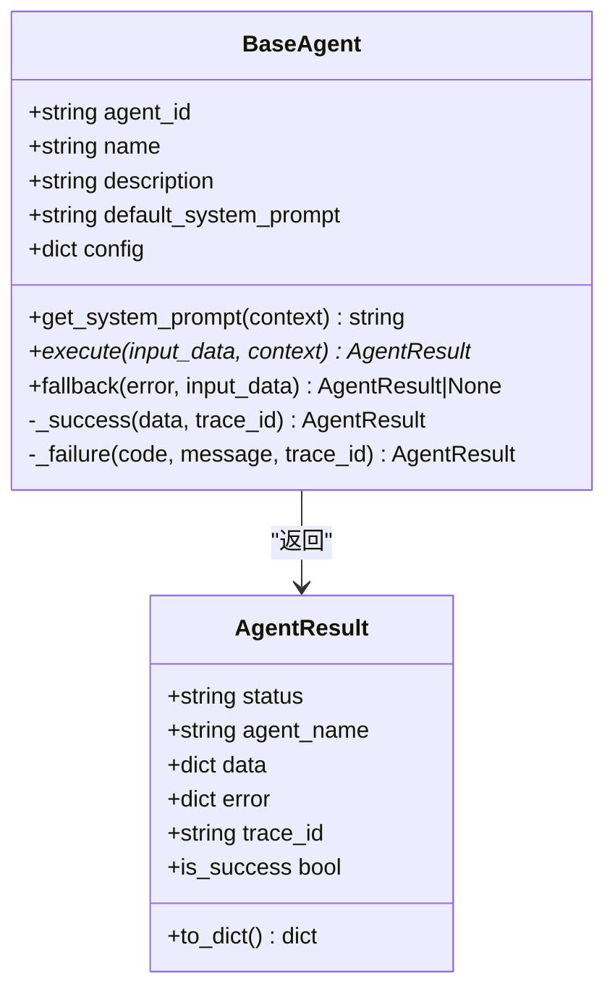
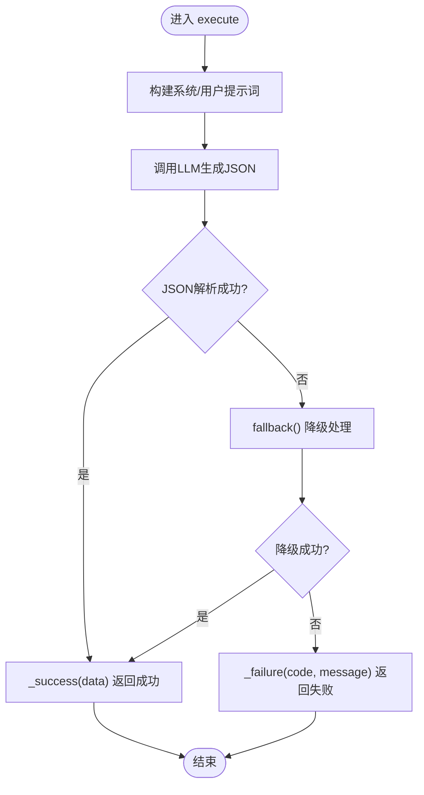
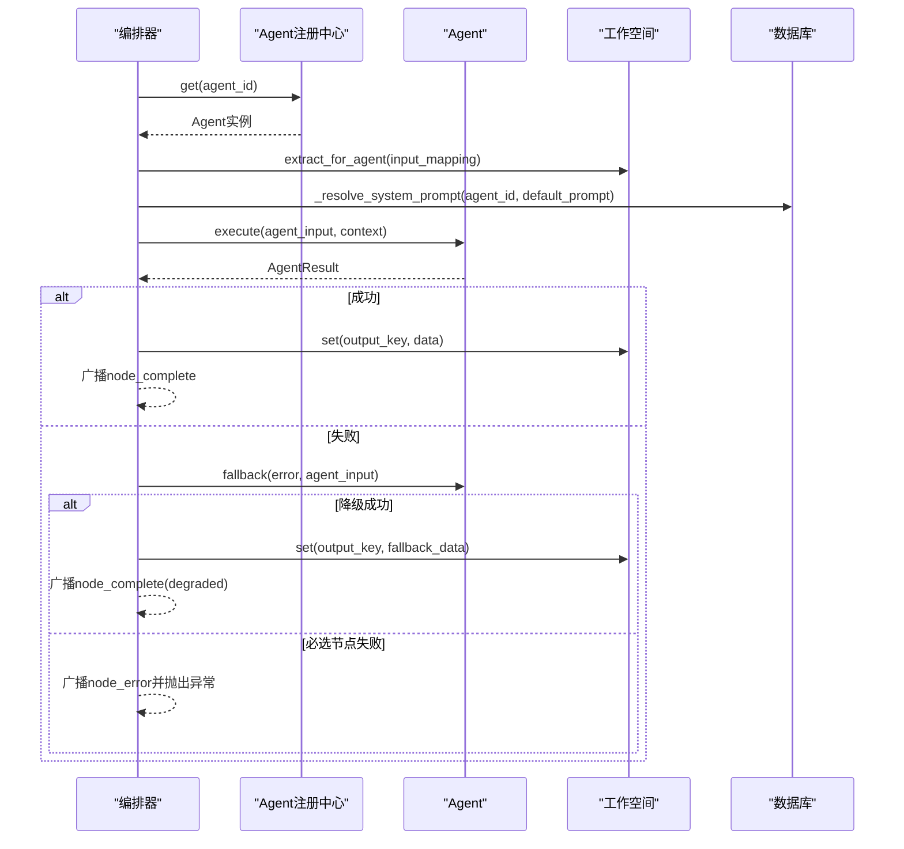
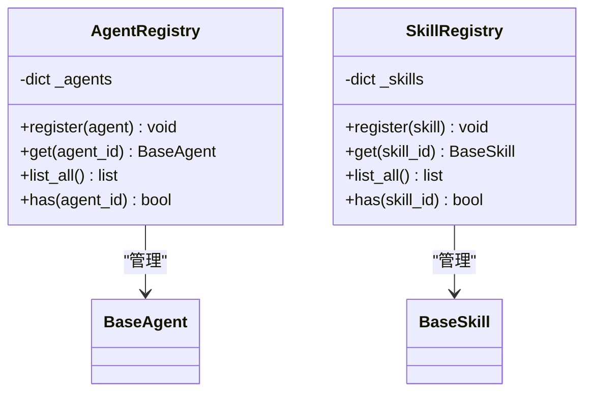
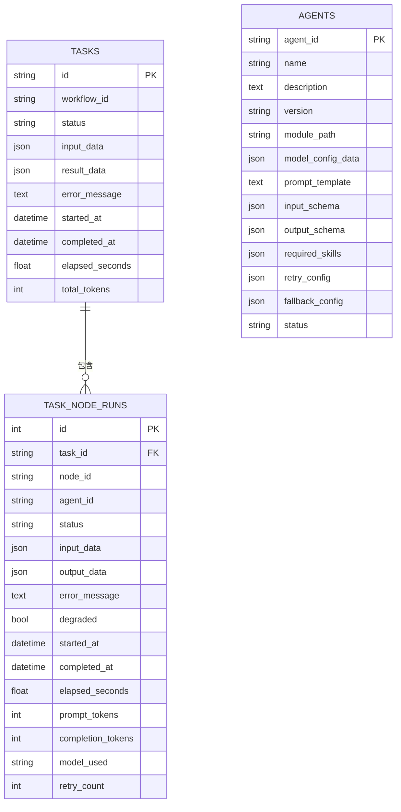
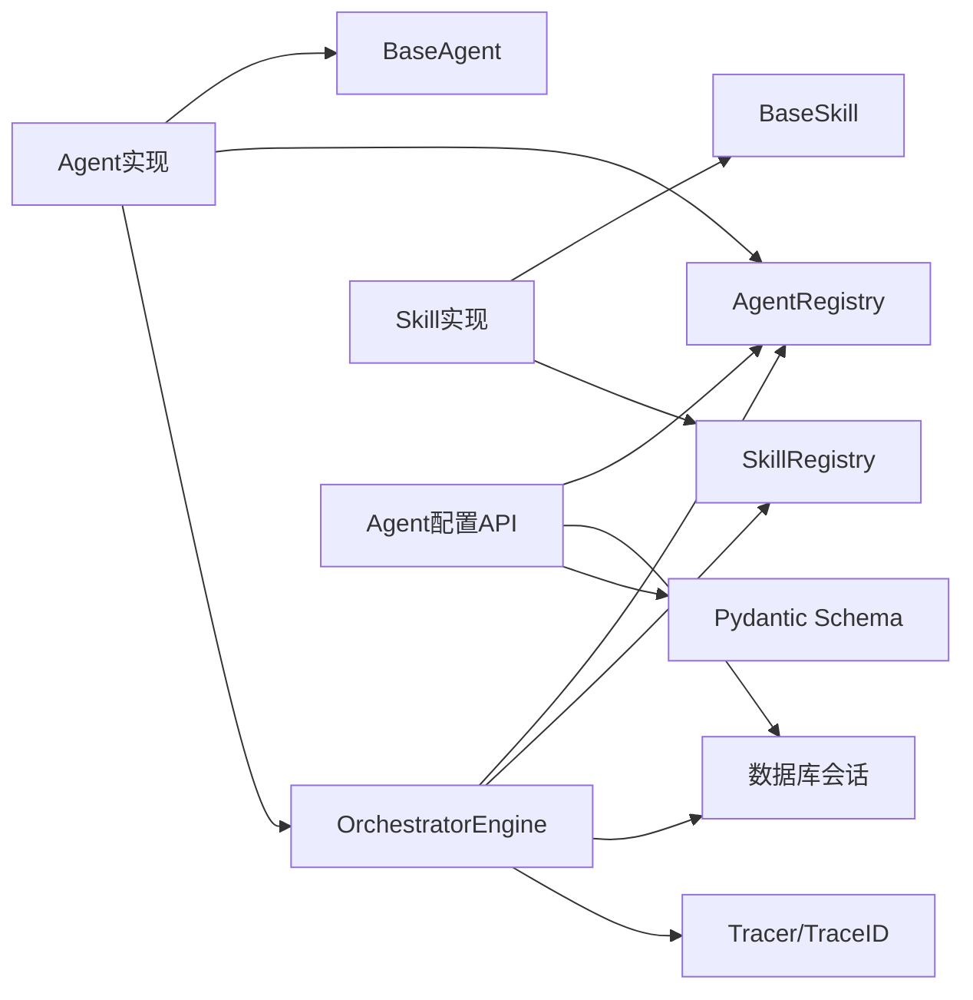

# Agent开发指南

<cite>
**本文引用的文件**
- [backend/app/agents/base.py](file://backend/app/agents/base.py)
- [backend/app/agents/audit_agent.py](file://backend/app/agents/audit_agent.py)
- [backend/app/agents/registry.py](file://backend/app/agents/registry.py)
- [backend/app/skills/base.py](file://backend/app/skills/base.py)
- [backend/app/skills/registry.py](file://backend/app/skills/registry.py)
- [backend/app/orchestrator/engine.py](file://backend/app/orchestrator/engine.py)
- [backend/app/models/tables.py](file://backend/app/models/tables.py)
- [backend/app/core/config.py](file://backend/app/core/config.py)
- [backend/app/api/agent_routes.py](file://backend/app/api/agent_routes.py)
- [backend/app/schemas/agent.py](file://backend/app/schemas/agent.py)
- [backend/app/schemas/skill.py](file://backend/app/schemas/skill.py)
- [backend/tests/test_agent_api.py](file://backend/tests/test_agent_api.py)
- [ARCHITECTURE.md](file://ARCHITECTURE.md)
- [Notice.md](file://Notice.md)
</cite>

## 目录
1. [简介](#简介)
2. [项目结构](#项目结构)
3. [核心组件](#核心组件)
4. [架构总览](#架构总览)
5. [详细组件分析](#详细组件分析)
6. [依赖分析](#依赖分析)
7. [性能考量](#性能考量)
8. [故障排查指南](#故障排查指南)
9. [结论](#结论)
10. [附录](#附录)

## 简介
本指南面向HotClaw Agent开发，提供从零开始创建新Agent的完整步骤与最佳实践。内容涵盖类继承、方法实现、配置定义、错误处理与降级策略、与Skill系统的集成、依赖管理与调用协议、测试策略与调试技巧，以及性能优化建议。文档同时兼顾初学者与专家用户，提供循序渐进的学习路径与高级扩展技术。

## 项目结构
HotClaw后端采用清晰的分层架构：API网关、编排器、Agent层、Skill层、服务层、模型与Schema、核心工具与配置。Agent与Skill分别位于独立模块，通过注册中心集中管理，编排器按固定工作流顺序调度Agent，管理上下文与状态广播。

**图表来源**
- [backend/app/api/agent_routes.py:1-115](file://backend/app/api/agent_routes.py#L1-L115)
- [backend/app/orchestrator/engine.py:1-285](file://backend/app/orchestrator/engine.py#L1-L285)
- [backend/app/agents/registry.py:1-40](file://backend/app/agents/registry.py#L1-L40)
- [backend/app/skills/registry.py:1-37](file://backend/app/skills/registry.py#L1-L37)
- [backend/app/agents/base.py:1-99](file://backend/app/agents/base.py#L1-L99)
- [backend/app/skills/base.py:1-37](file://backend/app/skills/base.py#L1-L37)
- [backend/app/models/tables.py:1-319](file://backend/app/models/tables.py#L1-L319)
- [backend/app/core/config.py:1-99](file://backend/app/core/config.py#L1-L99)

**章节来源**
- [ARCHITECTURE.md:414-448](file://ARCHITECTURE.md#L414-L448)
- [Notice.md:100-121](file://Notice.md#L100-L121)

## 核心组件
- Agent基类与结果封装：定义统一的输入输出协议、执行接口与降级返回。
- Skill基类：定义无状态工具能力的标准执行接口。
- 编排器：按固定工作流顺序调度Agent，管理上下文、记录节点运行、广播事件。
- 注册中心：集中注册与获取Agent/Skill实例。
- 数据模型：持久化任务、节点运行、Agent/Skill配置与系统配置。
- 配置系统：统一读取环境变量与Provider配置，提供超时等全局设置。
- API路由：提供Agent配置查询与更新接口。

**章节来源**
- [backend/app/agents/base.py:18-99](file://backend/app/agents/base.py#L18-L99)
- [backend/app/skills/base.py:16-37](file://backend/app/skills/base.py#L16-L37)
- [backend/app/orchestrator/engine.py:89-285](file://backend/app/orchestrator/engine.py#L89-L285)
- [backend/app/agents/registry.py:10-40](file://backend/app/agents/registry.py#L10-L40)
- [backend/app/skills/registry.py:10-37](file://backend/app/skills/registry.py#L10-L37)
- [backend/app/models/tables.py:23-200](file://backend/app/models/tables.py#L23-L200)
- [backend/app/core/config.py:52-99](file://backend/app/core/config.py#L52-L99)
- [backend/app/api/agent_routes.py:1-115](file://backend/app/api/agent_routes.py#L1-L115)

## 架构总览
HotClaw遵循“控制平面与执行平面分离”的原则：编排器负责调度与上下文管理，Agent负责执行与决策，Skill提供原子能力。Agent与Skill均通过注册中心集中管理，编排器按固定工作流顺序推进，节点失败时执行降级策略并记录日志与追踪。

**图表来源**
- [backend/app/api/agent_routes.py:17-115](file://backend/app/api/agent_routes.py#L17-L115)
- [backend/app/agents/registry.py:23-28](file://backend/app/agents/registry.py#L23-L28)
- [backend/app/orchestrator/engine.py:137-171](file://backend/app/orchestrator/engine.py#L137-L171)
- [backend/app/agents/base.py:64-99](file://backend/app/agents/base.py#L64-L99)
- [backend/app/skills/base.py:26-37](file://backend/app/skills/base.py#L26-L37)

## 详细组件分析

### Agent基类与结果封装
- 统一结果结构：AgentResult包含状态、Agent标识、数据、错误与追踪ID，便于编排器与前端消费。
- 执行接口：抽象方法execute定义标准签名，确保所有Agent遵循相同的输入输出协议。
- 降级策略：fallback方法默认返回None，可在具体Agent中实现降级逻辑，提升系统韧性。
- 工具方法：_success/_failure封装成功与失败返回，简化Agent内部实现。

**图表来源**
- [backend/app/agents/base.py:18-99](file://backend/app/agents/base.py#L18-L99)

**章节来源**
- [backend/app/agents/base.py:18-99](file://backend/app/agents/base.py#L18-L99)

### AuditAgent示例：实现与降级
- 角色与职责：对生成内容进行合规性审核与质量评估，返回通过与否、风险等级与问题列表。
- 执行流程：构造系统提示词与用户提示词，调用LLM生成JSON结果，解析并封装为AgentResult。
- 降级策略：当LLM调用失败时，返回默认降级结果，标记为“建议人工复核”，避免阻断整条链路。

**图表来源**
- [backend/app/agents/audit_agent.py:53-141](file://backend/app/agents/audit_agent.py#L53-L141)

**章节来源**
- [backend/app/agents/audit_agent.py:12-141](file://backend/app/agents/audit_agent.py#L12-L141)

### 编排器：工作流调度与上下文管理
- 固定工作流：默认线性链路，编排器按顺序调度Agent，提取输入、注入上下文、记录节点运行。
- 上下文注入：从工作空间提取Agent所需输入，注入系统提示词（优先DB自定义，其次Agent默认）。
- 错误与降级：节点失败时尝试Agent.fallback，若降级成功则标记为降级并继续；必选节点失败抛出异常并终止。
- 事件广播：节点开始/完成/失败时广播SSE事件，前端实时消费。
- 超时控制：对Agent执行设置超时，超时视为失败并触发降级或终止。

**图表来源**
- [backend/app/orchestrator/engine.py:107-234](file://backend/app/orchestrator/engine.py#L107-L234)

**章节来源**
- [backend/app/orchestrator/engine.py:89-285](file://backend/app/orchestrator/engine.py#L89-L285)

### 注册中心：Agent与Skill的集中管理
- 注册与获取：注册中心以agent_id/skill_id为键管理实例，提供注册、获取、列举与存在性判断。
- 异常处理：未找到实例时抛出相应异常，确保调用方明确错误来源。
- 单例模式：全局唯一实例，避免重复注册与状态不一致。

**图表来源**
- [backend/app/agents/registry.py:10-40](file://backend/app/agents/registry.py#L10-L40)
- [backend/app/skills/registry.py:10-37](file://backend/app/skills/registry.py#L10-L37)

**章节来源**
- [backend/app/agents/registry.py:10-40](file://backend/app/agents/registry.py#L10-L40)
- [backend/app/skills/registry.py:10-37](file://backend/app/skills/registry.py#L10-L37)

### 数据模型：任务、节点运行与Agent配置
- 任务模型：记录任务生命周期、输入输出、错误与耗时等。
- 节点运行模型：记录每个Agent节点的输入输出、错误、耗时、Token消耗与降级标记。
- Agent模型：持久化Agent配置（模型参数、提示词模板、输入输出Schema、所需Skill、重试与降级配置等）。
- 系统配置模型：统一管理运行时配置键值对，支持分类与敏感信息标记。

**图表来源**
- [backend/app/models/tables.py:23-200](file://backend/app/models/tables.py#L23-L200)

**章节来源**
- [backend/app/models/tables.py:23-200](file://backend/app/models/tables.py#L23-L200)

### 配置系统：环境变量与Provider
- 环境变量加载：优先加载根目录.env文件，兼容Windows UTF-8编码。
- Provider配置：根据默认Provider动态设置LLM API Key、Base URL与模型名。
- 超时设置：统一管理Agent、Skill与LLM调用超时，保障稳定性。

**章节来源**
- [backend/app/core/config.py:7-99](file://backend/app/core/config.py#L7-L99)

### API路由：Agent配置管理
- 列表与详情：提供Agent列表查询与单个Agent详情，支持DB自定义提示词与默认提示词的合并展示。
- 配置更新：支持更新模型配置、提示词模板与重试配置，空字符串表示重置为默认。

**章节来源**
- [backend/app/api/agent_routes.py:17-115](file://backend/app/api/agent_routes.py#L17-L115)
- [backend/app/schemas/agent.py:6-29](file://backend/app/schemas/agent.py#L6-L29)

### Schema定义：结构化输入输出
- AgentInfo：Agent基础信息与配置字段。
- AgentListResponse：Agent列表响应。
- AgentConfigUpdateRequest：Agent配置更新请求体。
- SkillInfo/SkillListResponse/SkillConfigUpdateRequest：与Agent类似，用于Skill配置管理。

**章节来源**
- [backend/app/schemas/agent.py:6-29](file://backend/app/schemas/agent.py#L6-L29)
- [backend/app/schemas/skill.py:6-22](file://backend/app/schemas/skill.py#L6-L22)

## 依赖分析
- Agent依赖：BaseAgent、AgentResult、AgentRegistry、编排器、配置系统与日志追踪。
- Skill依赖：BaseSkill、SkillRegistry、外部服务或工具。
- 编排器依赖：AgentRegistry、SkillRegistry、Workspace、Broadcaster、数据库会话与Tracer。
- API依赖：AgentRegistry、数据库会话、Schema校验与统一响应封装。

**图表来源**
- [backend/app/agents/base.py:49-99](file://backend/app/agents/base.py#L49-L99)
- [backend/app/skills/base.py:16-37](file://backend/app/skills/base.py#L16-L37)
- [backend/app/agents/registry.py:10-40](file://backend/app/agents/registry.py#L10-L40)
- [backend/app/skills/registry.py:10-37](file://backend/app/skills/registry.py#L10-L37)
- [backend/app/orchestrator/engine.py:18-26](file://backend/app/orchestrator/engine.py#L18-L26)
- [backend/app/api/agent_routes.py:1-15](file://backend/app/api/agent_routes.py#L1-L15)

**章节来源**
- [backend/app/agents/base.py:11-15](file://backend/app/agents/base.py#L11-L15)
- [backend/app/skills/base.py:10-13](file://backend/app/skills/base.py#L10-L13)
- [backend/app/orchestrator/engine.py:11-26](file://backend/app/orchestrator/engine.py#L11-L26)
- [backend/app/api/agent_routes.py:3-14](file://backend/app/api/agent_routes.py#L3-L14)

## 性能考量
- 超时控制：合理设置Agent与LLM超时，避免长时间阻塞；编排器内统一超时处理。
- Token统计：节点运行模型记录prompt与completion的Token消耗，便于成本控制与优化。
- 降级策略：在外部依赖失败时快速降级，减少整体延迟与失败率。
- 广播与日志：SSE事件与结构化日志开销可控，建议按需裁剪日志级别与事件粒度。
- 数据库写入：节点运行记录在完成后统一flush，减少频繁IO。

[本节为通用指导，无需特定文件引用]

## 故障排查指南
- Agent未找到：检查Agent是否已注册，确认agent_id拼写与注册流程。
- 节点失败：查看节点运行记录中的错误信息与追踪ID，结合编排器广播事件定位问题。
- LLM调用异常：检查Provider配置、API Key与Base URL，确认超时设置合理。
- 配置更新无效：确认DB中Agent记录存在且字段更新成功，空字符串表示重置为默认。
- 测试用例：参考Agent API测试，覆盖正常与异常场景，确保接口稳定性。

**章节来源**
- [backend/app/agents/registry.py:23-28](file://backend/app/agents/registry.py#L23-L28)
- [backend/app/orchestrator/engine.py:176-196](file://backend/app/orchestrator/engine.py#L176-L196)
- [backend/app/api/agent_routes.py:88-114](file://backend/app/api/agent_routes.py#L88-L114)
- [backend/tests/test_agent_api.py:8-28](file://backend/tests/test_agent_api.py#L8-L28)

## 结论
HotClaw的Agent开发遵循“单一职责、标准化输入输出、严格错误处理与降级策略”的核心原则。通过注册中心与编排器，Agent与Skill得以解耦协作；通过Schema与统一结果结构，系统具备良好的可维护性与可观测性。开发者可在此基础上快速扩展新的Agent与Skill，构建稳定高效的多智能体内容生产平台。

[本节为总结，无需特定文件引用]

## 附录

### 从零创建新Agent的步骤
- 定义Agent类：继承BaseAgent，设置agent_id/name/description/default_system_prompt。
- 实现execute：接收input_data与context，返回AgentResult；必要时调用Skill。
- 实现fallback：在外部依赖失败时提供降级返回，避免阻断工作流。
- 注册Agent：在应用启动时将实例注册到AgentRegistry。
- 配置持久化：在DB中创建Agent记录，支持自定义提示词与模型配置。
- 编排器集成：在工作流定义中加入新节点，配置输入映射与输出键。
- 编写测试：覆盖正常与异常场景，确保接口与执行逻辑稳定。

**章节来源**
- [backend/app/agents/base.py:49-99](file://backend/app/agents/base.py#L49-L99)
- [backend/app/agents/registry.py:16-21](file://backend/app/agents/registry.py#L16-L21)
- [backend/app/models/tables.py:160-181](file://backend/app/models/tables.py#L160-L181)
- [backend/app/orchestrator/engine.py:137-171](file://backend/app/orchestrator/engine.py#L137-L171)
- [backend/tests/test_agent_api.py:8-28](file://backend/tests/test_agent_api.py#L8-L28)

### Agent配置文件结构与参数验证
- 配置字段：模型配置、提示词模板、输入输出Schema、所需Skill、重试与降级配置。
- 参数验证：通过Pydantic Schema定义输入输出结构，确保结构化协议。
- 默认值：未设置时使用Agent默认提示词与系统默认Provider配置。
- 更新策略：PUT接口支持部分字段更新，空字符串表示重置为默认。

**章节来源**
- [backend/app/models/tables.py:160-181](file://backend/app/models/tables.py#L160-L181)
- [backend/app/schemas/agent.py:6-29](file://backend/app/schemas/agent.py#L6-L29)
- [backend/app/api/agent_routes.py:74-115](file://backend/app/api/agent_routes.py#L74-L115)

### 与Skill系统的集成方法
- 调用协议：在Agent内部通过SkillRegistry获取实例，构造Skill输入并调用execute。
- 输入映射：在工作流中配置input_mapping，将上一节点输出映射到Skill输入。
- 输出处理：对Skill输出进行校验与转换，写入工作空间供后续Agent使用。
- 错误处理：Skill失败时执行Agent.fallback或降级策略，避免整条链路中断。

**章节来源**
- [backend/app/skills/base.py:26-37](file://backend/app/skills/base.py#L26-L37)
- [backend/app/skills/registry.py:22-26](file://backend/app/skills/registry.py#L22-L26)
- [backend/app/orchestrator/engine.py:137-171](file://backend/app/orchestrator/engine.py#L137-L171)

### 测试策略与调试技巧
- 单元测试：针对Agent.execute与fallback方法编写正常/异常用例，模拟外部依赖。
- 集成测试：通过Agent API测试验证配置更新与查询流程，覆盖404等错误场景。
- 调试技巧：利用结构化日志与追踪ID定位问题；SSE事件辅助观察节点状态变化。
- 性能测试：压测编排器与Agent执行，观察超时与降级行为，调整超时阈值与重试策略。

**章节来源**
- [backend/tests/test_agent_api.py:8-28](file://backend/tests/test_agent_api.py#L8-L28)
- [backend/app/orchestrator/engine.py:176-196](file://backend/app/orchestrator/engine.py#L176-L196)