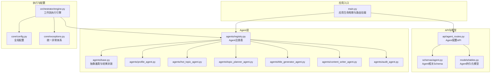
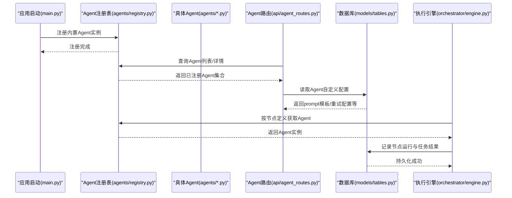
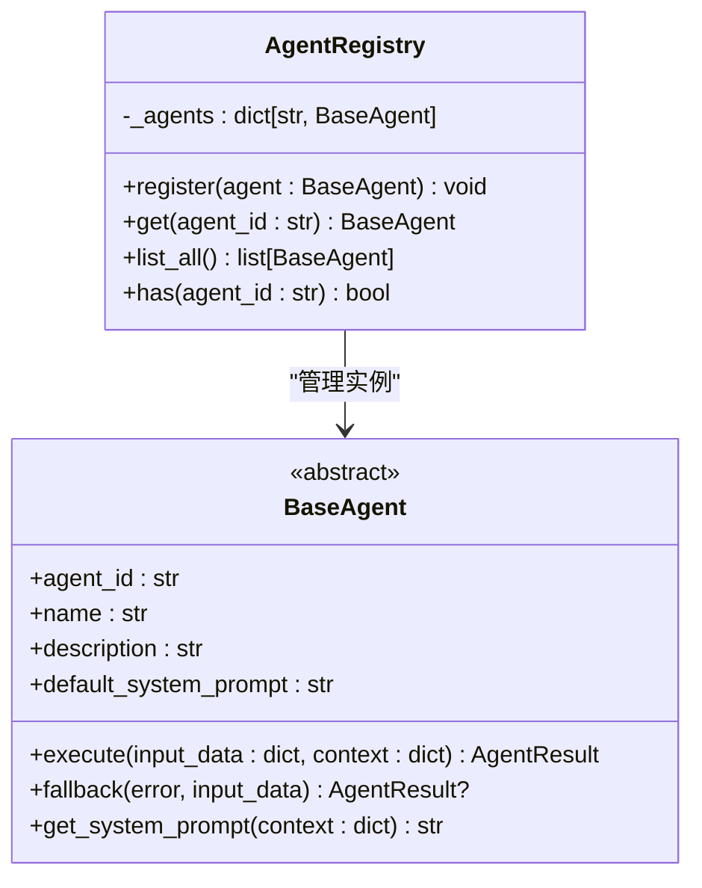
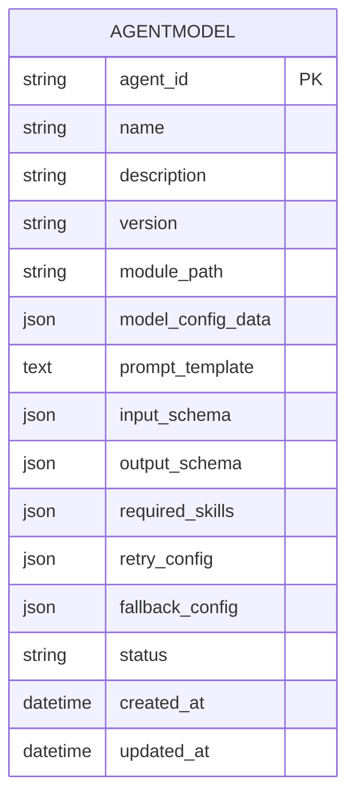
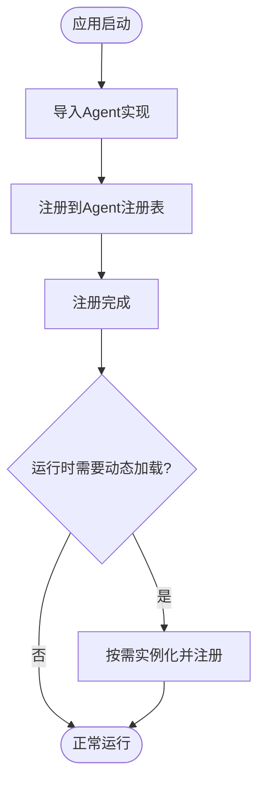
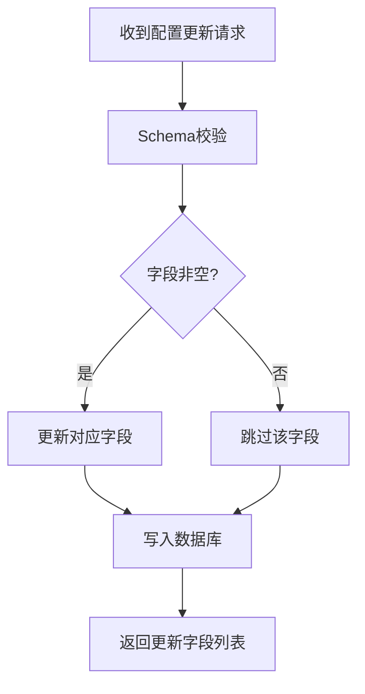
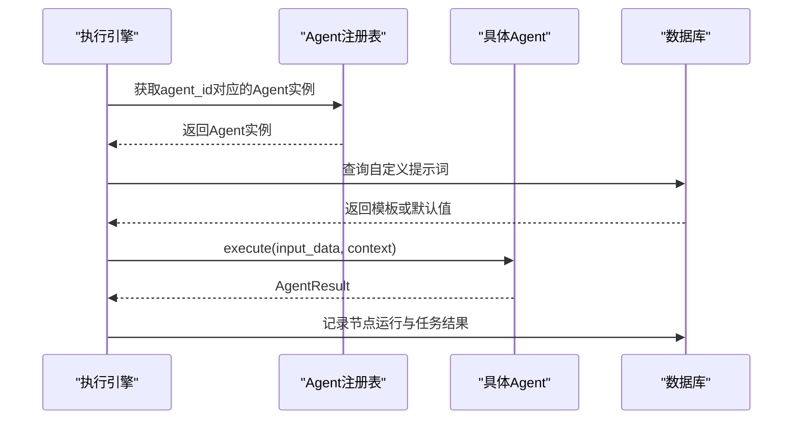
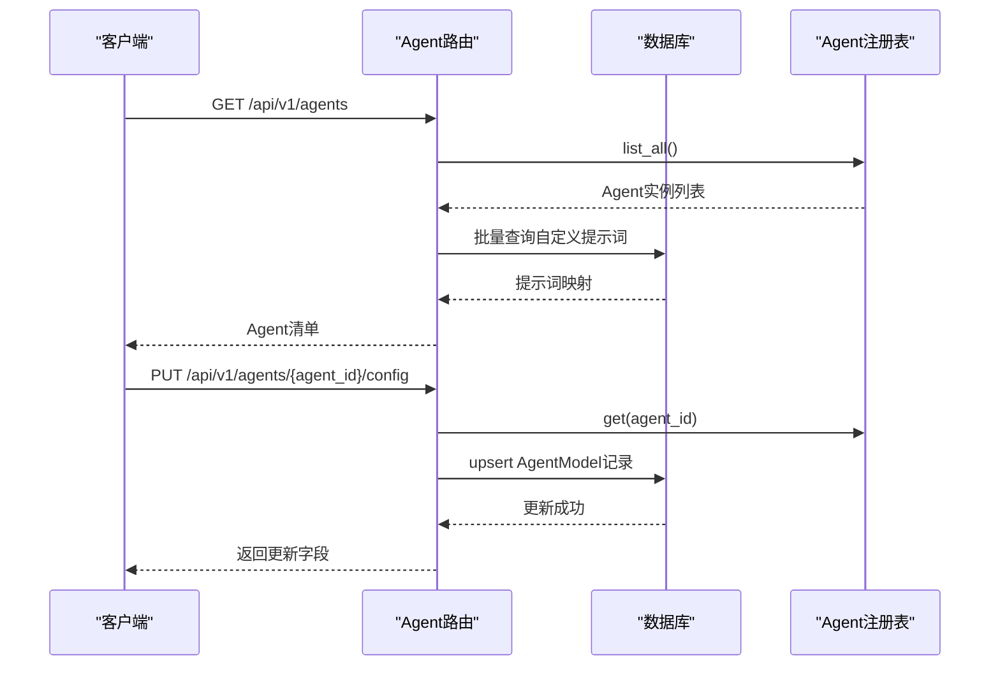
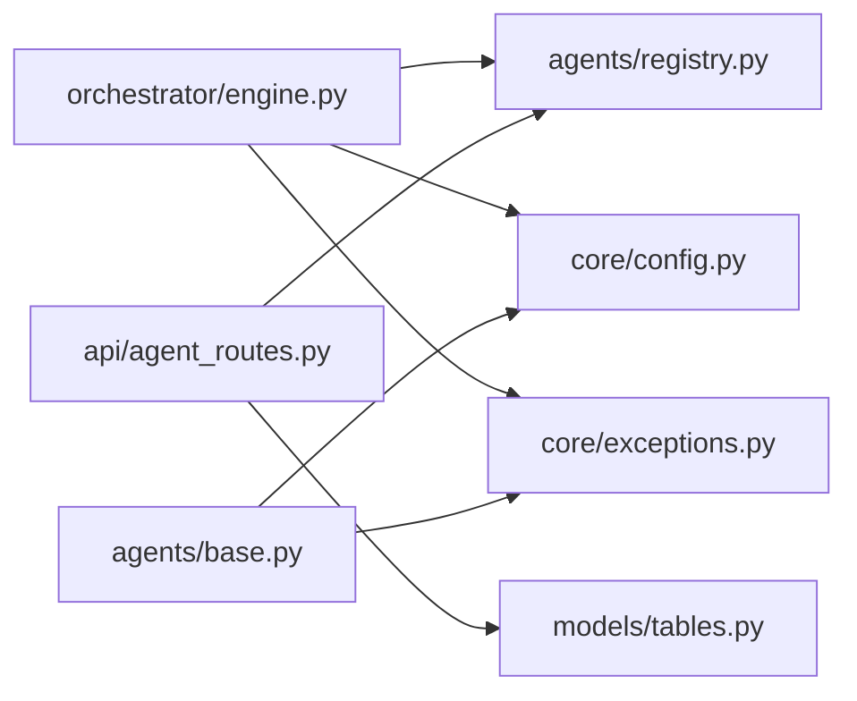

# Agent注册机制

<cite>
**本文引用的文件**
- [backend/app/main.py](file://backend/app/main.py)
- [backend/app/agents/registry.py](file://backend/app/agents/registry.py)
- [backend/app/agents/base.py](file://backend/app/agents/base.py)
- [backend/app/agents/profile_agent.py](file://backend/app/agents/profile_agent.py)
- [backend/app/agents/audit_agent.py](file://backend/app/agents/audit_agent.py)
- [backend/app/agents/content_writer_agent.py](file://backend/app/agents/content_writer_agent.py)
- [backend/app/agents/hot_topic_agent.py](file://backend/app/agents/hot_topic_agent.py)
- [backend/app/agents/topic_planner_agent.py](file://backend/app/agents/topic_planner_agent.py)
- [backend/app/agents/title_generator_agent.py](file://backend/app/agents/title_generator_agent.py)
- [backend/app/api/agent_routes.py](file://backend/app/api/agent_routes.py)
- [backend/app/schemas/agent.py](file://backend/app/schemas/agent.py)
- [backend/app/orchestrator/engine.py](file://backend/app/orchestrator/engine.py)
- [backend/app/models/tables.py](file://backend/app/models/tables.py)
- [backend/app/core/config.py](file://backend/app/core/config.py)
- [backend/app/core/exceptions.py](file://backend/app/core/exceptions.py)
</cite>

## 目录
1. [简介](#简介)
2. [项目结构](#项目结构)
3. [核心组件](#核心组件)
4. [架构总览](#架构总览)
5. [详细组件分析](#详细组件分析)
6. [依赖分析](#依赖分析)
7. [性能考量](#性能考量)
8. [故障排查指南](#故障排查指南)
9. [结论](#结论)
10. [附录](#附录)

## 简介
本文件面向开发者，系统性阐述HotClaw Agent注册系统的实现与使用方法。重点覆盖：
- Agent动态注册机制与注册表结构
- Agent元数据管理、版本控制与依赖解析
- 注册表初始化、运行时动态加载与热更新支持
- Agent配置验证、冲突检测与优先级管理
- 最佳实践、性能优化与安全注意事项
- 自定义Agent集成与调试技巧

## 项目结构
HotClaw后端采用模块化分层组织，Agent相关代码集中在backend/app/agents目录，配合API路由、模型定义、配置与异常体系共同构成完整的注册与执行链路。

图表来源
- [backend/app/main.py:34-42](file://backend/app/main.py#L34-L42)
- [backend/app/agents/registry.py:10-39](file://backend/app/agents/registry.py#L10-L39)
- [backend/app/api/agent_routes.py:14-115](file://backend/app/api/agent_routes.py#L14-L115)
- [backend/app/orchestrator/engine.py:89-285](file://backend/app/orchestrator/engine.py#L89-L285)

章节来源
- [backend/app/main.py:34-42](file://backend/app/main.py#L34-L42)
- [backend/app/agents/registry.py:10-39](file://backend/app/agents/registry.py#L10-L39)
- [backend/app/api/agent_routes.py:14-115](file://backend/app/api/agent_routes.py#L14-L115)
- [backend/app/orchestrator/engine.py:89-285](file://backend/app/orchestrator/engine.py#L89-L285)

## 核心组件
- Agent注册表：集中管理已注册的Agent实例，提供注册、查询、枚举与存在性检查能力。
- Agent抽象基类：定义统一的执行接口、系统提示词解析、标准化结果封装与降级策略。
- 具体Agent实现：围绕业务职责实现execute与可选的fallback，遵循统一的输入输出约定。
- 工作流执行引擎：按固定顺序调度Agent，注入上下文与系统提示词，记录节点执行日志与追踪ID。
- API路由与Schema：提供Agent清单查询、详情获取与配置更新接口；Schema约束请求/响应结构。
- 数据模型：持久化Agent元数据、配置与运行时节点执行记录。
- 配置与异常：统一的超时、LLM参数与异常映射，保障运行稳定性。

章节来源
- [backend/app/agents/registry.py:10-39](file://backend/app/agents/registry.py#L10-L39)
- [backend/app/agents/base.py:49-99](file://backend/app/agents/base.py#L49-L99)
- [backend/app/orchestrator/engine.py:89-285](file://backend/app/orchestrator/engine.py#L89-L285)
- [backend/app/api/agent_routes.py:14-115](file://backend/app/api/agent_routes.py#L14-L115)
- [backend/app/models/tables.py:160-181](file://backend/app/models/tables.py#L160-L181)
- [backend/app/core/config.py:52-99](file://backend/app/core/config.py#L52-L99)
- [backend/app/core/exceptions.py:4-125](file://backend/app/core/exceptions.py#L4-L125)

## 架构总览
下图展示从应用启动到工作流执行的关键交互路径，体现Agent注册、API访问与执行引擎之间的协作关系。

图表来源
- [backend/app/main.py:34-42](file://backend/app/main.py#L34-L42)
- [backend/app/agents/registry.py:16-32](file://backend/app/agents/registry.py#L16-L32)
- [backend/app/api/agent_routes.py:17-115](file://backend/app/api/agent_routes.py#L17-L115)
- [backend/app/orchestrator/engine.py:137-234](file://backend/app/orchestrator/engine.py#L137-L234)
- [backend/app/models/tables.py:160-181](file://backend/app/models/tables.py#L160-L181)

## 详细组件分析

### Agent注册表与动态注册机制
- 注册表结构：以agent_id为键存储BaseAgent实例，提供注册、查询、枚举与存在性检查。
- 动态注册：应用启动时导入各Agent实现并通过注册表集中注册，形成全局可用的Agent池。
- 冲突与幂等：重复注册会记录告警但不会覆盖已有实例，确保注册行为幂等。
- 运行时访问：API路由与执行引擎通过注册表按ID获取Agent，未找到时抛出统一异常。

图表来源
- [backend/app/agents/registry.py:10-39](file://backend/app/agents/registry.py#L10-L39)
- [backend/app/agents/base.py:49-99](file://backend/app/agents/base.py#L49-L99)

章节来源
- [backend/app/agents/registry.py:10-39](file://backend/app/agents/registry.py#L10-L39)
- [backend/app/main.py:34-42](file://backend/app/main.py#L34-L42)

### Agent元数据管理、版本控制与依赖解析
- 元数据Schema：AgentInfo定义了agent_id、name、description、version、status、prompt相关字段以及技能依赖等。
- 版本控制：模型层的AgentModel包含version字段，默认值为“1.0.0”，API路由中也以字符串形式返回版本信息。
- 依赖解析：AgentInfo包含required_skills字段，用于声明所需技能；实际依赖解析由技能注册表与工作流调度配合完成。
- 配置持久化：AgentModel支持持久化模型配置、提示词模板、输入/输出模式、重试与降级配置等。

图表来源
- [backend/app/models/tables.py:160-181](file://backend/app/models/tables.py#L160-L181)
- [backend/app/schemas/agent.py:6-18](file://backend/app/schemas/agent.py#L6-L18)

章节来源
- [backend/app/schemas/agent.py:6-18](file://backend/app/schemas/agent.py#L6-L18)
- [backend/app/models/tables.py:160-181](file://backend/app/models/tables.py#L160-L181)

### 注册表初始化、运行时动态加载与热更新支持
- 初始化：应用生命周期函数在启动阶段调用注册函数，批量注册内置Agent实例。
- 运行时动态加载：当前实现通过导入Agent类并在启动时注册；若需运行时动态加载，可在注册表上扩展按需实例化与注册的逻辑。
- 热更新支持：建议在注册表层引入“替换注册”能力（先注销旧实例再注册新实例），并配合前端/管理界面触发；注意事务一致性与正在执行任务的中断策略。

图表来源
- [backend/app/main.py:34-42](file://backend/app/main.py#L34-L42)
- [backend/app/agents/registry.py:16-21](file://backend/app/agents/registry.py#L16-L21)

章节来源
- [backend/app/main.py:34-42](file://backend/app/main.py#L34-L42)
- [backend/app/agents/registry.py:16-21](file://backend/app/agents/registry.py#L16-L21)

### Agent配置验证、冲突检测与优先级管理
- 配置验证：API路由对请求体进行Schema校验；更新配置时仅更新非空字段并持久化。
- 冲突检测：注册表对重复注册记录告警；API更新时若记录不存在则创建新记录，避免覆盖。
- 优先级管理：系统提示词解析优先使用数据库自定义模板，其次回退到Agent默认模板；节点执行失败时按required字段决定是否终止或降级。

图表来源
- [backend/app/api/agent_routes.py:74-115](file://backend/app/api/agent_routes.py#L74-L115)
- [backend/app/schemas/agent.py:24-29](file://backend/app/schemas/agent.py#L24-L29)

章节来源
- [backend/app/api/agent_routes.py:74-115](file://backend/app/api/agent_routes.py#L74-L115)
- [backend/app/orchestrator/engine.py:245-264](file://backend/app/orchestrator/engine.py#L245-L264)

### 执行引擎与Agent发现/加载流程
- 工作流节点：执行引擎维护固定顺序的节点定义，逐个节点拉取Agent实例、解析系统提示词、执行并记录结果。
- 上下文注入：将系统提示词注入到上下文中传递给Agent；支持超时控制与异常捕获。
- 降级与终止：Agent返回失败时尝试fallback；若节点为必需且无降级，则按required字段决定终止任务。

图表来源
- [backend/app/orchestrator/engine.py:137-234](file://backend/app/orchestrator/engine.py#L137-L234)
- [backend/app/agents/registry.py:23-28](file://backend/app/agents/registry.py#L23-L28)

章节来源
- [backend/app/orchestrator/engine.py:89-285](file://backend/app/orchestrator/engine.py#L89-L285)
- [backend/app/agents/registry.py:23-28](file://backend/app/agents/registry.py#L23-L28)

### API与配置更新流程
- 列表与详情：API提供Agent清单与单个Agent详情，详情中合并数据库中的自定义提示词与默认提示词。
- 配置更新：支持更新模型配置、提示词模板与重试配置；空字符串表示重置为默认。

图表来源
- [backend/app/api/agent_routes.py:17-115](file://backend/app/api/agent_routes.py#L17-L115)
- [backend/app/agents/registry.py:23-32](file://backend/app/agents/registry.py#L23-L32)

章节来源
- [backend/app/api/agent_routes.py:17-115](file://backend/app/api/agent_routes.py#L17-L115)

## 依赖分析
- 组件耦合：执行引擎强依赖注册表与配置；API路由依赖注册表与数据库；Agent实现依赖抽象基类与配置。
- 外部依赖：执行引擎依赖异步数据库会话与事件广播器；Agent实现依赖LLM调用库与HTTP客户端。
- 循环依赖：当前结构未见循环导入；注册表与API路由之间通过接口解耦。

图表来源
- [backend/app/orchestrator/engine.py:18-28](file://backend/app/orchestrator/engine.py#L18-L28)
- [backend/app/api/agent_routes.py:10-12](file://backend/app/api/agent_routes.py#L10-L12)
- [backend/app/agents/base.py:11-15](file://backend/app/agents/base.py#L11-L15)

章节来源
- [backend/app/orchestrator/engine.py:18-28](file://backend/app/orchestrator/engine.py#L18-L28)
- [backend/app/api/agent_routes.py:10-12](file://backend/app/api/agent_routes.py#L10-L12)
- [backend/app/agents/base.py:11-15](file://backend/app/agents/base.py#L11-L15)

## 性能考量
- 超时控制：全局设置Agent执行超时、技能执行超时与LLM调用超时，避免阻塞。
- 并发与限流：热点抓取Agent并发多引擎搜索，建议结合外部限速与重试策略。
- 日志与追踪：执行引擎记录节点耗时、令牌统计与任务完成事件，便于性能分析。
- 数据库批处理：API列出Agent时批量查询自定义提示词，减少多次往返。

章节来源
- [backend/app/core/config.py:79-82](file://backend/app/core/config.py#L79-L82)
- [backend/app/orchestrator/engine.py:236-281](file://backend/app/orchestrator/engine.py#L236-L281)
- [backend/app/api/agent_routes.py:22-43](file://backend/app/api/agent_routes.py#L22-L43)

## 故障排查指南
- Agent未找到：API查询或执行引擎获取Agent时抛出统一异常，检查agent_id是否正确与注册表是否包含该实例。
- 执行超时：调整全局Agent超时配置；检查LLM服务可用性与网络延迟。
- JSON解析失败：Agent内部对LLM返回内容进行JSON解析，失败时返回结构化错误；检查提示词模板与模型输出格式。
- 降级策略：Agent可提供fallback逻辑，必要时返回安全结果以保证流程继续。

章节来源
- [backend/app/core/exceptions.py:31-43](file://backend/app/core/exceptions.py#L31-L43)
- [backend/app/orchestrator/engine.py:154-176](file://backend/app/orchestrator/engine.py#L154-L176)
- [backend/app/agents/profile_agent.py:74-78](file://backend/app/agents/profile_agent.py#L74-L78)

## 结论
HotClaw的Agent注册系统以简洁的注册表为核心，结合统一的抽象基类与Schema约束，实现了可扩展、可观测且可配置的Agent执行框架。通过固定顺序的工作流与优先级提示词解析，系统在保证稳定性的同时提供了灵活的定制空间。建议在生产环境中进一步完善运行时动态加载与热更新机制，并强化配置变更的审计与回滚能力。

## 附录

### 开发者最佳实践
- 自定义Agent开发步骤
  - 继承抽象基类，设置agent_id、name、description与default_system_prompt。
  - 实现execute方法，严格遵循输入/输出约定；必要时实现fallback。
  - 在应用启动处注册新Agent实例。
  - 通过API更新自定义提示词与模型配置，避免硬编码。
- 配置验证与冲突检测
  - 使用Schema约束请求体；对空字符串进行“重置为默认”的语义处理。
  - 注册表重复注册仅告警，避免覆盖；更新时按需创建或更新记录。
- 优先级与降级
  - 提示词优先级：数据库自定义 > Agent默认。
  - 节点优先级：required=true时失败即终止，否则降级继续。
- 性能与安全
  - 合理设置超时与重试；对热点抓取添加限速与缓存。
  - 对敏感配置进行脱敏输出；避免在日志中泄露密钥。
- 调试技巧
  - 使用追踪ID串联任务与节点日志；开启调试模式查看详细错误。
  - 通过API列出Agent与获取详情快速定位配置问题。

章节来源
- [backend/app/agents/base.py:49-99](file://backend/app/agents/base.py#L49-L99)
- [backend/app/main.py:34-42](file://backend/app/main.py#L34-L42)
- [backend/app/api/agent_routes.py:74-115](file://backend/app/api/agent_routes.py#L74-L115)
- [backend/app/orchestrator/engine.py:245-264](file://backend/app/orchestrator/engine.py#L245-L264)
- [backend/app/core/config.py:79-99](file://backend/app/core/config.py#L79-L99)
- [backend/app/core/exceptions.py:79-91](file://backend/app/core/exceptions.py#L79-L91)