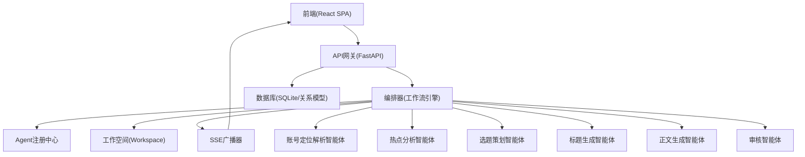
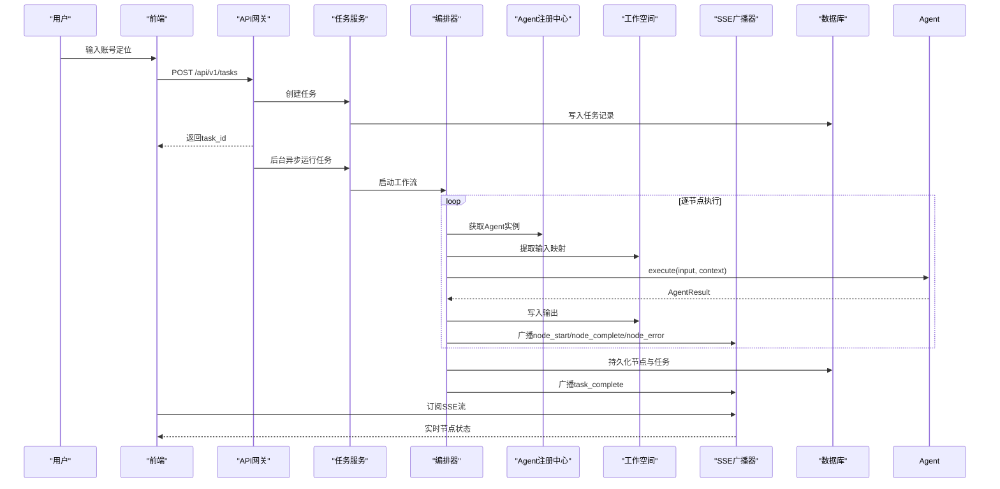
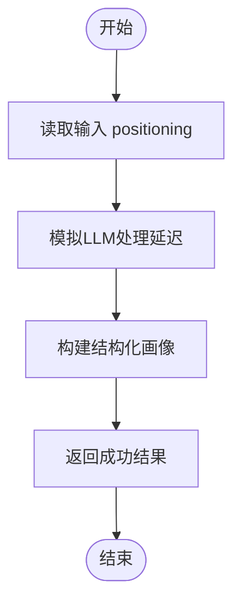
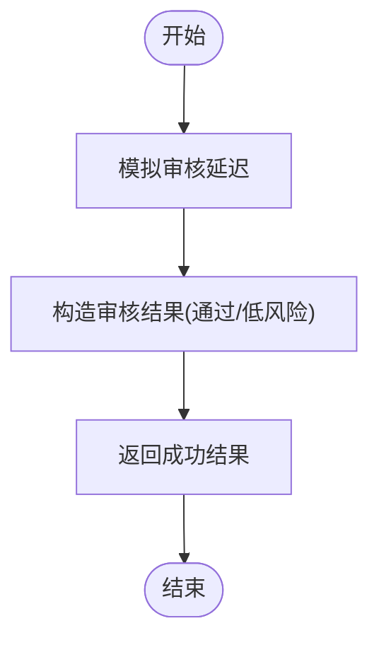
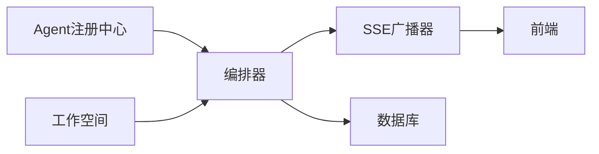

# 具体智能体实现

<cite>
**本文引用的文件**
- [backend/app/agents/base.py](file://backend/app/agents/base.py)
- [backend/app/agents/profile_agent.py](file://backend/app/agents/profile_agent.py)
- [backend/app/agents/audit_agent.py](file://backend/app/agents/audit_agent.py)
- [backend/app/agents/registry.py](file://backend/app/agents/registry.py)
- [backend/app/orchestrator/engine.py](file://backend/app/orchestrator/engine.py)
- [backend/app/orchestrator/workspace.py](file://backend/app/orchestrator/workspace.py)
- [backend/app/orchestrator/broadcaster.py](file://backend/app/orchestrator/broadcaster.py)
- [backend/app/models/tables.py](file://backend/app/models/tables.py)
- [backend/app/schemas/agent.py](file://backend/app/schemas/agent.py)
- [backend/app/schemas/task.py](file://backend/app/schemas/task.py)
- [backend/app/api/task_routes.py](file://backend/app/api/task_routes.py)
- [frontend/lib/api.ts](file://frontend/lib/api.ts)
- [frontend/hooks/useTaskSSE.ts](file://frontend/hooks/useTaskSSE.ts)
- [ARCHITECTURE.md](file://ARCHITECTURE.md)
</cite>

## 目录
1. [引言](#引言)
2. [项目结构](#项目结构)
3. [核心组件](#核心组件)
4. [架构总览](#架构总览)
5. [详细组件分析](#详细组件分析)
6. [依赖分析](#依赖分析)
7. [性能考量](#性能考量)
8. [故障排查指南](#故障排查指南)
9. [结论](#结论)
10. [附录](#附录)

## 引言
本文面向HotClaw“具体智能体实现”，围绕账号定位解析、热点分析、选题策划、标题生成、正文生成、审核六大智能体，系统阐述其功能特性、输入输出、执行逻辑、错误处理与降级策略，并给出智能体间协作模式、数据传递机制与状态同步方案。文档同时提供实际使用示例与性能优化建议，帮助开发者与运营人员快速理解与落地。

## 项目结构
HotClaw采用前后端分离架构，后端以FastAPI为核心，通过Orchestrator工作流引擎串联各Agent；前端通过SSE实时接收任务节点状态，完成可视化展示与交互。

图表来源
- [backend/app/orchestrator/engine.py:89-86](file://backend/app/orchestrator/engine.py#L89-L86)
- [backend/app/orchestrator/broadcaster.py:11-94](file://backend/app/orchestrator/broadcaster.py#L11-L94)
- [backend/app/orchestrator/workspace.py:12-53](file://backend/app/orchestrator/workspace.py#L12-L53)
- [backend/app/agents/registry.py:10-40](file://backend/app/agents/registry.py#L10-L40)
- [backend/app/models/tables.py:23-233](file://backend/app/models/tables.py#L23-L233)

章节来源
- [ARCHITECTURE.md:39-78](file://ARCHITECTURE.md#L39-L78)
- [backend/app/orchestrator/engine.py:31-86](file://backend/app/orchestrator/engine.py#L31-L86)
- [backend/app/orchestrator/broadcaster.py:11-94](file://backend/app/orchestrator/broadcaster.py#L11-L94)
- [backend/app/orchestrator/workspace.py:12-53](file://backend/app/orchestrator/workspace.py#L12-L53)
- [backend/app/agents/registry.py:10-40](file://backend/app/agents/registry.py#L10-L40)
- [backend/app/models/tables.py:23-233](file://backend/app/models/tables.py#L23-L233)

## 核心组件
- Agent基类与结果封装：提供统一的执行接口、降级回调、结构化结果封装与成功/失败状态判定。
- Agent注册中心：集中注册与检索Agent实例，避免硬编码耦合。
- 工作流引擎：按默认线性链路顺序调度Agent，管理Workspace上下文、节点运行记录与SSE广播。
- 工作空间：任务级上下文容器，支持字段映射提取与快照持久化。
- SSE广播器：维护每任务的事件队列与历史缓冲，支持晚到订阅与关闭清理。
- 数据模型：任务、节点运行、账号画像、话题候选、文章草稿、审核结果等核心实体。
- 前后端API与Schema：后端提供任务创建、状态查询、节点明细、SSE流；前端提供API客户端与SSE订阅Hook。

章节来源
- [backend/app/agents/base.py:18-99](file://backend/app/agents/base.py#L18-L99)
- [backend/app/agents/registry.py:10-40](file://backend/app/agents/registry.py#L10-L40)
- [backend/app/orchestrator/engine.py:89-285](file://backend/app/orchestrator/engine.py#L89-L285)
- [backend/app/orchestrator/workspace.py:12-53](file://backend/app/orchestrator/workspace.py#L12-L53)
- [backend/app/orchestrator/broadcaster.py:11-94](file://backend/app/orchestrator/broadcaster.py#L11-L94)
- [backend/app/models/tables.py:23-233](file://backend/app/models/tables.py#L23-L233)
- [backend/app/schemas/agent.py:6-29](file://backend/app/schemas/agent.py#L6-L29)
- [backend/app/schemas/task.py:10-83](file://backend/app/schemas/task.py#L10-L83)
- [frontend/lib/api.ts:14-110](file://frontend/lib/api.ts#L14-L110)
- [frontend/hooks/useTaskSSE.ts:28-124](file://frontend/hooks/useTaskSSE.ts#L28-L124)

## 架构总览
HotClaw的MVP最小闭环为：用户输入账号定位 → 账号解析 → 热点分析 → 选题策划 → 标题生成 → 正文生成 → 审核 → 草稿输出。工作流为线性链，节点间通过Workspace共享数据，Orchestrator负责调度、记录与广播。

图表来源
- [backend/app/api/task_routes.py:19-51](file://backend/app/api/task_routes.py#L19-L51)
- [backend/app/orchestrator/engine.py:92-234](file://backend/app/orchestrator/engine.py#L92-L234)
- [backend/app/orchestrator/broadcaster.py:57-80](file://backend/app/orchestrator/broadcaster.py#L57-L80)
- [backend/app/models/tables.py:23-46](file://backend/app/models/tables.py#L23-L46)

章节来源
- [ARCHITECTURE.md:148-155](file://ARCHITECTURE.md#L148-L155)
- [backend/app/orchestrator/engine.py:31-86](file://backend/app/orchestrator/engine.py#L31-L86)
- [backend/app/orchestrator/broadcaster.py:11-94](file://backend/app/orchestrator/broadcaster.py#L11-L94)
- [backend/app/api/task_routes.py:19-51](file://backend/app/api/task_routes.py#L19-L51)

## 详细组件分析

### 账号定位解析智能体
- 角色与职责：将用户输入的账号定位描述解析为结构化画像，供后续节点使用。
- 输入
  - positioning: string（必填，长度限制见任务Schema）
- 输出
  - domain: string（主领域）
  - subdomain: string（细分领域）
  - target_audience: object（年龄范围、职业、兴趣标签）
  - tone: string（内容调性）
  - content_style: string（内容风格）
  - keywords: string[]（核心关键词）
  - positioning_raw: string（原始输入）
- 执行逻辑
  - 模拟LLM处理延迟后返回固定Mock数据，便于MVP验证链路。
- 错误处理与降级
  - fallback返回通用画像（泛资讯、18-45、中性调性等），确保后续节点可继续执行。
- 性能与稳定性
  - 当前为Mock实现，建议后续接入真实LLM并增加缓存与重试策略。

图表来源
- [backend/app/agents/profile_agent.py:42-61](file://backend/app/agents/profile_agent.py#L42-L61)

章节来源
- [backend/app/agents/profile_agent.py:10-73](file://backend/app/agents/profile_agent.py#L10-L73)
- [backend/app/schemas/task.py:10-22](file://backend/app/schemas/task.py#L10-L22)

### 热点分析智能体（待实现）
- 角色与职责：基于账号画像抓取并分析热点，输出热点列表。
- 输入
  - profile: object（来自Workspace的账号画像）
- 输出
  - hot_topics: array（标题、来源、热度、摘要、链接、相关度等）
- 执行逻辑
  - 依赖新闻抓取Skill与LLM进行分析（MVP阶段可先实现Mock）。
- 错误处理与降级
  - Skill失败时使用缓存热点；LLM失败时返回原始抓取结果。
- 性能与稳定性
  - 建议引入缓存与并发抓取，设置超时与重试。

章节来源
- [ARCHITECTURE.md:578-588](file://ARCHITECTURE.md#L578-L588)

### 选题策划智能体（待实现）
- 角色与职责：结合账号画像与热点生成候选选题。
- 输入
  - profile: object
  - hot_topics: array
- 输出
  - topics: array（标题、角度、钩子、目标情绪、吸引力评分、理由等）
- 执行逻辑
  - 基于热点与画像生成候选选题（MVP可直接复用热点标题）。
- 错误处理与降级
  - 直接使用热点标题作为选题，不做深度策划。
- 性能与稳定性
  - 保持轻量LLM调用，必要时缓存热点与画像。

章节来源
- [ARCHITECTURE.md:589-599](file://ARCHITECTURE.md#L589-L599)

### 标题生成智能体（待实现）
- 角色与职责：针对选定选题生成候选标题。
- 输入
  - profile: object
  - topics: array（当前链路仅使用单个选题）
- 输出
  - titles: array（标题文本、风格、评分、理由等）
- 执行逻辑
  - 依赖标题评分Skill进行打分（MVP可先实现Mock）。
- 错误处理与降级
  - 评分失败时跳过评分，仅输出标题文本。
- 性能与稳定性
  - 控制并发与Token上限，避免长文本导致超时。

章节来源
- [ARCHITECTURE.md:600-610](file://ARCHITECTURE.md#L600-L610)

### 正文生成智能体（待实现）
- 角色与职责：根据选题、标题与热点生成正文草稿。
- 输入
  - profile: object
  - topics: array
  - titles: array
  - hot_topics: array
- 输出
  - content_markdown: string
  - word_count: number
  - structure: object（章节结构）
  - tags: string[]
- 执行逻辑
  - 依赖摘要Skill压缩素材（MVP可先实现Mock）。
- 错误处理与降级
  - 摘要失败时直接使用原始素材；LLM失败时返回空文章并标记失败。
- 性能与稳定性
  - 限制上下文长度，拆分长文生成，启用缓存。

章节来源
- [ARCHITECTURE.md:611-621](file://ARCHITECTURE.md#L611-L621)

### 审核智能体
- 角色与职责：对生成的标题与正文进行合规性与风险评估。
- 输入
  - titles: array（候选标题）
  - content: object（正文数据）
  - profile: object（账号画像）
- 输出
  - passed: boolean（是否通过）
  - risk_level: string（低/中/高）
  - issues: array（问题类型、描述、严重程度、位置）
  - overall_comment: string（综合评价）
- 执行逻辑
  - 模拟审核流程，返回通过与低风险结论（MVP阶段）。
- 错误处理与降级
  - fallback返回“系统异常，请人工复核”的降级结果，保证流程继续。
- 性能与稳定性
  - 保持短时处理；若接入外部检测，需设置超时与熔断。

图表来源
- [backend/app/agents/audit_agent.py:48-57](file://backend/app/agents/audit_agent.py#L48-L57)

章节来源
- [backend/app/agents/audit_agent.py:7-66](file://backend/app/agents/audit_agent.py#L7-L66)

## 依赖分析
- Agent注册中心与工作流引擎
  - Orchestrator通过AgentRegistry按agent_id获取实例，按默认节点顺序执行。
- 工作空间与数据映射
  - Workspace提供extract_for_agent方法，将上一节点输出映射到当前Agent输入字段。
- SSE广播与前端订阅
  - Orchestrator在节点开始/完成/失败时广播事件；前端通过SSE订阅实时更新UI。
- 数据模型与持久化
  - 任务、节点运行、账号画像、话题候选、文章草稿、审核结果均持久化至数据库。

图表来源
- [backend/app/agents/registry.py:23-28](file://backend/app/agents/registry.py#L23-L28)
- [backend/app/orchestrator/engine.py:138-147](file://backend/app/orchestrator/engine.py#L138-L147)
- [backend/app/orchestrator/workspace.py:36-52](file://backend/app/orchestrator/workspace.py#L36-L52)
- [backend/app/orchestrator/broadcaster.py:57-68](file://backend/app/orchestrator/broadcaster.py#L57-L68)
- [backend/app/models/tables.py:23-46](file://backend/app/models/tables.py#L23-L46)

章节来源
- [backend/app/agents/registry.py:10-40](file://backend/app/agents/registry.py#L10-L40)
- [backend/app/orchestrator/engine.py:138-147](file://backend/app/orchestrator/engine.py#L138-L147)
- [backend/app/orchestrator/workspace.py:36-52](file://backend/app/orchestrator/workspace.py#L36-L52)
- [backend/app/orchestrator/broadcaster.py:57-68](file://backend/app/orchestrator/broadcaster.py#L57-L68)
- [backend/app/models/tables.py:23-46](file://backend/app/models/tables.py#L23-L46)

## 性能考量
- 节点超时与重试
  - Orchestrator为每个Agent执行设置超时，超时即失败并触发降级或中断（required节点）。
- Token统计与成本控制
  - 节点运行记录中累计prompt_tokens与completion_tokens，便于成本与性能分析。
- SSE事件缓冲
  - 广播器为每个任务维护事件历史，解决前端晚到订阅问题，但需定期清理避免内存泄漏。
- Mock到真实实现迁移
  - Profile与Audit为Mock实现，建议逐步接入真实LLM与外部检测服务，并增加缓存、限流与熔断策略。
- 前端渲染与交互
  - 使用SSE实时更新节点状态，减少轮询开销；合理截断输出摘要，避免UI卡顿。

章节来源
- [backend/app/orchestrator/engine.py:236-244](file://backend/app/orchestrator/engine.py#L236-L244)
- [backend/app/orchestrator/engine.py:211-216](file://backend/app/orchestrator/engine.py#L211-L216)
- [backend/app/orchestrator/broadcaster.py:78-85](file://backend/app/orchestrator/broadcaster.py#L78-L85)
- [backend/app/agents/profile_agent.py:45-46](file://backend/app/agents/profile_agent.py#L45-L46)
- [backend/app/agents/audit_agent.py:49-49](file://backend/app/agents/audit_agent.py#L49-L49)

## 故障排查指南
- 节点失败
  - 若Agent返回失败，Orchestrator尝试fallback；若fallback成功则写入降级输出并标记degraded；若required节点失败则中断并记录错误。
- 超时
  - 超时会记录错误并按required策略决定是否终止；可通过调整settings.agent_timeout缓解。
- 审核异常
  - Audit fallback返回“系统异常，请人工复核”，前端可据此提示人工干预。
- 前端无事件
  - 检查SSE连接URL与订阅逻辑；确认后端广播器未提前关闭任务流。
- 数据不一致
  - 核对Workspace输入映射与Schema定义，确保字段名与路径一致。

章节来源
- [backend/app/orchestrator/engine.py:154-175](file://backend/app/orchestrator/engine.py#L154-L175)
- [backend/app/orchestrator/engine.py:176-197](file://backend/app/orchestrator/engine.py#L176-L197)
- [backend/app/agents/audit_agent.py:59-66](file://backend/app/agents/audit_agent.py#L59-L66)
- [frontend/hooks/useTaskSSE.ts:58-120](file://frontend/hooks/useTaskSSE.ts#L58-L120)

## 结论
HotClaw通过“工作流引擎 + Agent注册中心 + 工作空间 + SSE广播”的组合，实现了从账号定位到文章草稿的MVP全链路。当前Profile与Audit为Mock实现，其余智能体与Skill处于待实现阶段。建议尽快补齐热点抓取、选题策划、标题评分、正文摘要与风险检测等能力，并在Mock与真实实现之间建立平滑过渡，持续优化性能与稳定性。

## 附录

### 智能体协作模式与数据传递
- 协作模式
  - 线性链式协作：前一节点输出作为下一节点输入，Workspace贯穿始终。
- 数据传递机制
  - input_mapping将上层输出映射到当前Agent输入字段；Workspace键值对实现跨节点共享。
- 状态同步方案
  - 节点开始/完成/失败事件通过SSE广播，前端即时渲染；任务完成后关闭流并清理历史。

章节来源
- [backend/app/orchestrator/engine.py:134-147](file://backend/app/orchestrator/engine.py#L134-L147)
- [backend/app/orchestrator/workspace.py:36-52](file://backend/app/orchestrator/workspace.py#L36-L52)
- [backend/app/orchestrator/broadcaster.py:57-80](file://backend/app/orchestrator/broadcaster.py#L57-L80)

### 实际使用示例
- 创建任务
  - 前端调用POST /api/v1/tasks，传入positioning字段，获得task_id。
- 实时监控
  - 前端通过GET /api/v1/tasks/{task_id}/stream订阅SSE，监听node_start/node_complete/node_error/task_complete事件。
- 查询详情
  - GET /api/v1/tasks/{task_id}获取任务结果；GET /api/v1/tasks/{task_id}/nodes获取节点明细。

章节来源
- [frontend/lib/api.ts:26-50](file://frontend/lib/api.ts#L26-L50)
- [frontend/hooks/useTaskSSE.ts:58-120](file://frontend/hooks/useTaskSSE.ts#L58-L120)
- [backend/app/api/task_routes.py:19-51](file://backend/app/api/task_routes.py#L19-L51)
- [backend/app/api/task_routes.py:90-134](file://backend/app/api/task_routes.py#L90-L134)