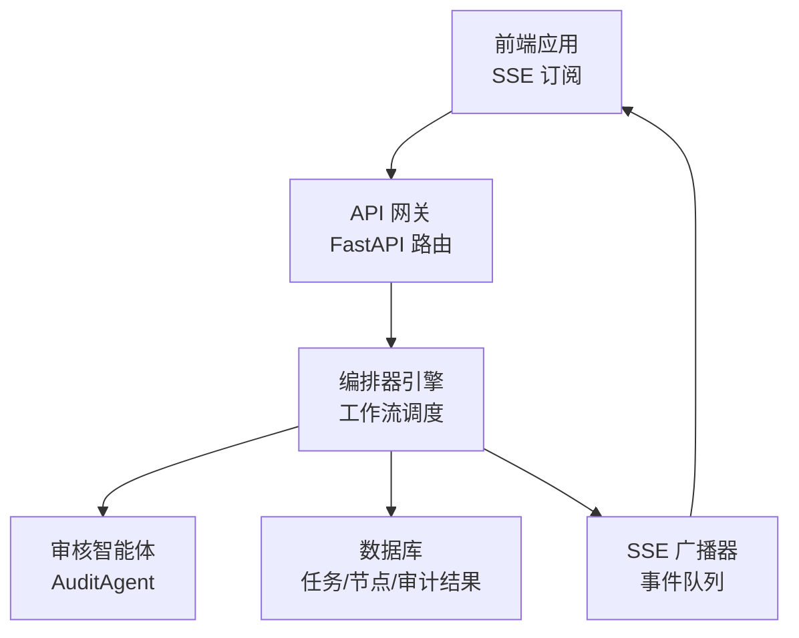
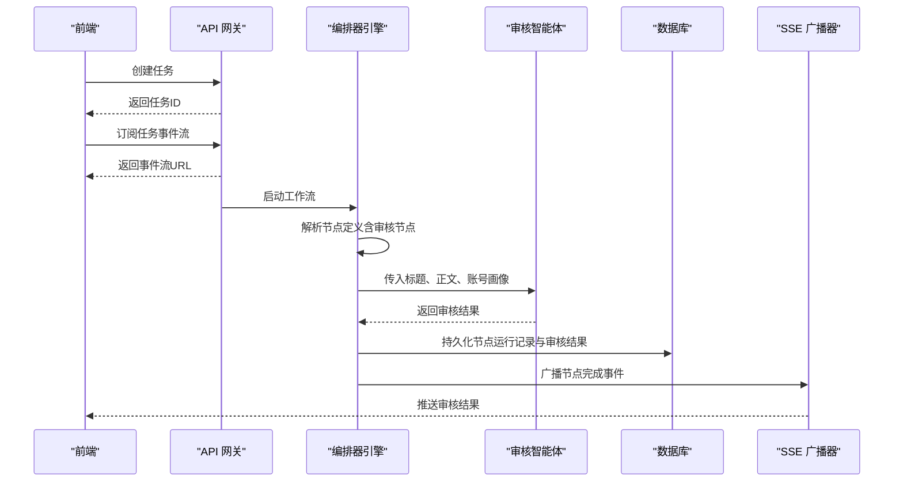
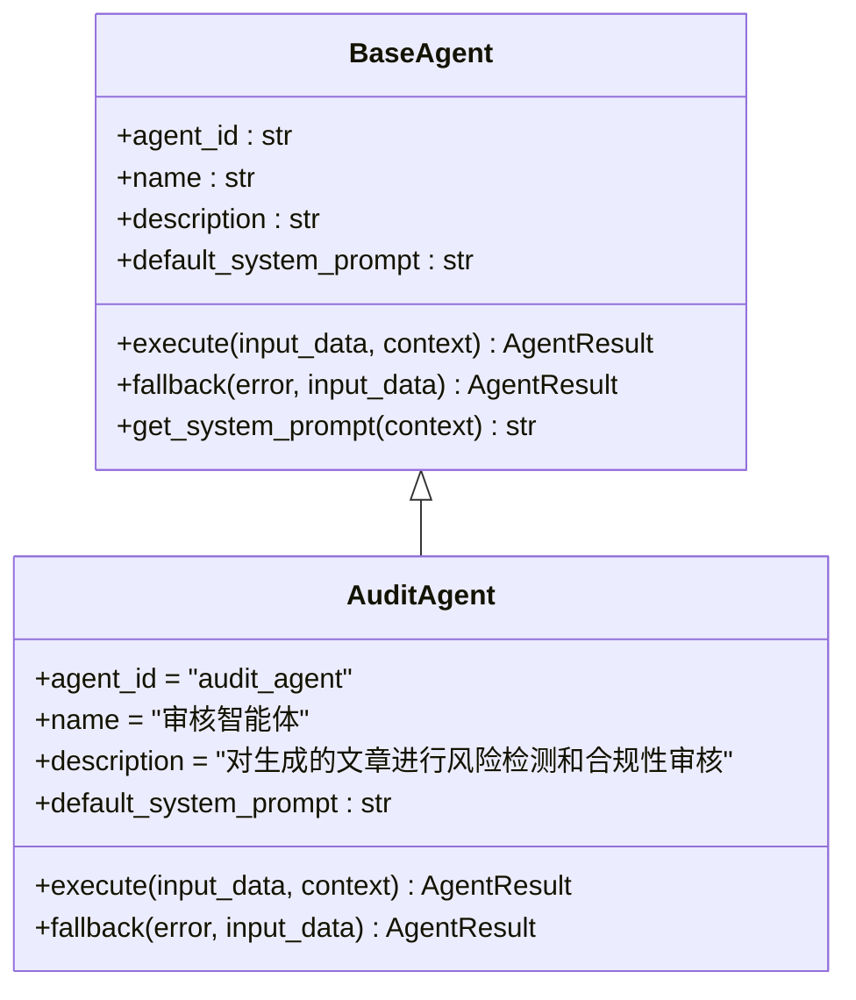
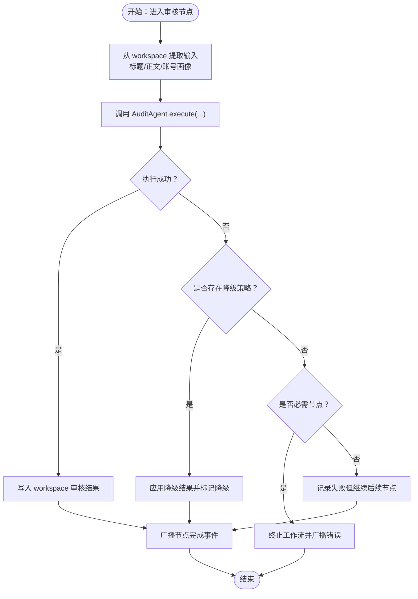
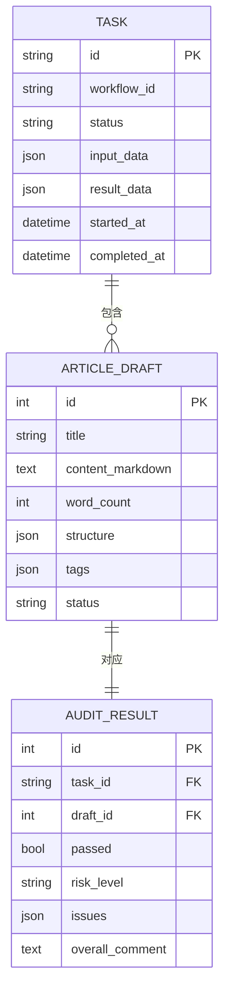
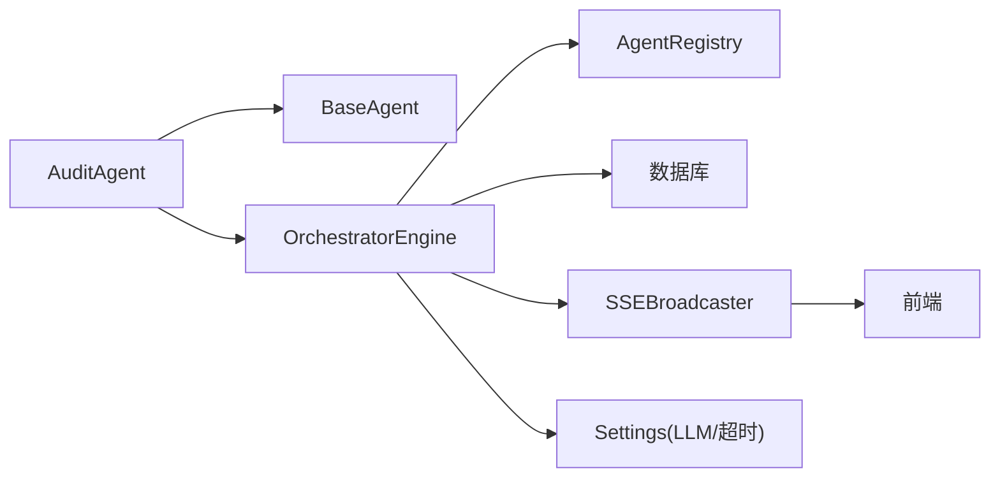

# 内容审核智能体

<cite>
**本文引用的文件**
- [audit_agent.py](file://backend/app/agents/audit_agent.py)
- [base.py](file://backend/app/agents/base.py)
- [engine.py](file://backend/app/orchestrator/engine.py)
- [broadcaster.py](file://backend/app/orchestrator/broadcaster.py)
- [task_service.py](file://backend/app/services/task_service.py)
- [tables.py](file://backend/app/models/tables.py)
- [agent_routes.py](file://backend/app/api/agent_routes.py)
- [main.py](file://backend/app/main.py)
- [config.py](file://backend/app/core/config.py)
- [ARCHITECTURE.md](file://ARCHITECTURE.md)
- [api.ts](file://frontend/lib/api.ts)
</cite>

## 目录
1. [简介](#简介)
2. [项目结构](#项目结构)
3. [核心组件](#核心组件)
4. [架构总览](#架构总览)
5. [详细组件分析](#详细组件分析)
6. [依赖分析](#依赖分析)
7. [性能考量](#性能考量)
8. [故障排查指南](#故障排查指南)
9. [结论](#结论)
10. [附录](#附录)

## 简介
本文件面向“内容审核智能体”，系统性阐述其在内容生产流水线中的质量控制职责，包括合规性检查、敏感信息检测、风险评估与质量评分机制。文档覆盖审核标准体系、评分算法与决策逻辑，说明与其他智能体的协作关系、审核结果的传递方式与异常处理策略，并提供审核规则配置示例与自定义审核策略的方法，以及性能优化与准确性提升的最佳实践。

## 项目结构
后端采用 FastAPI + SQLAlchemy + asyncio 的异步架构，内容审核智能体作为工作流中的一个节点，位于“正文生成”之后、“草稿输出”之前，负责对生成的文章进行合规性与风险评估。前端通过 SSE 实时接收审核节点状态与结果。

图表来源
- [main.py:32-40](file://backend/app/main.py#L32-L40)
- [engine.py:92-234](file://backend/app/orchestrator/engine.py#L92-L234)
- [broadcaster.py:11-94](file://backend/app/orchestrator/broadcaster.py#L11-L94)
- [tables.py:23-157](file://backend/app/models/tables.py#L23-L157)

章节来源
- [main.py:1-142](file://backend/app/main.py#L1-L142)
- [ARCHITECTURE.md:37-78](file://ARCHITECTURE.md#L37-L78)

## 核心组件
- 审核智能体（AuditAgent）
  - 职责：对生成的文章标题与正文进行合规性审核与风险评估，输出通过/不通过、风险等级、问题列表与综合评价。
  - 输入：标题候选、正文内容、账号画像。
  - 输出：结构化 JSON，包含通过标志、风险等级、问题数组、综合评论。
- 工作流编排器（OrchestratorEngine）
  - 职责：按节点顺序调度智能体，管理上下文（workspace），记录节点执行日志，支持异常降级与广播事件。
- SSE 广播器（SSEBroadcaster）
  - 职责：维护每个任务的事件队列，支持事件回放与订阅/取消订阅，向前端推送节点状态与结果。
- 任务服务（TaskService）
  - 职责：创建任务、启动工作流、查询任务与节点运行记录，处理任务失败与异常广播。
- 数据模型（AuditResultModel）
  - 职责：持久化审核结果，包含通过标志、风险等级、问题明细与总体评论。
- Agent 配置 API
  - 职责：提供查看/更新智能体配置的能力，支持自定义 prompt、模型参数与重试策略。

章节来源
- [audit_agent.py:7-66](file://backend/app/agents/audit_agent.py#L7-L66)
- [engine.py:89-234](file://backend/app/orchestrator/engine.py#L89-L234)
- [broadcaster.py:11-94](file://backend/app/orchestrator/broadcaster.py#L11-L94)
- [task_service.py:20-126](file://backend/app/services/task_service.py#L20-L126)
- [tables.py:141-157](file://backend/app/models/tables.py#L141-L157)
- [agent_routes.py:17-115](file://backend/app/api/agent_routes.py#L17-L115)

## 架构总览
审核智能体在默认工作流中作为“审核评估”节点存在，输入来自上一节点（正文生成）输出的标题与正文，结合账号画像进行综合评估。编排器负责将输入映射到智能体，捕获执行结果并写入 workspace，同时持久化节点运行记录与审核结果。前端通过 SSE 实时接收节点开始、完成与错误事件，最终展示审核结果。

图表来源
- [engine.py:79-85](file://backend/app/orchestrator/engine.py#L79-L85)
- [engine.py:137-197](file://backend/app/orchestrator/engine.py#L137-L197)
- [engine.py:200-234](file://backend/app/orchestrator/engine.py#L200-L234)
- [broadcaster.py:57-68](file://backend/app/orchestrator/broadcaster.py#L57-L68)
- [tables.py:141-157](file://backend/app/models/tables.py#L141-L157)

章节来源
- [engine.py:31-86](file://backend/app/orchestrator/engine.py#L31-L86)
- [ARCHITECTURE.md:148-154](file://ARCHITECTURE.md#L148-L154)

## 详细组件分析

### 审核智能体（AuditAgent）
- 角色与职责
  - 作为工作流中的“审核评估”节点，负责对生成内容进行合规性检查与风险评估。
  - 输出结构化 JSON，包含通过标志、风险等级、问题列表与综合评价。
- 输入与输出
  - 输入：标题候选、正文内容、账号画像。
  - 输出：通过标志、风险等级、问题数组（含类型、描述、严重程度、位置）、总体评论。
- 审核维度与约束
  - 敏感词检测、事实核查、夸大宣传、标题党程度、调性匹配、内容质量。
  - 约束：问题数组为空时通过标志为真；存在高风险问题时必须不通过；风险等级取最高严重程度。
- 执行与降级
  - 执行过程模拟延迟；成功时返回默认通过的结构化结果；失败时触发降级策略，返回“服务异常，请人工复核”的提示并标记降级。

图表来源
- [base.py:49-99](file://backend/app/agents/base.py#L49-L99)
- [audit_agent.py:7-66](file://backend/app/agents/audit_agent.py#L7-L66)

章节来源
- [audit_agent.py:12-46](file://backend/app/agents/audit_agent.py#L12-L46)
- [audit_agent.py:48-66](file://backend/app/agents/audit_agent.py#L48-L66)

### 工作流编排与上下文传递
- 节点定义
  - “审核评估”节点在默认工作流中定义，输入映射包含标题、正文与账号画像，输出键为审核结果。
- 上下文提取与传递
  - 编排器从 workspace 中提取当前节点所需的输入，注入系统 prompt（可自定义），然后调用智能体执行。
- 异常与降级
  - 若智能体执行失败且具备降级策略，则写入降级结果并标记节点降级；若节点为必需节点且无降级，则中断工作流并广播错误事件。
- 事件广播
  - 节点完成后广播“节点完成”事件，包含输出摘要；任务完成后广播“任务完成”事件。

图表来源
- [engine.py:137-197](file://backend/app/orchestrator/engine.py#L137-L197)
- [engine.py:200-234](file://backend/app/orchestrator/engine.py#L200-L234)

章节来源
- [engine.py:31-86](file://backend/app/orchestrator/engine.py#L31-L86)
- [engine.py:137-197](file://backend/app/orchestrator/engine.py#L137-L197)

### 审核结果持久化与前端展示
- 数据模型
  - 审核结果模型包含通过标志、风险等级、问题数组与总体评论，与文章草稿关联。
- 任务结果
  - 任务完成时，结果数据包含审核结果；前端可通过任务详情接口获取。
- 实时事件
  - SSE 广播器维护事件队列，支持事件回放；前端通过 EventSource 订阅任务事件流，实时接收节点状态与结果。

图表来源
- [tables.py:23-46](file://backend/app/models/tables.py#L23-L46)
- [tables.py:119-139](file://backend/app/models/tables.py#L119-L139)
- [tables.py:141-157](file://backend/app/models/tables.py#L141-L157)

章节来源
- [tables.py:141-157](file://backend/app/models/tables.py#L141-L157)
- [broadcaster.py:57-68](file://backend/app/orchestrator/broadcaster.py#L57-L68)
- [api.ts:48-50](file://frontend/lib/api.ts#L48-L50)

### 审核规则配置与自定义策略
- 自定义系统 prompt
  - 通过 Agent 配置 API 获取与更新智能体配置，支持设置自定义 prompt 模板；系统会优先使用数据库中的自定义 prompt。
- 模型与重试策略
  - 可通过配置 API 更新模型参数与重试策略，从而影响审核智能体的执行行为与稳定性。
- 自定义审核策略
  - 通过扩展 AuditAgent 的 execute 与 fallback 方法，或在数据库中保存自定义 prompt，实现更精细的审核策略与阈值调整。

章节来源
- [agent_routes.py:46-115](file://backend/app/api/agent_routes.py#L46-L115)
- [engine.py:245-263](file://backend/app/orchestrator/engine.py#L245-L263)

## 依赖分析
- 组件耦合
  - AuditAgent 依赖 BaseAgent 的统一接口与 AgentResult 结构化输出；编排器通过注册表获取智能体实例并调度执行。
  - 编排器依赖数据库持久化节点运行记录与任务状态，依赖 SSE 广播器进行事件推送。
- 外部依赖
  - LLM API：审核智能体的系统 prompt 与执行依赖 LLM；可通过配置切换模型与基础地址。
  - Redis：用于事件缓冲与历史事件回放（在 SSE 广播器中体现）。
- 循环依赖
  - 未发现循环依赖；模块职责清晰，Agent 与编排器通过接口解耦。

图表来源
- [audit_agent.py:4-5](file://backend/app/agents/audit_agent.py#L4-L5)
- [engine.py:18-26](file://backend/app/orchestrator/engine.py#L18-L26)
- [config.py:7-51](file://backend/app/core/config.py#L7-L51)

章节来源
- [engine.py:18-26](file://backend/app/orchestrator/engine.py#L18-L26)
- [config.py:7-51](file://backend/app/core/config.py#L7-L51)

## 性能考量
- 超时与降级
  - 审核智能体执行受全局超时限制；失败时通过降级策略保证工作流继续推进，避免阻塞。
- 事件广播与内存管理
  - SSE 广播器对历史事件进行缓冲与回放，任务结束后定时清理历史以避免内存泄漏。
- Token 与耗时统计
  - 编排器在节点完成后计算耗时与 token 消耗，便于性能分析与成本控制。
- 最佳实践
  - 合理设置 agent_timeout 与 llm_timeout，平衡吞吐与稳定性。
  - 将审核逻辑尽量结构化，减少 LLM 生成长度，提高响应速度。
  - 使用数据库自定义 prompt 与重试策略，降低失败率与重试开销。

章节来源
- [engine.py:236-243](file://backend/app/orchestrator/engine.py#L236-L243)
- [broadcaster.py:78-84](file://backend/app/orchestrator/broadcaster.py#L78-L84)
- [engine.py:211-216](file://backend/app/orchestrator/engine.py#L211-L216)
- [config.py:42-46](file://backend/app/core/config.py#L42-L46)

## 故障排查指南
- 审核节点失败
  - 现象：节点状态为失败，错误信息记录在节点运行记录中。
  - 处理：检查智能体 fallback 策略是否生效；确认数据库中是否存在自定义 prompt；必要时重试或人工复核。
- 事件未到达前端
  - 现象：前端未收到审核完成事件。
  - 处理：确认 SSE 广播器订阅队列与历史事件缓冲；检查任务事件流 URL 与连接状态。
- 任务状态异常
  - 现象：任务长时间处于运行中或失败。
  - 处理：通过任务服务查询任务与节点运行记录，定位失败节点并查看错误信息。

章节来源
- [engine.py:176-196](file://backend/app/orchestrator/engine.py#L176-L196)
- [broadcaster.py:30-45](file://backend/app/orchestrator/broadcaster.py#L30-L45)
- [task_service.py:65-78](file://backend/app/services/task_service.py#L65-L78)

## 结论
内容审核智能体在整体内容生产流水线中承担关键的质量控制职责，通过结构化的输入输出、明确的审核维度与约束、完善的异常降级与事件广播机制，确保审核结果可追溯、可配置、可扩展。配合数据库驱动的配置管理与前端实时事件推送，形成闭环的审核与可视化体验。建议在实际落地中持续优化 prompt 与阈值、完善降级策略，并结合性能指标进行迭代改进。

## 附录
- 审核标准体系与评分算法
  - 审核维度：敏感词检测、事实核查、夸大宣传、标题党程度、调性匹配、内容质量。
  - 风险等级：取问题列表中的最高严重程度；通过标志与问题数组为空互为约束。
  - 评分算法：建议在问题严重程度基础上加权汇总，形成风险评分；高风险直接阻断发布。
- 自定义审核策略方法
  - 通过 Agent 配置 API 设置自定义 prompt 与重试策略；在数据库中保存 AgentModel 记录以覆盖默认 prompt。
- 审核规则配置示例
  - 示例场景：针对特定行业（如金融）增加敏感词与合规规则；通过自定义 prompt 强化风险识别维度。
- 与其他智能体的协作
  - 审核智能体依赖账号画像与生成内容；与正文生成智能体协同，确保输出符合账号定位与合规要求。

章节来源
- [audit_agent.py:12-46](file://backend/app/agents/audit_agent.py#L12-L46)
- [agent_routes.py:74-115](file://backend/app/api/agent_routes.py#L74-L115)
- [engine.py:31-86](file://backend/app/orchestrator/engine.py#L31-L86)