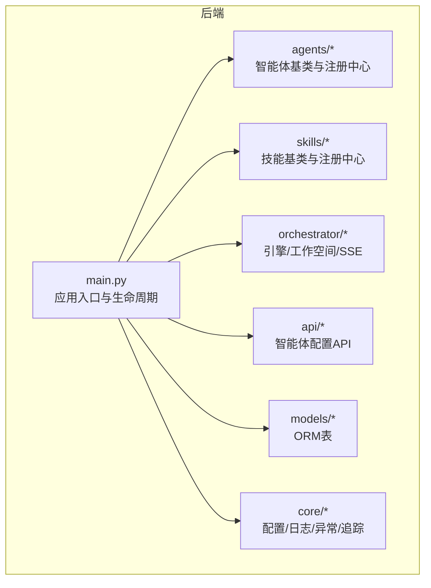
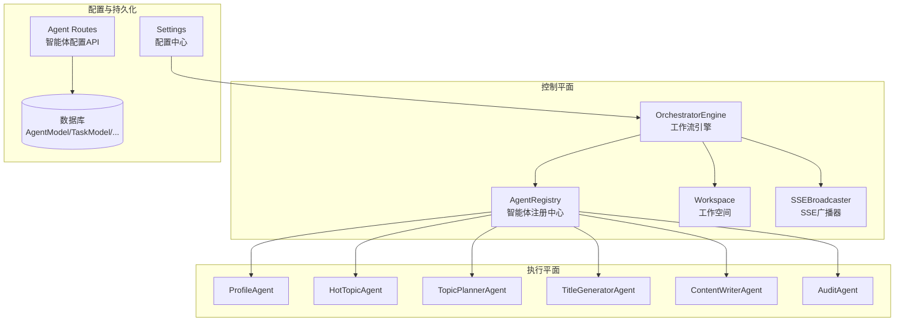
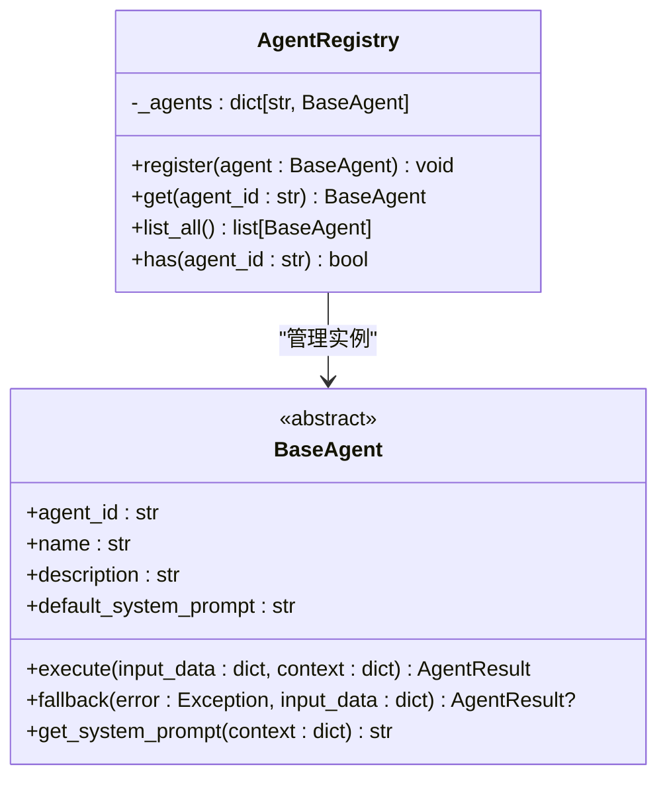
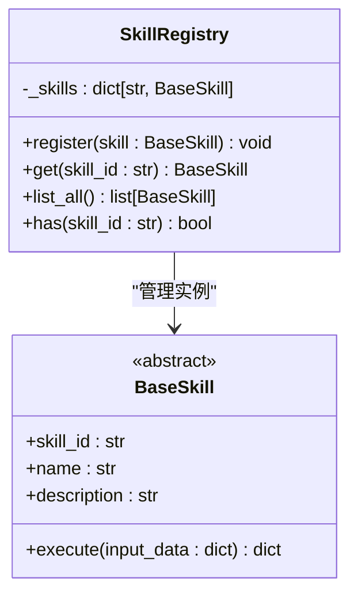
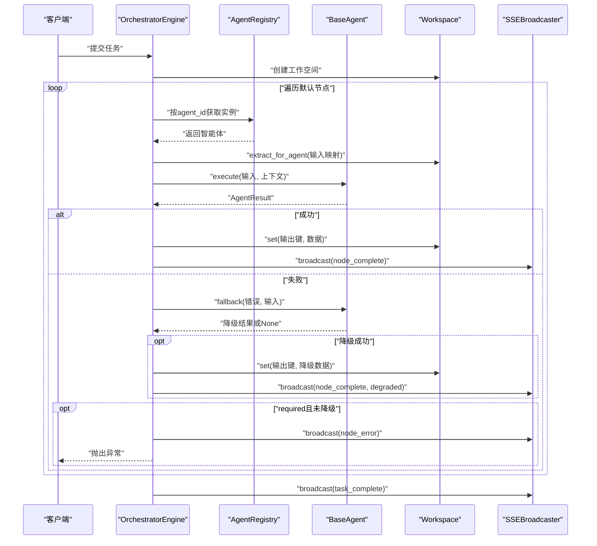
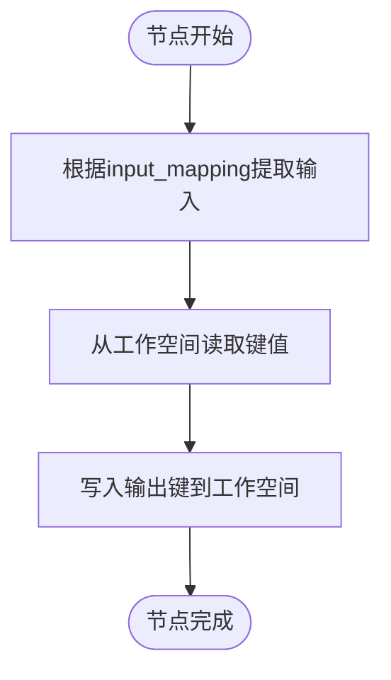
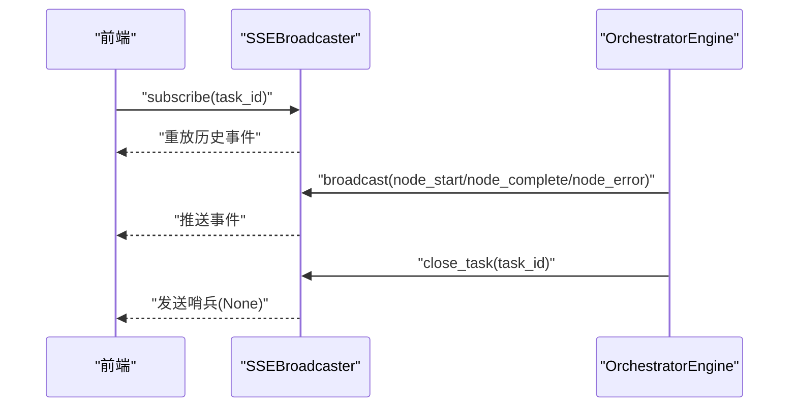
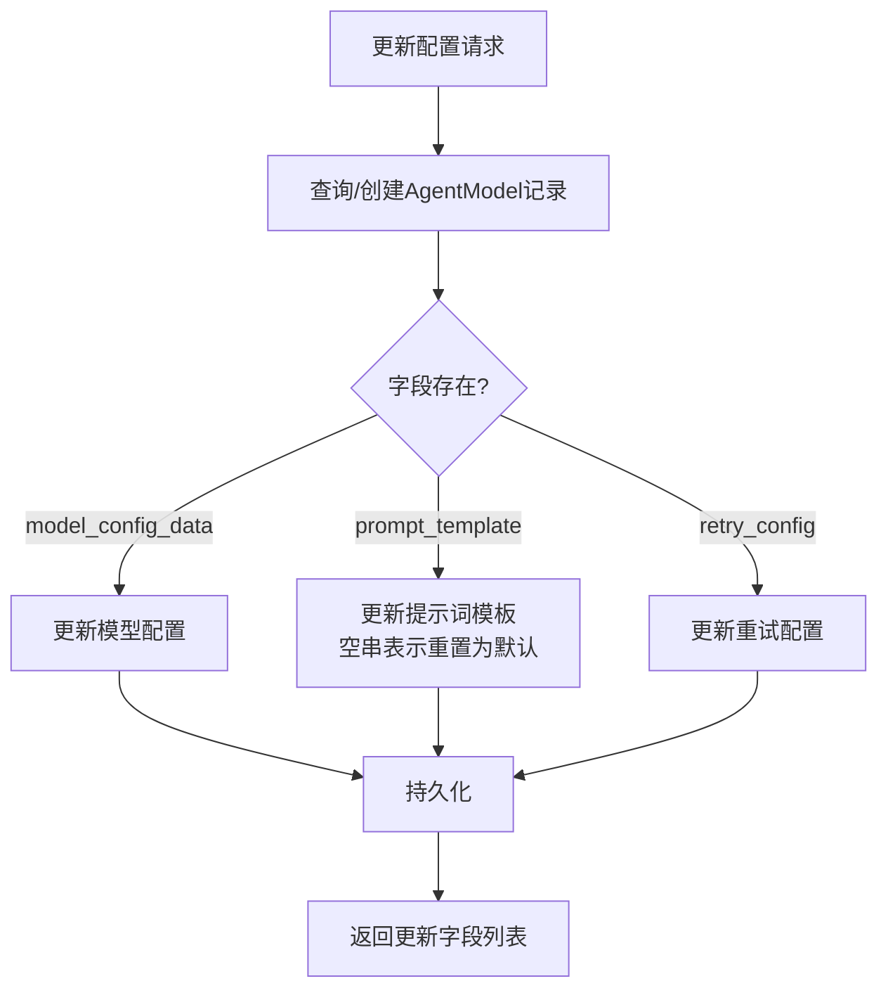
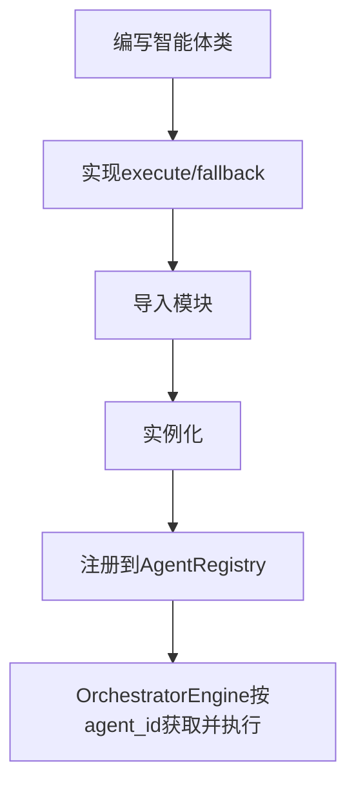
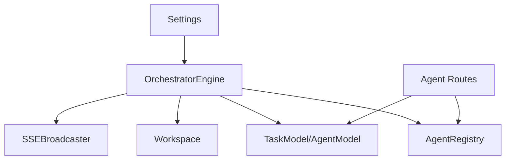

# 智能体注册中心

<cite>
**本文引用的文件**
- [backend/app/agents/registry.py](file://backend/app/agents/registry.py)
- [backend/app/agents/base.py](file://backend/app/agents/base.py)
- [backend/app/skills/registry.py](file://backend/app/skills/registry.py)
- [backend/app/skills/base.py](file://backend/app/skills/base.py)
- [backend/app/orchestrator/engine.py](file://backend/app/orchestrator/engine.py)
- [backend/app/orchestrator/workspace.py](file://backend/app/orchestrator/workspace.py)
- [backend/app/orchestrator/broadcaster.py](file://backend/app/orchestrator/broadcaster.py)
- [backend/app/api/agent_routes.py](file://backend/app/api/agent_routes.py)
- [backend/app/models/tables.py](file://backend/app/models/tables.py)
- [backend/app/core/config.py](file://backend/app/core/config.py)
- [backend/app/main.py](file://backend/app/main.py)
- [ARCHITECTURE.md](file://ARCHITECTURE.md)
</cite>

## 目录
1. [引言](#引言)
2. [项目结构](#项目结构)
3. [核心组件](#核心组件)
4. [架构总览](#架构总览)
5. [组件详解](#组件详解)
6. [依赖关系分析](#依赖关系分析)
7. [性能考量](#性能考量)
8. [故障排查指南](#故障排查指南)
9. [结论](#结论)
10. [附录](#附录)

## 引言
本技术文档围绕“智能体注册中心”展开，系统阐述智能体注册机制、动态加载系统、生命周期管理、注册表数据结构与查找算法、缓存策略、发现机制、版本管理与兼容性检查、自定义智能体开发与注册流程、配置管理与热更新、故障隔离与降级策略，并给出实际的注册与调用示例。文档同时结合后端工作流引擎与 SSE 广播器，展示从任务创建到节点执行、状态广播的完整链路。

## 项目结构
后端采用模块化分层设计，核心目录与职责如下：
- agents：智能体基类与注册中心，以及具体智能体实现
- skills：技能基类与注册中心，以及具体技能实现
- orchestrator：工作流引擎、工作空间与 SSE 广播器
- api：智能体配置相关 API 路由
- models：数据库 ORM 表定义
- core：配置、日志、异常与追踪工具
- main：应用入口、生命周期钩子与全局中间件

图表来源
- [backend/app/main.py:32-58](file://backend/app/main.py#L32-L58)
- [backend/app/agents/registry.py:10-39](file://backend/app/agents/registry.py#L10-L39)
- [backend/app/skills/registry.py:10-36](file://backend/app/skills/registry.py#L10-L36)
- [backend/app/orchestrator/engine.py:89-284](file://backend/app/orchestrator/engine.py#L89-L284)
- [backend/app/orchestrator/workspace.py:12-53](file://backend/app/orchestrator/workspace.py#L12-L53)
- [backend/app/orchestrator/broadcaster.py:11-94](file://backend/app/orchestrator/broadcaster.py#L11-L94)
- [backend/app/api/agent_routes.py:14-115](file://backend/app/api/agent_routes.py#L14-L115)
- [backend/app/models/tables.py:23-233](file://backend/app/models/tables.py#L23-L233)
- [backend/app/core/config.py:7-51](file://backend/app/core/config.py#L7-L51)

章节来源
- [backend/app/main.py:32-58](file://backend/app/main.py#L32-L58)
- [ARCHITECTURE.md:414-448](file://ARCHITECTURE.md#L414-L448)

## 核心组件
- 智能体注册中心：集中管理已注册智能体实例，提供注册、查询、枚举与存在性判断
- 技能注册中心：集中管理已注册技能实例，提供注册、查询、枚举与存在性判断
- 工作流引擎：加载默认工作流节点，按序调度智能体，管理工作空间，处理异常与降级，广播节点状态
- 工作空间：任务级上下文容器，支持键映射提取输入、设置与快照
- SSE 广播器：按任务维护订阅队列与历史缓冲，支持事件重放与流结束信号
- 智能体配置 API：提供智能体列表、详情与配置更新接口，支持持久化提示词模板与模型配置
- 数据模型：持久化任务、节点运行、账号画像、草稿、审核结果与智能体/技能配置
- 配置中心：从环境变量加载数据库、Redis、LLM 与超时等配置
- 应用入口：启动时注册内置智能体，创建数据库表，挂载路由与中间件

章节来源
- [backend/app/agents/registry.py:10-39](file://backend/app/agents/registry.py#L10-L39)
- [backend/app/skills/registry.py:10-36](file://backend/app/skills/registry.py#L10-L36)
- [backend/app/orchestrator/engine.py:89-284](file://backend/app/orchestrator/engine.py#L89-L284)
- [backend/app/orchestrator/workspace.py:12-53](file://backend/app/orchestrator/workspace.py#L12-L53)
- [backend/app/orchestrator/broadcaster.py:11-94](file://backend/app/orchestrator/broadcaster.py#L11-L94)
- [backend/app/api/agent_routes.py:14-115](file://backend/app/api/agent_routes.py#L14-L115)
- [backend/app/models/tables.py:23-233](file://backend/app/models/tables.py#L23-L233)
- [backend/app/core/config.py:7-51](file://backend/app/core/config.py#L7-L51)
- [backend/app/main.py:32-58](file://backend/app/main.py#L32-L58)

## 架构总览
智能体注册中心位于“控制平面/执行平面分离”的控制平面一侧，负责：
- 声明式注册与动态加载：应用启动时将智能体实例注册到注册中心
- 统一查询与发现：工作流引擎通过注册中心按 agent_id 获取智能体实例
- 配置与版本：通过数据库表持久化智能体配置，支持提示词模板、模型配置、重试策略等
- 生命周期：随应用生命周期创建与销毁，确保任务执行期间可用

图表来源
- [backend/app/orchestrator/engine.py:89-284](file://backend/app/orchestrator/engine.py#L89-L284)
- [backend/app/agents/registry.py:10-39](file://backend/app/agents/registry.py#L10-L39)
- [backend/app/orchestrator/workspace.py:12-53](file://backend/app/orchestrator/workspace.py#L12-L53)
- [backend/app/orchestrator/broadcaster.py:11-94](file://backend/app/orchestrator/broadcaster.py#L11-L94)
- [backend/app/api/agent_routes.py:14-115](file://backend/app/api/agent_routes.py#L14-L115)
- [backend/app/models/tables.py:160-181](file://backend/app/models/tables.py#L160-L181)
- [backend/app/core/config.py:7-51](file://backend/app/core/config.py#L7-L51)

## 组件详解

### 智能体注册中心与数据结构
- 注册表结构：以 agent_id 为键的字典，值为智能体实例
- 查询算法：哈希表 O(1) 查找，支持存在性判断
- 缓存策略：内存级缓存，随应用生命周期驻留；可通过配置中心调整超时与资源限制
- 注册流程：应用启动时导入智能体实现并通过注册中心统一注册
- 发现机制：工作流引擎通过 agent_id 从注册中心获取实例，未找到抛出特定异常

图表来源
- [backend/app/agents/registry.py:10-39](file://backend/app/agents/registry.py#L10-L39)
- [backend/app/agents/base.py:49-99](file://backend/app/agents/base.py#L49-L99)

章节来源
- [backend/app/agents/registry.py:10-39](file://backend/app/agents/registry.py#L10-L39)
- [backend/app/agents/base.py:49-99](file://backend/app/agents/base.py#L49-L99)
- [backend/app/main.py:32-40](file://backend/app/main.py#L32-L40)

### 技能注册中心与数据结构
- 注册表结构：以 skill_id 为键的字典，值为技能实例
- 查询算法：哈希表 O(1) 查找，支持存在性判断
- 注册流程：与智能体类似，应用启动时导入技能实现并通过注册中心统一注册
- 发现机制：智能体在执行过程中通过 skill_id 从注册中心获取实例

图表来源
- [backend/app/skills/registry.py:10-36](file://backend/app/skills/registry.py#L10-L36)
- [backend/app/skills/base.py:16-37](file://backend/app/skills/base.py#L16-L37)

章节来源
- [backend/app/skills/registry.py:10-36](file://backend/app/skills/registry.py#L10-L36)
- [backend/app/skills/base.py:16-37](file://backend/app/skills/base.py#L16-L37)

### 工作流引擎与生命周期管理
- 生命周期阶段：任务创建 → 初始化工作空间 → 顺序执行节点 → 异常与降级 → 结果汇总 → 广播完成
- 节点执行：从注册中心获取智能体实例，提取输入映射，注入系统提示词，执行并写回工作空间
- 超时与异常：统一超时控制与异常捕获，必要时触发降级或终止
- 广播机制：节点开始/完成/错误事件通过 SSE 广播给前端

图表来源
- [backend/app/orchestrator/engine.py:92-234](file://backend/app/orchestrator/engine.py#L92-L234)
- [backend/app/orchestrator/workspace.py:36-53](file://backend/app/orchestrator/workspace.py#L36-L53)
- [backend/app/orchestrator/broadcaster.py:57-78](file://backend/app/orchestrator/broadcaster.py#L57-L78)
- [backend/app/agents/registry.py:23-28](file://backend/app/agents/registry.py#L23-L28)

章节来源
- [backend/app/orchestrator/engine.py:89-284](file://backend/app/orchestrator/engine.py#L89-L284)
- [backend/app/orchestrator/workspace.py:12-53](file://backend/app/orchestrator/workspace.py#L12-L53)
- [backend/app/orchestrator/broadcaster.py:11-94](file://backend/app/orchestrator/broadcaster.py#L11-L94)

### 工作空间与输入映射
- 输入映射：支持从原始输入与工作空间键提取，简单扁平映射，便于 MVP 阶段快速迭代
- 快照与隔离：每次节点执行前快照上下文，避免污染后续节点

图表来源
- [backend/app/orchestrator/workspace.py:36-53](file://backend/app/orchestrator/workspace.py#L36-L53)

章节来源
- [backend/app/orchestrator/workspace.py:12-53](file://backend/app/orchestrator/workspace.py#L12-L53)

### SSE 广播与事件流
- 订阅与重放：按任务维护订阅队列与历史缓冲，晚到订阅者可重放历史事件
- 流结束：任务完成后发送哨兵信号并清理历史缓冲
- 事件类型：节点开始、节点完成、节点错误、任务完成

图表来源
- [backend/app/orchestrator/broadcaster.py:30-84](file://backend/app/orchestrator/broadcaster.py#L30-L84)

章节来源
- [backend/app/orchestrator/broadcaster.py:11-94](file://backend/app/orchestrator/broadcaster.py#L11-L94)

### 智能体配置管理与热更新
- 配置持久化：AgentModel 表保存智能体的模块路径、提示词模板、模型配置、重试配置等
- API 能力：列出智能体、获取详情、更新配置；更新时支持将空字符串重置为默认提示词
- 热更新策略：提示词模板与模型配置可在运行时更新，系统通过解析优先级与上下文注入生效

图表来源
- [backend/app/api/agent_routes.py:74-115](file://backend/app/api/agent_routes.py#L74-L115)
- [backend/app/models/tables.py:160-181](file://backend/app/models/tables.py#L160-L181)

章节来源
- [backend/app/api/agent_routes.py:14-115](file://backend/app/api/agent_routes.py#L14-L115)
- [backend/app/models/tables.py:160-181](file://backend/app/models/tables.py#L160-L181)

### 版本管理与兼容性检查
- 版本字段：智能体与技能模型均包含版本字段，便于追踪与灰度
- 兼容性：提示词模板与模型配置变更遵循“配置优先于代码”的原则，避免硬编码变更导致的不兼容
- 升级策略：通过 API 更新配置，配合降级策略保证旧版提示词与新版模型的兼容

章节来源
- [backend/app/models/tables.py:160-181](file://backend/app/models/tables.py#L160-L181)
- [backend/app/api/agent_routes.py:74-115](file://backend/app/api/agent_routes.py#L74-L115)

### 自定义智能体开发指南与注册流程
- 开发步骤
  - 定义智能体类：继承智能体基类，设置 agent_id、name、description、default_system_prompt
  - 实现 execute 方法：接收结构化输入与上下文，返回标准化 AgentResult
  - 可选实现 fallback 方法：提供失败降级策略
  - 在应用入口注册：导入智能体实现并在启动时调用注册中心注册
- 注册流程
  - 启动阶段：导入智能体模块 → 实例化 → 注册到注册中心
  - 运行阶段：工作流引擎通过 agent_id 从注册中心获取实例并执行

图表来源
- [backend/app/agents/base.py:49-99](file://backend/app/agents/base.py#L49-L99)
- [backend/app/main.py:32-40](file://backend/app/main.py#L32-L40)
- [backend/app/agents/registry.py:16-21](file://backend/app/agents/registry.py#L16-L21)

章节来源
- [backend/app/agents/base.py:49-99](file://backend/app/agents/base.py#L49-L99)
- [backend/app/main.py:32-40](file://backend/app/main.py#L32-L40)
- [backend/app/agents/registry.py:10-39](file://backend/app/agents/registry.py#L10-L39)

### 集成方法与调用示例
- 集成要点
  - 在应用入口导入智能体模块并注册
  - 通过 API 获取智能体详情与配置，必要时更新提示词模板
  - 工作流引擎按默认节点顺序调度，无需手动干预
- 示例路径
  - 启动注册：[backend/app/main.py:32-40](file://backend/app/main.py#L32-L40)
  - 获取智能体详情：[backend/app/api/agent_routes.py:46-71](file://backend/app/api/agent_routes.py#L46-L71)
  - 更新智能体配置：[backend/app/api/agent_routes.py:74-115](file://backend/app/api/agent_routes.py#L74-L115)
  - 节点执行与广播：[backend/app/orchestrator/engine.py:137-234](file://backend/app/orchestrator/engine.py#L137-L234)

章节来源
- [backend/app/main.py:32-40](file://backend/app/main.py#L32-L40)
- [backend/app/api/agent_routes.py:46-115](file://backend/app/api/agent_routes.py#L46-L115)
- [backend/app/orchestrator/engine.py:137-234](file://backend/app/orchestrator/engine.py#L137-L234)

## 依赖关系分析
- 模块耦合
  - 工作流引擎强依赖注册中心与工作空间，弱依赖数据库与广播器
  - 智能体与技能通过注册中心解耦，便于替换与扩展
  - API 层仅依赖注册中心与数据库模型，保持薄路由职责
- 外部依赖
  - LLM 调用：通过配置中心的模型名、密钥与超时参数
  - 数据库：SQLAlchemy 异步会话，Alembic 迁移
  - Redis：配置中心提供连接 URL（当前未在核心模块直接使用）

图表来源
- [backend/app/orchestrator/engine.py:18-26](file://backend/app/orchestrator/engine.py#L18-L26)
- [backend/app/api/agent_routes.py:10-12](file://backend/app/api/agent_routes.py#L10-L12)
- [backend/app/core/config.py:7-51](file://backend/app/core/config.py#L7-L51)

章节来源
- [backend/app/orchestrator/engine.py:18-26](file://backend/app/orchestrator/engine.py#L18-L26)
- [backend/app/api/agent_routes.py:10-12](file://backend/app/api/agent_routes.py#L10-L12)
- [backend/app/core/config.py:7-51](file://backend/app/core/config.py#L7-L51)

## 性能考量
- 注册表查询：O(1) 哈希查找，注册中心规模较小，性能开销可忽略
- 工作流执行：顺序节点执行，I/O 密集（LLM/外部 API），注意超时与并发控制
- SSE 广播：事件缓冲与队列管理，避免内存泄漏；任务结束后定时清理历史
- 数据持久化：节点运行记录与任务快照写入数据库，建议异步 flush 与批处理

## 故障排查指南
- Agent 未找到
  - 现象：按 agent_id 查询抛出异常
  - 排查：确认智能体是否在启动时正确导入与注册
  - 参考：[backend/app/agents/registry.py:23-28](file://backend/app/agents/registry.py#L23-L28)，[backend/app/main.py:32-40](file://backend/app/main.py#L32-L40)
- 节点执行超时
  - 现象：节点状态失败，错误消息包含超时
  - 排查：检查配置中心的 agent_timeout，优化智能体执行逻辑或外部调用
  - 参考：[backend/app/orchestrator/engine.py:176-187](file://backend/app/orchestrator/engine.py#L176-L187)，[backend/app/core/config.py:42-45](file://backend/app/core/config.py#L42-L45)
- 节点执行失败
  - 现象：节点状态失败，广播 node_error
  - 排查：检查智能体 fallback 策略与外部依赖；必要时启用降级
  - 参考：[backend/app/orchestrator/engine.py:176-196](file://backend/app/orchestrator/engine.py#L176-L196)
- SSE 无事件
  - 现象：前端无法收到节点状态
  - 排查：确认订阅队列与历史缓冲，检查 close_task 是否被调用
  - 参考：[backend/app/orchestrator/broadcaster.py:30-84](file://backend/app/orchestrator/broadcaster.py#L30-L84)

章节来源
- [backend/app/agents/registry.py:23-28](file://backend/app/agents/registry.py#L23-L28)
- [backend/app/main.py:32-40](file://backend/app/main.py#L32-L40)
- [backend/app/orchestrator/engine.py:176-196](file://backend/app/orchestrator/engine.py#L176-L196)
- [backend/app/orchestrator/broadcaster.py:30-84](file://backend/app/orchestrator/broadcaster.py#L30-L84)
- [backend/app/core/config.py:42-45](file://backend/app/core/config.py#L42-L45)

## 结论
智能体注册中心通过统一的注册与查询机制，实现了智能体的动态加载与发现，配合工作流引擎的顺序调度、工作空间的上下文隔离与 SSE 广播，构建了可扩展、可观测、可降级的多智能体内容生产平台。通过配置优先于代码的设计，系统支持在不重启的情况下更新提示词模板与模型配置，满足快速迭代与灰度发布的需要。

## 附录
- 架构设计参考：[ARCHITECTURE.md](file://ARCHITECTURE.md)
- 应用入口与生命周期：[backend/app/main.py:32-58](file://backend/app/main.py#L32-L58)
- 配置中心：[backend/app/core/config.py:7-51](file://backend/app/core/config.py#L7-L51)
- 数据模型：[backend/app/models/tables.py:23-233](file://backend/app/models/tables.py#L23-L233)