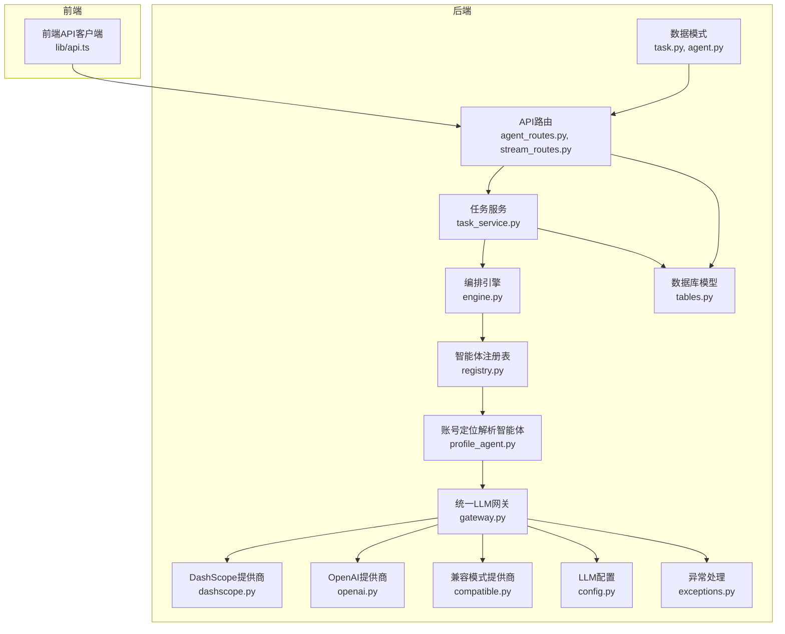
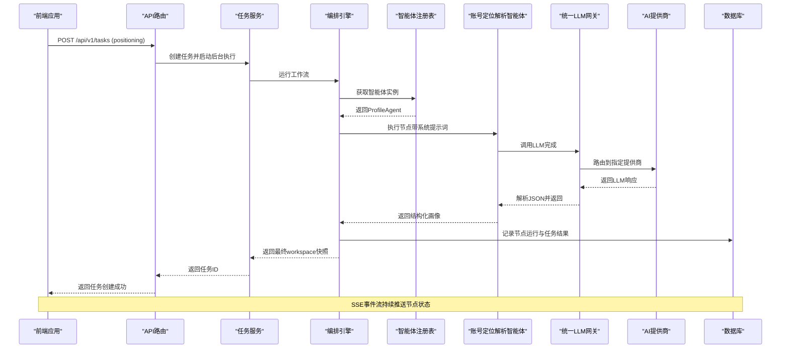
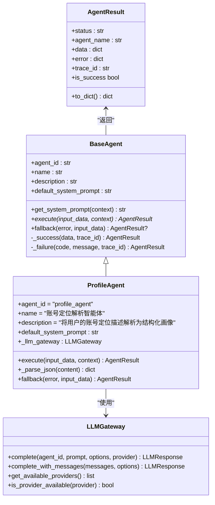
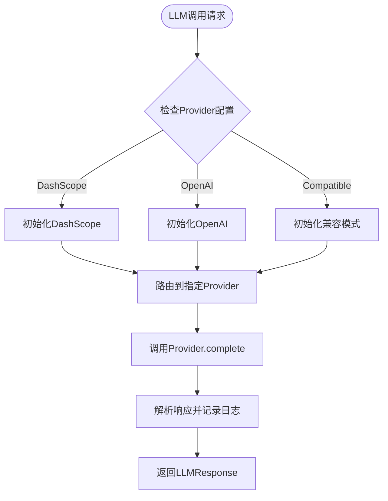
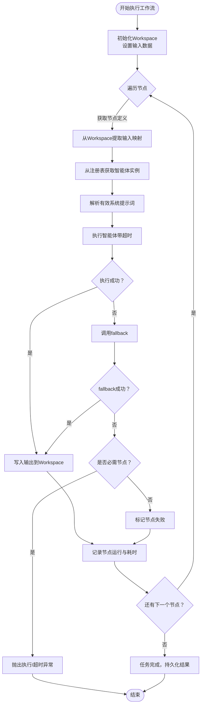
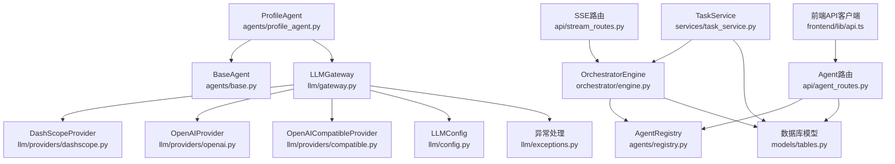

# 账号定位解析智能体

<cite>
**本文档引用的文件**
- [profile_agent.py](file://backend/app/agents/profile_agent.py)
- [base.py](file://backend/app/agents/base.py)
- [registry.py](file://backend/app/agents/registry.py)
- [engine.py](file://backend/app/orchestrator/engine.py)
- [agent_routes.py](file://backend/app/api/agent_routes.py)
- [task_service.py](file://backend/app/services/task_service.py)
- [stream_routes.py](file://backend/app/api/stream_routes.py)
- [tables.py](file://backend/app/models/tables.py)
- [task.py](file://backend/app/schemas/task.py)
- [agent.py](file://backend/app/schemas/agent.py)
- [api.ts](file://frontend/lib/api.ts)
- [gateway.py](file://backend/app/llm/gateway.py)
- [base.py](file://backend/app/llm/base.py)
- [config.py](file://backend/app/llm/config.py)
- [exceptions.py](file://backend/app/llm/exceptions.py)
- [dashscope.py](file://backend/app/llm/providers/dashscope.py)
- [openai.py](file://backend/app/llm/providers/openai.py)
- [compatible.py](file://backend/app/llm/providers/compatible.py)
- [__init__.py](file://backend/app/llm/__init__.py)
- [test_profile_agent.py](file://backend/tests/test_profile_agent.py)
- [test_llm_provider.py](file://backend/tests/test_llm_provider.py)
</cite>

## 更新摘要
**所做更改**
- 完全重构ProfileAgent实现，从mock实现迁移至基于统一LLM网关的真实LLM驱动
- 新增统一LLM网关架构，支持多种AI提供商（DashScope、OpenAI、OpenAI-Compatible）
- 增强错误处理机制，包含详细的异常类型和JSON解析处理
- 优化降级策略，提供默认泛化画像返回
- 更新系统提示词设计和输入输出格式规范

## 目录
1. [简介](#简介)
2. [项目结构](#项目结构)
3. [核心组件](#核心组件)
4. [架构概览](#架构概览)
5. [详细组件分析](#详细组件分析)
6. [依赖关系分析](#依赖关系分析)
7. [性能考虑](#性能考虑)
8. [故障排除指南](#故障排除指南)
9. [结论](#结论)
10. [附录](#附录)

## 简介
本文件为"账号定位解析智能体"的技术文档，面向需要理解并使用该智能体的开发者与产品人员。该智能体负责将用户的自然语言账号定位描述转换为结构化的媒体画像，作为内容创作工作流的入口节点。文档涵盖统一LLM网关架构、系统提示词设计、输入输出格式规范、JSON结构定义与字段约束、真实LLM驱动实现、错误处理机制与降级策略，并提供从原始定位描述到结构化画像的完整转换示例。

## 项目结构
该智能体位于后端Python服务中，采用模块化组织方式，现已重构为基于统一LLM网关的架构：
- agents：智能体基类与具体智能体实现
- llm：统一LLM网关与多提供商支持
- orchestrator：编排引擎，负责按顺序执行工作流节点
- api：FastAPI路由层，提供REST接口与SSE事件流
- services：业务服务层，封装任务生命周期管理
- models/schemas：数据库模型与请求/响应模式定义
- frontend：前端API客户端，用于发起任务与订阅事件流

**图表来源**
- [profile_agent.py:1-187](file://backend/app/agents/profile_agent.py#L1-L187)
- [engine.py:1-285](file://backend/app/orchestrator/engine.py#L1-L285)
- [agent_routes.py:1-115](file://backend/app/api/agent_routes.py#L1-L115)
- [task_service.py:1-126](file://backend/app/services/task_service.py#L1-L126)
- [tables.py:1-233](file://backend/app/models/tables.py#L1-L233)
- [task.py:1-83](file://backend/app/schemas/task.py#L1-L83)
- [agent.py:1-29](file://backend/app/schemas/agent.py#L1-L29)
- [api.ts:1-110](file://frontend/lib/api.ts#L1-L110)
- [gateway.py:1-303](file://backend/app/llm/gateway.py#L1-L303)
- [config.py:1-165](file://backend/app/llm/config.py#L1-L165)
- [exceptions.py:1-153](file://backend/app/llm/exceptions.py#L1-L153)
- [dashscope.py:1-194](file://backend/app/llm/providers/dashscope.py#L1-L194)
- [openai.py:1-185](file://backend/app/llm/providers/openai.py#L1-L185)
- [compatible.py:1-191](file://backend/app/llm/providers/compatible.py#L1-L191)

## 核心组件
- 账号定位解析智能体（ProfileAgent）：基于统一LLM网关实现，接收用户定位描述，调用LLM解析为结构化媒体画像。
- 统一LLM网关（LLMGateway）：提供统一的LLM调用接口，自动处理Provider路由、错误处理和异常转换。
- 多提供商支持：支持DashScope、OpenAI、OpenAI-Compatible三种AI提供商，具备自动初始化和生命周期管理。
- 编排引擎（OrchestratorEngine）：定义默认线性工作流，按序调度各节点，记录节点运行日志与追踪ID。
- 智能体注册表（AgentRegistry）：集中管理已注册智能体实例，提供查找与列表能力。
- 任务服务（TaskService）：创建任务、启动后台执行、查询任务详情与节点运行记录。
- API路由：提供智能体配置查询、更新与任务生命周期接口；SSE事件流实时推送节点状态。
- 数据模型：持久化任务、节点运行、账号画像等数据结构。

**章节来源**
- [profile_agent.py:21-187](file://backend/app/agents/profile_agent.py#L21-L187)
- [gateway.py:23-303](file://backend/app/llm/gateway.py#L23-L303)
- [engine.py:89-234](file://backend/app/orchestrator/engine.py#L89-L234)
- [registry.py:10-36](file://backend/app/agents/registry.py#L10-L36)
- [task_service.py:20-64](file://backend/app/services/task_service.py#L20-L64)
- [agent_routes.py:17-115](file://backend/app/api/agent_routes.py#L17-L115)
- [tables.py:23-95](file://backend/app/models/tables.py#L23-L95)

## 架构概览
下图展示了从前端提交定位描述到生成结构化画像的完整链路，包括统一LLM网关调用、多提供商路由、错误处理与结果持久化。

**图表来源**
- [api.ts:26-31](file://frontend/lib/api.ts#L26-L31)
- [agent_routes.py:17-43](file://backend/app/api/agent_routes.py#L17-L43)
- [task_service.py:22-58](file://backend/app/services/task_service.py#L22-L58)
- [engine.py:92-234](file://backend/app/orchestrator/engine.py#L92-L234)
- [registry.py:23-28](file://backend/app/agents/registry.py#L23-L28)
- [profile_agent.py:59-151](file://backend/app/agents/profile_agent.py#L59-L151)
- [gateway.py:117-233](file://backend/app/llm/gateway.py#L117-L233)
- [tables.py:23-95](file://backend/app/models/tables.py#L23-L95)

## 详细组件分析

### 账号定位解析智能体（ProfileAgent）
**已更新** 从mock实现完全重构为基于统一LLM网关的真实LLM驱动实现

- 角色与职责：接收用户定位描述，通过统一LLM网关调用LLM解析为结构化媒体画像，作为后续工作流的输入。
- 系统提示词设计：明确任务目标、输入字段与严格JSON输出要求，限定输出字段与约束，确保可解析性与一致性。
- LLM集成：使用LLMGateway.complete方法调用LLM，支持多种AI提供商自动切换。
- JSON解析：增强的JSON解析机制，处理markdown代码块包装，确保输出格式一致性。
- 错误处理：完善的异常处理体系，包括LLM超时、API错误、JSON解析错误等。
- 降级策略：当执行失败时，返回通用降级画像，保证工作流继续推进。

**图表来源**
- [base.py:18-99](file://backend/app/agents/base.py#L18-L99)
- [profile_agent.py:21-187](file://backend/app/agents/profile_agent.py#L21-L187)
- [gateway.py:23-303](file://backend/app/llm/gateway.py#L23-L303)

**章节来源**
- [profile_agent.py:26-58](file://backend/app/agents/profile_agent.py#L26-L58)
- [profile_agent.py:59-151](file://backend/app/agents/profile_agent.py#L59-L151)
- [profile_agent.py:152-164](file://backend/app/agents/profile_agent.py#L152-L164)
- [profile_agent.py:165-187](file://backend/app/agents/profile_agent.py#L165-L187)
- [base.py:60-98](file://backend/app/agents/base.py#L60-L98)

### 统一LLM网关（LLMGateway）
**新增** 统一LLM网关架构，提供统一的LLM调用接口

- 核心功能：提供统一的LLM调用接口，自动处理Provider路由和选择、请求日志和追踪、错误处理和异常转换。
- 多提供商支持：自动初始化DashScope、OpenAI、OpenAI-Compatible三种提供商，具备配置检测和生命周期管理。
- Provider路由：根据配置和调用参数选择合适的AI提供商，支持动态切换。
- 错误处理：统一的异常转换和日志记录，便于调试和监控。
- 单例模式：提供全局单例实例，支持重新加载配置。

**图表来源**
- [gateway.py:53-116](file://backend/app/llm/gateway.py#L53-L116)
- [gateway.py:165-184](file://backend/app/llm/gateway.py#L165-L184)
- [gateway.py:185-233](file://backend/app/llm/gateway.py#L185-L233)

**章节来源**
- [gateway.py:23-52](file://backend/app/llm/gateway.py#L23-L52)
- [gateway.py:53-116](file://backend/app/llm/gateway.py#L53-L116)
- [gateway.py:117-233](file://backend/app/llm/gateway.py#L117-L233)
- [gateway.py:286-303](file://backend/app/llm/gateway.py#L286-L303)

### AI提供商实现
**新增** 三种AI提供商的具体实现

#### DashScopeProvider（阿里云Qwen模型）
- 支持模型：qwen-turbo、qwen-plus、qwen3.5-plus、qwen-max等
- 配置要求：需要DASHSCOPE_API_KEY或LITELLM_API_KEY环境变量
- 特殊功能：支持视觉模型、音频模型、长文本模型

#### OpenAIProvider（OpenAI官方API）
- 支持模型：gpt-4o、gpt-4o-mini、gpt-4-turbo、gpt-3.5-turbo等
- 配置要求：需要OPENAI_API_KEY环境变量
- 特殊功能：支持最新模型如o1系列

#### OpenAICompatibleProvider（兼容模式）
- 支持服务：vLLM、Ollama、LM Studio、FastChat等
- 配置要求：需要COMPATIBLE_BASE_URL环境变量
- 特殊功能：支持任意OpenAI兼容的服务端

**章节来源**
- [dashscope.py:12-68](file://backend/app/llm/providers/dashscope.py#L12-L68)
- [openai.py:12-66](file://backend/app/llm/providers/openai.py#L12-L66)
- [compatible.py:12-63](file://backend/app/llm/providers/compatible.py#L12-L63)

### 编排引擎（OrchestratorEngine）
- 默认工作流：定义线性节点序列，其中profile_parsing节点对应ProfileAgent。
- 节点调度：按序提取输入映射、注入系统提示词、执行并记录节点运行状态。
- 错误处理：节点失败时尝试fallback，必要时抛出超时或执行异常；记录节点耗时与令牌统计。
- 事件广播：通过SSE向订阅者推送节点开始/完成/错误事件，支持任务完成通知。

**图表来源**
- [engine.py:92-234](file://backend/app/orchestrator/engine.py#L92-L234)
- [engine.py:236-263](file://backend/app/orchestrator/engine.py#L236-L263)
- [registry.py:23-28](file://backend/app/agents/registry.py#L23-L28)

**章节来源**
- [engine.py:31-86](file://backend/app/orchestrator/engine.py#L31-L86)
- [engine.py:137-196](file://backend/app/orchestrator/engine.py#L137-L196)
- [engine.py:236-263](file://backend/app/orchestrator/engine.py#L236-L263)

### 智能体注册表（AgentRegistry）
- 功能：集中注册、查找与列举智能体实例，提供存在性检查。
- 异常：未找到智能体时抛出AgentNotFoundError。

**章节来源**
- [registry.py:10-36](file://backend/app/agents/registry.py#L10-L36)

### API与前端交互
- 前端API客户端：提供创建任务、获取任务详情/节点、订阅SSE事件等方法。
- 后端路由：
  - GET /api/v1/agents：列出所有注册智能体及其自定义提示词状态。
  - GET /api/v1/agents/{agent_id}：获取智能体详情（含默认与自定义提示词）。
  - PUT /api/v1/agents/{agent_id}/config：更新智能体配置（模型参数、提示词模板、重试配置）。
  - GET /api/v1/tasks/{taskId}/stream：SSE事件流，推送节点状态变化。

**章节来源**
- [agent_routes.py:17-115](file://backend/app/api/agent_routes.py#L17-L115)
- [api.ts:26-50](file://frontend/lib/api.ts#L26-L50)

## 依赖关系分析
**已更新** 从简单的mock依赖重构为复杂的LLM网关依赖

- ProfileAgent依赖统一LLM网关，通过LLMGateway.complete方法调用LLM，支持多种AI提供商。
- LLMGateway依赖多个Provider实现，具备自动初始化和配置管理能力。
- 编排引擎依赖AgentRegistry获取智能体实例，依赖数据库模型持久化节点运行与任务结果。
- TaskService协调任务创建与后台执行，触发编排引擎。
- API路由层连接前端与后端服务，SSE事件流贯穿整个执行过程。

**图表来源**
- [profile_agent.py:8-16](file://backend/app/agents/profile_agent.py#L8-L16)
- [gateway.py:16-18](file://backend/app/llm/gateway.py#L16-L18)
- [config.py:11-165](file://backend/app/llm/config.py#L11-L165)
- [exceptions.py:9-153](file://backend/app/llm/exceptions.py#L9-L153)
- [engine.py:18-26](file://backend/app/orchestrator/engine.py#L18-L26)
- [registry.py:3-5](file://backend/app/agents/registry.py#L3-L5)
- [task_service.py:13-15](file://backend/app/services/task_service.py#L13-L15)
- [agent_routes.py:9-12](file://backend/app/api/agent_routes.py#L9-L12)
- [stream_routes.py:9-11](file://backend/app/api/stream_routes.py#L9-L11)
- [api.ts:12-24](file://frontend/lib/api.ts#L12-L24)

**章节来源**
- [profile_agent.py:8-16](file://backend/app/agents/profile_agent.py#L8-L16)
- [gateway.py:16-18](file://backend/app/llm/gateway.py#L16-L18)
- [config.py:11-165](file://backend/app/llm/config.py#L11-L165)
- [exceptions.py:9-153](file://backend/app/llm/exceptions.py#L9-L153)
- [engine.py:18-26](file://backend/app/orchestrator/engine.py#L18-L26)
- [registry.py:3-5](file://backend/app/agents/registry.py#L3-L5)
- [task_service.py:13-15](file://backend/app/services/task_service.py#L13-L15)
- [agent_routes.py:9-12](file://backend/app/api/agent_routes.py#L9-L12)
- [stream_routes.py:9-11](file://backend/app/api/stream_routes.py#L9-L11)
- [api.ts:12-24](file://frontend/lib/api.ts#L12-L24)

## 性能考虑
**已更新** 新增LLM网关性能优化考虑

- 统一LLM网关：通过LLMGateway统一管理多个AI提供商，减少重复初始化开销。
- Provider缓存：LLMGateway内部维护Provider实例缓存，避免重复创建。
- 自动超时控制：各Provider实现内置超时控制，防止长时间阻塞。
- 错误重试：配置中支持最大重试次数，提高调用成功率。
- 令牌统计：LLMResponse包含详细的令牌使用统计，便于成本控制。
- 日志追踪：完整的调用日志和追踪ID，便于性能监控和问题排查。
- SSE长连接：事件流采用SSE，保持低延迟的状态推送，适合实时可视化。

**章节来源**
- [gateway.py:48-51](file://backend/app/llm/gateway.py#L48-L51)
- [config.py:63-71](file://backend/app/llm/config.py#L63-L71)
- [base.py:11-38](file://backend/app/llm/base.py#L11-L38)
- [engine.py:236-243](file://backend/app/orchestrator/engine.py#L236-L243)
- [engine.py:147-171](file://backend/app/orchestrator/engine.py#L147-L171)
- [engine.py:211-215](file://backend/app/orchestrator/engine.py#L211-L215)
- [engine.py:200-209](file://backend/app/orchestrator/engine.py#L200-L209)

## 故障排除指南
**已更新** 新增LLM网关相关故障排除指导

- LLM调用失败：检查LLMGateway的可用Provider列表，确认配置的API密钥是否正确。
- Provider初始化失败：查看LLMGateway的日志，确认环境变量配置和网络连接状态。
- JSON解析错误：检查LLM输出格式，确保返回的是严格JSON格式，必要时添加格式要求。
- 超时问题：调整LLMConfig中的timeout参数，或检查网络延迟和Provider响应时间。
- 模型不支持：确认使用的模型名称是否在对应Provider的支持列表中。
- 配置未生效：检查LLMConfig的default_provider设置，确保与实际使用的Provider一致。
- 事件流断开：SSE端会发送keepalive注释，若长时间无事件，检查订阅队列与广播器状态。

**章节来源**
- [gateway.py:105-115](file://backend/app/llm/gateway.py#L105-L115)
- [gateway.py:165-184](file://backend/app/llm/gateway.py#L165-L184)
- [config.py:79-86](file://backend/app/llm/config.py#L79-L86)
- [profile_agent.py:116-150](file://backend/app/agents/profile_agent.py#L116-L150)
- [engine.py:176-196](file://backend/app/orchestrator/engine.py#L176-L196)
- [engine.py:245-263](file://backend/app/orchestrator/engine.py#L245-L263)
- [registry.py:23-28](file://backend/app/agents/registry.py#L23-L28)
- [agent_routes.py:46-71](file://backend/app/api/agent_routes.py#L46-L71)
- [stream_routes.py:18-42](file://backend/app/api/stream_routes.py#L18-L42)

## 结论
账号定位解析智能体已完全重构为基于统一LLM网关的真实LLM驱动实现，支持多种AI提供商（DashScope、OpenAI、OpenAI-Compatible）。通过统一的LLM网关架构，实现了Provider自动初始化、路由选择、错误处理和日志追踪等功能。智能体具备完善的JSON解析机制、详细的异常处理和降级策略，确保在各种情况下都能稳定输出结构化媒体画像。结合编排引擎的超时控制、事件广播与持久化记录，形成了完整的任务生命周期管理方案，为后续热点分析、选题策划、标题生成与内容写作提供高质量输入。

## 附录

### 输入输出格式规范与JSON结构定义
**已更新** 基于真实LLM输出的格式规范

- 输入字段
  - positioning: 用户的账号定位描述（字符串，长度限制见任务Schema）
- 输出字段（严格JSON对象）
  - domain: 账号主领域（字符串）
  - subdomain: 细分领域（字符串）
  - target_audience: 目标受众对象
    - age_range: 年龄段（字符串）
    - occupation: 职业（字符串）
    - interests: 兴趣标签数组（3-5个字符串）
  - tone: 内容调性（字符串）
  - content_style: 内容风格（字符串）
  - keywords: 关键词数组（5-8个字符串）
  - positioning_raw: 原始输入（字符串，原样保留）

字段约束与示例路径
- 系统提示词与字段要求：[profile_agent.py:26-52](file://backend/app/agents/profile_agent.py#L26-L52)
- LLM输出解析机制：[profile_agent.py:152-164](file://backend/app/agents/profile_agent.py#L152-L164)
- 任务输入Schema（positioning字段）：[task.py:12-17](file://backend/app/schemas/task.py#L12-L17)

**章节来源**
- [profile_agent.py:26-52](file://backend/app/agents/profile_agent.py#L26-L52)
- [profile_agent.py:152-164](file://backend/app/agents/profile_agent.py#L152-L164)
- [task.py:12-17](file://backend/app/schemas/task.py#L12-L17)

### 实际使用示例（从原始定位描述到结构化画像）
**已更新** 基于统一LLM网关的真实调用流程

- 步骤1：前端调用创建任务接口，传入positioning参数
  - 接口路径：[api.ts:26-31](file://frontend/lib/api.ts#L26-L31)
- 步骤2：后端任务服务创建任务并启动编排引擎
  - 任务创建：[task_service.py:22-37](file://backend/app/services/task_service.py#L22-L37)
  - 后台执行：[task_service.py:39-58](file://backend/app/services/task_service.py#L39-L58)
- 步骤3：编排引擎调度profile_parsing节点，执行ProfileAgent
  - 工作流定义：[engine.py:32-40](file://backend/app/orchestrator/engine.py#L32-L40)
  - 节点执行：[engine.py:137-147](file://backend/app/orchestrator/engine.py#L137-L147)
  - 智能体执行：[profile_agent.py:59-151](file://backend/app/agents/profile_agent.py#L59-L151)
- 步骤4：LLMGateway调用LLM提供商，解析JSON输出
  - Provider路由：[gateway.py:165-184](file://backend/app/llm/gateway.py#L165-L184)
  - JSON解析：[profile_agent.py:152-164](file://backend/app/agents/profile_agent.py#L152-L164)
- 步骤5：SSE事件流推送节点状态，任务完成后返回结果
  - 事件流：[stream_routes.py:14-42](file://backend/app/api/stream_routes.py#L14-L42)
  - 结果持久化：[engine.py:217-234](file://backend/app/orchestrator/engine.py#L217-L234)

**章节来源**
- [api.ts:26-31](file://frontend/lib/api.ts#L26-L31)
- [task_service.py:22-58](file://backend/app/services/task_service.py#L22-L58)
- [engine.py:32-40](file://backend/app/orchestrator/engine.py#L32-L40)
- [engine.py:137-147](file://backend/app/orchestrator/engine.py#L137-L147)
- [profile_agent.py:59-151](file://backend/app/agents/profile_agent.py#L59-L151)
- [gateway.py:165-184](file://backend/app/llm/gateway.py#L165-L184)
- [profile_agent.py:152-164](file://backend/app/agents/profile_agent.py#L152-L164)
- [stream_routes.py:14-42](file://backend/app/api/stream_routes.py#L14-L42)
- [engine.py:217-234](file://backend/app/orchestrator/engine.py#L217-L234)

### LLM网关实现机制与错误处理
**新增** 统一LLM网关的实现细节

- LLM网关初始化：根据配置自动初始化可用的Provider，支持DashScope、OpenAI、OpenAI-Compatible三种类型。
- Provider路由：根据调用参数和默认配置选择合适的Provider，支持动态切换。
- 错误处理：统一的异常转换机制，将Provider特定的异常转换为标准的LLM异常类型。
- 日志记录：完整的调用日志，包含Provider信息、模型名称、延迟时间和令牌统计。
- 降级策略：Provider初始化失败时自动跳过，不影响其他Provider的正常使用。

**章节来源**
- [gateway.py:53-116](file://backend/app/llm/gateway.py#L53-L116)
- [gateway.py:165-233](file://backend/app/llm/gateway.py#L165-L233)
- [exceptions.py:9-153](file://backend/app/llm/exceptions.py#L9-L153)

### 数据模型与持久化
- 任务模型：保存任务生命周期、输入/输出数据、耗时与令牌统计。
- 节点运行模型：记录每个节点的输入/输出、错误信息、耗时与是否降级。
- 账号画像模型：持久化解析后的结构化画像，便于审计与复用。

**章节来源**
- [tables.py:23-46](file://backend/app/models/tables.py#L23-L46)
- [tables.py:48-73](file://backend/app/models/tables.py#L48-L73)
- [tables.py:76-95](file://backend/app/models/tables.py#L76-L95)