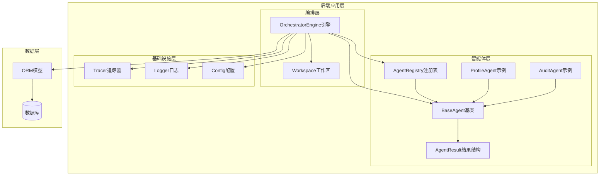
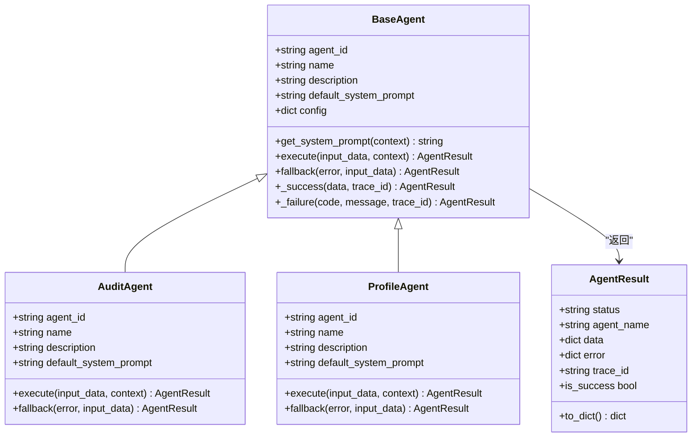
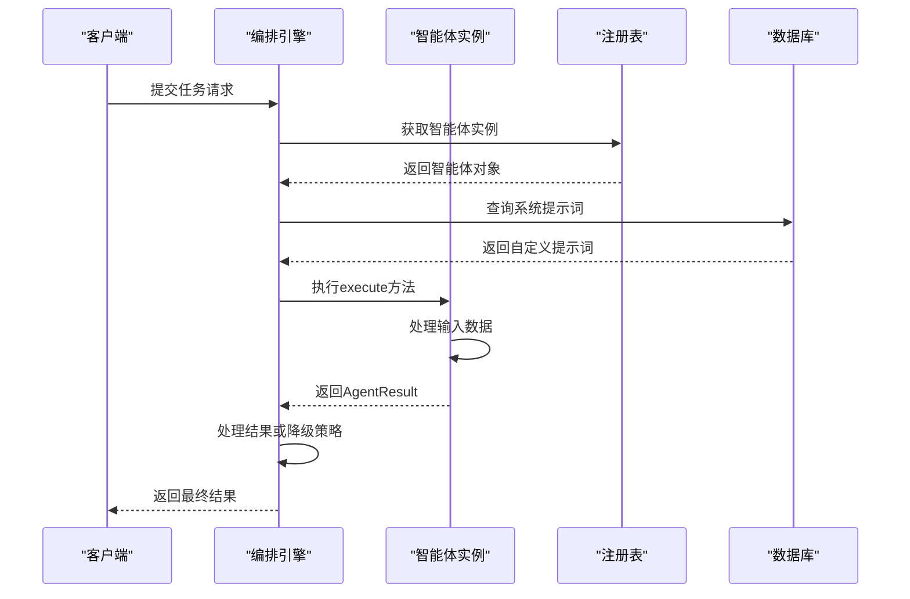
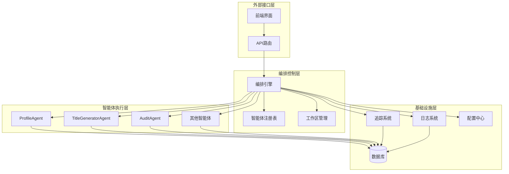
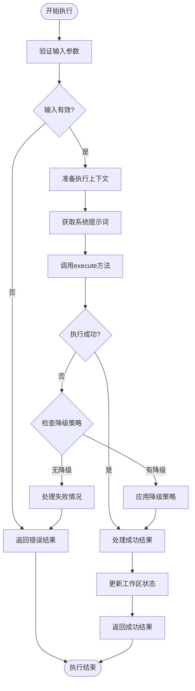
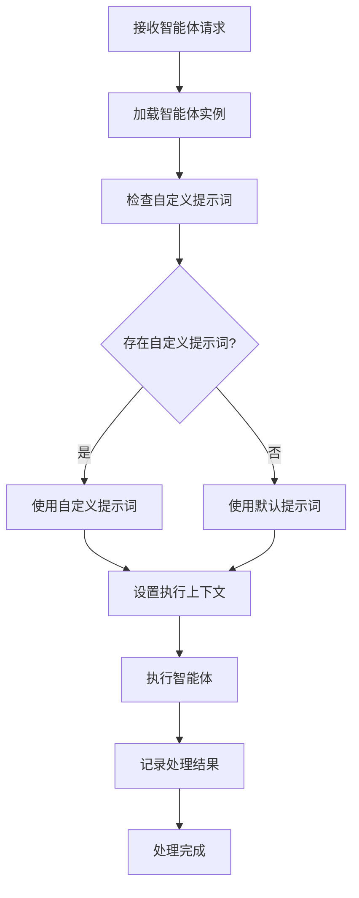
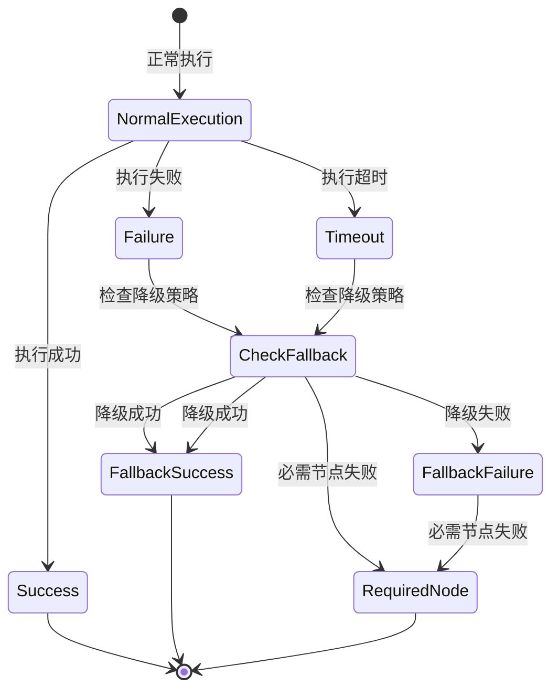
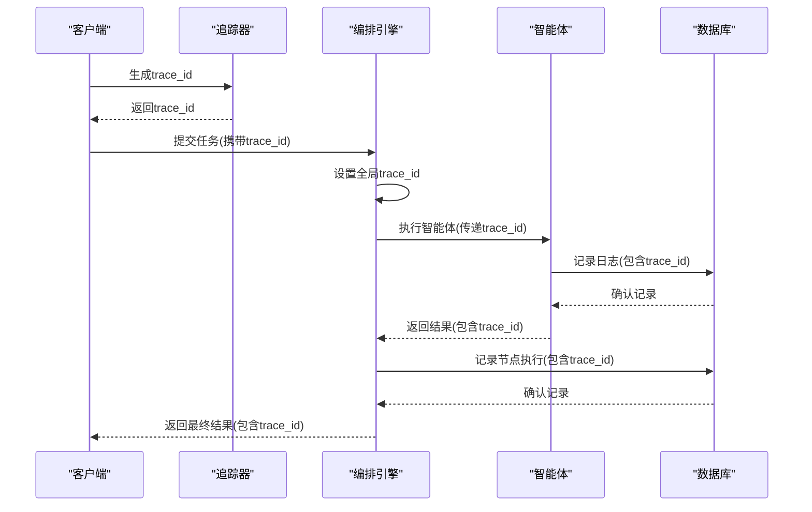
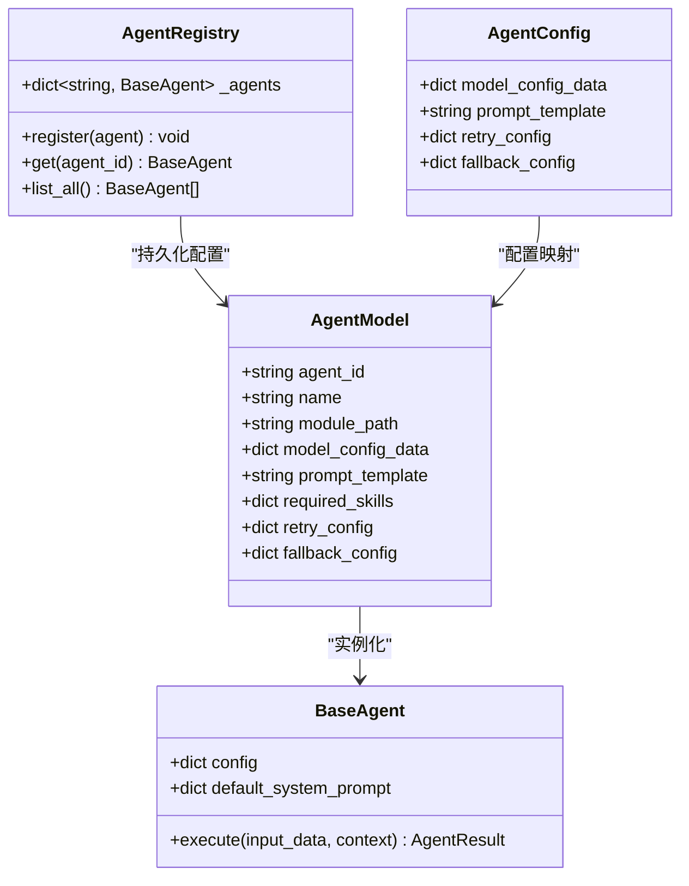
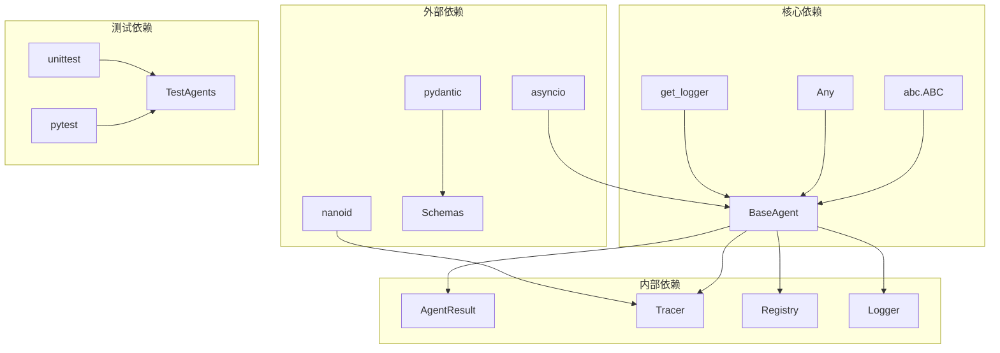

# 智能体基类设计

<cite>
**本文档引用的文件**
- [backend/app/agents/base.py](file://backend/app/agents/base.py)
- [backend/app/schemas/agent.py](file://backend/app/schemas/agent.py)
- [backend/app/core/tracer.py](file://backend/app/core/tracer.py)
- [backend/app/agents/audit_agent.py](file://backend/app/agents/audit_agent.py)
- [backend/app/agents/profile_agent.py](file://backend/app/agents/profile_agent.py)
- [backend/app/api/agent_routes.py](file://backend/app/api/agent_routes.py)
- [backend/app/orchestrator/engine.py](file://backend/app/orchestrator/engine.py)
- [backend/app/core/logger.py](file://backend/app/core/logger.py)
- [backend/app/skills/base.py](file://backend/app/skills/base.py)
- [backend/app/agents/registry.py](file://backend/app/agents/registry.py)
- [backend/app/models/tables.py](file://backend/app/models/tables.py)
- [backend/app/core/config.py](file://backend/app/core/config.py)
</cite>

## 目录
1. [简介](#简介)
2. [项目结构](#项目结构)
3. [核心组件](#核心组件)
4. [架构概览](#架构概览)
5. [详细组件分析](#详细组件分析)
6. [依赖分析](#依赖分析)
7. [性能考虑](#性能考虑)
8. [故障排除指南](#故障排除指南)
9. [结论](#结论)
10. [附录](#附录)

## 简介

HotClaw智能体基类设计是一个高度模块化的AI工作流框架，旨在为复杂的业务场景提供可扩展的智能体解决方案。该设计遵循"单一职责原则"，确保每个智能体只负责特定的业务任务，并通过标准化的接口实现松耦合集成。

本设计的核心理念是：
- **标准化接口**：统一的AgentResult结构和execute方法协议
- **可插拔架构**：支持动态注册和配置管理
- **降级策略**：完善的fallback机制确保系统稳定性
- **可观测性**：完整的追踪ID传播和日志记录
- **生命周期管理**：从创建到销毁的完整生命周期控制

## 项目结构

HotClaw项目采用分层架构设计，智能体基类位于后端应用的核心层：

**图表来源**
- [backend/app/agents/base.py:1-99](file://backend/app/agents/base.py#L1-L99)
- [backend/app/orchestrator/engine.py:1-285](file://backend/app/orchestrator/engine.py#L1-L285)
- [backend/app/core/tracer.py:1-34](file://backend/app/core/tracer.py#L1-L34)

**章节来源**
- [backend/app/agents/base.py:1-99](file://backend/app/agents/base.py#L1-L99)
- [backend/app/orchestrator/engine.py:1-285](file://backend/app/orchestrator/engine.py#L1-L285)

## 核心组件

### AgentResult标准化结果结构

AgentResult是HotClaw智能体系统的标准化输出格式，确保所有智能体返回一致的数据结构：

**图表来源**
- [backend/app/agents/base.py:18-99](file://backend/app/agents/base.py#L18-L99)
- [backend/app/agents/audit_agent.py:7-66](file://backend/app/agents/audit_agent.py#L7-L66)
- [backend/app/agents/profile_agent.py:10-73](file://backend/app/agents/profile_agent.py#L10-L73)

AgentResult的核心特性：
- **状态管理**：统一的状态码（success/failed）
- **追踪能力**：完整的trace_id传播机制
- **错误处理**：结构化的错误信息格式
- **数据封装**：灵活的数据承载能力

**章节来源**
- [backend/app/agents/base.py:18-47](file://backend/app/agents/base.py#L18-L47)

### BaseAgent抽象基类

BaseAgent作为所有智能体的抽象基类，定义了统一的接口规范和生命周期管理：

**图表来源**
- [backend/app/orchestrator/engine.py:92-235](file://backend/app/orchestrator/engine.py#L92-L235)
- [backend/app/agents/registry.py:23-28](file://backend/app/agents/registry.py#L23-L28)

**章节来源**
- [backend/app/agents/base.py:49-99](file://backend/app/agents/base.py#L49-L99)

## 架构概览

HotClaw智能体系统采用事件驱动的编排架构，实现了高度解耦的工作流执行：

**图表来源**
- [backend/app/orchestrator/engine.py:89-285](file://backend/app/orchestrator/engine.py#L89-L285)
- [backend/app/api/agent_routes.py:14-115](file://backend/app/api/agent_routes.py#L14-L115)

## 详细组件分析

### 执行协议与生命周期

智能体的执行协议严格定义了从输入到输出的完整流程：

**图表来源**
- [backend/app/orchestrator/engine.py:137-197](file://backend/app/orchestrator/engine.py#L137-L197)

### 系统提示词处理机制

系统提示词的优先级处理确保了灵活性和一致性：

**图表来源**
- [backend/app/orchestrator/engine.py:245-263](file://backend/app/orchestrator/engine.py#L245-L263)
- [backend/app/api/agent_routes.py:56-71](file://backend/app/api/agent_routes.py#L56-L71)

**章节来源**
- [backend/app/orchestrator/engine.py:140-145](file://backend/app/orchestrator/engine.py#L140-L145)

### 错误处理模式

智能体系统实现了多层次的错误处理机制：

**图表来源**
- [backend/app/orchestrator/engine.py:154-175](file://backend/app/orchestrator/engine.py#L154-L175)

**章节来源**
- [backend/app/agents/base.py:77-82](file://backend/app/agents/base.py#L77-L82)

### 追踪ID传播机制

追踪ID在整个执行链路中的传播确保了完整的可观测性：

**图表来源**
- [backend/app/core/tracer.py:10-34](file://backend/app/core/tracer.py#L10-L34)
- [backend/app/orchestrator/engine.py:97-98](file://backend/app/orchestrator/engine.py#L97-L98)

**章节来源**
- [backend/app/core/tracer.py:1-34](file://backend/app/core/tracer.py#L1-L34)

### 配置注入机制

智能体配置的动态注入提供了强大的定制能力：

**图表来源**
- [backend/app/api/agent_routes.py:74-115](file://backend/app/api/agent_routes.py#L74-L115)
- [backend/app/agents/registry.py:10-36](file://backend/app/agents/registry.py#L10-L36)

**章节来源**
- [backend/app/api/agent_routes.py:74-115](file://backend/app/api/agent_routes.py#L74-L115)

## 依赖分析

智能体基类的依赖关系体现了清晰的分层架构：

**图表来源**
- [backend/app/agents/base.py:11-15](file://backend/app/agents/base.py#L11-L15)
- [backend/app/core/tracer.py:3-4](file://backend/app/core/tracer.py#L3-L4)

**章节来源**
- [backend/app/agents/base.py:11-15](file://backend/app/agents/base.py#L11-L15)

## 性能考虑

智能体系统的性能优化主要体现在以下几个方面：

### 超时控制
- 默认执行超时时间：120秒
- 支持不同类型的超时配置（智能体、技能、LLM）

### 并发处理
- 异步执行模型确保高并发性能
- 上下文隔离避免资源竞争

### 缓存策略
- 系统提示词缓存减少重复查询
- 工作区状态缓存提高数据访问速度

## 故障排除指南

### 常见问题诊断

**智能体执行失败**
1. 检查智能体的fallback实现
2. 验证输入数据格式
3. 查看系统日志中的trace_id

**超时问题**
1. 检查agent_timeout配置
2. 优化智能体执行逻辑
3. 考虑增加超时时间

**配置错误**
1. 验证AgentModel配置
2. 检查数据库连接
3. 确认模块路径正确

**章节来源**
- [backend/app/orchestrator/engine.py:176-196](file://backend/app/orchestrator/engine.py#L176-L196)

## 结论

HotClaw智能体基类设计通过标准化的接口规范、完善的生命周期管理和强大的扩展机制，为构建复杂的AI工作流系统提供了坚实的基础。该设计的核心优势包括：

- **标准化输出**：统一的AgentResult结构确保了系统的可预测性
- **灵活配置**：动态的系统提示词和配置注入机制提供了强大的定制能力
- **稳健执行**：完整的错误处理和降级策略保证了系统的可靠性
- **可观测性**：全面的追踪ID传播和日志记录便于问题诊断
- **可扩展性**：清晰的抽象层次和接口设计支持大规模扩展

该设计为后续的功能扩展和技术演进奠定了良好的基础，能够适应不断变化的业务需求。

## 附录

### 继承指南

创建自定义智能体的基本步骤：

1. **继承BaseAgent**：实现抽象方法
2. **设置标识符**：定义agent_id、name、description
3. **配置默认提示词**：设置default_system_prompt
4. **实现execute方法**：处理业务逻辑
5. **实现fallback方法**：提供降级策略
6. **注册智能体**：添加到AgentRegistry

### 最佳实践

- **单一职责**：每个智能体只处理一个明确的业务任务
- **输入输出规范化**：严格遵循AgentResult格式
- **错误处理**：提供有意义的错误信息和降级策略
- **性能优化**：合理设置超时时间和资源限制
- **日志记录**：使用trace_id进行完整的执行追踪

### 扩展开发建议

- **插件化设计**：支持第三方智能体的动态加载
- **监控集成**：集成APM工具进行性能监控
- **安全审计**：添加输入验证和输出过滤
- **版本管理**：支持智能体的版本控制和回滚
- **测试框架**：建立完善的单元测试和集成测试体系