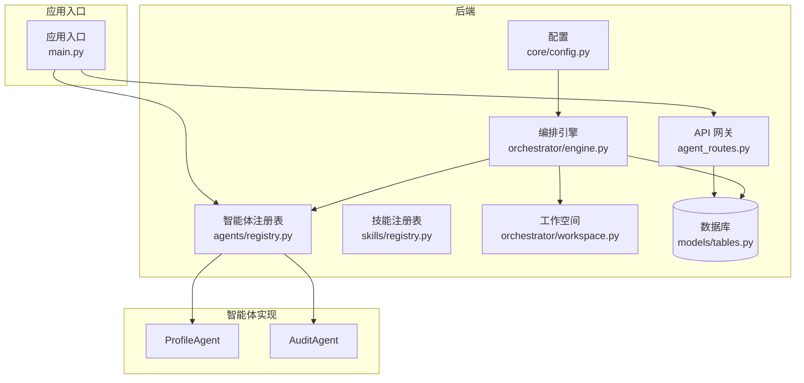
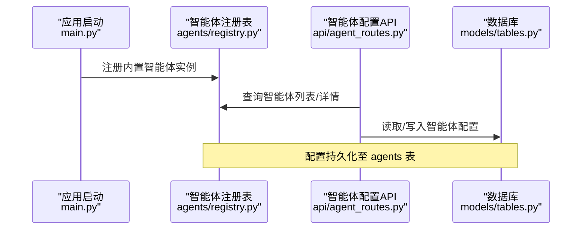
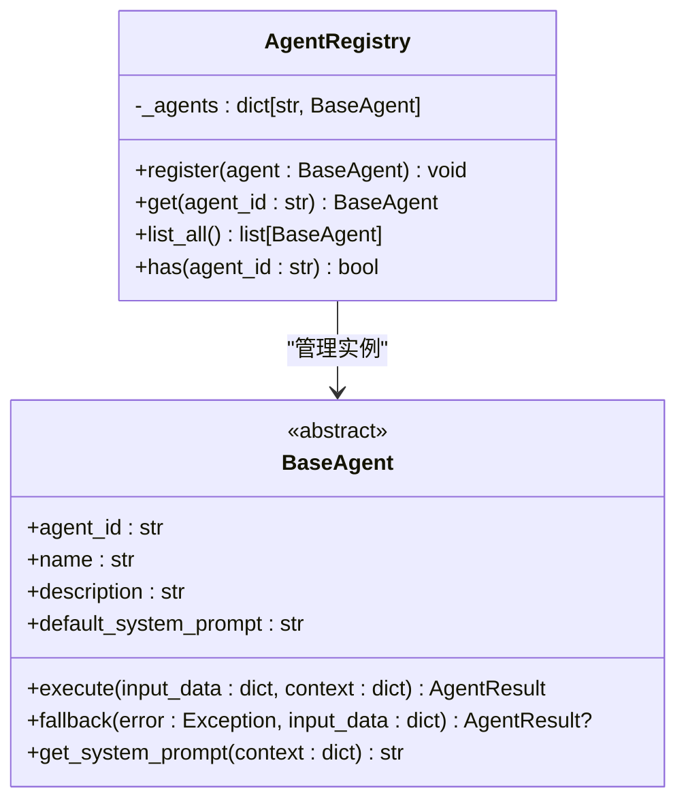
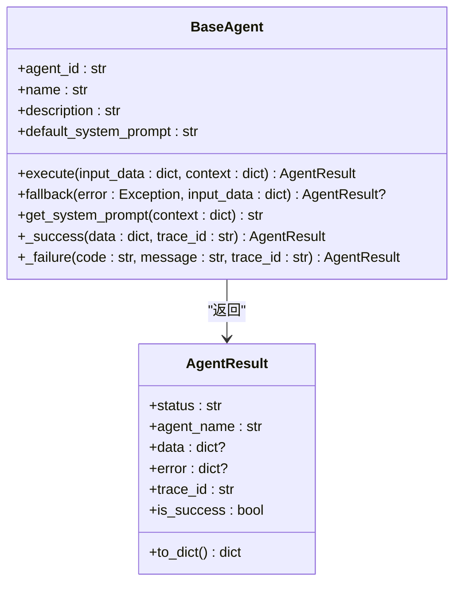
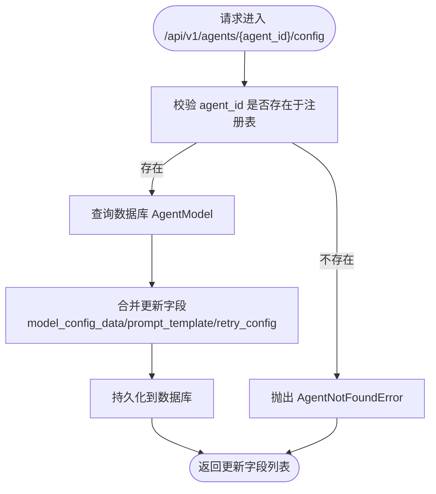
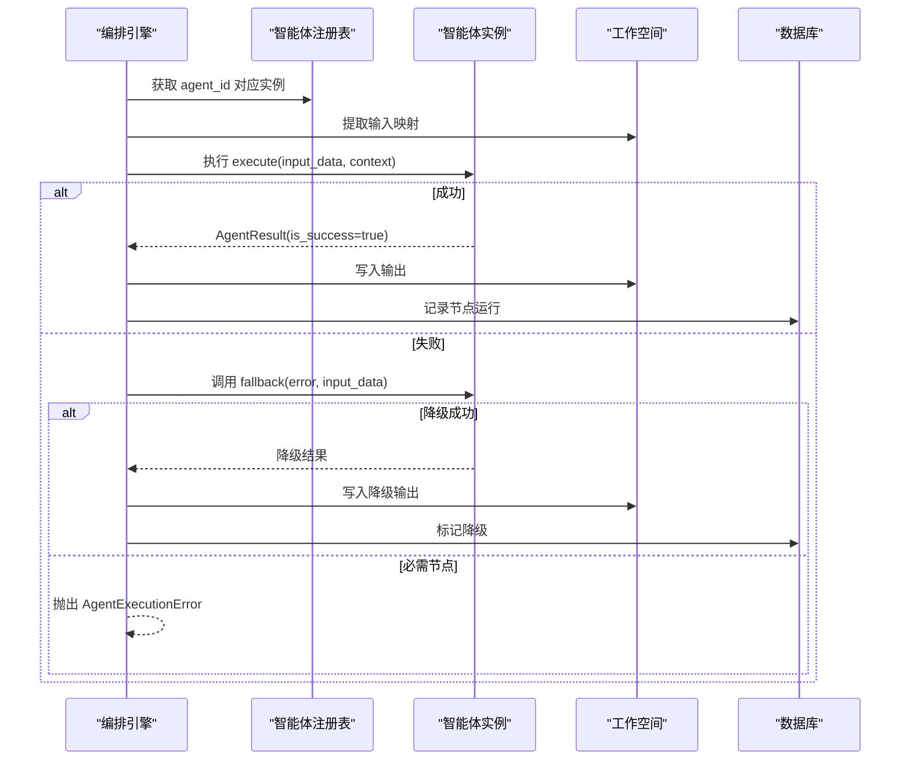
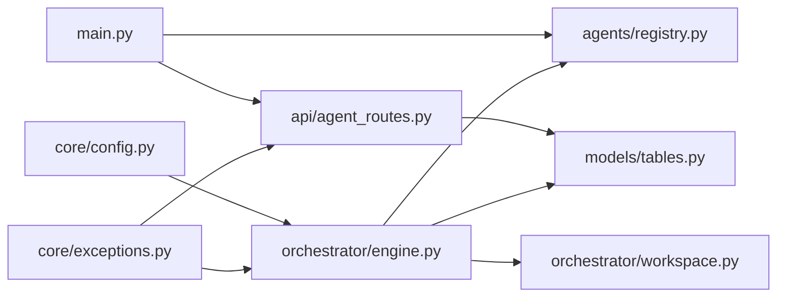

# 智能体注册机制

<cite>
**本文引用的文件**
- [backend/app/agents/registry.py](file://backend/app/agents/registry.py)
- [backend/app/agents/base.py](file://backend/app/agents/base.py)
- [backend/app/agents/profile_agent.py](file://backend/app/agents/profile_agent.py)
- [backend/app/agents/audit_agent.py](file://backend/app/agents/audit_agent.py)
- [backend/app/skills/registry.py](file://backend/app/skills/registry.py)
- [backend/app/skills/base.py](file://backend/app/skills/base.py)
- [backend/app/main.py](file://backend/app/main.py)
- [backend/app/api/agent_routes.py](file://backend/app/api/agent_routes.py)
- [backend/app/orchestrator/engine.py](file://backend/app/orchestrator/engine.py)
- [backend/app/orchestrator/workspace.py](file://backend/app/orchestrator/workspace.py)
- [backend/app/models/tables.py](file://backend/app/models/tables.py)
- [backend/app/schemas/agent.py](file://backend/app/schemas/agent.py)
- [backend/app/core/exceptions.py](file://backend/app/core/exceptions.py)
- [backend/app/core/config.py](file://backend/app/core/config.py)
- [ARCHITECTURE.md](file://ARCHITECTURE.md)
- [Notice.md](file://Notice.md)
</cite>

## 目录
1. [引言](#引言)
2. [项目结构](#项目结构)
3. [核心组件](#核心组件)
4. [架构总览](#架构总览)
5. [详细组件分析](#详细组件分析)
6. [依赖分析](#依赖分析)
7. [性能考量](#性能考量)
8. [故障排查指南](#故障排查指南)
9. [结论](#结论)
10. [附录](#附录)

## 引言
本文件围绕 HotClaw 智能体注册机制展开，系统性阐述智能体注册表的设计架构与动态加载流程，覆盖智能体发现、注册、实例化、配置管理、依赖注入与生命周期控制，以及元数据管理、版本控制与兼容性检查。同时提供扩展开发的完整流程、错误处理策略、性能优化建议与安全注意事项，并给出注册示例与最佳实践。

## 项目结构
HotClaw 后端采用模块化分层设计，智能体与技能分别位于独立模块，通过注册表集中管理，编排器在运行期按工作流顺序调度。应用启动时通过生命周期钩子完成注册，API 层提供智能体配置查询与更新能力，数据库持久化智能体元数据与运行记录。

图表来源
- [backend/app/main.py:32-58](file://backend/app/main.py#L32-L58)
- [backend/app/api/agent_routes.py:17-43](file://backend/app/api/agent_routes.py#L17-L43)
- [backend/app/orchestrator/engine.py:92-234](file://backend/app/orchestrator/engine.py#L92-L234)
- [backend/app/orchestrator/workspace.py:12-53](file://backend/app/orchestrator/workspace.py#L12-L53)
- [backend/app/models/tables.py:160-181](file://backend/app/models/tables.py#L160-L181)

章节来源
- [backend/app/main.py:1-142](file://backend/app/main.py#L1-L142)
- [ARCHITECTURE.md:414-448](file://ARCHITECTURE.md#L414-L448)

## 核心组件
- 智能体基类与结果封装：定义统一的执行接口、降级策略与标准化返回结构，确保智能体间行为一致性。
- 智能体注册表：集中管理智能体实例，提供注册、查询、枚举与存在性判断。
- 技能注册表：集中管理技能实例，提供注册、查询、枚举与存在性判断。
- 应用生命周期注册：在应用启动时导入并注册内置智能体实例。
- API 配置接口：提供智能体列表、详情与配置更新能力，结合数据库持久化配置。
- 编排引擎：按工作流顺序调度智能体，解析有效系统提示，执行并处理异常与降级。
- 工作空间：任务级上下文容器，支持数据提取映射与快照持久化。
- 数据模型：持久化智能体元数据、运行节点记录与系统日志。
- 配置与异常：统一配置读取与异常分类，保障运行期稳定性。

章节来源
- [backend/app/agents/base.py:18-99](file://backend/app/agents/base.py#L18-L99)
- [backend/app/agents/registry.py:10-39](file://backend/app/agents/registry.py#L10-L39)
- [backend/app/skills/base.py:16-37](file://backend/app/skills/base.py#L16-L37)
- [backend/app/skills/registry.py:10-37](file://backend/app/skills/registry.py#L10-L37)
- [backend/app/main.py:32-58](file://backend/app/main.py#L32-L58)
- [backend/app/api/agent_routes.py:17-115](file://backend/app/api/agent_routes.py#L17-L115)
- [backend/app/orchestrator/engine.py:89-285](file://backend/app/orchestrator/engine.py#L89-L285)
- [backend/app/orchestrator/workspace.py:12-53](file://backend/app/orchestrator/workspace.py#L12-L53)
- [backend/app/models/tables.py:160-181](file://backend/app/models/tables.py#L160-L181)
- [backend/app/core/config.py:7-51](file://backend/app/core/config.py#L7-L51)
- [backend/app/core/exceptions.py:4-125](file://backend/app/core/exceptions.py#L4-L125)

## 架构总览
智能体注册机制遵循“声明式注册 + 运行期调度”的设计：启动时通过导入模块完成实例化与注册，运行时由编排引擎按工作流节点拉取智能体实例并执行。配置通过数据库持久化，支持自定义提示词、模型参数与重试策略，API 层提供查询与更新能力。

图表来源
- [backend/app/main.py:32-58](file://backend/app/main.py#L32-L58)
- [backend/app/api/agent_routes.py:17-115](file://backend/app/api/agent_routes.py#L17-L115)
- [backend/app/models/tables.py:160-181](file://backend/app/models/tables.py#L160-L181)

## 详细组件分析

### 智能体注册表与生命周期
- 注册表职责：以 agent_id 为键存储智能体实例，提供注册、查询、枚举与存在性判断。
- 启动注册：应用生命周期钩子在启动时导入并注册内置智能体实例，确保运行期可调度。
- 查询与异常：查询不存在的智能体会抛出自定义异常，便于上层处理。

图表来源
- [backend/app/agents/registry.py:10-39](file://backend/app/agents/registry.py#L10-L39)
- [backend/app/agents/base.py:49-99](file://backend/app/agents/base.py#L49-L99)

章节来源
- [backend/app/agents/registry.py:10-39](file://backend/app/agents/registry.py#L10-L39)
- [backend/app/main.py:32-58](file://backend/app/main.py#L32-L58)
- [backend/app/core/exceptions.py:31-43](file://backend/app/core/exceptions.py#L31-L43)

### 智能体基类与结果封装
- 统一接口：execute(input_data, context) 返回标准化 AgentResult，包含状态、名称、数据、错误与追踪 ID。
- 降级策略：fallback(error, input_data) 可返回降级结果，避免整条链路中断。
- 系统提示解析：支持从上下文或默认提示中解析有效提示词。

图表来源
- [backend/app/agents/base.py:18-99](file://backend/app/agents/base.py#L18-L99)

章节来源
- [backend/app/agents/base.py:18-99](file://backend/app/agents/base.py#L18-L99)

### 智能体实现示例（ProfileAgent/AuditAgent）
- ProfileAgent：解析账号定位为结构化画像，提供默认系统提示与降级策略。
- AuditAgent：对生成内容进行合规性审核，提供默认系统提示与降级策略。

章节来源
- [backend/app/agents/profile_agent.py:10-73](file://backend/app/agents/profile_agent.py#L10-L73)
- [backend/app/agents/audit_agent.py:7-66](file://backend/app/agents/audit_agent.py#L7-L66)

### 技能注册表与基类
- 技能注册表：集中管理技能实例，提供注册、查询、枚举与存在性判断。
- 技能基类：定义统一执行接口，强调无状态与原子能力。

章节来源
- [backend/app/skills/registry.py:10-37](file://backend/app/skills/registry.py#L10-L37)
- [backend/app/skills/base.py:16-37](file://backend/app/skills/base.py#L16-L37)

### API 配置与元数据管理
- 列表与详情：返回智能体基础信息、版本、状态与自定义提示存在性；详情支持合并数据库自定义提示与默认提示。
- 配置更新：支持更新模型配置、提示词模板与重试配置，空字符串表示重置为默认。
- 数据模型：agents 表持久化智能体元数据，包含版本、模块路径、输入/输出 Schema、所需技能、重试与降级配置等。

图表来源
- [backend/app/api/agent_routes.py:74-115](file://backend/app/api/agent_routes.py#L74-L115)
- [backend/app/models/tables.py:160-181](file://backend/app/models/tables.py#L160-L181)
- [backend/app/core/exceptions.py:31-43](file://backend/app/core/exceptions.py#L31-L43)

章节来源
- [backend/app/api/agent_routes.py:17-115](file://backend/app/api/agent_routes.py#L17-L115)
- [backend/app/models/tables.py:160-181](file://backend/app/models/tables.py#L160-L181)
- [backend/app/schemas/agent.py:6-29](file://backend/app/schemas/agent.py#L6-L29)

### 编排引擎与工作流调度
- 默认工作流：线性链式节点定义，编排引擎按序调度。
- 节点执行：从工作空间提取输入，解析有效系统提示，执行智能体并处理成功/失败/超时/异常。
- 降级与容错：失败时尝试智能体降级策略，必要时终止并上报错误。
- 广播与持久化：节点状态通过广播通知前端，节点运行记录持久化至数据库。

图表来源
- [backend/app/orchestrator/engine.py:92-234](file://backend/app/orchestrator/engine.py#L92-L234)
- [backend/app/orchestrator/workspace.py:36-53](file://backend/app/orchestrator/workspace.py#L36-L53)
- [backend/app/agents/registry.py:23-28](file://backend/app/agents/registry.py#L23-L28)

章节来源
- [backend/app/orchestrator/engine.py:89-285](file://backend/app/orchestrator/engine.py#L89-L285)
- [backend/app/orchestrator/workspace.py:12-53](file://backend/app/orchestrator/workspace.py#L12-L53)

### 配置管理、依赖注入与生命周期控制
- 配置优先：系统提示优先使用数据库自定义模板，其次使用智能体默认模板。
- 依赖注入：编排引擎通过注册表获取智能体实例，技能通过技能注册表获取。
- 生命周期：应用启动时注册智能体，运行期按任务创建工作空间，任务完成后归档。

章节来源
- [backend/app/orchestrator/engine.py:245-263](file://backend/app/orchestrator/engine.py#L245-L263)
- [backend/app/main.py:32-58](file://backend/app/main.py#L32-L58)

### 元数据管理、版本控制与兼容性检查
- 元数据：agents 表包含 agent_id、name、description、version、module_path、Schema、所需技能、状态等。
- 版本控制：version 字段用于标识智能体版本，API 层返回固定版本号供前端展示。
- 兼容性：输入/输出 Schema 与 required_skills 字段可用于运行期校验与兼容性检查。

章节来源
- [backend/app/models/tables.py:160-181](file://backend/app/models/tables.py#L160-L181)
- [backend/app/api/agent_routes.py:30-43](file://backend/app/api/agent_routes.py#L30-L43)

## 依赖分析
- 模块耦合：编排引擎依赖注册表与工作空间；API 层依赖注册表与数据库；应用入口依赖注册表完成启动注册。
- 外部依赖：配置模块提供超时与模型参数；异常模块提供统一错误分类；数据库模型提供持久化能力。

图表来源
- [backend/app/main.py:32-58](file://backend/app/main.py#L32-L58)
- [backend/app/api/agent_routes.py:17-43](file://backend/app/api/agent_routes.py#L17-L43)
- [backend/app/orchestrator/engine.py:92-234](file://backend/app/orchestrator/engine.py#L92-L234)
- [backend/app/orchestrator/workspace.py:12-53](file://backend/app/orchestrator/workspace.py#L12-L53)
- [backend/app/models/tables.py:160-181](file://backend/app/models/tables.py#L160-L181)
- [backend/app/core/config.py:7-51](file://backend/app/core/config.py#L7-L51)
- [backend/app/core/exceptions.py:4-125](file://backend/app/core/exceptions.py#L4-L125)

章节来源
- [backend/app/main.py:1-142](file://backend/app/main.py#L1-L142)
- [ARCHITECTURE.md:414-448](file://ARCHITECTURE.md#L414-L448)

## 性能考量
- 超时控制：编排引擎对智能体执行设置超时，避免阻塞；配置模块提供全局超时参数。
- 降级策略：智能体提供降级返回，降低失败对整体性能的影响。
- 广播与持久化：节点状态广播与运行记录持久化需注意 I/O 压力，建议异步写入与批处理。

章节来源
- [backend/app/orchestrator/engine.py:236-243](file://backend/app/orchestrator/engine.py#L236-L243)
- [backend/app/core/config.py:42-46](file://backend/app/core/config.py#L42-L46)

## 故障排查指南
- 未找到智能体：API 查询或编排引擎调度时可能抛出智能体未找到异常，需确认注册表中是否存在该 agent_id。
- 执行异常与超时：编排引擎捕获执行异常与超时，必要时终止并上报；可通过日志与节点运行记录定位问题。
- 配置错误：提示词模板为空字符串表示重置为默认；更新配置后需确认数据库记录是否正确。

章节来源
- [backend/app/core/exceptions.py:31-43](file://backend/app/core/exceptions.py#L31-L43)
- [backend/app/orchestrator/engine.py:176-196](file://backend/app/orchestrator/engine.py#L176-L196)
- [backend/app/api/agent_routes.py:96-114](file://backend/app/api/agent_routes.py#L96-L114)

## 结论
HotClaw 的智能体注册机制以注册表为核心，结合声明式注册与运行期调度，实现了稳定的智能体生命周期管理与配置化控制。通过统一的基类与结果封装、完善的异常处理与降级策略、以及数据库驱动的元数据管理，系统在 MVP 阶段即具备良好的可维护性与扩展性。后续可在保持现有协议与分层的前提下，逐步引入更复杂的动态加载与版本治理能力。

## 附录

### 扩展开发流程（新增智能体）
- 定义智能体类：继承智能体基类，实现执行与可选降级策略，设置 agent_id、name、description 与默认系统提示。
- 注册智能体：在应用启动注册函数中导入并注册实例，或通过声明式注册机制（如 manifest）动态加载。
- 配置持久化：通过 API 更新智能体配置，数据库自动保存模型参数、提示词模板与重试策略。
- 测试验证：编写正常与异常场景测试，确保输出结构化、错误可解释、日志可追踪。

章节来源
- [backend/app/agents/base.py:49-99](file://backend/app/agents/base.py#L49-L99)
- [backend/app/main.py:32-58](file://backend/app/main.py#L32-L58)
- [backend/app/api/agent_routes.py:74-115](file://backend/app/api/agent_routes.py#L74-L115)
- [Notice.md:373-395](file://Notice.md#L373-L395)

### 配置文件格式与字段说明
- agents 表字段：agent_id、name、description、version、module_path、model_config_data、prompt_template、input_schema、output_schema、required_skills、retry_config、fallback_config、status。
- API 请求体：支持更新 model_config_data、prompt_template、retry_config；空字符串表示重置为默认。

章节来源
- [backend/app/models/tables.py:160-181](file://backend/app/models/tables.py#L160-L181)
- [backend/app/schemas/agent.py:24-29](file://backend/app/schemas/agent.py#L24-L29)
- [backend/app/api/agent_routes.py:74-115](file://backend/app/api/agent_routes.py#L74-L115)

### 安全与合规要点
- 配置与密钥：敏感信息通过配置模块与环境变量读取，避免硬编码。
- 输入输出协议：严格结构化输出，统一错误返回格式，避免泄露内部细节。
- 日志与追踪：启用任务级与节点级追踪，区分错误日志与业务日志，便于审计与回放。

章节来源
- [backend/app/core/config.py:7-51](file://backend/app/core/config.py#L7-L51)
- [Notice.md:190-242](file://Notice.md#L190-L242)
- [Notice.md:342-371](file://Notice.md#L342-L371)