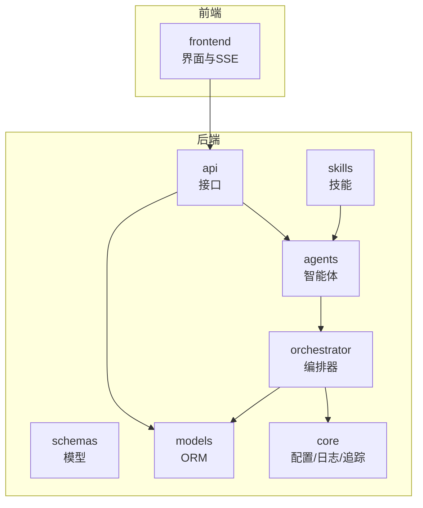
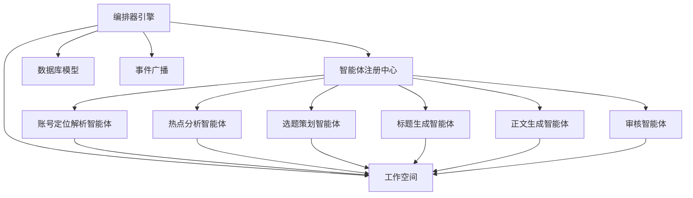
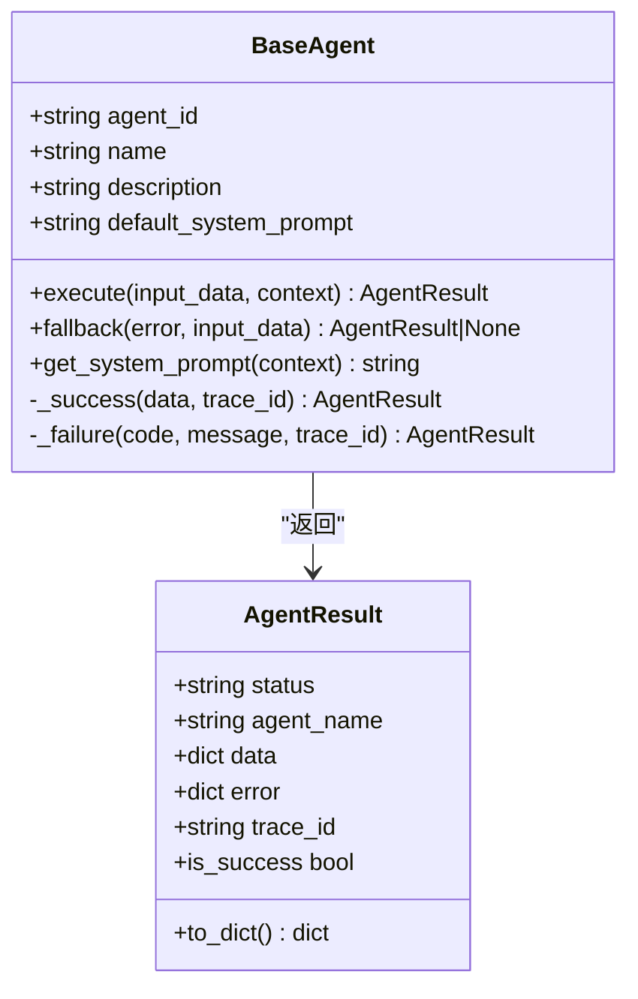
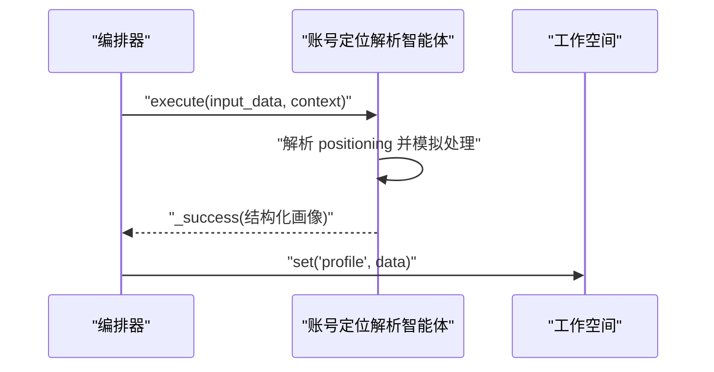
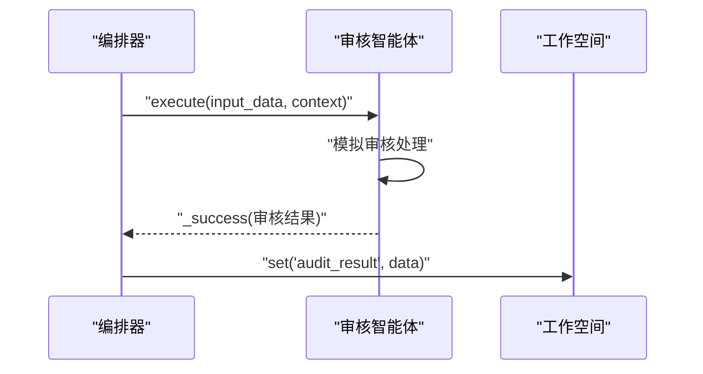
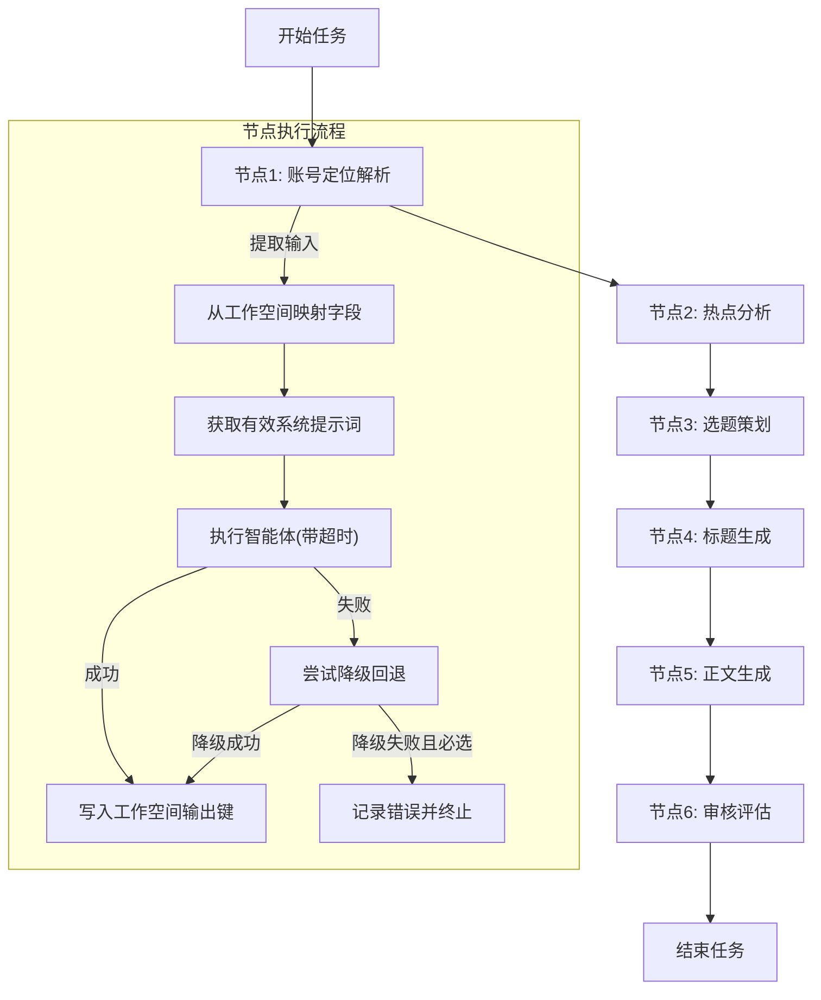
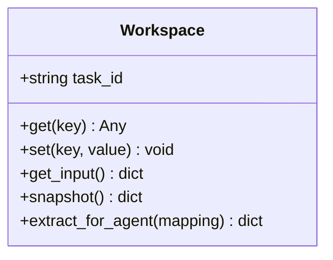
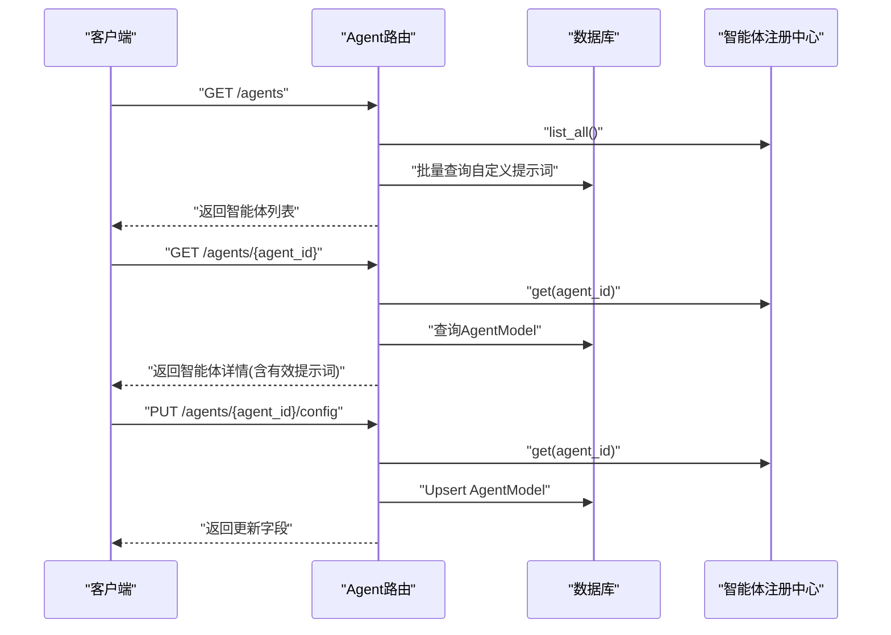
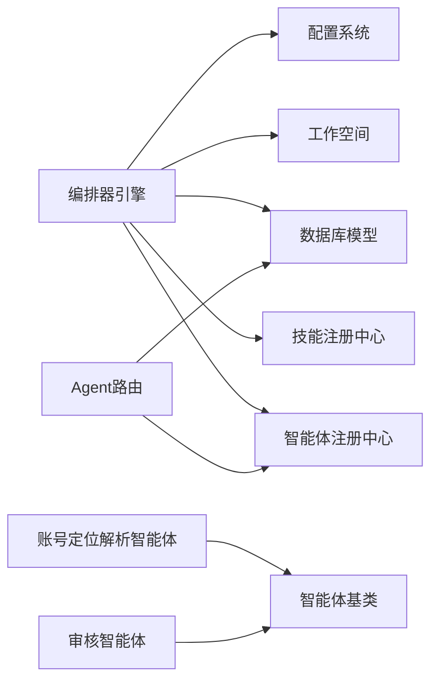

# 智能体系统

<cite>
**本文引用的文件**
- [backend/app/agents/base.py](file://backend/app/agents/base.py)
- [backend/app/agents/profile_agent.py](file://backend/app/agents/profile_agent.py)
- [backend/app/agents/audit_agent.py](file://backend/app/agents/audit_agent.py)
- [backend/app/agents/registry.py](file://backend/app/agents/registry.py)
- [backend/app/orchestrator/engine.py](file://backend/app/orchestrator/engine.py)
- [backend/app/orchestrator/workspace.py](file://backend/app/orchestrator/workspace.py)
- [backend/app/api/agent_routes.py](file://backend/app/api/agent_routes.py)
- [backend/app/schemas/agent.py](file://backend/app/schemas/agent.py)
- [backend/app/skills/base.py](file://backend/app/skills/base.py)
- [backend/app/skills/registry.py](file://backend/app/skills/registry.py)
- [backend/app/models/tables.py](file://backend/app/models/tables.py)
- [backend/app/core/config.py](file://backend/app/core/config.py)
</cite>

## 目录
1. [简介](#简介)
2. [项目结构](#项目结构)
3. [核心组件](#核心组件)
4. [架构总览](#架构总览)
5. [详细组件分析](#详细组件分析)
6. [依赖分析](#依赖分析)
7. [性能考虑](#性能考虑)
8. [故障排查指南](#故障排查指南)
9. [结论](#结论)
10. [附录](#附录)

## 简介
本技术文档面向 HotClaw 智能体系统，系统采用“编排器 + 智能体 + 技能 + 工作空间”的分层架构，围绕任务生命周期进行节点式编排。智能体遵循统一接口规范，具备标准结果封装、可插拔的系统提示词解析、可选降级回退能力；编排器负责线性顺序执行、超时控制、错误传播与降级记录、事件广播与追踪；工作空间提供任务级上下文容器，支持字段映射提取与快照持久化；技能作为工具能力被智能体调用；系统通过 API 提供智能体配置查询与更新能力，并持久化到数据库。

## 项目结构
- 后端主体位于 backend/app，包含 agents（智能体）、skills（技能）、orchestrator（编排）、api（接口）、schemas（模型）、models（ORM）、core（配置/日志/追踪）等模块。
- 前端位于 frontend，提供可视化界面与实时事件展示。
- 资产与清单位于 hotclaw_named_assets_pack、manifests 等目录，用于资源与元数据管理。

章节来源
- [backend/app/agents/base.py:1-99](file://backend/app/agents/base.py#L1-L99)
- [backend/app/orchestrator/engine.py:1-285](file://backend/app/orchestrator/engine.py#L1-L285)
- [backend/app/models/tables.py:1-233](file://backend/app/models/tables.py#L1-L233)

## 核心组件
- 智能体基类与结果封装：定义统一的执行接口、系统提示词解析、成功/失败封装以及可选降级回退。
- 编排器引擎：线性顺序执行默认工作流节点，注入系统提示词，处理超时与异常，记录节点运行与任务完成事件。
- 工作空间：任务级上下文容器，支持输入映射提取与快照。
- 注册中心：集中管理智能体与技能实例，提供查询与列表能力。
- API 层：提供智能体列表、详情与配置更新接口，结合数据库持久化。
- 数据模型：定义任务、节点运行、账号画像、话题候选、文章草稿、审核结果等表结构。
- 配置系统：从环境变量加载应用配置，含 LLM、超时、数据库、Redis 等参数。

章节来源
- [backend/app/agents/base.py:49-99](file://backend/app/agents/base.py#L49-L99)
- [backend/app/orchestrator/engine.py:89-285](file://backend/app/orchestrator/engine.py#L89-L285)
- [backend/app/orchestrator/workspace.py:12-53](file://backend/app/orchestrator/workspace.py#L12-L53)
- [backend/app/agents/registry.py:10-40](file://backend/app/agents/registry.py#L10-L40)
- [backend/app/api/agent_routes.py:17-115](file://backend/app/api/agent_routes.py#L17-L115)
- [backend/app/models/tables.py:23-233](file://backend/app/models/tables.py#L23-L233)
- [backend/app/core/config.py:7-51](file://backend/app/core/config.py#L7-L51)

## 架构总览
系统以编排器为核心，串联多个智能体节点，每个节点在工作空间内读取上游输出并写入下游消费的数据键。编排器负责：
- 解析有效系统提示词（优先数据库自定义，其次智能体默认）
- 为每个节点创建运行记录并广播开始/完成/错误事件
- 执行超时控制与异常捕获
- 在必要时触发智能体降级回退策略
- 累计令牌消耗并记录任务耗时

图表来源
- [backend/app/orchestrator/engine.py:89-285](file://backend/app/orchestrator/engine.py#L89-L285)
- [backend/app/orchestrator/workspace.py:12-53](file://backend/app/orchestrator/workspace.py#L12-L53)
- [backend/app/agents/registry.py:10-40](file://backend/app/agents/registry.py#L10-L40)

章节来源
- [backend/app/orchestrator/engine.py:31-86](file://backend/app/orchestrator/engine.py#L31-L86)
- [backend/app/orchestrator/engine.py:92-234](file://backend/app/orchestrator/engine.py#L92-L234)

## 详细组件分析

### 智能体基类与结果封装
- 接口规范
  - execute(input_data: dict, context: dict) -> AgentResult：统一异步执行入口，输入为结构化数据，上下文为只读引用的前序输出。
  - fallback(error: Exception, input_data: dict) -> AgentResult | None：失败时的降级策略，默认返回 None。
  - get_system_prompt(context: dict) -> str：从上下文中提取系统提示词，若无则回退到智能体默认值。
  - 结果封装：AgentResult 包含状态、智能体标识、数据、错误对象与追踪 ID，并提供 is_success 判断。
- 设计要点
  - 单一职责：每个智能体专注一个业务任务，输入/输出清晰，返回结构化 JSON。
  - 可降级：失败时可提供安全回退，避免整条链路中断。
  - 可观测：通过追踪 ID 与日志记录，便于问题定位。

图表来源
- [backend/app/agents/base.py:18-99](file://backend/app/agents/base.py#L18-L99)

章节来源
- [backend/app/agents/base.py:49-99](file://backend/app/agents/base.py#L49-L99)

### 账号定位解析智能体
- 角色与职责：将用户提供的账号定位描述解析为结构化画像，包含领域、子域、受众、调性、风格、关键词等。
- 执行流程：读取 input_data 的 positioning 字段，模拟处理延迟后返回固定结构化数据。
- 降级策略：当执行失败时，返回兜底画像（泛资讯、通用受众等），保证后续流程可用。

图表来源
- [backend/app/orchestrator/engine.py:137-159](file://backend/app/orchestrator/engine.py#L137-L159)
- [backend/app/agents/profile_agent.py:42-61](file://backend/app/agents/profile_agent.py#L42-L61)

章节来源
- [backend/app/agents/profile_agent.py:10-73](file://backend/app/agents/profile_agent.py#L10-L73)

### 审核智能体
- 角色与职责：对生成的标题与正文进行合规性审核，输出通过与否、风险等级、问题列表与综合评价。
- 执行流程：模拟处理延迟后返回通过审核的结果。
- 降级策略：当执行失败时，返回需要人工复核的降级结果，确保流程可控。

图表来源
- [backend/app/orchestrator/engine.py:137-175](file://backend/app/orchestrator/engine.py#L137-L175)
- [backend/app/agents/audit_agent.py:48-57](file://backend/app/agents/audit_agent.py#L48-L57)

章节来源
- [backend/app/agents/audit_agent.py:7-66](file://backend/app/agents/audit_agent.py#L7-L66)

### 编排器引擎与工作流
- 默认工作流节点（线性链路）：账号定位解析 → 热点分析 → 选题策划 → 标题生成 → 正文生成 → 审核评估。
- 执行细节
  - 为每个节点创建运行记录，广播开始事件。
  - 从工作空间按字段映射提取输入，注入系统提示词（优先自定义）。
  - 执行带超时的智能体调用；失败时尝试 fallback；必选节点失败直接抛错并记录。
  - 成功时写入工作空间输出键；完成后广播完成事件并累计令牌。
  - 任务结束后持久化结果与统计信息。
- 超时与异常
  - 使用设置中的 agent_timeout 控制单节点执行时限。
  - 捕获超时、执行异常与未知异常，必要时终止并记录错误。

图表来源
- [backend/app/orchestrator/engine.py:92-234](file://backend/app/orchestrator/engine.py#L92-L234)
- [backend/app/orchestrator/workspace.py:36-52](file://backend/app/orchestrator/workspace.py#L36-L52)

章节来源
- [backend/app/orchestrator/engine.py:31-86](file://backend/app/orchestrator/engine.py#L31-L86)
- [backend/app/orchestrator/engine.py:236-264](file://backend/app/orchestrator/engine.py#L236-L264)

### 工作空间
- 功能：隔离的任务上下文容器，支持读取/写入、快照与按映射提取输入。
- 关键方法
  - get/set：读写任意键值。
  - snapshot：返回当前上下文快照，供持久化。
  - extract_for_agent：根据字段映射从工作空间抽取输入，支持引用原始输入的 input.* 键路径。

图表来源
- [backend/app/orchestrator/workspace.py:12-53](file://backend/app/orchestrator/workspace.py#L12-L53)

章节来源
- [backend/app/orchestrator/workspace.py:19-52](file://backend/app/orchestrator/workspace.py#L19-L52)

### 智能体注册机制与配置管理
- 注册中心
  - 以 agent_id 为键维护智能体实例，提供注册、查询、列表与存在性检查。
- API 接口
  - 列出所有已注册智能体，并批量查询数据库中的自定义提示词。
  - 获取单个智能体详情，合并数据库中的自定义提示词与默认提示词。
  - 更新智能体配置：模型配置、提示词模板、重试配置等；空字符串表示重置为默认。
- 数据模型
  - AgentModel：持久化智能体元数据、模块路径、提示词模板、输入/输出模式、所需技能、重试/降级配置等。

图表来源
- [backend/app/api/agent_routes.py:17-115](file://backend/app/api/agent_routes.py#L17-L115)
- [backend/app/agents/registry.py:23-32](file://backend/app/agents/registry.py#L23-L32)
- [backend/app/models/tables.py:160-181](file://backend/app/models/tables.py#L160-L181)

章节来源
- [backend/app/api/agent_routes.py:17-115](file://backend/app/api/agent_routes.py#L17-L115)
- [backend/app/agents/registry.py:16-35](file://backend/app/agents/registry.py#L16-L35)
- [backend/app/models/tables.py:160-181](file://backend/app/models/tables.py#L160-L181)

### 技能系统
- 基类与注册中心
  - BaseSkill：定义技能抽象接口，统一异步执行能力。
  - SkillRegistry：集中管理技能实例，提供注册、查询、列表与存在性检查。
- 设计原则
  - 技能为工具型能力，不参与编排，输出稳定可复用。

章节来源
- [backend/app/skills/base.py:16-37](file://backend/app/skills/base.py#L16-L37)
- [backend/app/skills/registry.py:10-37](file://backend/app/skills/registry.py#L10-L37)

### 数据模型与持久化
- 核心表
  - 任务表：记录任务全生命周期、状态、输入/输出、耗时与令牌统计。
  - 节点运行表：记录每个节点的执行状态、输入/输出、错误、降级标记与耗时。
  - 账号画像表：持久化账号定位解析后的结构化画像。
  - 话题候选表：持久化选题策划阶段的候选主题。
  - 文章草稿表：持久化标题与正文，关联审核结果。
  - 审核结果表：持久化审核通过与否、风险等级与问题列表。
  - 智能体/技能/工作流模板表：持久化配置与元数据。
- 用途
  - 支持任务回溯、节点重放、审计与统计分析。

章节来源
- [backend/app/models/tables.py:23-233](file://backend/app/models/tables.py#L23-L233)

## 依赖分析
- 组件耦合
  - 编排器依赖注册中心获取智能体实例，依赖工作空间进行数据交换，依赖数据库持久化节点运行与任务状态，依赖配置系统进行超时控制。
  - 智能体仅依赖基类与日志，不直接依赖编排器，保持解耦。
  - API 层依赖注册中心与数据库模型，提供配置查询与更新。
- 外部依赖
  - 数据库（SQLAlchemy/Async）、Redis（事件广播）、LLM（通过配置项接入）。

图表来源
- [backend/app/orchestrator/engine.py:18-26](file://backend/app/orchestrator/engine.py#L18-L26)
- [backend/app/api/agent_routes.py:10-12](file://backend/app/api/agent_routes.py#L10-L12)
- [backend/app/agents/base.py:11-13](file://backend/app/agents/base.py#L11-L13)

章节来源
- [backend/app/orchestrator/engine.py:18-26](file://backend/app/orchestrator/engine.py#L18-L26)
- [backend/app/api/agent_routes.py:10-12](file://backend/app/api/agent_routes.py#L10-L12)
- [backend/app/agents/base.py:11-13](file://backend/app/agents/base.py#L11-L13)

## 性能考虑
- 超时控制：为每个智能体节点设置独立超时，避免阻塞整条链路。
- 令牌统计：在节点运行记录中累加提示与补全令牌，便于成本与性能分析。
- 事件广播：通过 SSE 实时反馈节点进度，降低轮询开销。
- 数据库写入：批量查询与一次性 flush，减少 IO 次数。
- 降级策略：在非必选节点失败时启用降级回退，保障主流程可用性。

章节来源
- [backend/app/core/config.py:42-46](file://backend/app/core/config.py#L42-L46)
- [backend/app/orchestrator/engine.py:211-216](file://backend/app/orchestrator/engine.py#L211-L216)
- [backend/app/orchestrator/engine.py:176-196](file://backend/app/orchestrator/engine.py#L176-L196)

## 故障排查指南
- 节点超时
  - 现象：节点状态为 failed，错误消息包含超时信息。
  - 处理：检查智能体执行复杂度与外部依赖响应时间，适当提高超时阈值或优化执行逻辑。
- 执行失败
  - 现象：节点状态为 failed，记录错误消息；必选节点会中断任务。
  - 处理：查看智能体 fallback 是否生效；确认系统提示词与输入映射正确；检查数据库自定义提示词是否冲突。
- 事件未推送
  - 现象：前端无进度显示。
  - 处理：确认事件广播通道与 SSE 连接正常；检查编排器广播逻辑与任务 ID。
- 配置未生效
  - 现象：提示词未按预期变化。
  - 处理：确认数据库中 AgentModel.prompt_template 是否存在；空字符串表示重置为默认。

章节来源
- [backend/app/orchestrator/engine.py:176-196](file://backend/app/orchestrator/engine.py#L176-L196)
- [backend/app/orchestrator/engine.py:124-132](file://backend/app/orchestrator/engine.py#L124-L132)
- [backend/app/api/agent_routes.py:74-115](file://backend/app/api/agent_routes.py#L74-L115)

## 结论
HotClaw 智能体系统通过清晰的智能体基类、可插拔的系统提示词解析、严格的节点编排与降级策略，实现了高内聚、低耦合的任务流水线。配合工作空间的数据共享、数据库的持久化与 API 的配置管理，系统具备良好的可观测性、可扩展性与可维护性。未来可在工作流模板化、并行执行、重试与熔断策略等方面进一步增强。

## 附录

### 智能体开发最佳实践
- 单一职责：每个智能体只做一件事，输入输出结构化、可测试。
- 明确提示词：提供 default_system_prompt，并允许通过数据库覆盖；在上下文中注入 trace_id 以便追踪。
- 异常与降级：显式捕获异常并提供 fallback；非必选节点失败时尽量降级而非中断。
- 性能与可观测：记录节点耗时与令牌；避免长耗时阻塞；使用 SSE 广播进度。
- 测试与验证：为 execute 与 fallback 编写单元测试，覆盖正常与异常分支。

### 智能体扩展开发步骤
- 新建智能体类
  - 继承 BaseAgent，设置 agent_id、name、description、default_system_prompt。
  - 实现 execute 方法，返回 _success 或 _failure。
  - 如需，实现 fallback 方法提供降级回退。
- 注册智能体
  - 在启动阶段或初始化流程中将实例注册到 AgentRegistry。
- 配置与持久化
  - 通过 API 更新 AgentModel 的 prompt_template、model_config_data、retry_config 等。
- 加入工作流
  - 在 DEFAULT_WORKFLOW_NODES 中添加节点定义，配置 input_mapping 与 output_key。
- 验证与监控
  - 使用 SSE 查看节点事件；检查数据库节点运行记录与任务结果。

章节来源
- [backend/app/agents/base.py:49-99](file://backend/app/agents/base.py#L49-L99)
- [backend/app/agents/registry.py:16-21](file://backend/app/agents/registry.py#L16-L21)
- [backend/app/api/agent_routes.py:74-115](file://backend/app/api/agent_routes.py#L74-L115)
- [backend/app/orchestrator/engine.py:31-86](file://backend/app/orchestrator/engine.py#L31-L86)