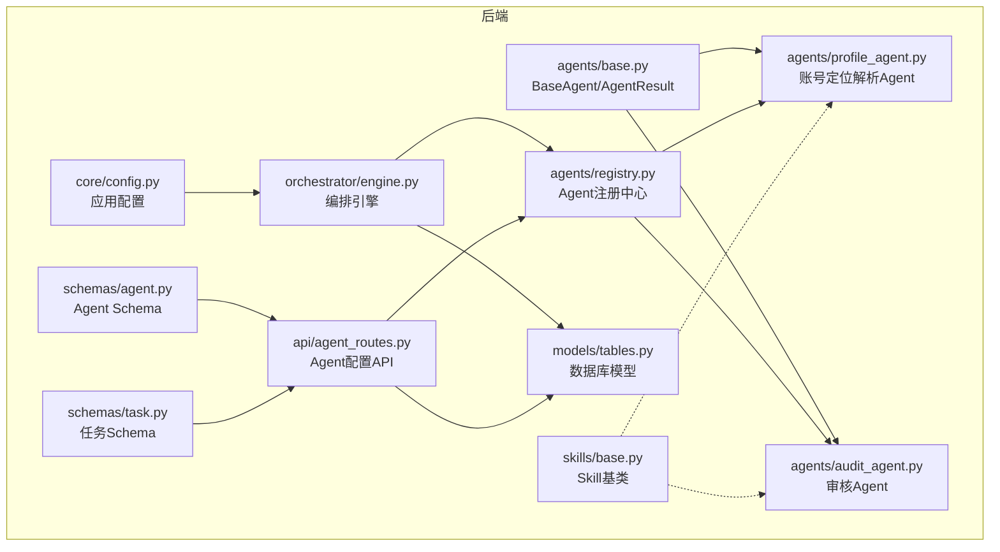
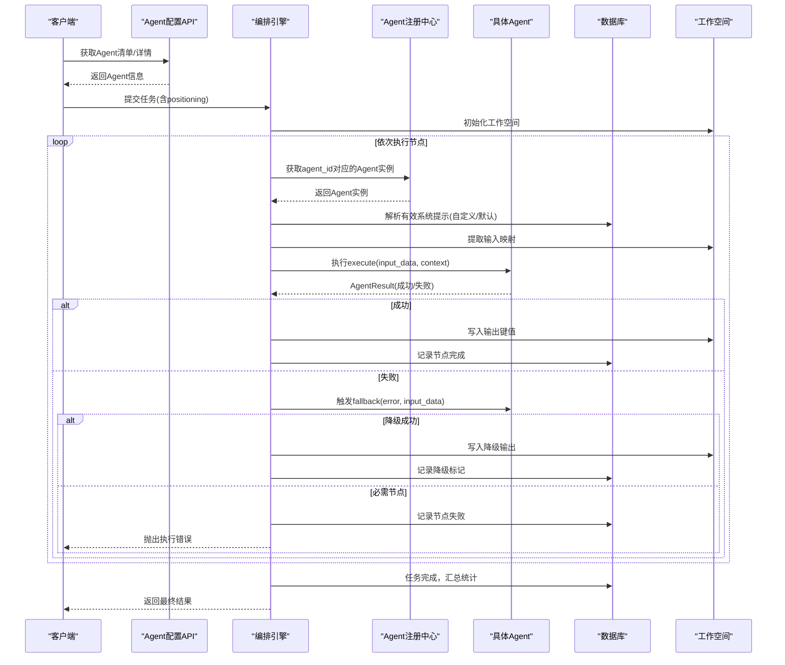
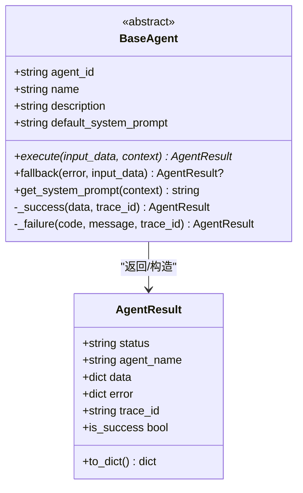
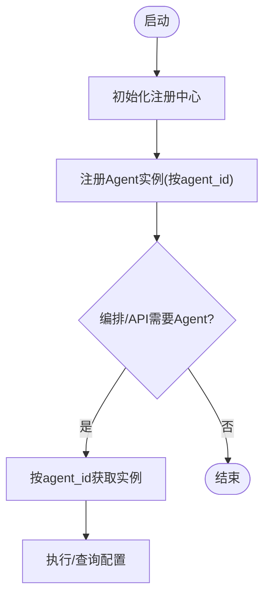
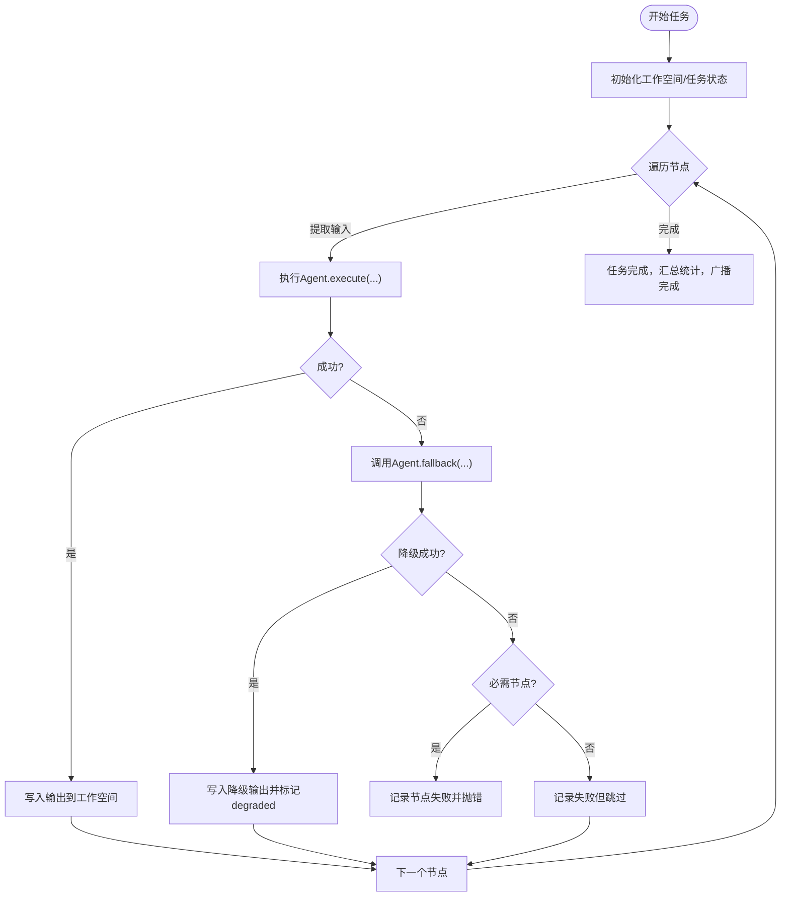
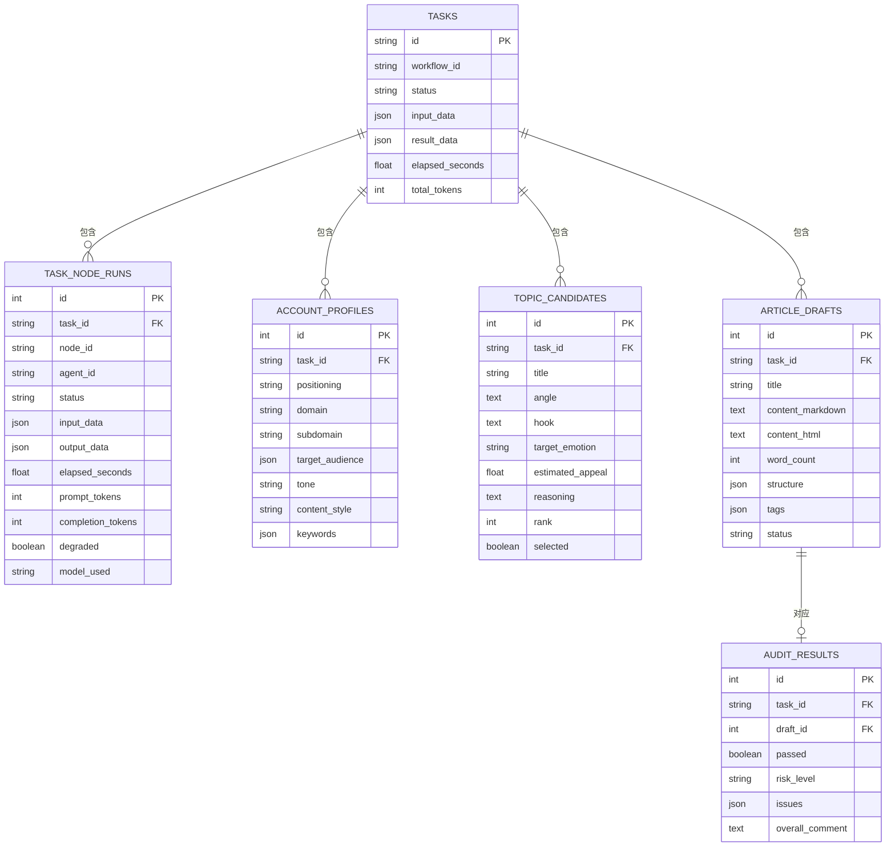
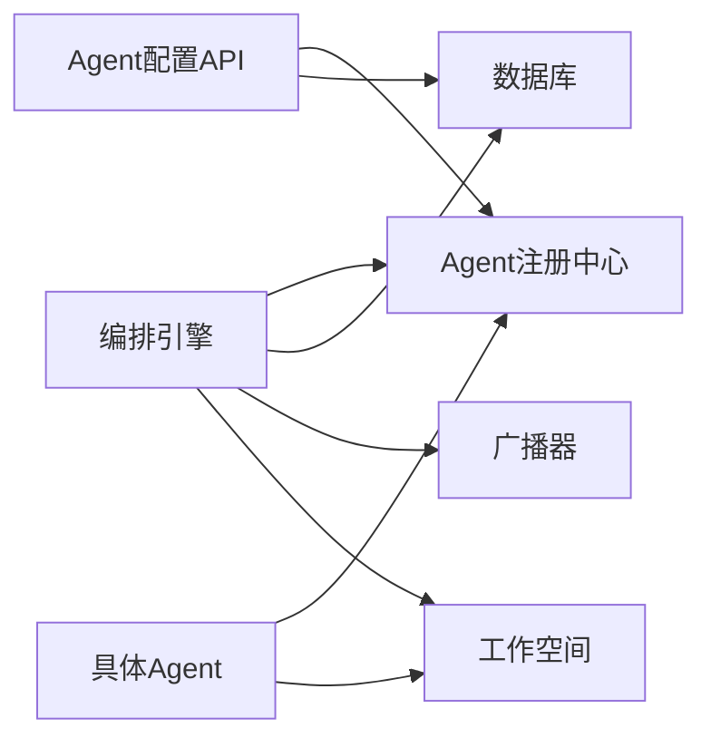

# 智能体系统

<cite>
**本文引用的文件**
- [backend/app/agents/base.py](file://backend/app/agents/base.py)
- [backend/app/agents/profile_agent.py](file://backend/app/agents/profile_agent.py)
- [backend/app/agents/audit_agent.py](file://backend/app/agents/audit_agent.py)
- [backend/app/agents/registry.py](file://backend/app/agents/registry.py)
- [backend/app/orchestrator/engine.py](file://backend/app/orchestrator/engine.py)
- [backend/app/api/agent_routes.py](file://backend/app/api/agent_routes.py)
- [backend/app/schemas/agent.py](file://backend/app/schemas/agent.py)
- [backend/app/schemas/task.py](file://backend/app/schemas/task.py)
- [backend/app/models/tables.py](file://backend/app/models/tables.py)
- [backend/app/core/config.py](file://backend/app/core/config.py)
- [backend/app/skills/base.py](file://backend/app/skills/base.py)
</cite>

## 目录
1. [简介](#简介)
2. [项目结构](#项目结构)
3. [核心组件](#核心组件)
4. [架构总览](#架构总览)
5. [详细组件分析](#详细组件分析)
6. [依赖分析](#依赖分析)
7. [性能考虑](#性能考虑)
8. [故障排查指南](#故障排查指南)
9. [结论](#结论)
10. [附录：新增Agent开发指南](#附录新增agent开发指南)

## 简介
本技术文档面向HotClaw智能体系统，系统采用“工作流编排 + 多智能体节点”的架构，围绕六大核心Agent构建从账号定位到内容发布的完整链路。文档涵盖：
- Agent体系的整体架构与基类设计、继承关系与核心接口
- 六大核心Agent的职责、输入输出Schema、依赖的Skill、降级策略与执行逻辑
- Agent注册机制、动态加载与配置管理
- Agent间协作模式、数据流转与错误处理策略
- 新增Agent的开发指南与最佳实践

## 项目结构
后端采用FastAPI + SQLAlchemy异步架构，核心模块如下：
- agents：智能体基类与各Agent实现
- orchestrator：编排引擎与工作空间
- api：对外API路由（Agent配置、任务等）
- schemas：请求/响应模型
- models：数据库表模型
- skills：工具能力基类
- core：配置、日志、异常、追踪

```mermaid
graph TB
subgraph "后端"
A["agents/base.py<br/>BaseAgent/AgentResult"]
B["agents/profile_agent.py<br/>账号定位解析Agent"]
C["agents/audit_agent.py<br/>审核Agent"]
D["agents/registry.py<br/>Agent注册中心"]
E["orchestrator/engine.py<br/>编排引擎"]
F["api/agent_routes.py<br/>Agent配置API"]
G["schemas/agent.py<br/>Agent Schema"]
H["schemas/task.py<br/>任务Schema"]
I["models/tables.py<br/>数据库模型"]
J["core/config.py<br/>应用配置"]
K["skills/base.py<br/>Skill基类"]
end
A --> B
A --> C
D --> B
D --> C
E --> D
E --> I
F --> D
F --> I
G --> F
H --> F
J --> E
K -.-> B
K -.-> C
```

图表来源
- [backend/app/agents/base.py:1-99](file://backend/app/agents/base.py#L1-L99)
- [backend/app/agents/profile_agent.py:1-73](file://backend/app/agents/profile_agent.py#L1-L73)
- [backend/app/agents/audit_agent.py:1-66](file://backend/app/agents/audit_agent.py#L1-L66)
- [backend/app/agents/registry.py:1-40](file://backend/app/agents/registry.py#L1-L40)
- [backend/app/orchestrator/engine.py:1-285](file://backend/app/orchestrator/engine.py#L1-L285)
- [backend/app/api/agent_routes.py:1-115](file://backend/app/api/agent_routes.py#L1-L115)
- [backend/app/schemas/agent.py:1-29](file://backend/app/schemas/agent.py#L1-L29)
- [backend/app/schemas/task.py:1-83](file://backend/app/schemas/task.py#L1-L83)
- [backend/app/models/tables.py:1-233](file://backend/app/models/tables.py#L1-L233)
- [backend/app/core/config.py:1-51](file://backend/app/core/config.py#L1-L51)
- [backend/app/skills/base.py:1-37](file://backend/app/skills/base.py#L1-L37)

章节来源
- [backend/app/agents/base.py:1-99](file://backend/app/agents/base.py#L1-L99)
- [backend/app/orchestrator/engine.py:31-86](file://backend/app/orchestrator/engine.py#L31-L86)

## 核心组件
- BaseAgent与AgentResult：定义统一的智能体接口、结果封装与失败/成功构造器
- AgentRegistry：集中注册与检索Agent实例
- OrchestratorEngine：线性编排默认工作流，管理节点执行、超时、降级与广播
- API层：提供Agent清单、详情与配置更新接口
- 数据模型：持久化任务、节点运行、账号画像、话题候选、文章草稿与审核结果
- 配置：超时、模型参数、数据库与Redis连接等

章节来源
- [backend/app/agents/base.py:49-99](file://backend/app/agents/base.py#L49-L99)
- [backend/app/agents/registry.py:10-40](file://backend/app/agents/registry.py#L10-L40)
- [backend/app/orchestrator/engine.py:89-285](file://backend/app/orchestrator/engine.py#L89-L285)
- [backend/app/api/agent_routes.py:17-115](file://backend/app/api/agent_routes.py#L17-L115)
- [backend/app/models/tables.py:23-233](file://backend/app/models/tables.py#L23-L233)
- [backend/app/core/config.py:7-51](file://backend/app/core/config.py#L7-L51)

## 架构总览
系统以“任务”为单位，编排引擎按顺序驱动各Agent节点执行，节点间通过工作空间共享上下文；每个节点执行前会解析有效系统提示（优先DB自定义），执行后写入节点运行记录并广播状态。

```mermaid
sequenceDiagram
participant Client as "客户端"
participant API as "Agent配置API"
participant Engine as "编排引擎"
participant Reg as "Agent注册中心"
participant Agent as "具体Agent"
participant DB as "数据库"
participant WS as "工作空间"
Client->>API : 获取Agent清单/详情
API-->>Client : 返回Agent信息
Client->>Engine : 提交任务(含positioning)
Engine->>WS : 初始化工作空间
loop 依次执行节点
Engine->>Reg : 获取agent_id对应的Agent实例
Reg-->>Engine : 返回Agent实例
Engine->>DB : 解析有效系统提示(自定义/默认)
Engine->>WS : 提取输入映射
Engine->>Agent : 执行execute(input_data, context)
Agent-->>Engine : AgentResult(成功/失败)
alt 成功
Engine->>WS : 写入输出键值
Engine->>DB : 记录节点完成
else 失败
Engine->>Agent : 触发fallback(error, input_data)
alt 降级成功
Engine->>WS : 写入降级输出
Engine->>DB : 记录降级标记
else 必需节点
Engine->>DB : 记录节点失败
Engine-->>Client : 抛出执行错误
end
end
end
Engine->>DB : 任务完成，汇总统计
Engine-->>Client : 返回最终结果
```

图表来源
- [backend/app/orchestrator/engine.py:92-234](file://backend/app/orchestrator/engine.py#L92-L234)
- [backend/app/agents/registry.py:23-28](file://backend/app/agents/registry.py#L23-L28)
- [backend/app/api/agent_routes.py:17-115](file://backend/app/api/agent_routes.py#L17-L115)
- [backend/app/models/tables.py:48-74](file://backend/app/models/tables.py#L48-L74)

## 详细组件分析

### BaseAgent与AgentResult
- 设计要点
  - 统一接口：execute(input_data: dict, context: dict) -> AgentResult
  - 结果封装：AgentResult包含状态、名称、数据、错误与追踪ID
  - 降级策略：fallback(error, input_data) -> 可选降级结果
  - 工具方法：_success/_failure快速构造标准结果
  - 系统提示：支持从上下文覆盖默认系统提示

```mermaid
classDiagram
class AgentResult {
+string status
+string agent_name
+dict data
+dict error
+string trace_id
+to_dict() dict
+is_success bool
}
class BaseAgent {
<<abstract>>
+string agent_id
+string name
+string description
+string default_system_prompt
+execute(input_data, context) AgentResult*
+fallback(error, input_data) AgentResult?
+get_system_prompt(context) string
-_success(data, trace_id) AgentResult
-_failure(code, message, trace_id) AgentResult
}
BaseAgent --> AgentResult : "返回/构造"
```

图表来源
- [backend/app/agents/base.py:18-99](file://backend/app/agents/base.py#L18-L99)

章节来源
- [backend/app/agents/base.py:49-99](file://backend/app/agents/base.py#L49-L99)

### Agent注册中心与动态加载
- 注册机制
  - 以agent_id为键注册实例，重复注册记录告警
  - 提供按ID获取、列举、存在性检查
- 动态加载
  - 编排引擎通过注册中心按agent_id获取实例
  - API层查询数据库中的Agent配置，决定提示来源与状态

```mermaid
flowchart TD
Start(["启动"]) --> RegInit["初始化注册中心"]
RegInit --> Reg["注册Agent实例(按agent_id)"]
Reg --> Use{"编排/API需要Agent?"}
Use --> |是| Get["按agent_id获取实例"]
Get --> Exec["执行/查询配置"]
Use --> |否| End(["结束"])
```

图表来源
- [backend/app/agents/registry.py:16-35](file://backend/app/agents/registry.py#L16-L35)
- [backend/app/orchestrator/engine.py:138-147](file://backend/app/orchestrator/engine.py#L138-L147)
- [backend/app/api/agent_routes.py:49-71](file://backend/app/api/agent_routes.py#L49-L71)

章节来源
- [backend/app/agents/registry.py:10-40](file://backend/app/agents/registry.py#L10-L40)
- [backend/app/api/agent_routes.py:17-115](file://backend/app/api/agent_routes.py#L17-L115)

### 编排引擎与工作空间
- 默认线性工作流节点（MVP）
  - profile_parsing -> hot_topic_analysis -> topic_planning -> title_generation -> content_writing -> audit
- 执行流程
  - 初始化工作空间与任务状态
  - 逐节点提取输入映射、解析有效系统提示、执行Agent、写回输出
  - 失败时尝试fallback，必需节点失败则终止并抛错
  - 广播节点开始/完成事件，记录节点运行指标
  - 任务完成后汇总统计并关闭

```mermaid
flowchart TD
S(["开始任务"]) --> Init["初始化工作空间/任务状态"]
Init --> Loop{"遍历节点"}
Loop --> |提取输入| Exec["执行Agent.execute(...)"]
Exec --> Ok{"成功?"}
Ok --> |是| Save["写入输出到工作空间"]
Save --> Next["下一个节点"]
Ok --> |否| FB["调用Agent.fallback(...)"]
FB --> FBok{"降级成功?"}
FBok --> |是| SaveDeg["写入降级输出并标记degraded"]
FBok --> |否| Req{"必需节点?"}
Req --> |是| Fail["记录节点失败并抛错"]
Req --> |否| Skip["记录失败但跳过"]
SaveDeg --> Next
Skip --> Next
Next --> Loop
Loop --> |完成| Done["任务完成，汇总统计，广播完成"]
```

图表来源
- [backend/app/orchestrator/engine.py:92-234](file://backend/app/orchestrator/engine.py#L92-L234)
- [backend/app/orchestrator/engine.py:31-86](file://backend/app/orchestrator/engine.py#L31-L86)

章节来源
- [backend/app/orchestrator/engine.py:89-285](file://backend/app/orchestrator/engine.py#L89-L285)

### 六大核心Agent

#### 账号定位解析Agent（ProfileAgent）
- 职责：将用户输入的账号定位描述解析为结构化画像
- 输入
  - positioning: 用户的自然语言定位描述
- 输出
  - domain/subdomain: 主/细分领域
  - target_audience: age_range/occupation/interests
  - tone/content_style/keywords/positioning_raw
- 依赖：无外部Skill调用（当前为Mock实现）
- 降级策略：返回兜底画像（泛资讯/通用受众）
- 执行逻辑：模拟LLM延迟后返回固定结构化数据

章节来源
- [backend/app/agents/profile_agent.py:10-73](file://backend/app/agents/profile_agent.py#L10-L73)

#### 热点分析Agent（HotTopicAgent）
- 职责：基于账号画像分析热点话题
- 输入
  - profile: 来自账号定位解析Agent的结构化画像
- 输出
  - 热点话题列表（包含话题、时效性、相关度等）
- 依赖：Skill（如外部热点抓取/分析）
- 降级策略：返回空列表或兜底热门话题
- 执行逻辑：调用Skill获取热点，合并画像特征后输出

章节来源
- [backend/app/orchestrator/engine.py:42-48](file://backend/app/orchestrator/engine.py#L42-L48)

#### 选题策划Agent（TopicPlannerAgent）
- 职责：结合画像与热点生成选题候选
- 输入
  - profile: 账号画像
  - hot_topics: 热点话题
- 输出
  - 选题候选列表（标题、角度、钩子、情绪、吸引力评分、理由）
- 依赖：Skill（如内容素材检索、情感分析）
- 降级策略：返回高覆盖率的通用选题
- 执行逻辑：融合画像与热点，生成多候选并排序

章节来源
- [backend/app/orchestrator/engine.py:50-56](file://backend/app/orchestrator/engine.py#L50-L56)

#### 标题生成Agent（TitleGeneratorAgent）
- 职责：基于选题与画像生成候选标题
- 输入
  - profile: 账号画像
  - topics: 选题候选
- 输出
  - 候选标题集合（含风格、情绪、点击度预估）
- 依赖：Skill（如标题模板库、敏感词过滤）
- 降级策略：返回高命中率的通用模板标题
- 执行逻辑：模板化生成+规则校验

章节来源
- [backend/app/orchestrator/engine.py:58-64](file://backend/app/orchestrator/engine.py#L58-L64)

#### 内容写作Agent（ContentWriterAgent）
- 职责：根据选题、标题与画像生成正文草稿
- 输入
  - profile: 账号画像
  - topics: 选题候选
  - titles: 标题候选
  - hot_topics: 热点话题
- 输出
  - content: 正文Markdown/HTML、字数、结构、标签
- 依赖：Skill（如内容扩写、格式化、SEO优化）
- 降级策略：返回简要框架与要点
- 执行逻辑：大纲驱动+段落扩写

章节来源
- [backend/app/orchestrator/engine.py:66-77](file://backend/app/orchestrator/engine.py#L66-L77)

#### 审核Agent（AuditAgent）
- 职责：对标题与正文进行合规性审核与风险评估
- 输入
  - titles: 标题候选
  - content: 正文
  - profile: 账号画像
- 输出
  - passed/risk_level/issues/overall_comment
- 依赖：Skill（如敏感词库、事实核查）
- 降级策略：返回“未知”风险并建议人工复核
- 执行逻辑：多维度扫描+分级判定

章节来源
- [backend/app/agents/audit_agent.py:7-66](file://backend/app/agents/audit_agent.py#L7-L66)
- [backend/app/orchestrator/engine.py:79-85](file://backend/app/orchestrator/engine.py#L79-L85)

### Agent配置与Schema
- AgentInfo：用于API返回Agent基本信息、提示来源、状态等
- AgentConfigUpdateRequest：支持更新模型配置、提示模板、重试配置
- 任务Schema：TaskCreateRequest、TaskDetailResponse、NodeRunData等

章节来源
- [backend/app/schemas/agent.py:6-29](file://backend/app/schemas/agent.py#L6-L29)
- [backend/app/api/agent_routes.py:74-115](file://backend/app/api/agent_routes.py#L74-L115)
- [backend/app/schemas/task.py:10-83](file://backend/app/schemas/task.py#L10-L83)

### 数据模型与持久化
- 任务生命周期：tasks（含输入、结果、耗时、总Token）
- 节点运行记录：task_node_runs（含输入/输出、耗时、Token、降级标记、错误）
- 账号画像：account_profiles（从positioning解析）
- 话题候选：topic_candidates（选题候选）
- 文章草稿：article_drafts（含状态、结构、标签）
- 审核结果：audit_results（合规判定）

```mermaid
erDiagram
TASKS {
string id PK
string workflow_id
string status
json input_data
json result_data
float elapsed_seconds
int total_tokens
}
TASK_NODE_RUNS {
int id PK
string task_id FK
string node_id
string agent_id
string status
json input_data
json output_data
float elapsed_seconds
int prompt_tokens
int completion_tokens
boolean degraded
string model_used
}
ACCOUNT_PROFILES {
int id PK
string task_id FK
string positioning
string domain
string subdomain
json target_audience
string tone
string content_style
json keywords
}
TOPIC_CANDIDATES {
int id PK
string task_id FK
string title
text angle
text hook
string target_emotion
float estimated_appeal
text reasoning
int rank
boolean selected
}
ARTICLE_DRAFTS {
int id PK
string task_id FK
string title
text content_markdown
text content_html
int word_count
json structure
json tags
string status
}
AUDIT_RESULTS {
int id PK
string task_id FK
int draft_id FK
boolean passed
string risk_level
json issues
text overall_comment
}
TASKS ||--o{ TASK_NODE_RUNS : "包含"
TASKS ||--o{ ACCOUNT_PROFILES : "包含"
TASKS ||--o{ TOPIC_CANDIDATES : "包含"
TASKS ||--o{ ARTICLE_DRAFTS : "包含"
ARTICLE_DRAFTS ||--o| AUDIT_RESULTS : "对应"
```

图表来源
- [backend/app/models/tables.py:23-233](file://backend/app/models/tables.py#L23-L233)

章节来源
- [backend/app/models/tables.py:23-233](file://backend/app/models/tables.py#L23-L233)

## 依赖分析
- 组件耦合
  - 编排引擎强依赖注册中心与工作空间，弱依赖数据库与广播器
  - Agent仅依赖注册中心与上下文，不直接访问数据库
  - API层依赖注册中心与数据库，用于查询与更新Agent配置
- 外部依赖
  - LLM：通过系统提示与模型配置控制
  - Redis：用于广播与缓存（由配置项体现）
  - 数据库：SQLAlchemy异步ORM

```mermaid
graph LR
Engine["编排引擎"] --> Registry["Agent注册中心"]
Engine --> DB["数据库"]
Engine --> Broad["广播器"]
Engine --> WS["工作空间"]
API["Agent配置API"] --> Registry
API --> DB
Agent["具体Agent"] --> Registry
Agent --> WS
```

图表来源
- [backend/app/orchestrator/engine.py:18-26](file://backend/app/orchestrator/engine.py#L18-L26)
- [backend/app/api/agent_routes.py:10-12](file://backend/app/api/agent_routes.py#L10-L12)
- [backend/app/agents/registry.py:3-4](file://backend/app/agents/registry.py#L3-L4)

章节来源
- [backend/app/orchestrator/engine.py:18-26](file://backend/app/orchestrator/engine.py#L18-L26)
- [backend/app/api/agent_routes.py:10-12](file://backend/app/api/agent_routes.py#L10-L12)
- [backend/app/agents/registry.py:3-4](file://backend/app/agents/registry.py#L3-L4)

## 性能考虑
- 超时控制：Agent默认超时由配置提供，执行阶段包裹超时等待
- Token统计：节点运行记录累计prompt/completion Token，任务层面汇总
- 广播与日志：节点开始/完成事件通过广播器推送，便于前端实时展示
- 降级策略：非必需节点失败时可降级继续，降低整体失败概率

章节来源
- [backend/app/core/config.py:42-45](file://backend/app/core/config.py#L42-L45)
- [backend/app/orchestrator/engine.py:236-243](file://backend/app/orchestrator/engine.py#L236-L243)
- [backend/app/orchestrator/engine.py:211-216](file://backend/app/orchestrator/engine.py#L211-L216)

## 故障排查指南
- 常见错误
  - Agent执行错误：记录节点失败与错误消息，必要时终止任务
  - Agent超时：记录超时并终止（必需节点）
  - Agent未找到：注册中心按ID获取失败
- 排查步骤
  - 查看节点运行记录（状态、耗时、Token、降级标记、错误）
  - 检查Agent配置（提示模板来源、重试配置）
  - 核对工作空间映射（input_mapping是否正确）
  - 关注广播事件（节点开始/完成/错误）

章节来源
- [backend/app/orchestrator/engine.py:164-196](file://backend/app/orchestrator/engine.py#L164-L196)
- [backend/app/agents/registry.py:23-28](file://backend/app/agents/registry.py#L23-L28)
- [backend/app/models/tables.py:48-74](file://backend/app/models/tables.py#L48-L74)

## 结论
HotClaw智能体系统通过清晰的Agent基类与编排引擎，实现了从账号定位到内容发布的标准化流水线。系统具备完善的注册、配置、持久化与广播机制，并提供可插拔的Skill扩展点与可降级的容错策略。后续可在保持接口一致性的前提下，逐步引入真实LLM与外部Skill，完善六大Agent的业务逻辑与数据Schema。

## 附录：新增Agent开发指南
- 实现步骤
  - 继承BaseAgent，定义agent_id/name/description/default_system_prompt
  - 实现execute(input_data, context) -> AgentResult
  - 如需降级，实现fallback(error, input_data) -> 可选AgentResult
  - 在合适时机调用Skill（如需）并返回结构化数据
- 配置与注册
  - 将Agent实例注册到AgentRegistry（通常在应用启动时）
  - 通过API更新Agent配置（提示模板、模型配置、重试配置）
- Schema与持久化
  - 明确输入/输出Schema，必要时扩展数据库模型
  - 在工作空间中定义输入映射与输出键，确保节点间数据连通
- 测试方法
  - 单元测试：Mock外部依赖，验证execute/fallback行为
  - 集成测试：通过编排引擎跑完整链路，验证数据流转与降级
  - 性能测试：评估超时与Token消耗，调整配置

章节来源
- [backend/app/agents/base.py:49-99](file://backend/app/agents/base.py#L49-L99)
- [backend/app/agents/registry.py:16-21](file://backend/app/agents/registry.py#L16-L21)
- [backend/app/api/agent_routes.py:74-115](file://backend/app/api/agent_routes.py#L74-L115)
- [backend/app/orchestrator/engine.py:134-175](file://backend/app/orchestrator/engine.py#L134-L175)
- [backend/app/skills/base.py:16-37](file://backend/app/skills/base.py#L16-L37)