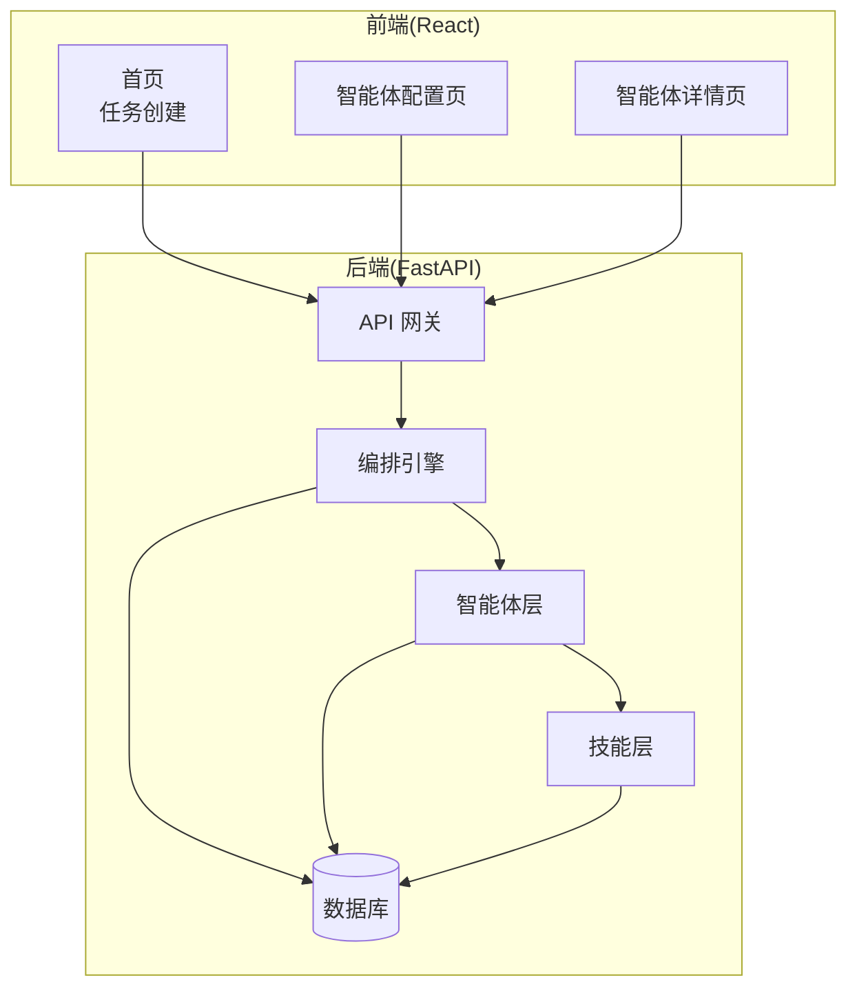
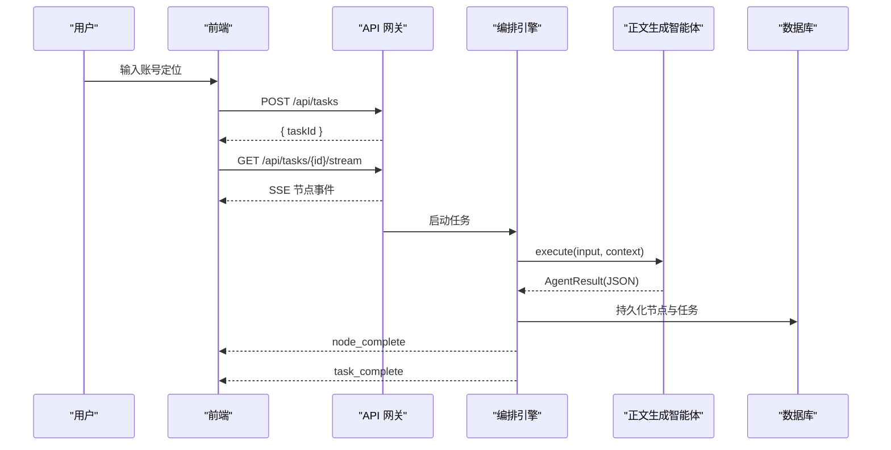
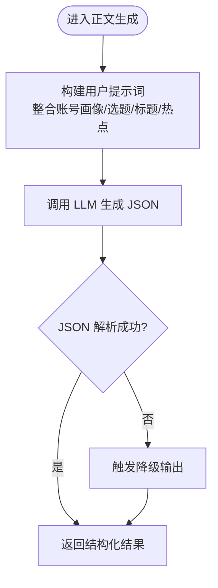
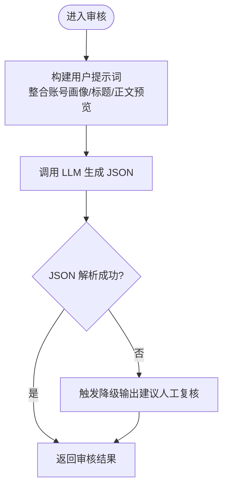
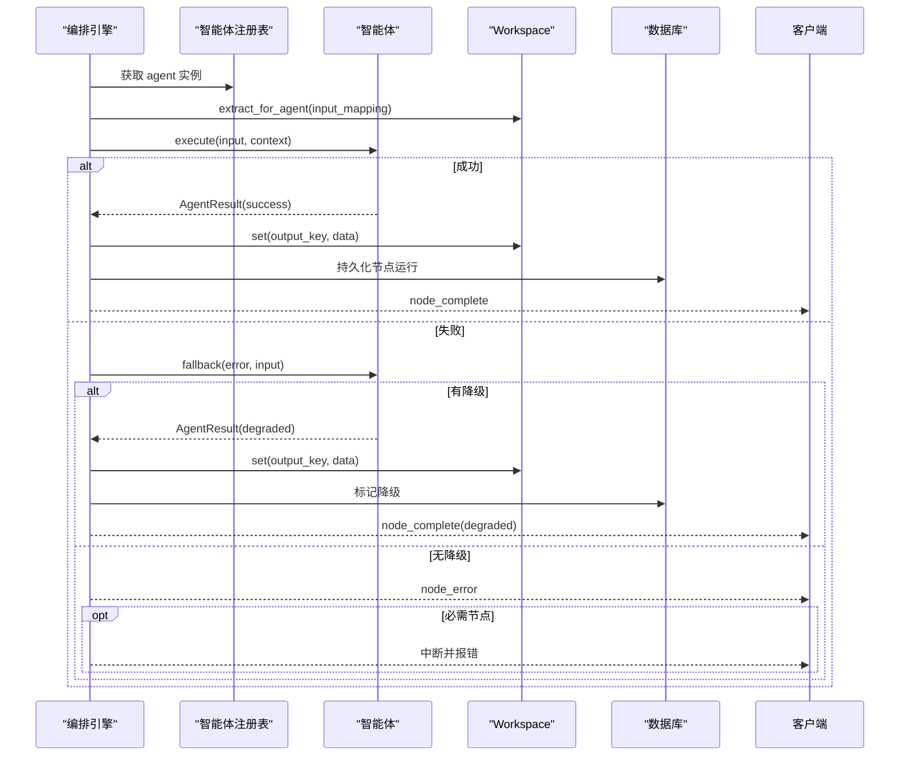
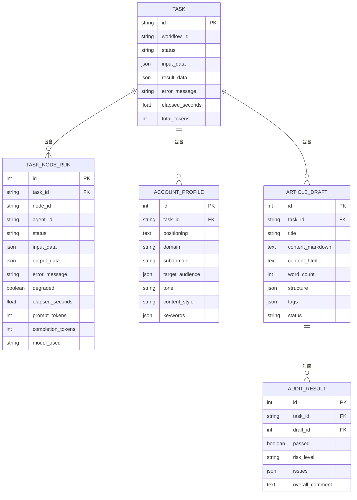
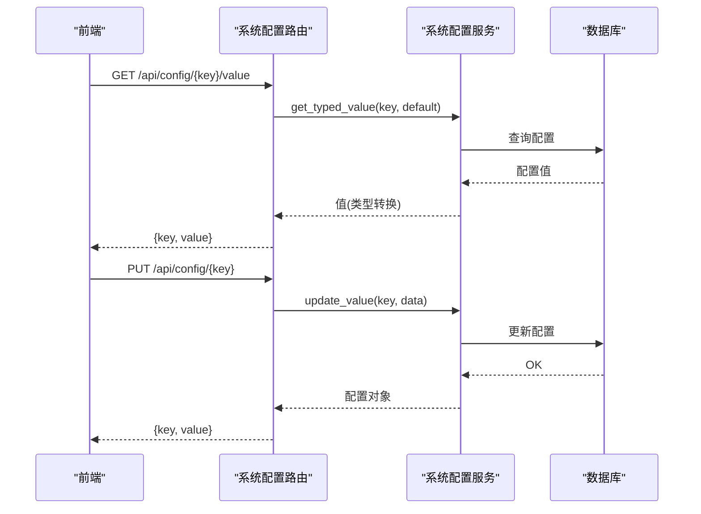
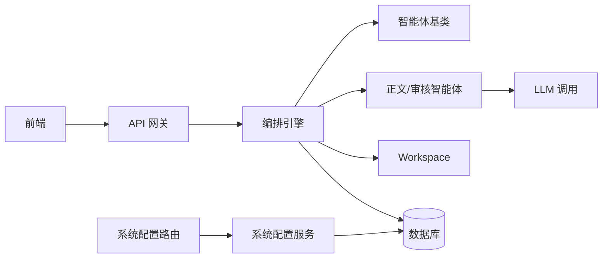

# 内容写作智能体

<cite>
**本文引用的文件**
- [架构设计文档](file://ARCHITECTURE.md)
- [正文生成智能体](file://backend/app/agents/content_writer_agent.py)
- [审核智能体](file://backend/app/agents/audit_agent.py)
- [智能体基类](file://backend/app/agents/base.py)
- [编排引擎](file://backend/app/orchestrator/engine.py)
- [任务相关模式](file://backend/app/schemas/task.py)
- [数据库模型](file://backend/app/models/tables.py)
- [系统配置路由](file://backend/app/api/system_config_routes.py)
- [系统配置服务](file://backend/app/services/system_config_service.py)
- [前端首页](file://frontend/app/page.tsx)
- [前端智能体配置页](file://frontend/app/settings/agents/page.tsx)
- [前端智能体设置抽屉](file://frontend/components/office/AgentSettingsDrawer.tsx)
</cite>

## 目录
1. [简介](#简介)
2. [项目结构](#项目结构)
3. [核心组件](#核心组件)
4. [架构总览](#架构总览)
5. [详细组件分析](#详细组件分析)
6. [依赖分析](#依赖分析)
7. [性能考量](#性能考量)
8. [故障排查指南](#故障排查指南)
9. [结论](#结论)
10. [附录](#附录)

## 简介
本技术文档面向“内容写作智能体”，聚焦其核心能力：根据账号定位与结构化输入，生成高质量、可编辑的公众号文章草稿。系统采用多智能体协作的线性工作流，覆盖账号画像解析、热点抓取与分析、选题策划、标题生成、正文生成与审核评估，并通过结构化输出与可视化运行状态保障可控与可观测。

系统特性与能力：
- 一键启动：输入账号定位，自动完成从热点到草稿的全链路生成
- 可视化运行：实时展示每个节点状态、耗时与输出摘要
- 结果输出：候选选题、标题、正文（Markdown）、审核结果
- 配置可调：支持调整 Agent 的 prompt 模板、模型与参数
- 历史回溯：持久化任务与节点运行记录，支持回放
- 降级策略：单节点失败不影响整体流程，具备默认降级输出

## 项目结构
系统采用前后端分离架构，后端以 FastAPI 为核心，提供 API 网关、编排引擎与数据持久化；前端以 React 为基础，提供可视化控制台与实时状态订阅。

图表来源
- [架构设计文档:39-78](file://ARCHITECTURE.md#L39-L78)
- [编排引擎:89-285](file://backend/app/orchestrator/engine.py#L89-L285)

章节来源
- [架构设计文档:13-78](file://ARCHITECTURE.md#L13-L78)
- [前端首页:1-8](file://frontend/app/page.tsx#L1-L8)

## 核心组件
- 正文生成智能体：基于选题、标题与热点素材，生成结构化 Markdown 正文，包含字数统计、章节结构与标签
- 审核智能体：对标题与正文进行合规性与质量评估，输出风险等级与问题清单
- 编排引擎：按线性工作流顺序调度各智能体，管理上下文与事件广播
- 数据模型：任务、节点运行、账号画像、文章草稿、审核结果等结构化持久化
- 配置与系统设置：支持运行时系统配置与 Agent prompt 模板的动态更新

章节来源
- [正文生成智能体:12-154](file://backend/app/agents/content_writer_agent.py#L12-L154)
- [审核智能体:12-141](file://backend/app/agents/audit_agent.py#L12-L141)
- [编排引擎:89-285](file://backend/app/orchestrator/engine.py#L89-L285)
- [数据库模型:23-158](file://backend/app/models/tables.py#L23-L158)
- [系统配置路由:80-158](file://backend/app/api/system_config_routes.py#L80-L158)
- [系统配置服务:201-222](file://backend/app/services/system_config_service.py#L201-L222)

## 架构总览
系统采用“工作流驱动”的多智能体协作模式。前端发起任务后，后端通过编排引擎加载默认工作流，依次调用各智能体；每个智能体在统一的上下文中执行，输出结构化 JSON；编排引擎负责事件广播、降级与持久化。

图表来源
- [架构设计文档:449-494](file://ARCHITECTURE.md#L449-L494)
- [编排引擎:92-234](file://backend/app/orchestrator/engine.py#L92-L234)
- [正文生成智能体:51-84](file://backend/app/agents/content_writer_agent.py#L51-L84)

章节来源
- [架构设计文档:449-494](file://ARCHITECTURE.md#L449-L494)
- [编排引擎:92-234](file://backend/app/orchestrator/engine.py#L92-L234)

## 详细组件分析

### 正文生成智能体
职责与输入输出
- 输入：账号画像、候选选题、候选标题、热点素材
- 输出：Markdown 正文、字数统计、章节结构、标签集合
- 约束：总字数 1500-3000 字，段落简短，符合账号调性，使用 Markdown 格式

生成策略
- 通过统一的系统提示词与用户提示词组合，限定输出结构与风格
- 使用统一的 LLM 调用入口，解析 LLM 返回的 JSON（兼容代码块包裹）
- 失败时提供降级输出，保证流程继续推进

图表来源
- [正文生成智能体:51-154](file://backend/app/agents/content_writer_agent.py#L51-L154)

章节来源
- [正文生成智能体:12-154](file://backend/app/agents/content_writer_agent.py#L12-L154)

### 审核智能体
职责与输入输出
- 输入：候选标题、正文内容、账号画像
- 输出：是否通过、风险等级、问题清单（类型、位置、严重程度）、综合评价
- 约束：存在高风险问题时必须不通过；风险等级取最高严重级别

审核维度
- 敏感词检测、事实核查、夸大宣传、标题党、调性匹配、内容质量

图表来源
- [审核智能体:53-141](file://backend/app/agents/audit_agent.py#L53-L141)

章节来源
- [审核智能体:12-141](file://backend/app/agents/audit_agent.py#L12-L141)

### 编排引擎
工作流与上下文
- 默认线性工作流：账号解析 → 热点分析 → 选题策划 → 标题生成 → 正文生成 → 审核评估
- 上下文管理：Workspace 保存每次节点输出，供后续节点按映射提取
- 事件广播：节点开始、进度、完成、错误均通过 SSE 推送

降级与容错
- 节点失败时尝试智能体降级策略；必要节点失败抛出异常中断
- 非必要节点失败不影响整体流程，记录错误并继续

图表来源
- [编排引擎:137-234](file://backend/app/orchestrator/engine.py#L137-L234)

章节来源
- [编排引擎:89-285](file://backend/app/orchestrator/engine.py#L89-L285)

### 数据模型与持久化
- 任务模型：记录任务生命周期、状态、耗时与总 token 消耗
- 节点运行模型：记录每个节点的输入、输出、耗时、token、错误与降级标记
- 账号画像模型：结构化保存账号领域、受众、调性、关键词等
- 文章草稿模型：保存标题、正文（Markdown/HTML）、结构与标签
- 审核结果模型：保存审核通过与否、风险等级与问题清单

图表来源
- [数据库模型:23-158](file://backend/app/models/tables.py#L23-L158)

章节来源
- [数据库模型:23-158](file://backend/app/models/tables.py#L23-L158)

### 配置与系统设置
- 系统配置：通过路由接口读取/创建/更新/删除系统配置项，支持类型转换与敏感值掩码
- Agent prompt 模板：可在前端智能体详情页编辑与恢复默认，编排引擎在运行时解析生效

图表来源
- [系统配置路由:80-158](file://backend/app/api/system_config_routes.py#L80-L158)
- [系统配置服务:201-222](file://backend/app/services/system_config_service.py#L201-L222)

章节来源
- [系统配置路由:80-158](file://backend/app/api/system_config_routes.py#L80-L158)
- [系统配置服务:201-222](file://backend/app/services/system_config_service.py#L201-L222)
- [前端智能体配置页:157-187](file://frontend/app/settings/agents/page.tsx#L157-L187)
- [前端智能体设置抽屉:113-140](file://frontend/components/office/AgentSettingsDrawer.tsx#L113-L140)

## 依赖分析
- 智能体依赖：依赖统一的系统提示词解析与 LLM 调用封装
- 编排引擎耦合：与智能体注册表、Workspace、事件广播器与数据库紧密耦合
- 前后端通信：前端通过 SSE 订阅后端事件，任务完成后拉取结果
- 配置解耦：系统配置与 Agent prompt 通过服务层与路由层解耦，便于运行时调整

图表来源
- [编排引擎:137-234](file://backend/app/orchestrator/engine.py#L137-L234)
- [智能体基类:49-99](file://backend/app/agents/base.py#L49-L99)
- [系统配置路由:80-158](file://backend/app/api/system_config_routes.py#L80-L158)
- [系统配置服务:201-222](file://backend/app/services/system_config_service.py#L201-L222)

章节来源
- [编排引擎:89-285](file://backend/app/orchestrator/engine.py#L89-L285)
- [智能体基类:49-99](file://backend/app/agents/base.py#L49-L99)

## 性能考量
- LLM 调用超时与并发：编排引擎对每个节点执行设置超时，避免阻塞；建议合理设置超时阈值与重试策略
- 输出解析健壮性：正文与审核智能体对 LLM 返回的 JSON 解析做了鲁棒处理（兼容代码块包裹）
- 事件广播与前端渲染：SSE 事件粒度适中，避免过多细粒度事件导致前端压力
- 数据持久化：节点运行记录包含 token 统计，便于成本与性能分析

## 故障排查指南
常见问题与定位方法
- 节点超时：检查编排引擎的超时配置与网络连通性；必要时提升超时阈值
- JSON 解析失败：确认智能体输出遵循结构化 JSON 约束；必要时调整系统提示词
- 审核异常降级：当审核服务异常时，系统会返回“建议人工复核”的降级结果，需人工介入
- 配置读取失败：通过系统配置路由确认键是否存在、类型是否正确；敏感配置注意掩码

章节来源
- [编排引擎:176-196](file://backend/app/orchestrator/engine.py#L176-L196)
- [正文生成智能体:81-84](file://backend/app/agents/content_writer_agent.py#L81-L84)
- [审核智能体:134-141](file://backend/app/agents/audit_agent.py#L134-L141)
- [系统配置路由:80-93](file://backend/app/api/system_config_routes.py#L80-L93)

## 结论
内容写作智能体通过“结构化输入 + 多智能体协作 + 可视化编排”的方式，实现了从账号定位到文章草稿的自动化生产。其核心优势在于：
- 清晰的职责划分与强约束的结构化输出，确保质量与一致性
- 事件驱动的可视化运行与可审计的数据链路，便于监控与回溯
- 可配置的系统提示词与运行时配置，满足不同场景的风格与参数需求
- 容错与降级策略，保障流程稳定性

## 附录

### 写作流程与质量控制要点
- 输入解析：账号定位 → 账号画像（领域、受众、调性、关键词）
- 内容组织：热点素材 → 选题策划 → 标题生成 → 正文生成（章节结构、标签）
- 质量控制：审核评估（敏感词、事实、夸张、标题党、调性、质量）
- 输出格式：Markdown 正文 + JSON 元数据（结构、标签、字数）

章节来源
- [架构设计文档:138-176](file://ARCHITECTURE.md#L138-L176)
- [正文生成智能体:17-49](file://backend/app/agents/content_writer_agent.py#L17-L49)
- [审核智能体:17-51](file://backend/app/agents/audit_agent.py#L17-L51)

### 风格控制参数与示例
- 系统提示词：可通过前端智能体详情页编辑，支持恢复默认
- 模型与参数：通过系统配置路由与服务层进行读取与更新
- 示例参考：正文生成智能体的系统提示词包含“字数范围、段落长度、文风匹配”等约束；审核智能体包含“风险维度与输出结构”约束

章节来源
- [前端智能体设置抽屉:113-140](file://frontend/components/office/AgentSettingsDrawer.tsx#L113-L140)
- [系统配置路由:80-158](file://backend/app/api/system_config_routes.py#L80-L158)
- [系统配置服务:201-222](file://backend/app/services/system_config_service.py#L201-L222)
- [正文生成智能体:17-49](file://backend/app/agents/content_writer_agent.py#L17-L49)
- [审核智能体:17-51](file://backend/app/agents/audit_agent.py#L17-L51)