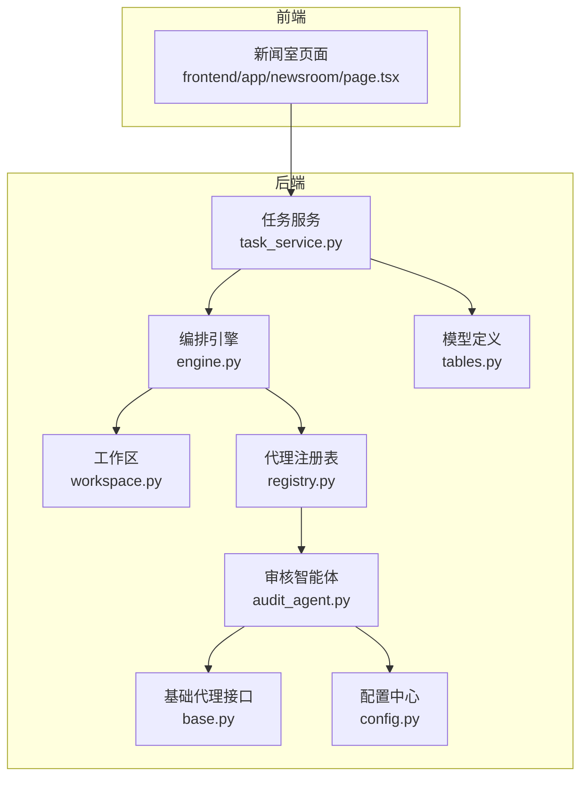
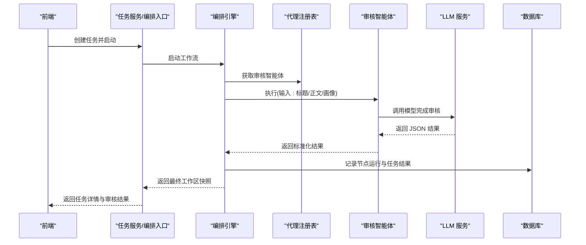
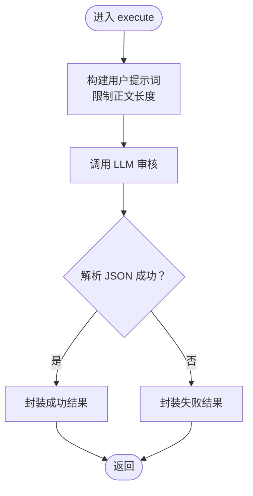
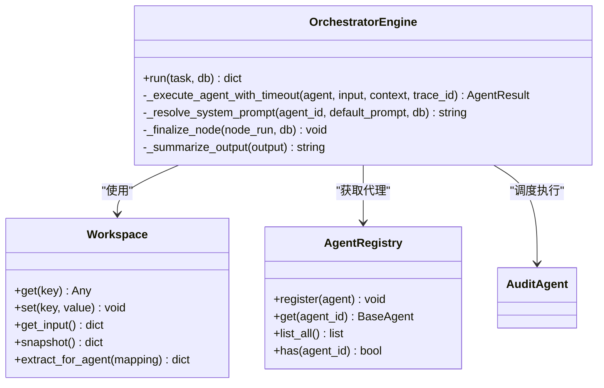
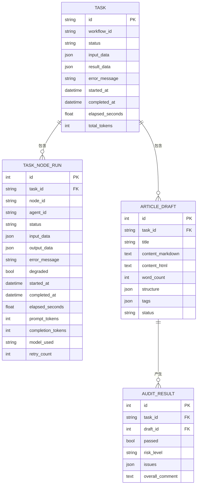
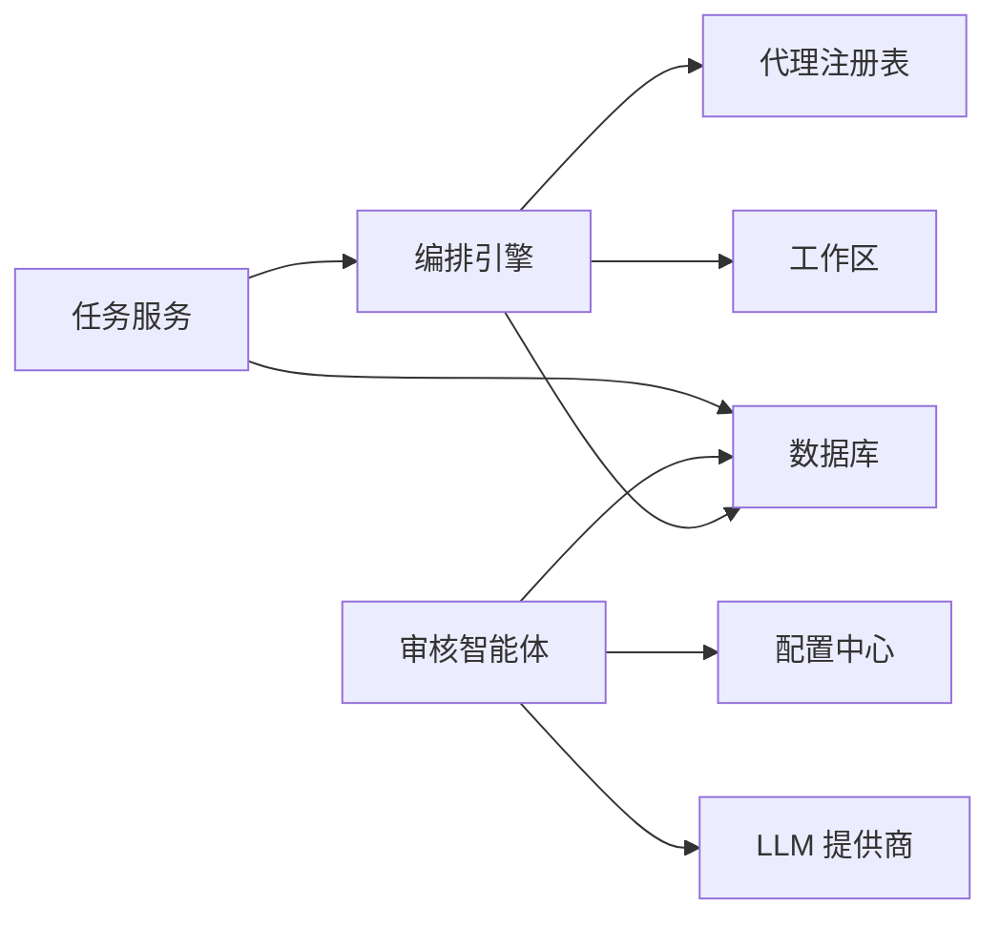

# 内容审核智能体

<cite>
**本文引用的文件**
- [audit_agent.py](file://backend/app/agents/audit_agent.py)
- [base.py](file://backend/app/agents/base.py)
- [engine.py](file://backend/app/orchestrator/engine.py)
- [workspace.py](file://backend/app/orchestrator/workspace.py)
- [config.py](file://backend/app/core/config.py)
- [tables.py](file://backend/app/models/tables.py)
- [task_service.py](file://backend/app/services/task_service.py)
- [agent_routes.py](file://backend/app/api/agent_routes.py)
- [task.py](file://backend/app/schemas/task.py)
- [registry.py](file://backend/app/agents/registry.py)
</cite>

## 目录
1. [简介](#简介)
2. [项目结构](#项目结构)
3. [核心组件](#核心组件)
4. [架构总览](#架构总览)
5. [详细组件分析](#详细组件分析)
6. [依赖分析](#依赖分析)
7. [性能考虑](#性能考虑)
8. [故障排查指南](#故障排查指南)
9. [结论](#结论)
10. [附录](#附录)

## 简介
本技术文档围绕“内容审核智能体”展开，系统性阐述其在生成内容质量检查与合规审核中的关键职责、审核规则引擎、风险评估算法与质量评分机制，并给出识别敏感内容、违规信息与低质量内容的方法。文档还覆盖审核流程、多级检查机制、人工复核流程、审核标准配置、风险等级划分与处理策略，以及审核示例、规则配置指南与异常处理方案。

## 项目结构
后端采用模块化设计，围绕“任务生命周期管理 + 工作流编排 + 代理执行 + 数据持久化”的分层架构组织。前端通过控制室页面展示任务与审核结果，后端提供 API 以查询与更新代理配置。

**图表来源**
- [engine.py:89-285](file://backend/app/orchestrator/engine.py#L89-L285)
- [workspace.py:12-53](file://backend/app/orchestrator/workspace.py#L12-L53)
- [audit_agent.py:12-141](file://backend/app/agents/audit_agent.py#L12-L141)
- [base.py:49-99](file://backend/app/agents/base.py#L49-L99)
- [config.py:52-99](file://backend/app/core/config.py#L52-L99)
- [tables.py:23-158](file://backend/app/models/tables.py#L23-L158)
- [registry.py:10-40](file://backend/app/agents/registry.py#L10-L40)

**章节来源**
- [engine.py:31-86](file://backend/app/orchestrator/engine.py#L31-L86)
- [task_service.py:20-58](file://backend/app/services/task_service.py#L20-L58)
- [tables.py:23-158](file://backend/app/models/tables.py#L23-L158)

## 核心组件
- 审核智能体：负责对生成标题与正文进行合规性审核与质量评估，输出通过/不通过、风险等级、问题清单与综合评价。
- 编排引擎：线性顺序调度各代理节点，管理上下文与工作区，记录节点执行日志与令牌消耗。
- 工作区：任务级上下文容器，按映射规则抽取输入并写入输出。
- 任务服务：创建任务、启动后台运行、查询与分页列出任务，聚合节点执行统计。
- 模型定义：持久化任务、节点执行、账号画像、文章草稿与审核结果等数据。
- 配置中心：统一加载 LLM 提供商与超时参数，支持运行时覆盖。
- 代理注册表：集中注册与检索代理实例，支持按 ID 获取代理。

**章节来源**
- [audit_agent.py:12-141](file://backend/app/agents/audit_agent.py#L12-L141)
- [engine.py:89-285](file://backend/app/orchestrator/engine.py#L89-L285)
- [workspace.py:12-53](file://backend/app/orchestrator/workspace.py#L12-L53)
- [task_service.py:20-126](file://backend/app/services/task_service.py#L20-L126)
- [tables.py:23-158](file://backend/app/models/tables.py#L23-L158)
- [config.py:52-99](file://backend/app/core/config.py#L52-L99)
- [registry.py:10-40](file://backend/app/agents/registry.py#L10-L40)

## 架构总览
审核智能体作为工作流中的一个节点，接收账号画像、候选标题与正文内容，调用 LLM 进行合规与质量评估，返回标准化结果。编排引擎负责节点顺序、超时控制、降级回退与事件广播；任务服务负责任务生命周期与节点运行记录；模型定义支撑数据持久化与审计闭环。

**图表来源**
- [engine.py:92-234](file://backend/app/orchestrator/engine.py#L92-L234)
- [audit_agent.py:53-85](file://backend/app/agents/audit_agent.py#L53-L85)
- [task_service.py:39-64](file://backend/app/services/task_service.py#L39-L64)
- [tables.py:48-74](file://backend/app/models/tables.py#L48-L74)

## 详细组件分析

### 审核智能体（AuditAgent）
- 角色与职责：对生成内容进行合规性与质量评估，输出通过/不通过、风险等级、问题清单与总体评价。
- 输入：账号画像（领域、调性）、候选标题列表、正文 Markdown。
- 处理流程：
  - 构建用户提示词，限制正文长度以避免超 Token。
  - 调用 LLM 完成审核，解析返回的 JSON（兼容代码块包裹）。
  - 标准化输出为 AgentResult。
- 异常处理：JSON 解析失败与 LLM 调用异常均转为失败结果，必要时触发降级回退。
- 降级回退：当服务异常时返回“建议人工复核”的降级结果，保证流程可用性。

**图表来源**
- [audit_agent.py:53-85](file://backend/app/agents/audit_agent.py#L53-L85)
- [audit_agent.py:122-132](file://backend/app/agents/audit_agent.py#L122-L132)

**章节来源**
- [audit_agent.py:12-141](file://backend/app/agents/audit_agent.py#L12-L141)

### 编排引擎（OrchestratorEngine）
- 工作流节点：线性顺序执行，包含账号定位解析、热点分析、选题策划、标题生成、正文生成与审核评估。
- 上下文管理：从工作区提取输入，注入系统提示词（优先使用数据库自定义提示），执行后写回输出。
- 节点执行：带超时控制，单节点失败时根据是否必需决定终止或降级继续。
- 事件广播：节点开始/完成/错误与任务完成事件通过广播器通知订阅者。
- 统计汇总：累计节点耗时与令牌用量，记录到任务与节点运行记录。

**图表来源**
- [engine.py:89-285](file://backend/app/orchestrator/engine.py#L89-L285)
- [workspace.py:12-53](file://backend/app/orchestrator/workspace.py#L12-L53)
- [registry.py:10-40](file://backend/app/agents/registry.py#L10-L40)

**章节来源**
- [engine.py:89-285](file://backend/app/orchestrator/engine.py#L89-L285)

### 工作区（Workspace）
- 作用：任务级上下文容器，支持按映射规则抽取输入字段与写入输出字段。
- 关键方法：get/set/snapshot/extract_for_agent，用于代理间数据传递与隔离。

**章节来源**
- [workspace.py:12-53](file://backend/app/orchestrator/workspace.py#L12-L53)

### 任务服务（TaskService）
- 职责：创建任务、后台运行工作流、查询任务详情与节点运行、分页列出任务。
- 错误处理：捕获运行期异常，设置任务失败状态与错误信息，广播错误事件并关闭任务。

**章节来源**
- [task_service.py:20-126](file://backend/app/services/task_service.py#L20-L126)

### 模型定义（数据持久化）
- 任务表：记录任务生命周期、状态、输入/结果数据、耗时与总令牌数。
- 节点运行表：记录每个节点的执行状态、输入/输出、耗时、令牌用量与降级标记。
- 审核结果表：持久化审核通过与否、风险等级、问题清单与总体评价。
- 其他相关表：账号画像、话题候选、文章草稿等。

**图表来源**
- [tables.py:23-158](file://backend/app/models/tables.py#L23-L158)

**章节来源**
- [tables.py:23-158](file://backend/app/models/tables.py#L23-L158)

### 配置中心（Settings）
- 加载 LLM 提供商配置（DashScope/OpenAI/Compatible/DeepSeek），自动填充 API Key、Base URL 与默认模型。
- 统一超时参数：代理超时、技能超时、LLM 超时。

**章节来源**
- [config.py:21-99](file://backend/app/core/config.py#L21-L99)

### 代理注册表（AgentRegistry）
- 注册与检索代理实例，支持按 ID 获取代理，未找到抛出异常。

**章节来源**
- [registry.py:10-40](file://backend/app/agents/registry.py#L10-L40)

### 审核 API 与前端集成
- 代理配置 API：支持查询代理列表、获取代理详情与更新代理配置（含系统提示词）。
- 前端页面：新闻室页面引入控制室组件，用于展示与交互。

**章节来源**
- [agent_routes.py:17-115](file://backend/app/api/agent_routes.py#L17-L115)
- [frontend/app/newsroom/page.tsx:1-8](file://frontend/app/newsroom/page.tsx#L1-L8)

## 依赖分析
- 审核智能体依赖基础代理接口与配置中心，通过 LLM 提供商调用完成审核。
- 编排引擎依赖代理注册表与工作区，负责节点调度与事件广播。
- 任务服务依赖编排引擎与数据库，负责任务生命周期与节点运行记录。
- 数据模型支撑任务、节点运行与审核结果的持久化。

**图表来源**
- [audit_agent.py:60-75](file://backend/app/agents/audit_agent.py#L60-L75)
- [engine.py:138-147](file://backend/app/orchestrator/engine.py#L138-L147)
- [task_service.py:39-64](file://backend/app/services/task_service.py#L39-L64)
- [tables.py:23-158](file://backend/app/models/tables.py#L23-L158)

**章节来源**
- [audit_agent.py:60-85](file://backend/app/agents/audit_agent.py#L60-L85)
- [engine.py:138-197](file://backend/app/orchestrator/engine.py#L138-L197)
- [task_service.py:39-64](file://backend/app/services/task_service.py#L39-L64)

## 性能考虑
- Token 控制：正文内容预截断，避免超限导致失败与重试开销。
- 超时管理：统一代理与 LLM 超时参数，防止长时间阻塞影响吞吐。
- 事件广播：节点开始/完成/错误事件异步广播，降低主流程耦合。
- 令牌统计：节点运行记录中累积 prompt/completion 令牌，便于成本与性能分析。

[本节为通用指导，无需具体文件分析]

## 故障排查指南
- 审核 JSON 解析失败：检查 LLM 返回格式是否符合预期，必要时调整系统提示词或启用降级。
- LLM 调用异常：确认 API Key、Base URL 与模型配置正确，查看编排引擎超时与回退策略。
- 单节点失败：查看节点运行记录中的错误信息与降级标记，确认是否为必需节点。
- 任务失败：检查任务服务的异常捕获与错误信息记录，定位具体失败节点。

**章节来源**
- [audit_agent.py:82-85](file://backend/app/agents/audit_agent.py#L82-L85)
- [engine.py:176-197](file://backend/app/orchestrator/engine.py#L176-L197)
- [task_service.py:49-64](file://backend/app/services/task_service.py#L49-L64)

## 结论
内容审核智能体通过明确的输入输出规范、标准化的代理接口与编排引擎，实现了对生成内容的合规性与质量评估。结合工作区的数据传递、数据库的持久化与 API 的配置能力，形成了可扩展、可观测且具备降级回退的审核体系。建议在生产环境中持续优化系统提示词、完善风险等级与处理策略，并加强人工复核流程的可视化与可追溯性。

[本节为总结性内容，无需具体文件分析]

## 附录

### 审核规则与质量评分机制
- 审核维度：敏感词检测、事实核查、夸大宣传、标题党程度、调性匹配、内容质量。
- 风险等级：依据问题最高严重程度确定（low/medium/high/unknown）。
- 通过判定：issues 为空且无 high 严重问题时通过；存在 high 问题则不通过。
- 评分机制：综合评价由 LLM 生成，建议结合业务指标（如命中率、误伤率）建立量化评估。

**章节来源**
- [audit_agent.py:17-51](file://backend/app/agents/audit_agent.py#L17-L51)

### 多级检查与人工复核
- 多级检查：编排引擎按顺序执行节点，审核节点失败时可触发降级回退，非必需节点失败不影响整体流程。
- 人工复核：降级回退返回“建议人工复核”，前端可在控制室中查看审核结果与总体评价，进行二次校验。

**章节来源**
- [engine.py:154-175](file://backend/app/orchestrator/engine.py#L154-L175)
- [audit_agent.py:134-141](file://backend/app/agents/audit_agent.py#L134-L141)

### 审核标准配置与系统提示词
- 系统提示词来源：优先使用数据库中自定义提示词，否则回退至代理默认提示词。
- 配置更新：通过代理配置 API 更新提示词、模型配置与重试策略，支持清空为默认。

**章节来源**
- [engine.py:140-145](file://backend/app/orchestrator/engine.py#L140-L145)
- [agent_routes.py:74-115](file://backend/app/api/agent_routes.py#L74-L115)

### 审核示例与规则配置指南
- 示例输入：账号画像（领域、调性）、候选标题列表、正文 Markdown。
- 输出结构：passed、risk_level、issues 列表（含类型、描述、严重程度、位置）、overall_comment。
- 规则配置：在代理配置中设置系统提示词，确保审核维度与约束符合业务需求。

**章节来源**
- [audit_agent.py:53-121](file://backend/app/agents/audit_agent.py#L53-L121)
- [task.py:42-57](file://backend/app/schemas/task.py#L42-L57)