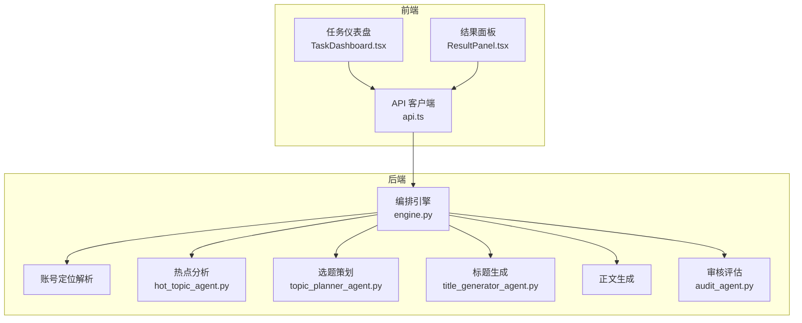
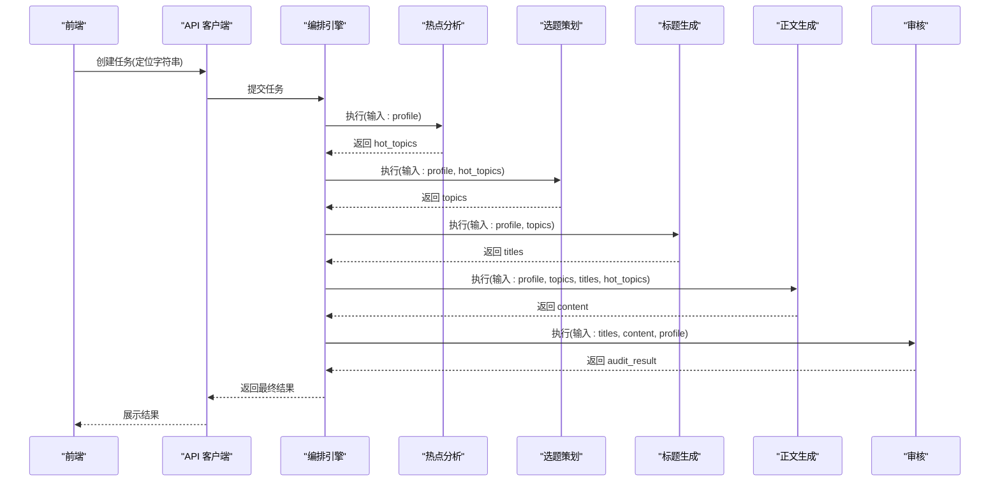
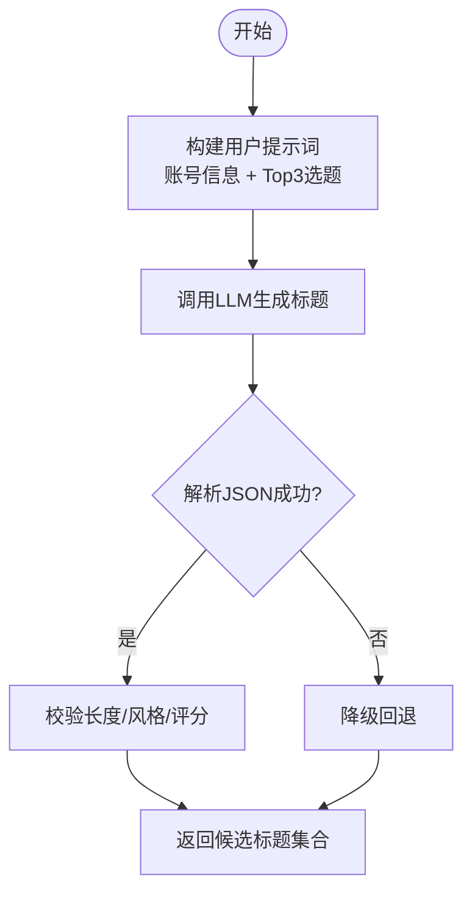
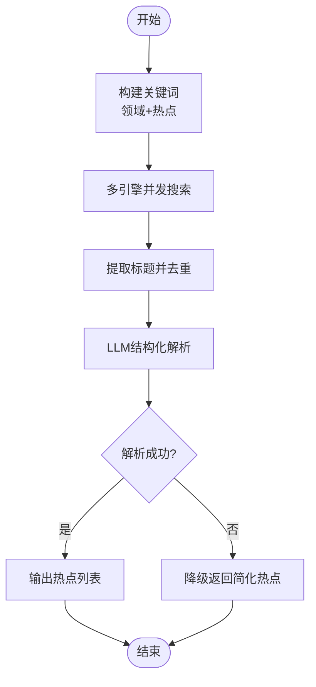
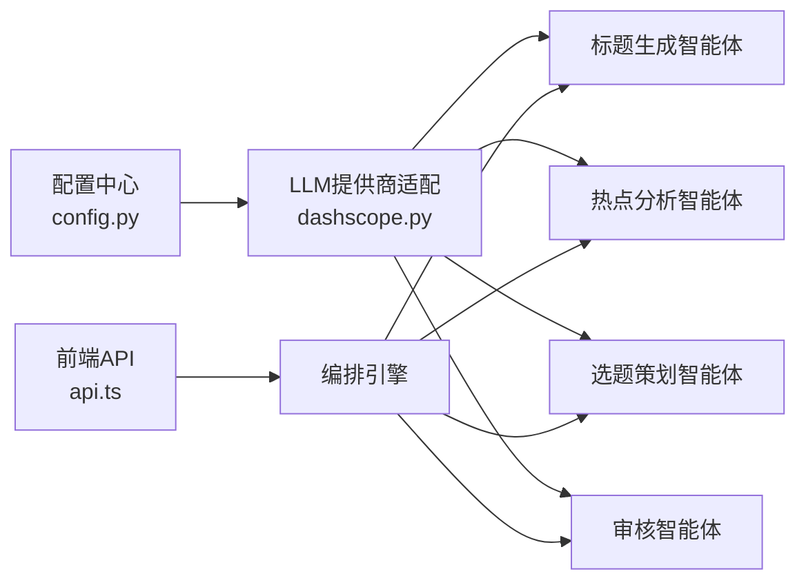

# 标题生成智能体

<cite>
**本文档引用的文件**
- [title_generator_agent.py](file://backend/app/agents/title_generator_agent.py)
- [hot_topic_agent.py](file://backend/app/agents/hot_topic_agent.py)
- [topic_planner_agent.py](file://backend/app/agents/topic_planner_agent.py)
- [audit_agent.py](file://backend/app/agents/audit_agent.py)
- [engine.py](file://backend/app/orchestrator/engine.py)
- [config.py](file://backend/app/core/config.py)
- [dashscope.py](file://backend/app/llm/providers/dashscope.py)
- [TaskDashboard.tsx](file://frontend/components/dashboard/TaskDashboard.tsx)
- [ResultPanel.tsx](file://frontend/components/office/ResultPanel.tsx)
- [api.ts](file://frontend/lib/api.ts)
</cite>

## 目录
1. [简介](#简介)
2. [项目结构](#项目结构)
3. [核心组件](#核心组件)
4. [架构总览](#架构总览)
5. [详细组件分析](#详细组件分析)
6. [依赖关系分析](#依赖关系分析)
7. [性能考量](#性能考量)
8. [故障排查指南](#故障排查指南)
9. [结论](#结论)
10. [附录](#附录)

## 简介
本文件面向“标题生成智能体”的技术实现与使用，系统性阐述其专业能力：围绕微信公众号内容生态，基于账号画像与热点素材，生成多风格候选标题并打分，以提升点击率与传播效果。文档覆盖算法设计、语言模型调用策略、创意优化技巧、风格定制、输入分析与模板匹配、多版本生成机制、质量评估与A/B测试方案、参数调优与性能监控等内容，帮助非技术读者也能理解并高效使用。

## 项目结构
标题生成智能体位于后端智能体体系中，作为工作流的一个节点，与其他智能体协同完成从“账号定位”到“正文生成”的完整流程。前端提供任务监控与结果面板，便于观察各节点状态与生成结果。

**图示来源**
- [engine.py:31-86](file://backend/app/orchestrator/engine.py#L31-L86)
- [TaskDashboard.tsx:21-47](file://frontend/components/dashboard/TaskDashboard.tsx#L21-L47)
- [ResultPanel.tsx:66-103](file://frontend/components/office/ResultPanel.tsx#L66-L103)
- [api.ts:26-55](file://frontend/lib/api.ts#L26-L55)

**章节来源**
- [engine.py:31-86](file://backend/app/orchestrator/engine.py#L31-L86)
- [config.py:52-99](file://backend/app/core/config.py#L52-L99)

## 核心组件
- 标题生成智能体：接收账号画像与选题列表，调用大模型生成4-6个风格各异的候选标题，给出评分与理由，确保长度与风格约束。
- 热点分析智能体：多引擎抓取热点，清洗去重，LLM结构化解析，输出与账号领域相关的高相关度热点。
- 选题策划智能体：结合账号画像与热点，策划3-5个具备传播潜力的选题，标注切入角度、钩子类型、目标情绪与吸引力评分。
- 审核智能体：对标题与正文进行合规性与质量评估，输出风险等级与问题清单。
- 编排引擎：线性顺序执行各智能体，管理上下文、超时与降级回退，广播节点状态，汇总结果。

**章节来源**
- [title_generator_agent.py:12-127](file://backend/app/agents/title_generator_agent.py#L12-L127)
- [hot_topic_agent.py:40-362](file://backend/app/agents/hot_topic_agent.py#L40-L362)
- [topic_planner_agent.py:12-143](file://backend/app/agents/topic_planner_agent.py#L12-L143)
- [audit_agent.py:12-141](file://backend/app/agents/audit_agent.py#L12-L141)
- [engine.py:89-285](file://backend/app/orchestrator/engine.py#L89-L285)

## 架构总览
标题生成智能体在工作流中的职责是“将选题转化为标题”。其上游由热点分析与选题策划提供输入；下游由正文生成与审核评估承接输出。编排引擎统一调度，支持系统提示词动态解析与节点级降级回退。

**图示来源**
- [engine.py:31-86](file://backend/app/orchestrator/engine.py#L31-L86)
- [title_generator_agent.py:44-76](file://backend/app/agents/title_generator_agent.py#L44-L76)
- [hot_topic_agent.py:70-96](file://backend/app/agents/hot_topic_agent.py#L70-L96)
- [topic_planner_agent.py:44-75](file://backend/app/agents/topic_planner_agent.py#L44-L75)
- [audit_agent.py:53-85](file://backend/app/agents/audit_agent.py#L53-L85)

## 详细组件分析

### 标题生成智能体（核心算法与提示工程）
- 角色定位：微信公众号爆款标题写作专家，深谙点击心理与平台推荐机制。
- 输入：账号画像（主领域、内容调性）、选题列表（按吸引力排序，取Top3）。
- 输出：选题标题、4-6个候选标题（文本、风格、评分、理由），评分标准包含：好奇心激发度、与内容匹配度、情绪驱动力、可信度。
- 约束：长度15-30汉字、风格多样化（至少3种）、符合账号调性、避免标题党、按评分降序排列。
- 提示词工程：系统提示词明确任务、输入、输出、约束；用户提示词包含账号信息与Top3选题，引导模型生成多样风格标题。
- LLM调用策略：统一通过DashScope兼容模式调用，自动补全模型前缀；超时与错误捕获，JSON解析兼容Markdown代码块；失败时降级为直接使用第一个选题标题。
- 多版本生成机制：通过系统提示词与用户提示词的组合，形成不同风格倾向的提示词变体，配合温度与最大token等参数微调，实现多版本标题生成。

**图示来源**
- [title_generator_agent.py:44-127](file://backend/app/agents/title_generator_agent.py#L44-L127)

**章节来源**
- [title_generator_agent.py:17-42](file://backend/app/agents/title_generator_agent.py#L17-L42)
- [title_generator_agent.py:78-105](file://backend/app/agents/title_generator_agent.py#L78-L105)
- [title_generator_agent.py:107-127](file://backend/app/agents/title_generator_agent.py#L107-L127)

### 热点分析智能体（输入内容分析与热点抽取）
- 多引擎抓取：微信搜索、搜狗、360搜索，异步并发请求，统一解析与去重。
- 结构化解析：LLM对原始标题进行结构化输出，包含标题、来源、热度评分、摘要、相关度评分。
- 降级策略：当LLM解析失败时，返回简化版热点列表（默认热度与相关度）。

**图示来源**
- [hot_topic_agent.py:70-96](file://backend/app/agents/hot_topic_agent.py#L70-L96)
- [hot_topic_agent.py:114-140](file://backend/app/agents/hot_topic_agent.py#L114-L140)
- [hot_topic_agent.py:238-262](file://backend/app/agents/hot_topic_agent.py#L238-L262)
- [hot_topic_agent.py:264-302](file://backend/app/agents/hot_topic_agent.py#L264-L302)
- [hot_topic_agent.py:335-346](file://backend/app/agents/hot_topic_agent.py#L335-L346)

**章节来源**
- [hot_topic_agent.py:98-112](file://backend/app/agents/hot_topic_agent.py#L98-L112)
- [hot_topic_agent.py:142-162](file://backend/app/agents/hot_topic_agent.py#L142-L162)
- [hot_topic_agent.py:164-236](file://backend/app/agents/hot_topic_agent.py#L164-L236)
- [hot_topic_agent.py:264-302](file://backend/app/agents/hot_topic_agent.py#L264-L302)

### 选题策划智能体（模板匹配与多版本生成）
- 输入：账号画像（主/细分领域、调性、目标受众、关键词）、热点列表。
- 输出：3-5个选题，包含标题、切入角度、钩子类型、目标情绪、吸引力评分与理由。
- 模板匹配：将热点与账号定位进行相关度与情绪驱动度匹配，形成多样化选题模板。
- 多版本生成：通过调整系统提示词中的权重与约束，生成不同侧重点的选题方案。

**章节来源**
- [topic_planner_agent.py:17-42](file://backend/app/agents/topic_planner_agent.py#L17-L42)
- [topic_planner_agent.py:77-113](file://backend/app/agents/topic_planner_agent.py#L77-L113)
- [topic_planner_agent.py:115-125](file://backend/app/agents/topic_planner_agent.py#L115-L125)
- [topic_planner_agent.py:127-142](file://backend/app/agents/topic_planner_agent.py#L127-L142)

### 审核智能体（质量评估与合规检查）
- 输入：候选标题、正文、账号画像。
- 维度：敏感词、事实核查、夸大宣传、标题党程度、调性匹配、内容质量。
- 输出：是否通过、风险等级、问题清单、综合评价。
- 降级策略：当审核服务异常时，返回“建议人工复核”。

**章节来源**
- [audit_agent.py:17-51](file://backend/app/agents/audit_agent.py#L17-L51)
- [audit_agent.py:87-120](file://backend/app/agents/audit_agent.py#L87-L120)
- [audit_agent.py:134-141](file://backend/app/agents/audit_agent.py#L134-L141)

### 编排引擎（工作流与节点管理）
- 默认线性工作流：账号定位解析 → 热点分析 → 选题策划 → 标题生成 → 正文生成 → 审核评估。
- 节点级降级：任一节点失败时尝试调用该节点的降级回退逻辑；若节点标记为必需，则抛出执行错误。
- 提示词解析：优先使用数据库自定义提示词，否则回退至智能体默认提示词。
- 超时控制：统一的agent超时配置，防止长时间阻塞。

**章节来源**
- [engine.py:31-86](file://backend/app/orchestrator/engine.py#L31-L86)
- [engine.py:137-196](file://backend/app/orchestrator/engine.py#L137-L196)
- [engine.py:245-263](file://backend/app/orchestrator/engine.py#L245-L263)
- [engine.py:236-243](file://backend/app/orchestrator/engine.py#L236-L243)

## 依赖关系分析
- LLM提供商：统一通过DashScope兼容模式调用，自动补全模型前缀；支持OpenAI、DeepSeek等多提供商切换。
- 配置中心：从环境变量加载LLM配置，支持超时、模型、基础URL与API Key。
- 前端集成：通过SSE流式接收节点状态，任务完成后拉取最终结果；结果面板展示候选标题与评分。

**图示来源**
- [config.py:21-49](file://backend/app/core/config.py#L21-L49)
- [config.py:89-99](file://backend/app/core/config.py#L89-L99)
- [dashscope.py:63-89](file://backend/app/llm/providers/dashscope.py#L63-L89)
- [api.ts:26-55](file://frontend/lib/api.ts#L26-L55)

**章节来源**
- [config.py:21-49](file://backend/app/core/config.py#L21-L49)
- [dashscope.py:63-89](file://backend/app/llm/providers/dashscope.py#L63-L89)
- [api.ts:26-55](file://frontend/lib/api.ts#L26-L55)

## 性能考量
- 异步并发：热点分析阶段采用多引擎并发抓取，缩短等待时间。
- 超时与降级：统一的agent超时与节点降级策略，保障整体稳定性。
- Token统计：编排引擎记录各节点prompt与completion token，便于成本与性能分析。
- 前端监控：仪表盘展示成功率、平均响应时间、节点状态，便于实时观测。

**章节来源**
- [hot_topic_agent.py:121-140](file://backend/app/agents/hot_topic_agent.py#L121-L140)
- [engine.py:100-106](file://backend/app/orchestrator/engine.py#L100-L106)
- [engine.py:211-215](file://backend/app/orchestrator/engine.py#L211-L215)
- [TaskDashboard.tsx:30-47](file://frontend/components/dashboard/TaskDashboard.tsx#L30-L47)

## 故障排查指南
- LLM调用失败：检查LLM提供商配置（API Key、Base URL、模型名），确认网络可达与超时设置合理。
- JSON解析失败：标题生成智能体对Markdown代码块有解析兼容，若仍失败，检查系统提示词输出格式是否严格遵循JSON结构。
- 节点超时：适当提高agent超时配置，或优化提示词长度与复杂度。
- 审核异常：当审核服务不可用时，系统会降级返回“建议人工复核”，需人工介入评估。

**章节来源**
- [title_generator_agent.py:73-76](file://backend/app/agents/title_generator_agent.py#L73-L76)
- [engine.py:176-196](file://backend/app/orchestrator/engine.py#L176-L196)
- [audit_agent.py:134-141](file://backend/app/agents/audit_agent.py#L134-L141)

## 结论
标题生成智能体通过严谨的提示工程、多引擎热点分析与LLM结构化输出，实现了从“选题”到“标题”的自动化与标准化。结合编排引擎的降级与监控能力，能够在保证质量的同时提升生产效率。建议在实际使用中持续优化提示词模板、参数与风格策略，并建立A/B测试与点击率预测闭环，以进一步提升标题的传播效果。

## 附录

### 标题风格与创意优化技巧
- 风格类型：悬念型、数字型、故事型、反问型、警告型、实用型，确保至少覆盖3种。
- 创意要点：结合热点钩子（恐惧/希望/时效/实用）、目标情绪（焦虑/希望/好奇）、可信度与匹配度。
- 长度控制：15-30汉字，避免过度标题党，保持与账号调性一致。

**章节来源**
- [title_generator_agent.py:30-42](file://backend/app/agents/title_generator_agent.py#L30-L42)

### 输入内容分析与模板匹配
- 热点相关度：仅保留与账号领域相关度高于阈值的热点，按热度×相关度排序。
- 选题模板：将热点与账号定位、目标受众、内容调性进行匹配，形成多样化切入角度与钩子类型。

**章节来源**
- [hot_topic_agent.py:64-68](file://backend/app/agents/hot_topic_agent.py#L64-L68)
- [topic_planner_agent.py:37-42](file://backend/app/agents/topic_planner_agent.py#L37-L42)

### 多版本生成机制与参数调优
- 提示词变体：通过系统提示词与用户提示词的不同组合，形成不同风格倾向的提示词模板。
- 参数调优：温度（创造性）、最大token（长度）、模型选择（DashScope/OpenAI/DeepSeek）。
- LLM提供商切换：通过配置中心选择默认提供商与模型，便于A/B测试与成本控制。

**章节来源**
- [config.py:21-49](file://backend/app/core/config.py#L21-L49)
- [dashscope.py:63-68](file://backend/app/llm/providers/dashscope.py#L63-L68)

### 标题质量评估标准与A/B测试
- 评估维度：好奇心激发度、与内容匹配度、情绪驱动力、可信度（评分1-10）。
- A/B测试：对比不同提示词模板、风格权重与LLM提供商，收集点击率与转化率指标，持续迭代。

**章节来源**
- [title_generator_agent.py:42](file://backend/app/agents/title_generator_agent.py#L42)

### 性能监控方法
- 前端仪表盘：展示任务进度、成功率、平均响应时间、节点状态。
- 后端日志：节点开始/完成事件、错误广播、token统计与耗时计算。

**章节来源**
- [TaskDashboard.tsx:21-47](file://frontend/components/dashboard/TaskDashboard.tsx#L21-L47)
- [engine.py:124-132](file://backend/app/orchestrator/engine.py#L124-L132)
- [engine.py:200-210](file://backend/app/orchestrator/engine.py#L200-L210)