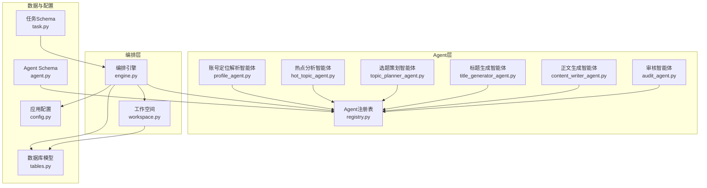
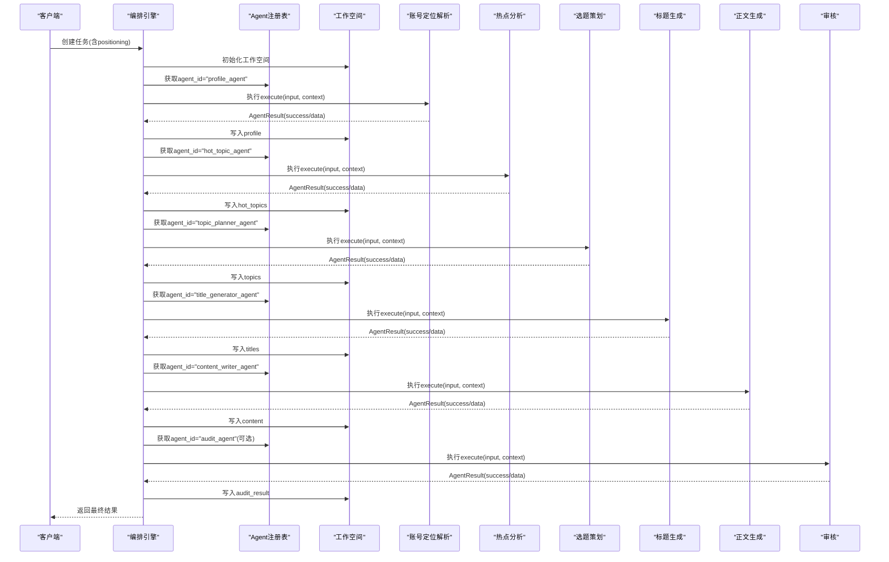
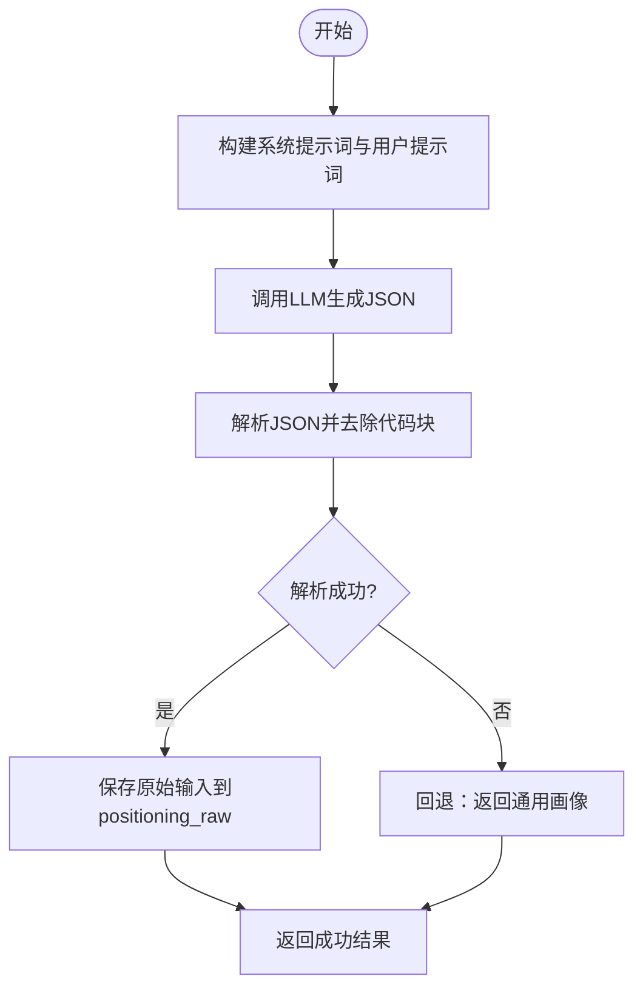
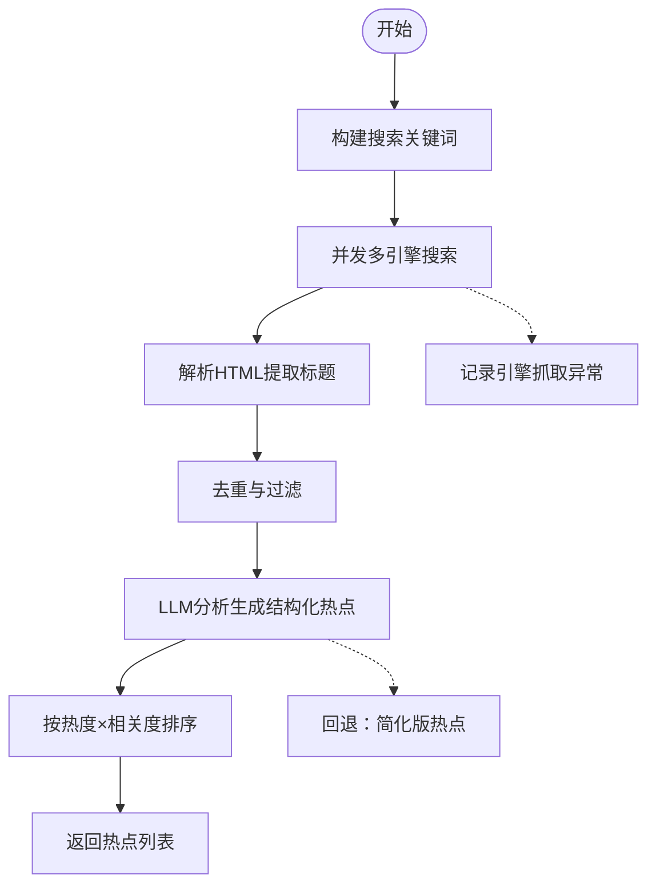
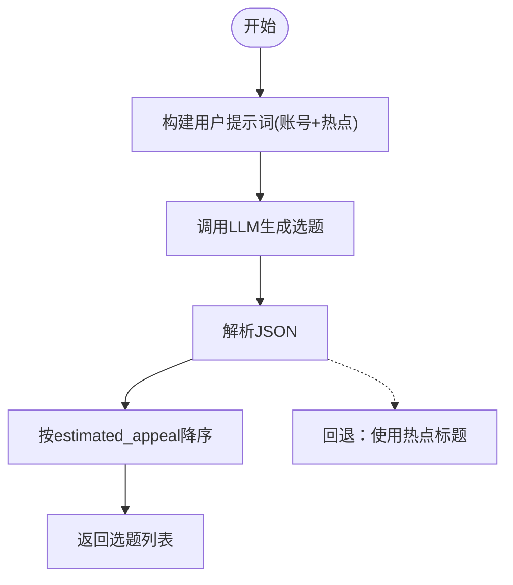
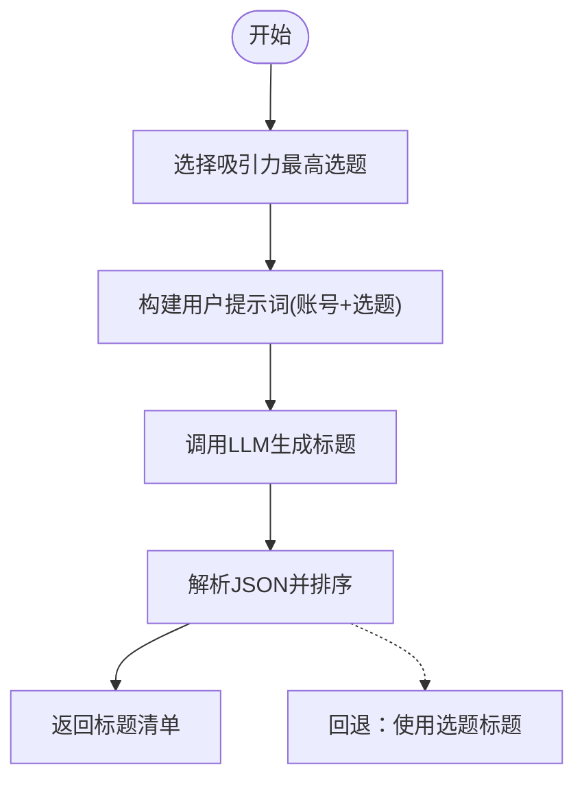
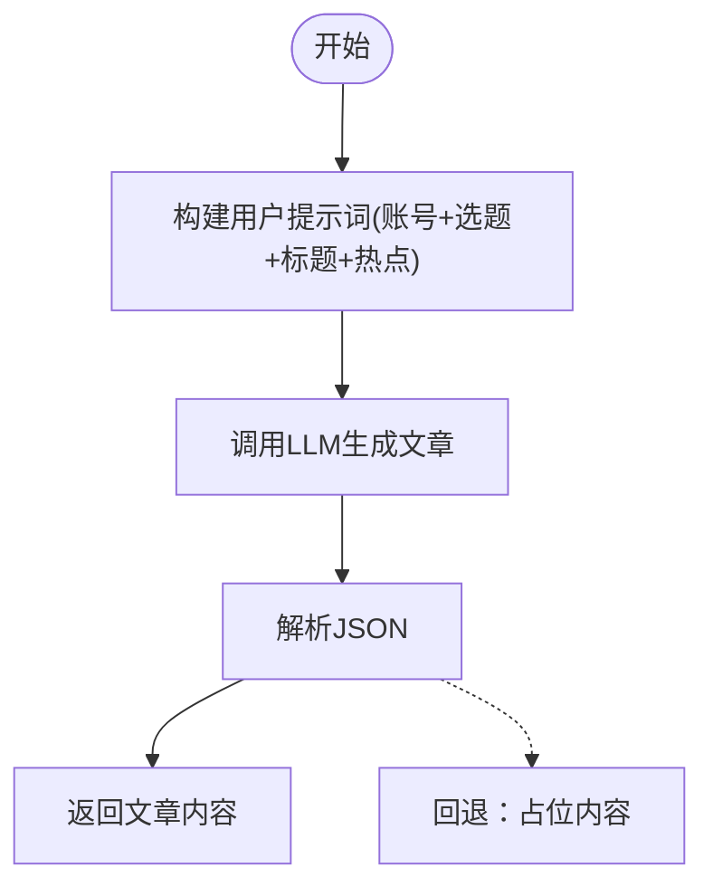
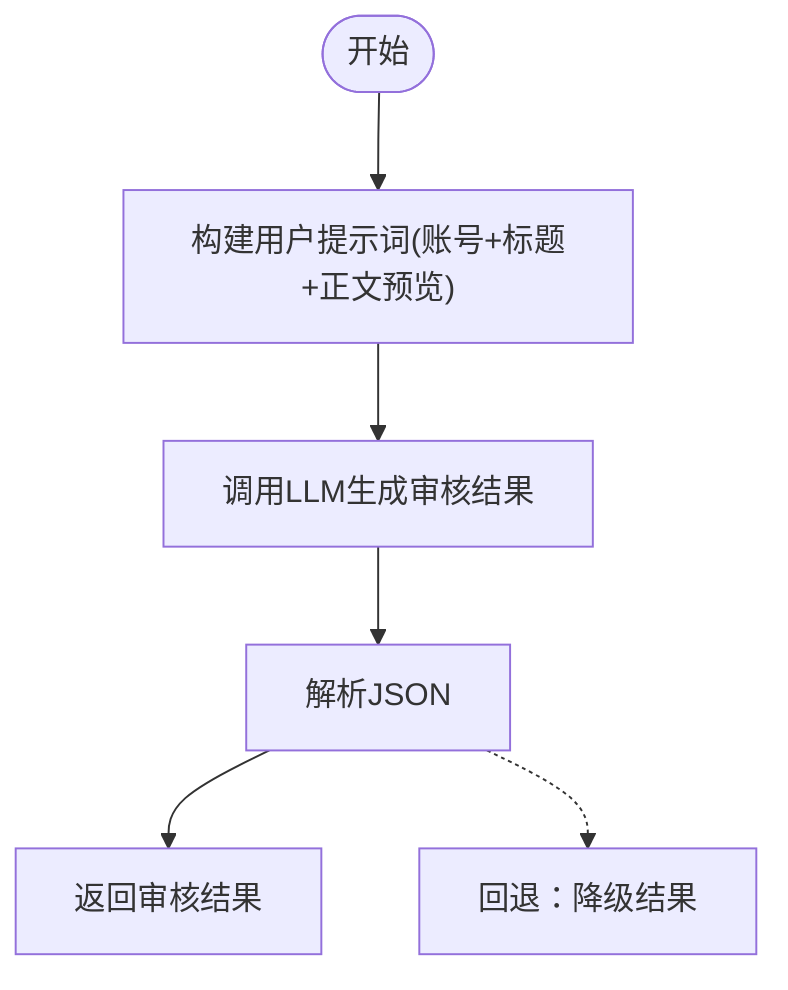
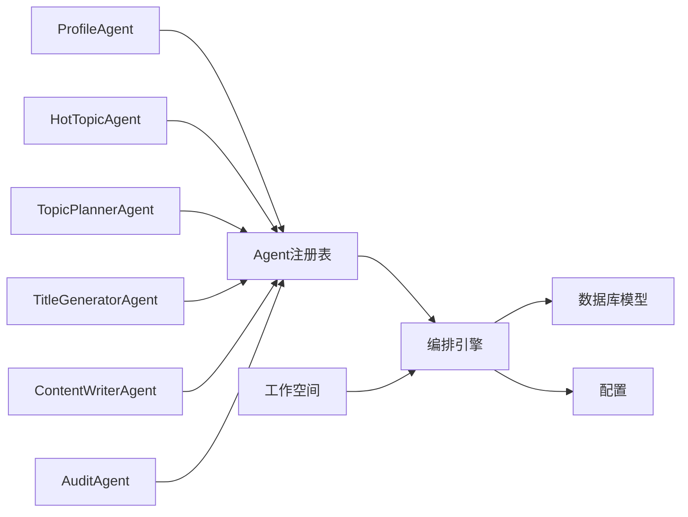

# 核心Agent实现

<cite>
**本文档引用的文件**
- [backend/app/agents/base.py](file://backend/app/agents/base.py)
- [backend/app/agents/profile_agent.py](file://backend/app/agents/profile_agent.py)
- [backend/app/agents/hot_topic_agent.py](file://backend/app/agents/hot_topic_agent.py)
- [backend/app/agents/topic_planner_agent.py](file://backend/app/agents/topic_planner_agent.py)
- [backend/app/agents/title_generator_agent.py](file://backend/app/agents/title_generator_agent.py)
- [backend/app/agents/content_writer_agent.py](file://backend/app/agents/content_writer_agent.py)
- [backend/app/agents/audit_agent.py](file://backend/app/agents/audit_agent.py)
- [backend/app/agents/registry.py](file://backend/app/agents/registry.py)
- [backend/app/orchestrator/engine.py](file://backend/app/orchestrator/engine.py)
- [backend/app/orchestrator/workspace.py](file://backend/app/orchestrator/workspace.py)
- [backend/app/models/tables.py](file://backend/app/models/tables.py)
- [backend/app/schemas/task.py](file://backend/app/schemas/task.py)
- [backend/app/schemas/agent.py](file://backend/app/schemas/agent.py)
- [backend/app/core/config.py](file://backend/app/core/config.py)
</cite>

## 目录
1. [简介](#简介)
2. [项目结构](#项目结构)
3. [核心组件](#核心组件)
4. [架构总览](#架构总览)
5. [详细组件分析](#详细组件分析)
6. [依赖分析](#依赖分析)
7. [性能考虑](#性能考虑)
8. [故障排除指南](#故障排除指南)
9. [结论](#结论)
10. [附录](#附录)

## 简介
本文件面向HotClaw六大核心Agent，提供全面的技术文档。内容涵盖每个Agent的功能职责、输入输出Schema、执行逻辑与依赖关系；深入解释账号定位解析Agent的数据采集与验证机制、热点分析Agent的算法实现与数据处理流程、选题策划Agent的创意生成与筛选策略、标题生成Agent的语言模型调用与优化技巧、内容写作Agent的结构化输出与质量控制、审核Agent的规则引擎与风险评估；阐述各Agent间的协作模式、数据流转与错误传播机制；并提供配置参数、性能优化与故障排除指南。

## 项目结构
HotClaw后端采用模块化设计，核心Agent位于backend/app/agents目录，编排器位于backend/app/orchestrator目录，数据库模型位于backend/app/models/tables.py，任务与Schema定义位于backend/app/schemas目录，全局配置位于backend/app/core/config.py。

图表来源
- [backend/app/agents/profile_agent.py:1-102](file://backend/app/agents/profile_agent.py#L1-L102)
- [backend/app/agents/hot_topic_agent.py:1-362](file://backend/app/agents/hot_topic_agent.py#L1-L362)
- [backend/app/agents/topic_planner_agent.py:1-143](file://backend/app/agents/topic_planner_agent.py#L1-L143)
- [backend/app/agents/title_generator_agent.py:1-127](file://backend/app/agents/title_generator_agent.py#L1-L127)
- [backend/app/agents/content_writer_agent.py:1-154](file://backend/app/agents/content_writer_agent.py#L1-L154)
- [backend/app/agents/audit_agent.py:1-141](file://backend/app/agents/audit_agent.py#L1-L141)
- [backend/app/agents/registry.py:1-40](file://backend/app/agents/registry.py#L1-L40)
- [backend/app/orchestrator/engine.py:1-285](file://backend/app/orchestrator/engine.py#L1-L285)
- [backend/app/orchestrator/workspace.py:1-53](file://backend/app/orchestrator/workspace.py#L1-L53)
- [backend/app/models/tables.py:1-319](file://backend/app/models/tables.py#L1-L319)
- [backend/app/schemas/task.py:1-83](file://backend/app/schemas/task.py#L1-L83)
- [backend/app/schemas/agent.py:1-29](file://backend/app/schemas/agent.py#L1-L29)
- [backend/app/core/config.py:1-99](file://backend/app/core/config.py#L1-L99)

章节来源
- [backend/app/agents/base.py:1-99](file://backend/app/agents/base.py#L1-L99)
- [backend/app/orchestrator/engine.py:31-86](file://backend/app/orchestrator/engine.py#L31-L86)
- [backend/app/orchestrator/workspace.py:12-53](file://backend/app/orchestrator/workspace.py#L12-L53)
- [backend/app/models/tables.py:23-158](file://backend/app/models/tables.py#L23-L158)
- [backend/app/schemas/task.py:10-83](file://backend/app/schemas/task.py#L10-L83)
- [backend/app/schemas/agent.py:6-29](file://backend/app/schemas/agent.py#L6-L29)
- [backend/app/core/config.py:52-99](file://backend/app/core/config.py#L52-L99)

## 核心组件
- Agent基类与结果封装：统一的AgentResult结构、成功/失败封装方法、系统提示词解析与回退策略接口。
- Agent注册表：集中管理Agent实例，提供按agent_id检索与列表查询能力。
- 工作空间：任务级上下文容器，支持键映射提取输入、写入输出、快照持久化。
- 编排引擎：线性流水线编排，节点级超时控制、错误传播、降级回退、事件广播与令牌统计。
- 数据模型：任务、节点运行、账号画像、话题候选、文章草稿、审核结果等核心实体。
- 任务与Agent Schema：标准化请求/响应结构，便于前端与API交互。
- 全局配置：LLM提供商、超时、数据库与Redis连接等系统级参数。

章节来源
- [backend/app/agents/base.py:18-99](file://backend/app/agents/base.py#L18-L99)
- [backend/app/agents/registry.py:10-40](file://backend/app/agents/registry.py#L10-L40)
- [backend/app/orchestrator/workspace.py:12-53](file://backend/app/orchestrator/workspace.py#L12-L53)
- [backend/app/orchestrator/engine.py:89-285](file://backend/app/orchestrator/engine.py#L89-L285)
- [backend/app/models/tables.py:23-158](file://backend/app/models/tables.py#L23-L158)
- [backend/app/schemas/task.py:10-83](file://backend/app/schemas/task.py#L10-L83)
- [backend/app/schemas/agent.py:6-29](file://backend/app/schemas/agent.py#L6-L29)
- [backend/app/core/config.py:52-99](file://backend/app/core/config.py#L52-L99)

## 架构总览
HotClaw采用“线性编排+Agent节点”的流水线架构。默认工作流顺序为：账号定位解析 → 热点分析 → 选题策划 → 标题生成 → 正文生成 → 审核评估。编排引擎负责节点调度、超时控制、错误传播与降级回退，并通过事件总线向前端推送节点开始/完成/错误事件。工作空间作为共享上下文，承载跨Agent的数据传递。

图表来源
- [backend/app/orchestrator/engine.py:92-234](file://backend/app/orchestrator/engine.py#L92-L234)
- [backend/app/orchestrator/engine.py:31-86](file://backend/app/orchestrator/engine.py#L31-L86)
- [backend/app/agents/registry.py:23-28](file://backend/app/agents/registry.py#L23-L28)

## 详细组件分析

### 账号定位解析智能体
- 功能职责：将用户输入的账号定位描述解析为结构化画像，包含领域、细分领域、目标受众、内容调性、内容风格、关键词等。
- 输入Schema：positioning(string)，必填。
- 输出Schema：domain(string)、subdomain(string)、target_audience(object)、tone(string)、content_style(string)、keywords(array)、positioning_raw(string)。
- 执行逻辑：构造系统提示词与用户提示词，调用LLM生成JSON，解析返回内容并处理Markdown代码块，保留原始输入。
- 错误处理：JSON解析失败与LLM异常分别返回不同错误码；提供回退策略，返回通用画像。
- 依赖关系：依赖litellm、settings(LLM配置)、BaseAgent。

图表来源
- [backend/app/agents/profile_agent.py:43-102](file://backend/app/agents/profile_agent.py#L43-L102)

章节来源
- [backend/app/agents/profile_agent.py:12-102](file://backend/app/agents/profile_agent.py#L12-L102)
- [backend/app/agents/base.py:49-99](file://backend/app/agents/base.py#L49-L99)
- [backend/app/core/config.py:21-49](file://backend/app/core/config.py#L21-L49)

### 热点分析智能体
- 功能职责：从多搜索引擎抓取热点，清洗去重，调用LLM分析生成结构化热点列表。
- 输入Schema：profile(object)。
- 输出Schema：hot_topics(array)，每项包含title、source、heat_score(int)、summary(string)、relevance_score(float)。
- 执行逻辑：
  - 构建搜索关键词（优先使用profile.keywords，否则使用domain+热点）。
  - 并发多引擎搜索（微信搜索、搜狗、360搜索），解析HTML提取标题。
  - 去重与过滤（长度、重复规范化）。
  - LLM分析生成结构化热点，按热度×相关度排序，来源多样化。
- 错误处理：引擎抓取异常记录告警；LLM解析失败或异常时回退为简化版热点。
- 依赖关系：httpx并发抓取、正则解析、litellm、settings。

图表来源
- [backend/app/agents/hot_topic_agent.py:70-362](file://backend/app/agents/hot_topic_agent.py#L70-L362)

章节来源
- [backend/app/agents/hot_topic_agent.py:40-362](file://backend/app/agents/hot_topic_agent.py#L40-L362)
- [backend/app/core/config.py:21-49](file://backend/app/core/config.py#L21-L49)

### 选题策划智能体
- 功能职责：结合账号画像与热点，策划3-5个具备传播潜力的选题，包含切入角度、钩子类型、目标情绪、预估吸引力与理由。
- 输入Schema：profile(object)、hot_topics(object)。
- 输出Schema：topics(array)，每项包含title、angle、hook、target_emotion、estimated_appeal、reasoning。
- 执行逻辑：构造用户提示词，调用LLM生成选题清单，按estimated_appeal降序排列。
- 错误处理：JSON解析失败与LLM异常返回失败；回退策略直接使用热点标题生成简化选题。
- 依赖关系：litellm、settings。

图表来源
- [backend/app/agents/topic_planner_agent.py:44-143](file://backend/app/agents/topic_planner_agent.py#L44-L143)

章节来源
- [backend/app/agents/topic_planner_agent.py:12-143](file://backend/app/agents/topic_planner_agent.py#L12-L143)
- [backend/app/core/config.py:21-49](file://backend/app/core/config.py#L21-L49)

### 标题生成智能体
- 功能职责：为吸引力最高的选题生成4-6个风格各异的候选标题，给出评分与理由。
- 输入Schema：profile(object)、topics(object)。
- 输出Schema：selected_topic(string)、titles(array)，每项包含text、style、score、reasoning。
- 执行逻辑：选择estimated_appeal最高的选题，构造提示词，调用LLM生成标题清单，按score降序。
- 错误处理：JSON解析失败与LLM异常返回失败；回退策略直接使用选题标题。
- 依赖关系：litellm、settings。

图表来源
- [backend/app/agents/title_generator_agent.py:44-127](file://backend/app/agents/title_generator_agent.py#L44-L127)

章节来源
- [backend/app/agents/title_generator_agent.py:12-127](file://backend/app/agents/title_generator_agent.py#L12-L127)
- [backend/app/core/config.py:21-49](file://backend/app/core/config.py#L21-L49)

### 正文生成智能体
- 功能职责：根据选题、标题与热点素材生成完整公众号文章，输出Markdown、字数、结构与标签。
- 输入Schema：profile(object)、topics(object)、titles(object)、hot_topics(object)。
- 输出Schema：content_markdown(string)、word_count(int)、structure(object)、tags(array)。
- 执行逻辑：构造提示词（账号信息、选中选题、候选标题、热点素材），调用LLM生成JSON，解析并返回。
- 错误处理：JSON解析失败与LLM异常返回失败；回退策略返回占位内容。
- 依赖关系：litellm、settings。

图表来源
- [backend/app/agents/content_writer_agent.py:51-154](file://backend/app/agents/content_writer_agent.py#L51-L154)

章节来源
- [backend/app/agents/content_writer_agent.py:12-154](file://backend/app/agents/content_writer_agent.py#L12-L154)
- [backend/app/core/config.py:21-49](file://backend/app/core/config.py#L21-L49)

### 审核智能体
- 功能职责：对生成的文章进行合规性审核与质量评估，输出通过与否、风险等级、问题列表与综合评价。
- 输入Schema：profile(object)、titles(object)、content(object)。
- 输出Schema：passed(bool)、risk_level(string)、issues(array)、overall_comment(string)。
- 执行逻辑：构造用户提示词（账号信息、候选标题、文章正文预览），调用LLM生成JSON，解析并返回。
- 错误处理：JSON解析失败与LLM异常返回失败；回退策略返回降级结果（建议人工复核）。
- 依赖关系：litellm、settings。

图表来源
- [backend/app/agents/audit_agent.py:53-141](file://backend/app/agents/audit_agent.py#L53-L141)

章节来源
- [backend/app/agents/audit_agent.py:12-141](file://backend/app/agents/audit_agent.py#L12-L141)
- [backend/app/core/config.py:21-49](file://backend/app/core/config.py#L21-L49)

## 依赖分析
- Agent注册表集中管理所有Agent实例，编排引擎通过agent_id获取具体Agent并执行。
- 工作空间提供节点间数据共享，输入映射支持从原始输入与历史输出抽取字段。
- 编排引擎负责节点生命周期管理、超时控制、错误传播与降级回退。
- 数据库模型支撑任务、节点运行、账号画像、话题候选、文章草稿与审核结果的持久化。
- 配置模块统一管理LLM提供商、超时与应用参数，支持运行时动态解析系统提示词。

图表来源
- [backend/app/agents/registry.py:10-40](file://backend/app/agents/registry.py#L10-L40)
- [backend/app/orchestrator/engine.py:138-196](file://backend/app/orchestrator/engine.py#L138-L196)
- [backend/app/orchestrator/workspace.py:36-52](file://backend/app/orchestrator/workspace.py#L36-L52)
- [backend/app/models/tables.py:23-158](file://backend/app/models/tables.py#L23-L158)
- [backend/app/core/config.py:52-99](file://backend/app/core/config.py#L52-L99)

章节来源
- [backend/app/agents/registry.py:10-40](file://backend/app/agents/registry.py#L10-L40)
- [backend/app/orchestrator/engine.py:138-196](file://backend/app/orchestrator/engine.py#L138-L196)
- [backend/app/orchestrator/workspace.py:36-52](file://backend/app/orchestrator/workspace.py#L36-L52)
- [backend/app/models/tables.py:23-158](file://backend/app/models/tables.py#L23-L158)
- [backend/app/core/config.py:52-99](file://backend/app/core/config.py#L52-L99)

## 性能考虑
- 并发抓取：热点分析Agent对多搜索引擎采用异步并发抓取，降低整体延迟。
- 内容截断：审核Agent对正文内容进行长度限制，避免超出Token上限。
- 超时控制：编排引擎为节点执行设置超时，防止长时间阻塞；LLM调用亦设置独立超时。
- 令牌统计：编排引擎汇总prompt与completion令牌，便于成本与性能监控。
- 回退降级：各Agent提供回退策略，保障关键路径可用性。

章节来源
- [backend/app/agents/hot_topic_agent.py:114-140](file://backend/app/agents/hot_topic_agent.py#L114-L140)
- [backend/app/agents/audit_agent.py:110-115](file://backend/app/agents/audit_agent.py#L110-L115)
- [backend/app/orchestrator/engine.py:236-243](file://backend/app/orchestrator/engine.py#L236-L243)
- [backend/app/core/config.py:79-82](file://backend/app/core/config.py#L79-L82)

## 故障排除指南
- LLM调用失败：检查LLM提供商配置（API Key、Base URL、Model）、网络连通性与超时设置。
- JSON解析失败：确认Agent系统提示词严格要求输出JSON格式，必要时调整提示词约束。
- 节点超时：提升agent_timeout或llm_timeout，检查下游服务性能；必要时启用回退策略。
- 审核Agent异常：回退返回降级结果，建议人工复核；检查输入内容长度与格式。
- 热点抓取异常：关注引擎抓取日志，确认目标站点可访问性与解析规则有效性。

章节来源
- [backend/app/agents/profile_agent.py:74-77](file://backend/app/agents/profile_agent.py#L74-L77)
- [backend/app/agents/audit_agent.py:82-85](file://backend/app/agents/audit_agent.py#L82-L85)
- [backend/app/orchestrator/engine.py:176-196](file://backend/app/orchestrator/engine.py#L176-L196)
- [backend/app/core/config.py:79-82](file://backend/app/core/config.py#L79-L82)

## 结论
HotClaw六大核心Agent围绕线性编排流水线协同工作，通过标准化的输入输出Schema、统一的Agent基类与结果封装、集中式注册表与工作空间，实现了可扩展、可观测、可降级的内容生产体系。热点分析Agent的多引擎抓取与LLM分析、选题策划Agent的创意生成与筛选、标题生成Agent的评分与风格多样性、内容写作Agent的结构化输出与质量控制、审核Agent的规则引擎与风险评估，共同构成完整的自动化内容生产链路。

## 附录

### 配置参数一览
- LLM提供商与模型：LLM_DEFAULT_PROVIDER、DASHSCOPE_*、OPENAI_*、COMPATIBLE_*、DEEPSEEK_*。
- 超时设置：agent_timeout、skill_timeout、llm_timeout。
- 数据库与缓存：database_url、redis_url。
- 应用参数：app_env、app_debug、app_host、app_port、log_level。

章节来源
- [backend/app/core/config.py:21-49](file://backend/app/core/config.py#L21-L49)
- [backend/app/core/config.py:79-82](file://backend/app/core/config.py#L79-L82)
- [backend/app/core/config.py:52-99](file://backend/app/core/config.py#L52-L99)

### 数据模型概览
- 任务与节点运行：记录任务生命周期、节点执行状态、耗时、令牌用量与错误信息。
- 账号画像：存储解析后的领域、受众、调性、风格与关键词。
- 话题候选：存储选题策划阶段生成的候选主题及其评分与选择标记。
- 文章草稿与审核结果：存储正文、结构、标签与审核通过与否、风险等级与问题列表。

章节来源
- [backend/app/models/tables.py:23-158](file://backend/app/models/tables.py#L23-L158)