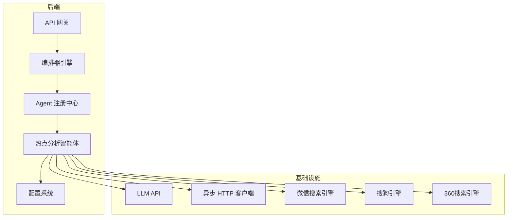
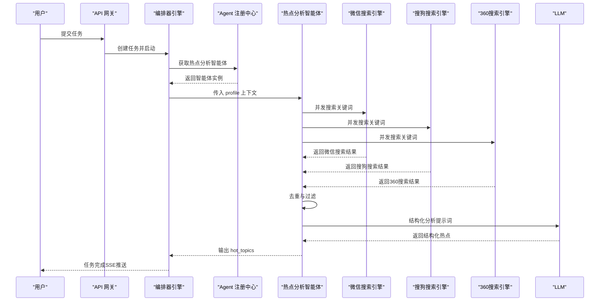
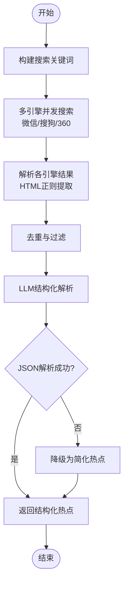
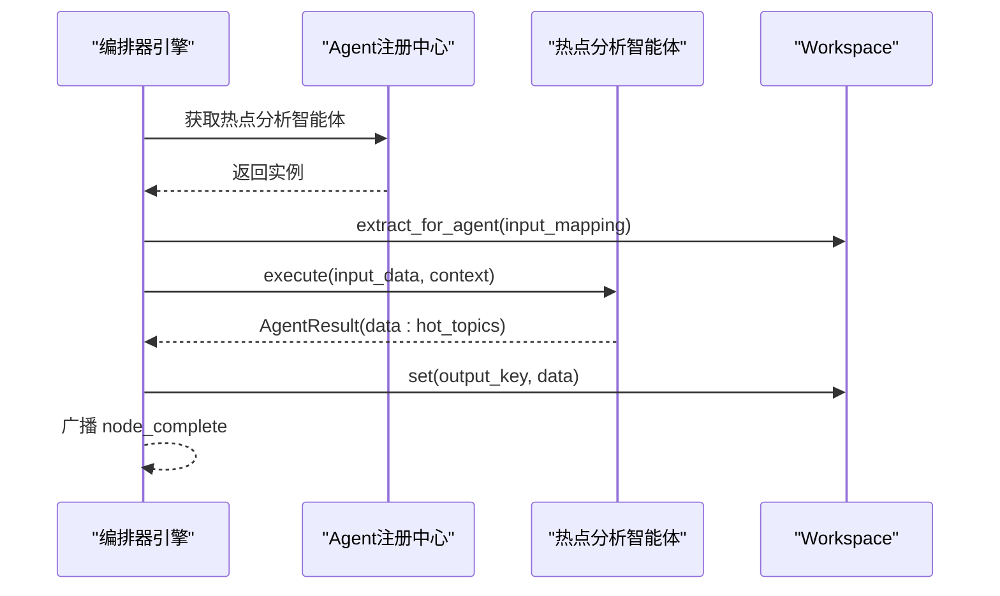
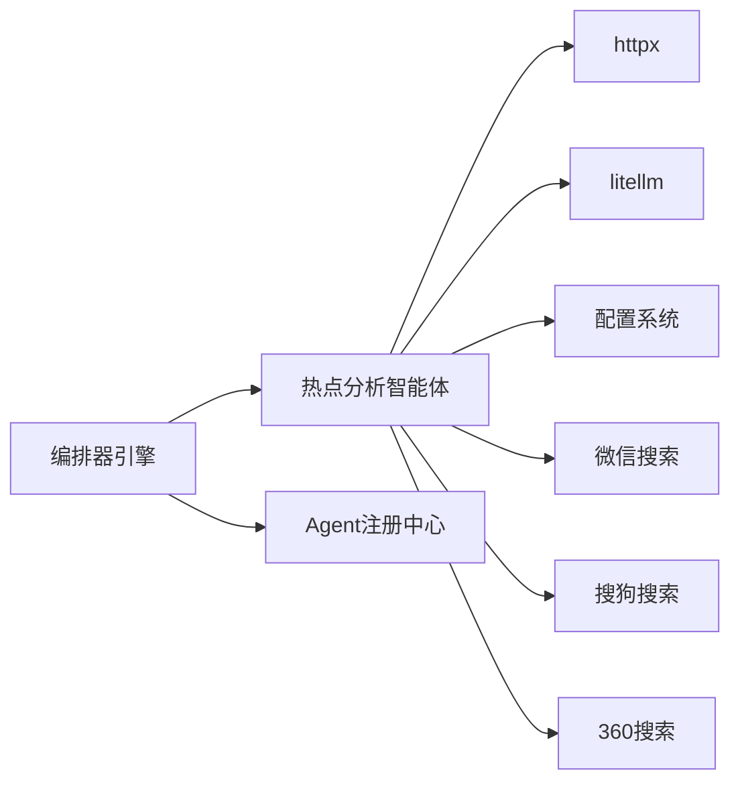

# 热点分析智能体

<cite>
**本文引用的文件**   
- [hot_topic_agent.py](file://backend/app/agents/hot_topic_agent.py)
- [base.py](file://backend/app/agents/base.py)
- [config.py](file://backend/app/core/config.py)
- [engine.py](file://backend/app/orchestrator/engine.py)
- [registry.py](file://backend/app/agents/registry.py)
- [ARCHITECTURE.md](file://ARCHITECTURE.md)
- [topic_planner_agent.py](file://backend/app/agents/topic_planner_agent.py)
</cite>

## 更新摘要
**变更内容**   
- 更新多引擎并发搜索实现，包括微信、搜狗、360搜索支持
- 新增异步HTTP请求和并发执行机制
- 增强HTML解析器以适配不同搜索引擎的结构
- 优化性能考量和错误处理策略

## 目录
1. [简介](#简介)
2. [项目结构](#项目结构)
3. [核心组件](#核心组件)
4. [架构总览](#架构总览)
5. [详细组件分析](#详细组件分析)
6. [依赖分析](#依赖分析)
7. [性能考量](#性能考量)
8. [故障排除指南](#故障排除指南)
9. [结论](#结论)
10. [附录](#附录)

## 简介
热点分析智能体是内容生产流水线中的关键环节，负责实时抓取并分析与账号领域相关的热点话题。它通过多引擎并发搜索、标题去重与过滤、LLM结构化解析，最终输出结构化的热点清单，供后续"选题策划""标题生成""内容生成"等环节使用。该智能体在整体架构中承担"热点抓取 + 结构化分析"的职责，确保内容生产的时效性与相关性。

**更新** 新版本实现了真正的多引擎并发搜索，支持微信搜索、搜狗、360搜索三大主流搜索引擎，采用异步HTTP请求和并发执行机制，显著提升了搜索效率和数据丰富度。

## 项目结构
热点分析智能体位于后端 Agent 层，与编排器、配置系统、注册中心协同工作。其上游依赖"账号定位解析智能体"的结构化画像，下游接入"选题策划智能体"，共同构成线性流水线。

**图表来源**
- [engine.py:31-86](file://backend/app/orchestrator/engine.py#L31-L86)
- [registry.py:10-36](file://backend/app/agents/registry.py#L10-L36)
- [hot_topic_agent.py:114-140](file://backend/app/agents/hot_topic_agent.py#L114-L140)
- [config.py:52-98](file://backend/app/core/config.py#L52-L98)

**章节来源**
- [engine.py:31-86](file://backend/app/orchestrator/engine.py#L31-L86)
- [registry.py:10-36](file://backend/app/agents/registry.py#L10-L36)
- [ARCHITECTURE.md:541-632](file://ARCHITECTURE.md#L541-L632)

## 核心组件
- 热点分析智能体：负责关键词构建、多引擎并发搜索、标题去重与过滤、LLM结构化解析与降级策略。
- 编排器引擎：线性调度各智能体节点，管理上下文与失败降级。
- 配置系统：提供LLM API密钥、基础地址、模型名与超时等参数。
- Agent注册中心：集中管理智能体实例，按agent_id分发执行。

**更新** 新增多搜索引擎配置和异步HTTP客户端支持，实现真正的并发搜索能力。

**章节来源**
- [hot_topic_agent.py:40-96](file://backend/app/agents/hot_topic_agent.py#L40-L96)
- [engine.py:92-234](file://backend/app/orchestrator/engine.py#L92-L234)
- [config.py:52-98](file://backend/app/core/config.py#L52-L98)
- [registry.py:10-36](file://backend/app/agents/registry.py#L10-L36)

## 架构总览
热点分析智能体在工作流中的位置如下：

**图表来源**
- [engine.py:137-175](file://backend/app/orchestrator/engine.py#L137-L175)
- [hot_topic_agent.py:70-96](file://backend/app/agents/hot_topic_agent.py#L70-L96)
- [hot_topic_agent.py:114-140](file://backend/app/agents/hot_topic_agent.py#L114-L140)
- [hot_topic_agent.py:264-302](file://backend/app/agents/hot_topic_agent.py#L264-L302)

## 详细组件分析

### 热点分析智能体（HotTopicAgent）
- 职责与输入输出
  - 输入：profile（账号画像，包含领域、子领域、关键词等）
  - 输出：hot_topics（结构化热点列表，包含标题、来源、热度评分、摘要、相关度评分）
- 关键流程
  - 关键词构建：优先使用前两个关键词拼接"热点"，否则使用领域名称
  - 多引擎并发搜索：微信搜索、搜狗、360搜索，异步并发抓取并解析
  - 去重与过滤：去除重复标题（忽略空格与标点）、长度过滤、来源标注
  - LLM结构化解析：构造系统提示词与用户提示词，调用LLM返回JSON
  - 降级策略：LLM解析失败或异常时，返回简化版热点
- 错误处理
  - 引擎抓取异常记录警告并跳过
  - LLM JSON解析失败或异常记录警告并降级
  - 统一返回AgentResult，包含状态、数据或错误信息

**更新** 新增多搜索引擎并发执行机制，使用asyncio.gather实现真正的并行搜索，每个搜索引擎独立处理，互不影响。

**图表来源**
- [hot_topic_agent.py:70-96](file://backend/app/agents/hot_topic_agent.py#L70-L96)
- [hot_topic_agent.py:114-140](file://backend/app/agents/hot_topic_agent.py#L114-L140)
- [hot_topic_agent.py:238-262](file://backend/app/agents/hot_topic_agent.py#L238-L262)
- [hot_topic_agent.py:264-302](file://backend/app/agents/hot_topic_agent.py#L264-L302)
- [hot_topic_agent.py:335-346](file://backend/app/agents/hot_topic_agent.py#L335-L346)

**章节来源**
- [hot_topic_agent.py:40-96](file://backend/app/agents/hot_topic_agent.py#L40-L96)
- [hot_topic_agent.py:98-112](file://backend/app/agents/hot_topic_agent.py#L98-L112)
- [hot_topic_agent.py:114-140](file://backend/app/agents/hot_topic_agent.py#L114-L140)
- [hot_topic_agent.py:164-236](file://backend/app/agents/hot_topic_agent.py#L164-L236)
- [hot_topic_agent.py:238-262](file://backend/app/agents/hot_topic_agent.py#L238-L262)
- [hot_topic_agent.py:264-302](file://backend/app/agents/hot_topic_agent.py#L264-L302)
- [hot_topic_agent.py:304-333](file://backend/app/agents/hot_topic_agent.py#L304-L333)
- [hot_topic_agent.py:335-362](file://backend/app/agents/hot_topic_agent.py#L335-L362)

### 编排器引擎（OrchestratorEngine）
- 职责
  - 读取默认工作流节点定义，按顺序调度智能体
  - 管理workspace上下文，注入系统提示词
  - 节点失败时尝试降级（调用Agent.fallback），必要时抛出异常
  - 广播节点状态（开始/完成/失败），记录耗时与token消耗
- 与热点分析智能体的交互
  - 从workspace提取profile，传给热点分析智能体
  - 接收hot_topics输出并写入workspace
  - 超时与异常处理遵循统一策略

**图表来源**
- [engine.py:137-175](file://backend/app/orchestrator/engine.py#L137-L175)
- [engine.py:236-243](file://backend/app/orchestrator/engine.py#L236-L243)
- [engine.py:245-263](file://backend/app/orchestrator/engine.py#L245-L263)

**章节来源**
- [engine.py:92-234](file://backend/app/orchestrator/engine.py#L92-L234)
- [engine.py:31-86](file://backend/app/orchestrator/engine.py#L31-L86)

### 配置系统（Settings）
- 提供LLM API密钥、基础地址、模型名、超时等参数
- 支持多提供商（DashScope、OpenAI、DeepSeek等）自动切换
- 热点分析智能体通过settings.llm_api_key、settings.llm_api_base_url、settings.llm_model_name调用LLM

**章节来源**
- [config.py:52-98](file://backend/app/core/config.py#L52-L98)
- [hot_topic_agent.py:274-289](file://backend/app/agents/hot_topic_agent.py#L274-L289)

### Agent注册中心（AgentRegistry）
- 维护agent_id到实例的映射
- 提供get方法获取智能体实例，不存在时抛出异常
- 热点分析智能体通过注册中心被编排器引擎获取

**章节来源**
- [registry.py:10-36](file://backend/app/agents/registry.py#L10-L36)
- [engine.py:138-147](file://backend/app/orchestrator/engine.py#L138-L147)

### 与选题策划智能体的衔接
- 热点分析智能体输出hot_topics写入workspace
- 选题策划智能体从workspace读取profile与hot_topics，进行二次策划
- 若热点分析失败，选题策划智能体提供降级策略（直接使用热点标题）

**章节来源**
- [engine.py:42-56](file://backend/app/orchestrator/engine.py#L42-L56)
- [topic_planner_agent.py:127-142](file://backend/app/agents/topic_planner_agent.py#L127-L142)

## 依赖分析
- 模块内聚与耦合
  - 热点分析智能体内部流程清晰：关键词构建 → 多引擎搜索 → 去重过滤 → LLM结构化 → 降级
  - 与编排器、注册中心、配置系统松耦合，通过标准接口交互
- 外部依赖
  - httpx：异步HTTP客户端，支持并发与超时
  - litellm：统一LLM调用接口，支持多提供商
  - 日志与异常：结构化日志记录，统一异常类型

**更新** 新增对多搜索引擎的支持，每个搜索引擎都有独立的URL模板和HTML解析器。

**图表来源**
- [hot_topic_agent.py:11-15](file://backend/app/agents/hot_topic_agent.py#L11-L15)
- [hot_topic_agent.py:274-289](file://backend/app/agents/hot_topic_agent.py#L274-L289)
- [engine.py:138-147](file://backend/app/orchestrator/engine.py#L138-L147)
- [registry.py:23-28](file://backend/app/agents/registry.py#L23-L28)

**章节来源**
- [hot_topic_agent.py:11-15](file://backend/app/agents/hot_topic_agent.py#L11-L15)
- [engine.py:138-147](file://backend/app/orchestrator/engine.py#L138-L147)
- [registry.py:23-28](file://backend/app/agents/registry.py#L23-L28)

## 性能考量
- 并发搜索
  - 多引擎并发抓取，使用asyncio.gather实现真正的并行执行
  - 异步客户端设置连接与读取超时，避免阻塞
  - 每个搜索引擎独立处理，互不影响
- 去重与过滤
  - 使用正则规范化标题，降低重复率
  - 长度过滤减少噪声，提升后续LLM处理效率
- LLM调用
  - 限制提示词数量（最多15条热点），控制token消耗
  - 统一提供商前缀，避免重复拼接
- 降级策略
  - LLM解析失败时快速返回简化热点，保障流水线连续性

**更新** 新增并发执行机制，显著提升搜索效率。每个搜索引擎独立执行，使用return_exceptions=True确保单个引擎失败不影响其他引擎。

**章节来源**
- [hot_topic_agent.py:114-140](file://backend/app/agents/hot_topic_agent.py#L114-L140)
- [hot_topic_agent.py:238-262](file://backend/app/agents/hot_topic_agent.py#L238-L262)
- [hot_topic_agent.py:264-302](file://backend/app/agents/hot_topic_agent.py#L264-L302)
- [hot_topic_agent.py:304-333](file://backend/app/agents/hot_topic_agent.py#L304-L333)

## 故障排除指南
- 症状：热点为空或数量极少
  - 可能原因：关键词构建失败、多引擎均无结果、标题被过滤过多
  - 处理建议：检查profile中domain与keywords字段；放宽过滤条件；确认搜索引擎可访问
- 症状：LLM结构化解析失败
  - 可能原因：返回内容非JSON、被LLM截断或异常
  - 处理建议：查看日志中的JSON解析错误；启用降级策略；调整系统提示词
- 症状：节点超时或失败
  - 可能原因：网络不稳定、搜索引擎响应慢、LLM调用超时
  - 处理建议：增加agent_timeout；检查LLM配置；重试或降级
- 症状：热点来源单一
  - 可能原因：关键词导致某一引擎结果占优
  - 处理建议：优化关键词；增加来源多样性提示

**更新** 新增搜索引擎相关的故障排除指南，包括HTML解析失败、搜索引擎不可达等问题的处理方法。

**章节来源**
- [hot_topic_agent.py:94-96](file://backend/app/agents/hot_topic_agent.py#L94-L96)
- [hot_topic_agent.py:160-162](file://backend/app/agents/hot_topic_agent.py#L160-L162)
- [hot_topic_agent.py:296-302](file://backend/app/agents/hot_topic_agent.py#L296-L302)
- [engine.py:177-196](file://backend/app/orchestrator/engine.py#L177-L196)

## 结论
热点分析智能体通过多引擎并发抓取、严格的去重与过滤、以及LLM结构化解析，实现了对热点话题的高质量抽取与组织。其与编排器、注册中心、配置系统的解耦设计，保证了流水线的稳定性与可维护性。在实际部署中，建议结合日志监控、合理的超时配置与降级策略，持续优化热点质量与处理性能。

**更新** 新版本的多引擎并发搜索实现显著提升了系统的性能和可靠性，通过异步HTTP请求和HTML解析器的专门优化，为内容生产流水线提供了更加稳定和高效的数据支撑。

## 附录

### 输入数据格式与处理逻辑
- 输入
  - profile：包含domain、subdomain、keywords等字段
- 处理逻辑
  - 关键词构建：优先使用前两个关键词+"热点"
  - 多引擎搜索：并发抓取微信搜索、搜狗、360搜索
  - 去重与过滤：正则规范化标题、长度过滤、来源标注
  - LLM结构化：构造系统与用户提示词，解析JSON输出

**更新** 新增多搜索引擎配置和HTML解析器，每个搜索引擎都有独立的URL模板和解析规则。

**章节来源**
- [hot_topic_agent.py:70-96](file://backend/app/agents/hot_topic_agent.py#L70-L96)
- [hot_topic_agent.py:98-112](file://backend/app/agents/hot_topic_agent.py#L98-L112)
- [hot_topic_agent.py:114-140](file://backend/app/agents/hot_topic_agent.py#L114-L140)
- [hot_topic_agent.py:238-262](file://backend/app/agents/hot_topic_agent.py#L238-L262)
- [hot_topic_agent.py:264-302](file://backend/app/agents/hot_topic_agent.py#L264-L302)

### 输出结果结构化表示
- 输出键hot_topics，数组元素包含：
  - title：热点标题
  - source：来源平台（微信搜索/搜狗/360搜索等）
  - heat_score：热度评分（0-100）
  - summary：摘要（50字以内）
  - relevance_score：与账号领域的相关度（0-1）

**章节来源**
- [hot_topic_agent.py:55-68](file://backend/app/agents/hot_topic_agent.py#L55-L68)
- [hot_topic_agent.py:335-346](file://backend/app/agents/hot_topic_agent.py#L335-L346)

### API集成与配置参数
- LLM配置（来自配置系统）
  - llm_api_key：LLM API密钥
  - llm_api_base_url：LLM基础地址
  - llm_model_name：模型名称（自动补全提供商前缀）
  - llm_timeout：LLM调用超时
- 热点分析智能体调用
  - 使用litellm.acompletion发起请求
  - 通过settings获取密钥、基础地址与模型名

**章节来源**
- [config.py:52-98](file://backend/app/core/config.py#L52-L98)
- [hot_topic_agent.py:274-289](file://backend/app/agents/hot_topic_agent.py#L274-L289)

### 工作流节点定义（节选）
- 节点hot_topic_analysis
  - agent_id：hot_topic_agent
  - input_mapping：{"profile": "profile"}
  - output_key：hot_topics
  - required：True

**章节来源**
- [engine.py:42-48](file://backend/app/orchestrator/engine.py#L42-L48)

### 多搜索引擎配置
- 微信搜索（微信搜索）
  - URL模板：https://wx.sogou.com/weixin?type=2&query={keyword}
  - HTML解析器：_parse_weixin
- 搜狗搜索（搜狗）
  - URL模板：https://sogou.com/web?query={keyword}
  - HTML解析器：_parse_sogou
- 360搜索（360搜索）
  - URL模板：https://www.so.com/s?q={keyword}
  - HTML解析器：_parse_360

**新增** 多搜索引擎配置详情，包括URL模板和对应的HTML解析器实现。

**章节来源**
- [hot_topic_agent.py:40-56](file://backend/app/agents/hot_topic_agent.py#L40-L56)
- [hot_topic_agent.py:204-273](file://backend/app/agents/hot_topic_agent.py#L204-L273)

### 异步HTTP请求实现
- 使用httpx.AsyncClient进行异步HTTP请求
- 使用asyncio.gather实现并发执行
- 设置超时：连接超时5秒，读取超时10秒
- 模拟浏览器User-Agent避免反爬

**新增** 异步HTTP请求的实现细节，包括并发执行机制和超时配置。

**章节来源**
- [hot_topic_agent.py:147-180](file://backend/app/agents/hot_topic_agent.py#L147-L180)
- [hot_topic_agent.py:182-202](file://backend/app/agents/hot_topic_agent.py#L182-L202)