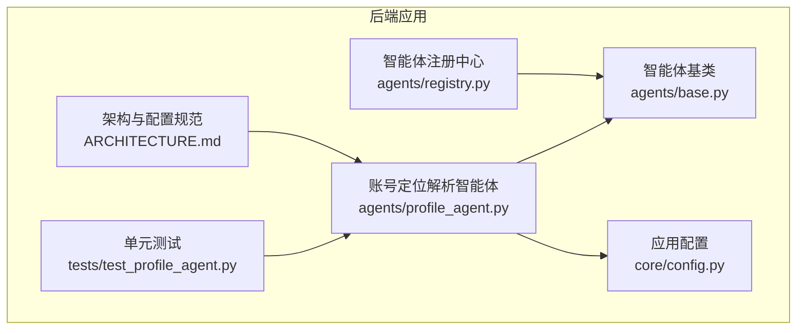
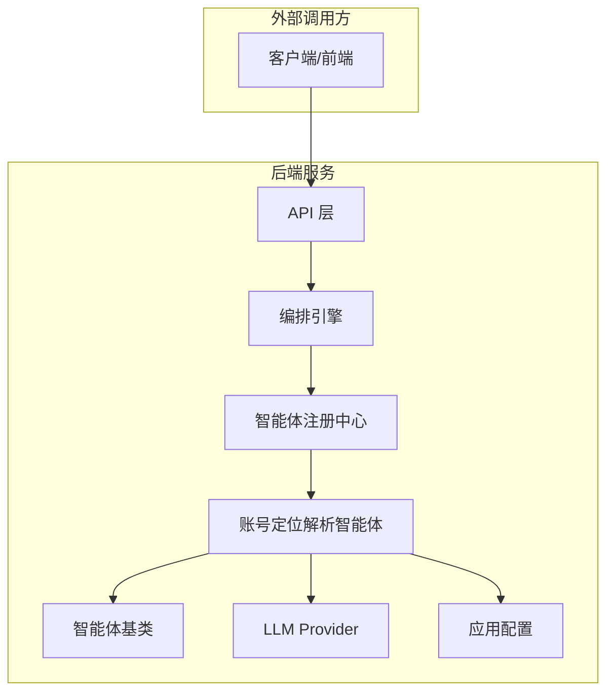
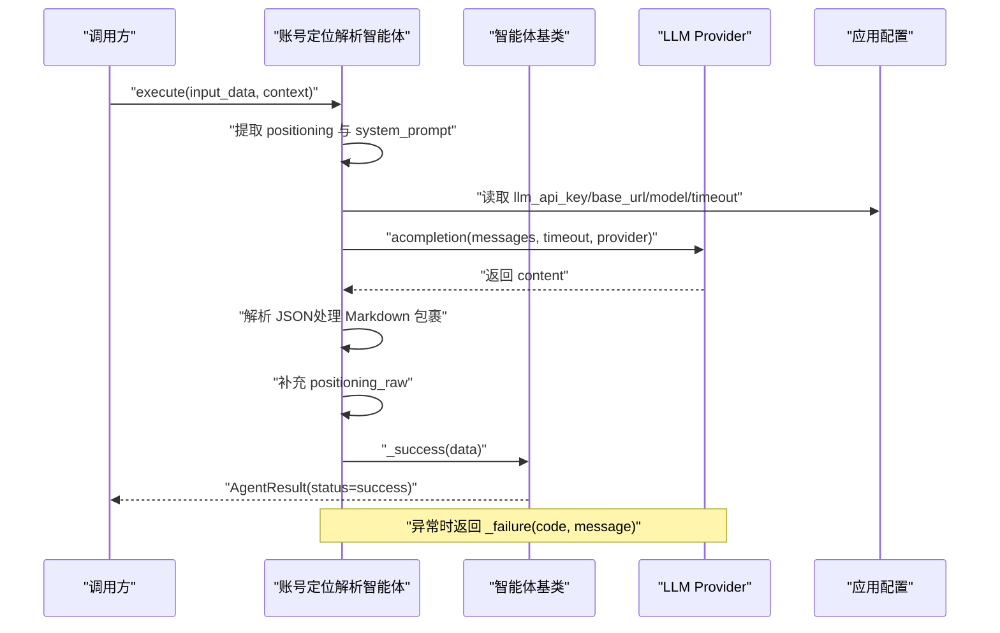
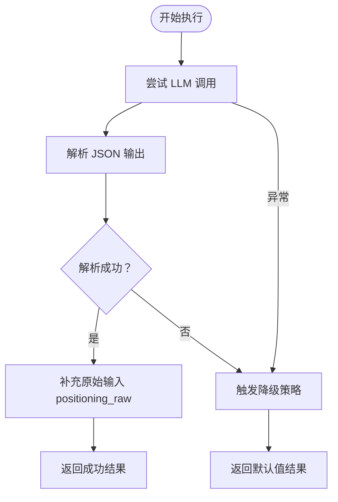
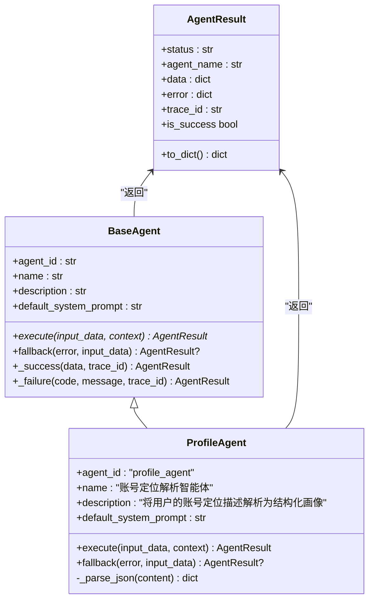
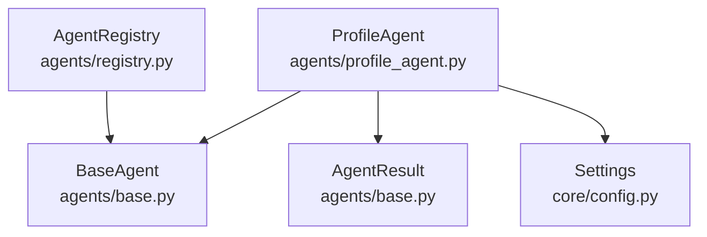

# 账号定位解析智能体

<cite>
**本文档引用的文件**
- [profile_agent.py](file://backend/app/agents/profile_agent.py)
- [base.py](file://backend/app/agents/base.py)
- [registry.py](file://backend/app/agents/registry.py)
- [config.py](file://backend/app/core/config.py)
- [test_profile_agent.py](file://backend/tests/test_profile_agent.py)
- [ARCHITECTURE.md](file://ARCHITECTURE.md)
</cite>

## 目录
1. [简介](#简介)
2. [项目结构](#项目结构)
3. [核心组件](#核心组件)
4. [架构总览](#架构总览)
5. [详细组件分析](#详细组件分析)
6. [依赖分析](#依赖分析)
7. [性能考虑](#性能考虑)
8. [故障排查指南](#故障排查指南)
9. [结论](#结论)
10. [附录](#附录)

## 简介
本文件为“账号定位解析智能体”的技术文档，聚焦于将用户的自然语言账号定位描述转换为结构化的账号画像。该智能体通过系统提示词引导大模型输出严格 JSON，再经解析与标准化封装，最终形成稳定的结构化结果；同时内置降级策略，确保在异常情况下仍能返回合理的默认数据，保障系统鲁棒性。

## 项目结构
该智能体位于后端 Python 应用的智能体模块中，采用面向对象设计，继承统一的基类并遵循标准的执行与错误处理规范。核心文件与职责如下：
- 后端智能体基类与结果封装：[base.py](file://backend/app/agents/base.py)
- 账号定位解析智能体实现：[profile_agent.py](file://backend/app/agents/profile_agent.py)
- 智能体注册中心：[registry.py](file://backend/app/agents/registry.py)
- 应用配置与 LLM 参数加载：[config.py](file://backend/app/core/config.py)
- 单元测试与行为验证：[test_profile_agent.py](file://backend/tests/test_profile_agent.py)
- 架构与配置规范说明：[ARCHITECTURE.md](file://ARCHITECTURE.md)

**图表来源**
- [profile_agent.py:12-102](file://backend/app/agents/profile_agent.py#L12-L102)
- [base.py:49-99](file://backend/app/agents/base.py#L49-L99)
- [registry.py:10-40](file://backend/app/agents/registry.py#L10-L40)
- [config.py:52-99](file://backend/app/core/config.py#L52-L99)
- [test_profile_agent.py:1-100](file://backend/tests/test_profile_agent.py#L1-L100)
- [ARCHITECTURE.md:855-930](file://ARCHITECTURE.md#L855-L930)

**章节来源**
- [profile_agent.py:1-102](file://backend/app/agents/profile_agent.py#L1-L102)
- [base.py:1-99](file://backend/app/agents/base.py#L1-L99)
- [registry.py:1-40](file://backend/app/agents/registry.py#L1-L40)
- [config.py:1-99](file://backend/app/core/config.py#L1-L99)
- [test_profile_agent.py:1-100](file://backend/tests/test_profile_agent.py#L1-L100)
- [ARCHITECTURE.md:855-930](file://ARCHITECTURE.md#L855-L930)

## 核心组件
- 智能体基类与结果封装
  - 提供统一的执行接口、错误/成功封装、降级回调等能力，确保各智能体行为一致。
  - 关键点：标准结果对象、成功/失败构造器、默认降级策略。
- 账号定位解析智能体
  - 实现将用户输入的定位描述解析为结构化画像的逻辑，包括提示词构建、LLM 调用、JSON 解析与数据补全。
  - 关键点：系统提示词、输入参数处理、LLM 调用封装、JSON 解析与回退策略。
- 智能体注册中心
  - 维护全局智能体实例映射，按 agent_id 获取实例，便于工作流编排与调度。
- 应用配置
  - 统一加载 LLM Provider 的 API Key、Base URL、模型名与超时等参数，支持多 Provider 切换。

**章节来源**
- [base.py:18-99](file://backend/app/agents/base.py#L18-L99)
- [profile_agent.py:12-102](file://backend/app/agents/profile_agent.py#L12-L102)
- [registry.py:10-40](file://backend/app/agents/registry.py#L10-L40)
- [config.py:52-99](file://backend/app/core/config.py#L52-L99)

## 架构总览
下图展示了账号定位解析智能体在系统中的位置与交互关系：

**图表来源**
- [profile_agent.py:43-78](file://backend/app/agents/profile_agent.py#L43-L78)
- [base.py:49-99](file://backend/app/agents/base.py#L49-L99)
- [registry.py:23-28](file://backend/app/agents/registry.py#L23-L28)
- [config.py:92-95](file://backend/app/core/config.py#L92-L95)

## 详细组件分析

### 系统提示词设计理念
- 角色设定：强调“专业的自媒体账号定位分析师”，明确任务边界与专业性，提升输出质量与一致性。
- 输入与输出规范：严格限定输入字段（positioning）与输出字段集合，避免模型生成无关内容。
- 约束条件：仅基于用户输入推断，不臆造信息；对未明确字段需合理推断并标注；输出必须为合法 JSON。
- 设计效果：降低歧义，提高 JSON 结构化输出的稳定性与可解析性。

**章节来源**
- [profile_agent.py:17-41](file://backend/app/agents/profile_agent.py#L17-L41)

### JSON 输出 Schema 字段定义与约束
- 必填字段
  - domain：主领域（字符串）
  - target_audience：目标受众对象，包含 age_range（字符串）、occupation（字符串）、interests（字符串数组）
  - tone：内容调性（字符串）
  - keywords：核心关键词数组（字符串数组）
- 可选字段
  - subdomain：细分领域（字符串）
  - content_style：内容风格（字符串）
- 约束与范围
  - keywords 数量通常为 5-8 个，interests 数量为 3-5 个
  - age_range 采用区间字符串格式（如 "25-35"）
  - 输出必须为合法 JSON，避免注释与多余文本

上述 Schema 与输入约束来源于架构与配置规范文档，用于运行时校验与降级策略参考。

**章节来源**
- [ARCHITECTURE.md:886-930](file://ARCHITECTURE.md#L886-L930)

### execute 方法执行流程
- 输入参数处理
  - 从 input_data 中提取 positioning，作为用户侧的自然语言定位描述
  - 从 context 中获取 system_prompt，若不存在则回退到默认系统提示词
- LLM 调用模拟
  - 构造 messages：system 角色为系统提示词，user 角色为用户输入
  - 使用 settings 中的 llm_api_key、llm_api_base_url、llm_model_name、llm_timeout
  - 特殊处理：当模型名不以前缀 dashscope/ 开头时自动补全，确保兼容阿里云 DashScope
- 数据结构化
  - 从响应中提取 content 并进行 JSON 解析，支持去除 Markdown 代码块包裹
  - 补充原始输入 positioning_raw，便于后续链路溯源
  - 封装为成功结果返回
- 错误处理
  - JSON 解析失败：返回 JSON_PARSE_ERROR
  - 其他异常：返回 LLM_ERROR

**图表来源**
- [profile_agent.py:43-78](file://backend/app/agents/profile_agent.py#L43-L78)
- [base.py:84-98](file://backend/app/agents/base.py#L84-L98)
- [config.py:92-95](file://backend/app/core/config.py#L92-L95)

**章节来源**
- [profile_agent.py:43-78](file://backend/app/agents/profile_agent.py#L43-L78)
- [base.py:84-98](file://backend/app/agents/base.py#L84-L98)
- [config.py:92-95](file://backend/app/core/config.py#L92-L95)

### fallback 降级机制实现
- 触发条件
  - 当 execute 执行过程中发生异常（如 JSON 解析失败或 LLM 调用异常）
- 降级策略
  - 返回固定默认值，覆盖关键字段：domain、subdomain、target_audience、tone、content_style、keywords
  - 保留原始输入 positioning_raw，便于追踪
- 作用
  - 在上游异常或模型输出不稳定时，保证下游流程可用，避免任务中断

**图表来源**
- [profile_agent.py:74-77](file://backend/app/agents/profile_agent.py#L74-L77)
- [profile_agent.py:92-101](file://backend/app/agents/profile_agent.py#L92-L101)

**章节来源**
- [profile_agent.py:92-101](file://backend/app/agents/profile_agent.py#L92-L101)

### 类关系与继承结构

**图表来源**
- [base.py:49-99](file://backend/app/agents/base.py#L49-L99)
- [profile_agent.py:12-102](file://backend/app/agents/profile_agent.py#L12-L102)

**章节来源**
- [base.py:49-99](file://backend/app/agents/base.py#L49-L99)
- [profile_agent.py:12-102](file://backend/app/agents/profile_agent.py#L12-L102)

### 测试用例与行为验证
- 能力覆盖
  - JSON 解析：支持干净 JSON、带 Markdown 代码块、仅有反引号包裹、空白字符等情况
  - 执行流程：成功调用 LLM、使用上下文提示词、回退到默认提示词
  - 降级策略：异常时返回默认值并保留原始输入
- 测试要点
  - 断言返回结果的状态、关键字段与原始输入保留
  - 使用异步 Mock 验证 LLM 调用参数与消息内容

**章节来源**
- [test_profile_agent.py:20-100](file://backend/tests/test_profile_agent.py#L20-L100)

## 依赖分析
- 组件耦合
  - ProfileAgent 依赖 BaseAgent（继承）与 AgentResult（结果封装）
  - ProfileAgent 依赖应用配置 settings（LLM 参数），并通过 litellm.acompletion 发起异步调用
  - AgentRegistry 提供按 agent_id 获取实例的能力，便于编排层调度
- 外部依赖
  - LLM Provider：通过统一配置加载 API Key、Base URL、模型名与超时
  - 测试依赖：unittest.mock.AsyncMock 与 pytest 异步测试能力

**图表来源**
- [profile_agent.py:8-9](file://backend/app/agents/profile_agent.py#L8-L9)
- [base.py:18-47](file://backend/app/agents/base.py#L18-L47)
- [registry.py:23-28](file://backend/app/agents/registry.py#L23-L28)
- [config.py:92-95](file://backend/app/core/config.py#L92-L95)

**章节来源**
- [profile_agent.py:8-9](file://backend/app/agents/profile_agent.py#L8-L9)
- [base.py:18-47](file://backend/app/agents/base.py#L18-L47)
- [registry.py:23-28](file://backend/app/agents/registry.py#L23-L28)
- [config.py:92-95](file://backend/app/core/config.py#L92-L95)

## 性能考虑
- LLM 调用优化
  - 控制温度与最大 token，减少不必要的上下文长度，提升响应速度
  - 合理设置超时与重试策略，避免长时间阻塞
- JSON 解析健壮性
  - 预处理 Markdown 代码块，减少解析失败概率
  - 对异常输入进行快速失败与降级，避免无效重试
- 缓存与复用
  - 对稳定提示词与常用默认值进行缓存，减少重复计算
- 并发与限流
  - 在高并发场景下，结合外部限流策略与队列控制，避免 LLM Provider 抖动

## 故障排查指南
- JSON 解析失败
  - 现象：返回 JSON_PARSE_ERROR
  - 排查：确认模型输出是否包含 Markdown 包裹；检查输出是否为合法 JSON
  - 处理：启用降级策略，返回默认值
- LLM 调用异常
  - 现象：返回 LLM_ERROR
  - 排查：检查 API Key、Base URL、模型名与网络连通性；确认超时设置合理
  - 处理：重试或降级；必要时切换 Provider
- 提示词未生效
  - 现象：未使用上下文 system_prompt
  - 排查：确认 context 中是否传入 system_prompt；否则应使用默认提示词
- 输出 Schema 不匹配
  - 现象：下游校验失败
  - 排查：核对输出字段是否满足 required 与类型约束；必要时调整提示词与降级默认值

**章节来源**
- [profile_agent.py:74-77](file://backend/app/agents/profile_agent.py#L74-L77)
- [test_profile_agent.py:44-100](file://backend/tests/test_profile_agent.py#L44-L100)

## 结论
账号定位解析智能体通过清晰的系统提示词、严格的 JSON 输出约束与稳健的降级策略，实现了从自然语言到结构化画像的可靠转换。其模块化设计与统一基类封装，使其易于扩展与维护；配合完善的测试与配置体系，能够在复杂环境中保持稳定与高效。

## 附录

### 配置参数说明
- LLM Provider 选择与参数
  - 默认 Provider：dashscope、openai、compatible、deepseek
  - 关键参数：API Key、Base URL、默认模型、超时、最大重试次数
- 应用层参数
  - llm_api_key、llm_api_base_url、llm_model_name、llm_timeout
- 环境变量加载
  - 从 .env 文件加载 Provider 相关配置，支持多 Provider 切换

**章节来源**
- [config.py:21-49](file://backend/app/core/config.py#L21-L49)
- [config.py:92-95](file://backend/app/core/config.py#L92-L95)
- [ARCHITECTURE.md:865-869](file://ARCHITECTURE.md#L865-L869)

### 输入输出示例与最佳实践
- 输入示例
  - positioning：描述账号定位的自然语言，如“关注职场成长的公众号，目标读者是25-35岁的互联网从业者”
- 输出示例
  - 结构化画像包含 domain、subdomain、target_audience、tone、content_style、keywords 等字段
  - positioning_raw 保留原始输入，便于溯源
- 最佳实践
  - 明确提示词角色与约束，减少歧义
  - 在模型输出不稳定时启用降级策略，保证系统可用性
  - 对输出进行 Schema 校验，确保下游消费稳定

**章节来源**
- [test_profile_agent.py:44-58](file://backend/tests/test_profile_agent.py#L44-L58)
- [ARCHITECTURE.md:871-884](file://ARCHITECTURE.md#L871-L884)
- [ARCHITECTURE.md:893-913](file://ARCHITECTURE.md#L893-L913)