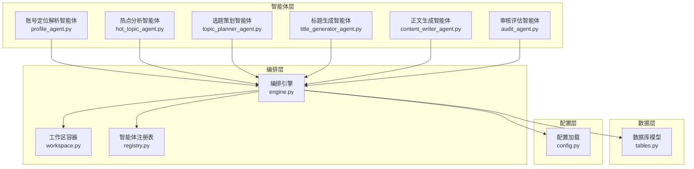
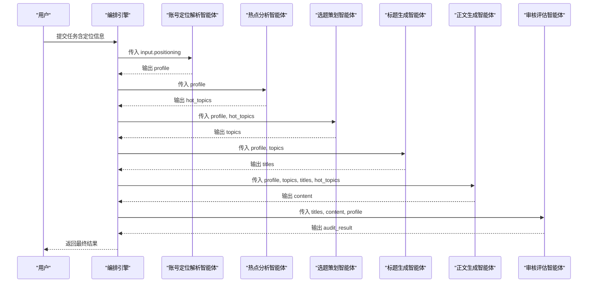
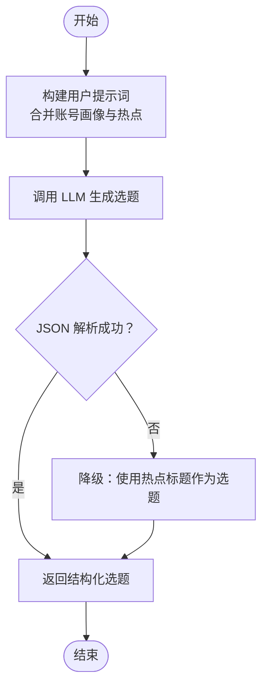
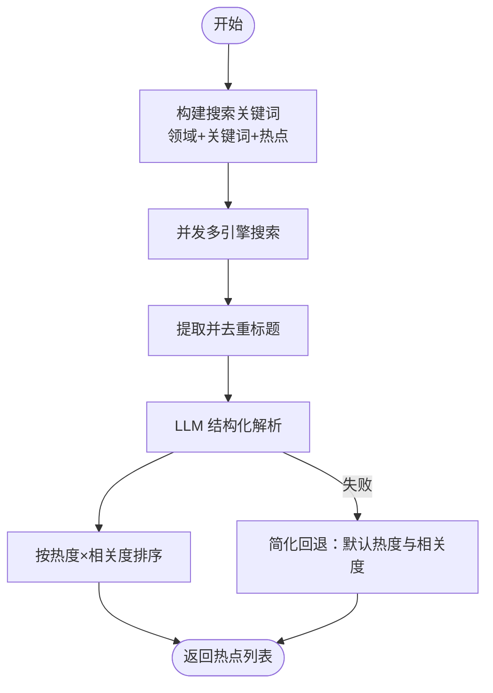
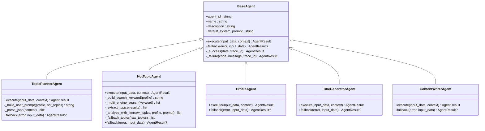
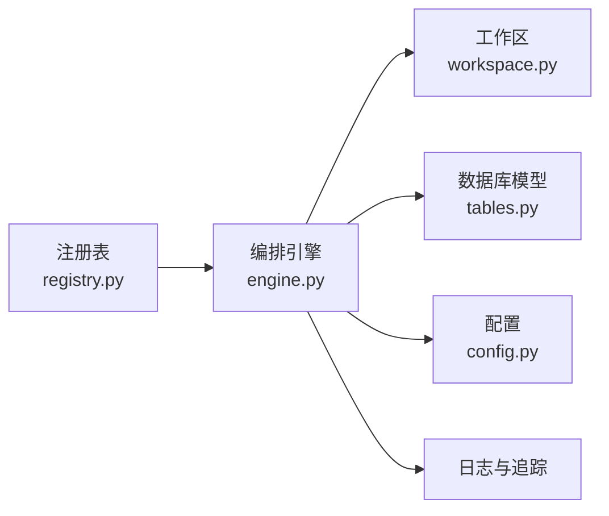
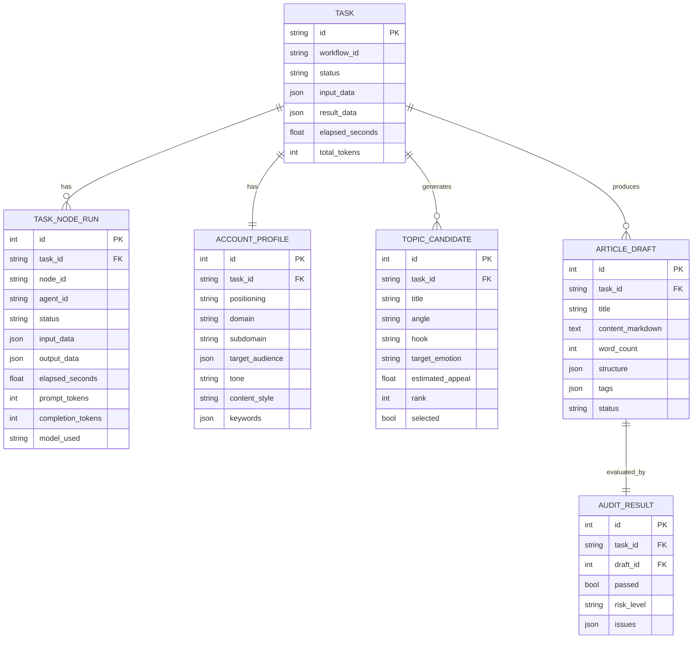

# 选题策划智能体

<cite>
**本文档引用的文件**
- [topic_planner_agent.py](file://backend/app/agents/topic_planner_agent.py)
- [hot_topic_agent.py](file://backend/app/agents/hot_topic_agent.py)
- [profile_agent.py](file://backend/app/agents/profile_agent.py)
- [title_generator_agent.py](file://backend/app/agents/title_generator_agent.py)
- [content_writer_agent.py](file://backend/app/agents/content_writer_agent.py)
- [engine.py](file://backend/app/orchestrator/engine.py)
- [workspace.py](file://backend/app/orchestrator/workspace.py)
- [base.py](file://backend/app/agents/base.py)
- [tables.py](file://backend/app/models/tables.py)
- [config.py](file://backend/app/core/config.py)
- [registry.py](file://backend/app/agents/registry.py)
</cite>

## 目录
1. [简介](#简介)
2. [项目结构](#项目结构)
3. [核心组件](#核心组件)
4. [架构总览](#架构总览)
5. [详细组件分析](#详细组件分析)
6. [依赖关系分析](#依赖关系分析)
7. [性能考量](#性能考量)
8. [故障排查指南](#故障排查指南)
9. [结论](#结论)
10. [附录](#附录)

## 简介
本技术文档围绕“选题策划智能体”展开，系统阐述其在整体内容创作流水线中的职责与实现方式。该智能体以账号画像与热点数据为输入，通过创意生成算法与选题筛选策略，产出具备传播潜力的高质量选题清单；并结合目标受众特征与市场趋势制定内容策略，确保内容与账号定位、调性、受众高度契合。

## 项目结构
本项目采用“智能体 + 工作流编排”的分层架构：
- 智能体层：负责具体业务任务（账号画像解析、热点采集与分析、选题策划、标题生成、正文生成、审核评估等）
- 编排层：负责线性调度各智能体、管理上下文与容错降级
- 数据层：持久化任务生命周期、节点运行记录、账号画像、选题候选、文章草稿与审核结果
- 配置层：统一加载 LLM Provider、超时与应用参数

**图表来源**
- [engine.py:31-86](file://backend/app/orchestrator/engine.py#L31-L86)
- [workspace.py:12-53](file://backend/app/orchestrator/workspace.py#L12-L53)
- [registry.py:10-36](file://backend/app/agents/registry.py#L10-L36)
- [tables.py:23-158](file://backend/app/models/tables.py#L23-L158)
- [config.py:52-99](file://backend/app/core/config.py#L52-L99)

**章节来源**
- [engine.py:31-86](file://backend/app/orchestrator/engine.py#L31-L86)
- [workspace.py:12-53](file://backend/app/orchestrator/workspace.py#L12-L53)
- [registry.py:10-36](file://backend/app/agents/registry.py#L10-L36)
- [tables.py:23-158](file://backend/app/models/tables.py#L23-L158)
- [config.py:52-99](file://backend/app/core/config.py#L52-L99)

## 核心组件
- 选题策划智能体（TopicPlannerAgent）：基于账号画像与热点列表，生成3-5个具备传播潜力的选题，包含标题、切入角度、钩子类型、目标情绪、吸引力评分与理由。
- 热点分析智能体（HotTopicAgent）：多引擎抓取热点，清洗去重，LLM 结构化解析，输出与账号领域相关度高的热点清单。
- 账号定位解析智能体（ProfileAgent）：将用户输入的定位描述解析为结构化画像，包含领域、细分领域、目标受众、调性、风格、关键词等。
- 标题生成智能体（TitleGeneratorAgent）：为吸引力最高的选题生成4-6个风格各异的候选标题，并给出评分与理由。
- 正文生成智能体（ContentWriterAgent）：基于选题、标题与热点素材生成完整文章，输出 Markdown 内容、字数统计、结构与标签。
- 编排引擎（OrchestratorEngine）：线性调度各智能体，管理上下文、广播事件、记录节点运行日志与令牌用量，支持降级回退。
- 工作区（Workspace）：任务级上下文容器，负责智能体间数据共享与映射抽取。
- 数据模型（models/tables.py）：持久化任务、节点运行、账号画像、选题候选、文章草稿与审核结果。

**章节来源**
- [topic_planner_agent.py:12-143](file://backend/app/agents/topic_planner_agent.py#L12-L143)
- [hot_topic_agent.py:40-362](file://backend/app/agents/hot_topic_agent.py#L40-L362)
- [profile_agent.py:12-102](file://backend/app/agents/profile_agent.py#L12-L102)
- [title_generator_agent.py:12-127](file://backend/app/agents/title_generator_agent.py#L12-L127)
- [content_writer_agent.py:12-154](file://backend/app/agents/content_writer_agent.py#L12-L154)
- [engine.py:89-285](file://backend/app/orchestrator/engine.py#L89-L285)
- [workspace.py:12-53](file://backend/app/orchestrator/workspace.py#L12-L53)
- [tables.py:76-158](file://backend/app/models/tables.py#L76-L158)

## 架构总览
选题策划智能体位于“热点分析 → 选题策划 → 标题生成 → 正文生成 → 审核评估”的线性工作流中，承担“创意生成 + 筛选策略”的关键角色。其输入来自账号画像与热点列表，输出为结构化选题清单，供后续标题与内容阶段复用。

**图表来源**
- [engine.py:31-86](file://backend/app/orchestrator/engine.py#L31-L86)
- [profile_agent.py:43-77](file://backend/app/agents/profile_agent.py#L43-L77)
- [hot_topic_agent.py:70-96](file://backend/app/agents/hot_topic_agent.py#L70-L96)
- [topic_planner_agent.py:44-75](file://backend/app/agents/topic_planner_agent.py#L44-L75)
- [title_generator_agent.py:44-76](file://backend/app/agents/title_generator_agent.py#L44-L76)
- [content_writer_agent.py:51-84](file://backend/app/agents/content_writer_agent.py#L51-L84)

## 详细组件分析

### 选题策划智能体（TopicPlannerAgent）
- 职责与输入输出
  - 输入：账号画像（domain、tone、target_audience、keywords 等）、热点列表（title、source、heat_score、relevance_score 等）
  - 输出：选题清单（topics），每个选题包含标题、切入角度、钩子类型、目标情绪、吸引力评分与理由
- 创意生成算法
  - 通过系统提示词约束与用户提示词拼接，驱动 LLM 生成候选选题
  - 采用“吸引力评分 × 热度 × 相关度”的综合打分思路，按吸引力降序排序
- 选题筛选策略
  - 必须同时匹配账号调性与目标受众
  - 钩子策略多样化，避免同质化
  - 优先选择与高热度、高相关度热点关联的选题
- 容错与降级
  - JSON 解析失败或 LLM 异常时，回退为直接使用热点标题的简化方案
- 数据结构与复杂度
  - 输入热点列表规模受上游限制（通常 5-8 条），排序与评分复杂度近似 O(n log n)，n 为选题数量

**图表来源**
- [topic_planner_agent.py:44-126](file://backend/app/agents/topic_planner_agent.py#L44-L126)
- [topic_planner_agent.py:127-143](file://backend/app/agents/topic_planner_agent.py#L127-L143)

**章节来源**
- [topic_planner_agent.py:12-143](file://backend/app/agents/topic_planner_agent.py#L12-L143)

### 热点分析智能体（HotTopicAgent）
- 多引擎抓取与解析
  - 支持微信搜索、搜狗、360搜索，异步并发抓取，URL 编码与请求头设置
  - 针对不同引擎解析 HTML 片段，提取标题并去重
- 结构化解析
  - 将原始标题列表交给 LLM，输出包含热度评分、摘要与相关度的结构化热点
  - 若 LLM 解析失败，回退为简化版结构（默认热度与相关度）
- 筛选与排序
  - 仅保留与账号领域相关度高于阈值的热点
  - 按热度×相关度降序排序，来源平台尽量多样化

**图表来源**
- [hot_topic_agent.py:70-96](file://backend/app/agents/hot_topic_agent.py#L70-L96)
- [hot_topic_agent.py:114-140](file://backend/app/agents/hot_topic_agent.py#L114-L140)
- [hot_topic_agent.py:238-262](file://backend/app/agents/hot_topic_agent.py#L238-L262)
- [hot_topic_agent.py:264-303](file://backend/app/agents/hot_topic_agent.py#L264-L303)
- [hot_topic_agent.py:335-346](file://backend/app/agents/hot_topic_agent.py#L335-L346)

**章节来源**
- [hot_topic_agent.py:40-362](file://backend/app/agents/hot_topic_agent.py#L40-L362)

### 账号定位解析智能体（ProfileAgent）
- 将用户输入的定位描述解析为结构化画像，包括主领域、细分领域、目标受众（年龄、职业、兴趣）、内容调性、风格与关键词
- 回退策略：若 LLM 解析失败，返回默认画像，保证工作流连续性

**章节来源**
- [profile_agent.py:12-102](file://backend/app/agents/profile_agent.py#L12-L102)

### 标题生成智能体（TitleGeneratorAgent）
- 为吸引力最高的选题生成4-6个风格各异的候选标题，包含风格类型、评分与理由
- 评分维度：好奇心激发度、与内容匹配度、情绪驱动力、可信度
- 降级策略：当 LLM 异常时，直接使用选题标题作为默认标题

**章节来源**
- [title_generator_agent.py:12-127](file://backend/app/agents/title_generator_agent.py#L12-L127)

### 正文生成智能体（ContentWriterAgent）
- 基于选题、标题与热点素材生成完整文章，输出 Markdown 内容、字数统计、结构与标签
- 文章结构遵循引言、正文、总结/行动建议、结尾的规范，段落简短，适合移动端阅读
- 降级策略：异常时返回占位内容与空结构

**章节来源**
- [content_writer_agent.py:12-154](file://backend/app/agents/content_writer_agent.py#L12-L154)

### 编排引擎与工作区
- 线性工作流定义：profile → hot_topics → topics → titles → content → audit
- 上下文管理：通过 Workspace 在智能体间传递数据，支持 input. 前缀引用初始输入
- 容错与降级：单节点失败时尝试智能体回退；必选节点失败抛出异常；记录节点运行日志与令牌用量
- 广播事件：节点开始/完成、任务完成等事件通过广播器推送

**图表来源**
- [base.py:49-99](file://backend/app/agents/base.py#L49-L99)
- [topic_planner_agent.py:12-143](file://backend/app/agents/topic_planner_agent.py#L12-L143)
- [hot_topic_agent.py:40-362](file://backend/app/agents/hot_topic_agent.py#L40-L362)
- [profile_agent.py:12-102](file://backend/app/agents/profile_agent.py#L12-L102)
- [title_generator_agent.py:12-127](file://backend/app/agents/title_generator_agent.py#L12-L127)
- [content_writer_agent.py:12-154](file://backend/app/agents/content_writer_agent.py#L12-L154)

**章节来源**
- [engine.py:89-285](file://backend/app/orchestrator/engine.py#L89-L285)
- [workspace.py:12-53](file://backend/app/orchestrator/workspace.py#L12-L53)
- [base.py:49-99](file://backend/app/agents/base.py#L49-L99)

## 依赖关系分析
- 智能体注册与调度
  - 编排引擎通过注册表获取智能体实例，按节点定义顺序执行
- 数据持久化
  - 任务、节点运行、账号画像、选题候选、文章草稿与审核结果均持久化到数据库
- 配置与超时
  - LLM Provider、模型、基础地址与超时由配置模块统一加载
- 日志与追踪
  - 任务级 trace_id 用于串联节点日志与事件广播

**图表来源**
- [registry.py:10-36](file://backend/app/agents/registry.py#L10-L36)
- [engine.py:138-146](file://backend/app/orchestrator/engine.py#L138-L146)
- [tables.py:23-158](file://backend/app/models/tables.py#L23-L158)
- [config.py:52-99](file://backend/app/core/config.py#L52-L99)

**章节来源**
- [registry.py:10-36](file://backend/app/agents/registry.py#L10-L36)
- [engine.py:138-146](file://backend/app/orchestrator/engine.py#L138-L146)
- [tables.py:23-158](file://backend/app/models/tables.py#L23-L158)
- [config.py:52-99](file://backend/app/core/config.py#L52-L99)

## 性能考量
- 并发抓取热点：多引擎并发请求，缩短等待时间
- LLM 调用优化：统一 Provider 前缀与超时控制，避免长尾延迟
- 令牌统计：节点运行记录中累计 prompt/completion tokens，便于成本与性能分析
- 降级回退：在 LLM 解析失败或异常时快速返回可用结果，保障端到端吞吐
- 建议
  - 为热点抓取与 LLM 调用设置合理的超时阈值
  - 对热点来源进行限流与去重，减少无效请求
  - 在标题与正文生成阶段引入缓存热点素材与模板，降低重复计算

[本节为通用性能指导，无需列出具体文件来源]

## 故障排查指南
- LLM 解析失败
  - 现象：JSON 解析错误或 LLM 返回非结构化内容
  - 排查：检查系统提示词与用户提示词是否完整；确认 Provider 配置正确
  - 处理：智能体内置降级回退，确保工作流继续执行
- 节点超时
  - 现象：节点执行超过设定超时
  - 排查：查看节点运行记录与日志；检查网络与 LLM 基础地址
  - 处理：调整超时配置或优化提示词长度
- 审核评估未通过
  - 现象：审核结果包含风险项或未通过
  - 排查：检查审核策略与规则；复核标题与内容是否符合账号定位
  - 处理：根据审核意见调整标题或内容，重新生成

**章节来源**
- [topic_planner_agent.py:72-75](file://backend/app/agents/topic_planner_agent.py#L72-L75)
- [hot_topic_agent.py:296-302](file://backend/app/agents/hot_topic_agent.py#L296-L302)
- [engine.py:176-196](file://backend/app/orchestrator/engine.py#L176-L196)

## 结论
选题策划智能体通过“热点 + 账号画像”的双因子驱动，形成可解释、可回退、可追踪的创意生成与筛选闭环。配合线性工作流与完善的降级策略，能够在保证质量的同时提升整体吞吐与稳定性。建议在实际落地中持续优化提示词、引入 A/B 测试与效果追踪指标，以迭代提升选题命中率与传播效果。

[本节为总结性内容，无需列出具体文件来源]

## 附录

### 选题评估标准
- 吸引力评分（estimated_appeal）：综合热度、相关度与情绪驱动力
- 钩子类型（hook）：多样化策略，避免同质化
- 目标情绪（target_emotion）：与账号调性一致的情绪设计
- 与受众匹配度：切合目标受众的兴趣与需求

**章节来源**
- [topic_planner_agent.py:27-42](file://backend/app/agents/topic_planner_agent.py#L27-L42)

### A/B 测试方法
- 标题风格对比：对同一选题生成多种风格标题，分别投放并比较点击率与互动率
- 选题策略对比：对比不同提示词版本的选题质量与传播表现
- 热点筛选阈值：对比不同相关度阈值下的内容质量与流量表现

[本节为方法论建议，无需列出具体文件来源]

### 效果追踪指标
- 选题层面：曝光量、点击率、收藏/转发率、评论量
- 内容层面：完读率、平均阅读时长、互动率、分享率
- 账号层面：粉丝增长、互动转化、品牌声量

[本节为通用指标建议，无需列出具体文件来源]

### 使用案例
- 场景一：职场成长类账号
  - 输入：定位描述（如“专注互联网职场经验分享”）
  - 流程：定位解析 → 热点抓取 → 选题策划 → 标题生成 → 正文生成 → 审核评估
  - 输出：3-5个选题、多个标题候选与完整文章草稿
- 场景二：健康养生类账号
  - 输入：定位描述（如“面向中老年人的科学养生知识”）
  - 流程：同上
  - 输出：贴近受众兴趣与健康需求的选题与内容

[本节为概念性示例，无需列出具体文件来源]

### 配置选项
- LLM Provider 与模型
  - 支持 DashScope、OpenAI、DeepSeek 等 Provider，默认模型与基础地址可配置
- 超时设置
  - agent_timeout、skill_timeout、llm_timeout 控制节点执行与 LLM 请求超时
- 数据库与缓存
  - database_url、redis_url 用于持久化与缓存

**章节来源**
- [config.py:21-49](file://backend/app/core/config.py#L21-L49)
- [config.py:79-82](file://backend/app/core/config.py#L79-L82)
- [config.py:52-99](file://backend/app/core/config.py#L52-L99)

### 数据模型概览
- 任务与节点运行：记录任务状态、耗时、令牌用量与错误信息
- 账号画像：结构化定位信息，供后续智能体使用
- 选题候选：保存选题策划阶段的候选清单，支持排序与选择
- 文章草稿与审核结果：保存正文生成与审核评估结果

**图表来源**
- [tables.py:23-158](file://backend/app/models/tables.py#L23-L158)

**章节来源**
- [tables.py:23-158](file://backend/app/models/tables.py#L23-L158)