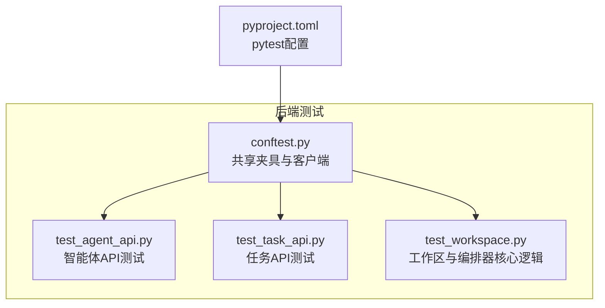
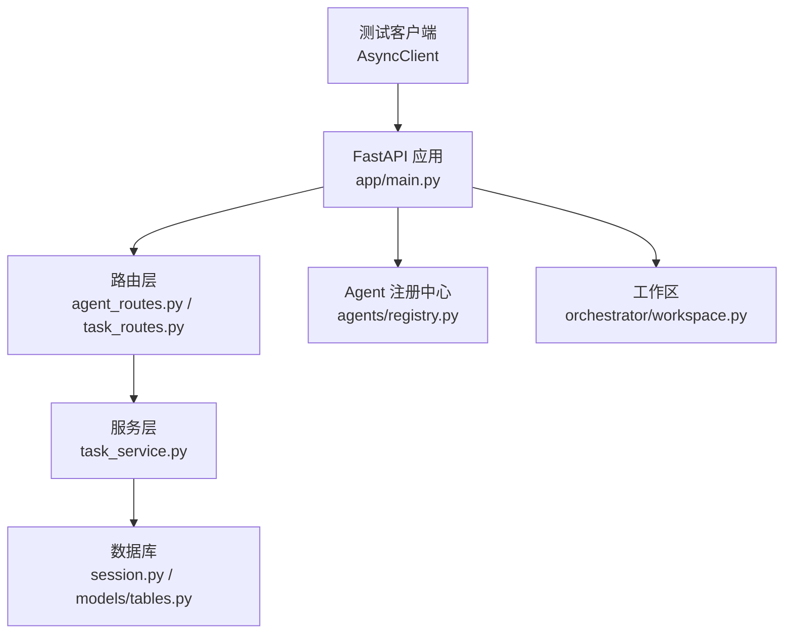
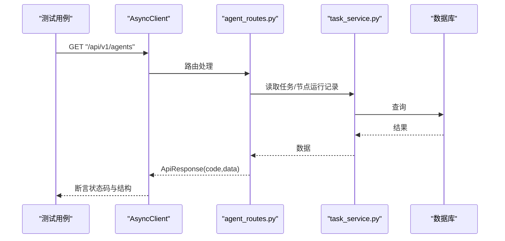
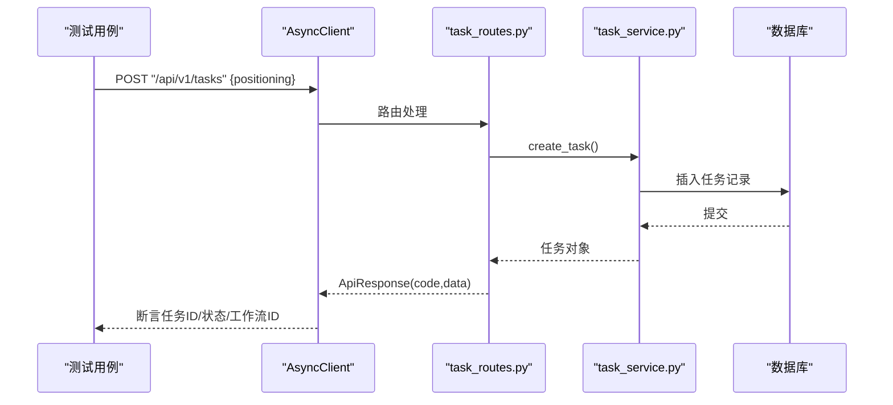
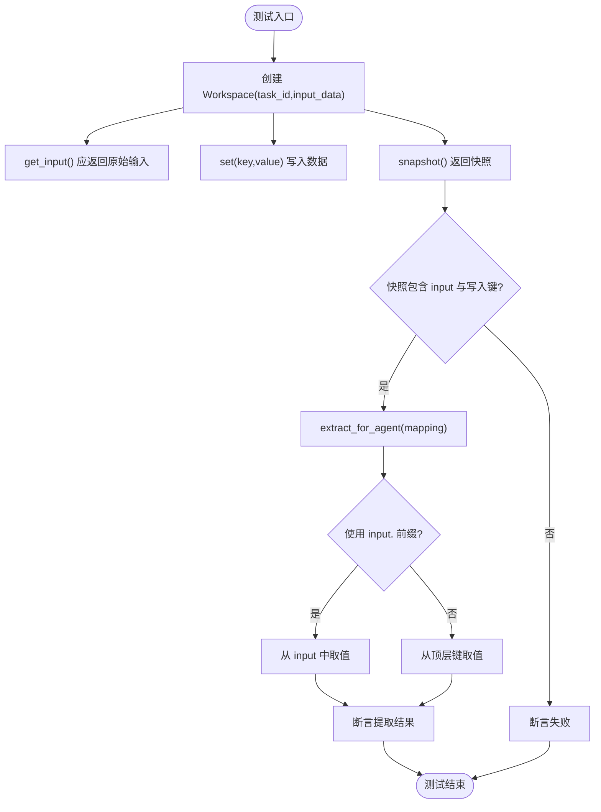
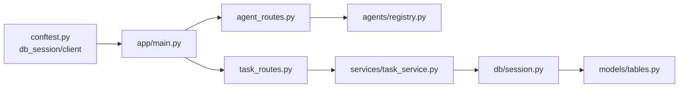

# 单元测试

<cite>
**本文引用的文件**   
- [backend/tests/conftest.py](file://backend/tests/conftest.py)
- [backend/pyproject.toml](file://backend/pyproject.toml)
- [backend/tests/test_agent_api.py](file://backend/tests/test_agent_api.py)
- [backend/tests/test_task_api.py](file://backend/tests/test_task_api.py)
- [backend/tests/test_workspace.py](file://backend/tests/test_workspace.py)
- [backend/app/main.py](file://backend/app/main.py)
- [backend/app/db/session.py](file://backend/app/db/session.py)
- [backend/app/models/tables.py](file://backend/app/models/tables.py)
- [backend/app/api/agent_routes.py](file://backend/app/api/agent_routes.py)
- [backend/app/api/task_routes.py](file://backend/app/api/task_routes.py)
- [backend/app/services/task_service.py](file://backend/app/services/task_service.py)
- [backend/app/orchestrator/workspace.py](file://backend/app/orchestrator/workspace.py)
- [backend/app/agents/registry.py](file://backend/app/agents/registry.py)
- [ARCHITECTURE.md](file://ARCHITECTURE.md)
- [Notice.md](file://Notice.md)
</cite>

## 目录
1. [简介](#简介)
2. [项目结构](#项目结构)
3. [核心组件](#核心组件)
4. [架构总览](#架构总览)
5. [详细组件分析](#详细组件分析)
6. [依赖分析](#依赖分析)
7. [性能考量](#性能考量)
8. [故障排查指南](#故障排查指南)
9. [结论](#结论)
10. [附录](#附录)

## 简介
本文件为 HotClaw 项目的后端单元测试开发指南，聚焦 Python 测试框架配置与使用、测试夹具与数据准备、智能体 API、任务 API、工作区与编排器核心逻辑的测试策略，以及断言方法、Mock 技巧、覆盖率与报告、CI 中的测试执行流程。文档面向开发者，帮助确保代码质量与功能正确性。

## 项目结构
后端测试位于 backend/tests 目录，包含：
- pytest 配置与共享夹具：conftest.py
- 智能体 API 测试：test_agent_api.py
- 任务 API 测试：test_task_api.py
- 工作区与编排器核心逻辑测试：test_workspace.py

pytest 配置通过 pyproject.toml 指定异步模式与测试目录，便于统一管理。

**图表来源**
- [backend/tests/conftest.py:1-48](file://backend/tests/conftest.py#L1-L48)
- [backend/pyproject.toml:38-41](file://backend/pyproject.toml#L38-L41)
- [backend/tests/test_agent_api.py:1-28](file://backend/tests/test_agent_api.py#L1-L28)
- [backend/tests/test_task_api.py:1-57](file://backend/tests/test_task_api.py#L1-L57)
- [backend/tests/test_workspace.py:1-41](file://backend/tests/test_workspace.py#L1-L41)

**章节来源**
- [backend/tests/conftest.py:1-48](file://backend/tests/conftest.py#L1-L48)
- [backend/pyproject.toml:38-41](file://backend/pyproject.toml#L38-L41)

## 核心组件
- 测试夹具与客户端
  - 使用 sqlite+aiosqlite 内存数据库，自动创建/销毁表，确保测试隔离与可重复性。
  - 通过依赖注入覆盖 get_db，使应用路由在测试中使用测试会话。
  - 提供 AsyncClient，支持对 /api/v1/* 路由进行端到端测试。
- 智能体 API
  - 列表与详情接口：验证返回结构、状态码与数据一致性。
  - 不存在的智能体：验证 404 与错误码。
- 任务 API
  - 创建任务：校验返回的任务状态、工作流 ID、数据结构。
  - 参数校验错误：校验 FastAPI 的 422。
  - 不存在的任务：校验 404 与错误码。
  - 列表与健康检查：验证空列表与健康状态。
- 工作区与编排器核心逻辑
  - Workspace 基本操作：get/set/snapshot。
  - 输入映射提取：从 workspace 提取 agent 所需输入。
  - 缺失键处理：返回 None，保证健壮性。

**章节来源**
- [backend/tests/conftest.py:13-48](file://backend/tests/conftest.py#L13-L48)
- [backend/tests/test_agent_api.py:7-28](file://backend/tests/test_agent_api.py#L7-L28)
- [backend/tests/test_task_api.py:7-57](file://backend/tests/test_task_api.py#L7-L57)
- [backend/tests/test_workspace.py:7-41](file://backend/tests/test_workspace.py#L7-L41)

## 架构总览
后端采用 FastAPI + SQLAlchemy 异步 ORM，测试通过 ASGI 客户端绕过网络栈，直接调用路由层，结合内存数据库与依赖注入，实现端到端与单元混合的测试策略。

**图表来源**
- [backend/app/main.py:32-58](file://backend/app/main.py#L32-L58)
- [backend/app/api/agent_routes.py:17-71](file://backend/app/api/agent_routes.py#L17-L71)
- [backend/app/api/task_routes.py:19-162](file://backend/app/api/task_routes.py#L19-L162)
- [backend/app/services/task_service.py:20-125](file://backend/app/services/task_service.py#L20-L125)
- [backend/app/db/session.py:22-33](file://backend/app/db/session.py#L22-L33)
- [backend/app/models/tables.py:23-233](file://backend/app/models/tables.py#L23-L233)
- [backend/app/agents/registry.py:10-39](file://backend/app/agents/registry.py#L10-L39)
- [backend/app/orchestrator/workspace.py:12-53](file://backend/app/orchestrator/workspace.py#L12-L53)

## 详细组件分析

### 智能体 API 测试策略
- 测试目标
  - 列出所有注册的智能体，断言返回结构与数量。
  - 查询不存在的智能体，断言 404 与错误码。
- 断言要点
  - HTTP 状态码与统一响应结构字段 code/data。
  - 智能体列表长度与关键字段存在性。
- Mock 与夹具
  - 使用 conftest.py 中的 client 夹具，自动注册 mock 智能体。
  - 通过依赖注入覆盖数据库访问，避免真实 DB 依赖。

**图表来源**
- [backend/tests/test_agent_api.py:8-18](file://backend/tests/test_agent_api.py#L8-L18)
- [backend/app/api/agent_routes.py:17-43](file://backend/app/api/agent_routes.py#L17-L43)
- [backend/app/services/task_service.py:65-114](file://backend/app/services/task_service.py#L65-L114)

**章节来源**
- [backend/tests/test_agent_api.py:7-28](file://backend/tests/test_agent_api.py#L7-L28)
- [backend/tests/conftest.py:33-48](file://backend/tests/conftest.py#L33-L48)
- [backend/app/api/agent_routes.py:17-71](file://backend/app/api/agent_routes.py#L17-L71)

### 任务 API 测试策略
- 测试目标
  - 创建任务：断言返回任务 ID、初始状态、工作流 ID。
  - 参数校验错误：断言 422。
  - 查询不存在的任务：断言 404 与错误码。
  - 列表为空：断言空数组与分页总数。
  - 健康检查：断言状态为 ok。
- 断言要点
  - 统一响应结构与业务字段一致性。
  - 分页查询的总数与摘要字段。
- Mock 与夹具
  - 使用 conftest.py 中的 client 夹具，确保数据库会话来自测试引擎。
  - 通过依赖注入覆盖 get_db，避免真实 DB 依赖。

**图表来源**
- [backend/tests/test_task_api.py:8-18](file://backend/tests/test_task_api.py#L8-L18)
- [backend/app/api/task_routes.py:19-51](file://backend/app/api/task_routes.py#L19-L51)
- [backend/app/services/task_service.py:20-37](file://backend/app/services/task_service.py#L20-L37)

**章节来源**
- [backend/tests/test_task_api.py:7-57](file://backend/tests/test_task_api.py#L7-L57)
- [backend/tests/conftest.py:33-48](file://backend/tests/conftest.py#L33-L48)
- [backend/app/api/task_routes.py:19-162](file://backend/app/api/task_routes.py#L19-L162)
- [backend/app/services/task_service.py:20-125](file://backend/app/services/task_service.py#L20-L125)

### 工作区与编排器核心逻辑测试策略
- 测试目标
  - Workspace 基本操作：get/set/snapshot。
  - 输入映射提取：支持 input. 前缀与顶层键映射。
  - 缺失键处理：返回 None。
- 断言要点
  - 快照包含输入与写入的数据。
  - 映射提取结果与预期一致。
- Mock 与夹具
  - 无需外部依赖，直接实例化 Workspace 进行单元测试。

**图表来源**
- [backend/tests/test_workspace.py:7-41](file://backend/tests/test_workspace.py#L7-L41)
- [backend/app/orchestrator/workspace.py:12-53](file://backend/app/orchestrator/workspace.py#L12-L53)

**章节来源**
- [backend/tests/test_workspace.py:7-41](file://backend/tests/test_workspace.py#L7-L41)
- [backend/app/orchestrator/workspace.py:12-53](file://backend/app/orchestrator/workspace.py#L12-L53)

## 依赖分析
- 测试夹具依赖
  - 使用 sqlite+aiosqlite 内存数据库，避免 CI 环境依赖 PostgreSQL。
  - 通过依赖注入覆盖 get_db，确保路由层使用测试会话。
- 路由层依赖
  - agent_routes 依赖 Agent 注册中心与数据库模型。
  - task_routes 依赖 task_service，后者依赖 models 与 orchestrator 组件。
- 数据层依赖
  - session.py 提供 get_db 依赖，conftest.py 中覆盖该依赖。
  - models/tables.py 定义 ORM 表结构，测试中自动创建/删除。

**图表来源**
- [backend/tests/conftest.py:16-48](file://backend/tests/conftest.py#L16-L48)
- [backend/app/main.py:32-58](file://backend/app/main.py#L32-L58)
- [backend/app/api/agent_routes.py:10-12](file://backend/app/api/agent_routes.py#L10-L12)
- [backend/app/api/task_routes.py:10-13](file://backend/app/api/task_routes.py#L10-L13)
- [backend/app/services/task_service.py:13-15](file://backend/app/services/task_service.py#L13-L15)
- [backend/app/db/session.py:22-33](file://backend/app/db/session.py#L22-L33)
- [backend/app/models/tables.py:23-233](file://backend/app/models/tables.py#L23-L233)

**章节来源**
- [backend/tests/conftest.py:13-48](file://backend/tests/conftest.py#L13-L48)
- [backend/app/db/session.py:22-33](file://backend/app/db/session.py#L22-L33)
- [backend/app/models/tables.py:23-233](file://backend/app/models/tables.py#L23-L233)
- [backend/app/api/agent_routes.py:10-12](file://backend/app/api/agent_routes.py#L10-L12)
- [backend/app/api/task_routes.py:10-13](file://backend/app/api/task_routes.py#L10-L13)
- [backend/app/services/task_service.py:13-15](file://backend/app/services/task_service.py#L13-L15)

## 性能考量
- 测试数据库使用内存数据库，避免磁盘 IO，提升测试速度。
- 通过依赖注入覆盖 get_db，减少真实数据库连接开销。
- 测试用例应避免长链路与外部依赖，优先使用本地对象与简单断言。

## 故障排查指南
- 常见问题
  - 404 未找到：确认路由路径与资源 ID 是否正确。
  - 422 参数校验错误：检查请求体字段与最小长度限制。
  - 500 服务器错误：检查全局异常处理器与日志记录。
- 排查步骤
  - 使用断言检查响应结构与状态码。
  - 在 conftest.py 中确认依赖注入是否生效。
  - 查看统一错误响应结构与错误码映射。

**章节来源**
- [backend/tests/test_agent_api.py:21-28](file://backend/tests/test_agent_api.py#L21-L28)
- [backend/tests/test_task_api.py:21-36](file://backend/tests/test_task_api.py#L21-L36)
- [backend/app/main.py:87-129](file://backend/app/main.py#L87-L129)

## 结论
通过 pytest 配置、共享夹具与依赖注入，HotClaw 后端实现了高效、可重复的单元测试与端到端测试。测试覆盖智能体 API、任务 API 与工作区核心逻辑，遵循统一响应结构与错误处理规范，确保代码质量与功能正确性。建议在新增功能时，遵循“至少一个正常 case 与一个异常 case”的最低要求，并优先使用 Mock 与内存数据库，避免真实第三方接口依赖。

## 附录

### 测试框架配置与使用
- pytest 配置
  - 异步模式：auto
  - 测试目录：tests
- 安装与运行
  - 开发依赖包含 pytest、pytest-asyncio、httpx。
  - 在 backend 目录下运行 pytest，自动发现 tests 目录下的测试用例。

**章节来源**
- [backend/pyproject.toml:24-41](file://backend/pyproject.toml#L24-L41)

### 测试夹具设置与测试数据准备
- 数据库夹具
  - 使用 sqlite+aiosqlite 内存数据库，自动创建/删除表。
  - 提供 async_session_factory，确保事务与回滚。
- 客户端夹具
  - 通过 ASGI Transport 创建 AsyncClient。
  - 依赖注入覆盖 get_db，使路由层使用测试会话。
- 测试数据
  - 智能体 API 测试依赖 app/main.py 中注册的 mock 智能体。
  - 任务 API 测试依赖 task_service 的业务逻辑与 models/tables.py 的 ORM 表。

**章节来源**
- [backend/tests/conftest.py:13-48](file://backend/tests/conftest.py#L13-L48)
- [backend/app/main.py:32-40](file://backend/app/main.py#L32-L40)
- [backend/app/models/tables.py:23-233](file://backend/app/models/tables.py#L23-L233)

### 测试用例编写规范与断言方法
- 规范
  - 每个新功能至少包含一个正常 case 与一个异常 case。
  - 使用统一响应结构断言 code、message、data。
  - 对于不存在的资源，断言 404 与特定错误码。
- 断言方法
  - HTTP 状态码断言。
  - JSON 响应结构断言（字段存在性与类型）。
  - 业务字段断言（任务状态、工作流 ID、分页总数等）。
- Mock 对象使用技巧
  - 使用 pytest-asyncio 标记异步测试。
  - 通过依赖注入覆盖 get_db，避免真实数据库依赖。
  - 对外部服务调用进行 Mock，确保测试可重复性。

**章节来源**
- [Notice.md:373-395](file://Notice.md#L373-L395)
- [backend/tests/test_agent_api.py:7-28](file://backend/tests/test_agent_api.py#L7-L28)
- [backend/tests/test_task_api.py:7-57](file://backend/tests/test_task_api.py#L7-L57)
- [backend/tests/test_workspace.py:7-41](file://backend/tests/test_workspace.py#L7-L41)

### 测试覆盖率与报告
- 覆盖率
  - 建议在 CI 中启用覆盖率统计，重点关注路由层、服务层与核心业务逻辑。
- 报告
  - 使用 pytest 生成测试报告，结合 CI 平台展示测试结果与覆盖率。
- CI 执行流程
  - 安装开发依赖。
  - 运行 pytest，生成报告与覆盖率。
  - 失败时输出详细日志以便排查。

**章节来源**
- [backend/pyproject.toml:24-29](file://backend/pyproject.toml#L24-L29)