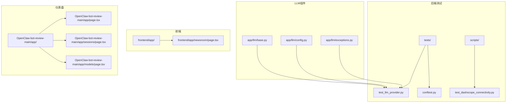
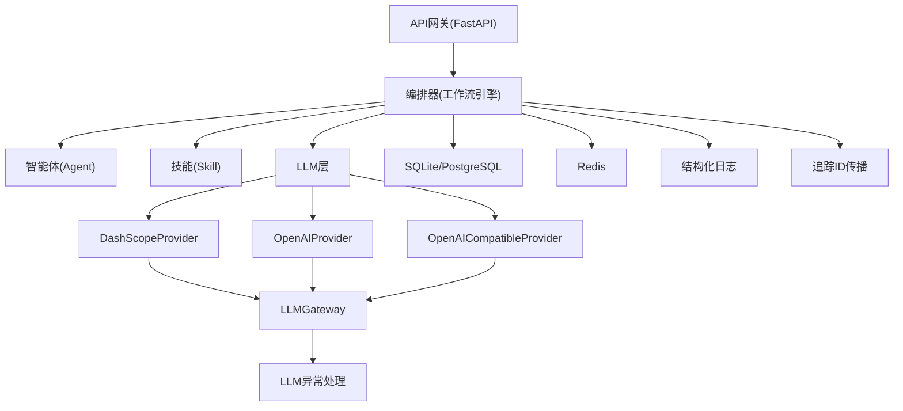
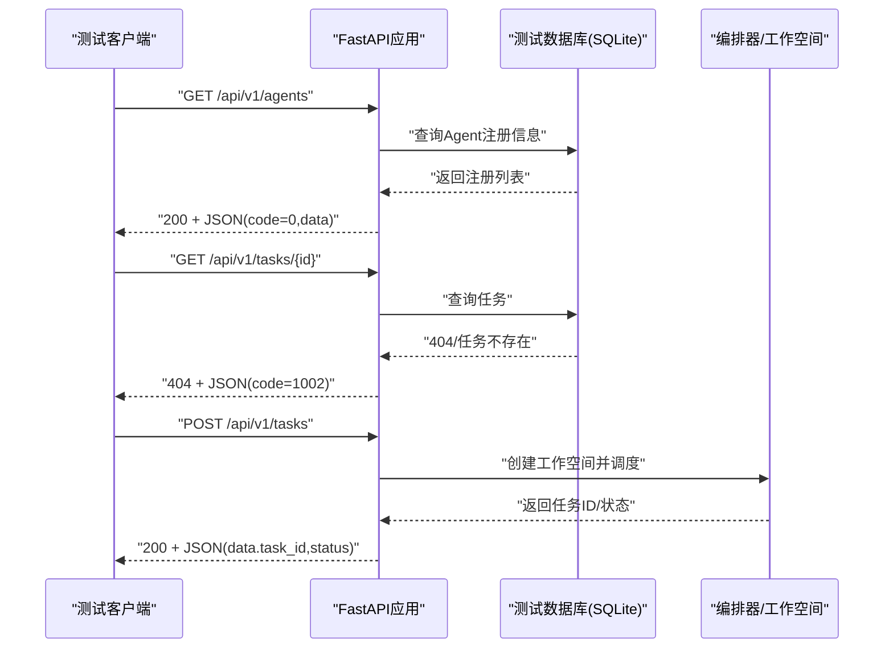
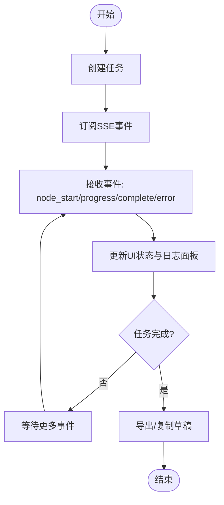
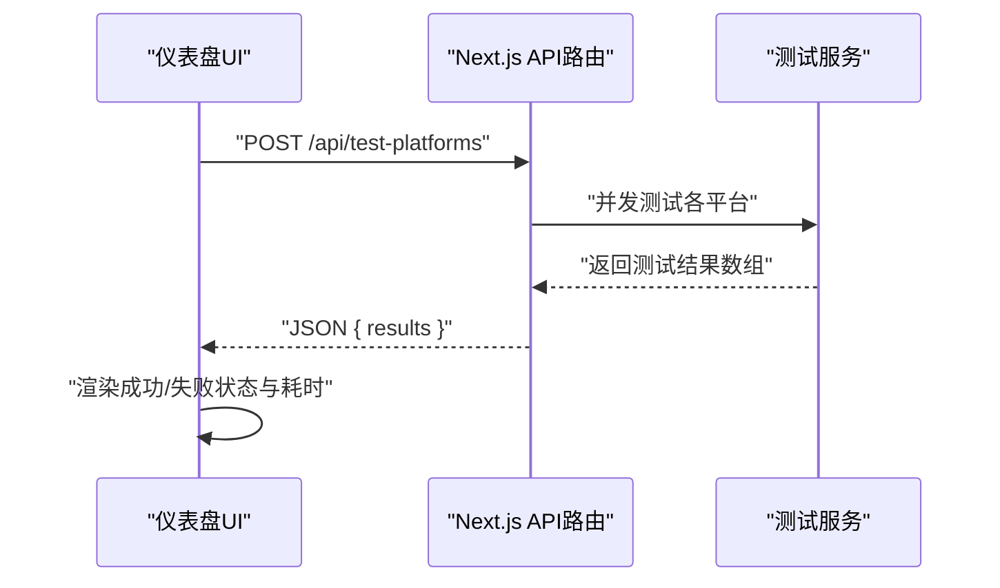
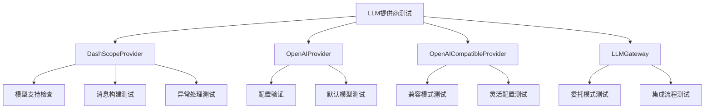
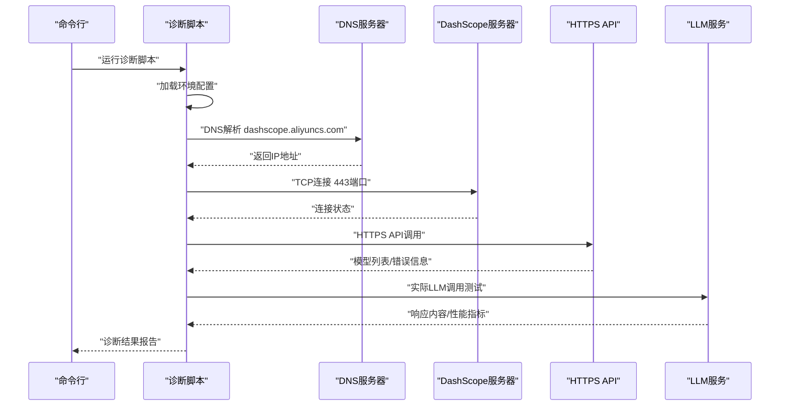
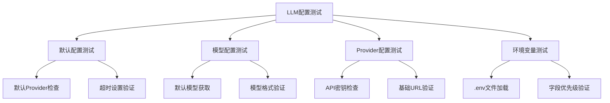
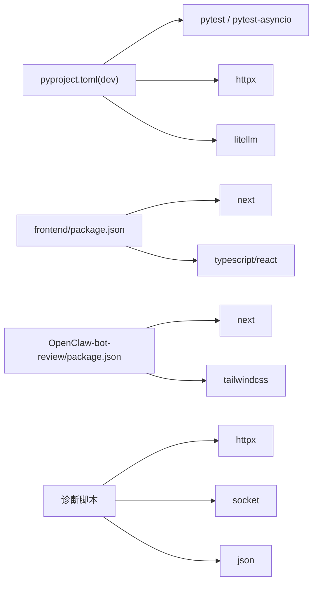
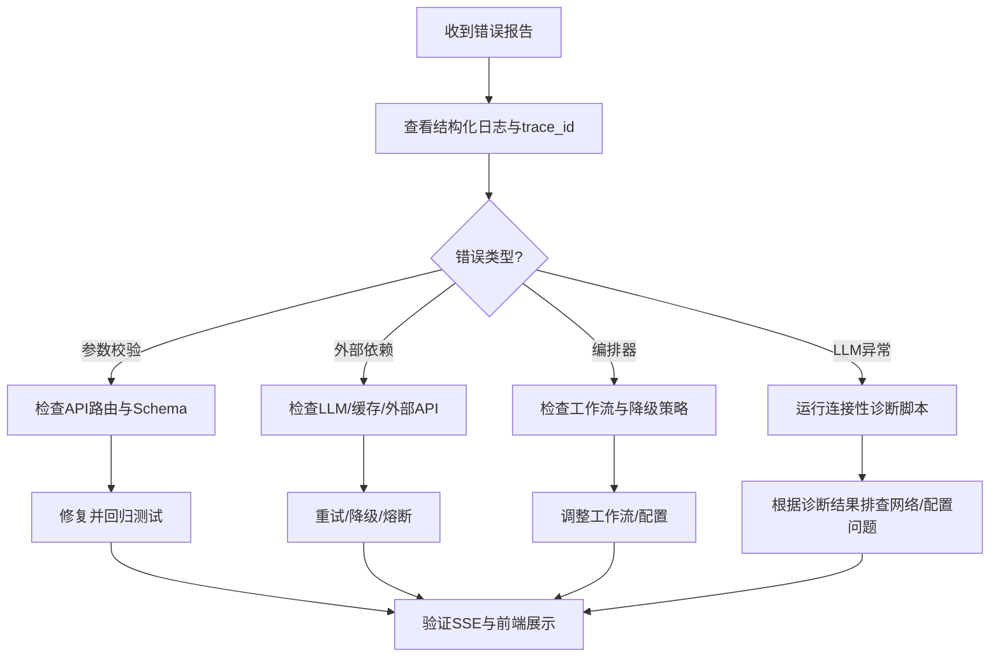

# 测试与调试

<cite>
**本文引用的文件**
- [ARCHITECTURE.md](file://ARCHITECTURE.md)
- [ai_readme.md](file://ai_readme.md)
- [backend/pyproject.toml](file://backend/pyproject.toml)
- [backend/tests/conftest.py](file://backend/tests/conftest.py)
- [backend/tests/test_agent_api.py](file://backend/tests/test_agent_api.py)
- [backend/tests/test_task_api.py](file://backend/tests/test_task_api.py)
- [backend/tests/test_workspace.py](file://backend/tests/test_workspace.py)
- [backend/tests/test_llm_provider.py](file://backend/tests/test_llm_provider.py)
- [backend/scripts/test_dashscope_connectivity.py](file://backend/scripts/test_dashscope_connectivity.py)
- [backend/app/core/config.py](file://backend/app/core/config.py)
- [backend/app/core/logger.py](file://backend/app/core/logger.py)
- [backend/app/core/exceptions.py](file://backend/app/core/exceptions.py)
- [backend/app/core/tracer.py](file://backend/app/core/tracer.py)
- [backend/app/llm/base.py](file://backend/app/llm/base.py)
- [backend/app/llm/config.py](file://backend/app/llm/config.py)
- [backend/app/llm/exceptions.py](file://backend/app/llm/exceptions.py)
- [frontend/package.json](file://frontend/package.json)
- [OpenClaw-bot-review-main/package.json](file://OpenClaw-bot-review-main/package.json)
- [OpenClaw-bot-review-main/README.md](file://OpenClaw-bot-review-main/README.md)
- [OpenClaw-bot-review-main/app/page.tsx](file://OpenClaw-bot-review-main/app/page.tsx)
- [OpenClaw-bot-review-main/app/sessions/page.tsx](file://OpenClaw-bot-review-main/app/sessions/page.tsx)
- [OpenClaw-bot-review-main/app/models/page.tsx](file://OpenClaw-bot-review-main/app/models/page.tsx)
- [OpenClaw-bot-review-main/app/components/agent-card.tsx](file://OpenClaw-bot-review-main/app/components/agent-card.tsx)
- [OpenClaw-bot-review-main/app/api/test-platforms/route.ts](file://OpenClaw-bot-review-main/app/api/test-platforms/route.ts)
- [frontend/app/newsroom/page.tsx](file://frontend/app/newsroom/page.tsx)
</cite>

## 更新摘要
**所做更改**
- 新增LLM提供商单元测试章节，涵盖DashScope、OpenAI、兼容模式提供商的完整测试策略
- 新增连接性诊断脚本章节，提供独立于工作流的模型调用测试方法
- 更新测试配置章节，包含LLM配置管理和异常处理测试
- 完善测试基础设施概述，反映新增的全面测试支持

## 目录
1. [引言](#引言)
2. [项目结构](#项目结构)
3. [核心组件](#核心组件)
4. [架构总览](#架构总览)
5. [详细组件分析](#详细组件分析)
6. [LLM提供商测试](#llm提供商测试)
7. [连接性诊断脚本](#连接性诊断脚本)
8. [测试配置管理](#测试配置管理)
9. [依赖分析](#依赖分析)
10. [性能考量](#性能考量)
11. [故障排查指南](#故障排查指南)
12. [结论](#结论)
13. [附录](#附录)

## 引言
本指南面向HotClaw项目开发者，提供系统化的测试与调试方法论与实操步骤。内容涵盖：
- 后端测试策略：单元测试、集成测试、API测试与覆盖率建议
- LLM提供商测试：全面的LLM供应商单元测试、连接性诊断与配置验证
- 前端测试实践：组件测试、状态管理测试、集成测试与端到端测试思路
- 调试工具与技巧：日志记录、追踪ID传播、性能分析与错误处理
- 持续集成与质量保障：测试运行配置、覆盖率目标与CI流程建议
- 面向开发者的高效工作流：从单测到联调再到CI的闭环

**更新** 新增LLM提供商全面测试基础设施，包括单元测试、连接性诊断脚本和配置管理测试，为新架构提供完整的测试支持。

## 项目结构
HotClaw采用前后端分离架构，后端基于FastAPI，前端采用Next.js。测试与调试相关的关键位置如下：
- 后端测试位于 backend/tests，使用pytest与pytest-asyncio，配合httpx的ASGI客户端
- LLM提供商测试专门文件：backend/tests/test_llm_provider.py
- 连接性诊断脚本：backend/scripts/test_dashscope_connectivity.py
- LLM配置与异常处理：backend/app/llm/
- 前端测试位于 frontend 与 OpenClaw-bot-review-main（仪表盘），分别对应业务前端与监控仪表盘
- 日志、异常与追踪在 backend/app/core 下集中管理
- 架构文档与AI约束说明为测试与调试提供设计依据

**图表来源**
- [backend/tests/test_llm_provider.py:1-551](file://backend/tests/test_llm_provider.py#L1-L551)
- [backend/scripts/test_dashscope_connectivity.py:1-384](file://backend/scripts/test_dashscope_connectivity.py#L1-L384)
- [backend/app/llm/base.py:1-160](file://backend/app/llm/base.py#L1-L160)
- [backend/app/llm/config.py:1-165](file://backend/app/llm/config.py#L1-L165)
- [backend/app/llm/exceptions.py:1-153](file://backend/app/llm/exceptions.py#L1-L153)

**章节来源**
- [ARCHITECTURE.md:1-200](file://ARCHITECTURE.md#L1-L200)
- [backend/pyproject.toml:1-41](file://backend/pyproject.toml#L1-L41)
- [frontend/package.json:1-23](file://frontend/package.json#L1-L23)
- [OpenClaw-bot-review-main/package.json:1-23](file://OpenClaw-bot-review-main/package.json#L1-L23)

## 核心组件
- 测试框架与运行配置
  - 后端：pytest + pytest-asyncio，异步模式自动，测试路径 tests
  - LLM测试：专门的LLM提供商单元测试，覆盖DashScope、OpenAI、兼容模式
  - 连接性诊断：独立脚本测试，无需工作流参与
  - 前端：Next.js应用，可结合E2E工具（如Playwright/Cypress）进行端到端测试
  - 仪表盘：Next.js应用，提供平台连通性测试与会话测试的UI与API
- 日志与追踪
  - 结构化日志：基于structlog，统一输出格式与级别
  - 追踪ID：基于contextvars与nanoid，生成trace_id与task_id，贯穿请求链路
- 错误处理
  - 统一异常基类与分类：用户输入、冲突、外部/执行、配置、系统等错误码
  - LLM专用异常：超时、API错误、配置错误、解析错误、速率限制
  - API层统一错误响应格式，便于测试断言与前端展示

**章节来源**
- [backend/pyproject.toml:38-41](file://backend/pyproject.toml#L38-L41)
- [backend/app/core/logger.py:1-36](file://backend/app/core/logger.py#L1-L36)
- [backend/app/core/tracer.py:1-34](file://backend/app/core/tracer.py#L1-L34)
- [backend/app/core/exceptions.py:1-125](file://backend/app/core/exceptions.py#L1-L125)
- [backend/app/llm/exceptions.py:1-153](file://backend/app/llm/exceptions.py#L1-L153)

## 架构总览
后端采用"网关-编排器-智能体/技能-基础设施"的分层设计，测试应覆盖：
- 网关层：路由、参数校验、SSE健康检查
- 编排器层：工作流执行、上下文传递、降级策略
- 智能体/技能层：结构化输入输出、依赖调用、错误降级
- LLM层：提供商抽象、配置管理、异常处理、连接性诊断
- 基础设施层：数据库、缓存、LLM、日志与追踪

**图表来源**
- [ARCHITECTURE.md:401-540](file://ARCHITECTURE.md#L401-L540)
- [backend/app/core/logger.py:1-36](file://backend/app/core/logger.py#L1-L36)
- [backend/app/core/tracer.py:1-34](file://backend/app/core/tracer.py#L1-L34)
- [backend/app/llm/base.py:74-160](file://backend/app/llm/base.py#L74-L160)

## 详细组件分析

### 后端测试策略与实践
- 单元测试
  - 工作空间与编排：对Workspace的get/set/snapshot与extract_for_agent进行断言
  - 智能体/技能：通过注册中心与依赖注入，模拟Agent/技能行为
  - API测试：使用ASGI客户端，覆盖成功与错误场景（404、422等）
  - 数据库：内存SQLite，自动建表/删表，确保测试隔离
- 集成测试
  - 端到端API测试：完整的工作流调用链路验证
  - 配置测试：LLM配置加载与验证
- 覆盖率建议
  - 建议目标：语句覆盖率≥80%，分支覆盖率≥70%，关键路径与异常分支重点覆盖
  - 关键模块：API路由、编排器、异常处理、日志与追踪、LLM配置

**图表来源**
- [backend/tests/test_agent_api.py:1-28](file://backend/tests/test_agent_api.py#L1-L28)
- [backend/tests/test_task_api.py:1-57](file://backend/tests/test_task_api.py#L1-L57)
- [backend/tests/conftest.py:1-48](file://backend/tests/conftest.py#L1-L48)

**章节来源**
- [backend/tests/test_workspace.py:1-41](file://backend/tests/test_workspace.py#L1-L41)
- [backend/tests/test_agent_api.py:1-28](file://backend/tests/test_agent_api.py#L1-L28)
- [backend/tests/test_task_api.py:1-57](file://backend/tests/test_task_api.py#L1-L57)
- [backend/tests/conftest.py:1-48](file://backend/tests/conftest.py#L1-L48)

### 前端测试实践
- 组件测试
  - 任务运行页、结果页、配置页等页面组件，验证渲染、状态变化与事件触发
- 状态管理测试
  - 使用Zustand Store，断言任务状态流转、节点状态、工作空间快照
- 集成测试
  - SSE事件流：订阅/取消订阅、事件类型与数据结构
  - API调用：任务创建、历史查询、配置读写
- 端到端测试
  - 使用Cypress/Playwright，覆盖从输入账号定位到结果预览的完整流程

**图表来源**
- [ARCHITECTURE.md:325-360](file://ARCHITECTURE.md#L325-L360)
- [frontend/app/newsroom/page.tsx:506-535](file://frontend/app/newsroom/page.tsx#L506-L535)

**章节来源**
- [ARCHITECTURE.md:191-398](file://ARCHITECTURE.md#L191-L398)
- [frontend/package.json:1-23](file://frontend/package.json#L1-L23)

### 仪表盘测试实践（OpenClaw-bot-review）
- 平台连通性测试
  - UI触发"测试平台/会话/模型"，调用相应API，展示结果
- API测试
  - /api/test-platforms、/api/test-sessions、/api/test-session 等端点
- 端到端测试
  - 验证从点击按钮到返回测试结果的完整链路

**图表来源**
- [OpenClaw-bot-review-main/app/page.tsx:414-473](file://OpenClaw-bot-review-main/app/page.tsx#L414-L473)
- [OpenClaw-bot-review-main/app/sessions/page.tsx:236-335](file://OpenClaw-bot-review-main/app/sessions/page.tsx#L236-L335)
- [OpenClaw-bot-review-main/app/models/page.tsx:328-347](file://OpenClaw-bot-review-main/app/models/page.tsx#L328-L347)
- [OpenClaw-bot-review-main/app/api/test-platforms/route.ts:1214-1227](file://OpenClaw-bot-review-main/app/api/test-platforms/route.ts#L1214-L1227)

**章节来源**
- [OpenClaw-bot-review-main/README.md:1-176](file://OpenClaw-bot-review-main/README.md#L1-L176)
- [OpenClaw-bot-review-main/package.json:1-23](file://OpenClaw-bot-review-main/package.json#L1-L23)

## LLM提供商测试

### LLM提供商单元测试策略
HotClaw实现了全面的LLM提供商单元测试，覆盖以下核心组件：

#### DashScopeProvider测试
- **模型支持检查**：验证DashScope特定模型的支持情况
- **消息构建**：测试系统提示词与用户消息的正确组装
- **成功调用**：模拟API响应，验证返回值与token统计
- **异常处理**：测试超时、API错误、配置错误等异常场景
- **配置验证**：确保API密钥和基础URL的有效性

#### OpenAIProvider测试
- **模型兼容性**：验证OpenAI生态模型的支持
- **配置管理**：测试API密钥和基础URL配置
- **默认模型**：验证默认模型选择逻辑

#### OpenAICompatibleProvider测试
- **兼容模式**：支持任意OpenAI兼容的LLM服务
- **灵活配置**：允许空模型名和自定义基础URL
- **跨平台支持**：适配vLLM、Ollama等本地部署方案

#### LLMGateway测试
- **委托模式**：验证Gateway正确委托给具体Provider
- **默认Provider**：测试默认Provider的选择逻辑
- **可用性检查**：验证Provider可用性检测机制
- **集成测试**：模拟完整调用流程，包括ProfileAgent场景

**图表来源**
- [backend/tests/test_llm_provider.py:35-551](file://backend/tests/test_llm_provider.py#L35-L551)

**章节来源**
- [backend/tests/test_llm_provider.py:1-551](file://backend/tests/test_llm_provider.py#L1-L551)
- [backend/app/llm/base.py:74-160](file://backend/app/llm/base.py#L74-L160)
- [backend/app/llm/exceptions.py:1-153](file://backend/app/llm/exceptions.py#L1-L153)

### LLM异常处理测试
- **LLMTimeoutError**：测试超时异常的格式化和细节信息
- **LLMAPIError**：验证API错误的详细状态码和消息
- **LLMConfigurationError**：测试配置错误的字段缺失检测
- **LLMParseError**：验证响应解析错误的原始响应预览
- **LLMRateLimitError**：测试速率限制的重试时间处理
- **异常字典转换**：验证异常对象到字典的序列化

**章节来源**
- [backend/app/llm/exceptions.py:1-153](file://backend/app/llm/exceptions.py#L1-L153)
- [backend/tests/test_llm_provider.py:331-415](file://backend/tests/test_llm_provider.py#L331-L415)

## 连接性诊断脚本

### DashScope连接性诊断工具
HotClaw提供了专门的连接性诊断脚本，可在不启动完整工作流的情况下快速定位LLM调用问题：

#### 诊断功能模块
- **DNS解析测试**：验证域名解析到IP地址的连通性
- **TCP连接测试**：测试443端口的TCP连接状态
- **HTTPS API测试**：验证DashScope API的认证和模型列表获取
- **LLM调用测试**：执行实际的模型调用，获取响应和性能指标
- **多模型格式测试**：测试不同模型格式的兼容性

#### 诊断流程
1. **环境检查**：加载.env配置文件，验证API密钥设置
2. **网络层测试**：依次执行DNS、TCP、HTTPS三层连通性检查
3. **LLM调用测试**：使用指定模型执行简单测试调用
4. **性能分析**：收集响应时间、Token使用量等指标
5. **结果汇总**：生成详细的诊断报告和故障排查建议

**图表来源**
- [backend/scripts/test_dashscope_connectivity.py:303-384](file://backend/scripts/test_dashscope_connectivity.py#L303-L384)

**章节来源**
- [backend/scripts/test_dashscope_connectivity.py:1-384](file://backend/scripts/test_dashscope_connectivity.py#L1-L384)

### 诊断脚本使用方法
- **基本使用**：`cd backend && python scripts/test_dashscope_connectivity.py`
- **模块运行**：`python -m scripts.test_dashscope_connectivity`
- **环境配置**：设置DASHSCOPE_API_KEY和可选的DASHSCOPE_BASE_URL
- **自定义模型**：通过DASHSCOPE_MODEL环境变量指定测试模型

## 测试配置管理

### LLM配置测试
LLM配置管理通过Pydantic设置进行统一管理，测试覆盖以下方面：

#### 配置加载与验证
- **默认配置**：验证默认Provider和超时设置
- **模型获取**：测试不同Provider的默认模型选择
- **配置检查**：验证Provider配置的完整性
- **环境变量支持**：测试.env文件的加载和优先级

#### 配置验证规则
- **Provider验证**：确保默认Provider在允许范围内
- **字段验证**：验证API密钥、基础URL、模型等字段的有效性
- **缓存机制**：测试配置单例和LRU缓存的正确性
- **动态重载**：验证配置重新加载功能

**图表来源**
- [backend/app/llm/config.py:11-165](file://backend/app/llm/config.py#L11-L165)

**章节来源**
- [backend/app/llm/config.py:1-165](file://backend/app/llm/config.py#L1-L165)
- [backend/tests/test_llm_provider.py:455-501](file://backend/tests/test_llm_provider.py#L455-L501)

### 测试夹具与依赖注入
- **数据库夹具**：使用内存SQLite，自动创建和清理测试表
- **HTTP客户端**：ASGI传输层测试客户端，支持依赖覆盖
- **LLM配置夹具**：提供测试专用的LLM配置实例
- **Mock对象**：使用unittest.mock进行外部依赖模拟

**章节来源**
- [backend/tests/conftest.py:1-48](file://backend/tests/conftest.py#L1-L48)
- [backend/tests/test_llm_provider.py:230-325](file://backend/tests/test_llm_provider.py#L230-L325)

## 依赖分析
- 后端依赖
  - FastAPI、SQLAlchemy、pytest、httpx、structlog、nanoid等
  - LLM相关：litellm、pydantic、pydantic-settings等
- 前端依赖
  - Next.js、React、TailwindCSS、TypeScript等
- 仪表盘依赖
  - Next.js、TailwindCSS、无数据库直读配置
- 诊断脚本依赖
  - httpx、socket、json、asyncio等标准库

**图表来源**
- [backend/pyproject.toml:24-29](file://backend/pyproject.toml#L24-L29)
- [backend/pyproject.toml:20](file://backend/pyproject.toml#L20)
- [frontend/package.json:1-23](file://frontend/package.json#L1-L23)
- [OpenClaw-bot-review-main/package.json:1-23](file://OpenClaw-bot-review-main/package.json#L1-L23)

**章节来源**
- [backend/pyproject.toml:1-41](file://backend/pyproject.toml#L1-L41)
- [frontend/package.json:1-23](file://frontend/package.json#L1-L23)
- [OpenClaw-bot-review-main/package.json:1-23](file://OpenClaw-bot-review-main/package.json#L1-L23)

## 性能考量
- 测试性能
  - 使用内存数据库与异步客户端，减少I/O开销
  - 并发测试平台/会话时，合理设置超时与重试
  - LLM测试使用Mock响应，避免真实API调用
- 运行性能
  - SSE事件流按节点粒度推送，避免一次性大包
  - 日志结构化输出，避免频繁格式化
  - 诊断脚本使用异步IO，提高网络测试效率
- 资源限制
  - LLM调用设置超时与重试，防止阻塞
  - 缓存与限流策略在技能层实施
  - 诊断脚本包含速率限制处理

## 故障排查指南
- 日志与追踪
  - 使用结构化日志定位请求上下文，结合trace_id与task_id串联问题
  - 在关键路径（API、编排器、Agent执行）埋点，输出输入/输出与耗时
  - LLM异常包含详细的Provider、模型、Agent ID等上下文信息
- 错误处理
  - 统一异常分类与错误码，API返回一致的错误结构，便于前端提示与测试断言
  - LLM专用异常提供具体的错误类型和解决建议
  - 对外部依赖失败进行降级，保证整体可用性
- 常见问题
  - 404/422：检查路由、参数校验与manifest配置
  - SSE断流：确认编排器广播与前端订阅状态
  - 平台连通性失败：检查网关端口/令牌与外部服务可用性
  - LLM调用失败：使用诊断脚本进行分层网络测试
  - 配置错误：验证.env文件中的API密钥和基础URL设置

**图表来源**
- [backend/app/core/logger.py:1-36](file://backend/app/core/logger.py#L1-L36)
- [backend/app/core/tracer.py:1-34](file://backend/app/core/tracer.py#L1-L34)
- [backend/app/core/exceptions.py:1-125](file://backend/app/core/exceptions.py#L1-L125)
- [backend/app/llm/exceptions.py:1-153](file://backend/app/llm/exceptions.py#L1-L153)

**章节来源**
- [backend/app/core/logger.py:1-36](file://backend/app/core/logger.py#L1-L36)
- [backend/app/core/tracer.py:1-34](file://backend/app/core/tracer.py#L1-L34)
- [backend/app/core/exceptions.py:1-125](file://backend/app/core/exceptions.py#L1-L125)
- [backend/app/llm/exceptions.py:1-153](file://backend/app/llm/exceptions.py#L1-L153)

## 结论
通过统一的日志与追踪、结构化的异常处理、完善的后端与前端测试策略，以及新增的LLM提供商全面测试基础设施，HotClaw能够建立从单测到联调再到CI的高效闭环。新增的LLM提供商单元测试、连接性诊断脚本和配置管理测试，为新架构提供了完整的测试支持，确保LLM集成的稳定性和可靠性。

## 附录

### 测试与调试最佳实践
- 测试用例设计
  - 覆盖成功路径、边界条件与异常路径
  - 使用夹具（fixture）隔离数据库与依赖
  - LLM测试使用Mock对象模拟外部API
- 调试技巧
  - 使用trace_id串联请求链路，结合日志快速定位
  - 在关键节点输出工作空间快照与节点耗时
  - 使用连接性诊断脚本进行分层网络问题排查
- 质量保障
  - CI中执行pytest与覆盖率检查，失败即阻断
  - 前端与仪表盘增加E2E测试，覆盖核心用户路径
  - LLM测试定期运行，确保提供商配置的持续有效性

**章节来源**
- [ai_readme.md:1-24](file://ai_readme.md#L1-L24)
- [ARCHITECTURE.md:1-200](file://ARCHITECTURE.md#L1-L200)
- [backend/tests/test_llm_provider.py:1-551](file://backend/tests/test_llm_provider.py#L1-L551)
- [backend/scripts/test_dashscope_connectivity.py:1-384](file://backend/scripts/test_dashscope_connectivity.py#L1-L384)