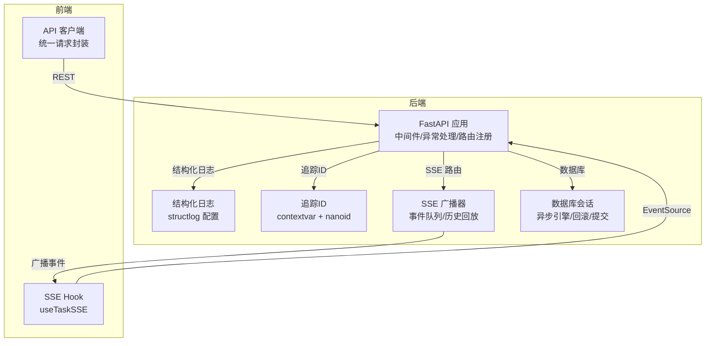
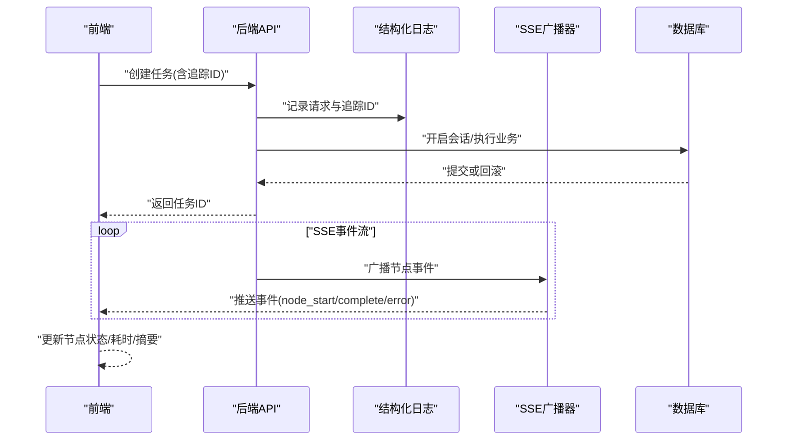
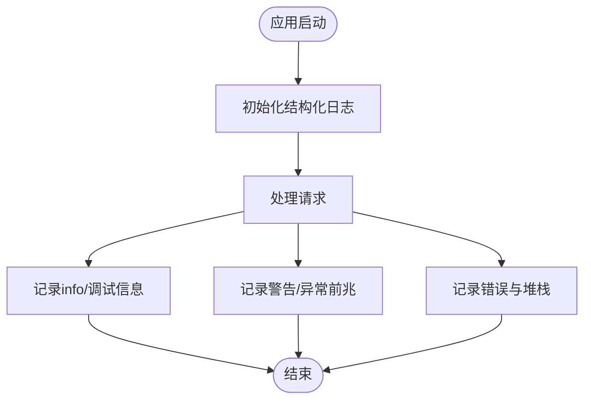
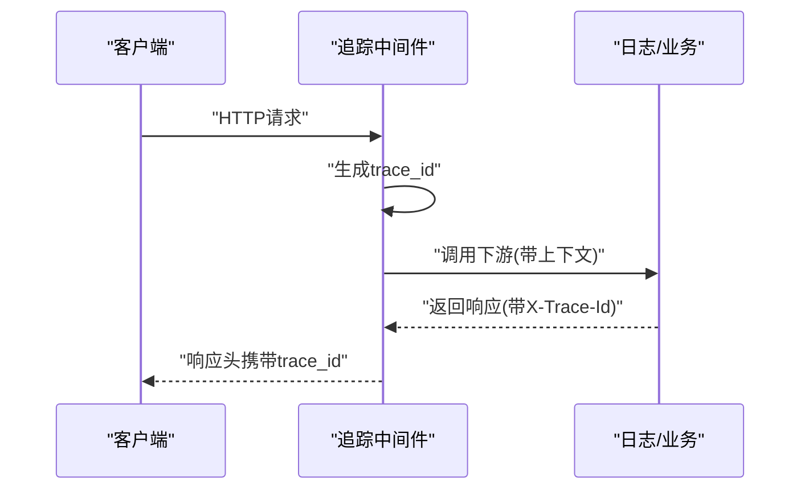
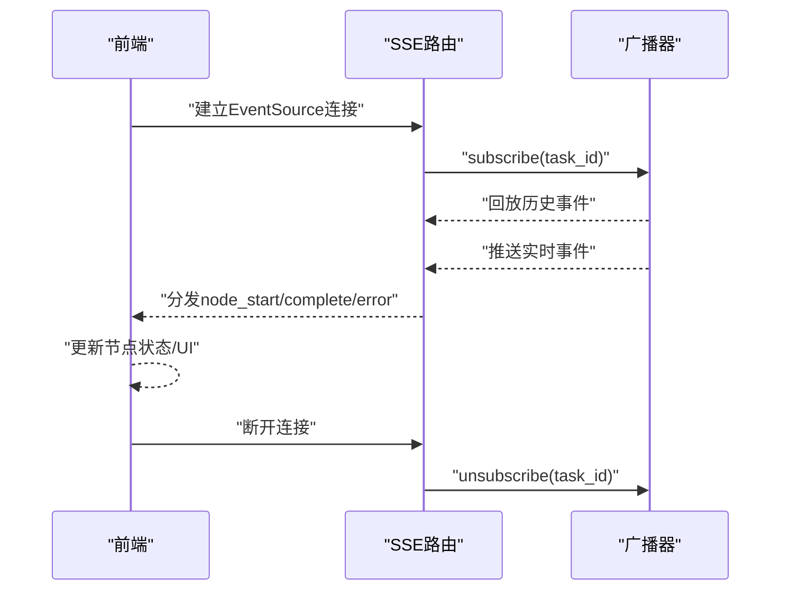
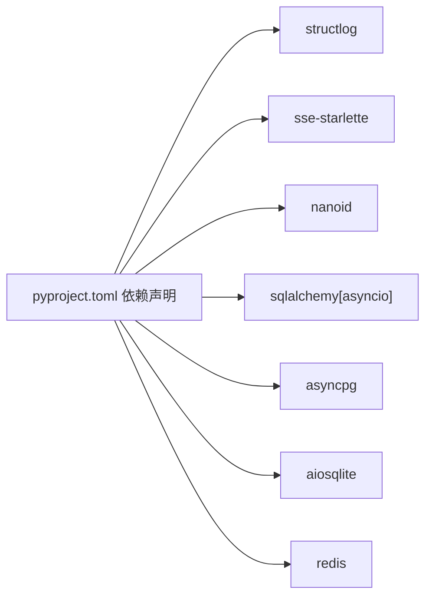

# 调试工具与技巧

<cite>
**本文引用的文件**
- [backend/app/main.py](file://backend/app/main.py)
- [backend/app/core/logger.py](file://backend/app/core/logger.py)
- [backend/app/core/tracer.py](file://backend/app/core/tracer.py)
- [backend/app/core/config.py](file://backend/app/core/config.py)
- [backend/app/db/session.py](file://backend/app/db/session.py)
- [backend/app/api/stream_routes.py](file://backend/app/api/stream_routes.py)
- [backend/app/orchestrator/broadcaster.py](file://backend/app/orchestrator/broadcaster.py)
- [frontend/hooks/useTaskSSE.ts](file://frontend/hooks/useTaskSSE.ts)
- [frontend/lib/api.ts](file://frontend/lib/api.ts)
- [backend/pyproject.toml](file://backend/pyproject.toml)
</cite>

## 目录
1. [简介](#简介)
2. [项目结构](#项目结构)
3. [核心组件](#核心组件)
4. [架构总览](#架构总览)
5. [详细组件分析](#详细组件分析)
6. [依赖分析](#依赖分析)
7. [性能考虑](#性能考虑)
8. [故障排查指南](#故障排查指南)
9. [结论](#结论)
10. [附录](#附录)

## 简介
本文件面向HotClaw项目的开发者，系统性梳理后端日志与追踪、实时通信（SSE）与前端事件流、数据库与会话调试、以及前后端联调与性能定位的方法论与实操建议。内容基于仓库中实际实现，覆盖从配置到运行时的关键调试点，并提供可复用的调试流程与图示。

## 项目结构
HotClaw采用前后端分离：后端为FastAPI应用，负责任务编排、SSE广播与数据访问；前端通过React Hooks订阅SSE并渲染任务节点状态。关键调试相关模块分布如下：
- 后端
  - 应用入口与中间件：应用生命周期、CORS、全局异常处理、追踪ID注入
  - 日志与追踪：结构化日志、追踪ID上下文
  - 实时通信：SSE路由与广播器
  - 数据库：异步引擎与会话工厂
- 前端
  - SSE Hook：事件监听、状态聚合
  - API客户端：统一错误码校验与URL拼装

图表来源
- [backend/app/main.py:60-142](file://backend/app/main.py#L60-L142)
- [backend/app/core/logger.py:8-36](file://backend/app/core/logger.py#L8-L36)
- [backend/app/core/tracer.py:10-34](file://backend/app/core/tracer.py#L10-L34)
- [backend/app/orchestrator/broadcaster.py:11-94](file://backend/app/orchestrator/broadcaster.py#L11-L94)
- [backend/app/db/session.py:8-33](file://backend/app/db/session.py#L8-L33)
- [frontend/hooks/useTaskSSE.ts:28-124](file://frontend/hooks/useTaskSSE.ts#L28-L124)
- [frontend/lib/api.ts:14-24](file://frontend/lib/api.ts#L14-L24)

章节来源
- [backend/app/main.py:60-142](file://backend/app/main.py#L60-L142)
- [frontend/hooks/useTaskSSE.ts:28-124](file://frontend/hooks/useTaskSSE.ts#L28-L124)

## 核心组件
- 结构化日志系统
  - 使用structlog，输出JSON格式，包含时间戳、级别、堆栈信息等，便于集中采集与检索
  - 日志级别由配置项控制，支持在开发环境开启更详细输出
- 追踪ID传播
  - 每个HTTP请求生成唯一trace_id，注入响应头，贯穿后续日志与事件
  - 提供task_id生成与获取，便于任务级关联
- SSE实时通信
  - SSE路由按任务ID分发事件，广播器维护订阅队列与历史回放
  - 前端Hook监听节点开始/完成/失败、任务完成/错误等事件
- 数据库调试
  - 异步SQLAlchemy引擎，开发模式下开启echo，自动回滚与提交
  - 支持连接池预热与SQLite/PostgreSQL差异

章节来源
- [backend/app/core/logger.py:8-36](file://backend/app/core/logger.py#L8-L36)
- [backend/app/core/tracer.py:10-34](file://backend/app/core/tracer.py#L10-L34)
- [backend/app/api/stream_routes.py:14-43](file://backend/app/api/stream_routes.py#L14-L43)
- [backend/app/orchestrator/broadcaster.py:30-85](file://backend/app/orchestrator/broadcaster.py#L30-L85)
- [backend/app/db/session.py:8-33](file://backend/app/db/session.py#L8-L33)

## 架构总览
以下序列图展示一次任务执行的端到端调试路径：前端发起任务，后端生成追踪ID并写入日志，SSE广播事件，前端接收并更新UI，数据库事务按需回滚/提交。

图表来源
- [backend/app/main.py:77-84](file://backend/app/main.py#L77-L84)
- [backend/app/core/logger.py:33-36](file://backend/app/core/logger.py#L33-L36)
- [backend/app/orchestrator/broadcaster.py:57-68](file://backend/app/orchestrator/broadcaster.py#L57-L68)
- [backend/app/db/session.py:22-33](file://backend/app/db/session.py#L22-L33)
- [frontend/hooks/useTaskSSE.ts:65-111](file://frontend/hooks/useTaskSSE.ts#L65-L111)

## 详细组件分析

### 日志记录系统
- 结构化输出
  - 使用JSONRenderer输出，字段包含时间戳、级别、位置、异常堆栈等
  - 通过TimeStamper与StackInfoRenderer提升可观测性
- 级别与配置
  - 读取配置中的log_level，开发环境可提高详细度
- 使用建议
  - 在关键路径打点：请求进入/退出、数据库操作、SSE广播、异常捕获
  - 统一携带trace_id，便于跨服务串联

图表来源
- [backend/app/core/logger.py:8-36](file://backend/app/core/logger.py#L8-L36)
- [backend/app/core/config.py:39-41](file://backend/app/core/config.py#L39-L41)

章节来源
- [backend/app/core/logger.py:8-36](file://backend/app/core/logger.py#L8-L36)
- [backend/app/core/config.py:39-41](file://backend/app/core/config.py#L39-L41)

### 追踪ID传播机制
- 请求级追踪
  - 中间件为每个请求生成trace_id并注入响应头，同时设置到上下文变量
- 任务级追踪
  - 提供task_id生成与获取接口，用于任务维度的事件关联
- 日志与事件
  - 所有日志与广播事件应携带trace_id/task_id，确保端到端可追踪

图表来源
- [backend/app/main.py:77-84](file://backend/app/main.py#L77-L84)
- [backend/app/core/tracer.py:10-34](file://backend/app/core/tracer.py#L10-L34)
- [backend/app/core/logger.py:33-36](file://backend/app/core/logger.py#L33-L36)

章节来源
- [backend/app/main.py:77-84](file://backend/app/main.py#L77-L84)
- [backend/app/core/tracer.py:10-34](file://backend/app/core/tracer.py#L10-L34)

### 实时通信调试（SSE）
- 后端
  - SSE路由按任务ID订阅事件队列，超时发送keepalive注释，断开自动清理
  - 广播器对每个任务维护订阅者列表与历史消息，支持“晚到订阅”重放
- 前端
  - Hook监听节点开始/完成/失败、任务完成/错误事件，聚合节点状态
  - 断线时关闭连接，错误时显示并关闭

图表来源
- [backend/app/api/stream_routes.py:14-43](file://backend/app/api/stream_routes.py#L14-L43)
- [backend/app/orchestrator/broadcaster.py:30-45](file://backend/app/orchestrator/broadcaster.py#L30-L45)
- [frontend/hooks/useTaskSSE.ts:62-120](file://frontend/hooks/useTaskSSE.ts#L62-L120)

章节来源
- [backend/app/api/stream_routes.py:14-43](file://backend/app/api/stream_routes.py#L14-L43)
- [backend/app/orchestrator/broadcaster.py:30-85](file://backend/app/orchestrator/broadcaster.py#L30-L85)
- [frontend/hooks/useTaskSSE.ts:28-124](file://frontend/hooks/useTaskSSE.ts#L28-L124)

### 前端调试技巧（React/网络）
- React DevTools
  - 使用组件树与状态面板检查节点状态是否按预期流转
  - 关注useTaskSSE返回值（nodes/taskDone/taskError/reset）的变化
- 状态管理调试
  - 将初始节点状态与事件映射对齐，核对事件名与字段一致性
- 网络请求分析
  - 统一通过API客户端封装，错误码非0即抛错，便于快速定位
  - 可在浏览器Network面板观察SSE连接与REST请求，关注断开与重连行为

章节来源
- [frontend/hooks/useTaskSSE.ts:28-124](file://frontend/hooks/useTaskSSE.ts#L28-L124)
- [frontend/lib/api.ts:14-24](file://frontend/lib/api.ts#L14-L24)

### 后端调试方法（FastAPI/数据库/性能）
- FastAPI调试模式
  - 开启app_debug后，数据库引擎echo开启，便于查看SQL语句
  - 全局异常处理器将HotClawError映射为合理HTTP状态码
- 数据库查询调试
  - 会话工厂在异常时自动回滚，避免脏数据；成功则提交
  - SQLite与PostgreSQL差异：后者启用pool_pre_ping
- 性能瓶颈定位
  - 利用结构化日志记录关键阶段耗时与事件
  - SSE广播器对历史事件进行缓冲与清理，避免内存泄漏

章节来源
- [backend/app/core/config.py:34-45](file://backend/app/core/config.py#L34-L45)
- [backend/app/main.py:88-129](file://backend/app/main.py#L88-L129)
- [backend/app/db/session.py:8-33](file://backend/app/db/session.py#L8-L33)
- [backend/app/orchestrator/broadcaster.py:78-84](file://backend/app/orchestrator/broadcaster.py#L78-L84)

## 依赖分析
后端依赖中与调试直接相关的关键包：
- structlog：结构化日志
- sse-starlette：SSE实现
- nanoid：短ID生成
- sqlalchemy[asyncio]/aiosqlite/asyncpg：异步数据库访问
- redis：缓存/队列（可用于扩展追踪链路）

图表来源
- [backend/pyproject.toml:6-22](file://backend/pyproject.toml#L6-L22)

章节来源
- [backend/pyproject.toml:6-22](file://backend/pyproject.toml#L6-L22)

## 性能考虑
- 日志开销
  - 生产环境建议使用较高日志级别，避免过多JSON序列化
- SSE与广播
  - 广播器对历史事件进行清理，防止长期运行内存膨胀
- 数据库
  - 开发模式开启echo便于诊断，生产关闭以减少IO开销
- 连接池
  - PostgreSQL启用pool_pre_ping，SQLite不支持该参数

章节来源
- [backend/app/orchestrator/broadcaster.py:78-84](file://backend/app/orchestrator/broadcaster.py#L78-L84)
- [backend/app/db/session.py:8-13](file://backend/app/db/session.py#L8-L13)

## 故障排查指南
- 无法收到SSE事件
  - 检查SSE路由是否正确订阅任务ID，确认广播器未提前关闭
  - 观察前端onerror回调与断开逻辑，必要时增加重连策略
- 任务状态不同步
  - 对照INITIAL_NODES与事件名，确保事件类型与字段一致
  - 核查事件顺序：node_start → node_complete/error → task_complete/error
- 日志缺失或级别过低
  - 检查log_level配置，必要时临时提升为DEBUG/INFO
  - 确认trace_id是否出现在日志中，以便跨组件串联
- 数据库异常
  - 查看是否触发回滚，确认异常是否被捕获并上报
  - 开发模式下观察SQL输出，定位慢查询或重复查询
- 追踪ID无效
  - 确认中间件已注入X-Trace-Id，且后续日志均携带该ID
  - 若跨服务，确保上游透传trace_id

章节来源
- [backend/app/api/stream_routes.py:18-42](file://backend/app/api/stream_routes.py#L18-L42)
- [frontend/hooks/useTaskSSE.ts:65-111](file://frontend/hooks/useTaskSSE.ts#L65-L111)
- [backend/app/core/logger.py:10-30](file://backend/app/core/logger.py#L10-L30)
- [backend/app/db/session.py:22-33](file://backend/app/db/session.py#L22-L33)
- [backend/app/main.py:77-84](file://backend/app/main.py#L77-L84)

## 结论
通过结构化日志、追踪ID与SSE广播三者的协同，HotClaw实现了端到端可观测与可调试能力。结合FastAPI的异常处理与数据库会话管理，开发者可在本地与生产环境中高效定位问题。建议在日常开发中：
- 默认开启DEBUG级别的日志与数据库echo（开发）
- 使用trace_id串联所有关键路径
- 用SSE事件驱动前端状态，严格对齐事件模型
- 建立统一的错误码与响应格式，简化前端诊断

## 附录
- 快速检查清单
  - 日志：是否包含trace_id；级别是否足够
  - SSE：订阅是否成功；事件是否按序到达
  - 数据库：是否自动回滚/提交；是否存在慢查询
  - 异常：全局处理器是否正确映射错误码